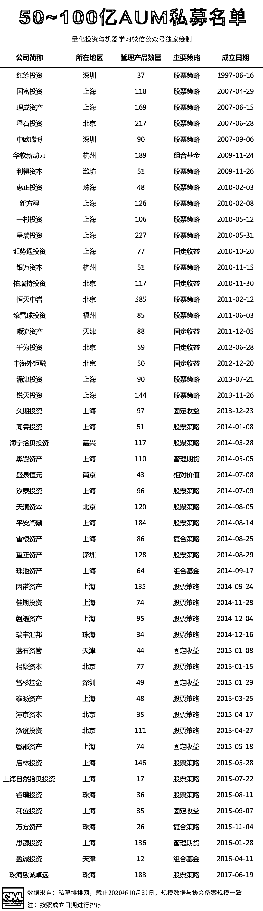
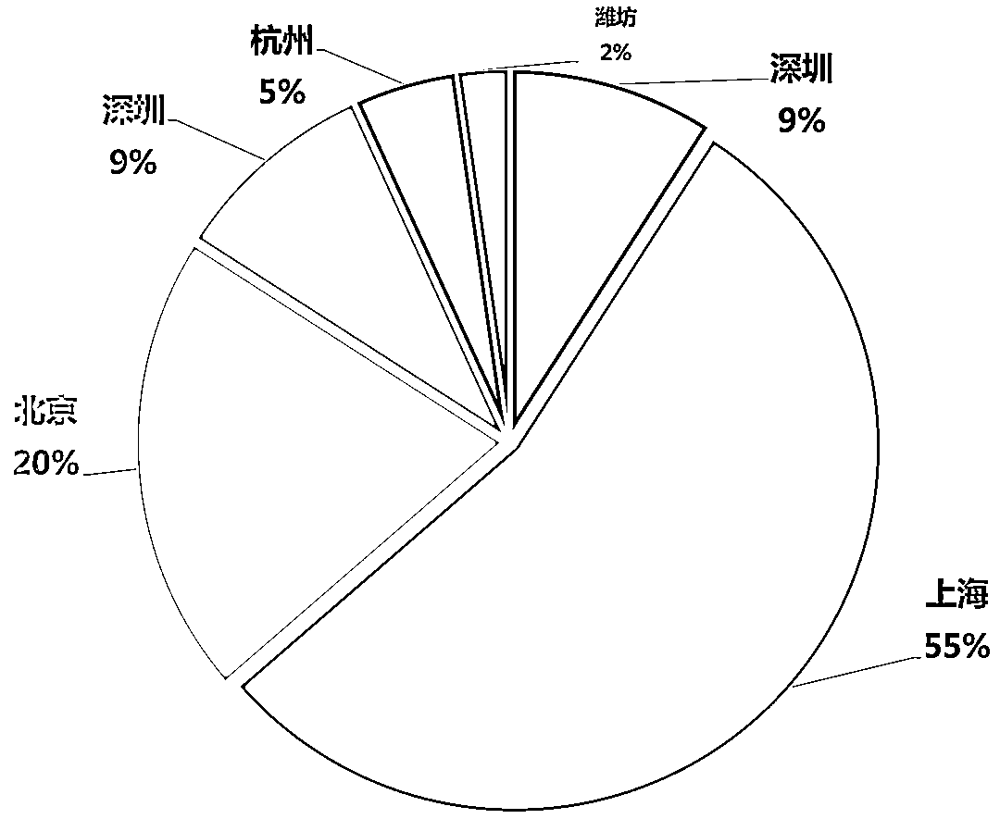
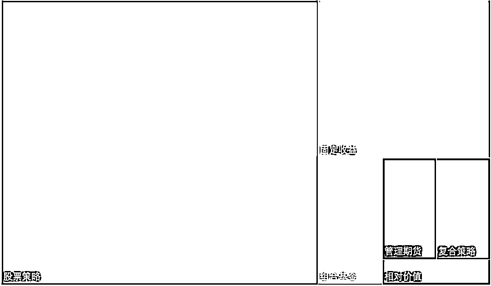

# 那些即将超过百亿的中国私募！

> 原文：[`mp.weixin.qq.com/s?__biz=MzAxNTc0Mjg0Mg==&mid=2653307505&idx=1&sn=a87328d68b4e424a95d296e87963c08e&chksm=802d8064b75a09722d005d0e31d63b7aeae5a0d5003c5a9de2afc57804a824fbce28a18b091b&scene=27#wechat_redirect`](http://mp.weixin.qq.com/s?__biz=MzAxNTc0Mjg0Mg==&mid=2653307505&idx=1&sn=a87328d68b4e424a95d296e87963c08e&chksm=802d8064b75a09722d005d0e31d63b7aeae5a0d5003c5a9de2afc57804a824fbce28a18b091b&scene=27#wechat_redirect)

**全网 TOP 量化自媒体**

当所有人都在讨论百亿私募（中国）的时候，我们也应该看看 AUM 在 50-100 的优秀私募。

未来，也许在这个名单里，会有很多机构跻身百亿私募的行列。让我们拭目以待！

地域分布情况：

主要策略占比：

**更多私募系列文章：**  

量化投资与机器学习微信公众号，是业内垂直于**Quant****、Fintech、AI、ML**等领域的**量化类主流自媒体。**公众号拥有来自**公募、私募、券商、期货、银行、保险、资管**等众多圈内**18W+**关注者。每日发布行业前沿研究成果和最新量化资讯。