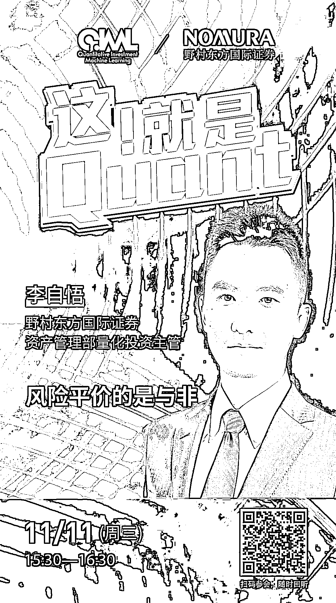

# 野村东方国际证券：风险平价的是与非

> 原文：[`mp.weixin.qq.com/s?__biz=MzAxNTc0Mjg0Mg==&mid=2653307485&idx=1&sn=109cf30074da600f3921abd61823a314&chksm=802d8048b75a095e695baea9618091d4aabc24f6e2dffdd8ba2910de50a2f75d7ad1510ab050&scene=27#wechat_redirect`](http://mp.weixin.qq.com/s?__biz=MzAxNTc0Mjg0Mg==&mid=2653307485&idx=1&sn=109cf30074da600f3921abd61823a314&chksm=802d8048b75a095e695baea9618091d4aabc24f6e2dffdd8ba2910de50a2f75d7ad1510ab050&scene=27#wechat_redirect)

***1***

**关于野村东方国际证券 **

野村东方国际证券有限公司于 2019 年 3 月由中国证监会核准设立，2019 年 11 月获得经营证券业务许可证，是 2018 年 4 月 28 日中国证监会公布《外商投资证券公司管理办法》后，首批获准设立的外资控股证券公司之一。野村集团将野村东方国际证券定位为除日本之外亚洲地区的核心平台。公司将在中国资本市场变革和证券行业创新的新时代把握机遇、结合控股股东野村集团的核心优势，贯彻和客户共同成长的公司理念，为中国投资者提供专业可信赖的综合金融服务，力争成为外资控股券商的“经营典范”。

***2***

**主讲嘉宾介绍**

**李自悟** |野村东方国际证券，资产管理部量化投资主管

新加坡国立大学经济学学士，美国加州大学伯克利分校金融工程学硕士。历任均直资产管理有限公司基金经理量化交易主管，国家外汇管理局中央外汇业务中心投资部基金经理，美国贝莱德集团量化股票投资部研究员。主要研究方向包括多因子和量化大类资产配置策略，有丰富的大资金管理经验。

***3***

**嘉宾互动环节**

本次网络直播会议将设置：**读者问答环节**。大家如有问题向嘉宾提问，请**扫码下方二维码**填写问卷。我们将根据问题质量，选择性在直播中进行回答。欢迎大家踊跃提问哦！  

***4***

**如何参会？**

**扫码下方海报二维码**

或**点击阅读原文**

即可收听！

量化投资与机器学习微信公众号，是业内垂直于**Quant****、Fintech、AI、ML**等领域的**量化类主流自媒体。**公众号拥有来自**公募、私募、券商、期货、银行、保险、资管**等众多圈内**18W+**关注者。每日发布行业前沿研究成果和最新量化资讯。