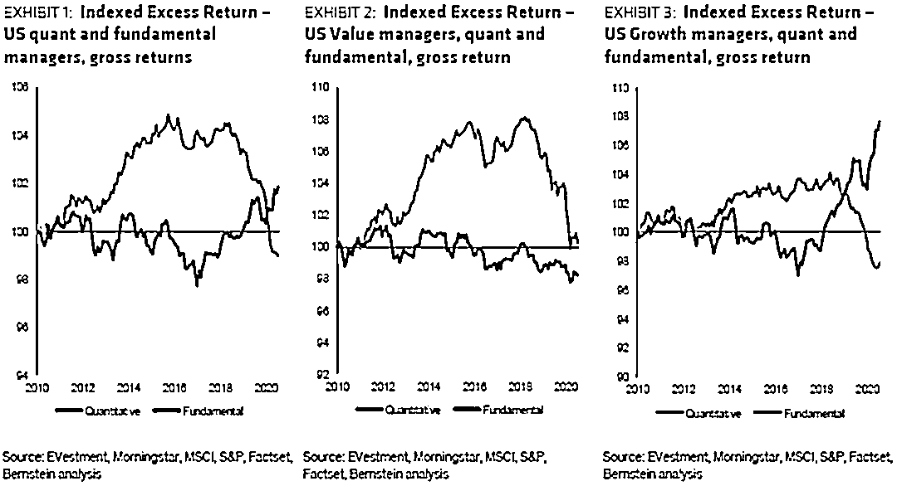
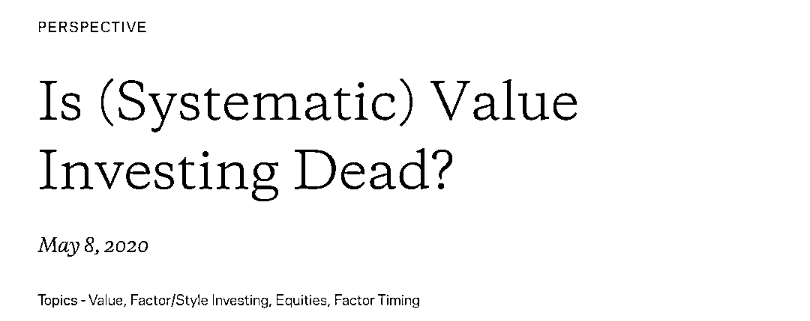
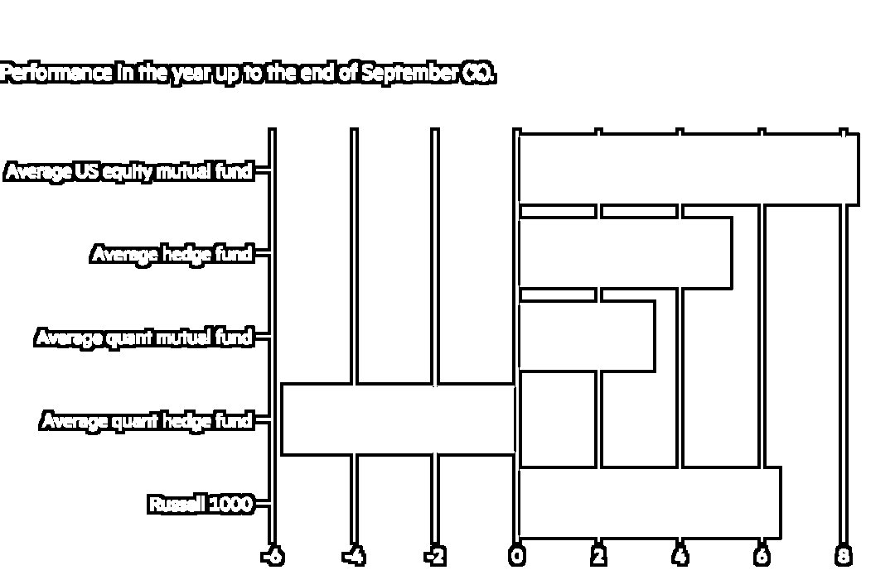

# 价值不易！Quant 不易！

> 原文：[`mp.weixin.qq.com/s?__biz=MzAxNTc0Mjg0Mg==&mid=2653307395&idx=1&sn=8cdc9a85d01cd89acfc9cd6f9e9563f3&chksm=802d8016b75a0900071c67427cc5a65d1c35c66fc3279db8bca2ad59fc0f129ea40f3cfc7a19&scene=27#wechat_redirect`](http://mp.weixin.qq.com/s?__biz=MzAxNTc0Mjg0Mg==&mid=2653307395&idx=1&sn=8cdc9a85d01cd89acfc9cd6f9e9563f3&chksm=802d8016b75a0900071c67427cc5a65d1c35c66fc3279db8bca2ad59fc0f129ea40f3cfc7a19&scene=27#wechat_redirect)

**全网 TOP 量化自媒体**

**价值不易**

**价值因子**是经济学家发现的几个主要因子（Factor）之一，从长期来看，这些因子往往会带来高于平均水平的收益。它们本质上是根据一些特征对股票进行分类，比如规模、资产负债表的公司健康程度。在过去 20 年里，由计算机驱动、算法驱动的量化投资行业发展迅猛，而系统性地挖掘因子正是这个行业的核心。所谓我们常说的 Factor Zoo 或者 Factor War。

数据来自：彭博

在 1.9 万亿美元的因子策略中，贝莱德将该行业划分为**专有因子**（1 万亿美元）、**增强因子**（存在于对冲基金中，2090 亿美元）和 7290 亿美元的**Smart Beta**中：

数据来自：贝莱德

同时，价值因子表现不佳在近期也是频频出现。不知还有多少基于价值因子的策略人们还在苦苦挣扎。同样，对于一些量化分析师来说，这足以让他们质疑自己。

数据来自：TCI

**《为什么我不再是一个量化分析师》**，这是 Bernstein 的量化策略主管 Inigo Fraser-Jenkins 最近发表的一份颇具争议的报告的标题。他认为，像他这样的宽客的原罪在于，他们挖掘历史数据，寻找长期有效的线索，但却掩盖了市场机制的事实。这可能意味着过去有效的方法在未来可能失败。量化投资的核心是将回测试应用于未来的投资决策。但是，如果规则改变了，进行量研究和回测意味着什么呢？

简而言之，Fraser-Jenkins 认为，均值回归的核心理念是：市场模式最终将自我恢复，找到自己新的定位，但可能会在这种新体制下它已经消亡。以价值为导向的量化对冲基金 AJO Partners 在最近关闭了旗下对冲基金 AJO，创始人 Ted Aronson 表示：“这种方式可以持续好几年、甚至几十年，直到那只看不见的手打了你一巴掌，说：‘这种方式在过去行得通，但现在行不通了！不行了！再也不行了’。”

**来说说 AJO Partners！**

AJO Partners 成立于 1984 年，在 2007 年的巅峰时期管理着逾 300 亿美元的资产。目前，管理着 100 亿美元资产的 AJO Partners 在近期表示，其计划在今年年底关闭，并将资金返还给客户。

截至 9 月底，AJO Partners 旗下的 AJO 下跌了 15.5% ，落后于基准。AJO 该公司规模最大的一只基金，资产规模约为 51 亿美元。

Aronson 表示：价值基金表现不佳是其主要原因。原话是：*“The drought in value — the longest on record — is at the heart of our challenge. The length and the severity of the headwinds have led to lingering viability concerns among clients, consultants, and employees.”*

数据来自：Brewin Dolphin

罗素 1000 价值指数今年已下跌 10%，相比之下，罗素增长指数在 2020 年上涨了近 30%：

数据来自：彭博

数据来自：Refinitiv

过去 10 年，美国成长型股票的涨幅已超过 300% ，是价值型股票回报率的 3 倍。

数据来自：美国银行

法国兴业银行量化研究主管 Andrew Lapthorne 表示：我们必须清楚，价值策略的表示是 100 年来最差的。但更重要的是，我们要努力理解是哪里出了问题。

Lapthorne 表示，其根本原因在于：**廉价的股票目前保持低价甚至会变得更加便宜，因为它们往往出现在经济敏感性更强的行业，而且总体而言，自 2008 年金融危机以来，全球经济增长乏力。与此同时，不断下跌的债券收益率正迫使投资者投资于科技等领域价格昂贵且增长较快的股票。**

还有以一些人指责衡量股票价值的方法已过时。从历史上看，主要的做法是将股价与公司的账面价值（book value）进行比较，账面价值是是企业资产负债表上体现的企业全部资产(扣除折旧、损耗和摊销)与企业全部负债之间的差额。然而，这一指标不包括品牌和知识产权等无形资产。如今，这些无形资产在一家公司的价值中所占的比例，往往超过了有形资产。

研究机构 Research Affiliates 的一篇论文指出：**鉴于无形资产在公司总资本中的重要性日益增加，所以增加无形资产的计算可以更全面地衡量公司资本**。正如购房者会考虑附件学区房一样，投资者也应该考虑一些短暂但重要的因素。

然而，Dimensional Fund Advisors 的研究主管 Savina Rizova 发现情况恰恰相反：**无形资产很难精确估值，它们带来的噪音实际上是无益的！**

与此同时，AQR 也对各种各样的解释提出了质疑。比如科技股长期牛市、无形资产或少数占据主导地位的“特大型资产”的出现等，即使将这些因素考虑在内，价值表现不佳的情况在历史上仍然极为严重。主要原因很简单，投资者为自己喜欢的股票支付更高的价格，却史无前例地回避自己讨厌的股票。

还有一个问题是：**价值能否卷土重来？**

高盛全球股票策略首席分析师 Peter Oppenheimer 认为：至少暂时的缓解很快就会到来，特别是如果新冠肺炎的疫苗出现能推动债券收益率的话。

Centerstone Investors 的 Abhay Deshpande 认为：持久的复兴在某种程度上是不可避免的。历史表明，价值投资者遭受的痛苦越多，复苏的力度就越大。

**Quant 也不易！**

总体上来说，量化分析师的处境也不是特别好。根据美国银行的数据显示，在截至 9 月底（近一年），美股量化 mutual funds 平均涨幅仅为 3.3%，相比之下，stockpicker 的平均涨幅为 8.3%，罗素 1000 指数的平均回收益为 6.4%。

数据来自：Nomura

根据 Aurum 的数据显示，截至 8 月底（近一年，按资产加权计算），量化对冲基金平均亏损 5.7% ，而对冲基金平均盈利 5.2% 。事实上，Aurum 表示，最受欢迎的量化策略的 3 个月滚动表现与 2007 年 8 月的**Quant Quake**及随后的金融危机一样糟糕，甚至更糟。

数据来自：Nomura、美国银行

关于 Quant Quake 的详细内容，公众号将在下周有一个全面的介绍。尽情期待！

如果有人宣称，量化投资的已步入黄昏，那这个人是真牛掰

现如今，整个资管行业在不同程度上都受到了量化投资在某种方式的驱动。**这种趋势在未来几年只可能加速，不可能减速！**

**Quant 们加油啊！**

综合：彭博、金融时报 

量化投资与机器学习微信公众号，是业内垂直于**Quant****、Fintech、AI、ML**等领域的**量化类主流自媒体。**公众号拥有来自**公募、私募、券商、期货、银行、保险、资管**等众多圈内**18W+**关注者。每日发布行业前沿研究成果和最新量化资讯。