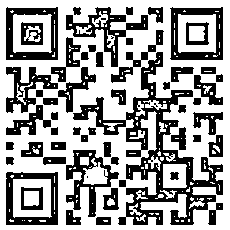
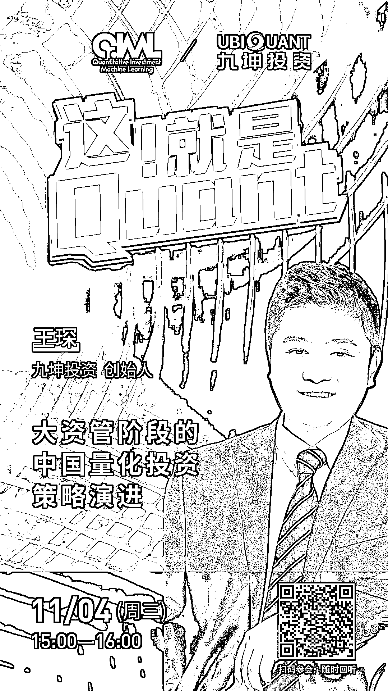

# 九坤：大资管阶段的中国量化投资策略演进

> 原文：[`mp.weixin.qq.com/s?__biz=MzAxNTc0Mjg0Mg==&mid=2653307312&idx=1&sn=51455e46efc0fee37f7f6dd8fc92b053&chksm=802d83a5b75a0ab3b97beaf12f49bb5ae441b56351b99378f8b12f70ab33208cbf39c3a30c3b&scene=27#wechat_redirect`](http://mp.weixin.qq.com/s?__biz=MzAxNTc0Mjg0Mg==&mid=2653307312&idx=1&sn=51455e46efc0fee37f7f6dd8fc92b053&chksm=802d83a5b75a0ab3b97beaf12f49bb5ae441b56351b99378f8b12f70ab33208cbf39c3a30c3b&scene=27#wechat_redirect)

***1***

**关于九坤**

九坤投资（北京）有限公司是国内成立最早、投资管理经验丰富的多策略量化私募基金管理人之一，现资产管理规模超过百亿人民币。公司创始人自 2008 年开始从事量化投资交易，2012 年九坤投资（北京）有限公司正式成立，2014 年公司获得“私募证券投资基金管理人”资格。公司现有策略较丰富全面，其策略投资周期覆盖高频交易、日内交易以及跨日低频交易，投资标的覆盖中国股票、期货、债券市场。2016 年至 2019 年连续四年荣获私募行业最高奖项——私募金牛奖。 

公司投研和技术团队核心成员毕业于清华、北大以及常春藤联盟院校，且拥有硕士以上学历。作为同时富有华尔街对冲基金、顶级互联网行业背景成员的团队，九坤投资具有完备的量化投研体系，和强大的自主开发高性能软硬件交易系统的能力。

***2***

****嘉宾互动环节****

本次网络直播会议将设置：**读者问答环节**。大家如有问题向嘉宾提问，请**扫码下方二维码**填写问卷。我们将根据问题质量，选择性在直播中进行回答。欢迎大家踊跃提问哦！

****

*****3*****

****如何参会？****

****扫码下方海报二维码****

**或**点击阅读原文****

**即可收听！**

****

**量化投资与机器学习微信公众号，是业内垂直于**Quant****、Fintech、AI、ML**等领域的**量化类主流自媒体。**公众号拥有来自**公募、私募、券商、期货、银行、保险、资管**等众多圈内**18W+**关注者。每日发布行业前沿研究成果和最新量化资讯。**