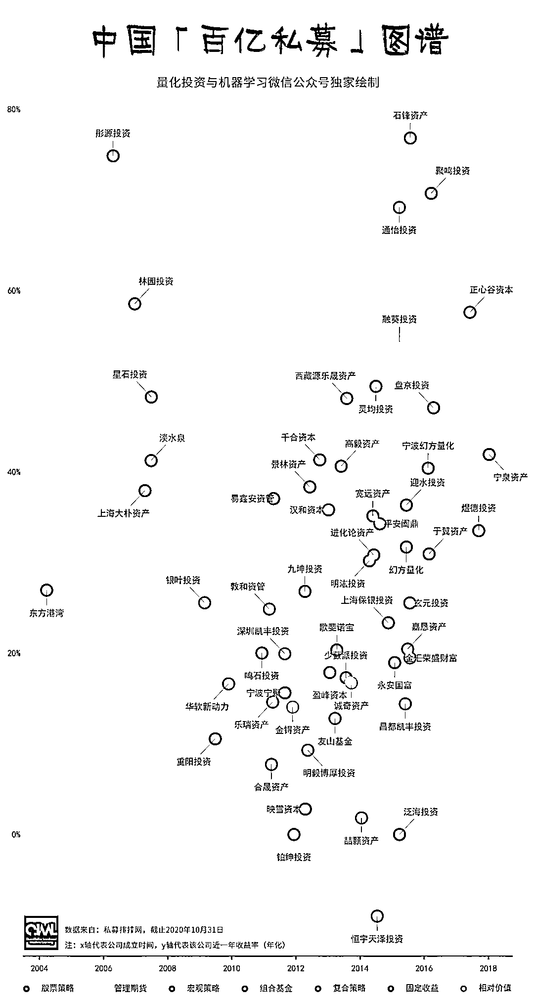
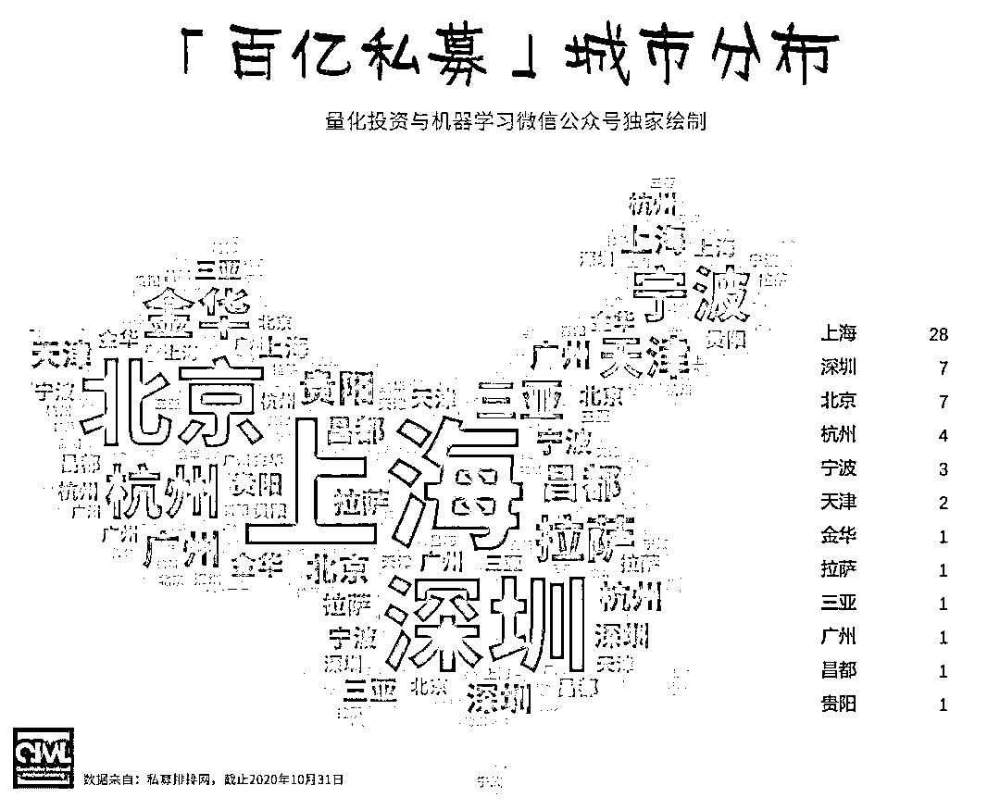
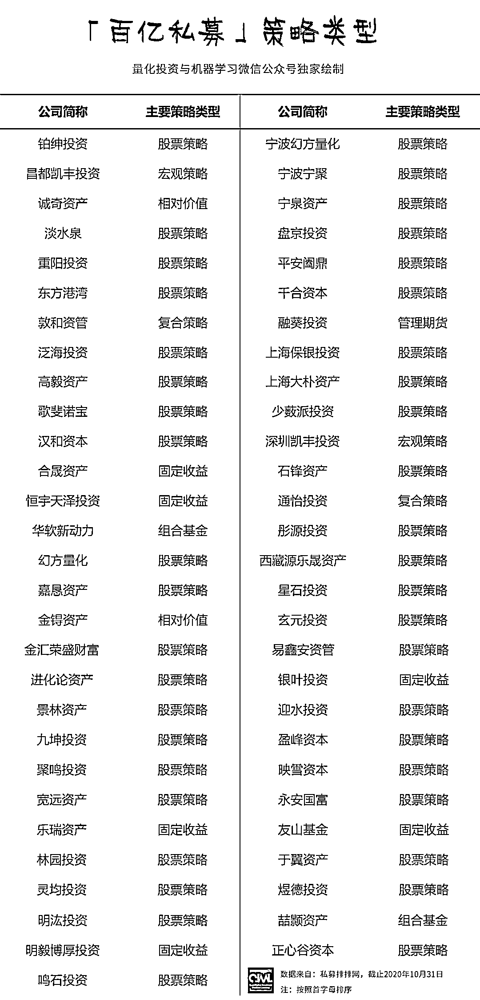
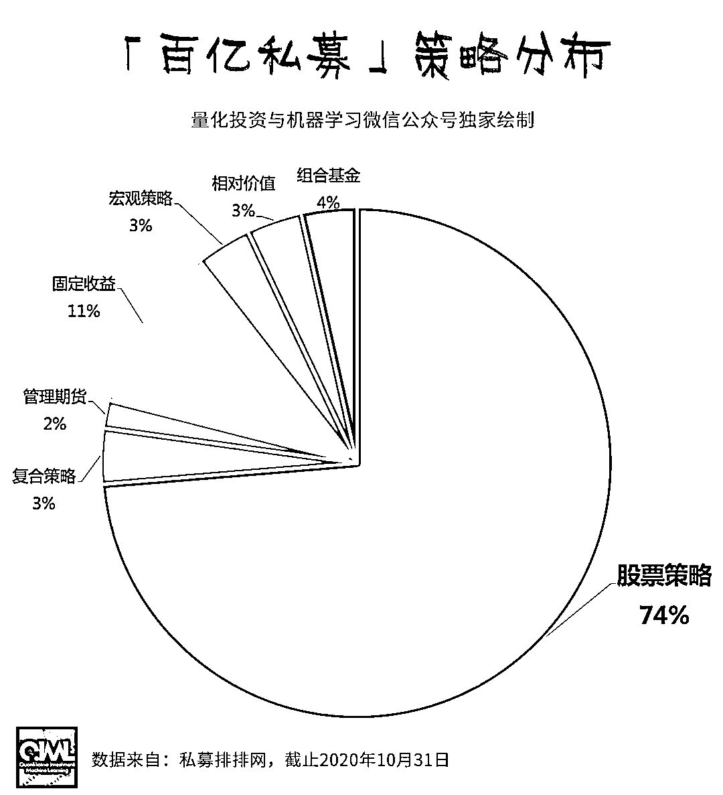
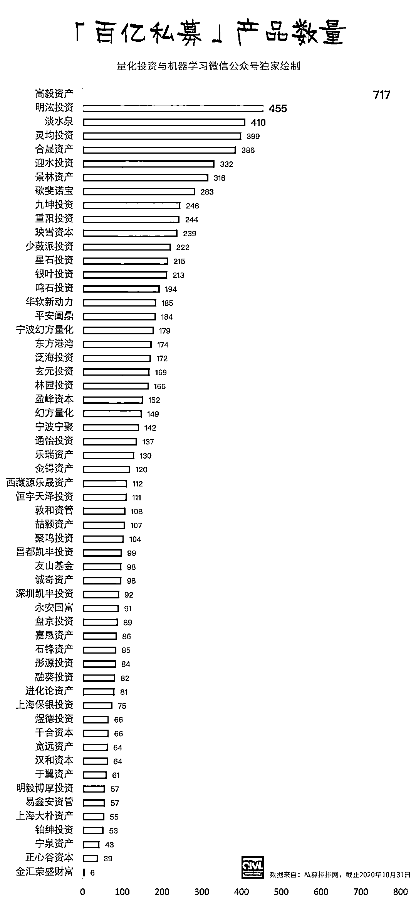
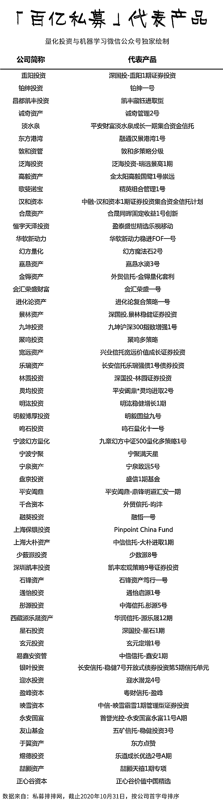

# 二千零二十、中国『百亿私募』全景图

> 原文：[`mp.weixin.qq.com/s?__biz=MzAxNTc0Mjg0Mg==&mid=2653307298&idx=1&sn=3802f459d3b3a70136151ec6c449d7bd&chksm=802d83b7b75a0aa162cfe510d2d00889b5db893d7f0065d1c972a4b771396455de6de0111479&scene=27#wechat_redirect`](http://mp.weixin.qq.com/s?__biz=MzAxNTc0Mjg0Mg==&mid=2653307298&idx=1&sn=3802f459d3b3a70136151ec6c449d7bd&chksm=802d83b7b75a0aa162cfe510d2d00889b5db893d7f0065d1c972a4b771396455de6de0111479&scene=27#wechat_redirect)

**全网 TOP 量化自媒体**

量化投资与机器学习编辑部出品

根据私募排排网最新数据统计，目前国内百亿私募已经增至 57 家。文中私募规模数据与协会备案规模一致。百亿私募所在城市字段以中国基金业协会登记的机构实际办公地址为准，非注册地址。

接下来，就让公众号带领大家领略一下 2020 年中国百亿私募的全景图吧！

未来，谁会成为中国第一家千亿私募呢？ 让我们拭目以待！ 

量化投资与机器学习微信公众号，是业内垂直于**Quant****、Fintech、AI、ML**等领域的**量化类主流自媒体。**公众号拥有来自**公募、私募、券商、期货、银行、保险、资管**等众多圈内**18W+**关注者。每日发布行业前沿研究成果和最新量化资讯。