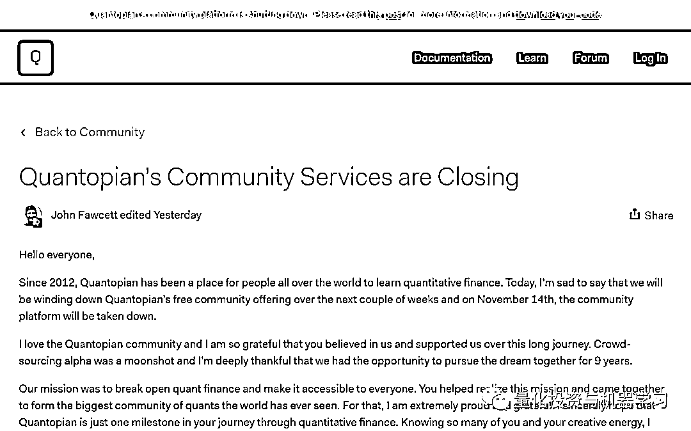
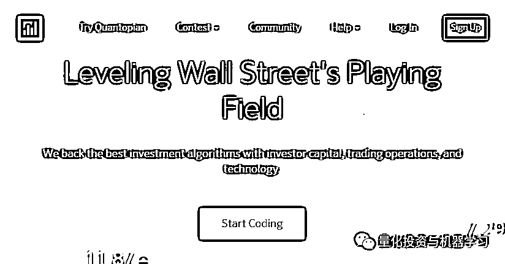
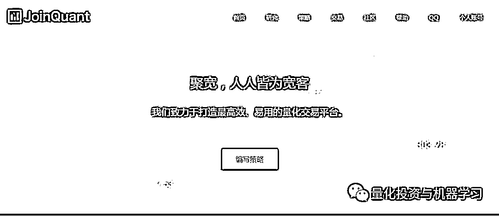
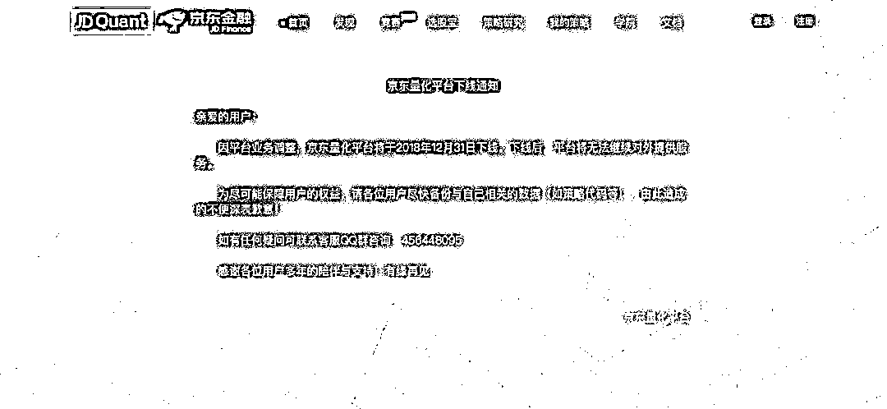
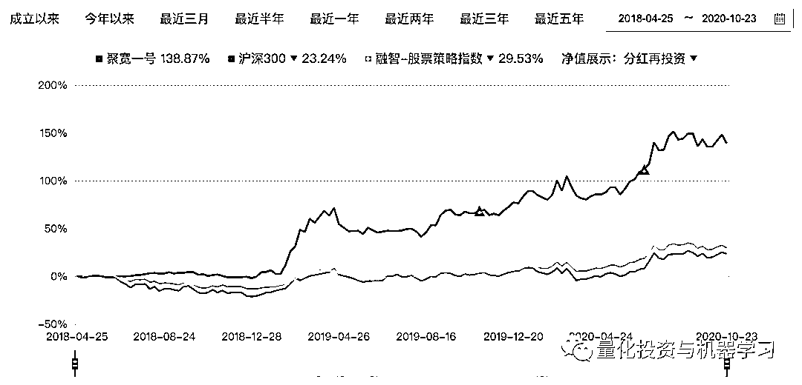
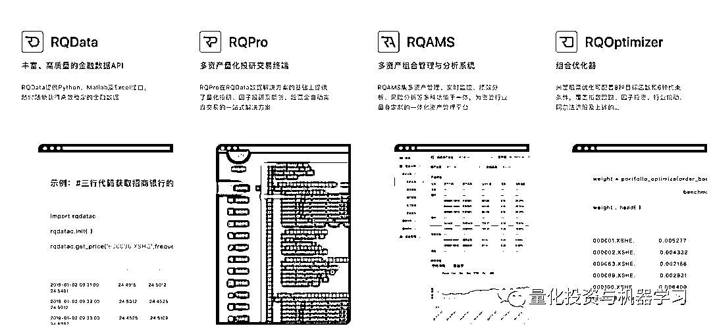

# 再见！Quantopian

> 原文：[`mp.weixin.qq.com/s?__biz=MzAxNTc0Mjg0Mg==&mid=2653307260&idx=1&sn=5135716cf4973b26a7ce91743aeccbcb&chksm=802d8369b75a0a7f6162e917860f8f97264238ce5cfe91e6e93d440735824ae373f5e62ee2f4&scene=27#wechat_redirect`](http://mp.weixin.qq.com/s?__biz=MzAxNTc0Mjg0Mg==&mid=2653307260&idx=1&sn=5135716cf4973b26a7ce91743aeccbcb&chksm=802d8369b75a0a7f6162e917860f8f97264238ce5cfe91e6e93d440735824ae373f5e62ee2f4&scene=27#wechat_redirect)

**全网 TOP 量化自媒体**

量化投资与机器学习编辑部出品

今天我们写这篇推文的心情很复杂，希望大家读完全文，能对国内外量化环境的发展有一个新的认识！

就在昨天，发生了一件让公众号意想不到的事情。陪伴我们 9 年的 Quantopian 突然宣告平台即将下线！

Quantopian 官网公告（部分）

当年叱咤风云的 Quantopian，如今一声无奈的叹息！小编最喜欢的是 Quantopian 出的一套量化学习课程。国内很多平台还对此进行了翻译。

让我们先来看看公告都讲了什么主要内容吧！

**公告主要内容**

1、 Quantopian 平台将在**11 月 14 日关****闭！**

2、**研究和回测功能停止使用**。但是**大家可以下载代码（算法和 notebooks）**直到 11 月 14 日。在大家的帐户设置中有一个“下载代码”按钮，**允许大家以压缩文件的形式下载所有代码**。

3、**Zipline、Alphalens、Pyfolio、Empyrical、Trading calendar 以及其他开源项目都将在 GitHub 上继续运行**。Quantopian 希望大家可以转向 GitHub 获取代码并在本地安装程序。同时，Quantopian 将来也会在 YouTube 上开设一个栏目，其讲座和视频内容可以继续保存。

**从最开始说起**

2011 年，John Fawcett 和 Jean Bredeche 共同创立了 Quantopian，其总部位于波士顿。

Quantopian 首席产品官 Caroline Sherman 和 CEO John Fawcett

美剧 Billions 原型，Point72 掌门人科恩也投资的 Quantopian，其将在 Quantopian 管理的算法的指导下投资 2.5 亿美元，早期投资机构还包括 Bessemer Venture Partners、Khosla Ventures 以及 Spark Capital 跟投。截至目前，Quantopian 已经募集到总额达 4880 万美元的资金。

最开始它成立的初衷是让自由职业的量化分析师开发、测试和使用交易算法来买卖股票，从而创建一只众包对冲基金。

**何为众包？**

一直以来，量化对冲基金被誉为资产管理行业"皇冠上的明珠"，行业中汇集了大量尖端人才。文艺复兴科技、Two Sigma 等对冲基金管理的资产数额均已达到数百亿美元，为了跑赢市场，它们聘请多名天才数学家和物理学家，通宵达旦地编写交易算法。然而，对于普通投资者来说，如此高大上的量化对冲基金距离较远，一直较为神秘，不过随着众包（Crowdsourcing）概念的出现，量化投资平台的发展模式也逐渐向"群众化"靠拢。

**众包（Crowdsourcing），是由美国《连线》杂志的记者 Jeff Howe 在 2006 年 6 月提出的。它是指一个公司或机构把过去由员工执行的工作任务，以自由自愿的形式外包给非特定的（而且通常是大型的）大众网络的做法**。在以信奉精英的金融投资领域，互联网更是给这一模式增添了新的活力。

自成立以来，Quantopian 一直坚持走"群众化路线"。它瞄准的并非投资领域的顶级专业人士，而是量化投资行业的新手，因此，相比于其他平台，庞大的用户群就成为了 Quantopian 发展中的一个显著优势。 

Quantopian 首席执行官 John Fawcett 表示，**平台的注册会员只是业余的 Quant，并非公司的正式员工。Quant 通常已经在金融投资领域具有一定的算法编写经验，他们登陆 Quantopian 的主要目的是为了进一步了解如何将算法应用到实际的交易当中。**

Quantopian 会挑选部分算法，募集基金进行投资。同时，平台会收取一定的管理费用，而算法作者也从基金收益中获取大约 10%作为回报。

根据 Quantopian 发布的报告显示，公司对选中的每个算法的投资额大约为 10 万美元到 300 万美元。当然，Quantopian 作为行业中的先驱者，难以判断其做法是否有效。此外，尽管 Quantopian 在 2016 年对算法的投资回报高达 40%，但由于公司尚未开展外部资产管理业务，投资所用资金均来自自有资产。这也是为什么 Quantopian 下线的一个重要原因，我们在后面的段落中会细说。

类似于 Quantopian，在海外，WorldQuant 的 WebSim 平台也选择了走"群众化"之路。该平台也为用户提供包括略编写、回测等方面的服务，不同之处在于，WorldQuant 专注于更为基础的量化投资分析。其中，杰出的算法作者还有机会被平台的兼职研究顾问。不过去年 8 月，也基本是凉凉了！

WebSim 下线通知

**Quantopian 下线的真实原因**

在线量化策略研究平台集成了回测框架，数据接口及丰富的策略模版，是很多量化爱好者的入坑量化研究的启蒙工具。但作为在线研究的平台，同时也存在很多限制，比如随着机器学习算法在量化研究中的普及，在线的平台已经很难满足大家对于算力的需求，在线平台的灵活性也就成为各大平台发展的瓶颈。其实在很多平台在创立初期就已经预见了这个问题，都纷纷进行了多元化经营模式的探索。

比如 Quantopian 成立种子基金，挖掘优秀的量化策略。**但量化本身就是一个团队的竞技台，当越来越多的机构投资者以团队协作，采用越来越复杂的算法模型时，市场留给个人投资者去依靠一个在线平台挖掘超额收益的空间就越来越小，所以种子基金也成了一个****伪命题。**

还有一个原因就是 Quantopian 的众包基金业绩不行！Quantopian 在 2017 年 6 月推出了其旗舰产品——多算法基金，但在大约四个月的交易中亏损了 2%。同年 9 月，该公司首席投资官在任职 15 个月后离职。根据今年（2020）早些报道，Quantopian 正在返还投资者的资金，这样包括科恩给他投的钱！

**国内近况**

量化投资与机器学习公众号应该是看着国内这些量化平台逐渐成长起来最早的一批用户了。

当年，Quantopian 成立后，国内就开始风起云涌。从最开始的量化平台三巨头：**优矿、聚宽、米筐**。

公众号还记得聚宽最开始网站的首页界面都几乎和 Quantopian 一模一样，就换了个颜色

Quantopian 早期页面

聚宽早期页面

再到后面的各种矿，数不胜数。例如：

阿布量化、大宽网、大鱼金融、点宽 DigQuant、发明者量化、果仁网、交易开拓者、金字塔、掘金量化、镭矿、数库 Factors、天软科技 Tinysoft、万矿 WindQuant、微量网、文华财经、盈时、云量科技、众量网、诸葛量化、Bigquant、EasyQuant、MagicQuant、同花顺 MindGoMT4、QuantOS、国泰安 Quantrader、Quicklib、SmartQuant (OpenQuant)、国信证券 TradeStation、ZWQuant、QuantFair 等等。

**但到今天，已经凉了一大半了！**

当年，公众号专门写过一篇文章分析了一些原因，其中，我们有一个词很关键，那就是：

**转型**

2018 年，京东量化平台宣告下线就已经是一个警钟。

现在聚宽一部分转型做了资管，听说业绩还不错：

来自私募排排网数据

通联前几年对优矿的投入很大，也搞了很多事情，从 2018 年开始，平台的活跃度就没有以往那么高涨。今年好像又有点起色，其中一个负责人告诉我们，今年 12 月优矿会升级因子分析工具，引入更多分析维度，提升因子挖掘能力，同时优矿将提供 Python3 编程环境，提供最新版本的数据分析、机器学习、模型研究类库，提升研究体验。

米筐呢，公众号觉得商业逻辑比较清楚： 

希望这三家能够转型成功！

**我们还有什么选择？**

当各大国内外量化平台纷纷转型或者落幕的时候，作为个人量化研究爱好者，还有什么选择？

**开源，一定是开源！**

量化投资与机器学习公众号推崇的理念是：

**可持续量化研究**

顺便给大家透露一个好消息：

很多读者在后台时不时就在催公众号能够出一套系统的、高质量的量化课程。因此，公众号计划在明年上线一套针对量化研究者的可持续量化研究系列课程。

在个人量化爱好者开源社区有多个持续维护的优质项目。虽然 Quantopian 已经落幕，但其在开源社区也给我们留下了很多优秀的项目，并承诺会一直维护：

**Zipline**

作为最早开源的回测框架之一，将 event-driven 形式的回测理念普及给广大量化爱好者，国内很多机构自用或在线的回测平台都多多少少借鉴了 Zipline 的设计模式，我们庆幸 context\on_bar 都还在。

**Alphalens**

是一款因子测试分析的框架，对因子从 IC 到分组收益的各个维度进行全面的测试分析，并能生成详细的可视化报表。

**Pyfolio、Empyrical**是都是策略绩效评价的工具包，Pyfolio 可以返回丰富的策略绩效统计指标及图表，Empyrical 相对轻量灵活，可以方便的计算如夏普比率、卡玛比率等等指标。

国内外也有其他非常优秀的回测框架，比如**VNPY**，从最初的期货回测框架发展到如今支持各大国内外交易所且覆盖期货、股票及数字币的交易接口，配合完善的项目文档，能够很快的构建一套自己的策略研究框架。

再比如**Backtrader**，作者采用元编程的设计模式，设计出一套由 Data Feed、Broker、Order 及 Analyzer 等模块构成的强大的且功能丰富的回测框架。Backtrader 有丰富的指标系统，可以在回测的过程中对数据进行非常灵活的处理，也能处理回测中的诸多细节，比如期货展期、主力合约拼接、保证金设定及灵活的交易费率设置。

这些都是我们可以继续使用和学习的！ 

大家可以参与一个话题投屏：

 /mp/newappmsgvote?action=show&__biz=MzAxNTc0Mjg0Mg==&supervoteid=470106289#wechat_redirect 

**写在最后**

如果企业迟迟不能盈利或者其定位不够。那么，倒下去是早晚的事。

2018 年，公众号说过一段话：

再过几年，量化平台这个行业，一定会倒下一批公司，也一定会存活一批公司。未来谁能留下，谁又将消失在洪流之中，存在很多不确定性，我们将拭目以待！

那么，到了 2020 年，留下来的，消失的基本以浮现在我们面前，在未来的日子里：

**活下去就是成功的希望！茁壮崎岖的成长环境一定能让我们找到一条属于自己的路！**

量化投资与机器学习公众号作为量化领域 TOP 的自媒体，也将持续为所有量化爱好者贡献自己的一份力量。

感谢你们这 5 年对我们的支持与厚爱！

 

量化投资与机器学习微信公众号，是业内垂直于**Quant****、Fintech、AI、ML**等领域的**量化类主流自媒体。**公众号拥有来自**公募、私募、券商、期货、银行、保险、资管**等众多圈内**18W+**关注者。每日发布行业前沿研究成果和最新量化资讯。