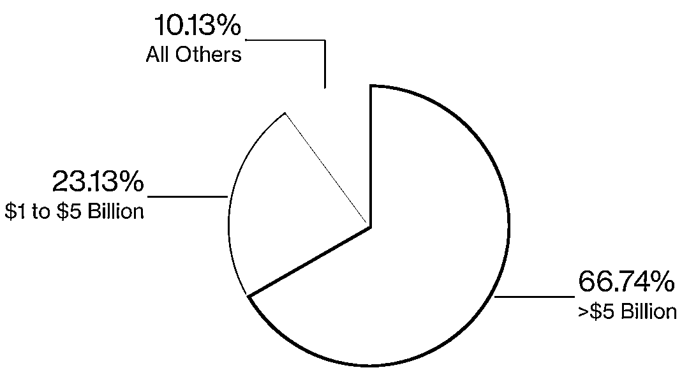

# Big Blow！全球大型对冲基金最新现状

> 原文：[`mp.weixin.qq.com/s?__biz=MzAxNTc0Mjg0Mg==&mid=2653307173&idx=1&sn=587fcb441fe194f2ab173ebdb9fd114b&chksm=802d8330b75a0a26101f7acdd2bc521ff310de310f34d06d08dbe8f0e042059cd72bdb45fca4&scene=27#wechat_redirect`](http://mp.weixin.qq.com/s?__biz=MzAxNTc0Mjg0Mg==&mid=2653307173&idx=1&sn=587fcb441fe194f2ab173ebdb9fd114b&chksm=802d8330b75a0a26101f7acdd2bc521ff310de310f34d06d08dbe8f0e042059cd72bdb45fca4&scene=27#wechat_redirect)

**全网 TOP 量化自媒体**

### **Big Blow**

### 与前几年不同，头部对冲基金在 2020 年受到了很大的冲击：

备注：对冲基金收益率以 HFRI 基金加权综合指数衡量，而大型对冲基金则以 HFRI 的资产加权指数衡量。标普 500 指数的收益率是带股息的。数据截至今年 9 月

传统上，AUM 头部的对冲基金一直被视为在低迷市场中更为稳健，但这种模式在 2020 年被打破了。根据 Eurekahedge 的数据显示，截至今年 9 月，AUM 超过 10 亿美元的对冲基金其业绩损失约为 600 亿美元。

由于大多数投资者缺乏内部研究团队，所以，他们更倾向于将资金投向规模最大、知名的对冲基金。这导致了头部雪球越滚越大的局面。根据 HFR 的数据显示，**自 2010 年以来，有 1700 亿美元流入对冲基金市场，其中约有 1350 亿美元流入规模较大的头部对冲基金。**

数据来自：HFR，不同规模基金持有资产比例

但规模有时候也是一种负担。今年早些时候，当股市、债券、货币和大宗商品受到波动性的冲击时，许多大型对冲基金损失了金额是创纪录的。

截至 8 月份：

*   桥水的旗舰基金 Pure Alpha II 损失了 18.6%

*   文艺复兴科技的 Institutional Equities 损失了 13%

*   Winton 的主要基金损失了 19%

*   Hintze 的 CQS 对冲基金损失了 42.5%

*   Lansdowne Developed Markets 的基金损失了 22%

随着美国大选的临近，以及肆虐的全球的新冠肺炎任在各大洲造车严重影响，几乎没有迹象表明，对冲基金遭受的波动性正在减弱。

数据来自：PivotalPath，对冲基金在美国大选后往往表现更好

### **Biggest Losers**

大型头部对冲基金规模从今年开始下降：

数据来自：Eurekahedge，截至 8 月

当然，并非所有大型对冲基金都这样。**像 Citadel、Balyasny 和 Millennium 等这样的多策略公司正经历着最好的一年**。这些公司依靠数十名交易员创造了巨额的利润。波动性给他们创造了很多机会。

还有一个现象，规模较小的对冲基金有的表现却很好。原因是它们抓住了非常小众的交易机会，而这些机会并没不像头部对冲基金那样，需要数十亿美元才玩的转。

量化投资与机器学习微信公众号，是业内垂直于**Quant****、Fintech、AI、ML**等领域的**量化类主流自媒体。**公众号拥有来自**公募、私募、券商、期货、银行、保险、资管**等众多圈内**18W+**关注者。每日发布行业前沿研究成果和最新量化资讯。