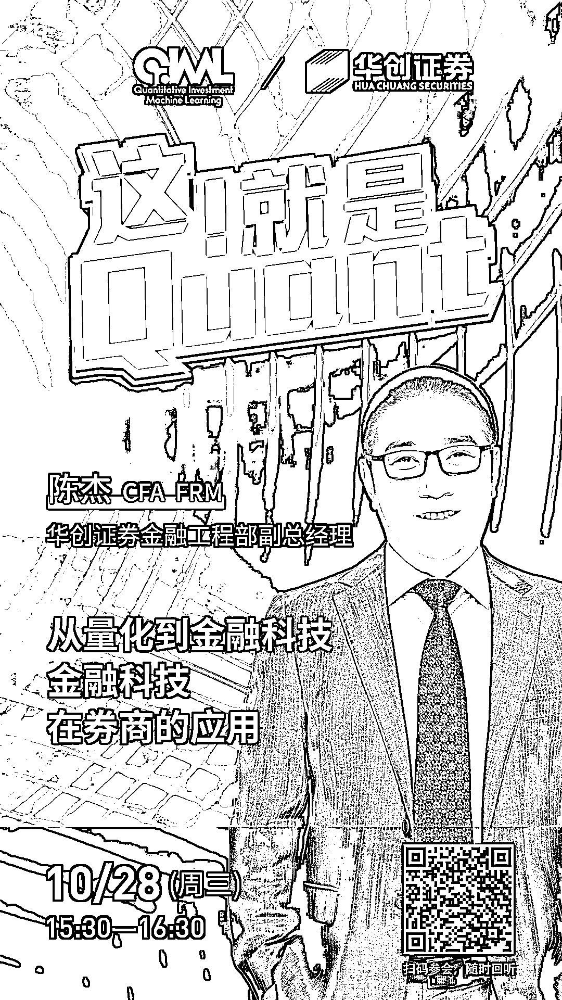

# 陈杰：从量化到金融科技，金融科技在券商的应用

> 原文：[`mp.weixin.qq.com/s?__biz=MzAxNTc0Mjg0Mg==&mid=2653307143&idx=1&sn=96c9bad36eadb006f83e1dce2ac704cd&chksm=802d8312b75a0a04f0fdfe0ad050e09116343809d9710b3ee74c2ceadb9fcb79b01fb30cc02c&scene=27#wechat_redirect`](http://mp.weixin.qq.com/s?__biz=MzAxNTc0Mjg0Mg==&mid=2653307143&idx=1&sn=96c9bad36eadb006f83e1dce2ac704cd&chksm=802d8312b75a0a04f0fdfe0ad050e09116343809d9710b3ee74c2ceadb9fcb79b01fb30cc02c&scene=27#wechat_redirect)

***1***

**主讲嘉宾介绍**

**陈杰** | 华创证券金融工程部副总经理，CFA、FRM。现负责华创证券的量化研究和金融科技，并参与公司数字化建设。十多年证券公司工作经验，对量化投资和金融科技的结合有丰富经验，利用知识图谱、自然语言处理、量化分析等技术，探索投研的新模式。

***2***

**嘉宾互动环节**

本次网络直播会议将设置：**读者问答环节**。大家如有问题向嘉宾提问，请**扫码下方二维码**填写问卷。我们将根据问题质量，选择性在直播中进行回答。欢迎大家踊跃提问哦！  

***3***

**如何参会？**

**扫码下方海报二维码**

或**点击阅读原文**

即可收听！

量化投资与机器学习微信公众号，是业内垂直于**Quant****、Fintech、AI、ML**等领域的**量化类主流自媒体。**公众号拥有来自**公募、私募、券商、期货、银行、保险、资管**等众多圈内**18W+**关注者。每日发布行业前沿研究成果和最新量化资讯。