# 定价 68.8！代码 688688！蚂蚁最全解读来了

> 原文：[`mp.weixin.qq.com/s?__biz=MzAxNTc0Mjg0Mg==&mid=2653307131&idx=1&sn=074c88dab5f183799f0dfae4790fa7c2&chksm=802d82eeb75a0bf87f93f5d828d909c56f20013b80af3bf6f09c141077d2d73e9c6fa22ec5a5&scene=27#wechat_redirect`](http://mp.weixin.qq.com/s?__biz=MzAxNTc0Mjg0Mg==&mid=2653307131&idx=1&sn=074c88dab5f183799f0dfae4790fa7c2&chksm=802d82eeb75a0bf87f93f5d828d909c56f20013b80af3bf6f09c141077d2d73e9c6fa22ec5a5&scene=27#wechat_redirect)

**全网 TOP 量化自媒体**

来自：中国基金报 | 泰勒

千呼万唤始出来，讨论了一整天的蚂蚁集团 A 股发行价，终于揭开谜底。

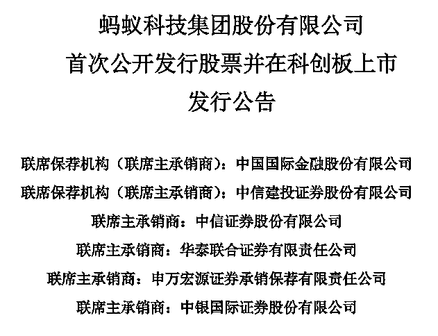

10 月 26 日晚间，蚂蚁集团发布首次公开发行股票并在科创板上市发行公告，发行人和联席主承销商根据初步询价结果，协商确定本次发行价格为 68.80 元/股。

A 股代码 688688，价格 68.80 元/股，而本次 H 股发行价格为 80.00 港元/股。 

老铁们看到这串数字，都会感叹一声，只有马云老师才能这么任性！

事实上，蚂蚁集团实控人马云老师在 10 月 24 日的外滩金融峰会上也透露已经确定了蚂蚁上市定价。“我很自豪地宣布，昨天晚上确定了蚂蚁上市的定价，这是第一次科技大公司在纽约以外的地方定价，这是三年前连想都不敢想的，但是今天发生了。世界的变化是神奇的。”马云称。

基金君整理了这次公告的 10 大要点。

**1、68.8 元/股！**

10 月 26 日消息，上交所官网显示，蚂蚁集团 IPO 初步询价完成，经过近 1 万个投资机构账户询价，最终 A 股发行价确定为每股 68.8 元。

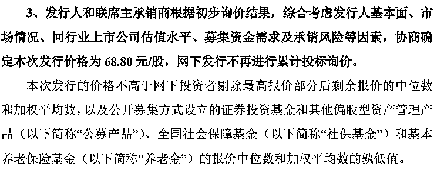

另外，港股的发行价也于同日公布，为 80 港元，刨除汇率影响后与 A 股基本持平。

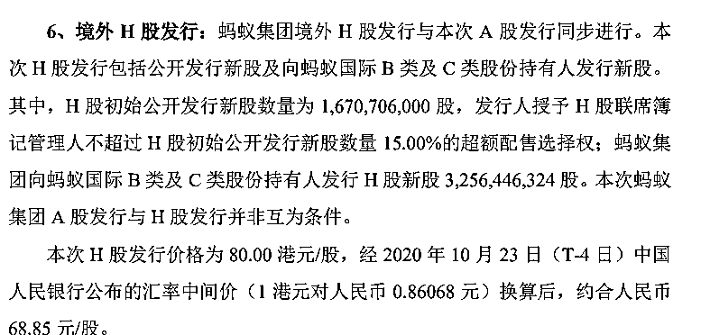

**2、预计 A 股募资额超 1000 亿元**

按本次发行价格 68.80 元/股计算，A 股超额配售选择权行使前，预计发行人募集资金总额为 1149.45 亿元；若 A 股超额配售选择权全额行使，预计发行人募集资金总额为 1321.86 亿元。蚂蚁集团公布战略投资者名单和缴款金额情况，共计缴款金额 935.31 亿元。

数据显示，A 股目前募资规模排在前三的分别是农业银行、中国石油、中国神华，首发募集资金分别是 685 亿元、668 亿元、666 亿元。在科创板历史上，此前最大的募资规模是中芯国际，达到 532 亿元，蚂蚁集团募资规模是其两倍。

**3、A 股发行总市值 2.1 万亿元**

按 68.8 元/股的价格计算，意味着最终 A 股发行总市值 2.1 万亿元。

2.1 万亿是什么概念？一举超过茅台，成为 A 股市值第一，还超过了工行、平安、建行等。 

而 2.1 万亿比此前 IPO 之初的 2000 亿美元的估值溢价了 50%，不过，较此前多家投行预测约 2.5 万亿-3 万亿元估值，折让幅度约 20%-30%。

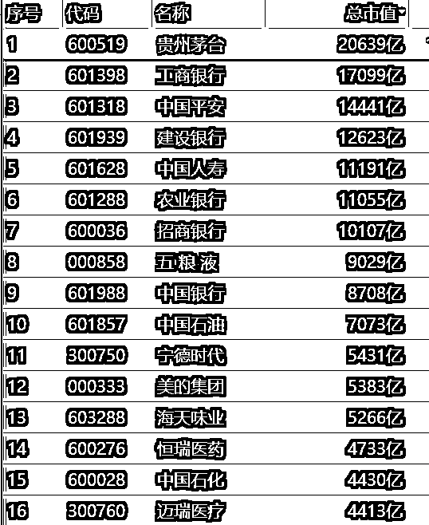

**4、A 股初始发行量的 80%给了战略配售**

公告显示，本次 A 股发行初始战略配售的股票数量为 1,336,564,800 股，占 A 股初始发行数量 的 80.00%

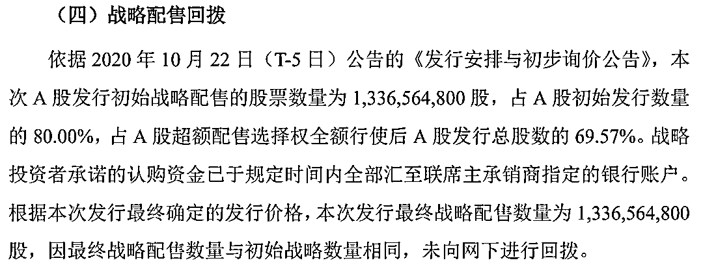

**5、对 A 股冲击估计不会太大**

发行方案显示，蚂蚁将在 A 股发行不超过 16.7 亿股的新股，其中初始战略配售股票数 13.4 亿股，供机构和个人投资者“打新”股票数 3.34 亿股（绿鞋机制前）。按照每股价格计算，绿鞋前 A 股募资总规模为 1150 亿元，其中面向 A 股机构和个人投资者的“打新”规模超过 220 亿元。

有业内人士表示，蚂蚁 A 股发行的战略配售比达 80%，这应该是 A 股历史最高了，把战略配售比例提到如此之高，其目的估计是想减轻二级市场压力。

也就是说，虽然是全球最大的 IPO，但蚂蚁对 A 股冲击没那么大！这次在 A 股总融资超过千亿，但线下战略配售占了 80%，总共高达 800 到 900 亿左右；需要二级市场来接盘只有 20%，也就是 220 亿左右。

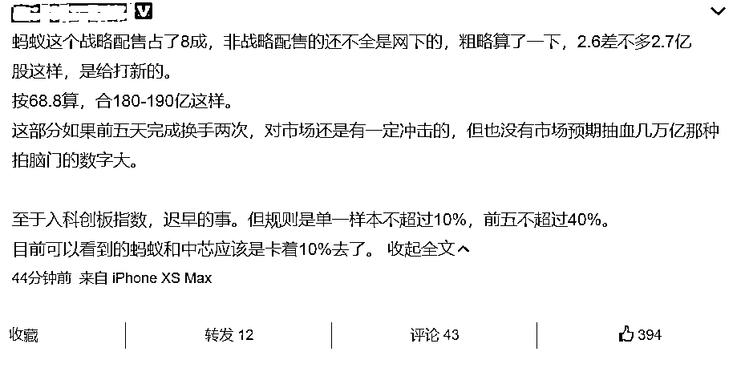

数据显示，A 股目前募资规模排在前三的分别是农业银行、中国石油、中国神华，首发募集资金分别是 685 亿元、668 亿元、666 亿元。在科创板历史上，此前最大的募资规模是中芯国际，达到 532 亿元，蚂蚁集团募资规模是其两倍。

**6、开售仅一小时  蚂蚁港股 IPO 已超额认购**

据市场消息，今晚，蚂蚁集团香港发行开始仅仅 1 个小时，H 股机构发行部分已经超额认购，火爆程度堪比“双 11”，刷新市场纪录。据悉，其中大部分都是 10 亿美金级别的大订单。

据知情人士称，在蚂蚁的定价公布后，来自国际投资人的订单蜂拥而至。

**7、何时打新？顶格申购或 100%中签**

根据安排，10 月 27 日，蚂蚁集团将进行网上路演；29 日进行申购；30 日公布中签率。

根据 A 股发行安排，蚂蚁集团留出 3.34 亿股供机构和个人投资者“打新”。按照 2 万亿市值计算，面向 A 股市场的“打新”规模将超过 200 亿元。

蚂蚁集团网上顶格申购上限为 31.7 万股。根据以往的数据，网上顶格申购上限与中签率基本呈正相关，网上顶格申购上限越高，其中签率通常也就越高。

数据显示，目前科创板新股中，中签率最高的是中国通号，达 0.23%，申购上限为 25.2 万股；中芯国际位居第二，达 0.21%，申购上限为 42.1 万股。以此推测，蚂蚁集团的中签率或在 0.2%左右。如果顶格申购，那么可获配号 634 个，乘以中签率之后的结果大于 100%，也就是说，顶格申购蚂蚁集团的中签率或高达百分百。

**8、蚂蚁股权曝光，获配战投名单可谓明星云集**

本次蚂蚁 IPO 中，80%新发股份为初始战略配售，这部分资金大多来自场外增量资金且有锁定期。

蚂蚁在发行安排中为战略投资者设置了比监管要求的 12 个月更严格的禁售期。除保荐跟投及生态圈战配公募基金以外的战略投资者，需承诺获得的配售股票中，50%股份限售期限为 12 个月，50%股份限售期限为 24 个月。这也意味着，上述战略投资者包括全球顶级主权基金和阿里巴巴等都要受到该禁售期的约束。

战略配售结果显示，天猫获配金额 502.24 亿元；淡马锡、阿布达比投资局等多家机构均获配 14.76 亿元；宁德时代获配 7.87 亿元。以及众多基金公司

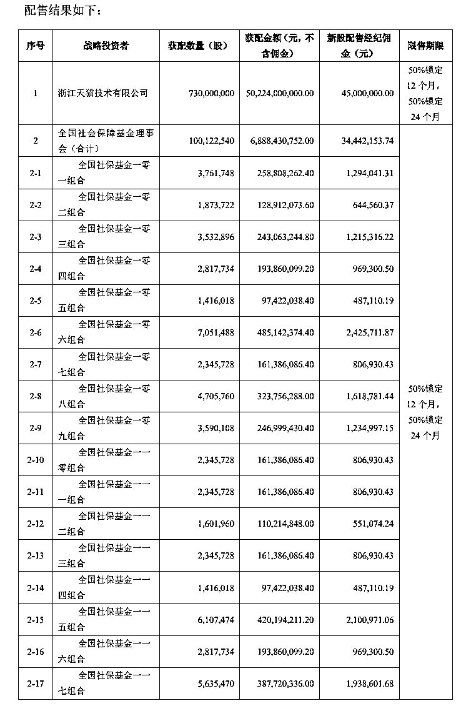

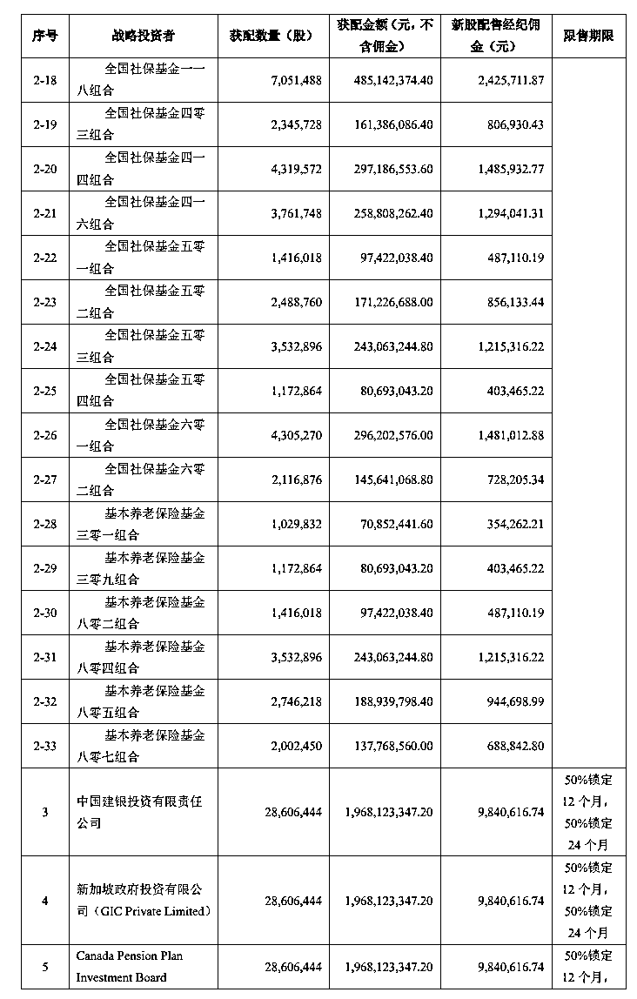

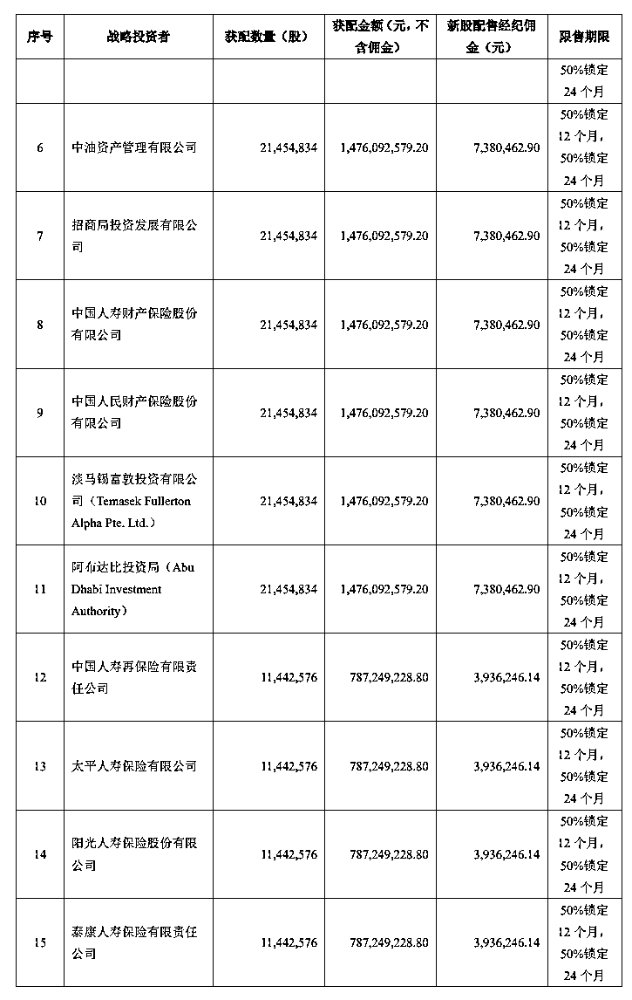

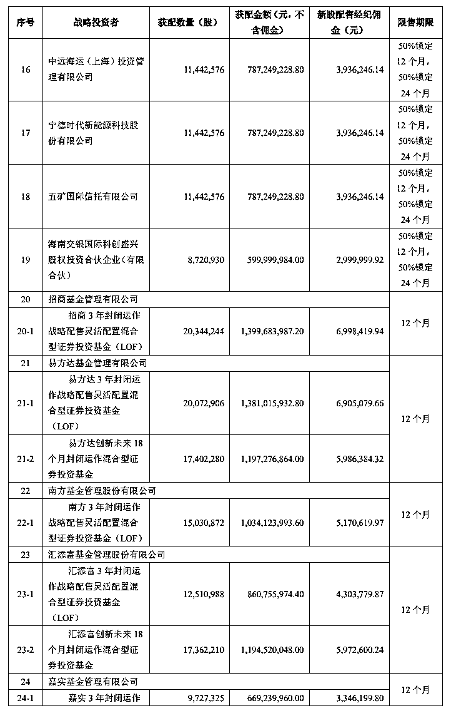

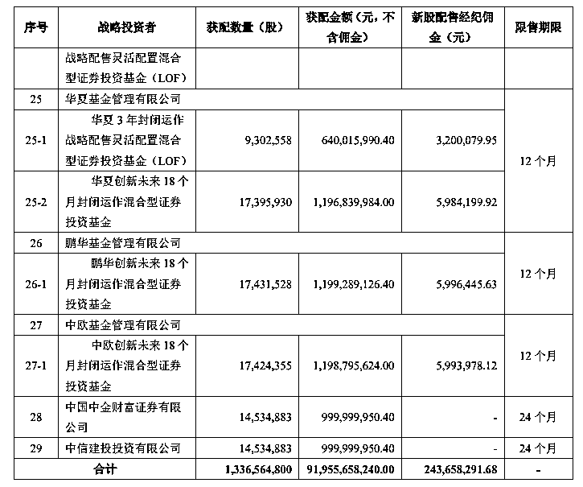

**9、社保基金追投 70 亿元**

蚂蚁也兑现了让全国人民再赚一笔养老金的承诺，全国社保基金追加投资 70 亿元，认购超 1 亿股蚂蚁新股，成为除阿里集团外认购金额最大的战略投资者。

全国社保基金副理事长陈文辉在外滩金融峰会喊话蚂蚁集团：希望多给一些战配额度，为全国人民多赚点养老钱。蚂蚁集团董事长井贤栋在随后的发言中回应，“非常欢迎社保基金继续投资蚂蚁，做蚂蚁的长期股东”。

2015 年，在马云的邀请下，社保基金以 75 亿元人民币入股蚂蚁，认购近 7 亿股。按蚂蚁 A 股发行价计算，这笔投资目前价值超过 480 亿元，五年时间增长近 7 倍。

**10、全国社保持股 2.3%，李嘉诚持股 0.06%**

上市后，杭州君瀚持股稀释为 23.37%，杭州君澳稀释为 16.17%，阿里巴巴持股为 96.52 亿股，稀释为 31.77%（阿里巴巴持股包括 77.63 亿股 A 股，11.58 亿股外资股，7.3 亿股战略认购股份），届时马云控制权将稀释为 39.55%，依然对公司拥有绝对控制权。

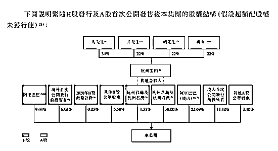

全国社保为仅次于阿里巴巴、杭州君澳、杭州君瀚的最大机构投资者，持股 2.3%。

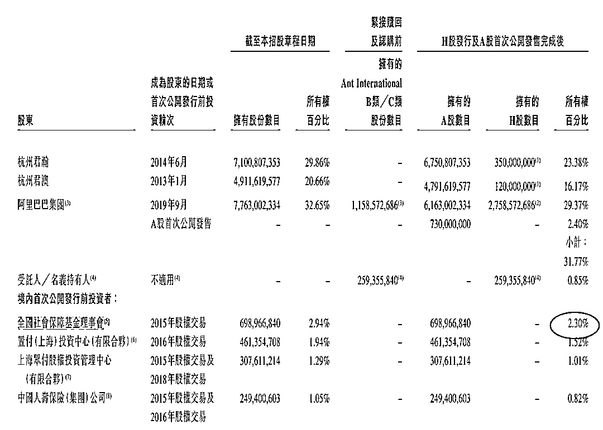

长和旗下 Hutchison Whampoa Europe Investments、长实地产旗下 Active Noble Limited 分别持有 891.27 万股 C 类股份，总计持股蚂蚁集团 0.06% 

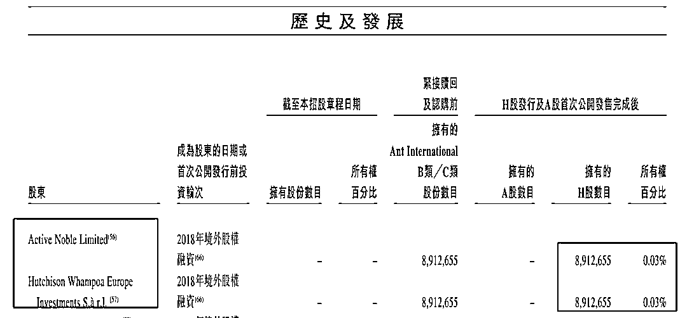

**A 股是否面临面临“抽血效应”？**

华西证券计算机团队认为，巨无霸 IPO 融资带来的吸血效应可能并不显著，即“蚂蚁踩不死大象”。回顾巨无霸 IPO 项目：中芯国际、京沪高铁、邮储银行、工业富联，该团队统计了万得全 A 指数在公司上市前后的涨跌幅，结果显示巨无霸上市带来的资金分流（抽血）效应并不显著。

华西证券以中芯国际为例，上市前数周是市场仍在持续上涨，上市日及询价日前后，市场确因资金分流出现一定程度下跌，但后期市场快速消化，并未出现剧烈扰动。判断 A 股在全面深化改革、大幅扩容、引入外资以后，对于大规模 IPO 的短期冲击已经正在逐渐弱化。随着 A 股市场的日趋成熟，基本面和景气度将是决定个股长期价值的核心要素，无论对于蚂蚁集团本身还是其他 A 股标的均是如此。

不过，兴业证券则认为，蚂蚁集团上市首日对于交易资金的分流效应可能高于中芯国际。

兴业证券认为，IPO 融资效应带来市场下跌可能并不明显，而且标志性企业上市后带来的获利了结和风险偏好冲击可能影响更大。资金和筹码大幅扩容后的 A 股，对于 IPO 融资效应的短期冲击可能愈发免疫。IPO 对于投资者的影响更多体现在风险偏好方面：中芯国际上市推动了估值位于顶部的半导体板块获利了结、国泰君安上市对于 2015 年牛市顶部脆弱的流动性产生向下催化、工业富联上市是 2018 年众多市场冲击中的一朵浪花。巨型 IPO 公司上市日的影响可能比缴款日更大。

兴业证券指出，需要关注个人投资者和机构的跟随交易。如果被动型和主动型资金推动蚂蚁集团上市后表现亮眼，一方面可能会吸引个人投资者主动跟随配置，另一方面，因为蚂蚁集团在计算机、科创板等板块占比较大，为了避免跑输基准和相对业绩，部分基金资金可能面临被动跟随交易，并再次推动股价，从而形成正循环反馈，届时其他科技成长板块可能面临更剧烈的资金再平衡。

广发证券认为，蚂蚁集团的“示范效应”主要体现在估值体系重塑，A 股的优质成长股可能长期被市场赋予高估值。蚂蚁作为与美股“FANNG”互联网巨头对标的企业，未来市值波动可能与美国科技股联动性增强。

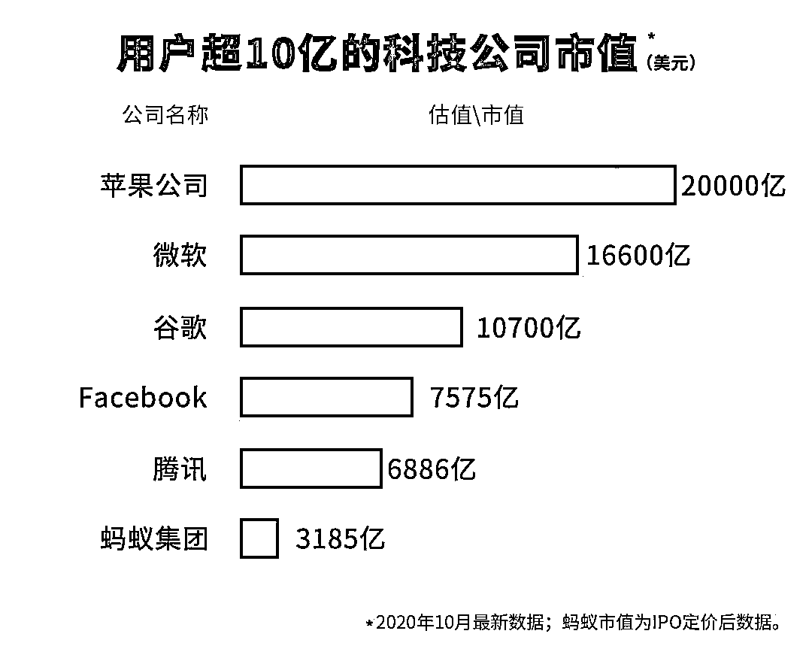

马云：“在 5 年前，甚至 3 年前我们想都不敢想。”

蚂蚁的 IPO 规模一直备受市场关注，在日前的 2020 外滩金融峰会上，马云透露了蚂蚁集团 IPO 的最新进展。

马云在讲话中介绍，“前天晚上我们在上海确定了蚂蚁金服的定价，这是人类有史以来最大规模融资定价，发生在美国市场以外，也是 5 年来第一次在纽约城外完成如此大体量的定价。”

马云坦言，“在 5 年前，甚至 3 年前我们想都不敢想。”

2014 年，接受采访时，马云曾说：阿里巴巴没能登陆 A 股，是一个遗憾。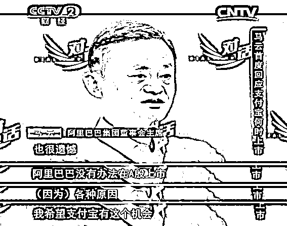如今，蚂蚁将登陆 A 股，这意味着马云终于兑现了 6 年前的承诺，也意味着第一个跻身 A 股万亿市值榜单的互联网公司终于出现。更让人欣慰的是：多年后梦圆，彼此都变得更好。

在外滩峰会的演讲中，马云表示，今天世界的很多问题，都只能用创新去解决；今天全球的金融体系必须改革，不然不仅仅是失去机会的问题，而是让世界会陷入混乱。

马云表示，一直以来我们有一些思维上的惯性，总觉得要为了跟国际接轨，必须要做欧美发达国家有，而我们没有的“所谓空白”，要填补国内的空白。把填补空白当作追求的目标。

马云说，一直觉得填补空白这句话是有问题的，不是因为欧美的就是先进的，就是我们要去填补的。其实今天我们不应该要和哪个东西接轨，适应哪国的标准，填补哪个空白，今天我们要思考的是怎么和未来接轨，怎么适应未来的标准，怎么弥补未来的空白，我们要想明白未来是如何的，以及自己到底要做成一个什么样的体系，然后再去看看别人怎么做，如果永远重复别人的语言，讨论别人设定的主题，我们不但会迷失现在，而且会错失未来。

“今天世界的很多问题，都只能用创新去解决；但是真正的创新，一定是没有人带路的，一定需要有人担当，因为创新一定会犯错误，问题不是怎么样不犯错误，而是犯了错误之后能不能完善修正坚持创新。做没有风险的创新，就是扼杀创新，很多时候，把风险控制为零才是最大的风险。”马云说。

马云还表示，今天全球的金融体系必须改革。

他说，全球的金融体系不改革，不仅仅是失去机会的问题，而是让世界会陷入混乱的问题。因为创新走在监管前面是正常的，但是当创新远远走在监管前面的时候，当创新的丰富度远远超过监管想象的时候，就不正常了，世界会陷入混乱。新金融是未来的方向，不管我们高兴不高兴，它一定会起来；不管我们做不做，一定会有人去做。未来的标准必须符合普惠、绿色、可持续。

量化投资与机器学习微信公众号，是业内垂直于**Quant****、Fintech、AI、ML**等领域的**量化类主流自媒体。**公众号拥有来自**公募、私募、券商、期货、银行、保险、资管**等众多圈内**18W+**关注者。每日发布行业前沿研究成果和最新量化资讯。