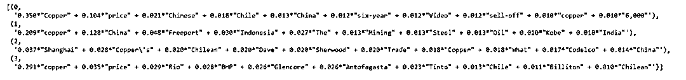

# 现货与新闻情绪：基于 NLP 的量化交易策略（附代码）

> 原文：[`mp.weixin.qq.com/s?__biz=MzAxNTc0Mjg0Mg==&mid=2653307098&idx=1&sn=40293e269a2d9f867ae878bb3e1f3b84&chksm=802d82cfb75a0bd996ee47282615da704ccfc135dfa2c1def6b6eac22fea1443be12dbdc309c&scene=27#wechat_redirect`](http://mp.weixin.qq.com/s?__biz=MzAxNTc0Mjg0Mg==&mid=2653307098&idx=1&sn=40293e269a2d9f867ae878bb3e1f3b84&chksm=802d82cfb75a0bd996ee47282615da704ccfc135dfa2c1def6b6eac22fea1443be12dbdc309c&scene=27#wechat_redirect)


**全网 TOP 量化自媒体**作者：Chris Price        编译：1+1=6

**前言**

从交易的角度来看，铜的定价取决于金属交易所的供需动态，尤其是伦敦金属交易所（LME）和芝加哥芝加哥商品交易所交易所（CME）。然而，铜的交易价格受到无数因素的影响，其中许多因素很难同时衡量：

*   GDP

*   新兴市场经济体

*   中国经济（中国占全球铜需求的一半）

*   铜矿生产国政治和环境不稳定

*   美国房地产市场

*   贸易制裁及关税

*   等等

除了上述的基本面因素，铜价还可能受到对冲基金、投资机构、债券金属甚至一些人为影响。从系统交易的角度来看，当我们想要开发一个预测模型时，这是一个非常具有挑战性的事情。

然而，以新闻形式有关的短期机会还是存在的。在美中贸易战期间，铜的现货和远期价格一直受到冲击。与所有市场一样，铜价对重大消息几乎立即作出反应。 

基于 NLP 的交易模型可以利用这些短期价格波动，将公告解析为 tokens，评估潜在的情绪，然后在预期价格波动之前，或者在波动期间持仓。

在本文中，我们将从各种金融新闻出版物 Twitter feed 中搜集历史上（和当前）的 tweets。然后，我们分析这些数据，以了解每条推文背后的潜在情绪，建立情绪得分，并研究这一得分与过去五年期铜现货价格之间的相关性。

**数据获取**

我们首先从获取铜现货价格数据开始。我们之所以选择使用铜的现货价格，而不是铜的远期合约，是因为现货价格对市场事件的反应最为敏感ーー这是一种立即完成大宗商品交易的要约。通常情况下，我们会使用彭博来获取这些数据，然而，我们可以从 Business Insider（*https://markets.businessinsider.com/commodities/copper-price*）免费获得铜的历史现货数据。

```py
# Imports
import glob
import GetOldTweets3 as got
import gensim as gs
import os
import keras
import matplotlib.pyplot as plt
import numpy as np
import nltk
import pandas as pd
import pyLDAvis.gensim
import re
import seaborn as sns
from keras.preprocessing.text import Tokenizer
from nltk.stem import *
from nltk.util import ngrams
from nltk.corpus import stopwords
from nltk.tokenize import TweetTokenizer
from nltk.sentiment.vader import SentimentIntensityAnalyzer
from sklearn.feature_extraction.text import CountVectorizer
from tensorflow.keras.preprocessing.sequence import pad_sequences
# Get Cu Spot
prices_df = pd.read_csv(
    '/content/Copper_120115_073120',
    parse_dates=True,
    index_col='Date'
)
# To lower case
cu_df.columns = cu_df.columns.str.lower()
#Plt close price
cu_df['close'].plot(figsize=(16,4))
plt.ylabel('Spot, $/Oz')
plt.title('Cu Spot Close Price, $/Oz')
plt.legend()
plt.grid()
```


现货铜收盘价，2015-01-01 至 2020-07-01，美元/吨

但是需要注意的是，我们最好考虑每日价格。因此，们将自己限制在一个可能使我们丢失信息的时间范围内ーー任何市场对新闻事件的反应都可能在几分钟内发生，可能在事件宣布后几秒钟内发生。理想情况下，我们应该使用 1-5 分钟的 bar，但就本文的目的而言，这样就可以了。

## **Tweet 数据**

我们将使用一个名为 GetOldTweets3（GOT）的库提取历史 Tweet 数据。


https://pypi.org/project/GetOldTweets3/

与官方的 Twitter API 不同：


https://developer.twitter.com/en/docs

GOT3 允许用户访问大量的 Twitter 数据历史。给出一个属于财经新闻媒体的 Twitter 用户列表和一些相关的关键字，我们可以定义我们想要获取数据的搜索参数（必要逻辑的屏幕截图，而不是代码段），出于格式化原因在下面执行此操作：


.setQuerySearch()方法接受单个搜索查询，因此我们无法为多个搜索条件提取 tweets。我们可以使用循环轻松解决此限制。例如，人们可以简单地为每次执行一个唯一的查询分配变量名，例如现货铜价，铜价等，但是出于本文的目的，我们可以解决一个查询：

```py
# Define handles
commodity_sources = ['reuters','wsj','financialtimes', 'bloomberg']
# Query 
search_terms = 'spot copper'
# Get twitter data
tweets_df = get_tweets(
  commodity_sources,
  search_term = search_terms,
  top_only = False,
  start_date = '2015-01-01',
  end_date = '2020-01-01'
).sort_values('date', ascending=False).set_index('date')
tweets_df.head(10)
```


历史 Twitter 数据

我们现在需要对这些文本数据进行处理，以便为我们的主题和情感模型提供可解释性。

## **预处理和探索性数据分析 **

对于自然语言应用程序，文本数据的预处理需要仔细考虑。从丢失的角度来看，从文本数据组成数字矢量可能具有挑战性，当执行看似基本的任务（例如删除停用词）时，有价值的信息和主题上下文很容易丢失，我们将在后面看到。

首先，让我们以标记和 URL 的形式删除多余的信息，即：


来自媒体的 Tweets 通常包含句柄标签、标签和文章链接，所有这些都需要删除

我们定义了几个单行 Lambda 函数：


https://docs.python.org/3/tutorial/controlflow.html

它们使用 Regex：


https://docs.python.org/2/library/re.html

来删除与我们要删除的表达式匹配的字母和字符：

```py
#@title Strip chars & urls
remove_handles = lambda x: re.sub(‘@[^\s]+’,’’, x)
remove_urls = lambda x: re.sub(‘http[^\s]+’,’’, x)
remove_hashtags = lambda x: re.sub('#[^\s]*','',x)
tweets_df[‘text’] = tweets_df[‘text’].apply(remove_handles)
tweets_df[‘text’] = tweets_df[‘text’].apply(remove_urls)
tweets_df[‘text’] = tweets_df[‘text’].apply(remove_hashtags)
```

接下来，我们通过检查 tweet 的组成来对 Twitter 数据进行一些基本分析，比如单个 tweet 的长度（每条 tweet 的字数）、字符数等。


基本文本 EDA —单词和字符的频率分布 

**停顿词**

很明显，每条推文的平均长度相对较短（准确地说是 10.3 个字）。这些信息表明，如果我们考虑到潜在的信息丢失，以计算复杂性和内存开销为代价，过滤停顿词可能不是一个好主意。

最初，这个实验是用 NLTK 非常方便的标准停顿词列表从 Tweets 中删除所有停顿词：

```py
# Standard tweet sw
stop_words_nltk = set(stopwords.words('english'))
# custom stop words
stop_words = get_top_ngram(tweets_df['text'], 1)
stop_words_split = [
    w[0] for w in stop_words
    if w[0] not in [
        'price', 'prices',
        'china', 'copper',
        'spot', 'other_stop_words_etc'
    ] # Keep SW with hypothesised importance
]
stop_words_all = list(stop_words_nltk) + stop_words_split
```

然而，这一行为导致了许多错误的推文分类（从情绪得分的角度来看），最好避免。 

在这一点上，当涉及到处理 Twitter 数据时，很值得强调 NLTK 的优秀库。它提供了一套全面的工具和功能，以帮助解析社会媒体输出，包括表情符号解释！大家可以在这里找到一个非常有用的指南：*http://www.nltk.org/howto/twitter.html*，帮助你开始使用 NLTK。

**N-Grams**

下一步是考虑词序。当我们将一系列标记向量化为一大堆单词时，我们就失去了这些单词在一条推文中固有的语境和意义。我们可以通过检查最常见的 N-Grams 来尝试理解在我们的 tweets DataFrame 中词序的重要性。

正如我们在上面的初步分析中所观察到的，一条给定的 tweet 的平均长度只有 10 个字。根据这些信息，一条推文中的单词顺序，特别是确保我们保留这种顺序中固有的上下文和意思，对于产生一个准确的情感得分至关重要。我们可以扩展标记的概念，包括多字标记，例如 N-Grams，以便将含义保留在单词的顺序内。

NLTK 有一个非常方便和非常有效的 N-Gram 标记器: from nltk.util import ngram。N-gram 函数返回一个生成器，该生成器生成前 n 个 N-Gram 作为元组。我们对探索这些 N-Grams 实际上是很感兴趣的，所以在第一个实例中，我们会使用 Scikit-learn 的 CountVectorizer 解析我们的 tweet 数据：

```py
def get_ngrams(doc, n=None):
  """
  Get matrix of individual token counts for a given text document.
    Args:
      corpus: String, the text document to be vectorized into its constituent tokens.
    n: Int, the number of contiguous words (n-grams) to return. 
    Returns:
      word_counts: A list of word:word frequency tuples.
  """
  # Instantiate CountVectorizer class
  vectorizer = CountVectorizer(ngram_range=
  (n,n)).fit(doc)
  bag_of_words = vectorizer.transform(doc)
  sum_of_words = bag_of_words.sum(axis=0)
  # Get word frequencies
  word_counts = [(word, sum_of_words[0, index])
      for word, index in vectorizer.vocabulary_.items()
  ]
  word_counts = sorted(word_counts, key=lambda x:x[1], reverse=True)
  return word_counts
# Get n-grams
top_bigrams = get_ngrams(tweets_df['text'], 2)[:20]
top_trigrams = get_ngrams(tweets_df['text'], 3)[:20]
```


连续单词频率（N-Gram）

 通过检查我们的 N-Gram 图，我们可以看到，除了少数例外，一个基于 NLP 的预测模型将从我们的 N-Gram 特征中学到更多的东西。例如，该模型将能够正确地将“铜价”解释为对铜的实物价格的参考，或者将“中国贸易”解释为对中国贸易的参考，而不是解释单个词的含义。

**分词（Tokenization）、词形还原（Lemmatization）**

下一步是对 tweet 进行标记，以便在 LDA 主题模型中使用。我们将开发一个函数，用于执行 tweet 的 Tokenization 和词形还原。

我们将使用 NLTK 的 TweetTokenizer：


https://www.nltk.org/api/nltk.tokenize.html

来对我们的 tweets 进行分词，这是专门为解析 tweets 和理解相对于这个社交媒体平台的语义而开发的。

考虑到每条推文相对简短的性质，对于我们的模型来说，降维并不是一个紧迫的问题。考虑到这一点，在试图消除单词复数形式和所有格形式的细微意义差异时，不对数据执行任何词干提取操作是合理的。

我们将实现一个 Lemmatizer WordNetLemmatizer：


https://www.nltk.org/_modules/nltk/stem/wordnet.html

来规范我们的 tweet 数据中的单词。毫无疑问，相对于词干分析，lemmentiation 更为准确，因为它考虑到了单词的意思。WordNetLemmatizer 还可以帮助提高我们的主题模型的准确性，因为它利用了词性（POS）标注。单词的 POS 标签指示其在句子语法中的作用，例如区分名词词性标签和形容词词性标签，例如“Copper”和“Copper’s price”。

**注意**：你必须在 WordNetLemmatizer 中手动配置 POS 标记。如果没有 POS 标记，它会认为你提供给它的所有内容都是名词。

```py
def preprocess_tweet(df: pd.DataFrame, stop_words: None):
  """
  Tokenize and Lemmatize raw tweets in a given DataFrame.
    Args:
      df: A Pandas DataFrame of raw tweets indexed by index of type DateTime.
      stop_words: Optional. A list of Strings containing stop words to be removed.
    Returns:
      processed_tweets: A list of preprocessed tokens of type String.
  """
  processed_tweets = []
  tokenizer = TweetTokenizer()
  lemmatizer = WordNetLemmatizer()
  for text in df['text']:
    words = [w for w in tokenizer.tokenize(text) if (w not in    stop_words)]
    words = [lemmatizer.lemmatize(w) for w in words if len(w) > 2] 
    processed_tweets.append(words)
    return processed_tweets
# Tokenize & normalise tweets
tweets_preprocessed = preprocess_tweet(tweets_df, stop_words_all)
```

为了演示上述函数的实用性，我们还向函数中传递了一个停顿词列表。

## **矢量化和连续的 BOW**

**BOW （Bag of Words）模型简介**

Bag of words 模型最初被用在文本分类中，将文档表示成特征矢量。它的基本思想是假定对于一个文本，忽略其词序和语法、句法，仅仅将其看做是一些词汇的集合，而文本中的每个词汇都是独立的。简单说就是讲每篇文档都看成一个袋子（因为里面装的都是词汇，所以称为词袋，Bag of words 即因此而来），然后看这个袋子里装的都是些什么词汇，将其分类。如果文档中猪、马、牛、羊、山谷、土地、拖拉机这样的词汇多些，而银行、大厦、汽车、公园这样的词汇少些，我们就倾向于判断它是一篇描绘乡村的文档，而不是描述城镇的。

我们现在需要将我们的标记化的 tweets 转换为矢量，使用 BOW 的文档表示方法。为了执行这个映射，我们将使用 Gensim 的 Dictionary 类：

```py
tweets_dict = gs.corpora.Dictionary(tweets_preprocessed)
```

通过将已处理的推文列表作为参数传递，Gensim 的词典为每个唯一的标准化单词创建一个唯一的整数 id 映射（类似于 Hash Map）。我们可以通过在 tweets_dict 上调用.token2id()来查看单词：id 映射。然后，我们计算每个不同单词的出现次数，将该单词转换为其整数单词 id，然后将结果作为稀疏向量返回：

```py
cbow_tweets = [tweets_dict.doc2bow(doc) for doc in tweets_preprocessed]
```

## **LDA 主题建模**

开发我们基于 NLP 的交易策略的一个前提是了解我们所提取的数据是否包含与铜价相关的主题/信号，更重要的是，它是否包含我们可能进行交易的信息。 

这要求我们检查和评估数据中代表这些主题的各种主题和词汇。所谓：垃圾进，垃圾出。

为了在我们的 tweet 语料库中探索各种各样的主题，我们将使用 Gensim 的**Latent Dirichlet Allocation**（隐狄利克雷分配模型）。LDA 是一种适用于文本等离散数据集合的生成概率模型。LDA 的功能是作为一个分层贝叶斯模型，其中将集合中的每个项目建模为基础主题集上的有限混合。反过来，每个主题又被塑造成一个基本主题概率集合上的无限混合体。

我们传递新的矢量化 tweets，cbow_tweets 和字典将每个单词映射到 ID，tweets_dict 到 Gensim 的 LDA 模型类：

```py
# Instantiate model 
model = gs.models.LdaMulticore(
  cbow_tweets,
  num_topics = 4,
  id2word = tweets_dict,
  passes = 10,
  workers = 2)
# Display topics 
model.show_topics()
```

大家可以看到，我们需要通过 num_topics 超参数来估计数据集中主题的数量。有两种方法可以确定主题的最佳数量：

1、构建多个 LDA 模型并计算其连贯性得分：


2、领域专业知识和直觉。

从交易的角度来看，这是领域知识和市场专业知识可以帮助的地方。考虑到它们是金融新闻出版物的产物，我们希望 Twitter 数据中的主题主要集中于以下主题：

*   铜价（自然）

*   中美贸易战

*   特朗普

*   主要铜矿商

*   宏观经济的公告

*   当地生产国的内乱/政治动荡

除此之外，在确定这个超参数时应该使用自己的判断。 

值得一提的是，存在大量其他超参数。这种灵活性使得 Gensim 的 LDA 模型非常强大。例如，作为一个贝叶斯模型，如果我们对一个主题/单词的概率有先验的信念，我们的 LDA 模型允许我们通过 init_dir_prior 方法或者类似的通过 eta 超参数对这些先验 Dirichlet 分布进行编码。

回到我们的模型，你会注意到我们已经使用了 Gensim 的 ldamodel 的多核变体，它允许更快的实现（对于多核机器，ops 是并行化的）：



LDA 模型 show_topics()输出：注意，编号为 0–4 的主题包含单词及其关联的权重，即它们对主题的贡献程度。

粗略地检查一下我们模型中的主题就会发现，我们既有相关的数据，而且我们的 LDA 模型在上述主题的建模方面也做了合理的工作。

为了了解主题及其关键词的分布情况，我们将使用 pyLDAvis 启动一个交互式小部件，使其非常适合在 Jupyter / Colab 笔记本中使用：

```py
pyLDAvis.enable_notebook()
topic_vis = pyLDAvis.gensim.prepare(model, cbow_tweets, tweets_dict)
topic_vis
```


LDA 模型-Twitter 新闻数据，主题分布

## **LDA 模型结果**

通过检查最终的主题图，我们可以看到，LDA 模型在捕获 Twitter 数据中的显著主题及其组成词方面做得很好。

**是什么构成健壮的主题模型？**

一个好的主题模型通常表现出没有重叠的大而独特的主题（圆圈）。所述圆圈的面积与语料库中“N”个总标记中主题的比例（即 Twitter 数据）成比例。每个主题圈的中心被设置为两个维度: PC1 和 PC2，它们之间的距离由在主题间距离矩阵上运行的降维模型(准确地说是多维缩放)的输出设置。pyLDAvis 主题外观背后的数学细节的完整说明可以在这里找到：


https://cran.r-project.org/web/packages/LDAvis/vignettes/details.pdf

**解释我们的结果**

在记住不要忘记我们试图解决的问题时，特别是要了解我们的 tweet 数据中是否有任何有用的信号可能会影响铜的现货价格，我们必须做一个定性的评估。

主题编号：

**1、铜矿山和铜出口国**

排名靠前的词包括主要的铜矿商(必和必拓，安托法加斯塔，英美资源集团和力拓)，以及主要的铜出口国，例如秘鲁，智利，蒙古等。

**2、中国贸易与制造业活动**

排名靠前的词包括“ Copper”、“ Copper price”、“ China”、“ Freeport”和“ Shanghai”。

**3、中美贸易战**

排名靠前的词包括“铜”，“价格”，“中国”，“特朗普”，“美元”和“美联储”，还有一些不寻常的术语，例如“智利”和“视频”。

基于上述结果，我们决定继续执行 NLP 交易策略，因为 Twitter 数据显示了与铜的现货价格相关的足够信息。更重要的是，我们可以确信 Twitter 数据与铜的价格的相关性。LDA 模型发现的主题符合我们对数据中应该出现的预期主题的看法。

## **验证 LDA 模型**

我们必须验证任何模型的完整性和稳健性。我们的 LDA 模型也是如此。我们可以通过检查模型的一致性来做到这一点。通俗地说，连贯性是衡量话题中词语之间的相对距离。在这篇文章中，我们可以找到这个分数是如何精确计算出来的：


http://svn.aksw.org/papers/2015/WSDM_Topic_Evaluation/public.pdf

为了简短起见，我们省略了重复各种表达方式。

一般来说，0.55 到 0.70 之间的分数表明了一个熟练的话题模型：

```py
# Compute Coherence Score
coherence_model = gs.models.CoherenceModel(
    model=model,
    texts=tweets_preprocessed,
    dictionary=tweets_dict,
    coherence='c_v')
coherence_score = coherence_model.get_coherence()
print(f'Coherence Score: {coherence_score}')
```


计算 LDA 模型的一致性得分，根据确认度量“ c _ v”（相对于 UMass）

在一致性得分 0.0639 的情况下，我们有理由相信，我们的 LDA 模型已经在正确的主题数量上得到了训练，并且在每个主题中得分较高的词之间保持了足够程度的语义相似性。

Roder，Both 和 Hindeburg 在论文中的结果激励了我们选择分数度量的方法，可以从上述一致性模型逻辑的签名中看出 。 大家可以看到我们选择了对模型的 coherence = 'c_v 度量，而不是'u_mass'，'c_v'，'c_uci'。 我们发现，“ c_v”评分标准比其他方法能获得更好的结果，特别是在单词集较小的情况下，符合我们的选择。

## **感情得分: VADER**

Twitter 数据包含了足够的相关信息，可以预测铜价的短期走势，现在开始进行情绪分析。

我们将使用 NLTK 的 Valence Aware Dictionary 和 sEntiment Reasoner (VADER)来分析我们的推文，并根据每条推文中每个词的基本强度之和，生成一个介于 -1 和 1 之间的情感得分。

不管我们在 NLP 模型中是否使用 single-tokens、ngrams、stems 或 lemmas，从根本上说，我们 tweet 数据中的每个 token 都包含一些信息。这些信息中最重要的部分可能就是这个词的情感。

VADER 是 Hutto 和 Gilbert 提出的一种流行的基于规则的情感分析模型。它对于社交媒体文本的使用特别准确（并且是专门为此应用程序设计的）。

VADER 的实现非常简单：

```py
# Instantiate SIA class
analyser = SentimentIntensityAnalyzer()
sentiment_score = []
for tweet in tweets_df[‘text’]:
  sentiment_score.append(analyser.polarity_scores(tweet))
```

SentimentIntensityAnalyzer 包含一个 tokens 及其各个分数的字典。然后，我们在 tweet DataFrame 中为每个 tweet 生成一个情绪得分，并访问由 VADER 模型生成的四个独立得分成分的结果（字典对象）：

*   文本的负比例

*   文本的中性比例

*   文本的正比例

*   情绪极性的综合强度，即“复合”得分

```py
#@title Extract Sentiment Score Elements
sentiment_prop_negative = []
sentiment_prop_positive = []
sentiment_prop_neutral = []
sentiment_score_compound = []
for item in sentiment_score:
  sentiment_prop_negative.append(item['neg'])
  sentiment_prop_positive.append(item['neu'])
  sentiment_prop_neutral.append(item['pos'])
  sentiment_score_compound.append(item['compound'])
# Append to tweets DataFrame
tweets_df['sentiment_prop_negative'] = sentiment_prop_negative
tweets_df['sentiment_prop_positive'] = sentiment_prop_positive
tweets_df['sentiment_prop_neutral'] = sentiment_prop_neutral
tweets_df['sentiment_score_compound'] = sentiment_score_compound
```


数据情感得分: 负，正，复合，每日

在绘制出各个组成部分的消极得分，积极得分和综合得分的滚动得分之后（我们将中性得分排除在外），我们可以进行一些观察： 

显然，情绪得分非常嘈杂/不稳定，Twitter 数据可能只是包含了冗余信息，其中一些会导致得分大幅上升。然而，这就是信号发现的本质ーー我们只需要一条显著的信息。

Twitter 数据似乎主要是正面的：平均负面分数是 0.09，而平均正面分数是 0.83。 

## **情绪得分 VS 铜现货价格**

**情绪得分是否可以预测铜的现货价格？**  

乍一看，现货价格与我们的复合得分之间似乎没有任何关联：


每日综合情绪指数与现货铜价格（美元/吨）

然而，当我们应用经典的平滑方法并计算我们情绪分数的滚动平均值时，我们看到另一幅图：


滚动 21 天复合平均情绪指数与现货铜（$/mt）的对比

这样看起来有那么点意思了。 除了 2017 年 1 月至 2017 年 8 月这段时间之外，我们很容易观察到 21 天滚动平均复合得分与铜现货价格之间近乎对称，反比关系。

**结论**

我们来考虑一下我们可以选择的方法，比如我们希望我们的模型如何处理和分类一段文本数据中的潜在情绪，关键是，模型将如何在交易决策方面对这种分类采取决定。

根据 Occam 的 Razor 原则，我们实施了一个开箱即用的解决方案来分析 Twitter 数据中的潜在情绪。除了探索一些著名的 EDA 和预处理技术作为先决条件之外，我们还使用 NLTK 的 Valence Aware Dictionary 和 sEntiment Reasoner (VADER) ，为每条推生成一个关联的情绪评分，并检查该评分与简单的铜现货价格波动的相关性。

有趣的是，我们的滚动复合情绪评分与铜价之间存在相关性。当然，这并不意味着因果关系。此外，新闻数据可能仅落后于铜价，而 Twitter 数据仅是在报道其走势。尽管如此，仍有进一步工作的余地。

**进一步分析**

实际上，交易策略系统的设计需要更多的数学知识和分析的严谨性，以及大量的领域专业知识。尽管会仔细研究信号本身，但通常会花费大量时间来设计合适的标签，以最好地包含信号和在所述信号中发现的价格变动幅度（如果有的话）。

**1、神经网络嵌入**

例如，为了深入了解带有关联标签的 NLP 模型如何做出交易决策，我们希望训练一个具有嵌入层的神经网络。然后，我们可以检查经过训练的嵌入层，以了解该模型如何将层中的各种标记与具有相似编码的标记和标签进行比较。然后，我们可以可视化模型如何根据单词对我们希望预测的类别的影响来对单词进行分组，即 0 表示负价格变动，1 表示正价格变动。例如，TensorFlow 的 Embedding Projector 是一种使此类嵌入可视化的宝贵工具：


**2、多项式朴素贝叶斯**

我们使用 VADER 来解析和解释 Twitter 数据的潜在情绪，它做了一个合理的工作。然而，使用 VADER 的缺点是，它不考虑文档中的所有单词，实际上只考虑了大约 7500 个单词。鉴于商品交易及其相关术语的复杂性，我们可能缺少关键信息。

**3、日内数据**

在设计 NLP 交易策略模型时，几乎所有情况下的日内数据都是必须的，原因在引言中提到。试图利用基于新闻/事件的价格变动时，时间和交易执行是非常重要的。

希望大家有所收获！

量化投资与机器学习微信公众号，是业内垂直于**Quant****、Fintech、AI、ML**等领域的**量化类主流自媒体。**公众号拥有来自**公募、私募、券商、期货、银行、保险、资管**等众多圈内**18W+**关注者。每日发布行业前沿研究成果和最新量化资讯。