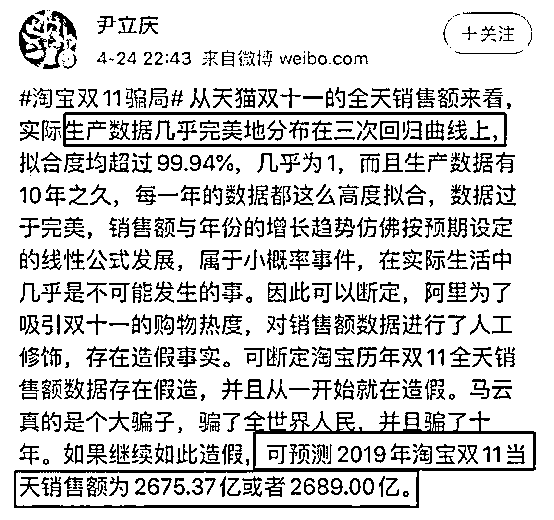
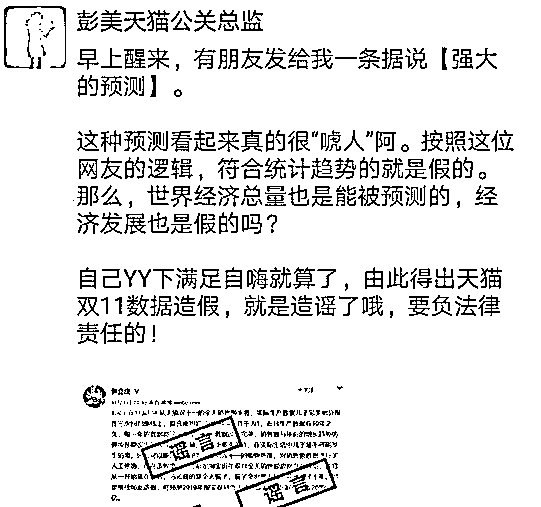

# 三千二百八十、亿！这是今年双十一销售额的预测模型

> 原文：[`mp.weixin.qq.com/s?__biz=MzAxNTc0Mjg0Mg==&mid=2653306974&idx=1&sn=811128377b6ba33de88a7d539158d740&chksm=802d824bb75a0b5d0c66afb41c8530f40a22711266c058d4fd52ea5b22d43d43cf44fff48de9&scene=27#wechat_redirect`](http://mp.weixin.qq.com/s?__biz=MzAxNTc0Mjg0Mg==&mid=2653306974&idx=1&sn=811128377b6ba33de88a7d539158d740&chksm=802d824bb75a0b5d0c66afb41c8530f40a22711266c058d4fd52ea5b22d43d43cf44fff48de9&scene=27#wechat_redirect)

**全网 TOP 量化自媒体**

## **引言**

每年 11 月 11 日，也称“双十一”。因有四根棍一样的“1”字，被形象地称为“光棍节”。同时也因 2009 年 11 月 11 日开始淘宝举办的每年一次网购促销活动将小年轻的“光棍节”进击成了全民性的“双十一网购狂欢节”。2012 年“双十一”全日销售额超过美国最火爆的购物日“网络星期一”，成为全球最大的互联网购物节日。“双十一”的发起者阿里巴巴 CEO 张勇更是将此称为“商业界的奥林匹克”。

图 1: 双十一快乐就是各种买买买

2019 年双十一当天，仅 14 秒天猫成交额破 10 亿，1 分 36 秒成交额就破 100 亿。全天最终成交额高达 2684 亿元，成功刷新了 2018 创下的成交额纪录。在不断刷新的数字背后，是中国“剁手族”数量及其消费能力的“爆炸式”增长，也印证着中国互联网经济发展的黄金十年。

图 2: 09 至 19 年双十一总的销售额

然而，每年不断攀升的“双十一”成交额数据却遭到了网友们的质疑。早在 2019 年双十一之前，就有微博博主尹立庆指出：利用二次多项式和三次多项式对淘宝十年以来“双十一”销售额进行拟合后，每年的数据点与拟合曲线都高度吻合，销售额的增长趋势仿佛按早已设定好的公式发展，数据过于完美，不符合实际生活。并据此认为阿里巴巴为提高“双十一”购物热度，对销售额进行人工修饰，存在造假事实。而 2019 年双十一最终成交额 2684 亿元也确实在尹立庆给出的预测区间内，预测误差甚至不超过 10 亿，相对误差不超过千分之四。

图 3: 尹立庆质疑淘宝双十一销售数据造假

针对尹立庆和网友的质疑，天猫发言人在 11 月 12 日回应称，“按照网友的逻辑，符合统计趋势的就是假的。那么，世界经济总量也是能被预测的，经济发展也是假的吗？自己 YY 下满足自嗨就算了，由此得出天猫双 11 数据造假，就是造谣了哦，要负法律责任的！”。

图 4: 天猫官方回应尹立庆和网友的质疑

本文将根据历年天猫“双十一”公布的数据，建立模型，挖掘数据背后的机制。对即将到来的 2020 年“双十一”的最终和各时间点销售额进行预测，并就“双十一”数据是否造假做出更为科学的评论和判断。

## **模型**

### **总销售额**

双十一销售额是所有参与活动的消费者支出总和，因此总销售额 <mjx-container jax="SVG" role="presentation" tabindex="0" ctxtmenu_counter="4" style="" data-formula="S"></mjx-container> 可以表示为消费者数量 <mjx-container jax="SVG" role="presentation" tabindex="0" ctxtmenu_counter="5" style="" data-formula="N"></mjx-container> 乘以每位消费者的平均消费 <mjx-container jax="SVG" role="presentation" tabindex="0" ctxtmenu_counter="8" style="" data-formula="c"></mjx-container> ，即 <mjx-container jax="SVG" display="true" role="presentation" tabindex="0" ctxtmenu_counter="3" style="overflow-x: auto;outline: 0px;display: block;text-align: center;margin: 15px 0px;" data-formula="S(T) = N(T)\times c(T)"></mjx-container>其中 <mjx-container jax="SVG" role="presentation" tabindex="0" ctxtmenu_counter="6" style="" data-formula="T"></mjx-container> 表示年份。随着网络的普及，参与每年双十一网购的消费者数量在不断增长。随着经济发展、个人收入的提高，每位消费者在双十一网购活动中的平均消费也在不断增长。因此双十一销售额的增长，是这两种增长效应的叠加。

首先，我们需要探究每年参与双十一网购的消费者数量增长规律。随着智能手机和移动支付的普及，几乎所有网购行为都离开不手机支付。双十一购物中超过 90% 的交易是通过手机进行的。因此可以认为参与网购的消费者数量与移动互联网用户数量正相关。

图 5: 09 至 19 年中国移动互联网用户数量

图 5 是过去十一年间中国移动互联网用户的数量，可以看出数据的增长完美地符合线性，线性拟合度高达 0.9993。因此，可以认为双十一消费者数量的增长也是线性的，即 <mjx-container jax="SVG" display="true" role="presentation" tabindex="0" ctxtmenu_counter="11" style="overflow-x: auto;outline: 0px;display: block;text-align: center;margin: 15px 0px;" data-formula="N(T) = a_1\times T + b_1"></mjx-container>其中 <mjx-container jax="SVG" role="presentation" tabindex="0" ctxtmenu_counter="12" style="" data-formula="a_1"></mjx-container> 和 <mjx-container jax="SVG" role="presentation" tabindex="0" ctxtmenu_counter="13" style="" data-formula="b_1"></mjx-container> 为固定的常数， 表示年份。

图 6: 09 至 19 年中国人均可支配收入

其次，我们需要探究每位消费者在双十一网购中平均消费的增长规律。绝大多消费者都是理性的，只会从自己的可支配收入中拿出一定的比例进行网购。因此，可以认为消费者在双十一中的消费与其可支配收入正相关。图 6 是过去十一年间中国人均可支配收入，可以看出数据的增长也完美地符合线性，线性拟合度高达 0.9977。因此，可以认为消费者在“双十一”中平均消费的增长也是线性的，即 <mjx-container jax="SVG" display="true" role="presentation" tabindex="0" ctxtmenu_counter="18" style="overflow-x: auto;outline: 0px;display: block;text-align: center;margin: 15px 0px;" data-formula="c(T) = a_2\times T + b_2"></mjx-container>其中 <mjx-container jax="SVG" role="presentation" tabindex="0" ctxtmenu_counter="19" style="" data-formula="a_2"></mjx-container> 和 <mjx-container jax="SVG" role="presentation" tabindex="0" ctxtmenu_counter="20" style="" data-formula="b_2"></mjx-container> 为固定的常数，<mjx-container jax="SVG" role="presentation" tabindex="0" ctxtmenu_counter="21" style="" data-formula="T"></mjx-container> 表示年份。

通过以上分析，我们发现双十一消费者数量的增长和每位消费者平均消费的增长都是时间的一次函数。因此双十一的最终销售额可表示为时间的二次函数 <mjx-container jax="SVG" display="true" role="presentation" tabindex="0" ctxtmenu_counter="62" style="overflow-x: auto;outline: 0px;display: block;text-align: center;margin: 15px 0px;" data-formula="S(T) = N(T)\times c(T) = a\, T² + b\, T + c"></mjx-container>其中 <mjx-container jax="SVG" role="presentation" tabindex="0" ctxtmenu_counter="21" style="" data-formula="a"></mjx-container> = <mjx-container jax="SVG" role="presentation" tabindex="0" ctxtmenu_counter="24" style="" data-formula="a_1\times a_2"></mjx-container> , <mjx-container jax="SVG" role="presentation" tabindex="0" ctxtmenu_counter="26" style="" data-formula="b"></mjx-container> = <mjx-container jax="SVG" role="presentation" tabindex="0" ctxtmenu_counter="31" style="" data-formula="a_1b_2"></mjx-container> + <mjx-container jax="SVG" role="presentation" tabindex="0" ctxtmenu_counter="33" style="" data-formula="a_2b_1"></mjx-container> ， <mjx-container jax="SVG" role="presentation" tabindex="0" ctxtmenu_counter="5" style="" data-formula="c"></mjx-container> = <mjx-container jax="SVG" role="presentation" tabindex="0" ctxtmenu_counter="38" style="" data-formula="b_1\times b_2"></mjx-container> 都为常数。我们对历年双十一的销售额进行二次拟合，拟合出的二次函数为 <mjx-container jax="SVG" display="true" role="presentation" tabindex="0" ctxtmenu_counter="32" style="overflow-x: auto;outline: 0px;display: block;text-align: center;margin: 15px 0px;" data-formula="S(T) = 30.2(T-2019)² - 35.1(T-2019) + 7.4"></mjx-container>其中  为年份，拟合度高达 0.9996。拟合曲线已经在图 7 中绘出（红线）。

图 7: 双十一销售额拟合预测

可以看出，实际数据与拟合曲线高度吻合。将 <mjx-container jax="SVG" role="presentation" tabindex="0" ctxtmenu_counter="37" style="" data-formula="T"></mjx-container> = 2020 和 <mjx-container jax="SVG" role="presentation" tabindex="0" ctxtmenu_counter="39" style="" data-formula="T"></mjx-container> = 2021 代入拟合得到的方程中，可预测出 2020 年和 2021 年天猫双十一的销售额分别为 3280 亿和 3941 亿。

### **各时间点销售额**

要预测双十一当天各时间点销售额，先得了解一下近三年双十一当天各时间点的销售额规律。通过观察图 8，不难发现，近三年双十一当天各时间点的销售额曲线走势非常相似。在 0 点到 2 点的增长最快，原因是很大一部分消费者要抢在 0 点过后一段时间内付完款。2 点到 7 增长缓慢，这个时间段大部分人在睡觉。7 点到 14 点有一段稳定增长，14 点到 21 点间增长速度基本不变。21 点后有一段小加速，原因可能是一部分人想抓住双十一的尾巴。

图 8: 09 至 19 年双十一不同时间点销售额

为了找到不同年份双十一各时间点销售额的共同点，我们对销售额数据进行了归一化处理。用  年双十一当天  时刻已经完成的销售额 <mjx-container jax="SVG" role="presentation" tabindex="0" ctxtmenu_counter="42" style="" data-formula="S(T,t)"></mjx-container> 除当天最终销售额 <mjx-container jax="SVG" role="presentation" tabindex="0" ctxtmenu_counter="40" style="" data-formula="S(T,24)"></mjx-container> 作为归一化销售额 <mjx-container jax="SVG" role="presentation" tabindex="0" ctxtmenu_counter="41" style="" data-formula="s(T,t)"></mjx-container>，即 <mjx-container jax="SVG" display="true" role="presentation" tabindex="0" ctxtmenu_counter="46" style="overflow-x: auto;outline: 0px;display: block;text-align: center;margin: 15px 0px;" data-formula="s(T,t) = \frac{S(T,t)}{S(T,24)}\times 100\%"></mjx-container>我们发现，尽管每年双十一当天同一时间点的销售额同比都在增加，但各时间点所完成的销售额所占当天总销售额的比例却几乎相同，即 <mjx-container jax="SVG" role="presentation" tabindex="0" ctxtmenu_counter="39" style="" data-formula="s(T,t)"></mjx-container> 与年份 <mjx-container jax="SVG" role="presentation" tabindex="0" ctxtmenu_counter="40" style="" data-formula="T"></mjx-container> 无关。图 9 是近三年双十一各时间点归一化销售额。

图 9: 17 至 19 年双十一各时刻归一化销售额

从图中可以看出，近三年双十一当天各时间点归一化销售额都非常完美在同一条曲线附近，拟合度高达 0.999。该曲线即为 <mjx-container jax="SVG" role="presentation" tabindex="0" ctxtmenu_counter="41" style="" data-formula="s(t)"></mjx-container>，是通过对近三年双十一当天各时间点归一化销售额插值后取平均得到的。我们将曲线 <mjx-container jax="SVG" role="presentation" tabindex="0" ctxtmenu_counter="42" style="" data-formula="s(t)"></mjx-container> 乘以上文预测得到的 2020 年双十一总销售额，就可以预测双十一当天各时间点的销售额了，结果如图 10 所示。结果表明，2020 年双十一当天 2 小时销售额将超 1500 亿，10 小时超 2000 亿，22 小时超 3000 亿。

图 10: 2020 年双十一各时间点销售额预测

## **讨论**

### **数据到底有没有造假？**

从上面的模型来看，不管是历年的总销售额，还是某年双十一当天各时间点的销售额，都与拟合曲线完美匹配。这种“完美”遭到了网友的质疑。为了判断这种“完美”是不是正常的，我们对美国三大促销日销售额也进行了拟合，拟合结果见图 11。

图 11: 美国促销活动销售额拟合预测

三条曲线的拟合度分别是为 0.9930、0.9906 和 0.9958。直观上来看，美国三大促销日销售额的拟合曲线也很完美，但“完美”程度比我国双十一差。用 08-18 年的数据预测 19 年的数据，三大促销日预测的相对误差仅为 3%、9% 和 4%。不过相比于误差不超过千分之三的天猫双十一，美国三大促销日的销售数据似乎更令人信服一点。

但我们不要忽略了我国的发展相对于美国更为稳定。销售额增长的动力源自于互联网用户数量的增长和人均可支配收入的增长。图 12 和图 13 给出了 2008 至 2019 年美国移动互联网用户数量和人均可支配收入，线性拟合度分别为 0.8963 和 0.9676。相比于我国的数据（图 5 和 6），美国移动互联网用户数量和人均可支配收入的线性拟合效果要差得多。这表明我国的社会和经济发展非常稳定，而美国则要动荡得多。这样看来，美国三大促销日销售额的规律性比我国的双十一差也就不足为奇了。

图 12: 08 至 19 年美国移动互联网用户数量

图 13: 08 至 19 年美国人均可支配收入

此外，我国的人口基数远大于美国，双十一的销售规模也远大于美国三大促销日。参与人数越多、销售规模越大，销售额越能表现出规律性。这就像抛硬币，只抛 10 次，很难保证正面朝上和朝下各出现 5 次。但如果抛 10 万次，正面朝上出现的机率基本为 0.5。抛的次数越大，越能表现出规律性。

而从阿里自身角度来看，阿里是一家大数据公司，想要控制住销售额也很容易。通过数据分析找出最活跃的商品，然后通过增加或者减少这些商品投送，就能达到一个类似的预设目标，保持每年的增长率。因此阿里根本没必要伪造数据或者刷单。综上所述，双十一销售额数据表现出的这种“完美”是正常，造成这种“完美”的原因是我国移动互联网用户数量和人均可支配收入的稳定增长，参与网络的人数体量巨大，以及阿里强大的数据分析和控制能力。

### **疫情对双十一有何影响？**

新冠疫情对双十一的影响主要是通过影响人均可支配收入和互联网用户数量。一方面疫情确实对我国经济造成了很大影响，这种影响会直接反映到人们的收入上。今年我国的人均可支配收入的增长速度可能会有所下降。但由于我国疫情的快速控制，在一季度负增长 6.8% 之后，我国经济二季度增速跃升 10 个百分点，实现由负转正。因此，这种“下降”可能是有限的，对双十一销售额的负面影响也是有限的。

另一方面，新冠疫情对双十一销售额也有一定的正面影响。疫情导致更多的人适应了网购、在线学习和在线工作的模式。统计数据显示，由于疫情期间大多数人被限制在家，移动互联网用户每天使用网络的时间比疫情前增加了一个多小时。而更多的人适应网购会潜在地增加参与双十一的购物者数量。此外，由于疫情的影响，可能还会出现消费者报复性消费的行为。

综上所述，疫情对双十一的影响既有负面的也有正面的，但总体应该是有限的，因此我认为双十一的销售额不会与预测结果有较大出入。

## **结论**

双十一销售额增长是互联网用户数量增长和人均可支配收入增长的叠加效应。本文通过数据分析，发现我国移动互联网用户数量和人均可支配收入增长都是时间的线性函数，由此可知双十一销售额应该是时间的二次函数。随后，我们对历年双十一的销售额进行二次拟合，发现实际数据与拟合曲线高度吻合。

**据此，我们预测出今年双十一销售额将达到 3280 亿。**在此基础上，我们对近三年双十一当天各时间点的销售额进行了分析，发现不同年份双十当天同一时间点的销售额占当天总销售额的比例几乎相同。

**据此，我们对 2020 年双十一当天各时间点销售额进行了预测：2 小时将超 1500 亿，10 小时超 2000 亿，22 小时超 3000 亿。**

此外，我们还对双十一数据到底有没有造假，以及疫情对双十一的销售额有何影响进行了讨论。**结果表明阿里根本没必要造假，疫情对今年双十一的销售额不会有太大影响。**

## **附录**

点击在公众号后台回复：**2020 双 11**，即可获取本文 PDF 版和附件。

**参考资料**

[1]Sirui Zhu. A look at alibaba's 'double 11' shopping day, the world’s largest online retail event, 2019: https://graphics.reuters.com/SINGLES-DAY-ALIBABA/0100B30E24T/index.html

[2]子慕. 2017 天猫双 11 全天交易额节点汇总, 2017: http://www.dsb.cn/69248.html

[3]爱德华. 2018 年天猫双 11 交易额节点大汇总, 2018: http://www.dsb.cn/89836.html

[4]cnBeta. 2019 年天猫双 11 落幕:交易额 2684 亿元, 2019: https://www.cnbeta.com/articles/tech/909137.htm

[5]亿邦动力网. 截至 19 时 2019 天猫双 11 总成交额达 2262.1 亿, 2019: http://www.ebrun.com/ebrungo/zb/359155.shtml

[6]维基百科. 双十一 — 维基百科, 自由的百科全书, 2020: https://zh.wikipedia.org/wiki/双十一

[7]百度百科. 双十一购物狂欢节, 2020: https://baike.baidu.com/item/双十一购物狂欢节

[8]Statista. Number of mobile internet users in china from 2015 to 2019 with a forecast until 2023, 2020: https://www.statista.com/statistics/558731/number-of-mobile-internet-user-in-china/

[9]统计局网站. 2011-2015 年全国居民人均可支配收入及其增长速度, 2016: http://www.humanrights.cn/html/zt2016/02/syjb/jjsh/2/2016/0624/19000.html

[10]统计局网站. 2019 年全国居民人均可支配收入, 2020: http://www.gov.cn/guoqing/2020-03/09/content_5362699.htm

[11]经济参考报. 战“疫”中崛起复苏的力量——从“半年报”看中国经济强大韧性, 2020: http://www.xinhuanet.com/fortune/2020-07/20/c_1126258535.htm

[12]statista. Average time spent on mobile internet before, during and after coronavirus epidemic in china in 2019 and 2020 (in hours), 2020: https://www.statista.com/statistics/1105335/china-time-spent-on-mobile-internet-covid-19

  量化投资与机器学习微信公众号，是业内垂直于**Quant****、Fintech、AI、ML**等领域的**量化类主流自媒体。**公众号拥有来自**公募、私募、券商、期货、银行、保险、资管**等众多圈内**18W+**关注者。每日发布行业前沿研究成果和最新量化资讯。