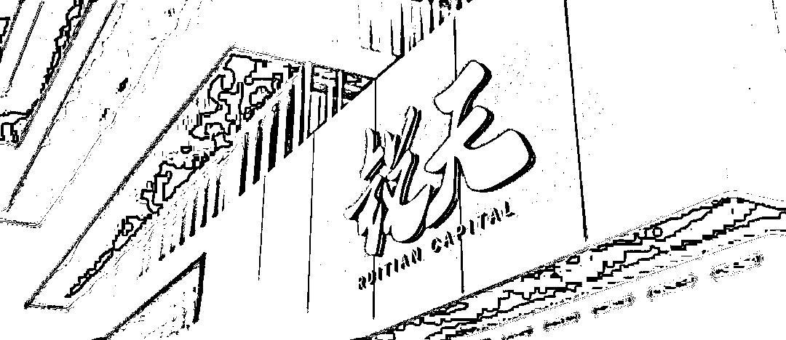
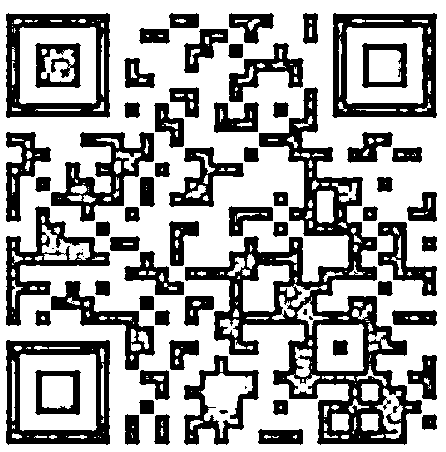
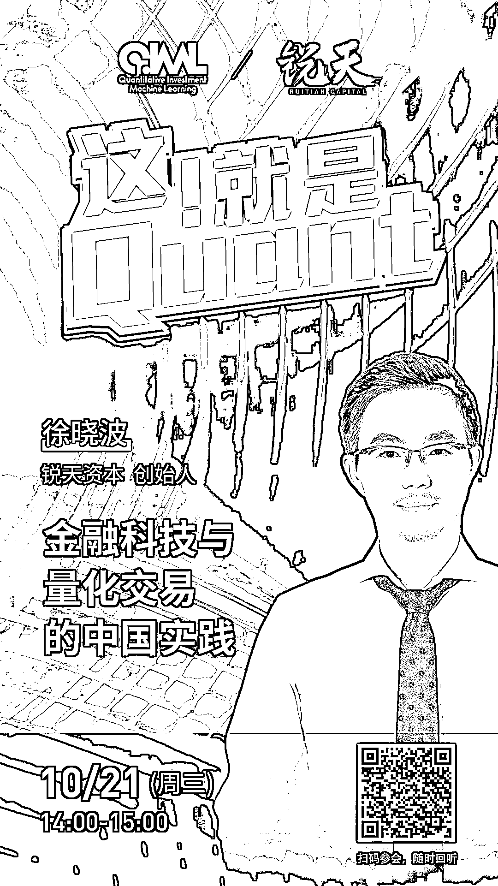

# 锐天：金融科技与量化交易的中国实践

> 原文：[`mp.weixin.qq.com/s?__biz=MzAxNTc0Mjg0Mg==&mid=2653306923&idx=1&sn=387563640333fecbd7e86da03eb851d3&chksm=802d823eb75a0b2897f0c6cd7f095e145e9c02f5794a43447d7daa2b2b44192655484568b87b&scene=27#wechat_redirect`](http://mp.weixin.qq.com/s?__biz=MzAxNTc0Mjg0Mg==&mid=2653306923&idx=1&sn=387563640333fecbd7e86da03eb851d3&chksm=802d823eb75a0b2897f0c6cd7f095e145e9c02f5794a43447d7daa2b2b44192655484568b87b&scene=27#wechat_redirect)

***1***

**关于锐天**

锐天是一家由数据驱动的高科技公司。

秉承对量化始终如一的专注，严谨的科学态度，以及对投资研究的热爱，重视科学研究、人才培养和技术积累。

锐天人具有强大的逻辑思维能力、充满好奇心、拥有较真的性格和强悍的执行力。

希冀在转型期中国金融历史上，留下自己的烙印，做持续领先的量化对冲基金。

***2*** 

**嘉宾互动环节**

本次网络直播会议将设置：**读者问答环节**。大家如有问题向嘉宾提问，请**扫码下方二维码**填写问卷。我们将根据问题质量，选择性在直播中进行回答。欢迎大家踊跃提问哦！

***3***

**如何参会？**

**扫码下方海报二维码，即可收听！**

量化投资与机器学习微信公众号，是业内垂直于**Quant****、Fintech、AI、ML**等领域的**量化类主流自媒体。**公众号拥有来自**公募、私募、券商、期货、银行、保险、资管**等众多圈内**18W+**关注者。每日发布行业前沿研究成果和最新量化资讯。