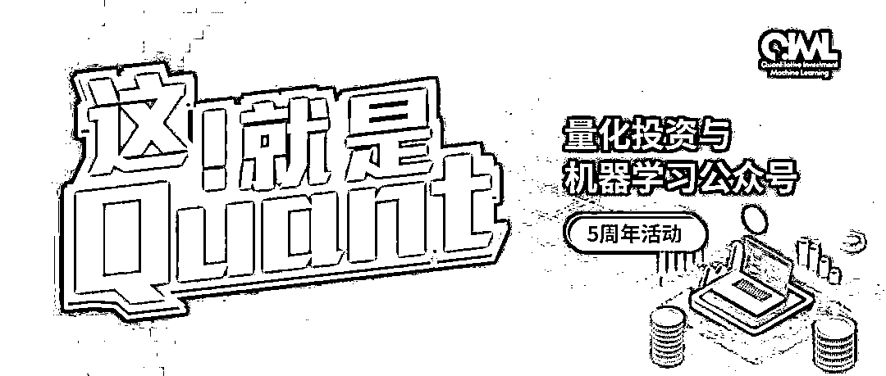
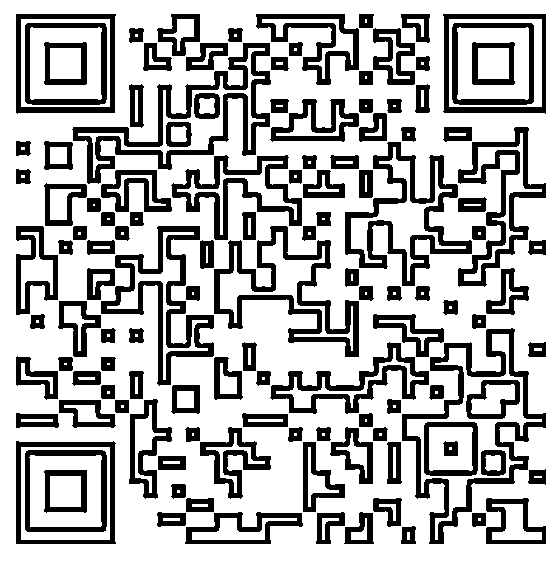
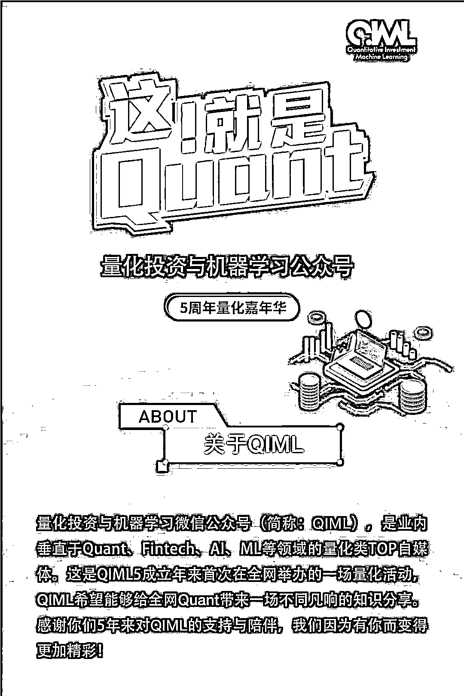
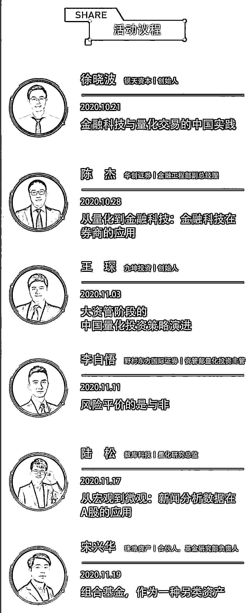
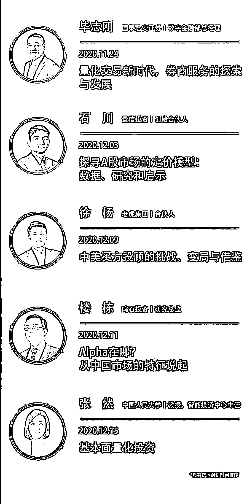
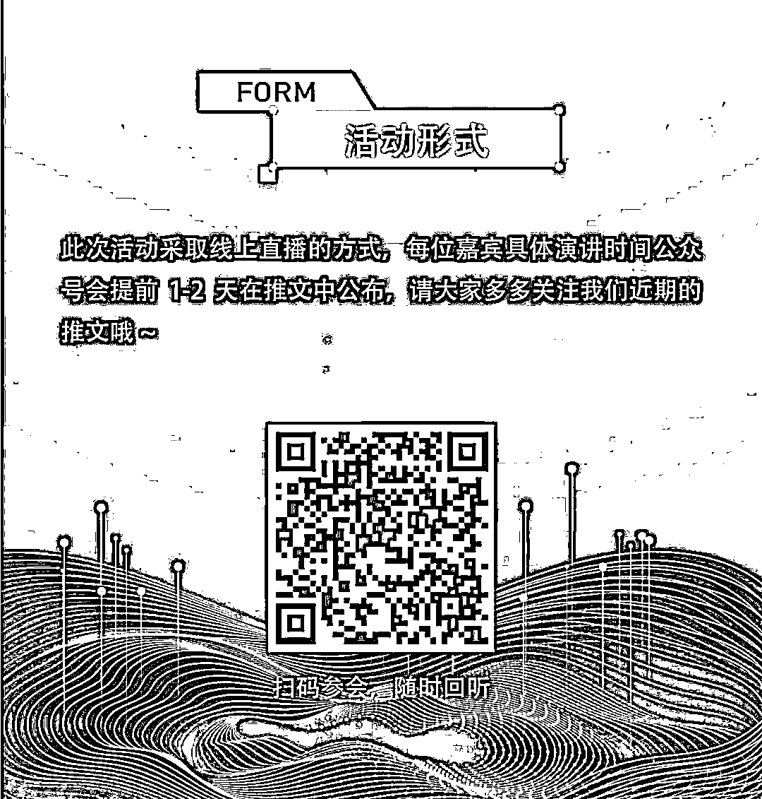
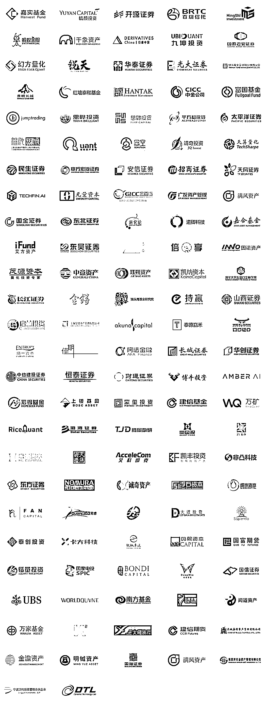

# 二千零二十、年度巨献 | QIML 全球量化嘉年华强势来袭！

> 原文：[`mp.weixin.qq.com/s?__biz=MzAxNTc0Mjg0Mg==&mid=2653306887&idx=1&sn=c9b8ce2bdf6c17c1833b2f18fe8d3f06&chksm=802d8212b75a0b04d63492e15956b0edc389e29e5b5e63437127290cc2869e7a3481addefc3d&scene=27#wechat_redirect`](http://mp.weixin.qq.com/s?__biz=MzAxNTc0Mjg0Mg==&mid=2653306887&idx=1&sn=c9b8ce2bdf6c17c1833b2f18fe8d3f06&chksm=802d8212b75a0b04d63492e15956b0edc389e29e5b5e63437127290cc2869e7a3481addefc3d&scene=27#wechat_redirect)

**量化投资与机器学习公众号成立**

**5 周年了**

5 年，从稚嫩到成熟 5 年，累计 20 万读者···
**文末有彩蛋**

**感谢 5 年来一直关注 QIML 的铁杆粉丝们！**是你们的不离不弃，才有了 QIML 今日的成绩。QIML 也希望为中国的量化事业贡献一份自己的力量！

为此，我们决定举办一场别开生面的量化嘉年华活动，以此来表达对读者们的敬意与感谢！ 

请大家**扫描下方二维****码**订阅收听每场直播会议：

扫码参会，随时回听

此次 5 周年主题活动，QIML 邀请了诸多业界量化大佬前来助阵。接下来，就让我们来看看都有哪些嘉宾和具体议题：

  

同时，我们还要感谢上百家金融机构对 QIML 的支持与信任。QIML 也期待与更多量化金融机构开展形式多样的深度合作。以下是部分合作机构：

*机构排名不分先后

展望未来，QIML 公众号会为全网读者带来更多的原创量化干货和工作机会。同时，我们也会在研究内容、人才招聘上有一个全新的平台带给大家！是什么呢？

**PCQ**

明年揭晓，大家尽情想象！

量化投资与机器学习微信公众号，是业内垂直于**Quant****、Fintech、AI、ML**等领域的**量化类主流自媒体。**公众号拥有来自**公募、私募、券商、期货、银行、保险、资管**等众多圈内**18W+**关注者。每日发布行业前沿研究成果和最新量化资讯。