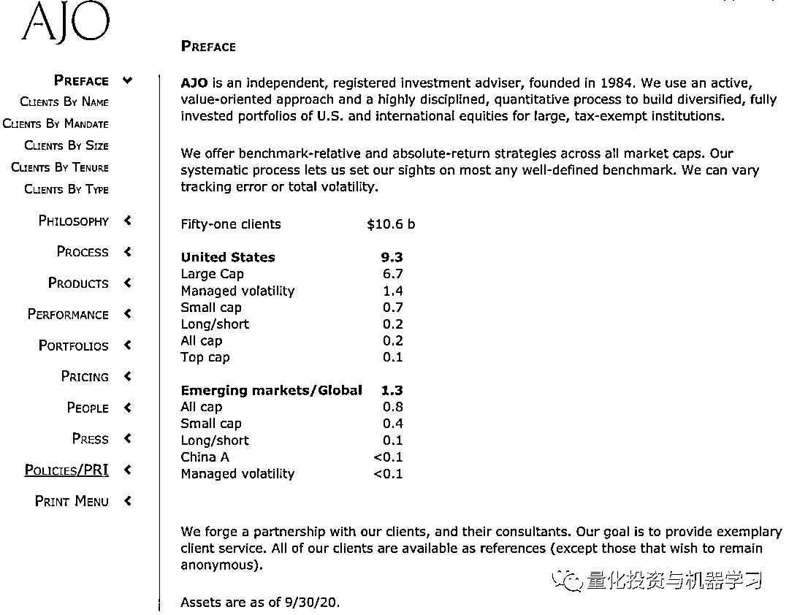
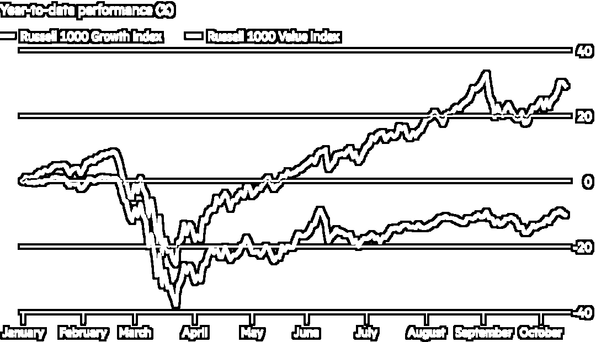
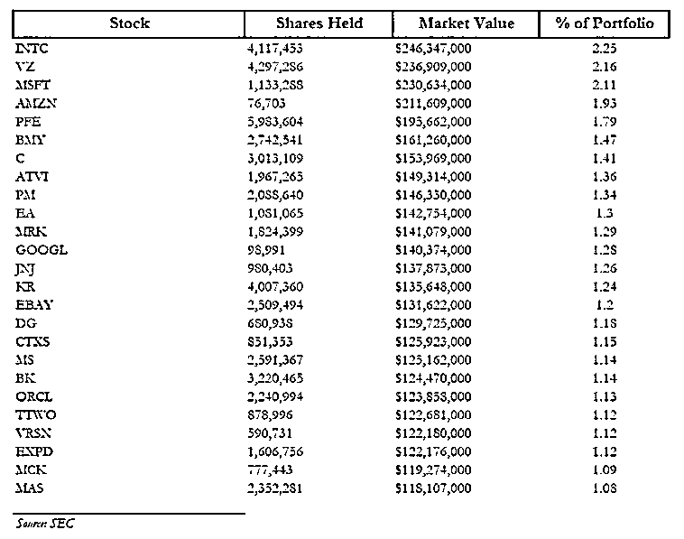

# 一百零六、亿对冲基金关门！因为坚持价值投资 (⊙ˍ⊙)

> 原文：[`mp.weixin.qq.com/s?__biz=MzAxNTc0Mjg0Mg==&mid=2653306119&idx=1&sn=40694a0b8d15bf9aa06c09b1a5c64028&chksm=802dff12b75a76049078bc248473f6ce9e34b4751195e09570123120595889c19fc692c7efab&scene=27#wechat_redirect`](http://mp.weixin.qq.com/s?__biz=MzAxNTc0Mjg0Mg==&mid=2653306119&idx=1&sn=40694a0b8d15bf9aa06c09b1a5c64028&chksm=802dff12b75a76049078bc248473f6ce9e34b4751195e09570123120595889c19fc692c7efab&scene=27#wechat_redirect)

**全网 TOP 量化自媒体**

内容来自自：Wind、FT、Google

最近十年的前五年间，美股的价值股和成长股还能“肩并肩”一起玩耍，而在后五年，成长股一骑绝尘，抛下价值股独自在风中凌乱坠落……，这对于价值投资者来说，简直不能再糟糕。而那些跟踪价值的纯量化基金则更加艰难，管理着 106 亿美元（为 51 个客户管理）资产的对冲基金 AJO Partners 就因此关闭。

图片来自：AJO 官网

成长股一直向上，而价值股始终难有表现，市场上没有谁比跟踪价值股的纯量化基金更加痛苦了，在最近四年几乎没有获取到任何 Alpha。逃离价值股成为投资者的上上之选，更多的基金因为没有及时调整策略也因此关门。因为在当前的市场氛围中，依靠正常的市场机制和套利手段不再有效。

图片来自：彭博

AJO Partners 就是跟踪价值股的纯量化基金之一，但其价值策略使其遭受了重大损失。AJO Partners 的创始人 Ted Aronson 在一封信中表示，该对冲基金宣布在 11 月 30 日停止交易，12 月 31 日结束业务，为这家运营了 36 年的公司画上句号。

Ted Aronson 在一封投资者信中写到：我们仍然相信价值投资是有未来的，悲观的是，未来没有那么快到来，至少对于我们来说是如此。所以，现在最好的安排是归还资产，然后就这样告别。我们的客户都是成熟的大型机构客户，他们还有更好的选择。

他补充说到： *"the drought in value — the longest on record — is at the heart of the challenge. The length and severity of the headwinds have led to lingering viability concerns among clients, consultants and employees."*

据分析，**导致该基金停止运营的罪魁祸首是其旗下的 AJO 大盘股绝对价值策略基金**，管理着 51 亿美元的资产。截止到今年 9 月，AJO 大盘股绝对价值策略基金下跌 15.5%。在截止到 6 月 30 日披露的数据中，该基金最大的持仓股是英特尔，年初至今跌幅大约为 10%。

AJO 目前的资产管理规模从 2019 年 12 月 31 日的 188 亿美元下降了 46.8% ，从 2016 年 12 月 31 日的 283 亿美元下降了 64.7% 。Aronson 提到，2007 年，AJO 为 114 位资产所有者管理的管理资产达到了 310 亿美元的峰值。

近期终止与 AJO 的机构包括：

1、45 亿美元的加利福尼亚州 Fresno County 雇员退休协会在 8 月份终止了 AJO 管理的 1.11 亿美元投资组合 

2、今年 7 月，拥有 194 亿美元资产的洛杉矶雇员退休系机构止了其 1.83 亿美元投资组合中的 AJO，原因是 AJO 在进入该基金观察名单三年后的相对表现没有改善。

3、价值 29 亿美元的俄克拉何马州消防员退休金和退休机构，在 6 月份终止 AJO 的 8000 万美元策略。

实际上，今年美股价值股表现都不佳，罗素 1000 价值指数年初至今跌约 12%。但市场的另一面是不断高涨的成长股，比如苹果公司年初至今涨幅达到 66%，特斯拉年初至今涨约 451%！这对价值投资基金的投资者来说，简直是降维打击，坚持价投极其需要定力和耐心。

AJO 大盘股绝对价值策略基金成立于 1984 年，提供一系列基于价值等因素构建的系统化策略。然而，在超过 10 万亿美元债券收益率为负的、通货紧缩的环境下，这一策略被证明是令人沮丧的。截止到 6 月 30 日公布的信息中，该基金持有 25 只股票，不出意外这些股票都将遭受抛售。

**Ted Aronson 已经宣布退休，不再“蹚价值投资的浑水”。**

数据显示，价值投资鼻祖，股神巴菲特近几年也星光暗淡，但买苹果是近几年最正确的决定无疑，挽救了声誉。据其二季度公布的数据显示，剔除苹果之后，巴菲特上半年持有的股票资产是 1250 亿美元，即同期亏损幅度高达 27%。

量化投资与机器学习微信公众号，是业内垂直于**Quant****、Fintech、AI、ML**等领域的**量化类主流自媒体。**公众号拥有来自**公募、私募、券商、期货、银行、保险、资管**等众多圈内**18W+**关注者。每日发布行业前沿研究成果和最新量化资讯。