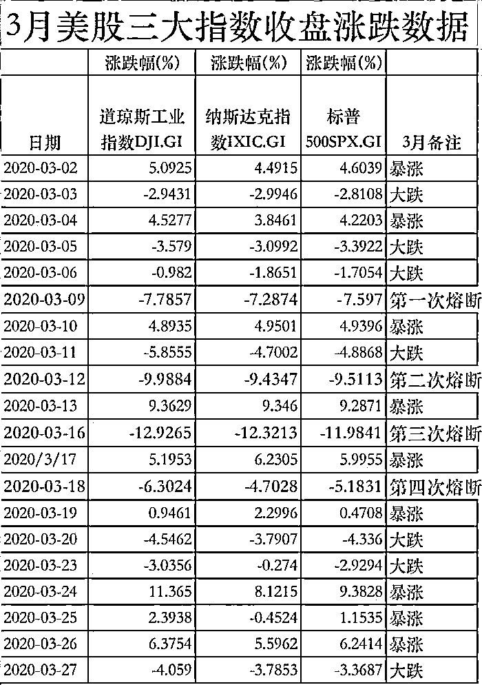
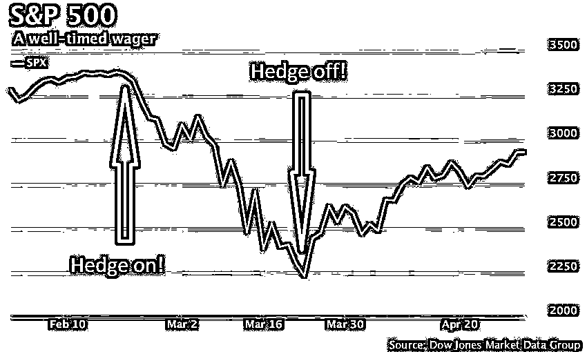
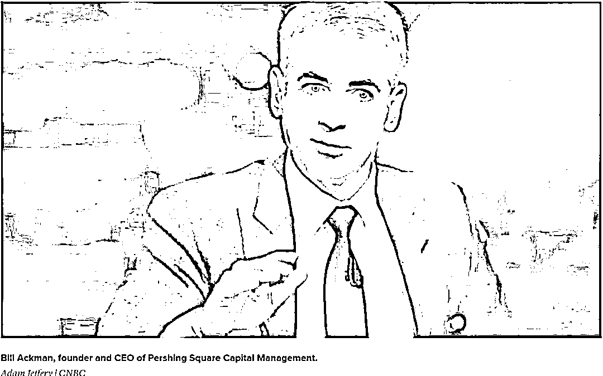
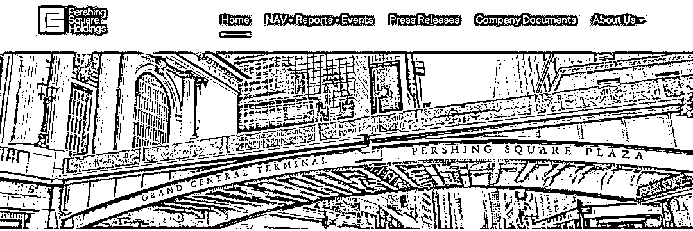
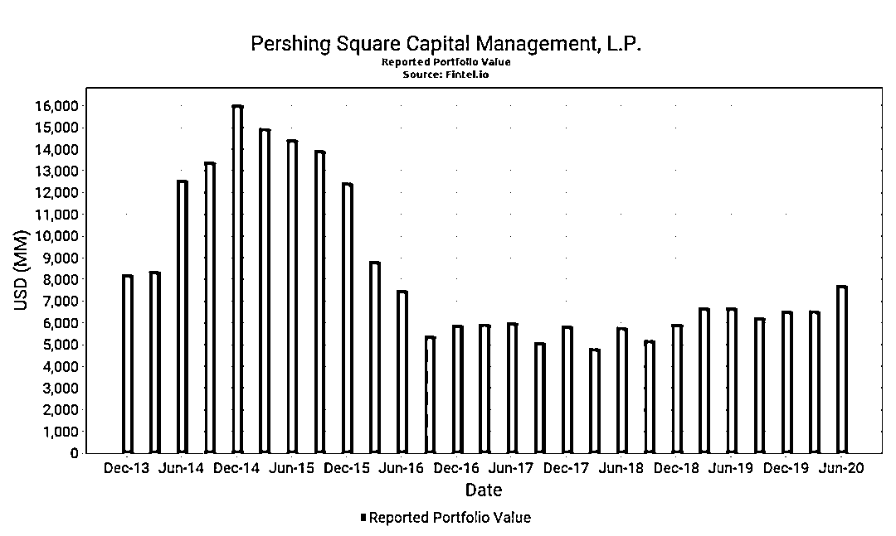
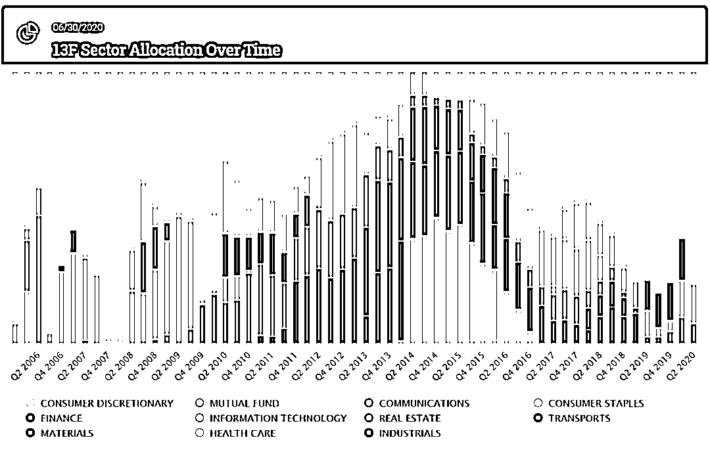
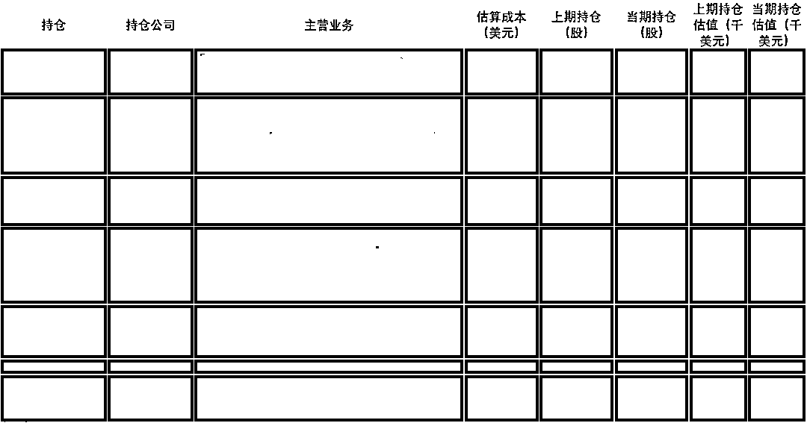
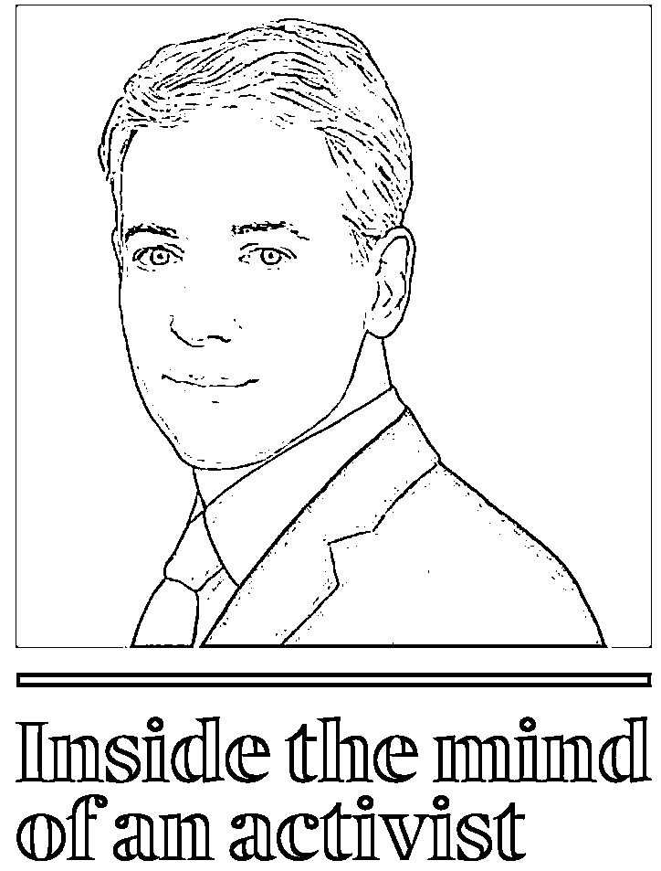
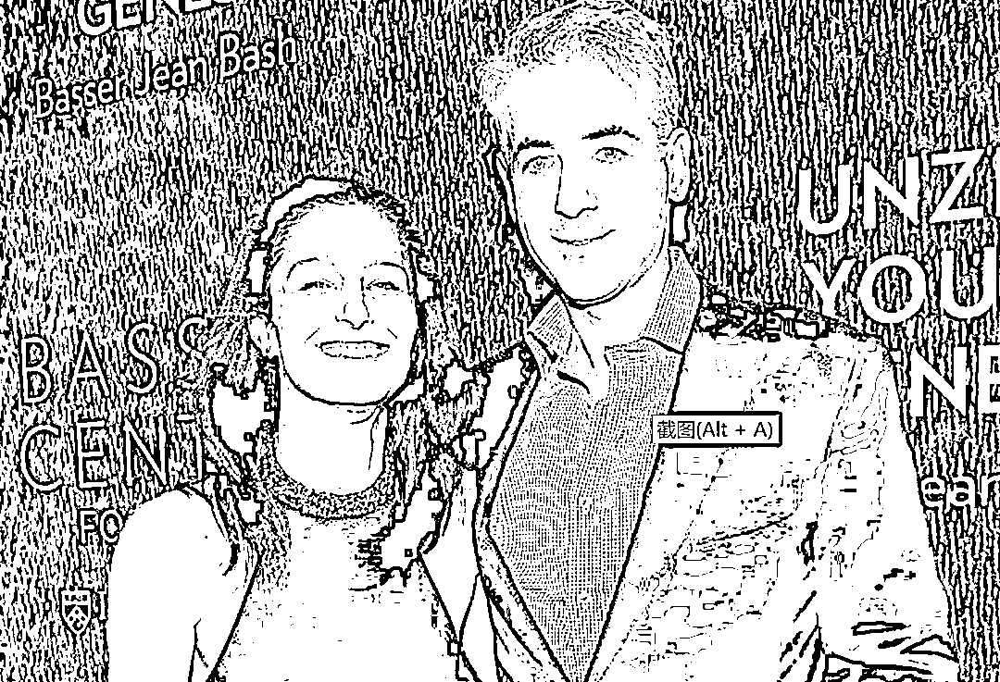
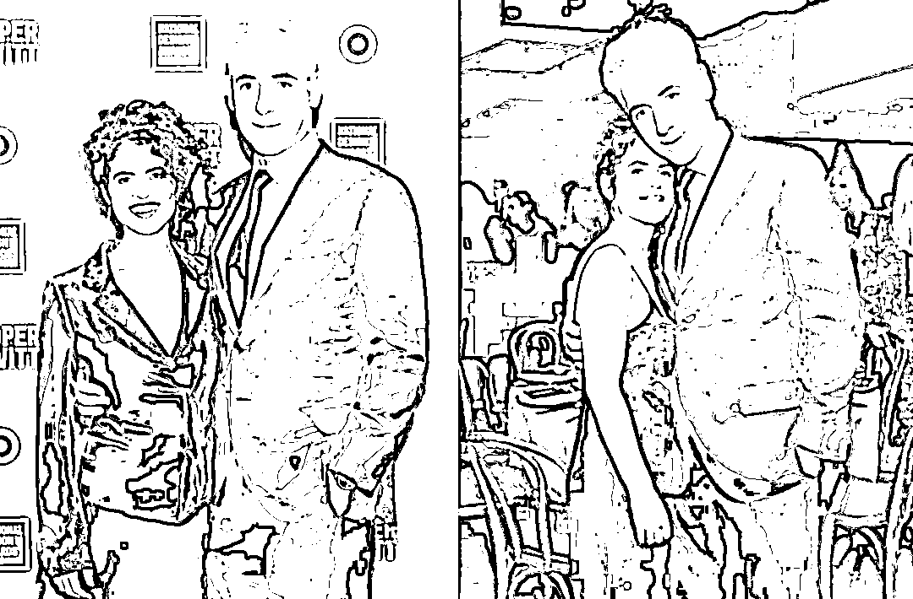

# Billions 原型：Ackman 在 2020 年股债双杀中的豪赌

> 原文：[`mp.weixin.qq.com/s?__biz=MzAxNTc0Mjg0Mg==&mid=2653306085&idx=1&sn=8fd102f52f8a800fb953072f830ae771&chksm=802dfef0b75a77e61e82bd646a5db63fe33aa840f637fff3fb1a53057d292f3285ec77d39bc6&scene=27#wechat_redirect`](http://mp.weixin.qq.com/s?__biz=MzAxNTc0Mjg0Mg==&mid=2653306085&idx=1&sn=8fd102f52f8a800fb953072f830ae771&chksm=802dfef0b75a77e61e82bd646a5db63fe33aa840f637fff3fb1a53057d292f3285ec77d39bc6&scene=27#wechat_redirect)

**全网 TOP 量化自媒体**

译者说：这是潘兴广场的掌门人 Ackman 在 2020 年 3 月 25 日写下的致投资者的一封信，这封信解释了年初 Ackman 被媒体密切关注的一项赌注——如何把 2700 万美元变成了 26 亿美元，从信中可以看到 Ackman 对于新冠疫情下市场机会的分析逻辑。Ackman 曾被当做美剧《亿万》的原型之一，当年曾因为做空康宝莱和 Carl Lcahn 在 CNBC 的直播节目中针锋相对对骂半小时，枭雄的风范并没有在那场损失十几亿并带来官司的交易中消逝。在年初股债双杀的局面下，Ackman 抓住了翻身的机遇，做对了方向。不仅得以在 3 月的震荡中虎口逃生，后面越来越顺，6 月中旬，Ackman 融资 10 亿美元做一项重大投资，在 6 个星期后华尔街给他融到了 40 亿美元。对于 Ackman 来说，这个 40 亿美元的数字对他来说是个人的胜利，一举扭转了数年的困境。

如果从这个角度来看，3 月份的这场交易是 Ackman 得以保存战斗实力的关键一役。在当时那种极端环境下，一家私募基金掌门人是如何独立思考判断市场的、是如何和投资者沟通和传递投资信心的，从这个角度来说，这封信也很值得我们学习。

彼时，美国疫情大爆发，资本市场动荡，美股在 3 月份经历了 4 次熔断、7 天大跌、和 9 天暴涨（下图回顾下年初的波澜）；美债也经历了罕见的动荡，实体经济受到的重启引发债券市场出现大范围的流动性紧张。在这种极端市场环境下，潘兴广场大比例持有的多头组合是如何幸存的？

Ackman 认识到这场病毒的蔓延会破坏市场，就对于投资级和高收益债券指数买入了大量的信用保护头寸。后来当他看到政府采取了正确的市场干预措施后，认为市场会从底部反弹，就决定退出。在大多数多头的投资组合亏损的时候，这个交易获得了几十亿的盈利，也为 Ackman 的多头持仓弥补了亏损，提供了可持续投资的条件。这个结构独特的交易非常成功，导致华尔街形容这是 Ackman 有史以来最好的单笔交易。

文章来源 | Pershing Square Holdings, Ltd.    时间 | 2020 年 3 月 25 日

**致投资者的一封信**

**他从 2700 万美元如何赚到 26 亿美元**

**——回溯美剧亿万现实原型在年初市场暴跌中的惊险交易**

亲爱的潘兴广场投资者，

2020 年 3 月 3 日，我们披露过当时我们已经买入了大量的对冲头寸，这些对冲工具是具有不对称收益特征的———也就是说，来自这些对冲工具的损失风险是很有限的，而它们的潜在上行空间则是我们风险资产的许多倍。我们之所以这样做，是因为我们对冠状病毒对美国和全球经济，以及对股票和信用市场的负面影响感到担忧。下面，我们总结了自这些对冲工具使用以来发生的事件，让我们得以使用它们平息了这些事件带来的风险，从而提高了对现有和新投资标的的持仓。       

自我们买入对冲工具以来，美国和全球股票及信用市场急剧下跌，而对冲工具的估值却大幅增长。此外，从上周开始，为了积极应对新冠病毒带来的健康和经济风险，美国各州政府通过史无前例的国家主导的管理，关闭非必要性商业以及就地安置/在家中实施或“封城”，（lock-down 我们不喜欢的一个单词，但我们还没有找到一个更好的单词）。

随着病毒向西传播，唯一能够成功阻止感染、疾病和死亡人数上升的方法，就是对病毒进行强力封城，首先在武汉实施、周一晚上在英国、周二在印度。在美国，加利福尼亚和纽约首先进入封城状态，随后是康涅狄格州，特拉华州，伊利诺伊州，印第安纳州，夏威夷州，路易斯安那州，马萨诸塞州，密歇根州，内华达州，新泽西州，新墨西哥州，俄亥俄州，俄勒冈州，华盛顿州，西弗吉尼亚州威斯康星州，可能会还有更多州在接力。其他的如佛罗里达州，密苏里州，宾夕法尼亚州和德克萨斯州等其他州，已经在其部分地区发起了形式较弱的封城。

我们认为，封城是不可避免的。为了阻止病毒的传播，并保持区域、城市和州的医疗体系应对重症患者数量的能力，几乎所有州都将最终启动强势封城、关闭非必须商业，并施行居家隔离等规定。

而有些人认为，我们应该现在就完全重新开放经济，因为新冠病毒主要杀死年长者和免疫力受损的人，以及被感染者中较小的一部分人群。除了从道德角度来看这件事，和其他国家一样，越来来越显著的是还有一类的人群的死亡比例很高——包括患有肥胖、糖尿病和高达血压等并发症的美国年轻市民、以及那些因为免疫力降低而接受治疗人，还有吸烟人群。

而且，不堪重负的医疗保健系统，不仅会导致新冠病毒的死亡率增加，还会放大因为心脏病发作、中风和车祸造成的死亡率，因为这些创伤患者没法进入人满为患的 ICU 病床和急诊室。

由于州无法关闭边界，因此由州主导的封城非常不理想，因为处于封城状态的州可能会被访客重新感染，而离开的居民在封城之前离开时会感染其他州。随着美国各州宣布自己的封城措施，许多居民已经离开，将病毒传播到全国各地。

即使加利福尼亚州和纽约州先行，他们也将无法安全地重新开放州内的商业，很可能会直到最后一个州也进行封城后的大约三到四个星期，因为它们可能会面临从非封城州进入的居民再次感染的风险。因此，我们认为联邦政府将很快在 30 天后将执行全美封城，并规定重新开放的日期。如果联邦政府不强加执行这样的封城，我们也相信五十多个州最终都可能会有效地这样做，而额外的延误将让更多数千人丧生，并造成更大的经济破坏。

您无需成为一名病毒学家、免疫学家或流行病学家，就可了解为什么在全国范围内进行 30 天的封城是有意义的。因为新型冠状病毒一般是不能在宿主也就是人的身体之外存活的，除非病毒是在塑料或者金属上，可以最多存活四五天。因为感染和病毒脱落期就是差不多两周时间，如果我们在未来大概差不多两周左右把人和人之间的交互降到最低，那么我们就可以大大减少并最终降低病例的增长。

为期 30 天的全国封城还可以带来额外的好处，即可以帮助医疗保健系统及其供应链赶上不断增长的病例量，从而满足我们医院及其患者的迫切需求。纽约州州长安德鲁·库莫（Andrew Cuomo）等州州长在联邦政府的支持下，正在为我们的公民努力解决这一问题。作为纽约人，我们对州长库莫（Cuomo）的领导深表谢意，这会拯救很多生命。

定义整个国家的封城期有多长至关重要。大多数企业都可以负担得起，并且会选择保留他们的员工，前提是他们要知道自己的企业可以在规定的短时间内重新开业。因为要重新招聘高素质的、值得信赖的人才会非常耗时、昂贵且困难。而且当联邦政府在封城期间向企业提供财务支持的时候，情况更是如此（企业愿意等待）。不幸的是，我们今天看到的大量失业，是由于已经宣布了封城期限的不确定性。很少有企业有能力支付其员工数月的工资，而又没有确定他们可以重开的日期。

强制封城一旦完成，国家就可以小心地重新开启，就像是迄今为止中国很成功完成的那样。成功地重新开放的关键，在于保持社交距离、洗手、戴口罩和其他相关做法，这是一项基础广泛的测试制度和跟踪计划。这样可以尽早发现不可避免的病毒爆发，并通过本地隔离将其影响最小化，从而减少了对美国整体经济的影响以及未来封城的必要。但是，在接种疫苗之前，老年人和其他高危人群将需要高度警惕。

与无形的敌人作斗争非常具有挑战性。我们可以通过使用抗体血液测试来确定（1）谁被感染，因此具有免疫力并可以恢复工作，（2）谁被感染并需要隔离，以及（3）谁未被感染。基于广泛抗体的筛查，还将使我们能够准确估算出实际感染人口的百分比，从而使我们能够更好地估算出因病毒重病，症状有限（如果有的话）的百分比，以及更准确的估算值。死亡率。抗体血液筛查测试的优势在于，不仅可以准确，快速地识别出受感染的患者，而且还可以准确识别出以前曾接触过该病毒但不知道被感染的患者，因为他们从未出现症状、或出现过症状但从来没有被正确诊断。

抗体检测可以以更具成本效益的方式进行部署，以监测社区扩散，并且比当前的“得来速”鼻拭子 PCR 检测具有更高的准确性和可扩展性。他们只需要简单的验血，就可以在数小时而不是数天内获得结果，并且可以像传统的验血一样由 Quest Diagnostics 或 Labcorp 进行管理。想象一下，如果我们真正知道谁被感染，我们本可以如何有效地应对这场危机。

潘兴广场基金会（Pershing Square Foundation）刚刚投入资金来帮助扩大由 Covaxx 生产的抗体检测试剂盒的生产，Covaxx 是 United Biomedical Inc.的新成立子公司，该公司在病毒检测试剂盒和疫苗的开发、注册、制造和分销方面拥有数十年的经验。Covaxx 已经在中国（湖北，北京，上海）进行了 100,000 多个 COVID-19 抗体测试，在美国，Covaxx 目前正在科罗拉多州的 San Miguel 县进行 COVID-19 测试。Covaxx 相信它可以 COVID-19 检测在相对短的时间内扩展至数亿次。想要了解更多，可以通过 mhu@unitedbiomedical.com 与 Mei Mei Hu 联系。

在我们认为是暂时而巨大的经济冲击期间，联邦政府和美国财政部以前所未有的方式干预了金融市场，国会也正在通过法案，这都会帮助建立起链接经济与国家劳动力和市民之间的桥梁。财政部和政府全面采取措施，减轻资本市场的损害并保持金融市场的运转和开放，这让我们感到鼓舞，这对于我们的经济和资本主义的运作至关重要。

由于上述所有原因，我们上周在股票和信用市场上的投资变得越来越积极，并开展了对冲交易的过程，并把将我们的资金重新配置到了那些我们钟爱的公司中，在抵御危机中这些公司的股价很低廉，而从长期来看我们相信这些公司会再进入繁荣时期。

3 月 23 日，我们完成了对冲交易，比起之前总共支付的佣金 2700 万美元，这笔投资为潘兴广场基金带来了 26 亿美元的收益（为 PSH 带来了 21 亿美元），也抵消了我们股票组合的浮亏。我们的对冲方式，是通过购买各种全球投资级别和高收益信用指数的信用保险的形式。因为我们能够以几乎最紧凑的信用价差来购买这些工具，所以在购买时，这种投资造成的损失风险很小。

通过增加对安捷伦，伯克希尔·哈撒韦公司，希尔顿，劳氏和餐厅品牌的投资，我们已对所有对冲的净收益进行了重新分配。我们还投了几个新的标的，包括重新买回来了我们层在一月份出售的星巴克的投资。套期保值的收益，使我们能够成为组合中许多公司的较大股东，并增加了一些新的投资，所有投资都有很大的折扣。即使进行了这些额外的加仓，我们仍保持约 17％的现金头寸。

我们期待市场（和我们的业绩）未来继续保持波动，这样，一些新的机会就会自己呈现出来，可能会比我们现在持有的投资更好。这可能导致我们卖出我们现有的某些资产，包括我们最近买入的投资。我们还可以集合新冠病毒和其他市场因素的发展，选择重新建立类似或不同形式的对冲头寸或筹集更多现金。换句话说，在这种环境下，我们的组合很可能换手率更高。

对于我们国家和整个世界来说，我们正处于最具挑战性的时期之一。成千上万的人已经或将要重病，许多人将死亡。这个悲剧本可以通过更好地长期规划来避免，这个规划本来应该在十年前就开始的。我经常说，经验是在犯错中学习。而我们必须从中学习。

诚挚的

William·A·Ackman

**潘兴广场：演绎彪悍的积极投资主义**

潘兴广场控股有限公司 Pershing Square Holdings, Ltd.因为国内罕有报道，先介绍下这家资产管理公司。潘兴广场是一家美国对冲基金，现在坐落于纽约 11 大道 787 号。创始人是 Bill Ackman 是一个土生土长的纽约客，公司名字也取自于一座纽约市中心的建筑，就像是公司网站首页上的这幅图片所展示的，Perishing Square 潘兴广场是纽约市曼哈顿的一个公共广场，位于公园大道和 42 街在中央车站的相交处，是跨越花园大道 Park Avenue 的一座高架桥。Ackman 创建这所公司的时候，办公室还是在 42 街，可能是他觉得把公司建在这种地标建筑附近并以此命名还蛮 cool 的。

潘兴广场，是一家在根西岛注册（under the laws of Guernsey）的股份有限公司，注册号为 54602，公司的结构很独特，它是采用封闭式基金结构的对冲基金，买入的股票都是公开交易的。潘兴广场资本于 2017 年 5 月 2 日在伦敦交易所上市，代码：PSH:LN。伦交所数据显示，截至 20 年 8 月 21 日，PSH 公司市值达 41.14 亿英镑。

公司网站最新公布的周度净值回报数据显示，截至 8 月 18 日收市，潘兴广场每份净值为 37.82 美元，今年以来涨幅 41.1%。过去五年的年化复合回报是 15.2%，同期富时 350 指数的复合收益率为-1.5%。

潘兴广场的管理资产规模，和公司创始人的经历一样起起伏伏，在 2014 年 12 月顶峰一度达到 160 亿美元，沉浮数年后，在 2019 年重振雄风，截至 2020Q2 管理规模 77.5 亿美元。公司规模虽然不小，但持仓数量却不多，从历史看基本不超过 10 只股票。

潘兴广场的投资目标是要追求长期复合年化收益的最大化，投资策略定位为积极投资主义（activist investing）——持续通过积极主动的策略来创造价值，从集中买下某家北美公司股份开始，对被投资的公司持有足够高的股权比例（这个股权比例通常在 5%以上），以便能够在董事会里提名自己委派的董事，施加对公司在战略层面的影响，试图通过对企业施加影响力、改善经营或重组等手段，来改善公司经营业绩并提升公司股价，卖出股份并获得收益。

具体而言，潘兴会通过购买股票和金融衍生品收购公司的股份，收购成功后对被收购企业进行一系列的资本运作，如要求被投资的这些公司通过出售房地产资产或企业分支部门来提高收益。通过这种出售将这些公司名下的流动资产转化为资本，并进一步转化为分红或增加股票价值。潘兴广场会寻找一些可以高质量的企业投资，它们可以抵御利率波动和大宗商品价格走高这类宏观因素的影响。他们也会寻找一些经营不善的企业，通过自己的干预改变管理层，锁定价值。

从其历史持仓所属的板块观察，潘兴广场在消费板块布局上占比较高的时候，业绩都不差。

数据来源：Perishing Square 13F，图片来源：Whalewisdom

潘兴广场最新持仓及投资逻辑一览

和那些高度分散投资的对冲基金不一样，潘兴广场的投资理念是永远集中在那些 Ackman 最有信心的投资构想上。潘兴广场 8 月 14 日披露的持仓仅有 7 只。

七大持仓的投资逻辑：

（1）劳氏      

专门从事居家装饰的美国零售公司，全美第二大硬件，仅次于家得宝 Home Depot，偏向于中低端消费去提，是穷人版的家得宝        

目前占据 PSH 组合的 1/4，是其最大头寸。PSH 自 2018 年以来一直在加仓，希望洛斯（Lowes）在家庭装修领域的市场份额能与“家得宝（Home Depot）”相提并论。劳氏最近的季度业绩显示，该公司在这种独特的经济环境中蒸蒸日上。

（2）国际品牌饭店      

加拿大跨国快餐公司，由美国快餐连锁店 Burgerking 和加拿大咖啡连锁餐厅运营商 Tim Hortons 合并而来，是世界上第三大快餐店运营商。合并后两家公司分别保留先有运营，主要侧重于扩大 Tim Hortons 的国际品牌影响力。

PSH 持有该公司的仓位在 16％左右。PSH 在过去几个月中将该公司持仓股份大幅提高了 66％，现在持有公司 8.27％的股份。在 3 月份的冠状病毒抛售期间，股票价格下跌了一半以上之后，PSH 投资相当成功，股票从 COVID-19 之前的水平恢复了大部分价值。

（3）契普多墨西哥烤肉公司      

墨西哥风味连锁餐厅。在持仓中占比约 16％。自 2016 年以来 PSH 一直在购买股票，在快餐连锁店中押宝。之后股价已涨了三倍多，潘兴广场持有该公司总股份的 4.1％左右。

（4）安捷伦科技 

1999 年从惠普分拆出来的公司，已经发展成为领先的生命科学和诊断公司，业务是生命科学、化学分析、诊断和基因组学等。

占 PSH 总持股量的 15％。PSH 一直在不断增加自己对该公司的投资，目前拥有约 4％的流通股。正如他在致股东的年度信中所解释的那样，Ackman 预计“新冠病毒对安捷伦长期内在价值的净影响将是最小的。”

（5）希尔顿 

世界连锁酒店。持有大量大型公司的战略也体现在 PSH 对希尔顿的持仓。PSH 持有该公司 5％的股份。Ackman 评论说，尽管新冠这种流行病可能对酒店业产生了不利影响，但它也应促使独立酒店寻求与希尔顿等全球品牌建立隶属关系，这将有助于其长期增长前景。该公司进一步受益于轻资产模式和强大的资产负债表。

（6）星巴克 

咖啡连锁店。PSH 持有星巴克其近 1％的股份，在组合中仓位占比约 10％。该股票是 Ackman 市场时机技巧的另一个成功故事。1 月份 PSH 出售了星巴克全部股份，卖在了高点，接近该股的历史最高水平，PSH 判断其超过了内在价值估计。而在 COVID-19 大规模抛售期间股价反弹之前又回购了该股，做了一次漂亮的短线。在过去的一年中，星巴克一直是潘兴广场最成功的短期交易之一。

（7）霍华德休斯公司 

在美国从事社区总体规划及其他房地产物业开发和运营的公司，总部位于得克萨斯州达拉斯。

投资组合中唯一与房地产相关的控股公司，约占比 7.3％。到 2019 年底，PSH 对其持仓增加了 158％，最新的仓位减少了 10%。此次减仓可能是由于该公司在休斯顿，伍德兰兹和布里奇兰地区的业务所致，这些地区由于油价下跌而受到了严重影响。PPSH 有 HHC 近 20％的股份，大大支持了达拉斯地区的物业经纪。

和很多分散投资的基金相比，Ackman 对投资组合的解释会更简要深入一些，逐一点评他对公司及所在行业而的看法，这可能也会成为看潘兴广场年报的乐趣之一。

**创始人 Ackman 的传奇风云**

比尔·阿克曼于 1966 年 5 月 11 日出生在纽约州一个富裕的犹太家庭，父亲 LawrenceAckman 开了一家房地产融资公司 Ackman-ZiffReal Estate Group，母亲 RonnieAckman 是纽约林肯中心的董事会成员。

Ackman 在 1988 年获得哈佛大学艺术学学士学位，1992 年获得哈佛商学院 MBA 学位，自 2004 年创办了潘兴广场资本管理公司后历经起起伏伏。曾因为做空债券保险公司 MBIA 和拯救购物中心运营商 General Growth 而声名鹊起。2012 年曾因做空康宝莱，与 Carl Icahn 等大佬激辩而备受争议。

2014 年，Ackman 联合威朗公司收购知名肉毒杆菌制造商艾尔建，成功上演一出 " 假途灭虢 " 的大戏，堪称对冲基金狙击公司的经典案例。曾荣登 2014 年全球百家大型对冲基金年度排行榜榜首。但幸运之神并不总是眷顾他。此后的几年里，Ackman 这个亿万富翁的人生似乎处于崩溃边缘。过去数年间，Ackman 做空对象曾包括康宝莱、艾尔建制药、塔吉特百货、麦当劳、美国第三大汉堡连锁店温蒂汉堡、美国第二大传统图书零售商鲍德斯集团等。在这些案例中，有两项投资对 Ackman 来说是致命级的失败：一是短期投注康宝莱（约合 10 亿美元）；另一个是长期投注 Valeant 药业（约合 30 亿美元）。两大长短期严重投资失误，几乎让潘兴广场一度淡出投资者的视线。2016 年是 Ackman 最衰的一年，那一年，特朗普当选美国总统、英国脱欧……Ackman 与自己结婚 25 年的妻子离婚，投资失利的同时还支付了巨额离婚费，生活和工作可谓彻底跌落至低谷。投资者不断撤出潘兴资本，导致该公司资产管理规模不断下滑。2015 年潘兴广场资产管理规模缩水 20.5%，2016 年缩水 13.5%。2017 年当标普 500 指数大涨 21.8%的时候，潘兴广场跌股价 4%，连续录得负回报后，失望的投资者加速撤离。在 2016 年潘兴广场靠墨西哥卷饼连锁店 Chipotle 卷土重来，潘兴广场 2016 年买入 10％的股权，在一系列食品安全等问题后，Chipotle 股价下跌至 251 美元/股，远低于当初买入价 405 美元/股。不过，自 2018 年开始，Ackman 帮助 Chipotle 聘用 Brian Niccol 担任首席执行官，截至 2020 年的 8 月 24 日，股价已经飙升到 1241 美元/股，相当于赚了 5 倍。

最后八卦下 Ackman 的个人生活，颜值、智商、事业、家庭都在线。第一任妻子 Karen Ann Herskovitz 是一名建筑师，两人育有三个孩子，但在 2016 年底分道扬镳，结束了 25 年的婚姻。

在与长妻卡伦（Karen）最终离婚后，Ackman（Ackman）与麻省理工学院媒体实验室教授内西·奥克斯曼（Nexi Oxman）于 2019 年 1 月结婚。

注：

1、根西岛位于英吉利海峡靠近法国海岸线的海峡群岛之中，行政区面积 78 平方公里，人口约 6.5 万人，为英国三大皇家属地之一，也是国际区域金融中心之一。根西岛与英国及欧洲有紧密联系，但同时保持立法和财政独立，金融业和旅游业是该岛的支柱产业。受益于较轻的税赋和遗产税，根西岛是最受欢迎的离岸金融中心之一。这里有数百家金融服务公司，提供广泛的金融产品和服务。在这个小而繁荣的海峡岛经济中，2016 年的金融服务从业人口在总人口中占比就有 21%，约占总收入的 32%。

国际证券交易所（TISE）（以前称为海峡群岛证券交易所）的存在促进了根西岛在投资基金领域的发行。TISE 为开放式和封闭式基金，房地产投资信托（REIT）以及特殊目的收购公司（SPAC）等投资工具提供了一种具有响应性和创新性的上市工具。交易所提供了一个规范的市场，可以方便，经济地从国际投资者那里筹集资金。

2、最新持仓信息来自潘兴公司官网以及 13F 持仓披露，截至 2020 年 6 月 30 日。

3、关于投资经历的报道摘自知乎关于 Ackman 的合集请点击文末阅读原文。

4、关于 Ackman 的个人报道来自《华尔街“小巴菲特”：月赚百亿惹争议，离婚后娶皮特绯闻女友，爱买豪宅戴名表》（商务范）。

量化投资与机器学习微信公众号，是业内垂直于**Quant****、Fintech、AI、ML**等领域的**量化类主流自媒体。**公众号拥有来自**公募、私募、券商、期货、银行、保险、资管**等众多圈内**18W+**关注者。每日发布行业前沿研究成果和最新量化资讯。