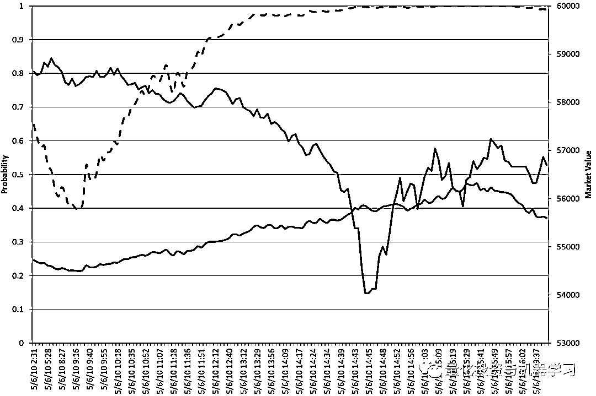

# Marcos Lopez de Prado：金融机器学习的 10 大应用

> 原文：[`mp.weixin.qq.com/s?__biz=MzAxNTc0Mjg0Mg==&mid=2653305975&idx=1&sn=8e276fb7ce169834ed65cb4cdaf687b6&chksm=802dfe62b75a77741c06b8978460a7d0a7251afcedfc6e0e55f747281f8ec06d94548dbe360c&scene=27#wechat_redirect`](http://mp.weixin.qq.com/s?__biz=MzAxNTc0Mjg0Mg==&mid=2653305975&idx=1&sn=8e276fb7ce169834ed65cb4cdaf687b6&chksm=802dfe62b75a77741c06b8978460a7d0a7251afcedfc6e0e55f747281f8ec06d94548dbe360c&scene=27#wechat_redirect)

**全网 TOP 量化自媒体**

Marcos Lopez de Prado，想必国内的读者这几年应该熟悉一些了吧！

公众号第一次介绍 Marcos Lopez de Prado，则是来自他一篇论文：《The 7 Reasons Most Machine Learning Funds Fail》，公众号进行了解读，详见：

 

此后我们还对他的另一篇论文进行了解读：《The 7 Reasons Most Econometric Investments Fail》，详见：

 

在国内大多数人眼中，最为出名的是他那本**《Advances in Financial Machine Learning》**：

今年又出了一本：**《Machine Learning for Asset Managers》**

最新，Marcos Lopez de Prado 应邀在美国计算机学会关于金融领域的人工智能会议上发表主旨演讲，会议将于 2020 年 10 月 14 日至 16 日举行：

https://ai-finance.org/conference-program/

不过 Marcos Lopez de Prado 已经把这次会议的内容作了预告分享，让我们来看看有什么精彩的内容吧！

只挑重点讲，还有我们的一些见解！

**机器学习能预测黑天鹅吗？**

黑天鹅是一种前所未有的极端事件。例如，2010 年 5 月 6 日的闪电崩盘（flash crash）。

官方的调查是：可能是因为市场下达了卖出 7.5 万份 E-miniS&P500 期货的指令。

这一大笔订单导致了订单流量的持续失衡，从而引发了做市商之间的一连串停止交易，直到没有人支持竞购。不平衡的订单流是常态，具有不同程度的持续性。10%的价格突然下跌属于黑天鹅事件。但原因我们可以从微观结构理论搞清楚：

https://jpm.pm-research.com/content/37/2/118

所以我们的结论是：黑天鹅是可以通过理论预测的，及时不能被算法预测。

所以我们的推论是：**使用机器学习来发展理论，让理论发展做出预测（而不是算法）。**

**1、价格预测**

寻找非线性关系、层次关系和分类变量。

**2、套期保值**

强化学习方法涉及很少的假设。

强化学习方法无希腊语和模型的，它们纯粹是经验性的，几乎没有理论假设。这些模型在做套期保值时考虑了更多的变量和数据点，并能以更快的速度生成更精确的套期保值。

https://arxiv.org/pdf/1802.03042.pdf

**3、投资组合构建/风险分析**

机器学习方法的表现优于经典的均值-方差投资组合优化，夏普比率收益往往超过 30%：

https://papers.ssrn.com/sol3/papers.cfm?abstract_id=2708678

众所周知，MVO 在样本外方面表现不佳：

http://faculty.london.edu/avmiguel/DeMiguel-Garlappi-Uppal-RFS.pdf

**4、异常值检测**

横断面研究对异常值的存在特别敏感。即使是很小比例的异常值也会造成很大比例的错误信号：买入应该卖出（假阳性），卖出应该买入（假阴性）。

在这个图中，我们对证券横截面进行回归，其中有非常小的百分比（只有 5%）是异常值：

*   红点是昂贵的证券，但回归被错误地归类为便宜。

*   绿点是便宜的证券，但回归被错误地归类为昂贵。

只有 5%的异常值，横截面回归产生了 34%的分类误差。相比之下，RANSAC 的分类错误为 1%。

当你怀疑数据中存在异常值时，请考虑应用 RANSAC 或类似的 ML 方法。

**5、Bet Sizing / Alpha 捕捉**

假设你有一个决策买卖的模型：

1、你只需要知道 bet 的大小，其中包括完全没有赌注的可能性。

2、这是从业者经常面临的情况。我们常常知道自己是想买还是想卖一种产品，而剩下的唯一问题是，在这种赌注中我们应该承担多少风险。

**3、Meta-Labeling：将主要模型的结果标记为为 1（增益）或 0（损失）。**

合约的方向（Long | Short）和合约的大小（size）无法在三隔栏方法中体现，也就导致无法止盈和止损，所以 Marcos Lopez de Prado 引出了 Meta-Labeling 作为数据的进一步处理方法。

作者将 Meta-Labeling 作为类似桥梁的形式串联起两个 model：

*   第一个 Model 用于判断合约是开多还是开空

*   第二个 Model 是在 Meta-L 之后的数据进行训练（正常的分类问题）

金融中用机器学习的一个常见错误时同时学习仓位的方向和规模。具体而言，方向决策（买/卖）是最基本的决策，规模决策（size decision）是风险管理决策，即我们的风险承受能力有多大，以及对于方向决策有多大信心。我们没必要用一个模型处理两种决策，更好的做法是分别构建两个模型：第一个模型来做方向决策，第二个模型来预测第一个模型预测的准确度。很多 ML 模型表现出高精确度（precision）和低召回率（recall），即（正确预测为交易机会的次数/预测为交易机会的次数）很高，（正确预测为交易机会的次数/交易机会的次数）而 很低。这意味着这些模型过于保守，大量交易机会被错过。F1-score 综合考虑了精确度和召回率，是更好的衡量指标，**元标签（Meta-Labeling）有助于构建高 F1-score 模型**。首先（用专家知识）构建一个高召回率的基础模型，即对交易机会宁可错杀一千，不可放过一个。随后构建一个 ML 模型，用于决定我们是否应该执行基础模型给出的决策。

**Meta-Labeling 的方法**

要构建一个模型来决定是否买卖某个资产，我们需要：

**1、确定头寸方向（side）**

*   当价格涨或正收益到一定程度，做多

*   当价格跌或负收益到一定程度，做空

*   其他情况下，什么都不用做

**2、确定头寸大小（size），甚至包括不下单（size = 0）**

Meta-Labeling 的核心优势在于将确定头寸的任务分解为了两个部分：头寸方向，头寸大小

对于二元分类，meta-labeling 可以有效帮助我们提升 F1-score。在确定头寸方向的过程中，我们首先建立一个 ML 模型 (primary model) ，尽力提高查全率 (recall)。随后我们对该 ML 预测的正例使用 meta-labeling，并建立第二个 ML 模型 (secondary model) 来提高查准率 (precision)。第二个 ML 模型的主要目的是从已经挑选出的机会中再一次筛选投资标的。

**Meta-Labeling 的优点**

1、元标签+ML 则是在白箱（基础模型）的基础上构建的，具有更好的可解释性。

2、元标签+ML 减少了过拟合的可能性，即 ML 模型仅对交易规模决策不对交易方向决策，避免一个 ML 模型对全部决策进行控制。

3、元标签+ML 的处理方式允许更复杂的策略架构，例如：当基础模型判断应该多头，用 ML 模型来决定多头规模；当基础模型判断应该空头，用另一个 ML 模型来决定空头规模。

4、赢小输大会得不偿失，所以单独构建 ML 模型对规模决策是有必要的。

5、头寸方向和头寸大小的分解允许我们先简后繁。例如我们可以使用复杂模型分别对多头和空头进行专门训练确定头寸大小。

**Meta-Labeling 的案例**

1、使用基本面模型挑选标的并确定头寸方向，使用元标签方法确定标签。

2、使用机器学习模型在元标签进行训练，得出概率可转化成头寸大小。

**6、特征重要性**

1、机器学习算法识别高维空间中的模式。

2、这些模式将特征与结果联系在一起。

3、这种关系的性质可能极其复杂，但我们总是可以研究哪些特征更重要。例如，即使机器学习算法不能推导出牛顿引力定律的解析公式，它也会告诉我们质量和距离是关键的特征。

在传统的统计分析中，由于模型的错误定义，关键特征经常被忽略。

**在机器学习分析中，我们放弃封闭形式的规范来确定哪些变量对预测是重要的。**

一旦我们知道了在起作用的因素是什么，我们就可以发展出一个理论。 

**7、信用评级/分析师建议**

1、股票分析师应用许多模型和启发式方法来产生信用和投资评级。

2、这些决定并不是完全随意的，**它们对应于一个复杂的逻辑，而这个逻辑不能用一组简单的公式或一个定义良好的过程来表示。**

3、机器学习算法成功地复制了银行分析师和信用评级机构提出的大部分建议。

在穆迪的这个例子中：

下图显示了债券的散点图，作为两个特征(x,y)的函数，其中默认值被涂成红色。中间的图表显示，传统的计量经济学方法无法建立这种复杂的非线性关系的模型。右图显示一个非常简单的机器学习算法，其表现良好。

**8、非结构化数据**

在下图中，一种算法识别出了含有特斯拉股票相关信息的新闻文章：

*   蓝色：每日文章总数。平均为 458 篇/天，最大 5000+篇

*   绿色：每日积极情绪的文章数。

*   红色：每日负面情绪的文章数。

再如国内的上市公司，ChinaScope 数库对每篇文章的实体进行了情绪识别给出了正负面情绪，同时也对相关实体和整篇文章给出情绪值。这个值就可以应用在量化策略中去：

近期 JPMorgan 还采用此数据写了一篇基于 A 股的量化策略报告：

 

**9、Execution**

1、Credit：

*   场外交易。 

*   流动性相对较差（可能几天或几周都不会交易）。

2、基于内核的方法根据“类似”交易的共同特征识别它们

*   一组通用交易使我们能够推导出理论价格。

*   如果我们以高于后续“类似”债券的价格购买债券，我们可以终止交易。

这张图显示了买（绿色）和卖（红色）的交易效率：

在这个例子中，投资组合的再平衡是有利可图的，因为它占据了买卖价差的约三分之一（约 50 个基点的价格）。 

**10、错误投资策略的检测**

Y 轴显示给定数量的试验（x 轴）的最大夏普比率(max {SR})的分布。较浅的颜色表示获得该结果的可能性较高，虚线表示预期值。

例如，在仅进行 1000 次独立的回测之后，即使策略的真实夏普比率为零，预期的最大夏普比率 (E[max{SR}]) 也是 3.26！

**解决办法：**

https://papers.ssrn.com/sol3/papers.cfm?abstract_id=3177057

**结语**

金融机器学习展示了与标准机器学习假设不一致的属性。**一个机器学习算法总会找到一个模式，即使没有模式!**

希望大家有所收获！

量化投资与机器学习微信公众号，是业内垂直于**Quant****、Fintech、AI、ML**等领域的**量化类主流自媒体。**公众号拥有来自**公募、私募、券商、期货、银行、保险、资管**等众多圈内**18W+**关注者。每日发布行业前沿研究成果和最新量化资讯。