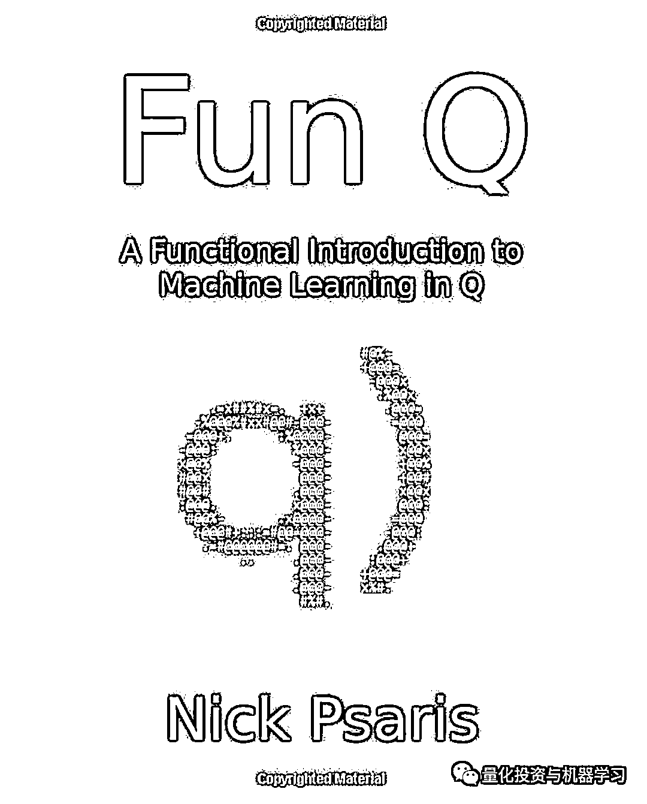
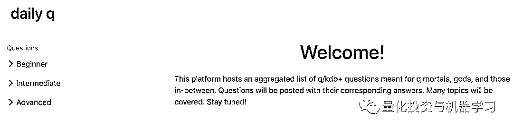
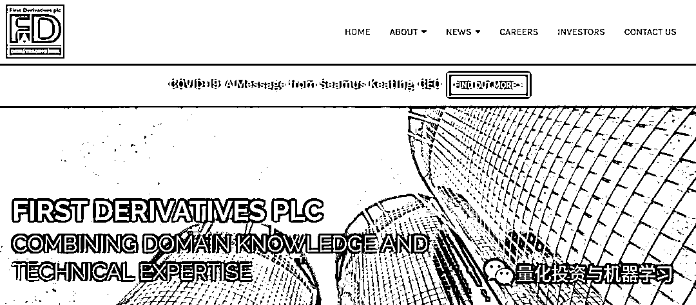
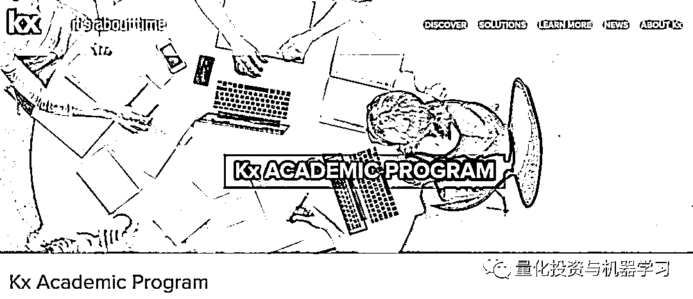
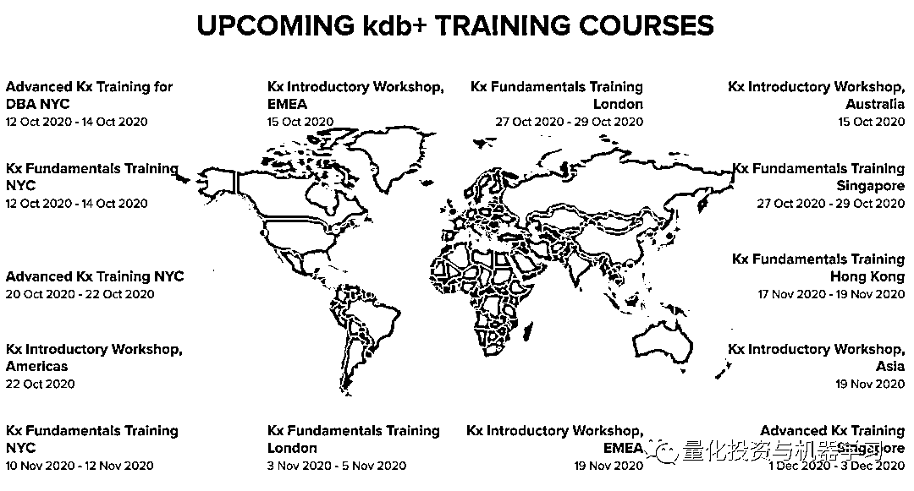

# 对冲基金很需要：K、Q 在哪里？

> 原文：[`mp.weixin.qq.com/s?__biz=MzAxNTc0Mjg0Mg==&mid=2653305856&idx=1&sn=095dffe237a6ec5a4efd98ea9baab814&chksm=802dfe15b75a7703f4d18bc1ac17a601b2aabc4729d1ec798eb7f65874025c1f55de16025ee7&scene=27#wechat_redirect`](http://mp.weixin.qq.com/s?__biz=MzAxNTc0Mjg0Mg==&mid=2653305856&idx=1&sn=095dffe237a6ec5a4efd98ea9baab814&chksm=802dfe15b75a7703f4d18bc1ac17a601b2aabc4729d1ec798eb7f65874025c1f55de16025ee7&scene=27#wechat_redirect)

**全网 TOP 量化自媒体**

越来越多的对冲基金和高频交易公司在使用

**本文不是广告，是一篇软文**

***1***

**号称最强内存数据库之一：KDB**

我们先从 KDB 说起。

**Kx 系统是由前 Morgan Stanley 技术专家 Arthur Whitney 于 1993 年创立的，其目的是为了解决传统关系数据库技术无法跟上这些不断上升的数据量。**Kdb+是 Kx 公司开发的一款 64 位跨平台高性能数据库产品（一个基于有序列表，面向列的内存式存储数据库）。Kdb+也号称最强内存数据库之一。列式存储的特性，使得对于某个列的统计分析操作异常方便。在延迟性上有着苛刻要求的金融领域，Kdb+可谓一家独大。当然在优秀的性能背后，**费用也是杠杠的！**

再来聊聊来龙去脉吧：

在开发 K 语言之前，Arthur Whitney 在 APL 工作过很长时间，先是在 I. P. Sharp Associates 与 Ken Iverson 和 Roger Hui 共事，后来在 Morgan Stanley 开发金融应用程序。在 Morgan Stanley，Arthur Whitney 帮助开发了 APL 的变种 A+，以方便 APL 应用程序从 IBM 大型机迁移到 Sun 工作站网络。A+有一个更小的原始函数集，并且是为了速度和处理大量时间序列数据而设计的。

1993 年，Arthur Whitney 离开了 Morgan Stanley，并开发了 K 语言的第一个版本。与此同时，他成立了 Kx 系统公司来商业化该产品，并与 UBS 签订了独家合同。在接下来的四年里，他利用 K 为 UBS 开发了各种金融和交易应用程序。

K 的另一个特点十分简洁：**大约 200KB**，包括进程间通信 IPC、Web 界面和图形用户界面。

该合同于 1997 年 UBS 与 Swiss Bank 合并后终止。1998 年，Kx Systems 发布了 Kdb+，这是一个建立在 K.kdb 上的数据库。此后，K 和 Kdb+共同开发了多款金融产品。Kdb+/tick 和 Kdb+/taq 是在 2001 年开发的且发布于 2004 年。Kdb+包含（内置通用开发语言）了 Q 语言：Q 语言是向量化函数式交互式脚本语言。一种融合了底层 K 语言和 ksql 函数的语言。

KDB 的架构：

**底层**

两种解释型通用编程语言：K 和 Q

K 解释器由约 1200 行 ANSI C 代码实现。

Q 语言是由 K 语言实现，在没有效率损失的前提下提供了更好的代码可读性。

K 函数和 Q 函数在加载时预编译为字节码，其执行效率远高于一般的解释型脚本语言。运行于 windows、linux/solaris/macosx 的 32 位或 64 位环境下

**中间层**

  同时具备内存数据库和磁盘数据库的时间序列数据库：Kdb+

大概就是这么个东东，具体大家可以自行了解。公众号不再陈述。

***2***

**市场态度**

根据一些招聘人员表示，在伦敦为 Kdb+系统工作的顶级承包商每天可以挣到 1 万英镑！

GQR Global Markets 的电子交易系统招聘人员 Olly Thompson 表示：“Kdb+的很多工作都是基于项目的，而且报酬也非常高。原因是没有太多 Kdb+的开发人员。”

一位在 Kdb+工作的美国银行高级量化开发人员也表示：这是一个精挑细选的群体。“熟练的 Kdb+工程师很难得，熟练的 Kdb+量化工程师更是少之又少。这是因为 Kdb+及其相关语言不在没有在学校里教授，只有到了实际工作岗位。他们才会意识到自己需要学习这门语言。如果某家对冲基金胡总投行想要一个熟练的 Kdb+量化分析师，他们就必须找一个在其他地方接受过培训的人。

美国银行驻纽约的开发人员 Nick Psaris：

https://github.com/psaris

正在努力推广 Kdb+和 Q 的使用，他为想学习这门语言的人写了一本关于 Q 的书籍：

然而，也有人站出来说：了解 K 更有助于更深入地理解 Q，因为任何 Q 函数都是在 K 中实现的！

如果你想再基础一下，公众号推荐：***https://www.dailyq.io/***

然而，大多数人不是通过自学来了解 Kdb+，而是通过总部位于爱尔兰的**First Derivatives**来了解 Kdb+的。因为 First Derivatives 是 Kx 的部分所有者。

First Derivatives 有一个为期两年的研究生培训项目。它还开设了免费的 Kx 介绍性讲习班，首席营销官 Kathy Schneider 表示，这些讲习班已经被超额预订。Schneider 说：“我们已经增加了额外的时间来满足对在线直播课程的需求。”

https://kx.com/connect-with-us/kx-academic-program/

即将开始的培训课程： 

https://kx.com/connect-with-us/training/

项目结束后，受训人员将与银行和其他客户合作提供咨询服务。你可能会在 Morgan Stanley 工作 6 个月，在高盛工作 6 个月，在苏格兰皇家银行工作 6 个月等等。First Derivatives 试图让大家参与一些有趣的项目。他们许多客户都是顶级的投行和对冲基金。最终，受训者可以自由地直接为银行工作，如 JPMorgan、美国银行和 Morgan Stanley 都在寻找掌握 Kdb 专业技能的人才。

即便如此，找到工作也不容易。技术和交易领域的招聘对象基本都需要硕士水平。如果你符合标准，你将接一个面试。如果这些都进行得很顺利，你将通过一个 Kdb/Q 测试。

参加培训是值得的，因为业内人士表示：随着越来越多的 Quant 精通 Kdb+，它的使用将从一个数据存储转变为一个强大的分析工具。许多大型投行（例如：Morgan Stanley）已经这么干了！

拿 Hadoop 比较的话，Kdb+将运算分析分散到多个服务器上，Kdb+的优势在于通过优化使用 CPU 和 RAM，尽可能从每台机器上获得更多的性能。同时，Hadoop 对所有类型的数据都很很适用，除了超大规模的 tick 数据库。**因为，鉴于投行和对冲基金需要庞大的 tick 数据，Kdb+越来越多地成为他们选择的工具。**

目前使用 kdb+比较知名的金融企业有：

国际：巴克莱资本（BATS）、Morgan Stanley（Horizon）、JPMorgan（TicDB）、Citadel、Squarepoint Capital 等。

国内：深交所，海通证劵，华泰证劵等。

量化投资与机器学习微信公众号，是业内垂直于**Quant****、Fintech、AI、ML**等领域的**量化类主流自媒体。**公众号拥有来自**公募、私募、券商、期货、银行、保险、资管**等众多圈内**18W+**关注者。每日发布行业前沿研究成果和最新量化资讯。