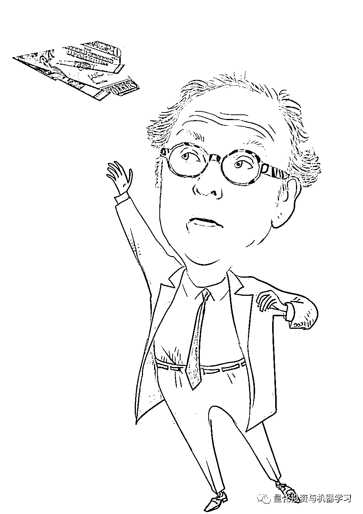
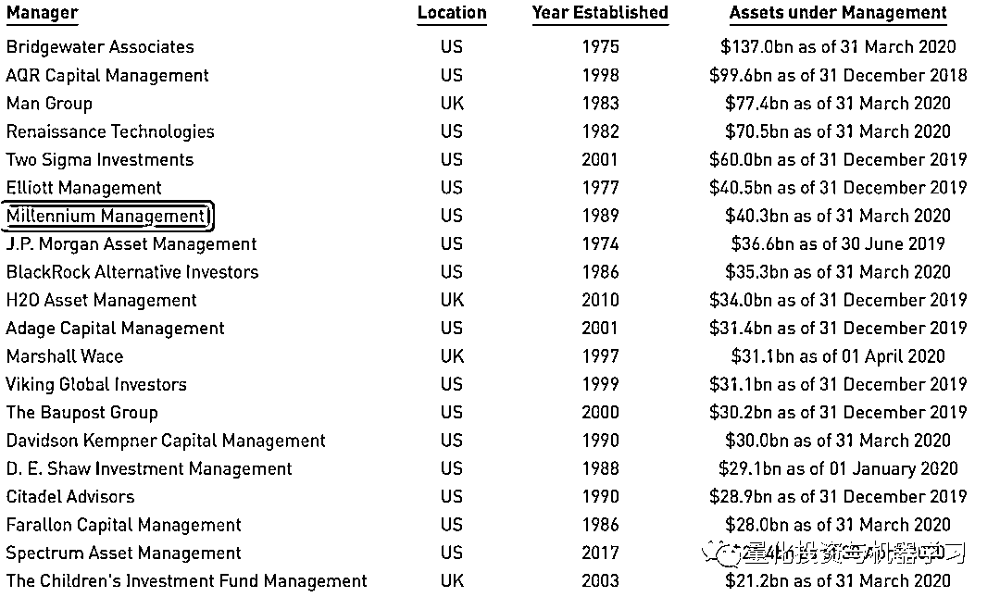

# 这是 Millennium 的薪酬：人均 82.8 万英镑！

> 原文：[`mp.weixin.qq.com/s?__biz=MzAxNTc0Mjg0Mg==&mid=2653305833&idx=1&sn=391c80a7f650676660dca03b6c41054c&chksm=802df9fcb75a70eab5b2ae4a6a14fed5603c34e0779b0fc84175f84d89434b8713982bbc8f4c&scene=27#wechat_redirect`](http://mp.weixin.qq.com/s?__biz=MzAxNTc0Mjg0Mg==&mid=2653305833&idx=1&sn=391c80a7f650676660dca03b6c41054c&chksm=802df9fcb75a70eab5b2ae4a6a14fed5603c34e0779b0fc84175f84d89434b8713982bbc8f4c&scene=27#wechat_redirect)

**全网 TOP 量化自媒体**

如果你想在对冲基金从事工作，我们会推荐一家（之一）：**Millennium**。

但是进入千禧年不是一件容易的事，**他们不招收没有业绩的专业投资人士。**

如果你是一名**基金经理**：

你需要有成熟的策略，还需证明你可以很快赚到钱。而且只能通过交易高流动性的产品来实现。

如果你是一名**分析师**：

你需要说服千禧年的一位基金经理聘请你加入他/她的团队。 每个团队通常由七八个人组成。

Millennium 老大：Israel Englander

千禧年团队的策略五花八门，有相对价值、统计套利、合并套利，或者纯粹的固收和大宗商品投资，但都有一个共同点：**他们只投资流动性高的产品**。

因此，加入千禧年的基金经理要么需要加入现有团队中的一个，要么提出一个全新的策略。如果选择后者，你会被详细询问该想法的有效性。那些曾经有过此经历人说：这个过程非常、非常给力。**如果千禧年喜欢你，它将为你建立一个充满数据、分析和世界级的办公室环境**。这可能是你最接近于管理自己的基金的方式。

截至最新，Millennium 的**AUM 达 454 亿美元**。**Millennium 在全球范围内被分成 200 多个独立运营的团队，每个团队的收益都与自己的业绩成挂钩**。其他大型对冲基金的薪酬基本是基于不同策略的净收益来算，而 Millennium 的薪酬结构更为细致：**如果你的团队策略表现优异，你就会获得更多的报酬，即使其他团队都在亏损。**

Millennium 的 AUM 排名也是在全球顶尖对冲基金前十之中：

 Preqin 第二季度全球对冲基金 AUM 排名

这对个人层面的工资和奖金意味着什么？Millennium 没有在全球范围内公布薪酬，但其在英国的两家实体公司：***Millennium Capital Management Ltd***（英国控股公司，包括所有管理和投资人员）和***Millennium Capital Partners LLP***（主要由投资人员组成）刚刚公布了截至 2019 年 12 月 31 日的年度薪酬和人数。

***Millennium Capital Partners LLP***只聘用从事投资组合管理和研究的专业（前台部门）员工，且薪酬最高。2019 年，该公司聘用了 166 名专业投资人员，高于前一年的 127 名。其总共向他们支付了 1.37 亿英镑，**平均每人的薪酬为 82.8 万英镑**。如果加上管理人员，平均薪酬就会下降。

2019 年，***Millennium Capital Management***的 341 名英国员工（188 名专业人士和 153 名管理人员）的薪酬为 1.97 亿英镑，**平均每人的薪酬为 57.8 万英镑**。

***Millennium Capital Partners Ltd.***去年的平均薪酬增长了 52%。伦敦的***Millennium Capital Management***则上涨了 75%。

Millennium 在英国的两家公司去年的收入都有大幅增长。在***Millennium Capital Partners***，其利润从 2018 年的 1.12 亿英镑上升至 2019 年的 2.07 亿英镑。

可以！可以！

量化投资与机器学习微信公众号，是业内垂直于**Quant****、Fintech、AI、ML**等领域的**量化类主流自媒体。**公众号拥有来自**公募、私募、券商、期货、银行、保险、资管**等众多圈内**18W+**关注者。每日发布行业前沿研究成果和最新量化资讯。