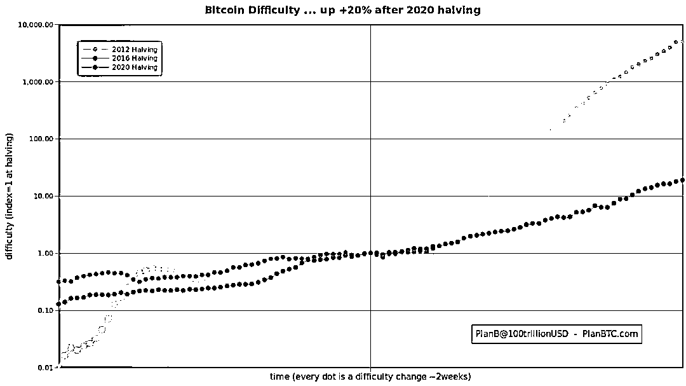
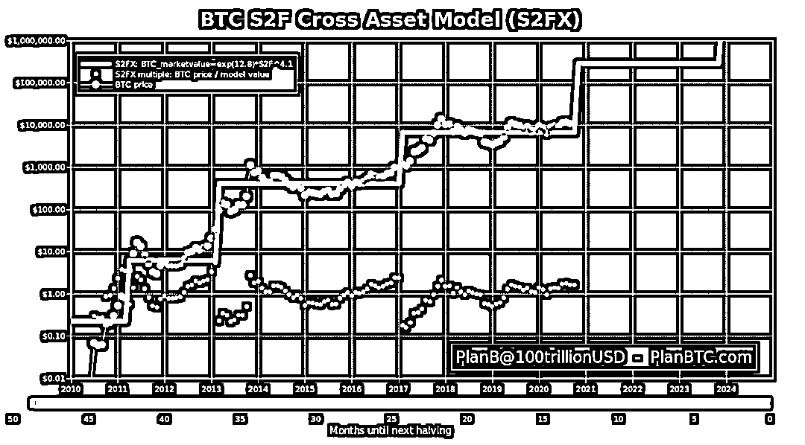

# 比特币、S2FX 模型：PlanB 可以的！

> 原文：[`mp.weixin.qq.com/s?__biz=MzAxNTc0Mjg0Mg==&mid=2653305771&idx=1&sn=a3e73e71c05c6e4ea669f454440f0df2&chksm=802df9beb75a70a856f8bcbc872682394ddd36e2e7f96021d5e66159c17b40b79e68c12b4a8d&scene=27#wechat_redirect`](http://mp.weixin.qq.com/s?__biz=MzAxNTc0Mjg0Mg==&mid=2653305771&idx=1&sn=a3e73e71c05c6e4ea669f454440f0df2&chksm=802df9beb75a70a856f8bcbc872682394ddd36e2e7f96021d5e66159c17b40b79e68c12b4a8d&scene=27#wechat_redirect)

**全网 TOP 量化自媒体**

在过去两次比特币价格下跌之后：

对比特币价格上涨的分析似乎遵循了 Plan B 提出的**库存流量比模型（Stock-to-Flow，简称 S2F）**，这个指标量化了比特币的稀缺性。注：Plan B 是 Twitter 上一位有名的加密资产分析师。

**为什么叫 Plan B？**

PlanB refers to an alternative plan for quantitative easing (printing money by central banks), negative interest rates and currency debasement in general. 100trillionUSD is a reference to the Zimbabwe 100trillion dollar note during the 2008 hyperinflation.

**S2F = Stock/Flow**

Stock 是指现有的库存和储备。Flow 是年产生产量。人们也常用供应增长率这个指标，也就是 flow/stock。请注意，S2F=1/供应增长率。

**S2F 模型**S2F 模型指可用资产或储备资产的数量除以每年生产的数量，Stock-to-Flow 比率是一个重要的指标，因为 S2F 中较高的指标值反映了资产每年通货膨胀发生率的降低。一般来说，库存流量比越高，说明稀缺性越大。

**最重要的一张图**

S2F 最新数据，like clockwork 精准

用一个比喻来说明这一点：如果我们把比特币的价值看作一个醉汉，那么 Stock-to-Flow 并不是他真正的跟班狗，而更像是他走的路。醉汉会在路上到处游荡，有时会停下来、滑倒、错过一个拐弯处、甚至在路上抄近路等；但总的来说，他会沿着这条路的方向回家。

简而言之：

**比特币像个醉汉，而 Stock-to-Flow 就是他回家的路。**

今天的推文目的就是让大家多关注 PlanB 的文章，对于比特币的操作有很好的借鉴意义。**所有的模型都是错误的，但有些是有用的！**

相关文章阅读： 

量化投资与机器学习微信公众号，是业内垂直于**Quant****、Fintech、AI、ML**等领域的**量化类主流自媒体。**公众号拥有来自**公募、私募、券商、期货、银行、保险、资管**等众多圈内**18W+**关注者。每日发布行业前沿研究成果和最新量化资讯。