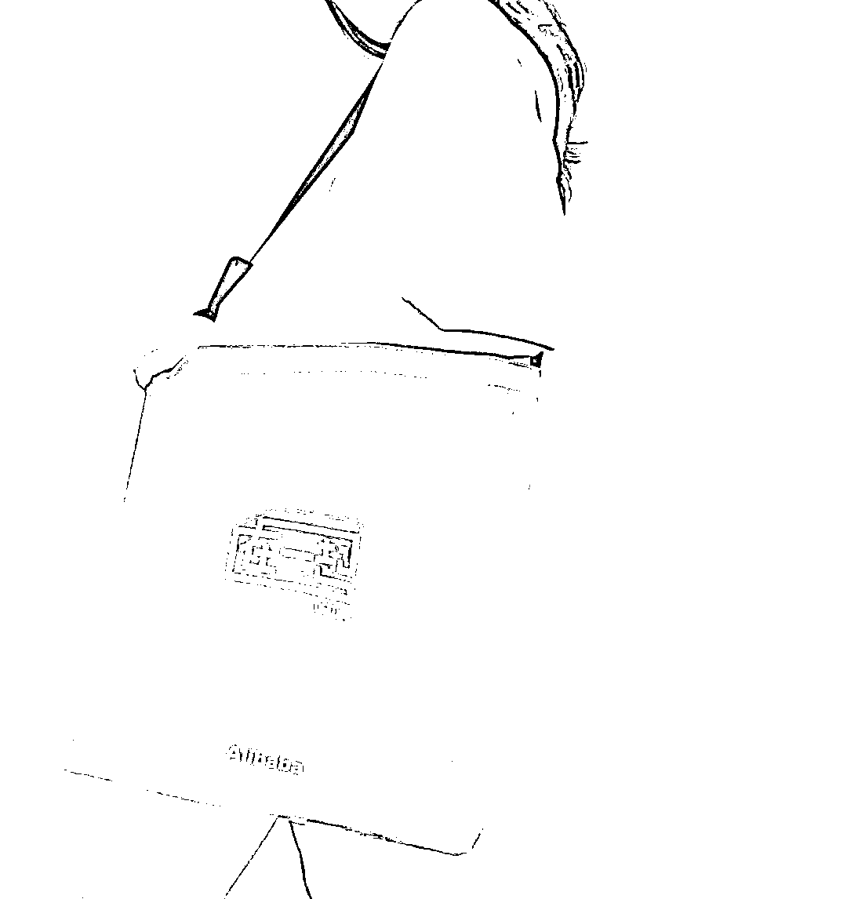
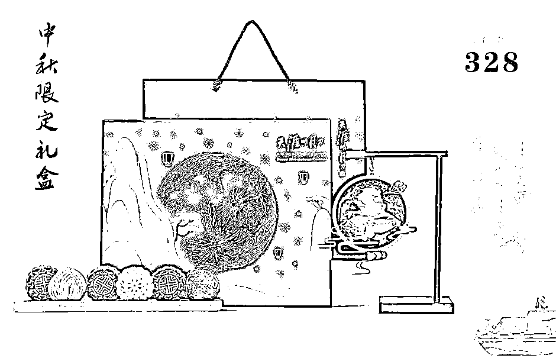
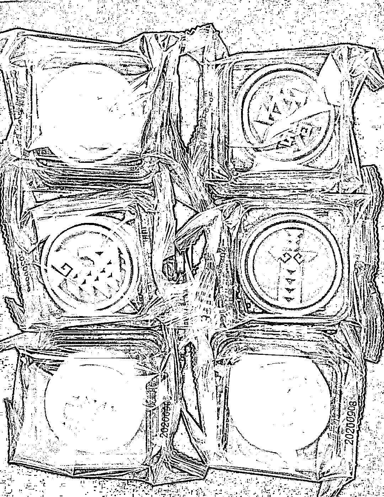
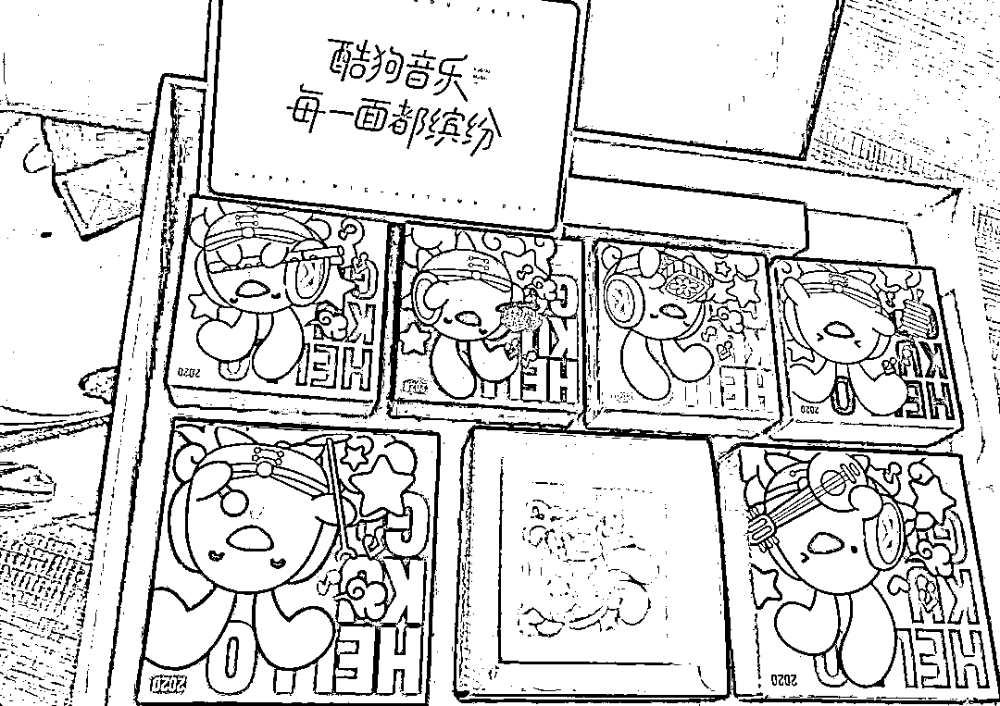

# 争奇斗艳！2020 互联网公司中秋月饼选美大赛

> 原文：[`mp.weixin.qq.com/s?__biz=MzAxNTc0Mjg0Mg==&mid=2653305670&idx=1&sn=aad56c3935c41c7b2d8fe5f28836d2ea&chksm=802df953b75a7045e789baf994a93a19285c2f345134d8dc64f2adb83f9e16ac46b573cf91bd&scene=27#wechat_redirect`](http://mp.weixin.qq.com/s?__biz=MzAxNTc0Mjg0Mg==&mid=2653305670&idx=1&sn=aad56c3935c41c7b2d8fe5f28836d2ea&chksm=802df953b75a7045e789baf994a93a19285c2f345134d8dc64f2adb83f9e16ac46b573cf91bd&scene=27#wechat_redirect)

**全网 TOP 量化自媒体**

一年一度的互联网中秋月饼盒子包装“大赛”已经进行的如火如荼，每家互联网公司都在使出浑身解数，让自己家的月饼不仅好看，更要好玩、好吃～ 

一套好看的月饼盒包装能提升公司品牌效益，同时也能让员工“晒的出手”

-以下排名不分先后- 

**1.剑网三&稻香村**

这次没有把阿里放在第一是因为我觉得剑网三盒稻香村联名推出的这盒中秋-梦回敦煌实在是太好看了。插画元素灵感来自敦煌莫高窟，并结合了其剑网三游戏的原画风格进行了创作，在视觉表现上独树一帜。

更有意思的是，它用月饼盒子做成了一个简易西洋镜，里面是一个可转动的烫金插画，甚至自己还可以手动放置插画。

所以我想把第一给它，没有争议吧～

**2.阿里**  

阿里这次月饼的主题是【在一起】，大家都知道今年是很不平凡的一年，这个世界都发生了许多事情。所以在这个特殊的日子里，还有什么比和家人在一起更重要的事呢？

盒子内附带一支万花筒棱镜，可以看到非常绚丽的景象

**3.美团**  

乘风破浪是美团这次的主题，整体黄色拎包的风格，在包装设计上应该可以排列靠前了。一个穿着太空服的小公仔和盒内的包装插画非常有视觉冲击力，象征着产品更具年轻的活力，将会继续向下一个十年迈进哦～

**4.腾讯**  

不得不说，这次腾讯在包装上确实不够出彩，但是，主题还是非常好的。万里长城与千里共婵娟相呼应，挺好。每个月饼的包装盒子上都印有古代长城的风景元素，烽火台、战鼓、士兵等等，话说包装不出彩，味道总要跟上吧～

**5.网易暴雪**  

这次网易暴雪的月饼名字叫做-咕咕捞月，咕咕是一种很可爱的枭首，类似鹌鹑！因为其可爱的外表，经常让敌对阵营的玩家不忍心下手，因此，咕咕门成为了脚本们刷金币和材料的首选。。。

包装内赠送了两只非常可爱的咕咕公仔哦

**6.小米**  

小米这次的包装也是别出心裁，这一套看下来感觉就是在做品牌延展，拼、撞色的包装设计非常有潮流感。盒子还采用了原子结构的包裹-展开样式，展开后特别像一个一个像素。外包装正面也是一个月亮环绕地球的色块简画，很有意思。

**7.字节跳动**  

字节采用了六边形礼盒，主题是挣脱重力。这个配色感觉和暴雪好搭，哈哈。另外赠送的马克杯上还有一个小宇航员，并且印有一串英文，意思是这是“激发创造力，丰富生活”。

**8.新浪微博**  

新浪这次的包装有点像奢侈品的首饰盒，居然还有一层木质的抽屉，不知道的人以为买了一块绿水鬼呢！

**9.杰士邦**  

杰士邦这个老司机，总是在和杜蕾斯赛车，这次真的信息量很大。首先包装采用了一个包包的外观，看起来还是皮质的非常适合送给女孩子。但是当你打开包装后，映入眼帘的居然是老司机必备套件，真是暗藏玄机啊！不由地竖起了大拇指！

**10.虎牙**  

虎牙的小虎仔很萌哦，盒子的封面插画非常好看

**11.bilibili**  

b 站这次的包装盒也很有新意。镭射风格的电视包、竖立在盒子中间的小火箭，今年好像都很流行玩太空梗啊，是迫不及待要和外星人见面了吗～

**12.天涯明月刀-北极光**  

一个测试了好多年的手游终于快开测了，在中秋期间还不忘做个月饼来犒劳大家。这次有意思在这个非常古色古香的小吊灯。两只兔子在看一枚红彤彤的月亮，很有意境啊～

**13.喜茶&奈雪**  

喜茶奈雪大家应该都很喜欢吧，这个包装看起来特别潮流范儿，黄色和橙红色包装上印有月满、福满两个大字，emmm，这排版看来封面出自资深设计师之手呀！

**14.顺丰**  

顺丰这次的主题是逐梦追日，直接用了一架航空飞机来装月饼，简直霸气！突出了一个字：快！

**15.京东**  

这次京东和故宫中国节联合，把赏花、宴饮、观戏、赋诗、祭月、奏乐、识月等场景用京东小狗仔非常形象的做了出来，这套月饼真是非常用心了哦

**16.一点资讯**  

一点咨询的礼盒打开非常好玩，做了一个 3 维纸片设计，非常有层次感，都市中的大小新闻都在这里展示咯

**17.游族网络**  

这是一个“机关算尽”的礼盒，有点像打开一个天工机关的宝盒一样，隐藏着玄机。礼盒内有一副游戏牌，月饼而已做成了兵器的花纹，不会是游戏公司呀～

**18.酷狗**  

非常可爱的包装，狗子穿上兔子的衣服显得格外的呆萌。礼盒内有一个魔方小玩具，刚好是 6 副插画，每一面都缤纷～

**19.瑞幸&Line**  

虽然说是瑞幸和 line 联名，但是好像没有看到瑞幸的元素有点可惜，line 的品牌 IP 还是那么鲜明、可爱。铁箱包装档次看起来也很高，买盒子送几个月饼把～

**20.三只松鼠**  

坚果不错，就是不知道月饼味道什么样～

**21.王者荣耀&稻香村**

稻香村这是抱了两个大腿吗，每个都这么好看，这个峡谷明月主题的月饼盒子不仅做了抽屉，还有剪影插画，嫦娥小姐姐看起来真漂亮～

**22.元祖**

这个老品牌的月饼还是不错的，我印象比较深刻的是“元祖雪月饼”这个广告语，月饼的表皮还是比较脆的，放冰箱里味道还是不错的。

**23.吉利**

吉利也玩宇航员，这期大赛这是撞车了好多呀

**24.OPPO**

oppo 这次的月饼盒整体采用了黑色的设计，并且也是类似翻书的开合交互，中间是 8 个月相。

**25.星巴克**

星巴克的月饼真的和杯子一样，听起来看起来比较大的幸好，实际上都很少。两个花型的和两个 logo 的月饼，物以稀为贵？可能比较好吃吧！

**26.Dior**

奢侈品居然也做月饼，这个包装真的极具潮流气息，你会发现 1 个时装秀模特走在一座拱形桥上，中间一个月亮，整个画面很有意境。包装展开的对称花纹的造型非常独特，这就是所谓的买包装送月饼吧

**27.Gucci**

古驰的礼盒居然不是他在包包上的 logo 有点意外，这次都是小星星哦。做了三层抽屉式设计，并且最下面一层有一只铜质的兔子香薰插座～整体包装是古色古香的东方建筑风格，铜质的手柄，镂空星星的拉门，细节很足。

**28.歌帝梵**

吃过歌帝梵的小伙伴都知道他家的黑巧真的不错，虽然包装没有那么多机关，但是口味说不定是名列前茅的～

以上图片均来自网络

今天的大赛就到这里啦，大家觉得谁家的设计最好看呢，可以在下方留言哦，顺便给个赞～ 

量化投资与机器学习微信公众号，是业内垂直于**Quant****、Fintech、AI、ML**等领域的**量化类主流自媒体。**公众号拥有来自**公募、私募、券商、期货、银行、保险、资管**等众多圈内**18W+**关注者。每日发布行业前沿研究成果和最新量化资讯。