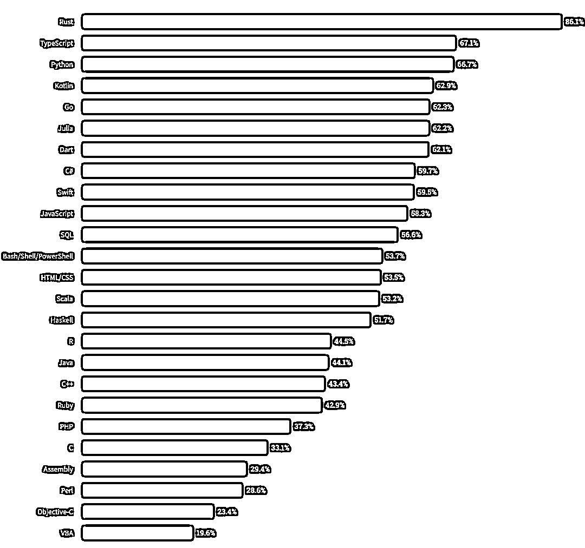
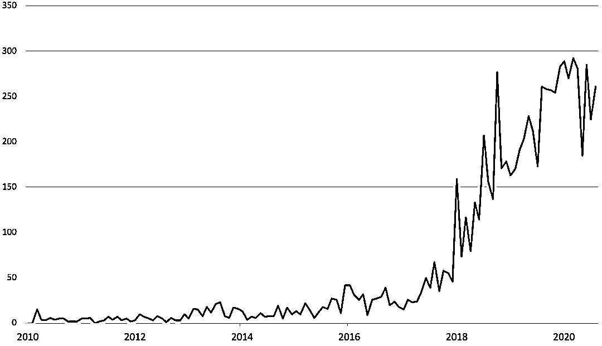
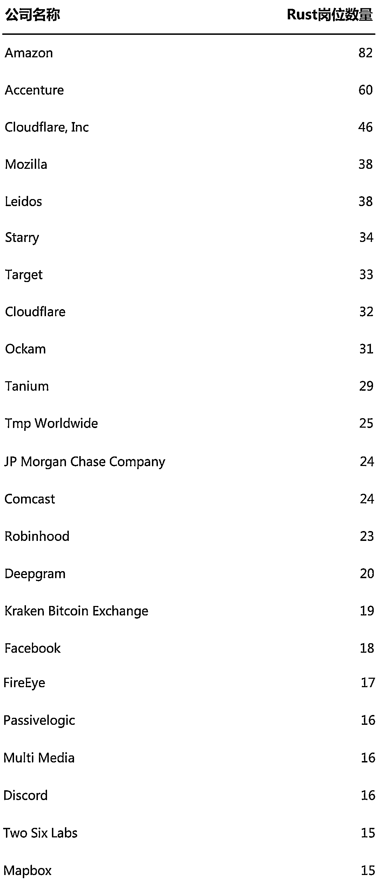

# 高频交易怎么看？Rust VS C++

> 原文：[`mp.weixin.qq.com/s?__biz=MzAxNTc0Mjg0Mg==&mid=2653305664&idx=1&sn=4c97c7b0533df3f2f9705acc1782dc28&chksm=802df955b75a7043825e771426c14cb6512ba30723a1136ea42b771be6c4a1dedec22b32d61a&scene=27#wechat_redirect`](http://mp.weixin.qq.com/s?__biz=MzAxNTc0Mjg0Mg==&mid=2653305664&idx=1&sn=4c97c7b0533df3f2f9705acc1782dc28&chksm=802df955b75a7043825e771426c14cb6512ba30723a1136ea42b771be6c4a1dedec22b32d61a&scene=27#wechat_redirect)

**全网 TOP 量化自媒体**

全球有成千上万的工作是为那些会使用 C++编程的人准备的，但是对于 Rust 的程序员来说明显需求很少，但是在 Stack Overflow 的 2020 年开发人员调查中，Rust 成为了最受欢迎的编程语言。

不可否认，对 Rust 编程技能的需求近年来急剧上升。下图显示自了 2010 年以来美国 Rust 公司所有招聘广告数量的增长情况。10 年前几乎没有什么变化，但从 2018 年开始有了大幅的提升！

然而，毕竟 Rust 还是少数人使用。正如下图所示，去年在美国，主要的 Rust 程序员招聘者类似亚马逊这样的科技公司和像埃森哲这样的咨询公司。

JPMorgan 招聘 Rust 程序员目的是为其新的区块链项目。

与 C++相比，Rust 开发人员在金融领域的机会很小。摩根大通公布了 908 个 C++工作岗位，同期公布了 24 个 Rust 工作岗位。根据 Burning Glass 的数据，高盛在过去 12 个月里在美国发布了招聘 C++程序员的广告，招聘了 610 个职位。一位该领域负责人表示，相比之下，**C++在投行和对冲基金中永不停息！**

然而，关于 Rust 是否是两种语言中（C++与 Rust）更好的一种，特别是对于低延迟高频交易和投行股票部门的系统性交易角色而言，仍有很多争论。

伦敦 GQR Global Markets 电子交易系统招聘人员 Olly Thompson 表示，对 Rust 专业技术的需求已经在上升，尤其是买方。Rust 正在成为金融领域的新 C++。比如一些以科技驱动的对冲基金或高频交易公司，正在越来越多地使用 Rust 而不是 C++。

一些量化技术开发表示：**使 Rust 脱颖而出的是它的安全性。**

C++把内存使用分为两种情况：值对象和指针对象。值语义的对象超出作用域会自动调用析构函数销毁，传递或者赋值的时候会进行一次拷贝。指针语义则交给人肉来管理，或者使用智能指针来引用计数。值对象在传递赋值中拷贝一次比较浪费，所以 C++后来有了移动构造函数。值在移动以后，关联的数据移动到新值。

**Rust 则是在 C++的基础上进一步优化。Rust 的对象有一个所有者，和多个引用。**

Rust 只允许值有一个所有者，传递和赋值会导致所有权移动。这看起来像 C++的 unique_ptr，但实际上更像 C++的移动语义。也就是说 C++拷贝是隐式的移动是显式的，Rust 移动是隐式的。当然 Rust 在这里有编译器的静态分析，没有运行时开销。

很多地方并不想移动值，只是借用一下，Rust 引入了引用的概念，来表达指针语义。一个常见内存问题是指针指向了一个无效的内存地址，Rust 却没这个问题。Rust 编译器强制让你证明值的生命周期大于它的引用的生命周期。有些编译器搞不清楚的地方需要添加生命周期标记，来告诉编译器。

获取引用是把一个值取地址的过程，是很严肃的。Rust 核心的地方就是在这里做了限制，保证了内存安全。

当然，Rust 也还存在很多问题，这里就不再展开描述。

Thompson 还表示，一些刚从科技行业起步的开发人员坚持：**Rust or nothing！**，拒绝在他们认为已经过时的 C++金融服务系统上工作。然而，考虑到 Rust 岗位的相对不足，只有极端纯粹主义者才会采用这种方法。Rust 开发商非常少。大多数是 C++开发人员，他们也正在一边学习 Rus。

一些量化分析师和招聘人员表示：拥有 C++之外的语言是件好事，但在对冲基金中，C++无疑是更流行、更受欢迎的语言！

**欢迎大家在留言区发表你们的看法！**

量化投资与机器学习微信公众号，是业内垂直于**Quant****、Fintech、AI、ML**等领域的**量化类主流自媒体。**公众号拥有来自**公募、私募、券商、期货、银行、保险、资管**等众多圈内**18W+**关注者。每日发布行业前沿研究成果和最新量化资讯。