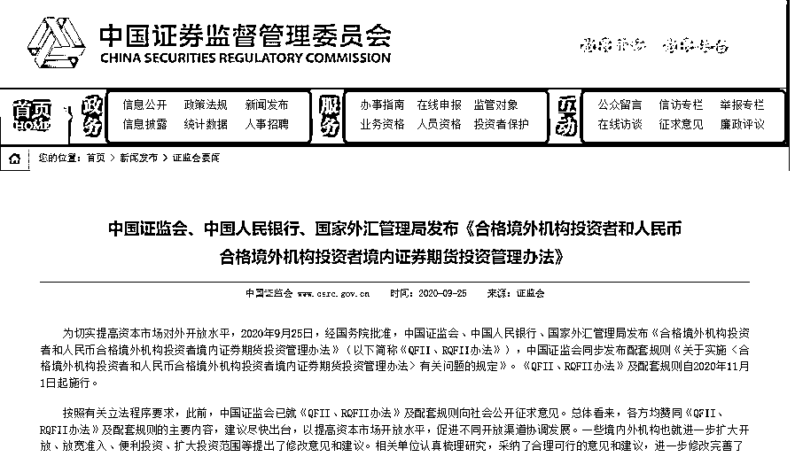

# 好消息！三部门联合发新规：QFII、RQFII 可以投私募基金~

> 原文：[`mp.weixin.qq.com/s?__biz=MzAxNTc0Mjg0Mg==&mid=2653305608&idx=1&sn=15d0aaab6cc47a32f79cbf9a582521d5&chksm=802df91db75a700b171e97df860f9914a817d9adc90a4b6329239f83bbd84905cf12d602c813&scene=27#wechat_redirect`](http://mp.weixin.qq.com/s?__biz=MzAxNTc0Mjg0Mg==&mid=2653305608&idx=1&sn=15d0aaab6cc47a32f79cbf9a582521d5&chksm=802df91db75a700b171e97df860f9914a817d9adc90a4b6329239f83bbd84905cf12d602c813&scene=27#wechat_redirect)

**全网 TOP 量化自媒体**

作者：积募

9 月 25 日，经国务院批准，中国证监会、中国人民银行、国家外汇管理局发布《合格境外机构投资者和人民币合格境外机构投资者境内证券期货投资管理办法》（以下简称《QFII、RQFII 办法》），中国证监会同步发布配套规则《关于实施〈合格境外机构投资者和人民币合格境外机构投资者境内证券期货投资管理办法〉有关问题的规定》。**《QFII、RQFII 办法》及配套规则自 2020 年 11 月 1 日起施行。**

值得注意的是，《QFII、RQFII 办法》新增允许 QFII、RQFII 投资全国中小企业股份转让系统挂牌证券、**私募投资基金**、金融期货、商品期货、期权等，允许参与债券回购、证券交易所融资融券、转融通证券出借交易。

***1***

**新规修订了哪些方面？**

按照有关立法程序要求，此前，中国证监会已就《QFII、RQFII 办法》及配套规则向社会公开征求意见。一些境内外机构也就进一步扩大开放、放宽准入、便利投资、扩大投资范围等提出了修改意见和建议，相关部门据此进一步修改完善了《QFII、RQFII 办法》及配套规则，修订内容主要涉及以下三方面：

**一是降低准入门槛，便利投资运作。**将 QFII、RQFII 资格和制度规则合二为一，放宽准入条件，简化申请文件，缩短审批时限，实施行政许可简易程序；取消委托中介机构数量限制，优化备案事项管理，减少数据报送要求。

**二是稳步有序扩大投资范围。**新增允许 QFII、RQFII 投资全国中小企业股份转让系统挂牌证券、私募投资基金、金融期货、商品期货、期权等，允许参与债券回购、证券交易所融资融券、转融通证券出借交易。QFII、RQFII 可参与金融衍生品等的具体交易品种和交易方式，将本着稳妥有序的原则逐步开放，由中国证监会商中国人民银行、国家外汇管理局同意后公布。

**三是加强持续监管。**加强跨市场监管、跨境监管和穿透式监管，强化违规惩处，细化具体违规情形适用的监管措施等。

***2***

**新规有哪些要点？**

针对新规中的一些要点，积募为大家提炼总结：

**一、QFII、RQFII 的概念及适用范围**

合格境外机构投资者和人民币合格境外机构投资者（以下简称“QFII、RQFII”），是指经中国证监会批准，使用来自境外的资金进行境内证券期货投资的境外机构投资者，包括境外基金管理公司、商业银行、保险公司、证券公司、期货公司、信托公司、政府投资机构、主权基金、养老基金、慈善基金、捐赠基金、国际组织等中国证监会认可的机构。

在香港特别行政区、澳门特别行政区设立的机构投资者到内地从事证券期货投资，在台湾地区设立的机构投资者到大陆从事证券期货投资，适用本办法。

**二、QFII、RQFII 的投资范围**

QFII、RQFII 可以投资于下列金融工具：

（一）在**证券交易所**交易或转让的股票、存托凭证、债券、债券回购、资产支持证券；

（二）在**全国中小企业股份转让系统**转让的股票等证券；

（三）中国人民银行允许合格境外投资者投资的在**银行间债券市场**交易的产品以及债券类、利率类、外汇类衍生品；

（四）**公募证券投资基金**；

（五）在中国金融期货交易所上市交易的**金融期货合约**；

（六）中国证监会批准设立的期货交易场所上市交易的**商品期货合约**；

（七）在国务院或中国证监会批准设立的交易场所上市交易的**期权**；

（八）国家外汇管理局允许合格境外投资者交易基于套期保值目的的**外汇衍生品**；

（九）中国证监会允许的其他金融工具。

除此之外，QFII、RQFII 还可以进行以下投资：

◾ 参与**证券交易所和全国股转系统**新股发行、债券发行、资产支持证券发行、股票增发和配股的申购。

◾ 参与证券交易所**融资融券、转融通证券出借交易。**

◾ 投资证券期货经营机构以及中国证券投资基金业协会登记的私募投资基金管理人依法设立的**私募投资基金**。

◾ **委托其控制或在同一控制下的境内私募投资基金管理人提供投资建议服务。**

其中，新规要求，QFII 和 RQFII 投资的私募基金，投资范围也应当符合 QFII 和 RQFII 的投资范围规定，也就是说应当穿透核查私募投资基金的投资范围。

而 QFII 和 RQFII 的投资范围基本上以证券类投资为主，因此可以说 QFII 和 RQFII 可以投资的是私募证券投资基金。

在持股比例上，**单个 QFII、RQFII**或其他境外投资者持有单个上市公司或者挂牌公司的股份，不得超过该公司股份总数的**10%**；**全部 QFII、RQFII**及其他境外投资者持有单个公司 A 股或者境内挂牌股份的总和，不得超过该公司股份总数的**30%**。如果是对上市公司的**战略投资，持股不受该比例限制。**

**申请 QFII、RQFII 的条件及流程**

申请合格境外投资者资格，应当具备下列条件：

（一）财务稳健，资信良好，具备证券期货投资经验；

（二）境内投资业务主要负责人员符合申请人所在境外国家或者地区有关从业资格的要求（如有）；

（三）治理结构、内部控制和合规管理制度健全有效，按照规定指定督察员负责对申请人境内投资行为的合法合规性进行监督；

（四）经营行为规范，近 3 年或者自成立以来未受到监管机构的重大处罚；

（五）不存在对境内资本市场运行产生重大影响的情形。

申请时，应当**通过中国证监会网站在线填写申请表，并通过托管人向中国证监会报送以下文件：**

（一）法定代表人或其授权代表签署的申请书；

◾ 此处所称的法定代表人是指，经申请人董事会授权或者按申请人公司章程规定或者符合申请人所在国家或者地区法律规定，可以代表申请人办理合格境外投资者境内证券期货投资管理有关事宜的自然人，如董事会主席或者首席执行官等。

◾ 申请书如果由授权代表签署，应当出具法定代表人的授权委托书。

（二）营业执照或者注册证书、业务经营资格证明材料；

（三）最近 3 年或者自成立起是否受到监管机构重大处罚的说明；

（四）对托管人的授权委托书；

（五）中国证监会根据审慎监管原则要求的其他文件。

◾ 申请材料用外文书写的，应当提供中文译本，以中文为准。

◾ 国际组织、主权基金、养老基金申请 QFII、RQFII，经中国证监会同意，可豁免第（二）、（三）项文件。

中国证监会自受理申请文件之日起 10 个工作日内，对申请材料进行审核，并作出批准或者不予批准的决定。决定批准的，作出书面批复，并颁发经营证券期货业务许可证（以下简称许可证）；决定不予批准的，书面通知申请人。

**三、QFII、RQFII 的托管**

QFII、RQFII**应当委托符合要求的境内机构作为托管人托管资产**。QFII、RQFII 可以主动更换托管人，也可以在中国证监会、外汇局的要求下更换托管人。

托管人首次开展合格境外投资者资产托管业务的，应当自签订托管协议之日起 5 个工作日内，报中国证监会备案，报送下列文件：

（一）备案报告，包括托管人基本情况、境内注册地址、境内持续经营时间、最近 3 年开展外汇管理业务的合规情况等，并对所提交文件的真实性、准确性、完整性、合规性作出承诺；

（二）境内托管部门情况，包括展业情况、技术系统情况、托管业务专职人员配备情况等；

（三）金融业务许可证副本（复印件）及营业执照副本（复印件）；

（四）托管业务管理制度，包括托管业务管理办法、合规管理与风险管理制度、岗位职责与操作规程、员工行为规范、会计核算办法以及信息系统管理制度等；

（五）技术系统有关情况的说明；

（六）首次托管协议复印件；

（七）中国证监会根据审慎监管原则要求的其他文件。

托管人备案文件齐备的，中国证监会通过网站公告 QFII、RQFII 托管人名录的方式，为托管人办结备案手续。同时，托管人应当对受托资产实行分账托管，将其自有资产和受托资产严格分开。

**QFII、RQFII 委托 2 个以上托管人的，应当指定 1 个主报告人，负责代其统一办理资格申请、重大事项报告、主体信息登记等事项。**合格境外投资者应当在指定主报告人之日起 5 个工作日内，通过主报告人将所有托管人信息报中国证监会、外汇局备案。

QFII、RQFII 应当在托管人处开立外汇账户和（或）人民币专用存款账户，收支范围应当符合人民银行、外汇局的有关规定。同时，QFII、RQFII 应当委托托管人申请开立证券期货账户，可以开立多个证券期货账户，申请开立的证券期货账户应当与人民币专用存款账户对应。

◾ QFII、RQFII 开展境内证券期货投资，应当使用自有资金或者管理的客户资金，并为自有资金或者管理的客户资金分别申请开立证券期货账户。

◾ 为自有资金开立证券期货账户，应当将账户名称设置为“合格境外投资者+自有资金”。

◾ 为管理的客户资金开立证券期货账户，应当使用“合格境外投资者+客户名称”或“合格境外投资者+基金”的账户名称；确有必要使用“合格境外投资者+客户资金”的账户名称的，应当按照证券登记结算机构及期货市场监控机构的规定，通过托管人报送该账户下有关投资者或者基金的名称、资产状况等信息。

托管人应当履行下列职责：

（一）安全保管合格境外投资者托管的全部资产；

（二）办理合格境外投资者的有关交易清算、交收、结汇、售汇、收汇、付汇和人民币资金结算业务；

（三）监督合格境外投资者的投资运作，发现其投资指令违法、违规的，及时向中国证监会、人民银行和外汇局报告；

（四）根据中国证监会、人民银行和外汇局的要求，报送合格境外投资者的开销户信息、资金跨境收付信息、境内证券期货投资资产配置情况信息等相关业务报告和报表，并进行国际收支统计申报；

（五）保存合格境外投资者的资金汇入、汇出、兑换、收汇、付汇和资金往来记录等相关资料，保存期限不少于 20 年；

（六）中国证监会、人民银行和外汇局根据审慎监管原则规定的其他职责。

托管人应当于每月结束后 10 个工作日内和每年结束后 3 个月内，向中国证监会报告合格境外投资者投资运作情况。

托管人应当持续符合下列要求：

（一）有专门的资产托管部门和符合托管业务需要的人员、系统、制度；

（二）具有经营外汇业务和人民币业务的资格；

（三）未发生影响托管业务的重大违法违规行为；

（四）中国证监会、人民银行和外汇局根据审慎监管原则规定的其他要求。

**四、QFII、RQFII 重大事项报送**

QFII、RQFII 有下列情形之一的，应当在相关情形发生之日起**5 个工作日内**报中国证监会、人民银行和外汇局备案：

（一）变更托管人；

（二）控股股东、实际控制人变更；

（三）涉及重大诉讼及其他重大事件；

（四）在境外受到重大处罚；

（五）中国证监会、人民银行和外汇局规定的其他情形。

以上情形发生后，**应及时通过中国证监会网站以电子报送方式进行备案。**

如果 QFII、RQFII**许可证信息发生变更，或者被其他机构吸收合并**，应当申请变更或者换领许可证。

**五、其他：信披、资料保存期限、督察员等**

合格境外投资者履行信息披露义务时，应当依法合并计算其拥有的同一公司境内上市或者挂牌股票和境外上市外资股的权益，并遵守信息披露有关规则。合格境外投资者应当按照信息披露规则合并披露一致行动人的相关证券投资信息。

证券公司、期货公司等机构保存合格境外投资者的委托记录、交易记录等资料的期限应当**不少于 20 年。**

QFII、RQFII 可以自行或委托托管人、境内证券公司、上市公司或挂牌公司的独立董事或董事会秘书、名下的境外投资者等**行使股东权利**。

QFII、RQFII 应当指定熟悉境内证券期货市场相关法律法规、职业操守良好的人员担任**督察员**，负责监督合格境外投资者合法合规运作。督察员应当履行下列职责：

（一）审核向中国证监会提交的申请文件及业务报告；

（二）审查客户及产品合规情况；

（三）监督合格境外投资者的投资交易活动和信息披露行为；

（四）定期检查、抽查合格境外投资者投资交易活动；

（五）组织相关法律法规培训；

（六）及时制止合格境外投资者违反境内法律法规的行为，并在 10 个工作日内报告中国证监会。

***3***

**附法规全文**

合格境外机构投资者和人民币合格境外机构投资者境内证券期货投资管理办法 

第一条 为规范合格境外机构投资者和人民币合格境外机构投资者在境内证券期货市场的投资行为，促进证券期货市场稳定健康发展，根据有关法律、行政法规，制定本办法。

第二条 本办法所称合格境外机构投资者和人民币合格境外机构投资者（以下统称合格境外投资者），是指经中国证券监督管理委员会（以下简称中国证监会）批准，使用来自境外的资金进行境内证券期货投资的境外机构投资者，包括境外基金管理公司、商业银行、保险公司、证券公司、期货公司、信托公司、政府投资机构、主权基金、养老基金、慈善基金、捐赠基金、国际组织等中国证监会认可的机构。鼓励使用来自境外的人民币资金进行境内证券期货投资。

第三条 合格境外投资者应当委托符合要求的境内机构作为托管人托管资产，依法委托境内证券公司、期货公司办理在境内的证券期货交易活动。

第四条 合格境外投资者应当建立并实施有效的内部控制和合规管理制度，确保投资运作、资金管理等行为符合境内法律法规和其他有关规定。

第五条 中国证监会、中国人民银行（以下简称人民银行）依法对合格境外投资者的境内证券期货投资实施监督管理，人民银行、国家外汇管理局（以下简称外汇局）依法对合格境外投资者境内银行账户、资金汇兑等实施监督管理。合格境外投资者可参与的金融衍生品等交易品种和交易方式，由中国证监会商人民银行、外汇局同意后公布。

第六条 申请合格境外投资者资格，应当具备下列条件：

（一）财务稳健，资信良好，具备证券期货投资经验；

（二）境内投资业务主要负责人员符合申请人所在境外国家或者地区有关从业资格的要求（如有）；

（三）治理结构、内部控制和合规管理制度健全有效，按照规定指定督察员负责对申请人境内投资行为的合法合规性进行监督；

（四）经营行为规范，近 3 年或者自成立以来未受到监管机构的重大处罚；

（五）不存在对境内资本市场运行产生重大影响的情形。

第七条 申请人应当通过托管人向中国证监会报送合格境外投资者资格申请文件。中国证监会自受理申请文件之日起 10 个工作日内，对申请材料进行审核，并作出批准或者不予批准的决定。决定批准的，作出书面批复，并颁发经营证券期货业务许可证（以下简称许可证）；决定不予批准的，书面通知申请人。

第八条 托管人首次开展合格境外投资者资产托管业务的，应当自签订托管协议之日起 5 个工作日内，报中国证监会备案。

第九条 托管人应当履行下列职责：

（一）安全保管合格境外投资者托管的全部资产；

（二）办理合格境外投资者的有关交易清算、交收、结汇、售汇、收汇、付汇和人民币资金结算业务；

（三）监督合格境外投资者的投资运作，发现其投资指令违法、违规的，及时向中国证监会、人民银行和外汇局报告；

（四）根据中国证监会、人民银行和外汇局的要求，报送合格境外投资者的开销户信息、资金跨境收付信息、境内证券期货投资资产配置情况信息等相关业务报告和报表，并进行国际收支统计申报；

（五）保存合格境外投资者的资金汇入、汇出、兑换、收汇、付汇和资金往来记录等相关资料，保存期限不少于 20 年；

（六）中国证监会、人民银行和外汇局根据审慎监管原则规定的其他职责。

第十条 托管人应当持续符合下列要求：

（一）有专门的资产托管部门和符合托管业务需要的人员、系统、制度；

（二）具有经营外汇业务和人民币业务的资格；

（三）未发生影响托管业务的重大违法违规行为；

（四）中国证监会、人民银行和外汇局根据审慎监管原则规定的其他要求。

第十一条 托管人应当将其自有资产和受托资产严格分开，对受托资产实行分账托管。

第十二条 合格境外投资者委托 2 个以上托管人的，应当指定 1 个主报告人，负责代其统一办理资格申请、重大事项报告、主体信息登记等事项。合格境外投资者应当在指定主报告人之日起 5 个工作日内，通过主报告人将所有托管人信息报中国证监会、外汇局备案。合格境外投资者可以更换托管人。中国证监会、外汇局根据审慎监管原则可以要求合格境外投资者更换托管人。

第十三条 合格境外投资者应当依法申请开立证券期货账户。合格境外投资者进行证券期货交易，应当委托具有相应结算资格的机构结算。

第十四条 合格境外投资者的投资本金及在境内的投资收益可以投资于符合规定的金融工具。合格境外投资者投资银行间债券市场，参与境内外汇市场业务，应当根据人民银行、外汇局相关规定办理。

第十五条 合格境外投资者开展境内证券投资，应当遵守中国证监会规定的证券投资比例限制和国家其他有关规定。

第十六条 合格境外投资者履行信息披露义务时，应当依法合并计算其拥有的同一公司境内上市或者挂牌股票和境外上市外资股的权益，并遵守信息披露有关规则。合格境外投资者应当按照信息披露规则合并披露一致行动人的相关证券投资信息。

第十七条 证券公司、期货公司等机构保存合格境外投资者的委托记录、交易记录等资料的期限应当不少于 20 年。

第十八条 合格境外投资者的境内证券期货投资活动，应当遵守证券期货交易场所、证券登记结算机构、证券期货市场监测监控机构的有关规定。

第十九条 合格境外投资者应当在托管人处开立外汇账户和（或）人民币专用存款账户，收支范围应当符合人民银行、外汇局的有关规定。

第二十条 合格境外投资者应当按照人民银行、外汇局相关规定汇入本金，以外汇形式汇入的本金应当是在中国外汇市场可挂牌交易的货币。合格境外投资者可以按照人民银行、外汇局相关规定汇出资金。

第二十一条 中国证监会、人民银行和外汇局依法可以要求合格境外投资者、托管人、证券公司、期货公司等机构提供合格境外投资者的有关资料，并进行必要的询问、检查。

第二十二条 合格境外投资者有下列情形之一的，应当在相关情形发生之日起 5 个工作日内报中国证监会、人民银行和外汇局备案：

（一）变更托管人；

（二）控股股东、实际控制人变更；

（三）涉及重大诉讼及其他重大事件；

（四）在境外受到重大处罚；

（五）中国证监会、人民银行和外汇局规定的其他情形。

第二十三条 合格境外投资者有下列情形之一的，应当申请变更或者换领许可证：

（一）许可证信息发生变更；

（二）被其他机构吸收合并；

（三）中国证监会、人民银行和外汇局规定的其他情形。变更或者换领许可证期间，合格境外投资者可以继续进行证券期货交易，但中国证监会根据审慎监管原则认为需要暂停的除外。

第二十四条 合格境外投资者有下列情形之一的，应当将许可证交还中国证监会，由中国证监会注销其业务许可：

（一）机构解散、进入破产程序或者由接管人接管；

（二）申请注销业务许可；

（三）中国证监会、人民银行和外汇局认定的其他情形。

第二十五条 合格境外投资者有下列情形之一的，中国证监会、人民银行和外汇局可以对其采取责令改正、监管谈话、出具警示函等监管措施；对直接负责的主管人员和其他直接责任人员，可以采取监管谈话、出具警示函、责令定期报告等监管措施：

（一）未按规定开立账户；

（二）未按规定开展境内证券期货投资；

（三）未按规定履行信息披露义务；

（四）未按规定有效实施内部控制和合规管理制度；

（五）未按规定变更、换领或者交还许可证；

（六）未按规定办理资金汇入、汇出、结汇或者收汇、付汇；

（七）未按规定报送有关报告、材料或者相关内容存在虚假记载、误导性陈述或者重大遗漏；

（八）不配合有关检查，拒绝、拖延提供有关资料；

（九）违反本办法规定的其他行为。合格境外投资者违反《中华人民共和国证券法》、《期货交易管理条例》、《中华人民共和国外汇管理条例》等法律、行政法规的，按照有关规定实施行政处罚。涉嫌犯罪的，依法将案件移送司法机关追究刑事责任。

第二十六条 合格境外投资者在开展境内证券期货投资过程中发生重大违法违规行为的，中国证监会可以依法采取限制相关证券期货账户交易等措施。

第二十七条 托管人未按照规定进行备案，未履行本办法第九条规定的职责，或者违反本办法第十条等规定的，中国证监会可以对其采取责令改正、监管谈话、出具警示函等监管措施；对直接负责的主管人员和其他直接责任人员，可以采取监管谈话、出具警示函、责令定期报告等监管措施。违反有关法律、行政法规的，按照有关规定实施行政处罚。涉嫌犯罪的，依法将案件移送司法机关追究刑事责任。

第二十八条 在香港特别行政区、澳门特别行政区设立的机构投资者到内地从事证券期货投资，在台湾地区设立的机构投资者到大陆从事证券期货投资，适用本办法。

第二十九条 本办法自 2020 年 11 月 1 日起施行。2006 年 8 月 24 日中国证监会、人民银行、外汇局公布的《合格境外机构投资者境内证券投资管理办法》和 2013 年 3 月 1 日中国证监会公布的《人民币合格境外机构投资者境内证券投资试点办法》同时废止。

关于实施《合格境外机构投资者和人民币合格境外机构投资者境内证券期货投资管理办法》有关问题的规定

为落实《合格境外机构投资者和人民币合格境外机构投资者境内证券期货投资管理办法》（证监会令第 176 号），现就有关问题规定如下：

一、申请合格境外机构投资者和人民币合格境外机构投资者（以下统称合格境外投资者）资格，应当通过中国证券监督管理委员会（以下简称中国证监会）网站在线填写申请表，并通过境内托管人（以下简称托管人）向中国证监会报送下列申请文件：

（一）法定代表人或其授权代表签署的申请书；

（二）营业执照或者注册证书、业务经营资格证明材料；

（三）最近 3 年或者自成立起是否受到监管机构重大处罚的说明；

（四）对托管人的授权委托书；

（五）中国证监会根据审慎监管原则要求的其他文件。

前款所称法定代表人是指，经申请人董事会授权或者按申请人公司章程规定或者符合申请人所在国家或者地区法律规定，可以代表申请人办理合格境外投资者境内证券期货投资管理有关事宜的自然人，如董事会主席或者首席执行官等。

申请书由申请人的法定代表人的授权代表签署的，应当出具该法定代表人对其授权代表的授权委托书。

申请材料用外文书写的，应当提供中文译本（以中文为准）。

国际组织、主权基金、养老基金申请合格境外投资者资格的，经中国证监会同意，可豁免提交本条第一款第（二）项、第（三）项规定的文件。

合格境外投资者发生《合格境外机构投资者和人民币合格境外机构投资者境内证券期货投资管理办法》第二十二条规定的重大事项，应及时通过中国证监会网站以电子报送方式进行备案。

二、合格境外投资者经营证券期货业务许可证长期有效，法律法规、中国证监会另有规定以及中国证监会依法注销其证券期货业务许可的除外。

三、托管人首次开展合格境外投资者资产托管业务的，应当自签订托管协议之日起 5 个工作日内，向中国证监会报送下列备案文件：

（一）备案报告，包括托管人基本情况、境内注册地址、境内持续经营时间、最近 3 年开展外汇管理业务的合规情况等，并对所提交文件的真实性、准确性、完整性、合规性作出承诺；

（二）境内托管部门情况，包括展业情况、技术系统情况、托管业务专职人员配备情况等；

（三）金融业务许可证副本（复印件）及营业执照副本（复印件）；

（四）托管业务管理制度，包括托管业务管理办法、合规管理与风险管理制度、岗位职责与操作规程、员工行为规范、会计核算办法以及信息系统管理制度等；

（五）技术系统有关情况的说明；

（六）首次托管协议复印件；

（七）中国证监会根据审慎监管原则要求的其他文件。

托管人备案文件齐备的，中国证监会通过网站公告合格境外投资者托管人名录的方式，为托管人办结备案手续。

四、合格境外投资者应当委托托管人申请开立证券期货账户。合格境外投资者可以开立多个证券期货账户，申请开立的证券期货账户应当与人民币专用存款账户对应。

合格境外投资者应当按照证券登记结算机构、期货交易场所和期货市场监控机构的业务规则开立、使用、管理证券期货账户。

五、合格境外投资者开展境内证券期货投资，应当使用自有资金或者管理的客户资金，并为自有资金或者管理的客户资金分别申请开立证券期货账户。

合格境外投资者为自有资金开立证券期货账户，应当将账户名称设置为“合格境外投资者+自有资金”。

合格境外投资者为管理的客户资金开立证券期货账户，应当使用“合格境外投资者+客户名称”或“合格境外投资者+基金”的账户名称；确有必要使用“合格境外投资者+客户资金”的账户名称的，应当按照证券登记结算机构及期货市场监控机构的规定，通过托管人报送该账户下有关投资者或者基金的名称、资产状况等信息。

“合格境外投资者+客户名称”、“合格境外投资者+基金”、“合格境外投资者+客户资金”账户资产属客户、基金所有，独立于合格境外投资者和托管人。

合格境外投资者开立其他账户的，应当按照中国证监会有关要求报送信息。

六、合格境外投资者可以投资于下列金融工具：

（一）在证券交易所交易或转让的股票、存托凭证、债券、债券回购、资产支持证券；

（二）在全国中小企业股份转让系统（以下简称全国股转系统）转让的股票等证券；

（三）中国人民银行（以下简称人民银行）允许合格境外投资者投资的在银行间债券市场交易的产品以及债券类、利率类、外汇类衍生品；

（四）公募证券投资基金；

（五）在中国金融期货交易所（以下简称中金所）上市交易的金融期货合约；

（六）中国证监会批准设立的期货交易场所上市交易的商品期货合约；

（七）在国务院或中国证监会批准设立的交易场所上市交易的期权；

（八）国家外汇管理局（以下简称外汇局）允许合格境外投资者交易基于套期保值目的的外汇衍生品；

（九）中国证监会允许的其他金融工具。

合格境外投资者可以参与证券交易所和全国股转系统新股发行、债券发行、资产支持证券发行、股票增发和配股的申购，可以参与证券交易所融资融券、转融通证券出借交易。

合格境外投资者可以投资证券期货经营机构以及中国证券投资基金业协会登记的私募投资基金管理人依法设立的私募投资基金，相关私募投资基金的最终投资范围应当符合本条第一款、第二款的规定。

合格境外投资者可参与的金融期货、商品期货、期权等的具体品种和交易方式，由证券期货交易场所报中国证监会同意。

合格境外投资者可以委托其控制或在同一控制下的境内私募投资基金管理人提供投资建议服务。

七、合格境外投资者及其他境外投资者的境内证券投资，应当遵循下列持股比例限制：

（一）单个合格境外投资者或其他境外投资者持有单个上市公司或者挂牌公司的股份，不得超过该公司股份总数的 10%；

（二）全部合格境外投资者及其他境外投资者持有单个公司 A 股或者境内挂牌股份的总和，不得超过该公司股份总数的 30%。

合格境外投资者及其他境外投资者依法对上市公司战略投资的，其战略投资的持股不受前款规定的比例限制。境内有关法律、行政法规、产业政策对合格境外投资者及其他境外投资者的持股比例有更严格规定的，从其规定。

八、合格境外投资者参与金融期货交易，应当遵守中金所有关规定。

中金所应当对合格境外投资者金融期货交易行为进行管理，定期向中国证监会和外汇局报告合格境外投资者参与金融期货交易情况。

中金所应当按照中国证监会、人民银行根据审慎监管原则提出的相关要求，报告合格境外投资者参与国债期货交易情况。

九、合格境外投资者及其托管人应当根据证券期货交易场所、证券登记结算机构、期货市场监控机构的规定，确定合格境外投资者参与证券期货交易的交易结算模式，明确交易执行、资金划拨、资金清算、会计核算、保证金存管等业务中的权利和义务，建立资产和资金安全保障机制。

十、托管人、证券公司、期货公司应当持续监控合格境外投资者的交易行为、账户资金进出情况，及时向中国证监会、人民银行和外汇局报告异常情形和违法违规行为。

托管人应当于每月结束后 10 个工作日内和每年结束后 3 个月内，向中国证监会报告合格境外投资者投资运作情况。

中国证监会可以根据监管需要，要求合格境外投资者报告其在境外开展的与境内证券期货投资相关的对冲交易头寸等信息。

十一、合格境外投资者名下的境外投资者的境内证券投资达到信息披露要求的，作为信息披露义务人，应当通过合格境外投资者向交易场所提交信息披露文件。合格境外投资者应当充分了解其名下的境外投资者的境内证券持仓情况，并督促其严格履行信息披露的有关规定。

十二、合格境外投资者可以自行或委托托管人、境内证券公司、上市公司或挂牌公司的独立董事或董事会秘书、名下的境外投资者等行使股东权利。

十三、合格境外投资者行使股东权利时，应当向上市公司或挂牌公司出示下列证明文件：

（一）合格境外投资者经营证券期货业务许可证复印件；

（二）具体权利行使人的身份证明；

（三）若合格境外投资者授权他人行使股东权利的，除上述材料外，还应提供授权代表签署的授权委托书（合格境外投资者授权其名下境外投资者行使股东权利的，应提供相应的经合格境外投资者授权代表签署的持股说明）。

十四、合格境外投资者应当指定熟悉境内证券期货市场相关法律法规、职业操守良好的人员担任督察员，负责监督合格境外投资者合法合规运作。

十五、督察员应当履行下列职责：

（一）审核向中国证监会提交的申请文件及业务报告；

（二）审查客户及产品合规情况；

（三）监督合格境外投资者的投资交易活动和信息披露行为；

（四）定期检查、抽查合格境外投资者投资交易活动；

（五）组织相关法律法规培训；

（六）及时制止合格境外投资者违反境内法律法规的行为，并在 10 个工作日内报告中国证监会。

十六、证券期货交易场所、证券登记结算机构、证券期货市场监测监控机构负责对合格境外投资者境内证券期货投资交易活动的监测分析和自律管理，建立信息共享和协作配合机制，及时发现和处置跨市场异常交易行为。

证券期货交易场所、证券登记结算机构、证券期货市场监测监控机构应当定期向中国证监会报送合格境外投资者境内投资情况。

中国证监会、人民银行、外汇局就合格境外投资者投资境内证券期货的情况加强监管协调，建立信息共享机制。

十七、合格境外投资者因发生同一控制下变更业务开展主体、同一合格境外投资者调整账户安排、基金产品或账户变更管理人等情形，有助于提高投资运作效率或明晰账户结构的，可以按照证券登记结算机构、证券交易场所的有关规定，办理证券非交易过户。

十八、本规定自 2020 年 11 月 1 日起施行。2008 年 10 月 17 日公布的《合格境外机构投资者督察员指导意见》（证监会公告〔2008〕40 号）、2011 年 5 月 4 日公布的《合格境外机构投资者参与股指期货交易指引》（证监会公告〔2011〕12 号）、2012 年 7 月 27 日公布的《关于实施〈合格境外机构投资者境内证券投资管理办法〉有关问题的规定》（证监会公告〔2012〕17 号）、2013 年 3 月 1 日公布的《关于实施〈人民币合格境外机构投资者境内证券投资试点办法〉的规定》（证监会公告〔2013〕14 号）同时废止。

量化投资与机器学习微信公众号，是业内垂直于**Quant****、Fintech、AI、ML**等领域的**量化类主流自媒体。**公众号拥有来自**公募、私募、券商、期货、银行、保险、资管**等众多圈内**18W+**关注者。每日发布行业前沿研究成果和最新量化资讯。