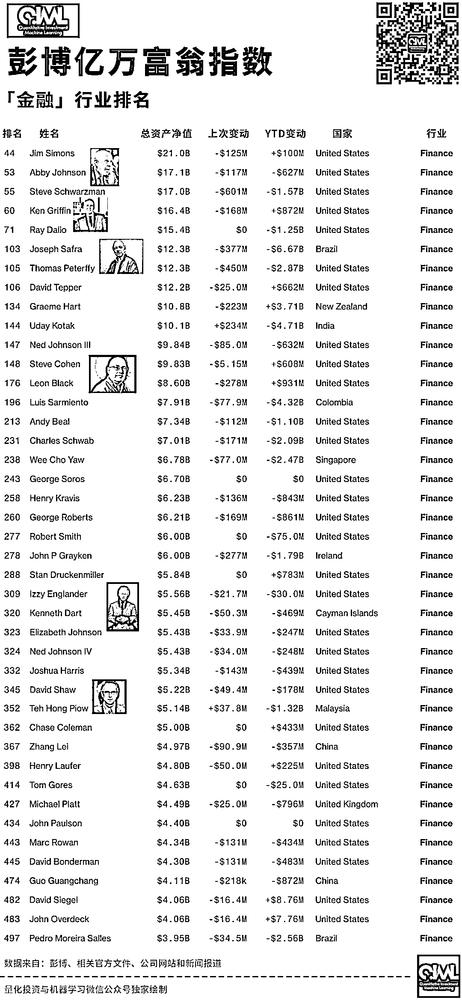
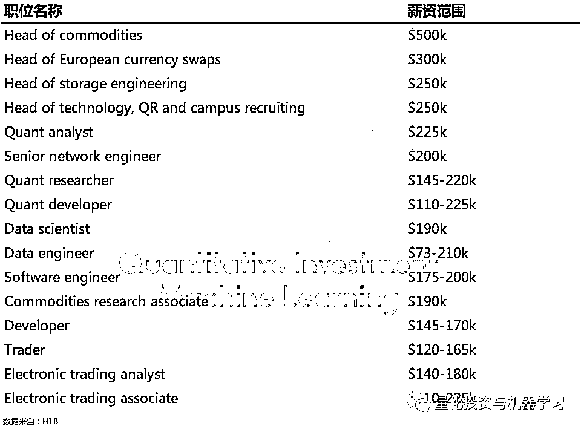
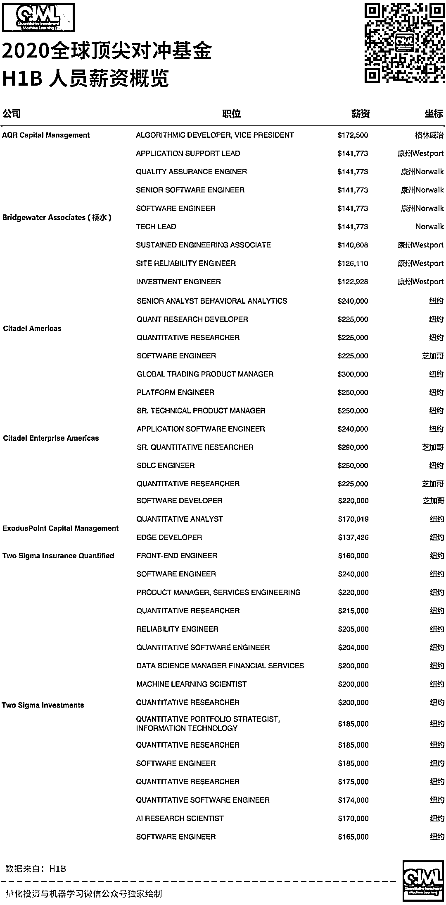
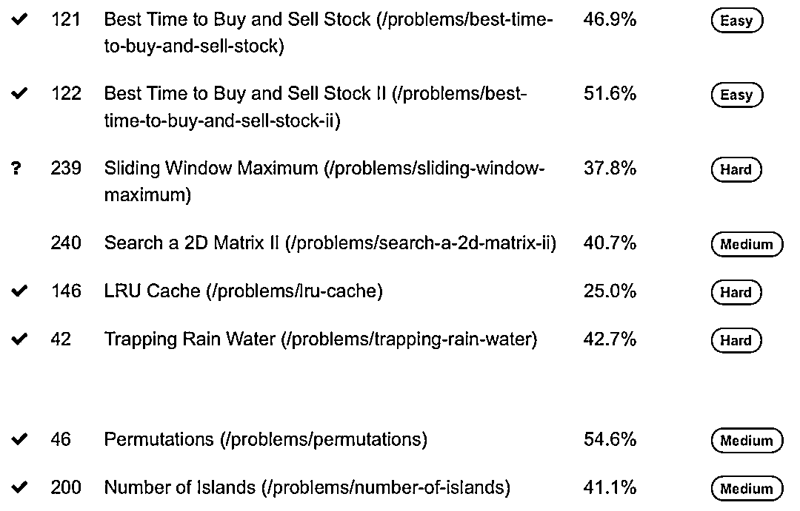
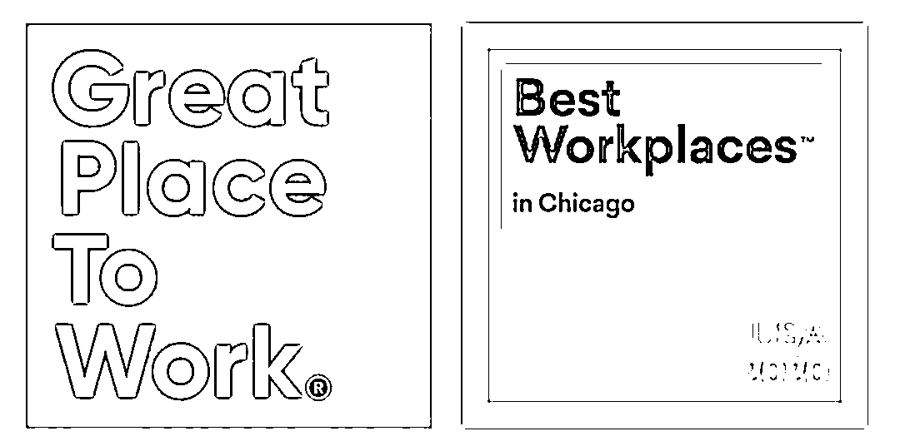

# Citadel 和 Citadel Securities：薪酬、业绩、就业、人文

> 原文：[`mp.weixin.qq.com/s?__biz=MzAxNTc0Mjg0Mg==&mid=2653305573&idx=1&sn=bf9b98eb1fd05820a22166d7f233f5f1&chksm=802df8f0b75a71e600a55f3ba54f7a67fecd7dbdf8220448345e6c0f775d87ec039f2763f224&scene=27#wechat_redirect`](http://mp.weixin.qq.com/s?__biz=MzAxNTc0Mjg0Mg==&mid=2653305573&idx=1&sn=bf9b98eb1fd05820a22166d7f233f5f1&chksm=802df8f0b75a71e600a55f3ba54f7a67fecd7dbdf8220448345e6c0f775d87ec039f2763f224&scene=27#wechat_redirect)

**全网 TOP 量化自媒体**

量化投资与机器学习编辑部出品

***1***

**薪酬、业绩**

Citadel 和 Citadel Securities 是两家不同的公司，但两家公司都由格里芬经营。同时格里芬在对冲基金个人排名中也是十分靠前：

其中：  

**Citadel 是一家全球领先的对冲基金**

**Citadel Securities 是一家全球领先的做市商**

因为这两家公司完全独立，所以两家公司在英国的账户完全独立。不过，考虑到他们共同的出身，他们同时提交了账户：Citadel Europe LLP 和 Citadel Management Europe Ltd.（都是该对冲基金的一部分）和 Citadel Securities Europe（做市商）刚刚发布了截至 2019 年 12 月的财年业绩。这些数据表明，格里芬去年在欧洲经营的对冲基金十分成功。

Citadel Securities Europe 的利润在 2018 年至 2019 年间下降了 79%，据该公司称，这是英国脱欧应急计划导致在欧盟市场产生的收入减少，以及对其他业务的投资增加的结果。其结果是，同期的股本收益率从 19.7%降至欧洲银行类股的 5.5%。 

在 Citadel Europe，情况截然不同。利润几乎翻了一番，从 2018 年的 3.7 亿美元增至 2019 年的 7.9 亿美元，这对于分享奖金的 13 位合伙人来说是个好消息，**这意味着当利润在 2020 年 3 月分配时，每位合伙人平均应得到约 6000 万美元。**

在 Citadel，员工的薪水也不低。在 Citadel Management Ltd， **218 名员工去年平均的收入是 110 万美元**。在 Citadel Securities Europe，120 名员工平均每人是 6.59 万美元。

根据我们在网上查找到的资料，截止去年 6 月的数据显示，其**支付给量化分析师和技术专家平均薪酬为 21.7 万美元，高于其平均薪酬为 21.5 万美元的投资分析师。**

从 WSO 与 Glassdoor 的提供的数据综合来看，Citadel 技术人员的薪资从 12.7 万美元到 21.5 万美元不等。

Citadel 支付给技术人员的薪酬高于其他对冲基金，也高于多数投行（高盛在 2017 年将其初级工程师的薪资提高至 10 万美元，并在今年早些时候开始向拥有硕士学位的新技术分析师提供总计 12.8 万美元的薪酬（工资加奖金））。

同时，根据 H1B 薪资数据库的也证实了这一点，至少在薪资方面，**Citadel 将大多数开发人员和技术专业人士的薪酬水平与专业投资人士同等对待。**

**H1B：**美国签证的一种，指特殊专业人员/临时工作签证 Specialty Occupations/ Temporary Worker Visas (H-1B)。发放给美国公司雇佣的外国籍有专业技能的员工，属于非移民签证的一种。

下表列出了 Citadel2019 年美国 H1B 签证持有者薪酬的一个具有代表性的部分。这些薪水大部分来源于纽约和芝加哥，不过 Citadel 也在纽瓦克、Westlake 和新泽西周围提供技术工作。这些薪水只是支付给 H1B 签证持有者。

再看看 2020 年的：

我们看到，薪资排名前三的都是来自 Citadel 的岗位，技术岗就占了一半！

| 排名 | 职位 | 薪资 |
| 1 | GLOBAL TRADING PRODUCT MANAGER | $300,000 |
| 2 | SR. QUANTITATIVE RESEARCHER | $290,000 |
| 3 | PLATFORM ENGINEER | $250,000 |
| 3 | SDLC ENGINEER | $250,000 |
| 3 | SR. TECHNICAL PRODUCT MANAGER | $250,000 |

值得注意的是，**H1B 数字不包括奖金**，如果你是一明投资交易人员并能产生 Alpha 收益，那么，上面的数字是相当可观的。在许多情况下，基本工资只占总薪酬的一小部分。

**所以啊！****搞量化的朋友们，不要盯着基本工资看！**

虽然一些高级投资人员的薪水高达 50 万美元，但 Citadel 给高级技术人员开出的最高薪水似乎是 25 万美元。量化分析师的薪资似乎高于技术人员，而数据科学家的薪资水平也高于软件工程师。然而，量化研究人员（研究新的交易策略）与量化开发人员（帮助将这些策略转换成代码）的薪水类似。

**开发人员和软件工程师的薪水似乎在 14.5 万美元到 20 万美元之间。**

高薪可能并不是 Citadel 吸引科技员工的唯一因素。员工在 Glassdoor 上提交的申请表明，该基金还为工程师们提供了难得的创新机会。

**没有项目经理！开发人员可以自由地与业务用户直接聊天，集思广益，共同创建解决方案。**

与此同时，Citadel Securities 去年增加了 11 名员工，并表示**在技术方面将加大投资力度**。Citadel Management Europe 也增加了 31 家，都是投资管理类公司。

***2***

**试题**

我们再来看看 Citadel 在 LeetCode 上的面试题目：

大家可以在 LeetCode 官网学习查看。 

***3***

**就业、文化**

Citadel 和 Citadel Securities 今年的实习情况堪称：

**奢华**

在今年疫情爆发之初，Citadel Securities 的一部分人撤到了 Palm Beach 的五星级酒店。在那里，Citadel Securities 建立了自己的交易大厅。真爽！

Palm Beach

同时，Citadel Securities 的 35 名实习生今年夏天也去了 Palm Beach 的四季酒店，另外 100 名实习生去了位于威斯康星州 Kohler 的五星级美国俱乐部度假村，在那里每晚的房价可高达 400 美元。这些实习生花了一个月的时间泡在酒店里，白天工作，晚上参加各种活动。Palm Beach 的活动包括：游泳日和 Spikeball 锦标赛。Kohler 的活动包括：皮划艇、攀岩和高尔夫课程。

活动现场

Citadel 的首席运营官 Gerald Beeson 在表示：**“在你事业起步的关键决策时刻，我们希望为你提供一个安全的、沉浸式的暑期项目，让我们的实习生能够和我们杰出的同事一起学习。”**

这些实习生的实习期于 8 月 14 日结束。两地都邀请了 Citadel 创始人格里芬和 Citadel Securities 首席执行官 Peng Zhao 进行了会谈。

Citadel 之所以选择在威斯康星州落户，是因为它离芝加哥很近：从 Citadel 的总部开车要两个多小时，也因为它位于乡村地区，而且 Kohler 还有 2000 多名居民。Citadel 投入了大量资源来升级度假村的技术基础设施，并在主宴会厅打造了一个可容纳 150 人的工作空间，简直棒呆！

Citadel 重新设计了位于威斯康星州科勒的 American Club 酒店布局

Citadel Securities 的 ETF 交易主管 Kelly Brennan 的总部通常在纽约，但她会在佛罗里达待上几周，亲自与团队中的实习生交流。在加入 Citadel Securities 之前，Brennan 在高盛工作了十多年。她说：“过去她和其他实习生有过互动，但今年，他们之间的关系更自然了！”

Brennan 也表示：“这对公司也有好处，公司可以再非工作时间关注实习生，让大家的个性都表现出来，这也能让我们对候选人有一个全面的认识！”

一名实习表示，他在其他金融公司工作的朋友对他这个夏天的经历表示**非常嫉妒**，而且这种经历让他与人们面对面交流产生了很大的不同。大厂就是不一样！

**公众号也希望，国内量化机构能够进一步加强对人才的培养。有些事情不可能一蹴而就，需要沉淀与积累！**

在今年的 2020 年 5 月分，Citadel Securities 被评为 2020 年芝加哥最佳工作场所之一。其来自 27000 多名员工的调查反馈，这些员工在一系列标准中匿名评价了他们的雇主的表现，这些标准包括对领导能力的信任、工作场所决策的公平性以及同事间的情谊。

Citadel Securities 首席执行官 Peng Zhao 表示：“**能被评为芝加哥顶级职场之一，我们感到非常激动”。“我们相信，为有才能的人才提供最好的技术、工具和环境来创造更好的市场，而这一认可正是对这一承诺的证明。**”

评选活动的首席执行官 Michael c. Bush 表示：“像 Citadel Securities 这样的最佳工作场所，建立了强大的信任和人际关系基础，帮助公司度过压力和不确定时期”。

国内量化机构这块目前在办公环境上都有很大的提升，向九坤、锐天、幻方等都是很不错的！

加油吧！Quant 们！

**这是一个充满神奇力量的职业，只要真正入行了，就不想走了！**

量化投资与机器学习微信公众号，是业内垂直于**Quant****、Fintech、AI、ML**等领域的**量化类主流自媒体。**公众号拥有来自**公募、私募、券商、期货、银行、保险、资管**等众多圈内**18W+**关注者。每日发布行业前沿研究成果和最新量化资讯。