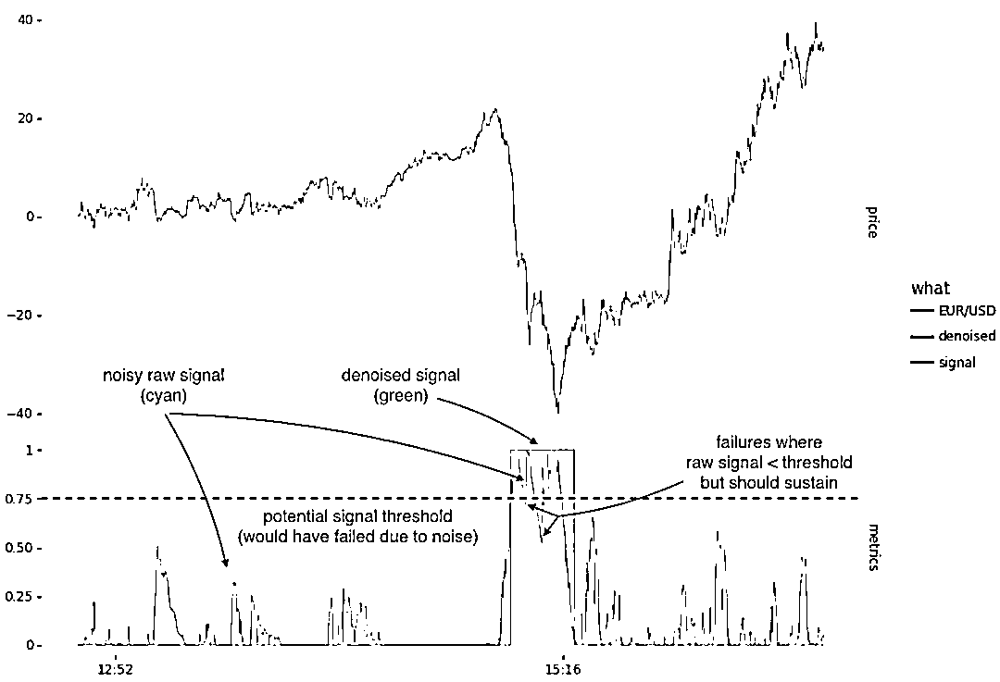

# HMM、信号、时序、降噪（附代码）

> 原文：[`mp.weixin.qq.com/s?__biz=MzAxNTc0Mjg0Mg==&mid=2653305498&idx=1&sn=4e4d8019b20cdc7887556bbfa655e13a&chksm=802df88fb75a7199da9534aed52dc853d214a8fc1d9ebb1646157b78ea6226b3e2513914a1ec&scene=27#wechat_redirect`](http://mp.weixin.qq.com/s?__biz=MzAxNTc0Mjg0Mg==&mid=2653305498&idx=1&sn=4e4d8019b20cdc7887556bbfa655e13a&chksm=802df88fb75a7199da9534aed52dc853d214a8fc1d9ebb1646157b78ea6226b3e2513914a1ec&scene=27#wechat_redirect)


**全网 TOP 量化自媒体**

***1*** 

**前言**

我所处理的大多数信号都是有噪声的，反映了潜在价格、成交量、成交额等的噪声。许多基于这些指标的传统策略可能是：

1、利用信号开仓买卖。

2、考虑信号的特定等级来表示一个状态，例如：long {+1}，short {-1}，neutral {0} 

下图是一个检测测下行动量信号的策略。我们的目标是当动量向下时信号为 1，当动量向不下时信号为 0。一种简单的方法可能是设置一个阈值，在阈值之上将原始信号映射为 1，在阈值之下将原始信号映射为 0。



在上述情况下，没有阈值水平可以避免 0 和 1 状态之间的不必要振荡。例如，在将阈值设置为 0.75 的情况下，有 2 次入侵低于阈值（将被映射到状态 0）。尝试其他阈值（例如 0.5）可以避免在动量期间产生噪音，但此后会遇到噪音。

去噪的信号（如图中的绿线所示）使用隐藏的马尔可夫模型（HMM）。

***2***

**一种解决方案**

## 在上述应用中，我们感兴趣的是配置状态+1 和 0，以消除信号中的噪声。让我们考虑一种常见的情况，我们想要将{Short，Neutral，Long}状态分配给一个有噪声的信号。

为此，可以构建一个三态系统并分配转换概率，例如从 Long 到 Short，从 Neutral 到 Long，保持在相同状态的转移概率等。


可以将相同的状态概率视为定义给定状态的“粘性”，以及对噪声的抵抗力，否则噪声可能导致我们转移到另一种状态。例如，如果我们给<mi>P</mi><mrow><mi>s</mi><mi>h</mi><mi>o</mi><mi>r</mi><mi>t</mi><mo stretchy="false">→</mo><mi>s</mi><mi>h</mi><mi>o</mi><mi>r</mi><mi>t 分配一个较高的概率，给脱离那个状态的转移分配一个相应的较低的概率，我们将能够在不转移到另一个状态的情况下承受更多的噪音。</mi></mrow>

上面的状态系统为我们提供了一个转换矩阵：


请注意，每行的概率总和必须为 1，即对于转移矩阵 M：<munder style="color: black;font-family: Optima-Regular, Optima, PingFangSC-light, PingFangTC-light, 'PingFang SC', Cambria, Cochin, Georgia, Times, 'Times New Roman', serif;font-size: 16px;letter-spacing: 0px;text-align: left;"><mo>∑</mo><mi>j</mi></munder><msub style="color: black;font-family: Optima-Regular, Optima, PingFangSC-light, PingFangTC-light, 'PingFang SC', Cambria, Cochin, Georgia, Times, 'Times New Roman', serif;font-size: 16px;letter-spacing: 0px;text-align: left;"><mi>M</mi><mrow><mi>i</mi><mo>,</mo><mi>j</mi></mrow></msub><mo style="color: black;font-family: Optima-Regular, Optima, PingFangSC-light, PingFangTC-light, 'PingFang SC', Cambria, Cochin, Georgia, Times, 'Times New Roman', serif;font-size: 16px;letter-spacing: 0px;text-align: left;">=</mo><mn style="color: black;font-family: Optima-Regular, Optima, PingFangSC-light, PingFangTC-light, 'PingFang SC', Cambria, Cochin, Georgia, Times, 'Times New Roman', serif;font-size: 16px;letter-spacing: 0px;text-align: left;">1</mn> 。**如果要根据对相同状态的“粘性”来定义降噪模型**，则可以将三态转移矩阵的概率确定为：


对于二态矩阵，则为： 


***3***

**观测分布**

### 接下来，我们需要考虑如何将（噪声）信号映射到这些状态。HMM 采取的方法是引入观测分布<mi style="color: black;font-family: Optima-Regular, Optima, PingFangSC-light, PingFangTC-light, &quot;PingFang SC&quot;, Cambria, Cochin, Georgia, Times, &quot;Times New Roman&quot;, serif;letter-spacing: 0px;text-align: left;">p</mi><mo stretchy="false" style="color: black;font-family: Optima-Regular, Optima, PingFangSC-light, PingFangTC-light, &quot;PingFang SC&quot;, Cambria, Cochin, Georgia, Times, &quot;Times New Roman&quot;, serif;letter-spacing: 0px;text-align: left;">(</mo><mi style="color: black;font-family: Optima-Regular, Optima, PingFangSC-light, PingFangTC-light, &quot;PingFang SC&quot;, Cambria, Cochin, Georgia, Times, &quot;Times New Roman&quot;, serif;letter-spacing: 0px;text-align: left;">y</mi><mo fence="false" stretchy="false" style="color: black;font-family: Optima-Regular, Optima, PingFangSC-light, PingFangTC-light, &quot;PingFang SC&quot;, Cambria, Cochin, Georgia, Times, &quot;Times New Roman&quot;, serif;letter-spacing: 0px;text-align: left;">|</mo><mi style="color: black;font-family: Optima-Regular, Optima, PingFangSC-light, PingFangTC-light, &quot;PingFang SC&quot;, Cambria, Cochin, Georgia, Times, &quot;Times New Roman&quot;, serif;letter-spacing: 0px;text-align: left;">x</mi><mo stretchy="false" style="color: black;font-family: Optima-Regular, Optima, PingFangSC-light, PingFangTC-light, &quot;PingFang SC&quot;, Cambria, Cochin, Georgia, Times, &quot;Times New Roman&quot;, serif;letter-spacing: 0px;text-align: left;">)</mo>，其中 y 是我们的观测值（在这种情况下为原始信号），x 是特定的“隐藏状态”。 

我们的下一步是为每个状态设计一个观测分布，提供分离以使<mi style="color: black;font-family: Optima-Regular, Optima, PingFangSC-light, PingFangTC-light, 'PingFang SC', Cambria, Cochin, Georgia, Times, 'Times New Roman', serif;font-size: 16px;letter-spacing: 0px;text-align: left;"><mi style="color: black;font-family: Optima-Regular, Optima, PingFangSC-light, PingFangTC-light, 'PingFang SC', Cambria, Cochin, Georgia, Times, 'Times New Roman', serif;font-size: 16px;letter-spacing: 0px;text-align: left;"><mi style="color: black;font-family: Optima-Regular, Optima, PingFangSC-light, PingFangTC-light, 'PingFang SC', Cambria, Cochin, Georgia, Times, 'Times New Roman', serif;font-size: 16px;letter-spacing: 0px;text-align: left;">p</mi><mi style="color: black;font-family: Optima-Regular, Optima, PingFangSC-light, PingFangTC-light, 'PingFang SC', Cambria, Cochin, Georgia, Times, 'Times New Roman', serif;font-size: 16px;letter-spacing: 0px;text-align: left;"><mi style="color: black;font-family: Optima-Regular, Optima, PingFangSC-light, PingFangTC-light, 'PingFang SC', Cambria, Cochin, Georgia, Times, 'Times New Roman', serif;font-size: 16px;letter-spacing: 0px;text-align: left;"><mo stretchy="false" style="color: black;font-family: Optima-Regular, Optima, PingFangSC-light, PingFangTC-light, 'PingFang SC', Cambria, Cochin, Georgia, Times, 'Times New Roman', serif;font-size: 16px;letter-spacing: 0px;text-align: left;">(</mo><mi style="color: black;font-family: Optima-Regular, Optima, PingFangSC-light, PingFangTC-light, 'PingFang SC', Cambria, Cochin, Georgia, Times, 'Times New Roman', serif;font-size: 16px;letter-spacing: 0px;text-align: left;">y</mi><mo fence="false" stretchy="false" style="color: black;font-family: Optima-Regular, Optima, PingFangSC-light, PingFangTC-light, 'PingFang SC', Cambria, Cochin, Georgia, Times, 'Times New Roman', serif;font-size: 16px;letter-spacing: 0px;text-align: left;">|</mo><mi style="color: black;font-family: Optima-Regular, Optima, PingFangSC-light, PingFangTC-light, 'PingFang SC', Cambria, Cochin, Georgia, Times, 'Times New Roman', serif;font-size: 16px;letter-spacing: 0px;text-align: left;">x</mi><mo style="color: black;font-family: Optima-Regular, Optima, PingFangSC-light, PingFangTC-light, 'PingFang SC', Cambria, Cochin, Georgia, Times, 'Times New Roman', serif;font-size: 16px;letter-spacing: 0px;text-align: left;">=</mo><msub style="color: black;font-family: Optima-Regular, Optima, PingFangSC-light, PingFangTC-light, 'PingFang SC', Cambria, Cochin, Georgia, Times, 'Times New Roman', serif;font-size: 16px;letter-spacing: 0px;text-align: left;"><mi>s</mi><mi>i</mi></msub><mo stretchy="false" style="color: black;font-family: Optima-Regular, Optima, PingFangSC-light, PingFangTC-light, 'PingFang SC', Cambria, Cochin, Georgia, Times, 'Times New Roman', serif;font-size: 16px;letter-spacing: 0px;text-align: left;">)</mo><mo stretchy="false" style="color: black;font-family: Optima-Regular, Optima, PingFangSC-light, PingFangTC-light, 'PingFang SC', Cambria, Cochin, Georgia, Times, 'Times New Roman', serif;font-size: 16px;letter-spacing: 0px;text-align: left;"><mo stretchy="false" style="color: black;font-family: Optima-Regular, Optima, PingFangSC-light, PingFangTC-light, 'PingFang SC', Cambria, Cochin, Georgia, Times, 'Times New Roman', serif;font-size: 16px;letter-spacing: 0px;text-align: left;">对比</mo><mo stretchy="false" style="color: black;font-family: Optima-Regular, Optima, PingFangSC-light, PingFangTC-light, 'PingFang SC', Cambria, Cochin, Georgia, Times, 'Times New Roman', serif;font-size: 16px;letter-spacing: 0px;text-align: left;"><mi style="color: black;font-family: Optima-Regular, Optima, PingFangSC-light, PingFangTC-light, 'PingFang SC', Cambria, Cochin, Georgia, Times, 'Times New Roman', serif;font-size: 16px;letter-spacing: 0px;text-align: left;">p</mi><mi style="color: black;font-family: Optima-Regular, Optima, PingFangSC-light, PingFangTC-light, 'PingFang SC', Cambria, Cochin, Georgia, Times, 'Times New Roman', serif;font-size: 16px;letter-spacing: 0px;text-align: left;"><mo stretchy="false" style="color: black;font-family: Optima-Regular, Optima, PingFangSC-light, PingFangTC-light, 'PingFang SC', Cambria, Cochin, Georgia, Times, 'Times New Roman', serif;font-size: 16px;letter-spacing: 0px;text-align: left;">(</mo><mi style="color: black;font-family: Optima-Regular, Optima, PingFangSC-light, PingFangTC-light, 'PingFang SC', Cambria, Cochin, Georgia, Times, 'Times New Roman', serif;font-size: 16px;letter-spacing: 0px;text-align: left;">y</mi><mo fence="false" stretchy="false" style="color: black;font-family: Optima-Regular, Optima, PingFangSC-light, PingFangTC-light, 'PingFang SC', Cambria, Cochin, Georgia, Times, 'Times New Roman', serif;font-size: 16px;letter-spacing: 0px;text-align: left;">|</mo><mi style="color: black;font-family: Optima-Regular, Optima, PingFangSC-light, PingFangTC-light, 'PingFang SC', Cambria, Cochin, Georgia, Times, 'Times New Roman', serif;font-size: 16px;letter-spacing: 0px;text-align: left;">x</mi><mo style="color: black;font-family: Optima-Regular, Optima, PingFangSC-light, PingFangTC-light, 'PingFang SC', Cambria, Cochin, Georgia, Times, 'Times New Roman', serif;font-size: 16px;letter-spacing: 0px;text-align: left;">=</mo><msub style="color: black;font-family: Optima-Regular, Optima, PingFangSC-light, PingFangTC-light, 'PingFang SC', Cambria, Cochin, Georgia, Times, 'Times New Roman', serif;font-size: 16px;letter-spacing: 0px;text-align: left;"><mi>s</mi><mi>j</mi></msub><mo stretchy="false" style="color: black;font-family: Optima-Regular, Optima, PingFangSC-light, PingFangTC-light, 'PingFang SC', Cambria, Cochin, Georgia, Times, 'Times New Roman', serif;font-size: 16px;letter-spacing: 0px;text-align: left;">)</mo><mo stretchy="false" style="color: black;font-family: Optima-Regular, Optima, PingFangSC-light, PingFangTC-light, 'PingFang SC', Cambria, Cochin, Georgia, Times, 'Times New Roman', serif;font-size: 16px;letter-spacing: 0px;text-align: left;">的概率</mo><mo stretchy="false" style="color: black;font-family: Optima-Regular, Optima, PingFangSC-light, PingFangTC-light, 'PingFang SC', Cambria, Cochin, Georgia, Times, 'Times New Roman', serif;font-size: 16px;letter-spacing: 0px;text-align: left;">对于应该映射到状态<mi style="letter-spacing: 0px;white-space: normal;color: black;font-family: Optima-Regular, Optima, PingFangSC-light, PingFangTC-light, 'PingFang SC', Cambria, Cochin, Georgia, Times, 'Times New Roman', serif;font-size: 16px;text-align: left;">s</mi><mi style="letter-spacing: 0px;white-space: normal;color: black;font-family: Optima-Regular, Optima, PingFangSC-light, PingFangTC-light, 'PingFang SC', Cambria, Cochin, Georgia, Times, 'Times New Roman', serif;font-size: 16px;text-align: left;">i</mi><mi style="letter-spacing: 0px;white-space: normal;color: black;font-family: Optima-Regular, Optima, PingFangSC-light, PingFangTC-light, 'PingFang SC', Cambria, Cochin, Georgia, Times, 'Times New Roman', serif;font-size: 16px;text-align: left;">与</mi><mi style="letter-spacing: 0px;white-space: normal;color: black;font-family: Optima-Regular, Optima, PingFangSC-light, PingFangTC-light, 'PingFang SC', Cambria, Cochin, Georgia, Times, 'Times New Roman', serif;font-size: 16px;text-align: left;">s</mi><mi style="letter-spacing: 0px;white-space: normal;color: black;font-family: Optima-Regular, Optima, PingFangSC-light, PingFangTC-light, 'PingFang SC', Cambria, Cochin, Georgia, Times, 'Times New Roman', serif;font-size: 16px;text-align: left;">j</mi>的信号值来说有显著的不同。在下面的示例中，我们使用正态分布将一个有噪声的信号映射到两种状态（long，short）：</mo></mi></mo></mo></mi></mi></mi></mi>

*   Long 状态： <mi style="color: black;font-family: Optima-Regular, Optima, PingFangSC-light, PingFangTC-light, 'PingFang SC', Cambria, Cochin, Georgia, Times, 'Times New Roman', serif;font-size: 16px;letter-spacing: 0px;text-align: left;">p</mi><mo stretchy="false" style="color: black;font-family: Optima-Regular, Optima, PingFangSC-light, PingFangTC-light, 'PingFang SC', Cambria, Cochin, Georgia, Times, 'Times New Roman', serif;font-size: 16px;letter-spacing: 0px;text-align: left;">(</mo><mi style="color: black;font-family: Optima-Regular, Optima, PingFangSC-light, PingFangTC-light, 'PingFang SC', Cambria, Cochin, Georgia, Times, 'Times New Roman', serif;font-size: 16px;letter-spacing: 0px;text-align: left;">y</mi><mo fence="false" stretchy="false" style="color: black;font-family: Optima-Regular, Optima, PingFangSC-light, PingFangTC-light, 'PingFang SC', Cambria, Cochin, Georgia, Times, 'Times New Roman', serif;font-size: 16px;letter-spacing: 0px;text-align: left;">|</mo><mi style="color: black;font-family: Optima-Regular, Optima, PingFangSC-light, PingFangTC-light, 'PingFang SC', Cambria, Cochin, Georgia, Times, 'Times New Roman', serif;font-size: 16px;letter-spacing: 0px;text-align: left;">x</mi><mo style="color: black;font-family: Optima-Regular, Optima, PingFangSC-light, PingFangTC-light, 'PingFang SC', Cambria, Cochin, Georgia, Times, 'Times New Roman', serif;font-size: 16px;letter-spacing: 0px;text-align: left;">=</mo><mi style="color: black;font-family: Optima-Regular, Optima, PingFangSC-light, PingFangTC-light, 'PingFang SC', Cambria, Cochin, Georgia, Times, 'Times New Roman', serif;font-size: 16px;letter-spacing: 0px;text-align: left;">l</mi><mi style="color: black;font-family: Optima-Regular, Optima, PingFangSC-light, PingFangTC-light, 'PingFang SC', Cambria, Cochin, Georgia, Times, 'Times New Roman', serif;font-size: 16px;letter-spacing: 0px;text-align: left;">o</mi><mi style="color: black;font-family: Optima-Regular, Optima, PingFangSC-light, PingFangTC-light, 'PingFang SC', Cambria, Cochin, Georgia, Times, 'Times New Roman', serif;font-size: 16px;letter-spacing: 0px;text-align: left;">n</mi><mi style="color: black;font-family: Optima-Regular, Optima, PingFangSC-light, PingFangTC-light, 'PingFang SC', Cambria, Cochin, Georgia, Times, 'Times New Roman', serif;font-size: 16px;letter-spacing: 0px;text-align: left;">g</mi><mo stretchy="false" style="color: black;font-family: Optima-Regular, Optima, PingFangSC-light, PingFangTC-light, 'PingFang SC', Cambria, Cochin, Georgia, Times, 'Times New Roman', serif;font-size: 16px;letter-spacing: 0px;text-align: left;">)</mo><mo style="color: black;font-family: Optima-Regular, Optima, PingFangSC-light, PingFangTC-light, 'PingFang SC', Cambria, Cochin, Georgia, Times, 'Times New Roman', serif;font-size: 16px;letter-spacing: 0px;text-align: left;">=</mo><mi style="color: black;font-family: Optima-Regular, Optima, PingFangSC-light, PingFangTC-light, 'PingFang SC', Cambria, Cochin, Georgia, Times, 'Times New Roman', serif;font-size: 16px;letter-spacing: 0px;text-align: left;">N</mi><mo stretchy="false" style="color: black;font-family: Optima-Regular, Optima, PingFangSC-light, PingFangTC-light, 'PingFang SC', Cambria, Cochin, Georgia, Times, 'Times New Roman', serif;font-size: 16px;letter-spacing: 0px;text-align: left;">(</mo><mo style="color: black;font-family: Optima-Regular, Optima, PingFangSC-light, PingFangTC-light, 'PingFang SC', Cambria, Cochin, Georgia, Times, 'Times New Roman', serif;font-size: 16px;letter-spacing: 0px;text-align: left;">+</mo><mn style="color: black;font-family: Optima-Regular, Optima, PingFangSC-light, PingFangTC-light, 'PingFang SC', Cambria, Cochin, Georgia, Times, 'Times New Roman', serif;font-size: 16px;letter-spacing: 0px;text-align: left;">0.65</mn><mo style="color: black;font-family: Optima-Regular, Optima, PingFangSC-light, PingFangTC-light, 'PingFang SC', Cambria, Cochin, Georgia, Times, 'Times New Roman', serif;font-size: 16px;letter-spacing: 0px;text-align: left;">,</mo><mi style="color: black;font-family: Optima-Regular, Optima, PingFangSC-light, PingFangTC-light, 'PingFang SC', Cambria, Cochin, Georgia, Times, 'Times New Roman', serif;font-size: 16px;letter-spacing: 0px;text-align: left;">σ</mi><mo stretchy="false" style="color: black;font-family: Optima-Regular, Optima, PingFangSC-light, PingFangTC-light, 'PingFang SC', Cambria, Cochin, Georgia, Times, 'Times New Roman', serif;font-size: 16px;letter-spacing: 0px;text-align: left;">)</mo><mo stretchy="false" style="color: black;font-family: Optima-Regular, Optima, PingFangSC-light, PingFangTC-light, 'PingFang SC', Cambria, Cochin, Georgia, Times, 'Times New Roman', serif;font-size: 16px;letter-spacing: 0px;text-align: left;">或者</mo>

*   Short 状态： <mi style="color: black;font-family: Optima-Regular, Optima, PingFangSC-light, PingFangTC-light, 'PingFang SC', Cambria, Cochin, Georgia, Times, 'Times New Roman', serif;font-size: 16px;letter-spacing: 0px;text-align: left;">p</mi><mo stretchy="false" style="color: black;font-family: Optima-Regular, Optima, PingFangSC-light, PingFangTC-light, 'PingFang SC', Cambria, Cochin, Georgia, Times, 'Times New Roman', serif;font-size: 16px;letter-spacing: 0px;text-align: left;">(</mo><mi style="color: black;font-family: Optima-Regular, Optima, PingFangSC-light, PingFangTC-light, 'PingFang SC', Cambria, Cochin, Georgia, Times, 'Times New Roman', serif;font-size: 16px;letter-spacing: 0px;text-align: left;">y</mi><mo fence="false" stretchy="false" style="color: black;font-family: Optima-Regular, Optima, PingFangSC-light, PingFangTC-light, 'PingFang SC', Cambria, Cochin, Georgia, Times, 'Times New Roman', serif;font-size: 16px;letter-spacing: 0px;text-align: left;">|</mo><mi style="color: black;font-family: Optima-Regular, Optima, PingFangSC-light, PingFangTC-light, 'PingFang SC', Cambria, Cochin, Georgia, Times, 'Times New Roman', serif;font-size: 16px;letter-spacing: 0px;text-align: left;">x</mi><mo style="color: black;font-family: Optima-Regular, Optima, PingFangSC-light, PingFangTC-light, 'PingFang SC', Cambria, Cochin, Georgia, Times, 'Times New Roman', serif;font-size: 16px;letter-spacing: 0px;text-align: left;">=</mo><mi style="color: black;font-family: Optima-Regular, Optima, PingFangSC-light, PingFangTC-light, 'PingFang SC', Cambria, Cochin, Georgia, Times, 'Times New Roman', serif;font-size: 16px;letter-spacing: 0px;text-align: left;">s</mi><mi style="color: black;font-family: Optima-Regular, Optima, PingFangSC-light, PingFangTC-light, 'PingFang SC', Cambria, Cochin, Georgia, Times, 'Times New Roman', serif;font-size: 16px;letter-spacing: 0px;text-align: left;">h</mi><mi style="color: black;font-family: Optima-Regular, Optima, PingFangSC-light, PingFangTC-light, 'PingFang SC', Cambria, Cochin, Georgia, Times, 'Times New Roman', serif;font-size: 16px;letter-spacing: 0px;text-align: left;">o</mi><mi style="color: black;font-family: Optima-Regular, Optima, PingFangSC-light, PingFangTC-light, 'PingFang SC', Cambria, Cochin, Georgia, Times, 'Times New Roman', serif;font-size: 16px;letter-spacing: 0px;text-align: left;">r</mi><mi style="color: black;font-family: Optima-Regular, Optima, PingFangSC-light, PingFangTC-light, 'PingFang SC', Cambria, Cochin, Georgia, Times, 'Times New Roman', serif;font-size: 16px;letter-spacing: 0px;text-align: left;">t</mi><mo stretchy="false" style="color: black;font-family: Optima-Regular, Optima, PingFangSC-light, PingFangTC-light, 'PingFang SC', Cambria, Cochin, Georgia, Times, 'Times New Roman', serif;font-size: 16px;letter-spacing: 0px;text-align: left;">)</mo><mo style="color: black;font-family: Optima-Regular, Optima, PingFangSC-light, PingFangTC-light, 'PingFang SC', Cambria, Cochin, Georgia, Times, 'Times New Roman', serif;font-size: 16px;letter-spacing: 0px;text-align: left;">=</mo><mi style="color: black;font-family: Optima-Regular, Optima, PingFangSC-light, PingFangTC-light, 'PingFang SC', Cambria, Cochin, Georgia, Times, 'Times New Roman', serif;font-size: 16px;letter-spacing: 0px;text-align: left;">N</mi><mo stretchy="false" style="color: black;font-family: Optima-Regular, Optima, PingFangSC-light, PingFangTC-light, 'PingFang SC', Cambria, Cochin, Georgia, Times, 'Times New Roman', serif;font-size: 16px;letter-spacing: 0px;text-align: left;">(</mo><mo style="color: black;font-family: Optima-Regular, Optima, PingFangSC-light, PingFangTC-light, 'PingFang SC', Cambria, Cochin, Georgia, Times, 'Times New Roman', serif;font-size: 16px;letter-spacing: 0px;text-align: left;">−</mo><mn style="color: black;font-family: Optima-Regular, Optima, PingFangSC-light, PingFangTC-light, 'PingFang SC', Cambria, Cochin, Georgia, Times, 'Times New Roman', serif;font-size: 16px;letter-spacing: 0px;text-align: left;">0.65</mn><mo style="color: black;font-family: Optima-Regular, Optima, PingFangSC-light, PingFangTC-light, 'PingFang SC', Cambria, Cochin, Georgia, Times, 'Times New Roman', serif;font-size: 16px;letter-spacing: 0px;text-align: left;">,</mo><mi style="color: black;font-family: Optima-Regular, Optima, PingFangSC-light, PingFangTC-light, 'PingFang SC', Cambria, Cochin, Georgia, Times, 'Times New Roman', serif;font-size: 16px;letter-spacing: 0px;text-align: left;">σ</mi><mo stretchy="false" style="color: black;font-family: Optima-Regular, Optima, PingFangSC-light, PingFangTC-light, 'PingFang SC', Cambria, Cochin, Georgia, Times, 'Times New Roman', serif;font-size: 16px;letter-spacing: 0px;text-align: left;">)</mo>


***4***

**与 HMM 结合**

### 观测分布为我们提供了 <mi style="font-family: mp-quote, -apple-system-font, BlinkMacSystemFont, &quot;Helvetica Neue&quot;, &quot;PingFang SC&quot;, &quot;Hiragino Sans GB&quot;, &quot;Microsoft YaHei UI&quot;, &quot;Microsoft YaHei&quot;, Arial, sans-serif;font-size: 17px;"><mi style="font-family: mp-quote, -apple-system-font, BlinkMacSystemFont, &quot;Helvetica Neue&quot;, &quot;PingFang SC&quot;, &quot;Hiragino Sans GB&quot;, &quot;Microsoft YaHei UI&quot;, &quot;Microsoft YaHei&quot;, Arial, sans-serif;font-size: 17px;">p</mi><mo stretchy="false" style="font-family: mp-quote, -apple-system-font, BlinkMacSystemFont, &quot;Helvetica Neue&quot;, &quot;PingFang SC&quot;, &quot;Hiragino Sans GB&quot;, &quot;Microsoft YaHei UI&quot;, &quot;Microsoft YaHei&quot;, Arial, sans-serif;font-size: 17px;">(</mo><mi style="font-family: mp-quote, -apple-system-font, BlinkMacSystemFont, &quot;Helvetica Neue&quot;, &quot;PingFang SC&quot;, &quot;Hiragino Sans GB&quot;, &quot;Microsoft YaHei UI&quot;, &quot;Microsoft YaHei&quot;, Arial, sans-serif;font-size: 17px;">y</mi><mo fence="false" stretchy="false" style="font-family: mp-quote, -apple-system-font, BlinkMacSystemFont, &quot;Helvetica Neue&quot;, &quot;PingFang SC&quot;, &quot;Hiragino Sans GB&quot;, &quot;Microsoft YaHei UI&quot;, &quot;Microsoft YaHei&quot;, Arial, sans-serif;font-size: 17px;">|</mo><mi style="font-family: mp-quote, -apple-system-font, BlinkMacSystemFont, &quot;Helvetica Neue&quot;, &quot;PingFang SC&quot;, &quot;Hiragino Sans GB&quot;, &quot;Microsoft YaHei UI&quot;, &quot;Microsoft YaHei&quot;, Arial, sans-serif;font-size: 17px;">x</mi><mo style="font-family: mp-quote, -apple-system-font, BlinkMacSystemFont, &quot;Helvetica Neue&quot;, &quot;PingFang SC&quot;, &quot;Hiragino Sans GB&quot;, &quot;Microsoft YaHei UI&quot;, &quot;Microsoft YaHei&quot;, Arial, sans-serif;font-size: 17px;">=</mo><mi style="font-family: mp-quote, -apple-system-font, BlinkMacSystemFont, &quot;Helvetica Neue&quot;, &quot;PingFang SC&quot;, &quot;Hiragino Sans GB&quot;, &quot;Microsoft YaHei UI&quot;, &quot;Microsoft YaHei&quot;, Arial, sans-serif;font-size: 17px;">s</mi><mo stretchy="false" style="font-family: mp-quote, -apple-system-font, BlinkMacSystemFont, &quot;Helvetica Neue&quot;, &quot;PingFang SC&quot;, &quot;Hiragino Sans GB&quot;, &quot;Microsoft YaHei UI&quot;, &quot;Microsoft YaHei&quot;, Arial, sans-serif;font-size: 17px;">)</mo>，但我们正在寻找的是 <mi style="font-family: mp-quote, -apple-system-font, BlinkMacSystemFont, &quot;Helvetica Neue&quot;, &quot;PingFang SC&quot;, &quot;Hiragino Sans GB&quot;, &quot;Microsoft YaHei UI&quot;, &quot;Microsoft YaHei&quot;, Arial, sans-serif;font-size: 17px;"><mi style="font-family: mp-quote, -apple-system-font, BlinkMacSystemFont, &quot;Helvetica Neue&quot;, &quot;PingFang SC&quot;, &quot;Hiragino Sans GB&quot;, &quot;Microsoft YaHei UI&quot;, &quot;Microsoft YaHei&quot;, Arial, sans-serif;font-size: 17px;">p</mi><mo stretchy="false" style="font-family: mp-quote, -apple-system-font, BlinkMacSystemFont, &quot;Helvetica Neue&quot;, &quot;PingFang SC&quot;, &quot;Hiragino Sans GB&quot;, &quot;Microsoft YaHei UI&quot;, &quot;Microsoft YaHei&quot;, Arial, sans-serif;font-size: 17px;">(</mo><mi style="font-family: mp-quote, -apple-system-font, BlinkMacSystemFont, &quot;Helvetica Neue&quot;, &quot;PingFang SC&quot;, &quot;Hiragino Sans GB&quot;, &quot;Microsoft YaHei UI&quot;, &quot;Microsoft YaHei&quot;, Arial, sans-serif;font-size: 17px;">x</mi><mo style="font-family: mp-quote, -apple-system-font, BlinkMacSystemFont, &quot;Helvetica Neue&quot;, &quot;PingFang SC&quot;, &quot;Hiragino Sans GB&quot;, &quot;Microsoft YaHei UI&quot;, &quot;Microsoft YaHei&quot;, Arial, sans-serif;font-size: 17px;">=</mo><mi style="font-family: mp-quote, -apple-system-font, BlinkMacSystemFont, &quot;Helvetica Neue&quot;, &quot;PingFang SC&quot;, &quot;Hiragino Sans GB&quot;, &quot;Microsoft YaHei UI&quot;, &quot;Microsoft YaHei&quot;, Arial, sans-serif;font-size: 17px;">s</mi><mo fence="false" stretchy="false" style="font-family: mp-quote, -apple-system-font, BlinkMacSystemFont, &quot;Helvetica Neue&quot;, &quot;PingFang SC&quot;, &quot;Hiragino Sans GB&quot;, &quot;Microsoft YaHei UI&quot;, &quot;Microsoft YaHei&quot;, Arial, sans-serif;font-size: 17px;">|</mo><msub style="font-family: mp-quote, -apple-system-font, BlinkMacSystemFont, &quot;Helvetica Neue&quot;, &quot;PingFang SC&quot;, &quot;Hiragino Sans GB&quot;, &quot;Microsoft YaHei UI&quot;, &quot;Microsoft YaHei&quot;, Arial, sans-serif;font-size: 17px;"><mi>y</mi><mi>n</mi></msub><mo style="font-family: mp-quote, -apple-system-font, BlinkMacSystemFont, &quot;Helvetica Neue&quot;, &quot;PingFang SC&quot;, &quot;Hiragino Sans GB&quot;, &quot;Microsoft YaHei UI&quot;, &quot;Microsoft YaHei&quot;, Arial, sans-serif;font-size: 17px;">,</mo><msub style="font-family: mp-quote, -apple-system-font, BlinkMacSystemFont, &quot;Helvetica Neue&quot;, &quot;PingFang SC&quot;, &quot;Hiragino Sans GB&quot;, &quot;Microsoft YaHei UI&quot;, &quot;Microsoft YaHei&quot;, Arial, sans-serif;font-size: 17px;"><mi>y</mi><mrow><mi>n</mi><mo>−</mo><mn>1</mn></mrow></msub><mo style="font-family: mp-quote, -apple-system-font, BlinkMacSystemFont, &quot;Helvetica Neue&quot;, &quot;PingFang SC&quot;, &quot;Hiragino Sans GB&quot;, &quot;Microsoft YaHei UI&quot;, &quot;Microsoft YaHei&quot;, Arial, sans-serif;font-size: 17px;">,</mo><mo style="font-family: mp-quote, -apple-system-font, BlinkMacSystemFont, &quot;Helvetica Neue&quot;, &quot;PingFang SC&quot;, &quot;Hiragino Sans GB&quot;, &quot;Microsoft YaHei UI&quot;, &quot;Microsoft YaHei&quot;, Arial, sans-serif;font-size: 17px;">.</mo><mo style="font-family: mp-quote, -apple-system-font, BlinkMacSystemFont, &quot;Helvetica Neue&quot;, &quot;PingFang SC&quot;, &quot;Hiragino Sans GB&quot;, &quot;Microsoft YaHei UI&quot;, &quot;Microsoft YaHei&quot;, Arial, sans-serif;font-size: 17px;">.</mo><msub style="font-family: mp-quote, -apple-system-font, BlinkMacSystemFont, &quot;Helvetica Neue&quot;, &quot;PingFang SC&quot;, &quot;Hiragino Sans GB&quot;, &quot;Microsoft YaHei UI&quot;, &quot;Microsoft YaHei&quot;, Arial, sans-serif;font-size: 17px;"><mi>y</mi><mn>0</mn></msub><mo stretchy="false" style="font-family: mp-quote, -apple-system-font, BlinkMacSystemFont, &quot;Helvetica Neue&quot;, &quot;PingFang SC&quot;, &quot;Hiragino Sans GB&quot;, &quot;Microsoft YaHei UI&quot;, &quot;Microsoft YaHei&quot;, Arial, sans-serif;font-size: 17px;">)</mo><mo stretchy="false" style="font-family: mp-quote, -apple-system-font, BlinkMacSystemFont, &quot;Helvetica Neue&quot;, &quot;PingFang SC&quot;, &quot;Hiragino Sans GB&quot;, &quot;Microsoft YaHei UI&quot;, &quot;Microsoft YaHei&quot;, Arial, sans-serif;font-size: 17px;">，即在给定观测序列（我们的噪声信号）的情况下处于“ s”状态的概率，<msub style="color: black;font-family: Optima-Regular, Optima, PingFangSC-light, PingFangTC-light, &quot;PingFang SC&quot;, Cambria, Cochin, Georgia, Times, &quot;Times New Roman&quot;, serif;letter-spacing: 0px;text-align: left;"><mi>y</mi><mi>n</mi></msub><mo style="color: black;font-family: Optima-Regular, Optima, PingFangSC-light, PingFangTC-light, &quot;PingFang SC&quot;, Cambria, Cochin, Georgia, Times, &quot;Times New Roman&quot;, serif;letter-spacing: 0px;text-align: left;">,</mo><msub style="color: black;font-family: Optima-Regular, Optima, PingFangSC-light, PingFangTC-light, &quot;PingFang SC&quot;, Cambria, Cochin, Georgia, Times, &quot;Times New Roman&quot;, serif;letter-spacing: 0px;text-align: left;"><mi>y</mi><mrow><mi>n</mi><mo>−</mo><mn>1</mn></mrow></msub><mo style="color: black;font-family: Optima-Regular, Optima, PingFangSC-light, PingFangTC-light, &quot;PingFang SC&quot;, Cambria, Cochin, Georgia, Times, &quot;Times New Roman&quot;, serif;letter-spacing: 0px;text-align: left;">,</mo><mo style="color: black;font-family: Optima-Regular, Optima, PingFangSC-light, PingFangTC-light, &quot;PingFang SC&quot;, Cambria, Cochin, Georgia, Times, &quot;Times New Roman&quot;, serif;letter-spacing: 0px;text-align: left;">.</mo><mo style="color: black;font-family: Optima-Regular, Optima, PingFangSC-light, PingFangTC-light, &quot;PingFang SC&quot;, Cambria, Cochin, Georgia, Times, &quot;Times New Roman&quot;, serif;letter-spacing: 0px;text-align: left;">.</mo><msub style="color: black;font-family: Optima-Regular, Optima, PingFangSC-light, PingFangTC-light, &quot;PingFang SC&quot;, Cambria, Cochin, Georgia, Times, &quot;Times New Roman&quot;, serif;letter-spacing: 0px;text-align: left;"><mi>y</mi><mn>0</mn></msub></mo></mi></mi>

HMM 模型将转移概率矩阵 M 联系起来，我们的观测概率分布<mi style="color: black;font-family: Optima-Regular, Optima, PingFangSC-light, PingFangTC-light, 'PingFang SC', Cambria, Cochin, Georgia, Times, 'Times New Roman', serif;font-size: 16px;letter-spacing: 0px;text-align: left;"><mi style="color: black;font-family: Optima-Regular, Optima, PingFangSC-light, PingFangTC-light, 'PingFang SC', Cambria, Cochin, Georgia, Times, 'Times New Roman', serif;font-size: 16px;letter-spacing: 0px;text-align: left;">p</mi><mo stretchy="false" style="color: black;font-family: Optima-Regular, Optima, PingFangSC-light, PingFangTC-light, 'PingFang SC', Cambria, Cochin, Georgia, Times, 'Times New Roman', serif;font-size: 16px;letter-spacing: 0px;text-align: left;">(</mo><mi style="color: black;font-family: Optima-Regular, Optima, PingFangSC-light, PingFangTC-light, 'PingFang SC', Cambria, Cochin, Georgia, Times, 'Times New Roman', serif;font-size: 16px;letter-spacing: 0px;text-align: left;">y</mi><mo fence="false" stretchy="false" style="color: black;font-family: Optima-Regular, Optima, PingFangSC-light, PingFangTC-light, 'PingFang SC', Cambria, Cochin, Georgia, Times, 'Times New Roman', serif;font-size: 16px;letter-spacing: 0px;text-align: left;">|</mo><mi style="color: black;font-family: Optima-Regular, Optima, PingFangSC-light, PingFangTC-light, 'PingFang SC', Cambria, Cochin, Georgia, Times, 'Times New Roman', serif;font-size: 16px;letter-spacing: 0px;text-align: left;">x</mi><mo style="color: black;font-family: Optima-Regular, Optima, PingFangSC-light, PingFangTC-light, 'PingFang SC', Cambria, Cochin, Georgia, Times, 'Times New Roman', serif;font-size: 16px;letter-spacing: 0px;text-align: left;">=</mo><mi style="color: black;font-family: Optima-Regular, Optima, PingFangSC-light, PingFangTC-light, 'PingFang SC', Cambria, Cochin, Georgia, Times, 'Times New Roman', serif;font-size: 16px;letter-spacing: 0px;text-align: left;">s</mi><mo stretchy="false" style="color: black;font-family: Optima-Regular, Optima, PingFangSC-light, PingFangTC-light, 'PingFang SC', Cambria, Cochin, Georgia, Times, 'Times New Roman', serif;font-size: 16px;letter-spacing: 0px;text-align: left;">)</mo>和状态概率先验<mrow data-tool="mdnice 编辑器" style="color: black;font-family: Optima-Regular, Optima, PingFangSC-light, PingFangTC-light, 'PingFang SC', Cambria, Cochin, Georgia, Times, 'Times New Roman', serif;font-size: 16px;letter-spacing: 0px;text-align: left;"><msub><mi>π</mi><mrow><mi>s</mi><mo>=</mo><mi>s</mi><mi>h</mi><mi>o</mi><mi>r</mi><mi>t</mi></mrow></msub><mo>,</mo><msub><mi>π</mi><mrow><mi>s</mi><mo>=</mo><mi>n</mi><mi>e</mi><mi>u</mi><mi>t</mi><mi>r</mi><mi>a</mi><mi>l</mi></mrow></msub><mo>,</mo><msub><mi>π</mi><mrow><mi>s</mi><mo>=</mo><mi>l</mi><mi>o</mi><mi>n</mi><mi>g</mi></mrow></msub></mrow>进入一个模型，该模型确定我们沿着观测序列进行时最可能的状态。（先验通常被确定为每个状态的频率，例如 1 / 3、1 / 3、1 / 3）。</mi>

在序列中的每个时间步上，我们都会计算处于<msub style="white-space: normal;"><mi>x</mi><mi>t</mi></msub><mo style="white-space: normal;">=</mo><mi style="white-space: normal;">s</mi>状态的概率如下：

<nobr aria-hidden="true" style="transition: none 0s ease 0s;border-width: 0px;border-style: initial;border-color: initial;max-width: none;max-height: none;min-width: 0px;min-height: 0px;vertical-align: 0px;line-height: normal;"><msub><mi>α</mi><mi>t</mi></msub><mo stretchy="false">(</mo><msub><mi>x</mi><mi>t</mi></msub><mo stretchy="false">)</mo><mo>=</mo><mi>p</mi><mo stretchy="false">(</mo><msub><mi>y</mi><mi>t</mi></msub><mo fence="false" stretchy="false">|</mo><msub><mi>x</mi><mi>t</mi></msub><mo stretchy="false">)</mo><munder><mo>∑</mo><mrow><msub><mi>x</mi><mrow><mi>t</mi><mo>−</mo><mn>1</mn></mrow></msub></mrow></munder><mi>p</mi><mo stretchy="false">(</mo><msub><mi>x</mi><mi>t</mi></msub><mrow><mo stretchy="false">|</mo></mrow><msub><mi>x</mi><mrow><mi>t</mi><mo>−</mo><mn>1</mn></mrow></msub><mo stretchy="false">)</mo><msub><mi>α</mi><mrow><mi>t</mi><mo>−</mo><mn>1</mn></mrow></msub><mo stretchy="false">(</mo><msub><mi>x</mi><mrow><mi>t</mi><mo>−</mo><mn>1</mn></mrow></msub><mo stretchy="false">)</mo></nobr>

<nobr aria-hidden="true" style="transition: none 0s ease 0s;border-width: 0px;border-style: initial;border-color: initial;max-width: none;max-height: none;min-width: 0px;min-height: 0px;vertical-align: 0px;line-height: normal;"><mi style="letter-spacing: 0px;text-align: left;font-size: 14px;"><mi style="font-family: mp-quote, -apple-system-font, BlinkMacSystemFont, &quot;Helvetica Neue&quot;, &quot;PingFang SC&quot;, &quot;Hiragino Sans GB&quot;, &quot;Microsoft YaHei UI&quot;, &quot;Microsoft YaHei&quot;, Arial, sans-serif;letter-spacing: 0px;text-align: left;font-size: 14px;"><mi style="font-family: mp-quote, -apple-system-font, BlinkMacSystemFont, &quot;Helvetica Neue&quot;, &quot;PingFang SC&quot;, &quot;Hiragino Sans GB&quot;, &quot;Microsoft YaHei UI&quot;, &quot;Microsoft YaHei&quot;, Arial, sans-serif;letter-spacing: 0px;text-align: left;font-size: 14px;"><mi style="font-family: mp-quote, -apple-system-font, BlinkMacSystemFont, &quot;Helvetica Neue&quot;, &quot;PingFang SC&quot;, &quot;Hiragino Sans GB&quot;, &quot;Microsoft YaHei UI&quot;, &quot;Microsoft YaHei&quot;, Arial, sans-serif;letter-spacing: 0px;text-align: left;font-size: 14px;">其中</mi><mi style="color: black;font-family: Optima-Regular, Optima, PingFangSC-light, PingFangTC-light, &quot;PingFang SC&quot;, Cambria, Cochin, Georgia, Times, &quot;Times New Roman&quot;, serif;font-size: 16px;letter-spacing: 0px;text-align: left;">p</mi><mo stretchy="false" style="color: black;font-family: Optima-Regular, Optima, PingFangSC-light, PingFangTC-light, &quot;PingFang SC&quot;, Cambria, Cochin, Georgia, Times, &quot;Times New Roman&quot;, serif;font-size: 16px;letter-spacing: 0px;text-align: left;">(</mo><msub style="color: black;font-family: Optima-Regular, Optima, PingFangSC-light, PingFangTC-light, &quot;PingFang SC&quot;, Cambria, Cochin, Georgia, Times, &quot;Times New Roman&quot;, serif;font-size: 16px;letter-spacing: 0px;text-align: left;"><mi>x</mi><mi>t</mi></msub><mo fence="false" stretchy="false" style="color: black;font-family: Optima-Regular, Optima, PingFangSC-light, PingFangTC-light, &quot;PingFang SC&quot;, Cambria, Cochin, Georgia, Times, &quot;Times New Roman&quot;, serif;font-size: 16px;letter-spacing: 0px;text-align: left;">|</mo><msub style="color: black;font-family: Optima-Regular, Optima, PingFangSC-light, PingFangTC-light, &quot;PingFang SC&quot;, Cambria, Cochin, Georgia, Times, &quot;Times New Roman&quot;, serif;font-size: 16px;letter-spacing: 0px;text-align: left;"><mi>x</mi><mrow><mi>t</mi><mo>−</mo><mn>1</mn></mrow></msub><mo stretchy="false" style="color: black;font-family: Optima-Regular, Optima, PingFangSC-light, PingFangTC-light, &quot;PingFang SC&quot;, Cambria, Cochin, Georgia, Times, &quot;Times New Roman&quot;, serif;font-size: 16px;letter-spacing: 0px;text-align: left;">)</mo> 是我们在所有可能状态组合中的转移概率，由 M 和 <mi style="font-family: mp-quote, -apple-system-font, BlinkMacSystemFont, &quot;Helvetica Neue&quot;, &quot;PingFang SC&quot;, &quot;Hiragino Sans GB&quot;, &quot;Microsoft YaHei UI&quot;, &quot;Microsoft YaHei&quot;, Arial, sans-serif;">p</mi><mo stretchy="false" style="font-family: mp-quote, -apple-system-font, BlinkMacSystemFont, &quot;Helvetica Neue&quot;, &quot;PingFang SC&quot;, &quot;Hiragino Sans GB&quot;, &quot;Microsoft YaHei UI&quot;, &quot;Microsoft YaHei&quot;, Arial, sans-serif;">(</mo><msub style="font-family: mp-quote, -apple-system-font, BlinkMacSystemFont, &quot;Helvetica Neue&quot;, &quot;PingFang SC&quot;, &quot;Hiragino Sans GB&quot;, &quot;Microsoft YaHei UI&quot;, &quot;Microsoft YaHei&quot;, Arial, sans-serif;"><mi>y</mi><mi>t</mi></msub><mo fence="false" stretchy="false" style="font-family: mp-quote, -apple-system-font, BlinkMacSystemFont, &quot;Helvetica Neue&quot;, &quot;PingFang SC&quot;, &quot;Hiragino Sans GB&quot;, &quot;Microsoft YaHei UI&quot;, &quot;Microsoft YaHei&quot;, Arial, sans-serif;">|</mo><msub style="font-family: mp-quote, -apple-system-font, BlinkMacSystemFont, &quot;Helvetica Neue&quot;, &quot;PingFang SC&quot;, &quot;Hiragino Sans GB&quot;, &quot;Microsoft YaHei UI&quot;, &quot;Microsoft YaHei&quot;, Arial, sans-serif;"><mi>x</mi><mi>t</mi></msub><mo stretchy="false" style="font-family: mp-quote, -apple-system-font, BlinkMacSystemFont, &quot;Helvetica Neue&quot;, &quot;PingFang SC&quot;, &quot;Hiragino Sans GB&quot;, &quot;Microsoft YaHei UI&quot;, &quot;Microsoft YaHei&quot;, Arial, sans-serif;">)</mo> 是我们在给定<msub style="font-family: mp-quote, -apple-system-font, BlinkMacSystemFont, &quot;Helvetica Neue&quot;, &quot;PingFang SC&quot;, &quot;Hiragino Sans GB&quot;, &quot;Microsoft YaHei UI&quot;, &quot;Microsoft YaHei&quot;, Arial, sans-serif;"><mi>x</mi><mi>t</mi></msub>状态下的观测分布 。对于 t = 0， <msub style="color: black;font-family: Optima-Regular, Optima, PingFangSC-light, PingFangTC-light, &quot;PingFang SC&quot;, Cambria, Cochin, Georgia, Times, &quot;Times New Roman&quot;, serif;font-size: 16px;letter-spacing: 0px;text-align: left;"><mi>α</mi><mi>t</mi></msub><mo stretchy="false" style="color: black;font-family: Optima-Regular, Optima, PingFangSC-light, PingFangTC-light, &quot;PingFang SC&quot;, Cambria, Cochin, Georgia, Times, &quot;Times New Roman&quot;, serif;font-size: 16px;letter-spacing: 0px;text-align: left;">(</mo><msub style="color: black;font-family: Optima-Regular, Optima, PingFangSC-light, PingFangTC-light, &quot;PingFang SC&quot;, Cambria, Cochin, Georgia, Times, &quot;Times New Roman&quot;, serif;font-size: 16px;letter-spacing: 0px;text-align: left;"><mi>x</mi><mi>t</mi></msub><mo stretchy="false" style="color: black;font-family: Optima-Regular, Optima, PingFangSC-light, PingFangTC-light, &quot;PingFang SC&quot;, Cambria, Cochin, Georgia, Times, &quot;Times New Roman&quot;, serif;font-size: 16px;letter-spacing: 0px;text-align: left;">)</mo>根据每个状态的先验分布定义为 <mi style="color: black;font-family: Optima-Regular, Optima, PingFangSC-light, PingFangTC-light, &quot;PingFang SC&quot;, Cambria, Cochin, Georgia, Times, &quot;Times New Roman&quot;, serif;font-size: 16px;letter-spacing: 0px;text-align: left;">p</mi><mo stretchy="false" style="color: black;font-family: Optima-Regular, Optima, PingFangSC-light, PingFangTC-light, &quot;PingFang SC&quot;, Cambria, Cochin, Georgia, Times, &quot;Times New Roman&quot;, serif;font-size: 16px;letter-spacing: 0px;text-align: left;">(</mo><msub style="color: black;font-family: Optima-Regular, Optima, PingFangSC-light, PingFangTC-light, &quot;PingFang SC&quot;, Cambria, Cochin, Georgia, Times, &quot;Times New Roman&quot;, serif;font-size: 16px;letter-spacing: 0px;text-align: left;"><mi>y</mi><mn>0</mn></msub><mo fence="false" stretchy="false" style="color: black;font-family: Optima-Regular, Optima, PingFangSC-light, PingFangTC-light, &quot;PingFang SC&quot;, Cambria, Cochin, Georgia, Times, &quot;Times New Roman&quot;, serif;font-size: 16px;letter-spacing: 0px;text-align: left;">|</mo><msub style="color: black;font-family: Optima-Regular, Optima, PingFangSC-light, PingFangTC-light, &quot;PingFang SC&quot;, Cambria, Cochin, Georgia, Times, &quot;Times New Roman&quot;, serif;font-size: 16px;letter-spacing: 0px;text-align: left;"><mi>x</mi><mn>0</mn></msub><mo style="color: black;font-family: Optima-Regular, Optima, PingFangSC-light, PingFangTC-light, &quot;PingFang SC&quot;, Cambria, Cochin, Georgia, Times, &quot;Times New Roman&quot;, serif;font-size: 16px;letter-spacing: 0px;text-align: left;">=</mo><mi style="color: black;font-family: Optima-Regular, Optima, PingFangSC-light, PingFangTC-light, &quot;PingFang SC&quot;, Cambria, Cochin, Georgia, Times, &quot;Times New Roman&quot;, serif;font-size: 16px;letter-spacing: 0px;text-align: left;">s</mi><mo stretchy="false" style="color: black;font-family: Optima-Regular, Optima, PingFangSC-light, PingFangTC-light, &quot;PingFang SC&quot;, Cambria, Cochin, Georgia, Times, &quot;Times New Roman&quot;, serif;font-size: 16px;letter-spacing: 0px;text-align: left;">)</mo><msub style="color: black;font-family: Optima-Regular, Optima, PingFangSC-light, PingFangTC-light, &quot;PingFang SC&quot;, Cambria, Cochin, Georgia, Times, &quot;Times New Roman&quot;, serif;font-size: 16px;letter-spacing: 0px;text-align: left;"><mi>π</mi><mi>s</mi></msub></mi></mi></mi></nobr>

<nobr aria-hidden="true" style="transition: none 0s ease 0s;border-width: 0px;border-style: initial;border-color: initial;max-width: none;max-height: none;min-width: 0px;min-height: 0px;vertical-align: 0px;line-height: normal;">以上内容被分解为动态编程问题。伪代码中的算法如下：</nobr>

```py
`# initialize time step 0 using state priors and observation dist p(y | x = s)
for si in states:
    alpha[t = 0, state = si] = pi[si] * p(y[0] | x = si)

# determine alpha for t = 1 .. n
for t in 1 .. n:
    for sj in states:
        alpha[t,sj] = max([alpha[t-1,si] * M[si,sj] for si in states]) * p(y[t] | x = sj)

# determine current state at time t
return argmax(alpha[t,si] over si)`
```

<nobr aria-hidden="true" style="transition: none 0s ease 0s;border-width: 0px;border-style: initial;border-color: initial;max-width: none;max-height: none;min-width: 0px;min-height: 0px;vertical-align: 0px;line-height: normal;">请注意，以上内容将在对数似然空间中重申，以避免下溢和避免必须计算分布 CDF。</nobr>

<nobr aria-hidden="true" style="transition: none 0s ease 0s;border-width: 0px;border-style: initial;border-color: initial;max-width: none;max-height: none;min-width: 0px;min-height: 0px;vertical-align: 0px;line-height: normal;">***5***</nobr>

<nobr aria-hidden="true" style="transition: none 0s ease 0s;border-width: 0px;border-style: initial;border-color: initial;max-width: none;max-height: none;min-width: 0px;min-height: 0px;vertical-align: 0px;line-height: normal;">**过滤**</nobr>

<nobr aria-hidden="true" style="transition: none 0s ease 0s;border-width: 0px;border-style: initial;border-color: initial;max-width: none;max-height: none;min-width: 0px;min-height: 0px;vertical-align: 0px;line-height: normal;">总之，映射 Long/Short 信号或可选状态配置的方法是：</nobr> 

*   <nobr aria-hidden="true" style="transition: none 0s ease 0s;border-width: 0px;border-style: initial;border-color: initial;max-width: none;max-height: none;min-width: 0px;min-height: 0px;vertical-align: 0px;line-height: normal;">以分离信号域中状态的方式定义观测分布</nobr>
*   <nobr aria-hidden="true" style="transition: none 0s ease 0s;border-width: 0px;border-style: initial;border-color: initial;max-width: none;max-height: none;min-width: 0px;min-height: 0px;vertical-align: 0px;line-height: normal;">定义控制“粘性”（状态转换噪声的数量）的转移概率矩阵</nobr>
*   <nobr aria-hidden="true" style="transition: none 0s ease 0s;border-width: 0px;border-style: initial;border-color: initial;max-width: none;max-height: none;min-width: 0px;min-height: 0px;vertical-align: 0px;line-height: normal;">定义先验（通常对每个状态的预期频率）</nobr>
*   <nobr aria-hidden="true" style="transition: none 0s ease 0s;border-width: 0px;border-style: initial;border-color: initial;max-width: none;max-height: none;min-width: 0px;min-height: 0px;vertical-align: 0px;line-height: normal;">使用正向维特比模型确定状态序列 <mi style="color: black;font-family: Optima-Regular, Optima, PingFangSC-light, PingFangTC-light, 'PingFang SC', Cambria, Cochin, Georgia, Times, 'Times New Roman', serif;font-size: 16px;letter-spacing: 0px;text-align: left;">x</mi><mrow style="color: black;font-family: Optima-Regular, Optima, PingFangSC-light, PingFangTC-light, 'PingFang SC', Cambria, Cochin, Georgia, Times, 'Times New Roman', serif;font-size: 16px;letter-spacing: 0px;text-align: left;"><mi>t</mi><mo>:</mo><mn>0</mn></mrow>作为观测到的原始信号序列 <mi style="letter-spacing: 0px;white-space: normal;color: black;font-family: Optima-Regular, Optima, PingFangSC-light, PingFangTC-light, 'PingFang SC', Cambria, Cochin, Georgia, Times, 'Times New Roman', serif;font-size: 16px;text-align: left;">y</mi><mrow style="letter-spacing: 0px;white-space: normal;color: black;font-family: Optima-Regular, Optima, PingFangSC-light, PingFangTC-light, 'PingFang SC', Cambria, Cochin, Georgia, Times, 'Times New Roman', serif;font-size: 16px;text-align: left;"><mi>t</mi><mo>:</mo><mn>0</mn></mrow>的函数</nobr>

<nobr aria-hidden="true" style="transition: none 0s ease 0s;border-width: 0px;border-style: initial;border-color: initial;max-width: none;max-height: none;min-width: 0px;min-height: 0px;vertical-align: 0px;line-height: normal;">这是一个示例（我们并未尝试对其进行优化）：</nobr>

```py
`from tseries_patterns.ml.hmm import HMM2State
from tseries_patterns.data import YahooData
from talib import ADX

# get price bars
aapl = YahooData.getOHLC("AAPL", Tstart='2019-1-1')

# compute our raw signal (not a very good one, FYI)
rawsignal = ADX(aapl.high, aapl.low, aapl.close, timeperiod=20)

# denoise signal
hmm = HMM2State (means = [10, 40], ss_prob = 0.9999)
## predict 0 and 1 states, rescaling to 10, 40 to align with scale of ADX
denoised = 10 + hmm.predict(rawsignal.dropna()) * 30

# plot
...` 
```

<nobr aria-hidden="true" style="transition: none 0s ease 0s;border-width: 0px;border-style: initial;border-color: initial;max-width: none;max-height: none;min-width: 0px;min-height: 0px;vertical-align: 0px;line-height: normal;">上面的 HMM2State 类显式定义：</nobr> 

*   <nobr aria-hidden="true" style="transition: none 0s ease 0s;border-width: 0px;border-style: initial;border-color: initial;max-width: none;max-height: none;min-width: 0px;min-height: 0px;vertical-align: 0px;line-height: normal;">转移概率矩阵：</nobr>

*   <nobr aria-hidden="true" style="transition: none 0s ease 0s;border-width: 0px;border-style: initial;border-color: initial;max-width: none;max-height: none;min-width: 0px;min-height: 0px;vertical-align: 0px;line-height: normal;"><mi style="color: black;font-family: Optima-Regular, Optima, PingFangSC-light, PingFangTC-light, 'PingFang SC', Cambria, Cochin, Georgia, Times, 'Times New Roman', serif;font-size: 16px;letter-spacing: 0px;text-align: left;">i</mi><mo style="color: black;font-family: Optima-Regular, Optima, PingFangSC-light, PingFangTC-light, 'PingFang SC', Cambria, Cochin, Georgia, Times, 'Times New Roman', serif;font-size: 16px;letter-spacing: 0px;text-align: left;">=</mo><mi style="color: black;font-family: Optima-Regular, Optima, PingFangSC-light, PingFangTC-light, 'PingFang SC', Cambria, Cochin, Georgia, Times, 'Times New Roman', serif;font-size: 16px;letter-spacing: 0px;text-align: left;">j</mi><mo stretchy="false" style="color: black;font-family: Optima-Regular, Optima, PingFangSC-light, PingFangTC-light, 'PingFang SC', Cambria, Cochin, Georgia, Times, 'Times New Roman', serif;font-size: 16px;letter-spacing: 0px;text-align: left;">→</mo><mn style="color: black;font-family: Optima-Regular, Optima, PingFangSC-light, PingFangTC-light, 'PingFang SC', Cambria, Cochin, Georgia, Times, 'Times New Roman', serif;font-size: 16px;letter-spacing: 0px;text-align: left;">0.9999 和</mn></nobr>

*   <nobr aria-hidden="true" style="transition: none 0s ease 0s;border-width: 0px;border-style: initial;border-color: initial;max-width: none;max-height: none;min-width: 0px;min-height: 0px;vertical-align: 0px;line-height: normal;"><mi style="color: black;font-family: Optima-Regular, Optima, PingFangSC-light, PingFangTC-light, 'PingFang SC', Cambria, Cochin, Georgia, Times, 'Times New Roman', serif;font-size: 16px;letter-spacing: 0px;text-align: left;">i</mi><mo style="color: black;font-family: Optima-Regular, Optima, PingFangSC-light, PingFangTC-light, 'PingFang SC', Cambria, Cochin, Georgia, Times, 'Times New Roman', serif;font-size: 16px;letter-spacing: 0px;text-align: left;">≠</mo><mi style="color: black;font-family: Optima-Regular, Optima, PingFangSC-light, PingFangTC-light, 'PingFang SC', Cambria, Cochin, Georgia, Times, 'Times New Roman', serif;font-size: 16px;letter-spacing: 0px;text-align: left;">j</mi><mo stretchy="false" style="color: black;font-family: Optima-Regular, Optima, PingFangSC-light, PingFangTC-light, 'PingFang SC', Cambria, Cochin, Georgia, Times, 'Times New Roman', serif;font-size: 16px;letter-spacing: 0px;text-align: left;">→</mo><mn style="color: black;font-family: Optima-Regular, Optima, PingFangSC-light, PingFangTC-light, 'PingFang SC', Cambria, Cochin, Georgia, Times, 'Times New Roman', serif;font-size: 16px;letter-spacing: 0px;text-align: left;">1</mn><mo style="color: black;font-family: Optima-Regular, Optima, PingFangSC-light, PingFangTC-light, 'PingFang SC', Cambria, Cochin, Georgia, Times, 'Times New Roman', serif;font-size: 16px;letter-spacing: 0px;text-align: left;">−</mo><mn style="color: black;font-family: Optima-Regular, Optima, PingFangSC-light, PingFangTC-light, 'PingFang SC', Cambria, Cochin, Georgia, Times, 'Times New Roman', serif;font-size: 16px;letter-spacing: 0px;text-align: left;">0.9999</mn></nobr>

*   <nobr aria-hidden="true" style="transition: none 0s ease 0s;border-width: 0px;border-style: initial;border-color: initial;max-width: none;max-height: none;min-width: 0px;min-height: 0px;vertical-align: 0px;line-height: normal;">观测分布为：</nobr>

*   <nobr aria-hidden="true" style="transition: none 0s ease 0s;border-width: 0px;border-style: initial;border-color: initial;max-width: none;max-height: none;min-width: 0px;min-height: 0px;vertical-align: 0px;line-height: normal;"><msub style="color: black;font-family: Optima-Regular, Optima, PingFangSC-light, PingFangTC-light, 'PingFang SC', Cambria, Cochin, Georgia, Times, 'Times New Roman', serif;font-size: 16px;letter-spacing: 0px;text-align: left;"><mi>S</mi><mn>0</mn></msub><mo style="color: black;font-family: Optima-Regular, Optima, PingFangSC-light, PingFangTC-light, 'PingFang SC', Cambria, Cochin, Georgia, Times, 'Times New Roman', serif;font-size: 16px;letter-spacing: 0px;text-align: left;">=</mo><mi style="color: black;font-family: Optima-Regular, Optima, PingFangSC-light, PingFangTC-light, 'PingFang SC', Cambria, Cochin, Georgia, Times, 'Times New Roman', serif;font-size: 16px;letter-spacing: 0px;text-align: left;">N</mi><mo stretchy="false" style="color: black;font-family: Optima-Regular, Optima, PingFangSC-light, PingFangTC-light, 'PingFang SC', Cambria, Cochin, Georgia, Times, 'Times New Roman', serif;font-size: 16px;letter-spacing: 0px;text-align: left;">(</mo><mi style="color: black;font-family: Optima-Regular, Optima, PingFangSC-light, PingFangTC-light, 'PingFang SC', Cambria, Cochin, Georgia, Times, 'Times New Roman', serif;font-size: 16px;letter-spacing: 0px;text-align: left;">μ</mi><mo style="color: black;font-family: Optima-Regular, Optima, PingFangSC-light, PingFangTC-light, 'PingFang SC', Cambria, Cochin, Georgia, Times, 'Times New Roman', serif;font-size: 16px;letter-spacing: 0px;text-align: left;">=</mo><mn style="color: black;font-family: Optima-Regular, Optima, PingFangSC-light, PingFangTC-light, 'PingFang SC', Cambria, Cochin, Georgia, Times, 'Times New Roman', serif;font-size: 16px;letter-spacing: 0px;text-align: left;">10</mn><mo style="color: black;font-family: Optima-Regular, Optima, PingFangSC-light, PingFangTC-light, 'PingFang SC', Cambria, Cochin, Georgia, Times, 'Times New Roman', serif;font-size: 16px;letter-spacing: 0px;text-align: left;">,</mo><msub style="color: black;font-family: Optima-Regular, Optima, PingFangSC-light, PingFangTC-light, 'PingFang SC', Cambria, Cochin, Georgia, Times, 'Times New Roman', serif;font-size: 16px;letter-spacing: 0px;text-align: left;"><mi>σ</mi><mrow><mi>d</mi><mi>e</mi><mi>f</mi><mi>a</mi><mi>u</mi><mi>l</mi><mi>t</mi></mrow></msub><mo stretchy="false" style="color: black;font-family: Optima-Regular, Optima, PingFangSC-light, PingFangTC-light, 'PingFang SC', Cambria, Cochin, Georgia, Times, 'Times New Roman', serif;font-size: 16px;letter-spacing: 0px;text-align: left;">)和</mo></nobr>

*   <nobr aria-hidden="true" style="transition: none 0s ease 0s;border-width: 0px;border-style: initial;border-color: initial;max-width: none;max-height: none;min-width: 0px;min-height: 0px;vertical-align: 0px;line-height: normal;"><msub style="color: black;font-family: Optima-Regular, Optima, PingFangSC-light, PingFangTC-light, 'PingFang SC', Cambria, Cochin, Georgia, Times, 'Times New Roman', serif;font-size: 16px;letter-spacing: 0px;text-align: left;"><mi>S</mi><mn>1</mn></msub><mo style="color: black;font-family: Optima-Regular, Optima, PingFangSC-light, PingFangTC-light, 'PingFang SC', Cambria, Cochin, Georgia, Times, 'Times New Roman', serif;font-size: 16px;letter-spacing: 0px;text-align: left;">=</mo><mi style="color: black;font-family: Optima-Regular, Optima, PingFangSC-light, PingFangTC-light, 'PingFang SC', Cambria, Cochin, Georgia, Times, 'Times New Roman', serif;font-size: 16px;letter-spacing: 0px;text-align: left;">N</mi><mo stretchy="false" style="color: black;font-family: Optima-Regular, Optima, PingFangSC-light, PingFangTC-light, 'PingFang SC', Cambria, Cochin, Georgia, Times, 'Times New Roman', serif;font-size: 16px;letter-spacing: 0px;text-align: left;">(</mo><mi style="color: black;font-family: Optima-Regular, Optima, PingFangSC-light, PingFangTC-light, 'PingFang SC', Cambria, Cochin, Georgia, Times, 'Times New Roman', serif;font-size: 16px;letter-spacing: 0px;text-align: left;">μ</mi><mo style="color: black;font-family: Optima-Regular, Optima, PingFangSC-light, PingFangTC-light, 'PingFang SC', Cambria, Cochin, Georgia, Times, 'Times New Roman', serif;font-size: 16px;letter-spacing: 0px;text-align: left;">=</mo><mn style="color: black;font-family: Optima-Regular, Optima, PingFangSC-light, PingFangTC-light, 'PingFang SC', Cambria, Cochin, Georgia, Times, 'Times New Roman', serif;font-size: 16px;letter-spacing: 0px;text-align: left;">40</mn><mo style="color: black;font-family: Optima-Regular, Optima, PingFangSC-light, PingFangTC-light, 'PingFang SC', Cambria, Cochin, Georgia, Times, 'Times New Roman', serif;font-size: 16px;letter-spacing: 0px;text-align: left;">,</mo><msub style="color: black;font-family: Optima-Regular, Optima, PingFangSC-light, PingFangTC-light, 'PingFang SC', Cambria, Cochin, Georgia, Times, 'Times New Roman', serif;font-size: 16px;letter-spacing: 0px;text-align: left;"><mi>σ</mi><mrow><mi>d</mi><mi>e</mi><mi>f</mi><mi>a</mi><mi>u</mi><mi>l</mi><mi>t</mi></mrow></msub><mo stretchy="false" style="color: black;font-family: Optima-Regular, Optima, PingFangSC-light, PingFangTC-light, 'PingFang SC', Cambria, Cochin, Georgia, Times, 'Times New Roman', serif;font-size: 16px;letter-spacing: 0px;text-align: left;">)</mo></nobr>

*   <nobr aria-hidden="true" style="transition: none 0s ease 0s;border-width: 0px;border-style: initial;border-color: initial;max-width: none;max-height: none;min-width: 0px;min-height: 0px;vertical-align: 0px;line-height: normal;">先验概率为<msub style="color: black;font-family: Optima-Regular, Optima, PingFangSC-light, PingFangTC-light, 'PingFang SC', Cambria, Cochin, Georgia, Times, 'Times New Roman', serif;font-size: 16px;letter-spacing: 0px;text-align: left;"><mi>π</mi><mi>i</mi></msub><mo style="color: black;font-family: Optima-Regular, Optima, PingFangSC-light, PingFangTC-light, 'PingFang SC', Cambria, Cochin, Georgia, Times, 'Times New Roman', serif;font-size: 16px;letter-spacing: 0px;text-align: left;">=</mo><mfrac style="color: black;font-family: Optima-Regular, Optima, PingFangSC-light, PingFangTC-light, 'PingFang SC', Cambria, Cochin, Georgia, Times, 'Times New Roman', serif;font-size: 16px;letter-spacing: 0px;text-align: left;"><mn>1/</mn><mn>2</mn></mfrac></nobr>

<nobr aria-hidden="true" style="transition: none 0s ease 0s;border-width: 0px;border-style: initial;border-color: initial;max-width: none;max-height: none;min-width: 0px;min-height: 0px;vertical-align: 0px;line-height: normal;">然后使用前向维特比方法确定 hmm.predict()调用中的状态。HMM2State 是定义模型的底层 scikit hmmlearn 实现的简单包装，它绕过了 fit() 阶段，定义了模型。</nobr>

<nobr aria-hidden="true" style="transition: none 0s ease 0s;border-width: 0px;border-style: initial;border-color: initial;max-width: none;max-height: none;min-width: 0px;min-height: 0px;vertical-align: 0px;line-height: normal;"></nobr>

<nobr aria-hidden="true" style="transition: none 0s ease 0s;border-width: 0px;border-style: initial;border-color: initial;max-width: none;max-height: none;min-width: 0px;min-height: 0px;vertical-align: 0px;line-height: normal;">***6***</nobr>

<nobr aria-hidden="true" style="transition: none 0s ease 0s;border-width: 0px;border-style: initial;border-color: initial;max-width: none;max-height: none;min-width: 0px;min-height: 0px;vertical-align: 0px;line-height: normal;">**替代方案（效果不佳）**</nobr>

## <nobr aria-hidden="true" style="transition: none 0s ease 0s;border-width: 0px;border-style: initial;border-color: initial;max-width: none;max-height: none;min-width: 0px;min-height: 0px;vertical-align: 0px;line-height: normal;">HMM 的典型方法涉及使用前向—后向算法自动确定：</nobr> 

*   <nobr aria-hidden="true" style="transition: none 0s ease 0s;border-width: 0px;border-style: initial;border-color: initial;max-width: none;max-height: none;min-width: 0px;min-height: 0px;vertical-align: 0px;line-height: normal;">转移概率</nobr>

*   <nobr aria-hidden="true" style="transition: none 0s ease 0s;border-width: 0px;border-style: initial;border-color: initial;max-width: none;max-height: none;min-width: 0px;min-height: 0px;vertical-align: 0px;line-height: normal;">观测分布</nobr>

*   <nobr aria-hidden="true" style="transition: none 0s ease 0s;border-width: 0px;border-style: initial;border-color: initial;max-width: none;max-height: none;min-width: 0px;min-height: 0px;vertical-align: 0px;line-height: normal;">先验</nobr>

<nobr aria-hidden="true" style="transition: none 0s ease 0s;border-width: 0px;border-style: initial;border-color: initial;max-width: none;max-height: none;min-width: 0px;min-height: 0px;vertical-align: 0px;line-height: normal;">例如：</nobr>

```py
`from hmmlearn.hmm import GaussianHMM

rawsignal = ...
model = GaussianHMM(n_components=3)
model.fit (rawsignal)

states = model.decode(rawsignal)`
```

<nobr aria-hidden="true" style="transition: none 0s ease 0s;border-width: 0px;border-style: initial;border-color: initial;max-width: none;max-height: none;min-width: 0px;min-height: 0px;vertical-align: 0px;line-height: normal;">尽管这将找到三种状态，但不太可能不会达到所需的过滤效果：</nobr>

*   <nobr aria-hidden="true" style="transition: none 0s ease 0s;border-width: 0px;border-style: initial;border-color: initial;max-width: none;max-height: none;min-width: 0px;min-height: 0px;vertical-align: 0px;line-height: normal;">原始信号中的偏差可能会使 3 个观测值分布产生偏斜</nobr>

*   <nobr aria-hidden="true" style="transition: none 0s ease 0s;border-width: 0px;border-style: initial;border-color: initial;max-width: none;max-height: none;min-width: 0px;min-height: 0px;vertical-align: 0px;line-height: normal;">转移概率不太可能代表所需的“粘性”，因此也不太可能表示期望的去噪</nobr>

<nobr aria-hidden="true" style="transition: none 0s ease 0s;border-width: 0px;border-style: initial;border-color: initial;max-width: none;max-height: none;min-width: 0px;min-height: 0px;vertical-align: 0px;line-height: normal;">一般来说，通过自己定义观测分布和转移概率矩阵将会获得更好的结果。</nobr>

<nobr aria-hidden="true" style="transition: none 0s ease 0s;border-width: 0px;border-style: initial;border-color: initial;max-width: none;max-height: none;min-width: 0px;min-height: 0px;vertical-align: 0px;line-height: normal;">量化投资与机器学习微信公众号，是业内垂直于**Quant****、Fintech、AI、ML**等领域的**量化类主流自媒体。**公众号拥有来自**公募、私募、券商、期货、银行、保险、资管**等众多圈内**18W+**关注者。每日发布行业前沿研究成果和最新量化资讯。</nobr>