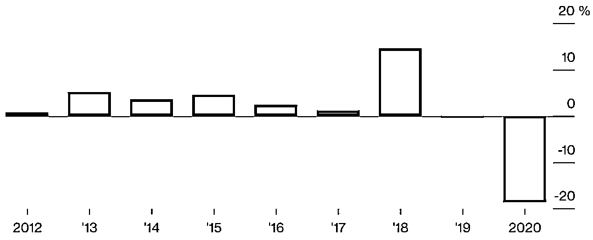
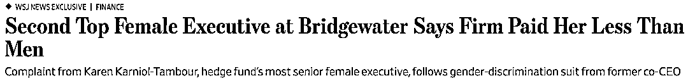

# 亏损、撤资和不安的员工：达里奥今年过的有点糟

> 原文：[`mp.weixin.qq.com/s?__biz=MzAxNTc0Mjg0Mg==&mid=2653305466&idx=1&sn=ec1d6af2040a478943bc5bb00b7e738a&chksm=802df86fb75a71798d16a67f4cbdafac6ba930a5870ddb6b64ef072a49d5738add8e100092cb&scene=27#wechat_redirect`](http://mp.weixin.qq.com/s?__biz=MzAxNTc0Mjg0Mg==&mid=2653305466&idx=1&sn=ec1d6af2040a478943bc5bb00b7e738a&chksm=802df86fb75a71798d16a67f4cbdafac6ba930a5870ddb6b64ef072a49d5738add8e100092cb&scene=27#wechat_redirect)

**全网 TOP 量化自媒体**

作者：Katherine Burton     编译：方的馒头

***1***

**实际上，情况非常糟糕**

以至于这位亿万富翁冒着失去他对冲基金之王头衔的风险。  

 达利奥旗下 AUM 1480 亿美元的桥水基金今年已经出现了巨额亏损。**截至今年 8 月，旗舰 Pure Alpha II 基金下跌了 18.6％。**这是桥水十年以来最严重的一次亏损，也是导致该桥水陷入新一轮一系列危机管理的首要原因。

Pure Alpha II，2020 年的收益是截止到八月

首先，桥水的计算机模型最初连续第二年误判了市场，然后，大客户开始出走。今年前 7 个月，投资者净撤资 35 亿美元。根据行业咨询人士预计，未来还会出现更多这样的情况。

如果这些还不够的话，戴利奥在一场与前员工的仲裁之争中败诉，与前任首席执行官长期不和，并已经裁掉了数十名员工。

对于 71 岁的达里奥来说，这是一个显著的转变。他长期以来一直以自己是世界经济、管理等领域的重要思想家而自豪。 

***2***

**滞后收益**

尽管市场动荡不安，桥水仍然对其地位以及为客户服务的能力充满信心。

“我们成为最大的对冲基金是有原因的”。达里奥在接受彭博电视台采访时说。“我们从未经历过明显的低迷，尽管都是好年景，但我们知道总有一天会到来。我们错过了疫情的趋势，这就是现实。同时他补充说到：“我们的运作方式与以往一样。” 

桥水表示，该公司有 45 项投资者承诺，其中许多在 10 亿美元左右，但没有具体说明这笔资金是进入高收费的 Pure Alpha 对冲基金还是低收费的长期基金产品。

但是从全球股票到黄金的资产在动荡中上涨的一年里，收益滞后是无法避免的。竞争对手包括 Caxton Associates 和 Brevan Howard 资产管理公司取得了两位数的收益。

随着市场崩盘，桥水在 3 月份降低了风险，并且在美联储推出前所未有的支持措施的情况下，其风险再次缓慢上升。因此，即使它正确地吹捧了诸如做多股票、购买黄金和押注日元兑美元等交易，但它也未能从自身的预见中获益。

这一错误使人想起了桥水去年 1 月份采取的做法，当时美联储主席鲍威尔暗示他将尽一切努力保持经济增长。桥水在 2018 年的收益为 14.6％，这主要得益于对 12 月市场崩盘的预测，但桥水未能将其投资组合转换为看涨的头寸，并在 2019 年前两个月损失了 5％以上。作为回应，它调整了自己的模型，以更好地应对范式转变。 

***3***

**固定模型**

虽然诸如文艺复兴技术（西蒙斯）之类的竞争对手使用大量数学量化方法，但达里奥的公司和财富都建立在这样的模型之上，即将经济学视为一门类似于永恒物理定律的学科。 前员工表示，达利奥的广泛形象分散了他对公司的注意力。他们说，他还拒绝更改计算机模型，包括添加其他公司标准的新型数据，例如跟踪油轮等。 

***4***

**近期现状**

今年，在全球各国央行为应对新冠肺炎疫情向市场注入大量流动性后，桥水的员工再次努力改变模型，这一次是为了应对前所未有的干预和世界主要经济体接近完全关闭的局面。他们花了一个多月的时间关闭他们认为在新环境下行不通的策略，并调整他们认为适用的策略。 **达里奥本人也会每周会花 70 个小时来处理这些问题，风险水平从大约 8 月份以来一直处于历史标准。**

***5***

**员工很紧张 **

然而，除了业绩问题之外，还有人事纠纷。前联合首席执行官 Eileen Murray 在 7 月份起诉桥水，理由是她的薪酬延期支付，并在围绕其离职计划的持续斗争中涉嫌性别歧视。这场纠纷让桥水感到不安，尤其是考虑到 Eileen Murray 在公司和整个金融行业的地位。 

据《华尔街日报》报道，研究部负责人 Karen Karniol-Tambour 也因薪酬不平等与桥水发生争执。这篇报道发表后，她在给员工和投资者的一封声明中说，她的问题与性别无关。 

在困难重重的情况下，桥水已经裁员数十人，称由于疫情，需要的员工减少了，并且预计未来客户数量会减少（尽管资产不一定会减少）。

两名年轻的基金经理 Lawrence Minicone 和 Zachary Squire 离开桥水，并计划创办自己的公司 Tekmerion CapitalManagement，这一仲裁案件也引起了员工的担忧。一个仲裁小组在 7 月份发现桥水以虚假借口对这对夫妇提起了窃取商业秘密的案件，以减缓他们的进展。 

***6***

**极端措施**

这场诉讼凸显了一些人所说的该公司对离职员工的极端做法。这些措施包括：任何离职的人，包括被解雇的人 two years unpaid gardening  ，在此期间，员工在接受新工作之前必须获得许可。还有针对高级投资官员的商业秘密协议。

这些合同可能非常严格，如果强制执行，可能会阻止员工在职业生涯的剩余时间里从事股票或外汇交易。根据前员工的估计，在桥水直接从事投资的 200 人中，约有四分之一的人会发现很难或不可能再从事金融方面的工作。

桥水在回答该问题时说，其目标是保护知识产权，支持员工离职后的职业生涯。 

今年对模式的改变最终可能会有收益——众所周知，尽管起初举步维艰，但桥水在经济低迷时期表现出色。虽然它在 2008 年金融危机期间损失了 20%，2010 年和 2011 年分别增长了 45%和 25%。在 2000 年的网络泡沫破裂中损失了 22%之后，它从 2002 年开始连续三年的收益率超过了 20%。

**加油桥水！加油达里奥！**

量化投资与机器学习微信公众号，是业内垂直于**Quant****、Fintech、AI、ML**等领域的**量化类主流自媒体。**公众号拥有来自**公募、私募、券商、期货、银行、保险、资管**等众多圈内**18W+**关注者。每日发布行业前沿研究成果和最新量化资讯。