# IOI 2020 落幕：中国队团体成绩第一！

> 原文：[`mp.weixin.qq.com/s?__biz=MzAxNTc0Mjg0Mg==&mid=2653305449&idx=1&sn=d51deae5743e75bb9f339fe7674036ac&chksm=802df87cb75a716a193a19f653d029a36790b300f882a4e4c01468af63d62d4b319f4fca530b&scene=27#wechat_redirect`](http://mp.weixin.qq.com/s?__biz=MzAxNTc0Mjg0Mg==&mid=2653305449&idx=1&sn=d51deae5743e75bb9f339fe7674036ac&chksm=802df87cb75a716a193a19f653d029a36790b300f882a4e4c01468af63d62d4b319f4fca530b&scene=27#wechat_redirect)

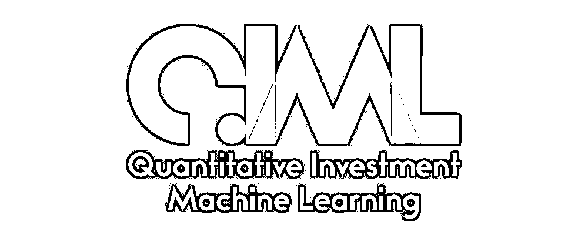

**全网 TOP 量化自媒体**

##### 边策 贾浩楠 发自 凹非寺 
量子位 报道 | 公众号 QbitAI

2020 年国际信息学奥赛（IOI 2020）完成了第二日比赛，四名中国队选手皆进入前十，分列 3~7 名，团队总成绩第一！

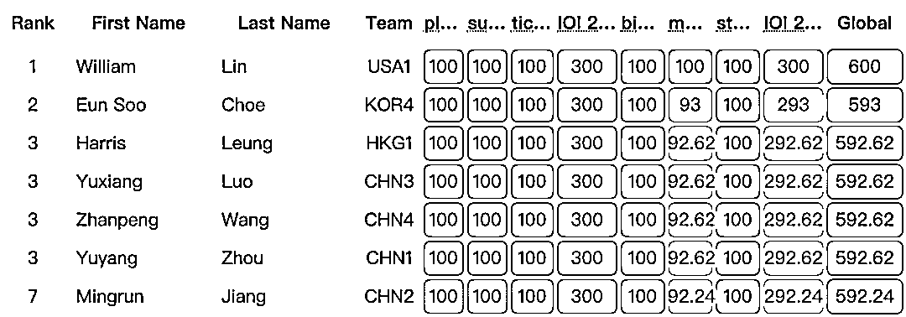

*   罗煜翔：来自宁波市镇海中学，总分 592.62，第 3 名
*   王展鹏：来自绍兴市第一中学，总分 592.62，第 3 名
*   周雨扬：来自绍兴市第一中学，总分 592.62，第 3 名
*   蒋明润：来自成都市第七中学，总分 592.24，第 7 名

今天在 IOI 2020 官网上公布的是初步成绩，接下来还会经历成绩审核等环节，若最终确认有效，这四名国家队选手将全部获得 IOI 金牌。

去年和前年的 IOI 冠军都被华人美国队选手拿走。今年也不例外，IOI 2020 第一名仍是一位美籍华人 William Lin。

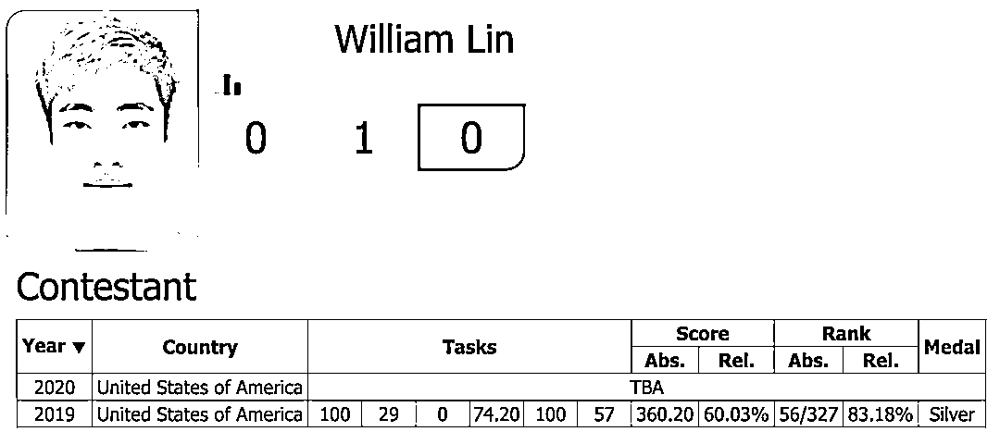

他在 2 天 6 道比赛题上全部拿到满分，以总分 600 分获得冠军，也是今年唯一一位满分选手。IOI 继 2015 年后再次出现满分成绩。William Lin 去年也曾参加过 IOI，并获得了银牌。

中国队去年在 IOI 上的成绩是三金一银，分别是 4、5、20、21 名，今年中国队成绩有了大幅提高。

***1***

**比赛内容**

今年由于受到新冠疫情影响，原本计划在新加坡举办的 IOI 转移到线上进行，且必须使用官方指定的虚拟机来运行程序。

IOI 2020 于 9 月 13 日开幕，比赛分别在 9 月 16 日和 9 月 19 日两天举行。根据 IOI 比赛规定，参赛选手需要在两个比赛日中，每日用 5 小时解决 3 道题目。

第一日考题为：

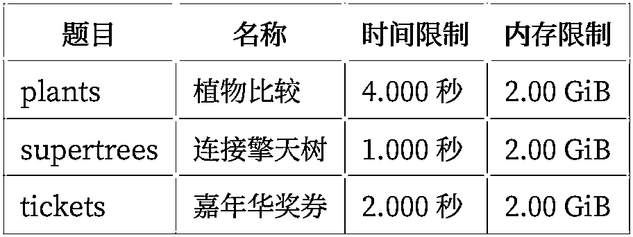

第二日考题为：

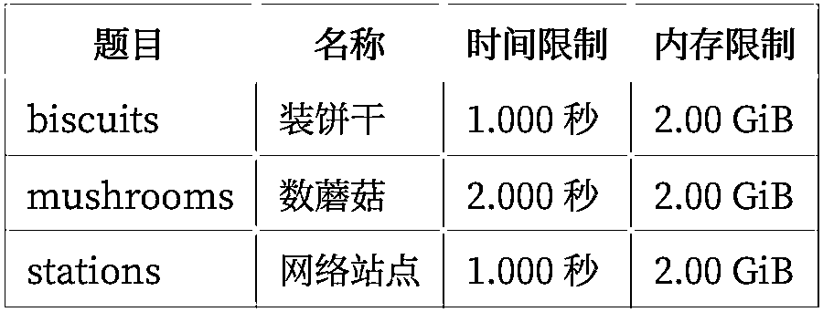

其中，“数蘑菇”问题是拉开前十选手排名的关键题目，在所有参赛选手中，只有第一名，也就是美国队的 William Lin 拿到了这道题的 100 分。

这道题具体是这样的：

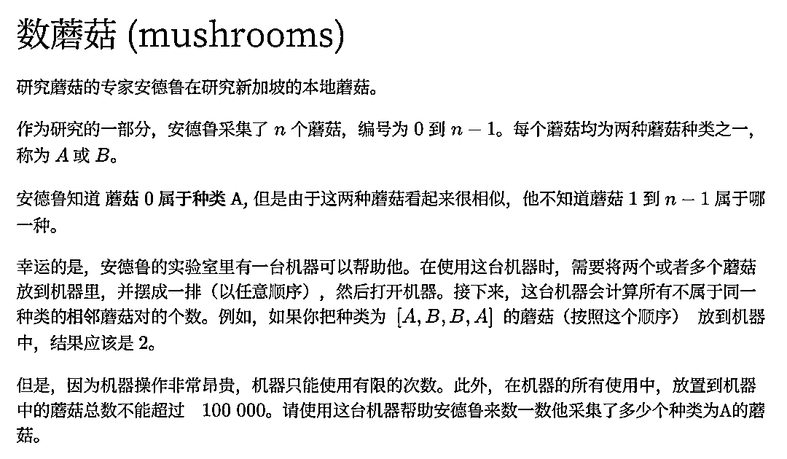

有兴趣的朋友可以尝试一个如何给这道题编程。

IOI 2020 的完整考题可以移步文末网址下载。

***2***

**IOI 中国队**

### **周雨扬**

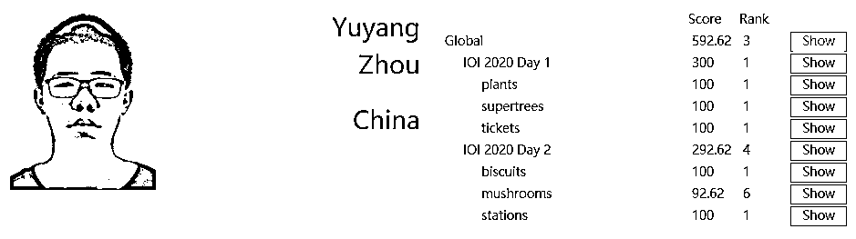

周雨扬，高中就读于信息学科竞赛强校绍兴一中。 

作为 IOI 中国队成员，拿下第三名的成绩，其实并不是周雨扬第一次“抛头露面”。

早在 2017 年 4 月，周雨扬与高中生们同场竞技，参加全国青少年信息学奥林匹克联赛浙江省队选拔赛。

比赛成绩一出，他就被北大预录取了，这时，他还在上初三。

今年的 7 月 20 日，37 届全国青少年信息学奥林匹克竞赛在广州落下帷幕，上高二的周雨扬以总分 625 分的成绩获得金牌第一名，正式锁定了北京大学保送资格。

同时，他也入选本次国际信息学奥林匹克竞赛国家集训队。

初三北大预录取，高二获得保送资格，周雨扬的成绩和实力，在“学霸”中，也算佼佼者了。

周雨扬在之前接受《绍兴在线》采访时说，搞信息学纯粹是出于兴趣。

小学四年级时，在鲁迅小学就读的他加入了学校的计算机兴趣小组，一开始就从编程学起。

“不喜欢打游戏，因为打不过别人。”后来越编越入迷，也越钻越深，“把一个难题做出来，特别开心。”他说。

老师绍兴一中信息学指导老师这样评价他：有坚强的意志力，也有超强的自制力，还能不断明晰自己的目标，并为之努力。

### **王展鹏**

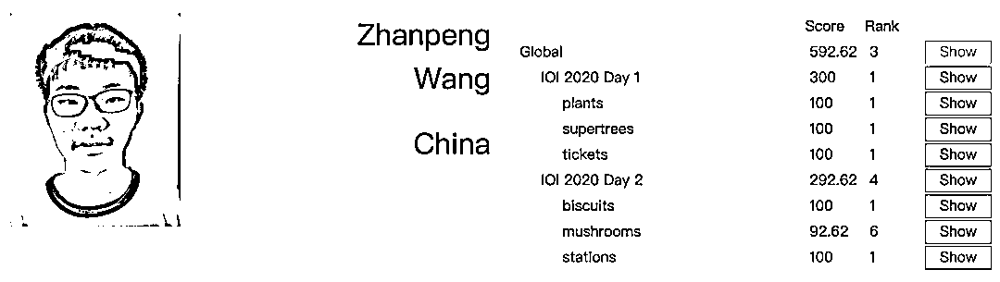

王展鹏，同样是绍兴一中学子，和周雨扬一样，在今年的 NOI 上一起入选国家队，并且还获得了 NOI 金牌第三名。 

###### △右二为王展鹏，图片来自 NOI 2020

还在上高二的王展鹏同样获得计算机学科人才培养一流水平的北京大学英才班入选资格。

有如此耀眼的成绩，王展鹏却极少接受采访或在其他场合谈及自己。

目前，能找的公开信息，也只有他在今年 NOI 上获得金牌第三名和去年 NOI 获得 32 名。

## **罗煜翔**

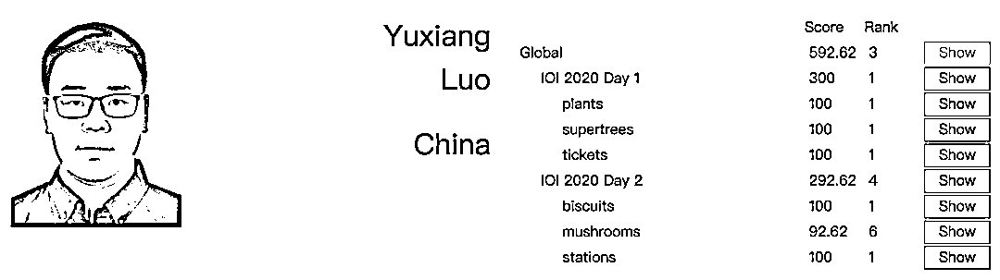

来自宁波镇海中学的罗煜翔同学，是一位“双科”国家队。

2018 年 11 月，还在上高一的罗煜翔同学，参加第 34 届数学奥林匹克决赛获金牌，并入选国家集训队大名单。

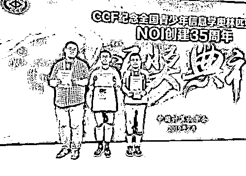

###### △左一为罗煜翔，图片来自 NOI 2019

时隔半年，这位大神又在另一学科——信息学奥林匹克竞赛中，杀入国家集训队。

今年的 NOI 2020，罗同学又一次进入国家队，并且在 IOI 上取得了优异成绩。

进入国家集训队，就意味着可以直接保送北京大学、清华大学等。

而镇海中学这位高二学生居然能 double，而且在不同的学科领域！普通的学霸见了他，可能都会惊叹吧。

根据罗煜翔所在的镇海中学校报的信息，罗煜翔初中就读于蛟川书院，初二的时候就显现出在数学上的天赋。

初二下学期加入校内的奥数竞赛队。当时，指导老师让大家回去做一套有关平面几何的奥赛数学题，只有初二的罗煜翔是当时唯一一个把这套题几乎都解出来的学生。

这套题其实非常难，队里还有很多高一高二的学生都解不出来。

罗煜翔自己则说：“要感谢《九章算术》把我带入数学王国，从此开启了我在数学世界的遨游。我最喜欢的读物就是数学书籍，我最崇拜的偶像是古今中外的伟大数学家，我最愉悦的事情是解数学难题。”

如此喜爱数学的罗煜翔同学，已经迈出了追求理想的第一步，2019 年第一次入选数学国家队时，他就已经被保送了北大数学系。

这次的代表信息学国家队出战，可能是罗同学拓展能力兴趣的一次新尝试吧。

## **蒋明润**

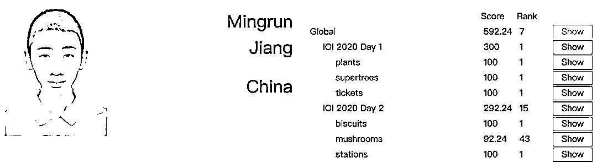

蒋明润，也是这次 NOI 中国队里唯一一个不是来自浙江的选手。

在此次第 37 届全国青少年信息学奥林匹克竞赛中，蒋明润以 583 的成绩获得金牌第 4 名。

根据成都七中官方的报道，蒋明润是继王小川、王修涵之后，该校信息竞赛队员第三次入选国家队。

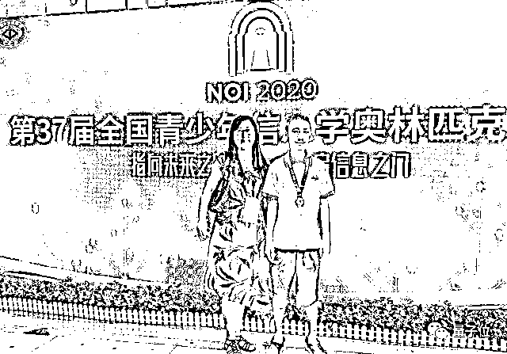

在高一时，在 NOI 2019 比赛中，他就获得 12 名的成绩。

初三时，他曾荣获 2017NOIP（全国青少年信息学奥林匹克联赛）提高组一等奖。

这一次这四位入选国家队的成员，其余三人都去了北大，只有蒋明润去了清华。

最后来一张 IOI 2020 国家队四位选手合影：

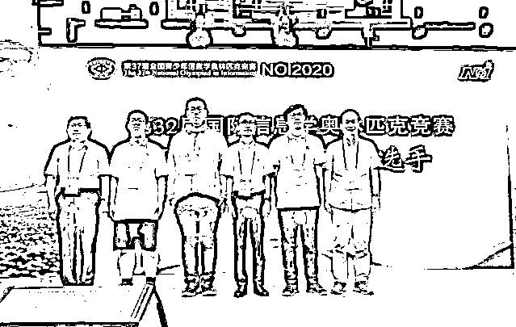

###### △左二起依次为周雨扬、罗煜翔、蒋明润、王展鹏

***3***

**IOI 金牌“圈子”**

IOI 金牌，是我们熟悉的不少国内互联网大佬、技术强人在成长经历中的“标配”。

比如来自成都七中、**搜狗 CEO 王小川**，1996 年因获得国际奥林匹克信息学竞赛金牌被报送清华大学计算机系。

还有**楼天城**，这位曾经百度曾经最年轻的 T10 级员工，一直致力于无人驾驶，离开百度后，创办了小马智行。

保送清华、江湖人称“楼教主”的楼天城，2004 年 5 月国家队选拔赛第一名，2004 年 9 月获得 IOI 金牌。

在学界，还有 2004 年，入选国家队获得第 6 届 IOI 金牌的**鬲融**，2004 年从河北省保送至清华大学计算机系，后进入“清华姚班”。

2008 年毕业后赴美国留学，并在普林斯顿大学攻读博士，后在微软研究院新英格兰分部做博士后，2015 年至今在杜克大学担任助理教授。

鬲融博士的研究方向是计算机科学近似算法，后来转到理论机器学习方向。

除了这些，从 IOI 金牌中出来的大佬还有旷视创始人唐文斌，宸境科技创始人、清华姚班漆子超，还有让唐文斌两顾家门的旷视人脸识别技术负责人周而进等等。

以上说到的大佬，都是 IOI 金牌，保送清华的。

清华姚班，也成了清华计算机和信息学科的最响亮的招牌。

但这两年，北大的“英才班”也越来越能打。

比如 2018 年拿下 IMO 金牌的 4 位中国选手中，除了李一笑，欧阳泽轩和王泽宇同样因为数学选择了北大。

2019 年在第 60 届 IMO 中斩获金牌的 6 位中国选手中，俞然枫、胡苏麟、黄嘉俊都先后进入了北大数学英才班。

今年，4 人中的 3 个全都选了北大，可以在计算机和数学英才班之间选择。

无论是北大英才班，还是清华姚班/智班，核心起点都是吸收全国最顶尖的数理人才，再配备最好的师资和教育，帮助他们在本科就能充分夯实基础、发掘潜力。

至少现在，清华姚班有了成果，北大数学也诞生黄金一代。

IOI 2020 排名 *https://ranking.ioi2020.sg/*

IOI 2020 考题下载 *https://ioi2020.sg/ioi-2020-task*

量化投资与机器学习微信公众号，是业内垂直于**Quant****、Fintech、AI、ML**等领域的**量化类主流自媒体。**公众号拥有来自**公募、私募、券商、期货、银行、保险、资管**等众多圈内**18W+**关注者。每日发布行业前沿研究成果和最新量化资讯。