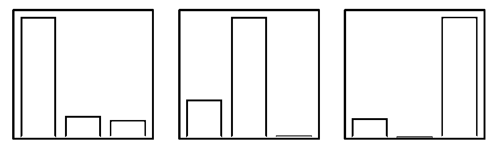

# 相关矩阵、特征、预测、股市！（附代码）

> 原文：[`mp.weixin.qq.com/s?__biz=MzAxNTc0Mjg0Mg==&mid=2653305415&idx=1&sn=2597c375714e78500b08e09fa10daac1&chksm=802df852b75a7144bd087cdb744fd5c0082b91a8c782d3a2d11034f59bb67767c7d515865832&scene=27#wechat_redirect`](http://mp.weixin.qq.com/s?__biz=MzAxNTc0Mjg0Mg==&mid=2653305415&idx=1&sn=2597c375714e78500b08e09fa10daac1&chksm=802df852b75a7144bd087cdb744fd5c0082b91a8c782d3a2d11034f59bb67767c7d515865832&scene=27#wechat_redirect)


**全网 TOP 量化自媒体**

***1***

**特征提取**

为了尽可能精确地描述给定的相关矩阵，我们将从中提取一系列特征。

从给定的相关矩阵中提取的特征：

*   相关系数分布（均值、标准差、分位数、最小值、最大值）。

*   方差百分比由 k-第一特征值和 Marchenko-Pastur 定律支持上限之上的特征值解释。

*   其条目的第一特征向量汇总统计信息（平均值、标准差、分位数、最小值、最大值）。

*   基于最短路径的最小生成树（MST）统计信息，例如节点的贴近度、中心度和平均最短路径长度。

*   同态相关系数（Cophenetic correlation）。

*   条件编号（Condition number）。

这些特征旨在捕捉相关矩阵的几个重要属性：

*   相关性（例如相关系数平均值、第一特征值）有多强。

*   相关性的多样性（例如，相关系数 std，第一特征向量 std）。

*   相关性结构的层次结构如何（例如，同态相关）。

*   系统的复杂程度和互联程度（例如，MST 中心度分位数和平均最短路径长度）。

```py
%matplotlib inline

import tensorflow as tf
from tensorflow.keras import layers
import numpy as np
import pandas as pd
from scipy.stats import rankdata
from scipy.cluster import hierarchy
from scipy.cluster.hierarchy import cophenet
from scipy.spatial.distance import squareform
import fastcluster
import networkx as nx
from statsmodels.stats.correlation_tools import corr_nearest
import matplotlib.pyplot as plt
from pprint import pprint
import warnings
warnings.filterwarnings("ignore") 
```

```py
def compute_mst_stats(corr):
    dist = (1 - corr) / 2
    G = nx.from_numpy_matrix(dist)
    mst = nx.minimum_spanning_tree(G)

    features = pd.Series()
    features['mst_avg_shortest'] = nx.average_shortest_path_length(mst)

    closeness_centrality = (pd
                            .Series(list(nx
                                         .closeness_centrality(mst)
                                         .values()))
                            .describe())
    for stat in closeness_centrality.index[1:]:
        features[f'mst_centrality_{stat}'] = closeness_centrality[stat]

    return features

def compute_features_from_correl(model_corr):
    n = model_corr.shape[0]
    a, b = np.triu_indices(n, k=1)

    features = pd.Series()
    coefficients = model_corr[a, b].flatten()

    coeffs = pd.Series(coefficients)
    coeffs_stats = coeffs.describe()
    for stat in coeffs_stats.index[1:]:
        features[f'coeffs_{stat}'] = coeffs_stats[stat]
    features['coeffs_1%'] = coeffs.quantile(q=0.01)
    features['coeffs_99%'] = coeffs.quantile(q=0.99)
    features['coeffs_10%'] = coeffs.quantile(q=0.1)
    features['coeffs_90%'] = coeffs.quantile(q=0.9)

    # eigenvals
    eigenvals, eigenvecs = np.linalg.eig(model_corr)
    permutation = np.argsort(eigenvals)[::-1]
    eigenvals = eigenvals[permutation]
    eigenvecs = eigenvecs[:, permutation]

    pf_vector = eigenvecs[:, np.argmax(eigenvals)]
    if len(pf_vector[pf_vector < 0]) > len(pf_vector[pf_vector > 0]):
        pf_vector = -pf_vector

    features['varex_eig1'] = float(eigenvals[0] / sum(eigenvals))
    features['varex_eig_top5'] = (float(sum(eigenvals[:5])) /
                                  float(sum(eigenvals)))
    features['varex_eig_top30'] = (float(sum(eigenvals[:30])) /
                                   float(sum(eigenvals)))
    # Marcenko-Pastur (RMT)
    T, N = 252, n
    MP_cutoff = (1 + np.sqrt(N / T))**2
    # variance explained by eigenvals outside of the MP distribution
    features['varex_eig_MP'] = (
        float(sum([e for e in eigenvals if e > MP_cutoff])) /
        float(sum(eigenvals)))

    # determinant
    features['determinant'] = np.prod(eigenvals)

    # condition number
    features['condition_number'] = abs(eigenvals[0]) / abs(eigenvals[-1])

    # stats of the first eigenvector entries
    pf_stats = pd.Series(pf_vector).describe()
    if pf_stats['mean'] < 1e-5:
        return None
    for stat in pf_stats.index[1:]:
        features[f'pf_{stat}'] = float(pf_stats[stat])

    # stats on the MST
    features = pd.concat([features, compute_mst_stats(model_corr)],
                         axis=0)

    # stats on the linkage
    dist = np.sqrt(2 * (1 - model_corr))
    for algo in ['ward', 'single', 'complete', 'average']:
        Z = fastcluster.linkage(dist[a, b], method=algo)
        features[f'coph_corr_{algo}'] = cophenet(Z, dist[a, b])[0]

    return features.sort_index() 
```

```py
def compute_dataset_features(mats):
    all_features = []
    for i in range(mats.shape[0]):
        model_corr = mats[i, :, :]

        features = compute_features_from_correl(model_corr)

        if features is not None:
            all_features.append(features)

    return pd.concat(all_features, axis=1).T 
```

```py
empirical_matrices = np.load('empirical_matrices.npy')

empirical_features = compute_dataset_features(empirical_matrices)

empirical_features.describe() 
```


我们保存特征以供未来使用。

```py
empirical_features.to_hdf('empirical_features.h5', key='features') 
```

关于特征上的一些 EDA。绘制它们的分布图：

```py
plt.figure(figsize=(16, 32))
for idx, col in enumerate(empirical_features.columns):
    plt.subplot(9, 4, idx + 1)
    qlow = empirical_features[col].quantile(0.01)
    qhigh = empirical_features[col].quantile(0.99)
    plt.hist(empirical_features[col]
             .clip(lower=qlow, upper=qhigh)
             .replace(qlow, np.nan)
             .replace(qhigh, np.nan),
             bins=100, log=False)
    plt.axvline(x=empirical_features[col].mean(), color='r',
                linestyle='dashed', linewidth=2)
    plt.title(col)
plt.show() 
```


我们注意到相关系数分布中的两种模式：数据中可能存在两种市场机制；在方差说明的分布中也是如此（因为由第一个主成分分析 PCA 解释的方差百分比与平均（绝对）相关性是相同的）。这两种模式也可以在 MST 统计信息分布中找到。条件编号和行列式的分布严重偏右（有一些离群值）。如果同时使用基本线性回归，则要注意。

同样，由于以下原因，许多这些变量必须高度相关：

1、它们的构建（相似的汇总统计量，例如不同的分位数）。

2、PSD 矩阵和一般线性代数（例如主成分分析 PCA 和平均相关性，行列式和条件编码）的数学关系式。

特征之间潜在的高度相关性可能使其难以拟合和解释回归模型：

*   在存在多重共线性的情况下，估算更加困难，

*   特征重要性更加复杂，因为重要性在本质上相同变量的许多噪音副本中被稀释。

我们展示以下特征的重新排序的相关矩阵：

```py
n = len(empirical_features.columns)
a, b = np.triu_indices(n, k=1)

plt.figure(figsize=(18, 5))
plt.subplot(1, 2, 1)
corr_features = empirical_features.corr(method='spearman')
dist = (1 - corr_features).values
Z = fastcluster.linkage(dist[a, b], method='ward')
permutation = hierarchy.leaves_list(
    hierarchy.optimal_leaf_ordering(Z, dist[a, b]))

sorted_corr_features = empirical_features[
    empirical_features.columns[permutation]].corr(method='spearman')
plt.pcolormesh(sorted_corr_features)
plt.colorbar()
plt.title(f'Correlation between the {n} features', fontsize=16)
plt.subplot(1, 2, 2)
corr_features = (empirical_features
                 .corr(method='spearman')
                 .abs())
dist = (1 - corr_features).values
Z = fastcluster.linkage(dist[a, b], method='ward')
permutation = hierarchy.leaves_list(
    hierarchy.optimal_leaf_ordering(Z, dist[a, b]))

sorted_corr_features = (empirical_features[
    empirical_features.columns[permutation]]
                        .corr(method='spearman')
                        .abs())
plt.pcolormesh(sorted_corr_features)
plt.colorbar()
plt.title(f'Absolute correlation between the {n} features', fontsize=16)
plt.show() 
```


```py
nb_clusters = 4

dist = 1 - sorted_corr_features.values
dim = len(dist)
tri_a, tri_b = np.triu_indices(dim, k=1)
Z = fastcluster.linkage(dist[tri_a, tri_b], method='ward')
clustering_inds = hierarchy.fcluster(Z, nb_clusters,
                                     criterion='maxclust')
clusters = {i: [] for i in range(min(clustering_inds),
                                 max(clustering_inds) + 1)}
for i, v in enumerate(clustering_inds):
    clusters[v].append(i)

plt.figure(figsize=(5, 5))
plt.pcolormesh(sorted_corr_features)
for cluster_id, cluster in clusters.items():
    xmin, xmax = min(cluster), max(cluster)
    ymin, ymax = min(cluster), max(cluster)

    plt.axvline(x=xmin,
                ymin=ymin / dim, ymax=(ymax + 1) / dim,
                color='r')
    plt.axvline(x=xmax + 1,
                ymin=ymin / dim, ymax=(ymax + 1) / dim,
                color='r')
    plt.axhline(y=ymin,
                xmin=xmin / dim, xmax=(xmax + 1) / dim,
                color='r')
    plt.axhline(y=ymax + 1,
                xmin=xmin / dim, xmax=(xmax + 1) / dim,
                color='r')
plt.show()

for i, cluster in enumerate(clusters):
    print('Cluster', i + 1)
    cluster_members = [sorted_corr_features.index[ind]
                       for ind in clusters[cluster]]
    print('Cluster size:', len(cluster_members))
    pprint(cluster_members)
    print() 
```


```py
Cluster 1
Cluster size: 9
['mst_centrality_min',
 'mst_centrality_25%',
 'mst_centrality_50%',
 'mst_centrality_mean',
 'mst_avg_shortest',
 'mst_centrality_max',
 'mst_centrality_75%',
 'mst_centrality_std',
 'pf_max']

Cluster 2
Cluster size: 15
['pf_50%',
 'coeffs_10%',
 'coeffs_25%',
 'coeffs_50%',
 'coeffs_mean',
 'varex_eig1',
 'coeffs_75%',
 'coeffs_90%',
 'determinant',
 'varex_eig_top30',
 'varex_eig_top5',
 'varex_eig_MP',
 'coeffs_99%',
 'condition_number',
 'coeffs_max']

Cluster 3
Cluster size: 3
['coph_corr_complete', 'coeffs_std', 'coph_corr_ward']

Cluster 4
Cluster size: 9
['coeffs_min',
 'pf_mean',
 'pf_std',
 'coeffs_1%',
 'pf_min',
 'pf_75%',
 'pf_25%',
 'coph_corr_average',
 'coph_corr_single'] 
```

我们还快速地可视化了 36 * 35/2 = 630 个二元经验 copulas，并在下面报告了变量之间的一些有趣关系：

```py
pairs = [('varex_eig1', 'varex_eig_top5'),
         ('varex_eig_MP', 'varex_eig_top5'),
         ('varex_eig_top5', 'varex_eig_top30'),
         ('pf_std', 'varex_eig_top5'),
         ('pf_std', 'pf_mean'),
         ('mst_centrality_mean', 'mst_centrality_std'),
         ('mst_avg_shortest', 'mst_centrality_25%'),
         ('mst_avg_shortest', 'mst_centrality_mean'),
         ('mst_avg_shortest', 'pf_max'),
         ('determinant', 'varex_eig_top30'),
         ('determinant', 'pf_std'),
         ('determinant', 'pf_mean'),
         ('coph_corr_single', 'pf_mean'),
         ('coph_corr_single', 'pf_std'),
         ('coph_corr_single', 'varex_eig_top5'),
         ('coph_corr_average', 'coph_corr_complete'),
         ('coph_corr_average', 'coph_corr_single'),
         ('coph_corr_average', 'coph_corr_ward'),
         ('coph_corr_average', 'pf_25%'),
         ('coph_corr_average', 'pf_75%'),
         ('coph_corr_average', 'pf_std'),
         ('coph_corr_average', 'pf_mean'),
         ('coph_corr_average', 'varex_eig1'),
         ('condition_number', 'determinant'),
         ('condition_number', 'mst_avg_shortest'),
         ('condition_number', 'mst_centrality_25%'),
         ('condition_number', 'pf_mean'),
         ('condition_number', 'varex_eig1'),
         ('coeffs_std', 'coph_corr_average'),
         ('coeffs_std', 'coph_corr_single'),
         ('coeffs_std', 'determinant'),
         ('coeffs_std', 'pf_25%'),
         ('coeffs_std', 'pf_75%'),
         ('coeffs_std', 'pf_std'),
         ('coeffs_mean', 'varex_eig1'),
         ('coeffs_90%', 'determinant'),
         ('coeffs_10%', 'coeffs_25%'),
         ('coeffs_25%', 'coeffs_50%'),
         ('coeffs_50%', 'coeffs_75%'),
         ('coeffs_75%', 'coeffs_90%'),
         ('coeffs_10%', 'coeffs_90%'),
         ('coeffs_50%', 'coeffs_std'),
         ('coeffs_50%', 'pf_mean'),
         ('coeffs_50%', 'pf_std'),
         ('coeffs_75%', 'coph_corr_complete'),
         ('coeffs_75%', 'coph_corr_ward'),
         ('coeffs_75%', 'pf_mean'),
         ('coeffs_1%', 'coph_corr_average'),
         ('coeffs_1%', 'coph_corr_complete'),
         ('coeffs_1%', 'coph_corr_single'),
         ('coeffs_1%', 'coph_corr_ward'),
         ('coeffs_1%', 'pf_25%'),
         ('coeffs_1%', 'pf_75%'),
         ('coeffs_1%', 'pf_std'),
         ('coeffs_1%', 'pf_mean'),
         ('coeffs_1%', 'coeffs_min'),]

plt.figure(figsize=(18, 66))
for idx, (var1, var2) in enumerate(pairs):
    plt.subplot(14, 4, idx + 1)
    rk1 = rankdata(empirical_features[var1])
    rk1 /= len(rk1)
    rk2 = rankdata(empirical_features[var2])
    rk2 /= len(rk2)
    plt.hist2d(rk1, rk2, bins=40)
    plt.xlabel(var1, fontsize=16)
    plt.ylabel(var2, fontsize=16)
plt.show() 
```


***2***

**正文**

在今天的文章中，我们将讨论下面两个问题：

1、研究不同机制下相关矩阵特征的分布。

2、是否只能根据相关矩阵特征来确定市场机制。

仅从相关矩阵的特征，我们可以相当容易地确定正在发生哪种市场机制。

这个结果也很有趣：尽管抛弃了预期收益和波动率信息，我们仍然能够找到相关矩阵特征和市场机制之间的良好映射。有必要将其与其他甚至更复杂的市场机制定义进行比较。以及在其他市场上也是如此。

我们发现：

*   **feat1 ='varex_eig_MP'**

*   **feat2 ='coph_corr_single'**

是最重要的（低相关性对）特征，能够区分“回升”、“压力”、“正常” 3 个类别。

甚至有可能只用这两个模型来拟合一个模型来：

```py
pairs = [('varex_eig1', 'varex_eig_top5'),
%matplotlib inline

from multiprocessing import Pool
import tqdm
import numpy as np
import pandas as pd
from scipy.cluster import hierarchy
from scipy.cluster.hierarchy import cophenet
from sklearn.model_selection import train_test_split
from sklearn.ensemble import RandomForestClassifier
from sklearn.metrics import confusion_matrix
import fastcluster
import networkx as nx
import shap
import matplotlib.pyplot as plt
import warnings
warnings.filterwarnings("ignore") 
```

```py
def compute_mst_stats(corr):
    dist = (1 - corr) / 2
    G = nx.from_numpy_matrix(dist)
    mst = nx.minimum_spanning_tree(G)

    features = pd.Series()
    features['mst_avg_shortest'] = nx.average_shortest_path_length(mst)

    closeness_centrality = (pd
                            .Series(list(nx
                                         .closeness_centrality(mst)
                                         .values()))
                            .describe())
    for stat in closeness_centrality.index[1:]:
        features[f'mst_centrality_{stat}'] = closeness_centrality[stat]

    return features

def compute_intravar_clusters(model_corr, Z, nb_clusters=5):
    clustering_inds = hierarchy.fcluster(Z, nb_clusters,
                                         criterion='maxclust')
    clusters = {i: [] for i in range(min(clustering_inds),
                                     max(clustering_inds) + 1)}
    for i, v in enumerate(clustering_inds):
        clusters[v].append(i)

    total_var = 0
    for cluster in clusters:
        sub_corr = model_corr[clusters[cluster], :][:, clusters[cluster]]
        sa, sb = np.triu_indices(sub_corr.shape[0], k=1)
        mean_corr = sub_corr[sa, sb].mean()
        cluster_var = sum(
            [(sub_corr[i, j] - mean_corr)**2 for i in range(len(sub_corr))
             for j in range(i + 1, len(sub_corr))])
        total_var += cluster_var

    return total_var

def compute_features_from_correl(model_corr):
    n = len(model_corr)
    a, b = np.triu_indices(n, k=1)

    features = pd.Series()
    coefficients = model_corr[a, b].flatten()

    coeffs = pd.Series(coefficients)
    coeffs_stats = coeffs.describe()
    for stat in coeffs_stats.index[1:]:
        features[f'coeffs_{stat}'] = coeffs_stats[stat]
    features['coeffs_1%'] = coeffs.quantile(q=0.01)
    features['coeffs_99%'] = coeffs.quantile(q=0.99)
    features['coeffs_10%'] = coeffs.quantile(q=0.1)
    features['coeffs_90%'] = coeffs.quantile(q=0.9)
    features['coeffs_99-90'] = features['coeffs_99%'] - features['coeffs_90%']
    features['coeffs_10-1'] = features['coeffs_10%'] - features['coeffs_1%']

    # eigenvals
    eigenvals, eigenvecs = np.linalg.eig(model_corr)
    permutation = np.argsort(eigenvals)[::-1]
    eigenvals = eigenvals[permutation]
    eigenvecs = eigenvecs[:, permutation]

    pf_vector = eigenvecs[:, np.argmax(eigenvals)]
    if len(pf_vector[pf_vector < 0]) > len(pf_vector[pf_vector > 0]):
        pf_vector = -pf_vector

    features['varex_eig1'] = float(eigenvals[0] / sum(eigenvals))
    features['varex_eig_top5'] = (float(sum(eigenvals[:5])) /
        float(sum(eigenvals)))
    features['varex_eig_top30'] = (float(sum(eigenvals[:30])) /
        float(sum(eigenvals)))
    features['varex_5-1'] = (features['varex_eig_top5'] -
        features['varex_eig1'])
    features['varex_30-5'] = (features['varex_eig_top30'] -
        features['varex_eig_top5'])
    # Marcenko-Pastur (RMT)
    T, N = 252, n
    MP_cutoff = (1 + np.sqrt(N / T))**2
    # variance explained by eigenvals outside of the MP distribution
    features['varex_eig_MP'] = (
        float(sum([e for e in eigenvals if e > MP_cutoff])) /
        float(sum(eigenvals)))

    # determinant
    features['determinant'] = np.prod(eigenvals)

    # condition number
    features['condition_number'] = abs(eigenvals[0]) / abs(eigenvals[-1])

    # stats of the first eigenvector entries
    pf_stats = pd.Series(pf_vector).describe()
    for stat in pf_stats.index[1:]:
        features[f'pf_{stat}'] = float(pf_stats[stat])

    # stats on the MST
    features = pd.concat([features, compute_mst_stats(model_corr)],
                         axis=0)

    # stats on the linkage
    dist = np.sqrt(2 * (1 - model_corr))
    for algo in ['ward', 'single', 'complete', 'average']:
        Z = fastcluster.linkage(dist[a, b], method=algo)
        features[f'coph_corr_{algo}'] = cophenet(Z, dist[a, b])[0]

    # stats on the clusters
    Z = fastcluster.linkage(dist[a, b], method='ward')
    features['cl_intravar_5'] = compute_intravar_clusters(
        model_corr, Z, nb_clusters=5)
    features['cl_intravar_10'] = compute_intravar_clusters(
        model_corr, Z, nb_clusters=10)
    features['cl_intravar_25'] = compute_intravar_clusters(
        model_corr, Z, nb_clusters=25)
    features['cl_intravar_5-10'] = (
        features['cl_intravar_5'] - features['cl_intravar_10'])
    features['cl_intravar_10-25'] = (
        features['cl_intravar_10'] - features['cl_intravar_25'])

    return features.sort_index() 
```

```py
def compute_dataset_features(mats):
    all_features = []
    for i in range(mats.shape[0]):
        model_corr = mats[i, :, :]

        features = compute_features_from_correl(model_corr)

        if features is not None:
            all_features.append(features)

    return pd.concat(all_features, axis=1).T 
```

```py
def compute_dataset_features__par(mats):
    p = Pool(3)
    all_features = p.imap(compute_features_from_correl,
                          tqdm.tqdm([mats[i, :, :]
                                     for i in range(mats.shape[0])]))
    p.close()
    p.join()

    return pd.concat(all_features, axis=1).T 
```

```py
regimes = ['stressed', 'normal', 'rally']
regime_features = {}
for regime in regimes:
    corr_matrices = np.load(f'{regime}_matrices.npy')

    plt.figure(figsize=(16, 16))
    for i in range(16):
        corr = corr_matrices[i, :, :]
        plt.subplot(4, 4, i + 1)
        plt.pcolormesh(corr)
    plt.show()

    corr_features = compute_dataset_features__par(corr_matrices)

    regime_features[regime] = corr_features.astype(float) 
```

压力型相关矩阵：


正常型相关矩阵：


反弹型相关矩阵：


我们保存特征以供未来使用。

```py
for regime in regimes:
    regime_features[regime].to_hdf(
        f'regime_{regime}_features.h5', key='features') 
```

```py
regimes = ['stressed', 'normal', 'rally']
regime_features = {}
for regime in regimes:
    regime_features[regime] = pd.read_hdf(f'regime_{regime}_features.h5') 
```

关于特征的一些探索性数据分析。绘制它们的分布图：

```py
colors = ['r', 'b', 'g']
plt.figure(figsize=(16, 40))
for idx, col in enumerate(regime_features['stressed'].columns):
    plt.subplot(12, 4, idx + 1)
    for ic, regime in enumerate(['stressed', 'normal', 'rally']):
        qlow = regime_features[regime][col].quantile(0.01)
        qhigh = regime_features[regime][col].quantile(0.99)
        plt.hist(regime_features[regime][col]
                 .clip(lower=qlow, upper=qhigh)
                 .replace(qlow, np.nan)
                 .replace(qhigh, np.nan),
                 bins=100, log=False, color=colors[ic], alpha=0.5)
        plt.axvline(x=regime_features[regime][col].mean(), color=colors[ic],
                    linestyle='dashed', linewidth=2)
    plt.title(col)
    plt.legend(regimes)
plt.show() 
```


我们可以观察到，对于许多特征，受压力的市场机制具有非常不同的分布形状。例如，由几个最主要的主成分解释的方差对于压力大的情况要比正常和反弹状态下要高得多。在压力状态下，绝对平均相关性较高（第一特征值），但行业之间和行业内部的相关性也较高。这意味着，在压力大的情况下，相关性的层次结构和相关的群集没有得到很好的定义。这可以从同态相关系数的分布中看出：在压力状态下，它们的定位值比在反弹和正常情况下（分布非常相似）的值低。也可以从 varex_30-5 的分布中观测到 （由 30 个因素和 5 个因素解释的方差差异）：在压力较大的情况下，有 30 个因子解释的方差并不比 5 个因子解释的多，而在反弹情况下（在某种程度上，在正常情况下）有 30 个因子解释的数据比前 5 个主成分解释要好得多。

我们还可以注意到，在压力状态下，条件编码很高（行列式接近 0）：基于协方差（相关性）矩阵的逆的配置方法可能会失败。在某种程度上，正常状态下也是这种情况，而与反弹状态相关联的相关矩阵条件良好（更容易逆）。但是，在反弹机制中，适当的多元化并不像在压力机制中那样重要：多元化可能会在最需要的时候失败。

基于这些快速观察，我们希望可以轻松获得良好的分类器（压力型、正常型、反弹型）。应力状态类别应该非常容易地分离，因为相关的特征分布是局部的，与正常的和集中的特征分布相距很远。对于后者，它们的支持强烈重叠，有时它们共享相同的模式，即对于分类器而言，将它们分开会更加困难。“误差解释了前 5 名，MP，30 名”的特征应该是有助于这些“反弹”和“正常”类的。

总结一下：

*   我们进行了快速的特征分析预分类阶段。

*   获得的主要见解：分类问题不应该很难，我们可以猜测。

```py
- variance explained,
  - cophenetic correlation coefficient,
  - mean correlation,
  - and to some extent condition number, first eigenvector
```

应该是对分类器有用的特征，而：

```py
 - clusters intra-variance,
  - minimum spanning tree centrality stats
```

对于分类器应该几乎没有用。

***2***

**我们能否建立一个好的分类器？**

让我们使用 Scikit-Learn 做一个基本的随机森林，而无需任何（微调）调整。

```py
for regime in regimes:
    regime_features[regime]['target'] = regime

data = pd.concat([regime_features[regime] for regime in regimes], axis=0)
data = data.reset_index(drop=True) 
```

```py
X_train, X_test, y_train, y_test = train_test_split(
    data.loc[:, data.columns != 'target'], data['target'],
    test_size=0.2, random_state=13) 
```

```py
clf = RandomForestClassifier(random_state=42)
clf.fit(X_train, y_train)

print('Accuracy on train set:', clf.score(X_train, y_train))
print('Accuracy on test set:', clf.score(X_test, y_test)) 
```

```py
Accuracy on train set: 1.0
Accuracy on test set: 0.802944035550618 
```

```py
labels = ['stressed', 'normal', 'rally']
confusion_mat = confusion_matrix(
    y_test, clf.predict(X_test), labels=labels) 
```

```py
def plot_confusion_matrix(cm,
                          target_names,
                          title='Confusion matrix',
                          cmap=None,
                          normalize=True):
    import itertools

    accuracy = np.trace(cm) / np.sum(cm).astype('float')

    if cmap is None:
        cmap = plt.get_cmap('Blues')

    plt.figure(figsize=(8, 6))
    plt.imshow(cm, interpolation='nearest', cmap=cmap)
    plt.title(title)
    plt.colorbar()

    if target_names is not None:
        tick_marks = np.arange(len(target_names))
        plt.xticks(tick_marks, target_names, rotation=45)
        plt.yticks(tick_marks, target_names)

    if normalize:
        cm = cm.astype('float') / cm.sum(axis=1)[:, np.newaxis]

    thresh = cm.max() / 1.5 if normalize else cm.max() / 2
    for i, j in itertools.product(range(cm.shape[0]), range(cm.shape[1])):
        if normalize:
            plt.text(j, i, "{:0.2f}".format(cm[i, j]),
                     horizontalalignment="center",
                     color="white" if cm[i, j] > thresh else "black")
        else:
            plt.text(j, i, "{:,}".format(cm[i, j]),
                     horizontalalignment="center",
                     color="white" if cm[i, j] > thresh else "black")

    plt.tight_layout()
    plt.ylabel('True label')
    plt.xlabel('Predicted label\naccuracy={:0.2f}'.format(accuracy))
    plt.show() 
```

```py
plot_confusion_matrix(confusion_mat, labels) 
```


混淆矩阵实质上给出了正确和错误答案的频率。但是，该模型可能是正确的，但置信度较低。 

让我们显示模型在测试集上的平均置信度，以给定的预测类为条件（但不以正确性为条件）。

```py
proba = clf.predict_proba(X_test)

labels = ['normal', 'rally', 'stressed']
plt.figure(figsize=(18, 5))
for id_class, cls in enumerate(labels):
    plt.subplot(1, 3, id_class + 1)
    x = proba[proba.argmax(axis=1) == id_class]
    print(f'Number of {cls} data-points:\t {x.shape[0]}')
    plt.bar(labels, x.mean(axis=0),
        color=['blue', 'green', 'red'])
    plt.title(
        f'Average classifier confidence given class = {cls}')
plt.show() 
```

```py
Number of normal data-points:	 4215
Number of rally data-points:	 6213
Number of stressed data-points:	 5772  f'Average classifier confidence given class = {cls}')
plt.show() 
```


我们可以观测到，当模型预测“压力”类别时，平均而言，它比预测另一个类别时更有信心。此外，“反弹”类与“压力”类之间没有太多的可能。模型的大多数不确定性都在“反弹”和“正常”之间，并且在某种程度上也在“压力”和“正常”之间。

我们还检查了模型在测试集上的平均置信度，这次以给定的预测类和正确性为条件：

```py
proba = clf.predict_proba(X_test)

labels = ['normal', 'rally', 'stressed']
str2int = {s: idc for idc, s in enumerate(labels)}
plt.figure(figsize=(18, 5))
for id_class, cls in enumerate(labels):
    plt.subplot(1, 3, id_class + 1)
    majority_class = proba.argmax(axis=1) == id_class
    correct_class = (proba.argmax(axis=1) ==
                     [str2int[y] for y in y_test])
    x = proba[majority_class & correct_class]
    print(f'Number of {cls} data-points:\t {x.shape[0]}')
    plt.bar(labels, x.mean(axis=0),
        color=['blue', 'green', 'red'])
    plt.title(
        f'Average confidence given class = {cls} & correct')
plt.show() 
```

```py
Number of normal data-points:	 3372
Number of rally data-points:	 4853
Number of stressed data-points:	 4984
```



不出所料，压力大的机制最容易分类。大多数困惑是在“正常”类别上。这并不意外，因为 

1、通常的市场状态会向更极端的状态过渡（反弹或受压）。

2、这些类别从一开始就不是非常明确的，可能是一些被认为是错误的预测实际上是正确的。

出于后一个原因，我们还定义了与相关矩阵相对应的数据子集，其中分类器具有较高的置信度（高于 90％），即数据点位于决策边界内。

我们将检查在整个训练和测试数据集上发现的结果/见解在其相应的高置信度子集上是否也稳定。如果不是这种情况，则可能意味着结果/见解基本上是由决策边界上的数据点驱动的（接近的点可以具有不同的类别；模型在那些区域中的置信度通常较低），其各自的基本事实类别不一定是正确的。

```py
def get_high_confidence(X, y):
    pred = clf.predict_proba(X)
    high_confidence_features = X.iloc[pred.max(axis=1) > 0.90]
    high_confidence_labels = y.iloc[pred.max(axis=1) > 0.90]

    return high_confidence_features, high_confidence_labels 
```

```py
def get_high_confidence(X, y):
    pred = cfeatures_train, labels_train = get_high_confidence(X_train, y_train) 
```

```py
labels_train.value_counts() 
```

```py
stressed    15943
rally       11564
normal       7848
Name: target, dtype: int64 
```

```py
features_test, labels_test = get_high_confidence(X_test, y_test) 
```

```py
labels_test.value_counts() 
```

```py
stressed    2739
normal      1524
rally        928
Name: target, dtype: int64 
```

```py
clf = RandomForestClassifier(random_state=42)
clf.fit(X_train, y_train)

print('Accuracy on test set:', round(clf.score(X_test, y_test), 2))
print('Accuracy on test set when model has high confidence:',
      round(clf.score(features_test, labels_test), 2)) 
```

```py
Accuracy on test set: 0.8
Accuracy on test set when model has high confidence: 0.99 
```

***3***

**此模型有哪些相关特征？**

```py
def display_shap_importance(X, X_high_confidence, sample_type='train'):
    height = 10
    width = 20
    plt.figure(figsize=(height, width))
    plt.subplot(1, 2, 1)
    # shap on the whole dataset
    explainer = shap.TreeExplainer(clf)
    shap_values = explainer.shap_values(X, approximate=True)
    shap.summary_plot(shap_values, X,
                      plot_type="bar",
                      class_names=['normal', 'rally', 'stressed'],
                      plot_size=(width, height), show=False)
    plt.title(f'Whole {sample_type} dataset', fontsize=18)
    plt.subplot(1, 2, 2)
    # shap on the high confidence dataset
    explainer = shap.TreeExplainer(clf)
    shap_values = explainer.shap_values(X_high_confidence, approximate=True)
    shap.summary_plot(shap_values, X_high_confidence,
                      plot_type="bar",
                      class_names=['normal', 'rally', 'stressed'],
                      plot_size=(width, height), show=False)
    plt.title(f'High confidence predictions on {sample_type} dataset',
    fontsize=18)
    plt.show() 
```

```py
display_shap_importance(X_train, features_train) 
```


```py
display_shap_importance(X_test, features_test, sample_type='test') 
```


**备注：**我们可以注意到，在所有训练/测试（子）数据集上，特征 varex_eig_MP 和 varex_eig_top30 始终位于顶部，即，由第一个 MP（Marchenko-Pastur 切割）和前 30 个主成分解释的方差百分比。我们可以注意到，他们对“反弹”类的影响最大，其次是对“压力”类的影响。这两个特征对“正常”类没有太大影响。 

我们可以观测到特征 coeffs_90％，即相关矩阵系数分布的第 90 个百分位数，对“压力”类有强烈影响，对“反弹”类影响较小，对“正常”类影响很小。最初的 EDA 可以预见到这一点。

似乎对“正常”类影响最大的特征是 varex_5-1，即通过使用前 5 个主成分而不是仅使用第一个主成分来解释的额外方差。当查看初始 EDA 中每个类别的特征值分布时，我们可以观测到对“正常”类别的支持比对其他两个类别的支持更广泛，模式也局限于不同的值（尽管 3 个类别的平均值非常接近）。

coph_corr_single（用于量化数据等级的特征）对“压力”、“正常”类有很大影响，而对“反弹”类影响不大。

我们发现哪些特征对模型预测的影响最大（以及每个类别的贡献）。但是，在此阶段，我们尚不知道影响的“极性”：高值的 coph_corr_single 特征是否预示着“压力”状态？还是低价值？

现在让我们关注这个问题：

```py
def display_shap_per_class(X, sample_type='train'):
    explainer = shap.TreeExplainer(clf)
    shap_values = explainer.shap_values(X, approximate=True)

    height = 12
    width = 20
    plt.figure(figsize=(height, width))
    plt.subplot(1, 3, 1)
    shap.summary_plot(shap_values[2], X,
                      color_bar=False,
                      plot_size=(width, height),
                      show=False)
    plt.title(f'Stressed regime -- {sample_type}', fontsize=18)
    plt.subplot(1, 3, 2)
    shap.summary_plot(shap_values[1], X,
                      color_bar=False,
                      plot_size=(width, height),
                      show=False)
    plt.title(f'Rally regime -- {sample_type}', fontsize=18)
    plt.subplot(1, 3, 3)
    shap.summary_plot(shap_values[0], X,
                      color_bar=True,
                      plot_size=(width, height),
                      show=False)
    plt.title(f'Normal regime -- {sample_type}', fontsize=18)
    plt.show() 
```

```py
display_shap_per_class(X_train)
display_shap_per_class(features_train, sample_type='hc train')
display_shap_per_class(X_test, sample_type='test')
display_shap_per_class(features_test, sample_type='hc test')
```


**备注：**我们可以注意到以下几点： 

*   较高的 coph_corr_single 值倾向于抑制对“压力”类别的预测，即，当存在强大的等级结构时，“压力”状态的可能性较小。

*   较高的 coph_corr_single 值倾向于将预测推向“正常”类，即，当存在强大的等级结构时，“正常”状态更有可能。

*   较低的 varex_5-1 值倾向于将预测推向“正常”类; 我们在此特征的分布上看到了这一点：“正常”类的模式位于其他两个类的支持之外，被局限在一个较低值上。

*   较低的 varex_5-1 值倾向于强烈地抑制“压力”类的预测。

*   较低的 var_eig_MP 值倾向于将预测推向“反弹”类，即，当顶部有统计意义的主成分解释的方差较低时，“反弹”类出现的可能性更大; 再次，我们可以从 EDA 中显示的特征分布中进行猜测。

*   var_eig_top30 对“压力型”和“反弹型”都具有极化作用，而对“正常型”类别则没有影响。特征的高值倾向于将预测推向“压力”类别，而低值则倾向于将其推开。“反弹”类则相反。

***4***

**我们可以仅用两个特征构建一个好的模型吗？**

基于所有先前的观测，我们想知道我们是否只能制作一个只有 2 个特征的像样的模型？

```py
feat1 = 'varex_eig_MP'
feat2 = 'coph_corr_single'

clf = RandomForestClassifier(random_state=42)
clf.fit(X_train[[feat1, feat2]], y_train)

features_train, labels_train = get_high_confidence(
    X_train[[feat1, feat2]], y_train)
features_test, labels_test = get_high_confidence(
    X_test[[feat1, feat2]], y_test)

print('Accuracy on the train set: \t',
      round(clf.score(X_train[[feat1, feat2]], y_train), 2))
print('Accuracy on the train set when the model has high confidence: \t',
      round(clf.score(features_train[[feat1, feat2]], labels_train), 2))
print('Accuracy on the test set: \t',
      round(clf.score(X_test[[feat1, feat2]], y_test), 2))
print('Accuracy on the test set when the model has high confidence: \t',
      round(clf.score(features_test[[feat1, feat2]], labels_test), 2)) 
```

```py
Accuracy on the train set: 	 1.0
Accuracy on the train set when the model has high confidence: 	 1.0
Accuracy on the test set: 	 0.66
Accuracy on the test set when the model has high confidence: 	 0.88
```

也就是说，与使用 45 种可用特征训练的模型相比，测试集的准确性降低了 66/80-1 = -17.5％。 

让我们从视觉上检查一下这两个特征在二维平面中的分类效果：

```py
def plot_feat2d(features, labels, feat1, feat2, fig_title='',
                nr=2, nc=2, idx=1, disp_normal=True):
    data = pd.concat([features, labels], axis=1)
    plt.subplot(nr, nc, idx)
    tg = 'stressed'
    plt.scatter(data[data['target'] == tg][feat1],
                data[data['target'] == tg][feat2],
                alpha=0.2, label=tg, color='red')
    tg = 'rally'
    plt.scatter(data[data['target'] == tg][feat1],
                data[data['target'] == tg][feat2],
                alpha=0.2, label=tg, color='green')
    if disp_normal:
        tg = 'normal'
        plt.scatter(data[data['target'] == tg][feat1],
                    data[data['target'] == tg][feat2],
                    alpha=0.2, label=tg, color='blue')
    plt.xlabel(feat1)
    plt.ylabel(feat2)
    plt.legend()
    plt.title(fig_title) 
```

```py
plt.figure(figsize=(18, 12))
plot_feat2d(X_train, y_train, feat1, feat2,
            fig_title='Train dataset', idx=1, disp_normal=False)
plot_feat2d(features_train, labels_train, feat1, feat2,
            fig_title='Subset of Train dataset where model has high confidence',
            idx=2, disp_normal=False)

plot_feat2d(X_test, y_test, feat1, feat2,
            fig_title='Test dataset', idx=3, disp_normal=False)
plot_feat2d(features_test, labels_test, feat1, feat2,
            fig_title='Subset of Test dataset where model has high confidence',
            idx=4, disp_normal=False)
plt.show() 
```


“压力”和“反弹”这两个类别在二维平面中几乎（甚至线性）可分离（varex_eig_MP，coph_corr_single）。

```py
plt.figure(figsize=(18, 12))
plot_feat2d(X_train, y_train, feat1, feat2,
            fig_title='Train dataset', idx=1)
plot_feat2d(features_train, labels_train, feat1, feat2,
            fig_title='Subset of Train dataset where model has high confidence',
            idx=2)

plot_feat2d(X_test, y_test, feat1, feat2,
            fig_title='Test dataset', idx=3)
plot_feat2d(features_test, labels_test, feat1, feat2,
            fig_title='Subset of Test dataset where model has high confidence',
            idx=4)
plt.show() 
```


但是，我们可以看到，“正常”机制的分布支持与其他两个类别有很多重叠，特别是与“反弹”的重叠。 

我们还可以观测到，我们在训练集上获得的 1 的精确度是可疑的，并且由于存在应该发挥作用的基本的贝叶斯误差率，因此建议进行一些过拟合。

从上面的图表中，我们可以认为一个由 4 个组成部分的高斯混合模型会做得很好（简化决策边界）。


```py
def plot_feat2d_proba_level(features, feat1, feat2,
                            nr=2, nc=2, idx=1,
                            fig_title=''):
    proba = clf.predict_proba(features[[feat1, feat2]])
    plt.subplot(nr, nc, idx)
    cm = plt.cm.get_cmap('RdYlBu')
    sc = plt.scatter(features[feat1],
                     features[feat2],
                     c=proba.max(axis=1),
                     vmin=0,
                     vmax=1,
                     s=50,
                     cmap=cm)
    plt.colorbar(sc)
    plt.xlabel(feat1)
    plt.ylabel(feat2)
    plt.title(fig_title) 
```

```py
plt.figure(figsize=(18, 12))
plot_feat2d_proba_level(X_train, feat1, feat2, idx=1,
    fig_title='Model confidence on Train dataset')
plot_feat2d_proba_level(features_train, feat1, feat2, idx=2,
    fig_title='Model confidence on High-Confidence-Train dataset')
plot_feat2d_proba_level(X_test, feat1, feat2, idx=3,
    fig_title='Model confidence on Test dataset')
plot_feat2d_proba_level(features_test, feat1, feat2, idx=4,
    fig_title='Model confidence on High-Confidence-Test dataset')
plt.show() 
```


我们可以看到，该模型在重叠分布的区域的置信度较低。 

**结论：**在这项研究中，我们展示了如何使用基本的机器学习模型（例如随机森林）来获得对一个现象的更多见解，并可能围绕该现象建立一个理论。

具体而言，我们证明了相关矩阵的某些特征与市场机制密切相关（由简单的股票等权重股票投资组合的表现来定义）。这是一个有趣的结果，因为我们丢弃了波动率信息（通常被视为市场压力的主要指标）和收益信息（用于定义“压力”、“正常”、“反弹”类别）。

我们还观察了特征的条件分布（及其相关性）、SHAP（SHapley Additive exPlanations）：


同时将模型简化为几个变量（并可能采用更简单的模型）。这可以帮助我们建立对模型或现象/理论的信心。

量化投资与机器学习微信公众号，是业内垂直于**Quant****、Fintech、AI、ML**等领域的**量化类主流自媒体。**公众号拥有来自**公募、私募、券商、期货、银行、保险、资管**等众多圈内**18W+**关注者。每日发布行业前沿研究成果和最新量化资讯。