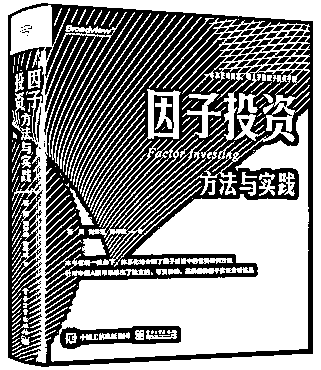
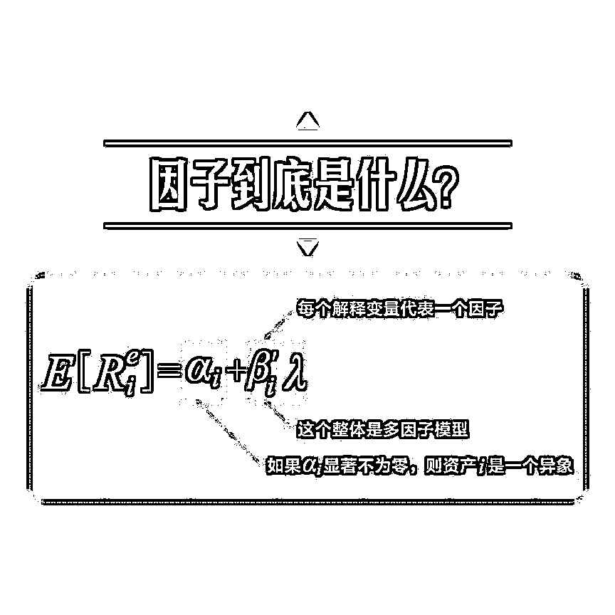
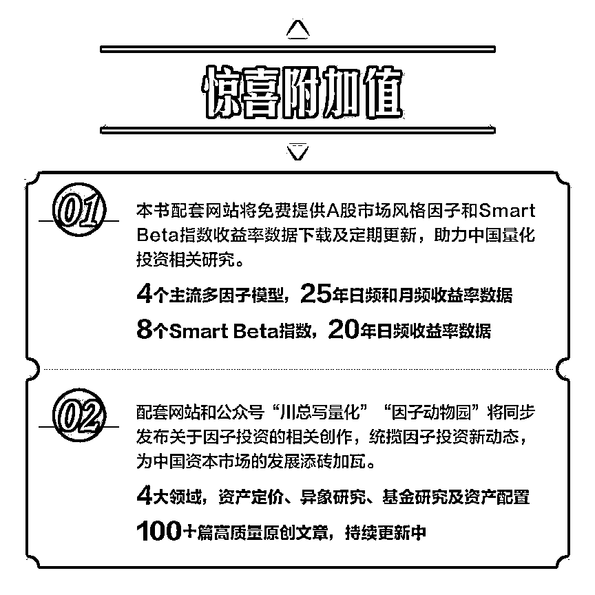
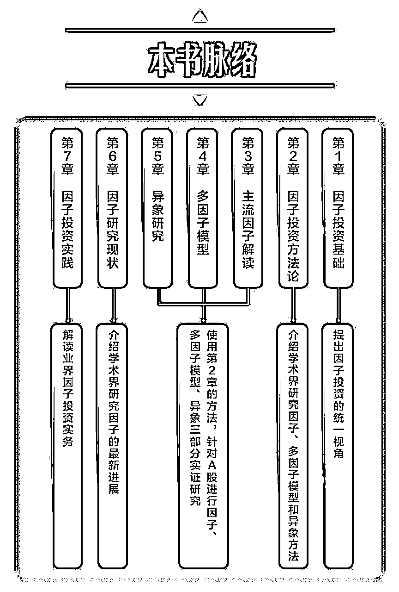
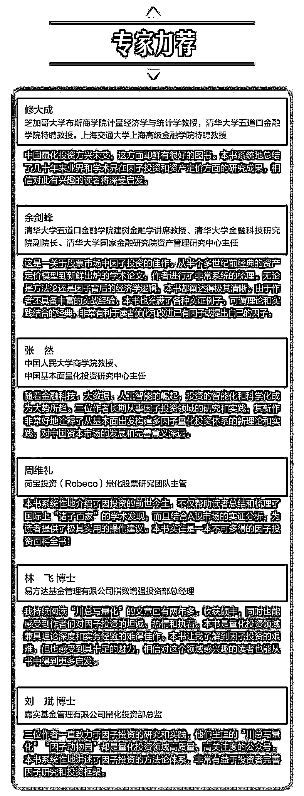
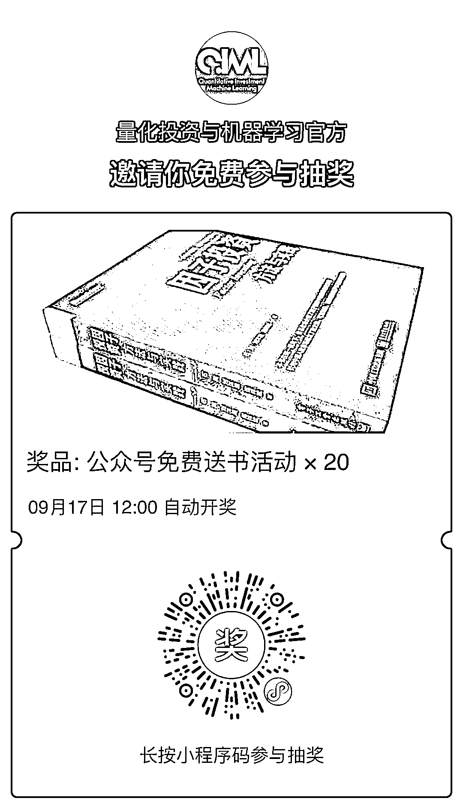
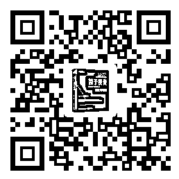

# 公众号福利：石川博士新书免费送啦！

> 原文：[`mp.weixin.qq.com/s?__biz=MzAxNTc0Mjg0Mg==&mid=2653305336&idx=1&sn=1cdae36187546157563ea8c601078da3&chksm=802dfbedb75a72fb0f9700d768c21d3dd696169a64673869cb3486232b30ca8eadb55de2b975&scene=27#wechat_redirect`](http://mp.weixin.qq.com/s?__biz=MzAxNTc0Mjg0Mg==&mid=2653305336&idx=1&sn=1cdae36187546157563ea8c601078da3&chksm=802dfbedb75a72fb0f9700d768c21d3dd696169a64673869cb3486232b30ca8eadb55de2b975&scene=27#wechat_redirect)

**全网 TOP 量化自媒体**

为了感谢各位忠实读者对公众号长期以来的支持，量化投资与机器学习微信公众号与电子工业出版社合作，**免费**为大家赠送相关书籍（**获取方式见文末**）。本期：**送 20 本**

国内第一本因子投资领域著作——**《因子投资：方法与实践》：**

这本书是石川博士和刘洋溢、连祥斌两位小伙伴合著。**成体系地介绍因子投资中的重要研究方法，并针对中国 A 股市场给出独立的、可复制的、高质量的因子实证分析结果，是一本真正可操作、可上手的因子投资手册。**

本书主要内容包括：**因子投资基础、因子投资方法论、主流因子解读、多因子模型、异象研究、因子研究现状和因子投资实践**。对于公众号的老朋友来说，本书既系统整合了 [川总写量化] 和 [因子动物园] 在过去几年的相关创作，又**加入了大量紧贴学术前沿和业界实务的首发内容，以及全新的实证分析结果。全书共 440 页，参考文献 400+**，行文逻辑清晰，内容与时俱进。

**因子到底是什么**

因子投资中最重要的自然是因子。那么，因子到底是什么？如何选择因子？

作为当今一个重要的投资类别，因子投资中涉及的内容非常丰富，但所有的方面都可以围绕一个公式来展开和讨论，形成一个关于因子投资的统一视角：

公式左侧表示资产 i 的预期超额收益，公式右侧 ai 是资产 i 的实际预期收益率和多因子模型隐含的预期收益率之间的定价误差；βi 是资产 i 的因子暴露( factor exposure)或称因子载荷(factor loading)；λ是因子预期收益( factor expected return)，也常被称为因子溢价( factor risk premium)。

公式左侧不同资产的收益率均可以归结到有限个因子的收益率上，而不同资产预期收益率的高低由它们对因子的暴露大小决定。由此可以得出因子的定义：

**一个因子描述了众多资产共同暴露的某种系统性风险，该风险是资产收益率背后的驱动力；因子收益率正是这种系统性风险的风险溢价或风险补偿，它是这些资产的共性收益。**

**本书能为你带来什么**

*   一览全貌：从学术界、管理人和投资者三个维度详述因子投资基础

*   奠定基础：投资组合排序法、广义矩估计等因子分析常用的统计学方法介绍

*   理解应用：以 A 股市场为对象，从因子、多因子模型和异象三个角度进行实证分析

*   热门话题：多重假设检验对挖掘因子和异象的危害、行为金融学、机器学习与因子投资等

*   投资务实：以多因子模型为数量化工具的主动投资和 Smart Beta 投资实践等

*   专业避坑：娓娓道来因子投资实践中会遇到的各种“坑”，少走弯路，实现高效投资

*   作者愿景：理论和实践结合的经典，一本真正可操作、可上手的因子投资手册

**行业专家推荐**

本书在的出版得到了芝加哥大学、清华大学、中国人民大学、荷宝投资、易方达基金、嘉实基金等学界/业界大咖的推荐。

**免费赠书规则**

此次赠送活动，公众号将为所有读者**赠送 20 本****《因子投资：方法与实践》****。****规则如下：**

**扫描下方二维码**，在截止日后，系统会自动抽取 20 位幸运粉丝。

官方微信：***lhtzjqxx***

官方邮箱：***lhtzjqxx@163.com***

**活动截止日期****2020 年 9 月 17 日 12:00****▼限时专享价扫码 4.7 折购▼**

量化投资与机器学习微信公众号，是业内垂直于**Quant****、Fintech、AI、ML**等领域的**量化类主流自媒体。**公众号拥有来自**公募、私募、券商、期货、银行、保险、资管**等众多圈内**18W+**关注者。每日发布行业前沿研究成果和最新量化资讯。