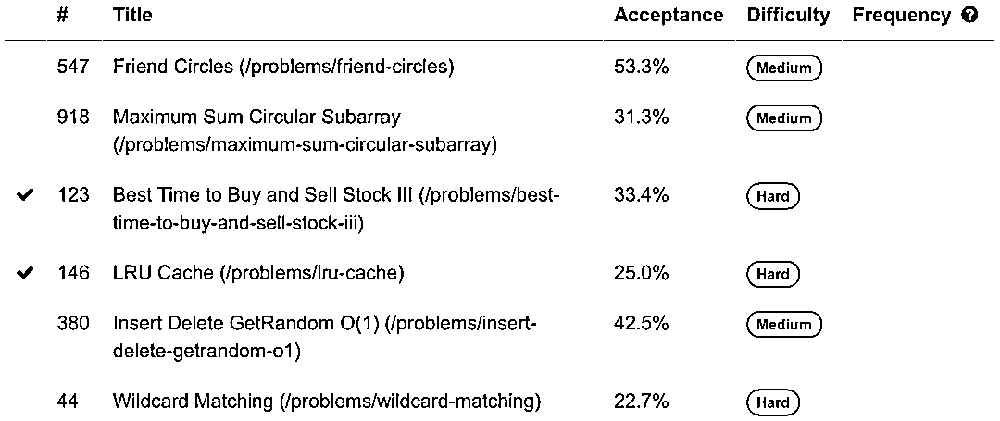
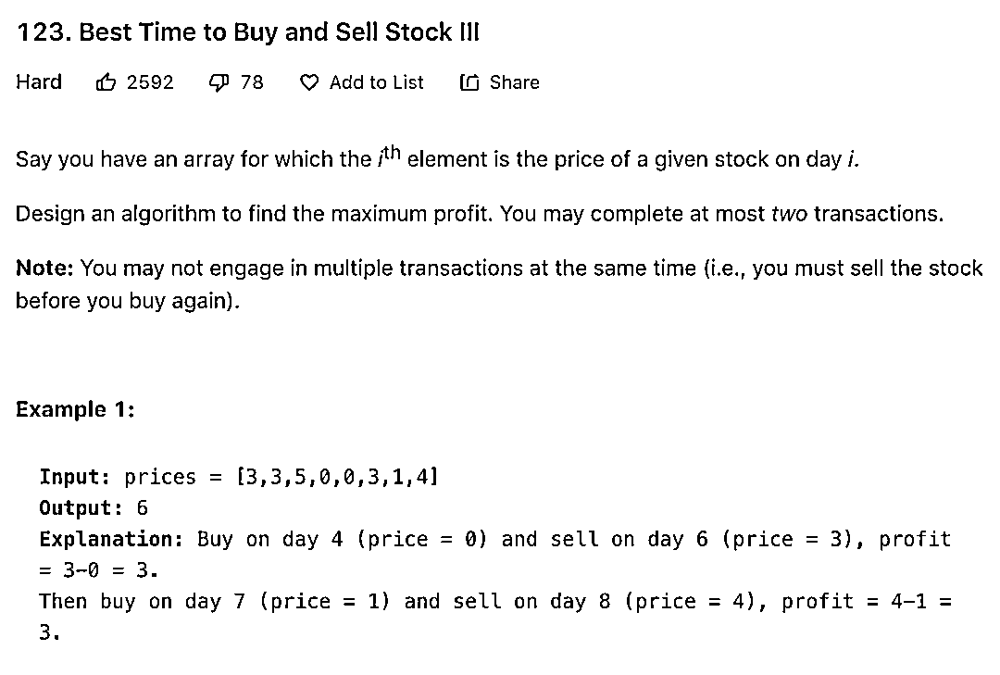
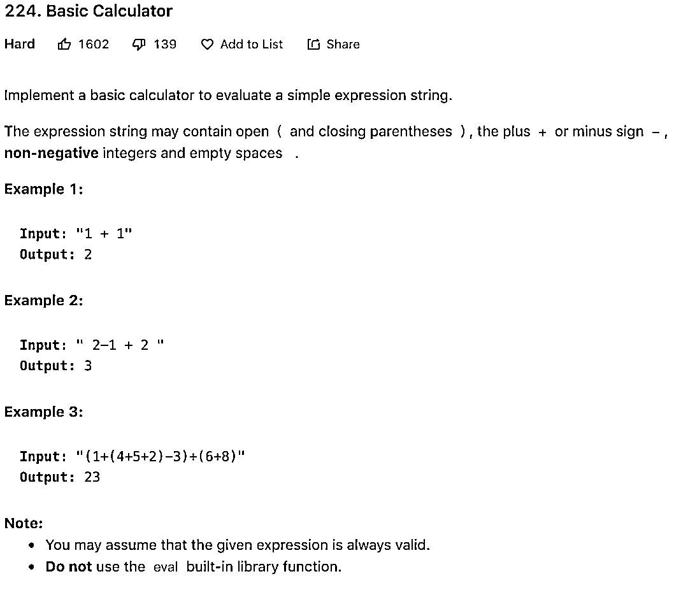
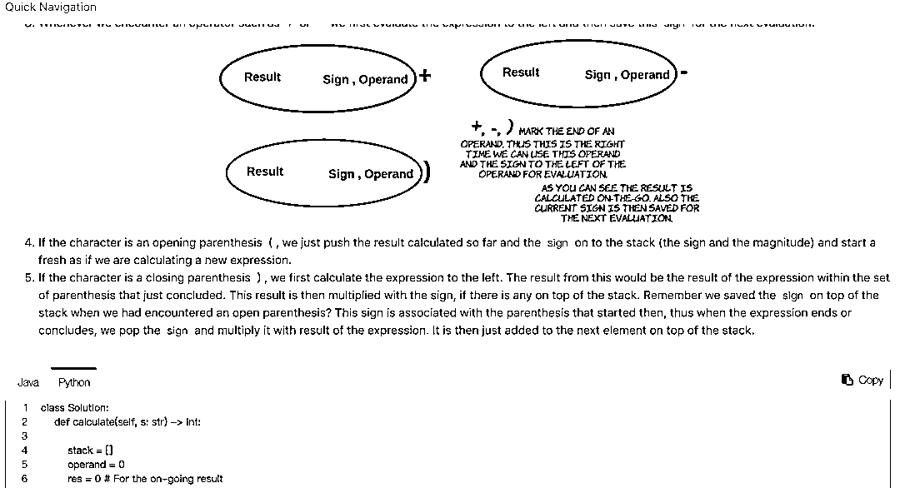

# 独家！全球顶尖对冲基金 LeetCode 面试题汇总

> 原文：[`mp.weixin.qq.com/s?__biz=MzAxNTc0Mjg0Mg==&mid=2653305235&idx=1&sn=279040efc5155e1ce239fa299bf9addc&chksm=802dfb86b75a7290102c924fef96443f16f01da6a44675393d01b7b5a3e798f075c83001d03c&scene=27#wechat_redirect`](http://mp.weixin.qq.com/s?__biz=MzAxNTc0Mjg0Mg==&mid=2653305235&idx=1&sn=279040efc5155e1ce239fa299bf9addc&chksm=802dfb86b75a7290102c924fef96443f16f01da6a44675393d01b7b5a3e798f075c83001d03c&scene=27#wechat_redirect)

**全网 TOP 量化自媒体**

### LeetCode 是一个汇集了诸多算法题库的编程网站，许多开发者在初学算法时，都会跑到 LeetCode 网站上面刷题，也有一些开发者为了过微软、Google、Facebook 等国际大企的面试，选择刷 LeetCode 来快速提升自己的编程能力与算法能力，以便顺利通过面试。

### **你今天刷 LeetCode 了吗?**

### 今天公众号整理了从 LeetCode Premium 中**各大金融机构**的相关面试题目，每家公司的面试题目会根据它们出现的频率进行排序（最受欢迎的问题会放在最前面）。

**获取题目文档，见文末**

目前公众号收集整理到的公司有（按照字母排序）：

*   **Akuna Capital**

*   **BlackRock **

*   **Bloomberg **

*   **Citadel **

*   **Deutsche Bank **

*   **Goldman Sachs **

*   **JPMorgan **

*   **Jump Trading**

*   **Morgan Stanley **

*   **Two Sigma **

我们拿 Two Sigma 题目看看：

**点击每道题目都可以直接跳转到相应答题区域**，让我们看看*#123*看看题目的样式：

再比如**Jump Trading**的题目：

题目解答过程：

希望大家能从这些题目中学到很多知识（金融、量化、算法、编程等），快来下载题目开始作答吧！

**题目文档下载**

**在微信****公众号后台****回复（区分大小写）**

**量化 LeetCode**

量化投资与机器学习微信公众号，是业内垂直于**Quant****、Fintech、AI、ML**等领域的**量化类主流自媒体。**公众号拥有来自**公募、私募、券商、期货、银行、保险、资管**等众多圈内**18W+**关注者。每日发布行业前沿研究成果和最新量化资讯。