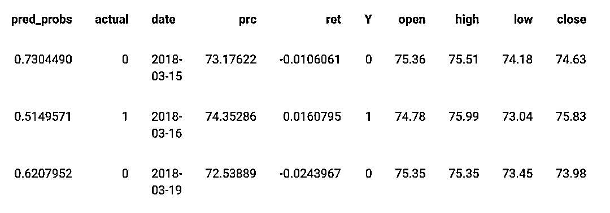

# MLQuant：基于 XGBoost 的金融时序交易策略（附代码）

> 原文：[`mp.weixin.qq.com/s?__biz=MzAxNTc0Mjg0Mg==&mid=2653305192&idx=1&sn=913451fda9b6fdc43e5d4a676105943d&chksm=802dfb7db75a726b271ed9ac8e8b465736fd4f18e98c94fa30d345ffb5a9260ac48b0a441f5a&scene=27#wechat_redirect`](http://mp.weixin.qq.com/s?__biz=MzAxNTc0Mjg0Mg==&mid=2653305192&idx=1&sn=913451fda9b6fdc43e5d4a676105943d&chksm=802dfb7db75a726b271ed9ac8e8b465736fd4f18e98c94fa30d345ffb5a9260ac48b0a441f5a&scene=27#wechat_redirect)


**全网 TOP 量化自媒体**

作者：Smith     编译：方的馒头

***1***

**引言**

使用机器学习和过股票价格来预测下一个时期的价格或方向并不是什么新鲜事，它也不会产生任何有意义的预测。在这篇文章中我们将一系列资产的时间序列数据分解成一个简单的分类问题，看看机器学习模型能否更好地预测下一个周期方向。目标和策略是每天投资一项资产。其资产将是机器学习模型最有信心在下一个上升<mi>Ť</mi><mo>+</mo><mn>1 期间股价上涨</mn>的资产。换句话说，我们对机器学习模型给出最大预测概率的资产进行投资，即给定资产明天将升值。也就是说，如果模型预测在第 t 天，GOOG 的资产将以 0.78 的预测概率高于之前的收盘价，并且还预测 AMZN 将以 0.53 的概率上升，那么我们今天将投资于 GOOG。我们每天只投资一项资产，该模型可以扩展到卖空、多资产购买和多周期等。

***2***

** 导入相关库文件**

```py
require(PerformanceAnalytics)
library(data.table)
library(dplyr)
library(tibble)
library(TTR)
library(tidyr)
library(tidyquant)
library(tsfeatures)
library(rsample)
library(purrr)
library(stringr)
library(tibbletime) # tsibble clashes with the base R index() function
library(xgboost)
library(rvest) 
```

预定义一些初始化对象，并设置我们要下载的公司的股票代码。从 S&P500 中随机抽取了 30 只股票。

```py
set.seed(1234)
##########################################################

Scale_Me <- function(x){
  (x - mean(x, na.rm = TRUE)) / sd(x, na.rm = TRUE)
}

###########################################################

start_date <- "2017-01-01"
end_date <- "2020-01-01"

url <- "https://en.wikipedia.org/wiki/List_of_S%26P_500_companies"
symbols <- url %>%
  read_html() %>%
  html_nodes(xpath = '//*[@id="constituents"]') %>%
  html_table() %>%
  .[[1]] %>%
  filter(!str_detect(Security, "Class A|Class B|Class C")) %>%     # Removes firms with Class A, B & C shares
  sample_n(30) %>%
  pull(Symbol)

#symbols <- c(
  #'GOOG', 'MSFT', 'HOG', 'AAPL', 'FB'
  #'AMZN', 'EBAY', 'IBM', 'NFLX', 'NVDA',
  #'TWTR', 'WMT', 'XRX', 'INTC', 'HPE'
# )
```

***3***

**数据**

下载数据并将其存储到新环境中。

```py
dataEnv <- new.env()
getSymbols(symbols,
           from = start_date,
           to = end_date,
           #src = "yahoo",
           #adjust = TRUE,
           env = dataEnv) 
```

```py
##  [1] "LEG"  "NLSN" "SLB"  "CHTR" "C"    "REGN" "CCI"  "SYK"  "ROP"  "RL"
## [11] "CERN" "CMG"  "GS"   "CAT"  "MSI"  "BR"   "VRSK" "PNC"  "KEYS" "PHM"
## [21] "FB"   "BKR"  "ABMD" "WYNN" "DG"   "ADI"  "GL"   "TSCO" "FLS"  "CDW" 
```

一旦数据下载并存储到新环境中后，我们将清理一下数据，将所有列表放入一个单独的数据框中，计算每种资产的每日收益并创建向上或向下的方向，这将是分类模型试图进行预测。

```py
df <- eapply(dataEnv, function(x){
  as.data.frame(x) %>%
    rename_all(function(n){
      gsub("^(\\w+)\\.", "", n, perl = TRUE)
    }
    ) %>%
    rownames_to_column("date")
}) %>%
  rbindlist(idcol = TRUE) %>%
  mutate(date = as.Date(date)) %>%
  group_by(.id) %>%
  tq_mutate(
    select = Adjusted,
    mutate_fun = periodReturn,
    period = "daily",
    type = "arithmetic"
  ) %>%
  mutate(
    Adj_lag = lag(Adjusted),
    chng_Adj = ifelse(Adjusted > Adj_lag, 1, 0)
  ) %>%
  select("date", ".id", "Adjusted", "daily.returns", "chng_Adj", "Open", "High", "Low", "Close") %>%
  as_tibble() %>%
  as_tbl_time(index = date) %>%
  setNames(c("date", "ID", "prc", "ret", "chng", "open", "high", "low", "close")) %>%
  drop_na(chng) 
```

数据的前几个观测结果如下：


我们可以使用 nest()函数将数据放入方便的嵌套表中，我们可以简单地对其进行 map()覆盖并应用 rsample 包中的 rolling_origin()函数，这样，我们的每项资产都将有自己的 rolling_origin()函数应用于它，而不会出现资产类的任何重叠或混合，我们这样做是为了为每个周期创建时间序列特征。

```py
nested_df <- df %>%
  mutate(duplicate_ID = ID) %>%
  nest(-ID) 
```

我们将时间序列数据分为多个列表，以使该 analysis()列表在每个列表中包含 100 个观测值，并具有一个包含 1 个观测值的相应 assessment()列表。通常，analysis()它将成为我们的训练数据集，并且 assessment()将成为我们的测试数据集，但是，在这里，我们使用该 rolling_origin()函数来帮助创建时间序列特征。

```py
rolled_df <- map(nested_df$data, ~ rolling_origin(.,
                                                  initial = 100,
                                                  assess = 1,
                                                  cumulative = FALSE,
                                                  skip = 0)) 
```

***4***

**时间序列函数**

为了创建时间序列变量，我们使用 tsfeatures 包，但也有个 feasts 包在这里。对于此模型，我们只需从 tsfeatures 包中选择一些感兴趣的函数。 

```py
functions <- c(
  "entropy",                   # Measures the "forecastability" of a series - low values = high sig-to-noise, large vals = difficult to forecast
  "stability",                 # means/variances are computed for all tiled windows - stability is the variance of the means
  "lumpiness",                 # Lumpiness is the variance of the variances
  "max_level_shift",           # Finds the largest mean shift between two consecutive windows (returns two values, size of shift and time index of shift)
  "max_var_shift",             # Finds the max variance shift between two consecutive windows (returns two values, size of shift and time index of shift)
  "max_kl_shift",              # Finds the largest shift in the Kulback-Leibler divergence between two consecutive windows (returns two values, size of shift and time index of shift)
  "crossing_points"            # Number of times a series crosses the mean line
)
```

我们觉得坚持使用 map()函数而不是 function(SYMB)会更有趣。该函数对我们数据中的每项资产执行以下操作：

使用样本外 t+1（assessment）数据，将这些列表绑定到一个 dataframe 中。接下来，应用 functions 字符串从 tsfeatures 包中调用函数，将这些函数应用于样本 analysis 数据（每个数据包含 100 个观测值），这样，我们获得了一个折叠可以将其绑定在一起的观测值。最后，我们使用 bind_cols()将两个数据集的列绑定在一起。之后，我们使用重命名 chng 变量并使用~str_c("X", seq_along(.))将时间序列特征变量重命名为更具动态性的变量，因此我们只需向 functions 字符串添加函数，而不必担心为了让模型起作用而单独重命名变量。

完成此操作后，我们将使用 rolling_origin()函数再次创建机器学习数据集。第一个 rolling_origin()函数是用于通过获取前 100 天的数据并计算其上的 tsfeatures 函数来帮助在滚动的基础上向下折叠时间序列数据，这与使用 zoo 包的 rollapply()函数来计算使用滚动平均值/标准差的方法类似。

接下来，我们使用变量 X_train 和 X_test 把数据拆分成 X 个变量以及使用 Y_train 和 Y_test 把相应的 Y 变量分开。xgboost 包需要一个特定类型的 xgb.DMatrix()。这是 dtrain 和 dtest 正在做的。

然后，我们设置 XGBoost 参数并应用 XGBoost 模型。——此时应执行适当的交叉验证，但是由于时间序列交叉验证非常棘手，R 中没有函数可以帮助这种类型的交叉验证。我们将在后面的文章中给读者介绍其方法。

一旦模型被训练好，我们就开始做预测。

***5***

****模****型应用****

计算所有这些的函数如下：

```py
Prediction_Model <- function(SYMB){
  data <- bind_cols(
    map(rolled_df[[SYMB]]$splits, ~ assessment(.x)) %>%
      bind_rows(),
    map(rolled_df[[SYMB]]$splits, ~ analysis(.x)) %>%
      map(., ~tsfeatures(.x[["ret"]], functions)) %>%
      bind_rows()
  ) %>%
    rename(Y = chng) %>%
    rename_at(vars(-c(1:9)), ~str_c("X", seq_along(.)))

  ml_data <- data %>%
    as_tibble() %>%
    rolling_origin(
      initial    = 200,
      assess     = 1,
      cumulative = FALSE,
      skip       = 0)

  X_train <- map(
    ml_data$splits, ~ analysis(.x) %>%
      as_tibble(., .name_repair = "universal") %>%
      select(starts_with("X")) %>%
      as.matrix()
  )

  Y_train <- map(
    ml_data$splits, ~ analysis(.x) %>%
      as_tibble(., .name_repair = "universal") %>%
      select(starts_with("Y")) %>%
      as.matrix()
  )

  X_test <- map(
    ml_data$splits, ~ assessment(.x) %>%
      as_tibble(., .name_repair = "universal") %>%
      select(starts_with("X")) %>%
      as.matrix()
  )

  Y_test <- map(
    ml_data$splits, ~ assessment(.x) %>%
      as_tibble(., .name_repair = "universal") %>%
      select(starts_with("Y")) %>%
      as.matrix()
  )

  #############################################################

  dtrain <- map2(
    X_train, Y_train, ~ xgb.DMatrix(data = .x, label = .y, missing = "NaN")
  )

  dtest <- map(
    X_test, ~ xgb.DMatrix(data = .x, missing = "NaN")
  )

  # Parameters:
  watchlist <- list("train" = dtrain)
  params <- list("eta" = 0.1, "max_depth" = 5, "colsample_bytree" = 1, "min_child_weight" = 1, "subsample"= 1,
                 "objective"="binary:logistic", "gamma" = 1, "lambda" = 1, "alpha" = 0, "max_delta_step" = 0,
                 "colsample_bylevel" = 1, "eval_metric"= "auc",
                 "set.seed" = 176)

  # Train the XGBoost model
  xgb.model <- map(
    dtrain, ~ xgboost(params = params, data = .x, nrounds = 10, watchlist)
  )

  xgb.pred <- map2(
    .x = xgb.model,
    .y = dtest,
    .f = ~ predict(.x, newdata = .y, type = 'prob')
  )

  preds <- cbind(plyr::ldply(xgb.pred, data.frame),
                 plyr::ldply(Y_test, data.frame)) %>%
    setNames(c("pred_probs", "actual")) %>%
    bind_cols(plyr::ldply(map(ml_data$splits, ~assessment(.x)))) %>%
    rename(ID = duplicate_ID) %>%
    #select(pred_probs, actual, date, ID, prc, ret) %>%
    as_tibble()
  return(preds)
}
```

我们可以应用上述模型来创建时间序列特征，通过运行以下内容对我们的每项资产进行训练和测试。 

```py
Sys_t_start <- Sys.time()
Resultados <- lapply(seq(1:length(rolled_df)), Prediction_Model)
Sys_t_end <- Sys.time()
round(Sys_t_end - Sys_t_start, 2) 
```

该 Resultados 输出会给我们一个列表，列出我们数据中资产数量的长度。列表中第一个资产的前几个观测结果如下：




其中包括 XGBoost 预测的概率、实际的观测结果、结果日期（样本外测试数据的日期），观测股价、计算出的日收益率（观测结果的副本）、从 Yahoo 收集了 OHLC 数据，最后我们构建了时间序列特征，然后将其重新命名为 <msub><mi>X_n</mi><mrow><mi>。</mi></mrow></msub>

该策略的**目标**是每天投资市场预测上涨概率最高的资产。也就是说，如果该模型在 t 日预测，GOOG 的资产价格将高于之前的收盘价，预计概率为 0.78，并且还预测 AMZN 将以 0.53 的概率上升，很有可能我们今天会投资 GOOG。也就是说，我们仅对市场上涨的预期概率最高的资产进行投资。

因此，我们创建了一个名为 top_assets 的新数据框架，该框架基本上每天为我们提供所有资产的最高预测概率。

```py
top_assets <- plyr::ldply(Resultados) %>%
  #select(pred_probs, actual, date, open, high, low, close, prc, ret) %>%
  group_by(date) %>%
  arrange(desc(pred_probs)) %>%
  dplyr::slice(1) %>%
  ungroup() %>%
  select(date, everything()) %>%
  rename(score = pred_probs) %>%
  select(-actual) 
```

***6***

**策略评估**

策略投资的前 10 天如下：


我们可以看到，score 列是具有最高预测概率的资产的概率，即它的价格比其前一个收盘价高。该 ID 列为我们提供了我们投资的资产代码。 

接下来，我们要分析根据 S&P500 基准指数选择最佳预测赢家的策略，并下载 S&P500 指数。

```py
top_assets <- xts(top_assets[,c(2:ncol(top_assets))], order.by = top_assets$date) # put top_assets into xts format

# Analyse strategy
getSymbols("SPY",
           from = start_date,
           to = end_date,
           src = "yahoo") 
```

```py
## [1] "SPY" 
```

```py
#detach("package:tsibble", unload = TRUE) # tsibble clashes with the base R index() function
SPY$ret_Rb <- Delt(SPY$SPY.Adjusted)
SPY <- SPY[index(SPY) >= min(index(top_assets))]

RaRb <- cbind(top_assets, SPY) 
```

从这里我们可以看到该策略与标准普尔 500 指数的比较。暂时没有将模型扩展到包括卖空或构建前 N 个资产的多资产投资组合。 

绘制策略的执行情况：

```py
charts.PerformanceSummary(RaRb[, c("ret", "ret_Rb")], geometric = FALSE, wealth.index = FALSE,
                          main = "Strategy vs. Market")
```


先关指标：

```py
##                             ret ret_Rb
## Sterling ratio           0.1870 0.3879
## Calmar ratio             0.2551 0.5884
## Burke ratio              0.2251 0.5344
## Pain index               0.0955 0.0283
## Ulcer index              0.1189 0.0455
## Pain ratio               0.7337 4.0290
## Martin ratio             0.5891 2.5027
## daily downside risk      0.0111 0.0066
## Annualised downside risk 0.1768 0.1044
## Downside potential       0.0054 0.0029
## Omega                    1.0722 1.1601
## Sortino ratio            0.0351 0.0714
## Upside potential         0.0058 0.0034
## Upside potential ratio   0.7027 0.6124
## Omega-sharpe ratio       0.0722 0.1601 
```

回测信息：

```py
## $ret
##         From     Trough         To   Depth Length To Trough Recovery
## 1 2018-08-31 2019-01-03 2019-09-16 -0.2746    261        85      176
## 2 2019-11-06 2019-12-03       <NA> -0.1300     39        19       NA
## 3 2019-10-01 2019-10-18 2019-10-29 -0.0810     21        14        7
## 4 2018-03-22 2018-04-20 2018-05-09 -0.0773     34        21       13
## 5 2018-08-10 2018-08-15 2018-08-20 -0.0474      7         4        3
##
## $ret_Rb
##         From     Trough         To   Depth Length To Trough Recovery
## 1 2018-09-21 2018-12-24 2019-04-12 -0.1935    140        65       75
## 2 2019-05-06 2019-06-03 2019-06-20 -0.0662     33        20       13
## 3 2018-03-15 2018-04-02 2018-06-04 -0.0610     56        12       44
## 4 2019-07-29 2019-08-05 2019-10-25 -0.0602     64         6       58
## 5 2018-06-13 2018-06-27 2018-07-09 -0.0300     18        11        7 
```

比较收益

```py
chart.Boxplot(RaRb[,c("ret", "ret_Rb")],  main = "Returns") 
```


比较收益统计：

```py
table.Stats(RaRb[, c("ret", "ret_Rb")]) %>%
  t() %>%
  kable() %>%
  kable_styling(bootstrap_options = c("striped", "hover", "condensed", "responsive")) 
```

```py
 观察结果	资产净值	最低要求	四分位数 1	中位数	算术平均值	几何平均数	四分位数 3	最大值	SE 均值	LCL 均值（0.95）	UCL 平均值（0.95）	方差	斯特德夫	偏度	峰度
退回	453	0	-0.0669	-0.0068	0.0006	0.0004	0.0003	0.0087	0.0642	0.0007	-0.0011	0.0018	0.0002	0.0156	-0.2542	2.8842
ret_Rb	453	0	-0.0324	-0.0030	0.0006	0.0005	0.0004	0.0054	0.0505	0.0004	-0.0004	0.0013	0.0001	0.0091	-0.2949	3.6264
```

夏普：

```py
lapply(RaRb[, c("ret", "ret_Rb")], function(x){SharpeRatio(x)}) 
```

```py
## $ret
##                                       ret
## StdDev Sharpe (Rf=0%, p=95%): 0.025027498
## VaR Sharpe (Rf=0%, p=95%):    0.015346462
## ES Sharpe (Rf=0%, p=95%):     0.009618405
##
## $ret_Rb
##                                   ret_Rb
## StdDev Sharpe (Rf=0%, p=95%): 0.05152014
## VaR Sharpe (Rf=0%, p=95%):    0.03218952
## ES Sharpe (Rf=0%, p=95%):     0.01913213
```

绘制风险-收益散点图：

```py
chart.RiskReturnScatter(RaRb[, c("ret", "ret_Rb")], 
                        Rf=.03/252, scale = 252,
                        main = "Risk - Return over the period") 
```


绘制滚动收益、风险和夏普表现：

```py
charts.RollingPerformance(RaRb[, c("ret", "ret_Rb")],
                          Rf=.03/12,
                          colorset = c("red", rep("darkgray",5), "orange", "green"), lwd = 2) 
```


年化收益：

```py
lapply(RaRb[, c("ret")],function(x){periodReturn(
  x, period = 'yearly', type = 'arithmetic')}) 
```

```py
## $ret
##            yearly.returns
## 2018-12-31      -1.855083
## 2019-12-31      -1.475181 
```

```py
lapply(RaRb[, c("ret_Rb")],function(x){periodReturn(
  x, period = 'yearly', type = 'arithmetic')}) 
```

```py
## $ret_Rb
##            yearly.returns
## 2018-12-31     -9.0376638
## 2019-12-31     -0.7226497 
```

量化投资与机器学习微信公众号，是业内垂直于**Quant****、Fintech、AI、ML**等领域的**量化类主流自媒体。**公众号拥有来自**公募、私募、券商、期货、银行、保险、资管**等众多圈内**18W+**关注者。每日发布行业前沿研究成果和最新量化资讯。