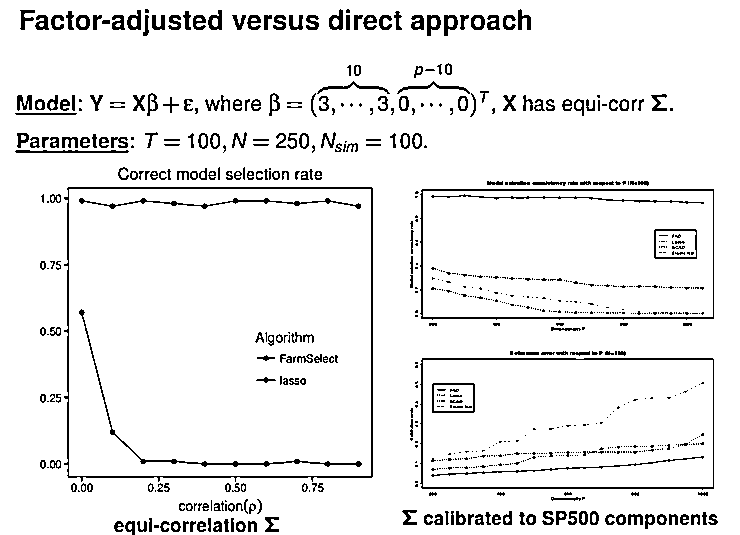
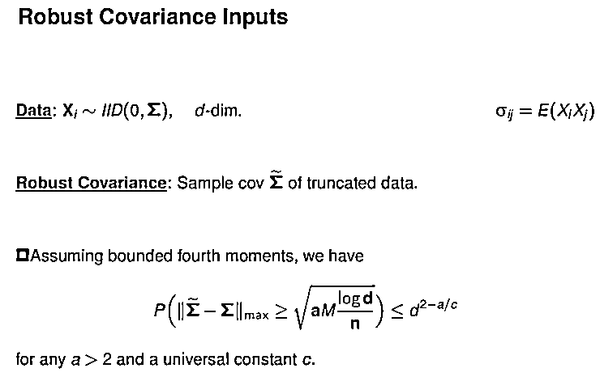
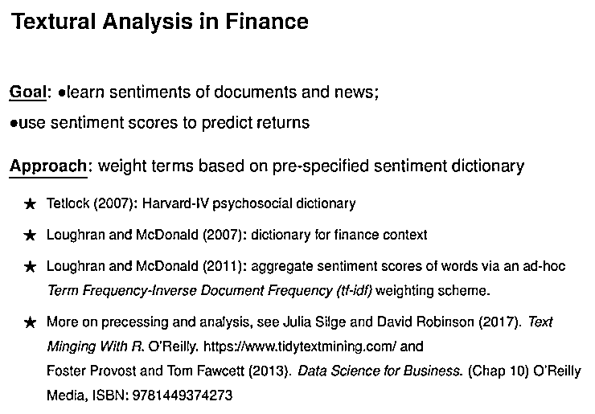

# 统计学家范剑青：机器是怎么学习金融的?

> 原文：[`mp.weixin.qq.com/s?__biz=MzAxNTc0Mjg0Mg==&mid=2653305168&idx=1&sn=1ed07f79f7767dab790226063219b5e8&chksm=802dfb45b75a72537cd43d05ab8354fa3b7a3bc8c09397de7576c7c8a5fc2d27df4082f5b7aa&scene=27#wechat_redirect`](http://mp.weixin.qq.com/s?__biz=MzAxNTc0Mjg0Mg==&mid=2653305168&idx=1&sn=1ed07f79f7767dab790226063219b5e8&chksm=802dfb45b75a72537cd43d05ab8354fa3b7a3bc8c09397de7576c7c8a5fc2d27df4082f5b7aa&scene=27#wechat_redirect)

**全网 TOP 量化自媒体**

范剑青是国际数理统计学会创办 70 年以来第一位华人主席，也是统计旗舰杂志《统计年鉴》的第一位华人主编，论文引用数多年位列世界数学家前十名，是素有统计学诺贝尔奖之称的 CPOSS 总统奖得主，也是《概率及其相关领域》、《计量经济》、《商务统计》等五个国际顶尖学术期刊的主编。 

在范剑青看来，人工智能是机器学习的平方，让机器自动学习机器算法、是机器学习的理想境界。而大数据赋能 AI，从大数据相关的科学挑战衍生的新兴科学即为数据科学，他认为数据科学以应用为背景，其目的是想把大数据解决成智慧数据。 

他指出，大数据=系统+分析+应用，机器学习=统计+优化+实现环境。 

如今深度学习之所以能如此成功，范剑青认为它是权衡偏差和方差的有效方法，深度网络使高维函数更加灵活，大数据降低了统计方差，而现在计算技术使大数据深度学习得到有效的实现。 

范剑青认为，在经济金融、生物医学、管理决策和人文社会中，机器学习有很多挑战和机遇。由于个体差异大，数据集未知，现在发生的事情与几年后的变量完全不一样，难以提取特征，需要各学科交叉。尤其是在金融行业，数据不平稳，随着时间而变，多人参与竞争的市场也是对金融的挑战。 

而机器学习本身就是为降低维数和预测而设计的，他认为机器能学习金融，尽管金融非常复杂，但它的形式是可预测的。以股票收益预测为例，可以通过高维线性模型、机器学习模型或是深度学习模型来处理。他强调，成功预测的属性一是大数据，二是鲁棒，三是模型具备市场的重要特征。 

他还详尽地用几个例子来说明溢价预测相关的问题，例如通过市场因子来预测债券风险；并介绍了现阶段可以使用的两种因子学习方法，一是传统主成分方法，二是利用投影主成分来操作。 

此外，范剑青也与现场观众介绍了文本数据如何协助股票投资决策，他表示现在可以通过对新闻内容的分析，解析文章对股票的褒贬程度。 

最后，范剑青总结称，资产定价本质上是预测问题，机器可以学习金融。他认为机器学习可以帮助处理大数据并从中选择重要因素和特征，能很好地应对过度拟合的问题，允许非线性学习极大地改善预测效果，将稳健性和对抗性网络提炼为定价，智能预测也会带来很大的经济收益。 

以下是范剑青的大会报告内容，雷锋网《AI 金融评论》做了不改变原意的编辑与整理：

非常荣幸能够参加第五届 CCF-GAIR 全球人工智能与机器人峰会。我今天的报告主题是《机器是怎么学习金融的》。

这次报告的内容，是我们金融工程实验室多人的工作成果，大纲如下：

*   大数据与人工智能

*   稳健因子学习及其应用

*   债券风险溢价预测

*   高频交易预测

*   文本数据与资产定价

**重新理解大数据与人工智能**

****

**众所周知，人工智能是由 John McCarthy 于 1955 年首次提出，一年后，他也与多名科学家组织了著名的 Dartmouth 会议。**

**何谓人工智能？**

**Wikipedia 中是这样介绍的：“人工智能”指机器模仿人类的“认知”功能所展示的智能，例如“学习”和“解决问题”。现实中的人工智能是技术能够训练机器，将人从重复性、简单性、危险性的繁琐事务中解除出来。**

**Thomas J.Sargent：人工智能其实是统计学，只不过用了一个华丽辞藻。**

**我认为人工智能是机器学习的平方，让机器自动学习机器算法、是机器学习的理想境界。目前内容包括图像识别、语音识别、机器学习、机器人、专家系统、计算机视觉、自然语言处理等。**

****

**为什么现在大家谈人工智能？What powers AI？**

**是大数据。**

****

**现在大数据无处不在，商业大数据、医学大数据、网络大数据、政府大数据等。针对大数据的共性，解决其对大数据系统和分析的科学挑战所产生的新兴科学叫数据科学。**

**我个人认为数据科学以应用为背景，包括数据的获取、存储、数据分析、科学计算。数据科学的目的是想把大数据解决成智慧数据。**

**我把它总结为：大数据=系统+分析+应用。**

**何谓机器学习？**

**Arthur L Samuel 在 1959 年的“跳棋游戏”论文中创造了“机器学习”这个术语：让机器从数据中学习并做决策，它是可扩展的统计算法，充分融合统计建模思想和计算优化方法。使这些数据分析的思想能在大数据环境下得到有效的实现。**

**我个人认为机器学习是：统计+优化+实现环境。**

****

**机器学习最后的产品一定是可操作的代码（Actionable codes）。**

**为了有可操作的代码，我们需有优化的目标（Optimization objects），为了有优化的目标，我们需有统计模型（Statistical Modeling）和经济效用（Economic Utility）。**

**现在最常见的是深度学习。**

**深度学习的概念是很常见的，是数学的函数逼近，它用的是两种方法，信号源的线性组合，再做非线性的选择，重复的过程构成很复杂的函数逼近方法。**

**为何今天深度学习这么成功？**

****

**我认为它是很好的权衡偏差和方差的有效方法。深度网络使得高维函数逼近更加灵活，即偏差很小。**

**另外 90 年代，我们就参与建设了这方面的工作，为什么学术界和工业界现在才大谈深度学习？**

**主要是因为大数据的到来，大数据的到来大大减少统计的方差，样本量变大，方差自然变小。**

**现在计算技术使得大规模优化成为现实，使得我们可以在大数据上实现深度神经网络逼近函数。**

**简而言之是非参数统计思想在高维海量数据环境下的实现。**

**具体成功案例是图像识别、机器翻译、语音处理等等。**

****

**这些问题的共同特点是个体差异小，我们说话尽管各有口音，但个体间的差异小，而且信号集已知，你看到的图像就是你那张图像。换句话说 X 是已知的，信噪比大，∈小，学习得比较好。**

**我们今天要谈的主要是机器学习的挑战。**

**对于经济金融、生物医学、管理决策和人文社会，机器学习有很多挑战和机遇，第一是个体差异大，第二是数据集未知。**

****

**例如上图是闪电崩盘，这次发生的事情和几年后发生的事情，可能变量完全不一样，是什么引起的我们也不知道，所以难以提取特征，需要各学科交叉，使得这方面的发展挑战更大。**

**对金融来说，金融数据的特点是什么？**

**第一信号低，跟物理不一样，物理信噪比很强。**

**第二数据不平稳，一直是随着时间的变化而变化的，整个市场也是随着时间的变化而变化，很多人参与，这是一个竞争的市场。这是对金融的挑战。**

**机器能学习金融吗？回答是肯定的：**

**第一，资产定价问题，本质上是预测问题，机器学习本身就是为预测设计的。**

**第二，影响市场的因子变量很多，这些变量往往是相关的。机器学习本身就是为降低维度和变量选择设计的。**

**第三，定价的公式，不像物理是推导出来的、有很多假设的。资产定价非常复杂、形式未知。机器学习正是为高维复杂的非线性组合而设计。**

**基于这三个原因，我认为机器从某种程度上讲是能够学习金融。**

****

****

****

**大家自然会问预测成功的因素是什么？一是大数据；二是鲁棒性；三是你的模型捕获能力。**

**什么是大数据的典型特征？**

*   **相依性和厚尾性：我们很多变量都是衡量市场的经济状况，必然相关**

*   **异样性、内生性、假相关等**

*   **数据缺失，测量误差**

*   **幸存者偏差，采样偏差**

**这些特征对金融和宏观经济学尤其明显。**

**今天我们主要讲如何处理相依性和厚尾性一些方法。**

****

**接下来我用一个学术上常用的例子预测债券风险溢价来说明。**

**我要预测的变量是美国债券，债券有 2、3、4 等年期，可以对每一个债券进行预测。是 131 个宏观经济系列的月度数据。除此之外我们还有 8 个国内生产总值，居民消费价格指数等汇总宏观经济系列。这 131 个变量都是衡量经济的健康状况，所以他们是相关的。**

****

**我们对每一个时间序列算峰度（kurtosis），分布如图所示。有大概三分之一左右峰度大于，它们应该是厚尾分布。我们自然而然会问：如何处理厚尾？我们从 131 个变量学习决定市场的因子之外，我们还有 8 个宏观经济时间序列，我们如何使用这 8 个信息更好地提取市场因子？**

****

**稳健因子学习及其应用**

****

****

****

**举一个模拟的例子。这是线性模型，前 10 个变量对 Y 有影响，后面的变量没有影响。X 如果是有共同的相关性，假设有 250 个变量，做 100 次模拟，每一个时间序列长度是 100。**

**如果我们用原始 Lasso 来做变量选择，只有在完全不相关时，Lasso 工作得还好。只要相关系数增加一点点，Lasso 就不能完全选出这 10 个变量。**

**另一方面，如果我把这 250 个个性，加上每一个共同的因子拿出来作为第 251 个变量，就可以达到 100%的正确模型选择。如果说不知道是不是 251 个，而用 255 个可以吗？可以，也可以得到这样的效果。**

**如果Σ设成像标普 500 只成分股那样的协方差，最后的结果是一样的，我们可以百分百把重要的变量选出来，其他的方法做不到。**

****

****

****

****

**同样地，因子学习后，我们也可以做预测。从 131 个宏观变量里，我可以学到 5 个潜在因子，有 8 个汇总宏观变量，加起来有 13 个变量。最简单的是用这 13 个变量做线性回归来预测债券风险溢价。**

**另外一种是构建预测指标，整个模型看起来像神经网络。我们认为有一些共同的因子影响这些宏观变量，所以从 131 个宏观变量中学习共同因子后，构造预测指标，最后预测债券风险溢价。**

****

**因子模型还有其他的应用。比如金融风险建模，对高频金融里流动性强和差的股票之间的协方差矩阵的估计，用矩阵填补的方法可以获得。你也可以用相关性来学习社区增强自回归模型之类，其关键是降维。** 

****

**因子模型的目的是处理相关性，接下来我讲几分钟我们如何处理稳健性。假设你给我们的数据不一定是正态分布的，也可能是 t 分布的，有均值及方差。**

**我们平时对数据最简单的处理是剪裁或截断，如把数据在-3 到 3 个标准差之间就保留，其余就截掉，这样做好处是肯定产生偏差。如果τ选择的足够大的话，这种偏差是可以忽略的：裁剪的数据的样本平均跟原来的母体平均的差别就像数据是来自高斯分布一样。**

**换句话说，如果τ足够大，那么裁剪样本平均与母体平均之间的区别跟正态的样本平均与母体平均之间区别是一样的，最后的分布是具有高斯的尾部性质。**

**说宽泛一点的话，裁剪样本平均表现像高斯分布，而没有裁剪样本平均表现像柯西分布。为什么我们以前不太强调裁剪？因为我们在低维传统统计中做样本平均不多，在高维统计中会做很多样本平均。所以高斯浓缩（Gaussian concentration） 是高维统计的核心。**

****

**举一个例子。如果你给我 1000 只股票，我要做投资，我要估计这 1000 乘 1000 个协方差矩阵，应该有 50 万个参数左右。所以要算样本均值 50 万个。**

**如果数据是厚尾的，最后的协方差矩阵就不鲁棒。如果用了裁剪，当数据仅具有 4 阶距，就能实现与高斯数据的样本协方差矩阵相同的估计精度。**

****

**做回归时，如果我们用裁剪数据不是很方便，这时候我们会用 Huber 损失函数。为什么说是自适应 Huber 损失，是因为是跟你的样本量有关系。基本在里面是一个二次型，外面是一个线性的。**

**我们这里画了这么多图，是因为我们用了很多不同的。这显然对回归更方便，就像前面说的高斯浓缩性质任然成立，这是两个鲁棒方法的主要思想。**

****

**简单做个小结：**

**我们用因子模型来解决观测到股票相关的问题。我们是用裁剪数据来解决鲁棒问题，对回归问题我们用裁剪损失函数，即 Huber 损失函数，来得到鲁棒性质的。我们说过预测的好特征必须是鲁棒。**

****债券风险溢价预测****

********

********

******高频交易预测******

************

******接下来简单介绍高频交易的预测。高频交易在过去 10 年里是高速增长的，带来了金融大数据。到 2015 年，高频交易在美国股票市场占比超过 50%，约 55%左右，在欧洲大概占 40%左右，日本大概是 30%左右。其他的亚洲国家是 5%左右，高频交易是在其他亚洲国家出现得比较少。******

******从 2012 年 10 月到 2014 年十月，在外汇交易中，80%的交易量是算法交易，其中多半是高频交易。所以高频交易显然是把大数据带到金融世界里。******

************

******我们自然而然会问机器学习的方法是不是能够帮助我们做预测或者做高频交易？这个环境显然是大数据环境。我们总的目的是要用过去预测未来。******

******那么，自然而然需要问，什么是可以预测，Momentums 可以预测还是 Durations 可以预测？那么，什么是有用的预测因素呢？我们要往后看多久？现在机器学习的方法有没有任何优势？******

************

******关于 TAQ 数据这个我们就不多讲了。******

************

******我们说的 Momentum 是这样定义的。如图红点（出价）和绿点（要价），它们未来或往上走或往下走。******

******第一次，这两个点同时往上或往下走 1-tick，对这个例子来说正好是负的，我们就定义。如果我们继续等待这两个点同时往上或往下走 2-tick 时，这两个点同时往上走，是正的，也就是。******

******简单来说，我们的 Momentum 是站在现在的时刻（也即是 t），+1 表示往上， -1 表示往下。在中间的交易量，t 到 t'之间称为 duration。1-tick 的 Duration 表示的是当前时刻 t 到下一个同时往上或者往下走 1-tick 的时刻 t'之间的交易量，用表示，Duration同理。******

************

******首先尝试微软的 Momentum 能否预测？我们最后的结论是可预测的。我们对微软的数据用过去 50 个最佳报价，每一个包含 bid 和 ask，所以一共 100 个变量。我们用过去 10 天的数据训练，5 天的数据做测试。******

******如果你只是做最佳随机预测（BRG），基本正确率是 50%左右。如果你做逻辑回归（LR），大概是在 55%左右。如果做 EN，大概也是 55%左右。如果用随机森林（RF），你可以达到 59%左右。GBT 和 FNN 都差不多是 59%左右。换句话说，机器学习的确有优势。******

************

******怎样的变量是重要的？用绿线表示所有 7 个变量的结果，红线表示选择的一个子集（quote size 和 trade direction）的结果，红线比随机预测多预测 8%。用该子集预测的效果跟用所有的变量预测几乎差不多。如果往后看，这是，大概有 900 个变量。这时候过度拟合就可以看出来。但是如果用 GBT 或者 FNN，过度拟合就不存在。******

************

******如果用专家设计的变量，例如 OBL，不管你用哪个机器学习的方法来做，没有超过 8%左右。如果你用 OFI 来做，效果更差。******

************

******第一幅柱状图是我们用原始数据来做的，第二幅是原始数据+专家构造的变量来预测，最后的效果几乎差不多，说明机器完全学习了专家的变量。******

******第三幅是用瞬时的原始数据做的，第四幅是瞬时的原始数据+专家构造的变量。加专家构造的变量几乎没多少改进，说明专家建立的变量已经被机器学习的变量所涵盖。******

************

******如果是 0.5 个 tick，预测结果就会高很多。如果是 2 个 tick，效果几乎是差不多的。******

************

******对 duration，我们也可做类似的研究。这时 duration 是有多少交易量，它是一个连续的变量，所以我们做的是线性回归，用 Out-of-sample R²来衡量。******

************

******由于时间关系，我不再赘述。这个图是说加专家构造的变量可能对预测 duration 有一点点帮助，但帮助可能不那么大。******

************

******对我们刚才高频数据一个简单的总结如下图：******

************

********文本数据与资产定价********

************

******由于时间不多，我简单介绍文本数据以及资产定价。这是我以前的学生，他用我们的筛选方法来做，我把他们的结果快速介绍一下。目的是学习文件和新闻的褒贬度，用它预测选择股票。传统一般用基于 Dictionary 的方法。******

************

******这是一个 IBM 的短文为例。词典中总共有 38,862 个单词，其中只有 160 个出现在短文中。******

************

************

************

************

******下面就是让计算机学习词义，比如我们有 100 万条新闻和 200 个单词，就是 100w × 200 大小的矩阵，这是单词出现的次数或者出现的频率。******

******按我们刚才的模型，出现的概率等于出现在百分百是正的文章概率是多少，以及出现在百分百是负的文章概率是多少的加权平均，这是常用的主题建模（topic modeling）。写成矩阵 P 大小为 100 万乘 2，以及θ为 2 乘 200。如果你给我每篇文章的情绪或者褒贬程度 P，我就能够把θ求出来，即把词义学习出来。******

************

******这个 P 如何学习？这个学习直接跟股票回报连在一块。因为我们有 100 万篇文章，每一篇文章都有那天的回报，所以你很容易看第 i 个文章回报的排名是多少。******

******这篇文章回报的排名就变成这篇文章情绪的排名。有了，我们就可以学习情绪θ，学习了情绪后，对未来新的文章就很容易给出一个分数。已经知道未来文章的 200 个词的词义，唯一不知道的是这篇文章能打几分。因为我们有 Multinomial Model，所以就很容易把用极大似然法求出来。把它求出来，这篇文章就有新的分数。******

************

******总结一下，先用相关性筛选法把与情感相关的词汇选出来；然后对过去 100 万个文章，按他们回报的高低来给他们情绪打分；有了情绪打分 P 之后，就可以把词义学习出来；对未来新的文章就可以用 Multinomial 统计学习得到它相应的分数。******

************

******以下是具体的应用，数据来自 Dow Jones Newswires 1989-2017 年，有 650 万条新闻。我们用前 15 年的数据作为学习，其中 10 年数据作为训练集，5 年数据作为验证集，选择最优参数。2004-2017 年数据做为测试，使用第 t 天的情绪来预测第 t + 1 天的收益。******

************

************

******交易策略是什么？对每天每个新闻打分。我们买最高、最好的新闻的股票 50 只，做空分数最低的 50 只股票。我们投资策略是 Equal-Weighted 或是 Value-Weighted。最后是 Zero net investment construction。******

************

******投资的效果是什么？黑线是我们刚刚画的 long-short equal-weighted 表现。黄线是 SP500，要低很多。仔细看 L-S 的 return，Sharpe ratios (SR)是 4.29，average return 大概是 33%，用 Fama-French 5 个因子加上 momentum factor（FF5+MOM）的风险调整后的 alphas 大概是 32，而且汇报与这些风险因子几乎无关。******

************

******比较 Dictionary 方法与 RavenPack，我们的方法更有效。******

************

******下图是 Speed of News Assimilation，如果你投得太晚，新闻的价值很快就没有了。******

************

******总结如下：******

************

********现场提问环节********

********

****IEEE Fellow 王强：在深度学习里使用监督或者半监督的模型，我也可以看到 lowest 数据或是非 lowest 数据，您觉得 PCA 方式跟深度学习的方式，哪个更好用？****

****范剑青：这个提问很好。PCA 本身是线性的因子学习。做 PCA 的目的是想将相关的变量的共性跟特性分开。对于很相关的变量，例如刚才把 131 个变量直接放在机器学习里，可能会包含太大的相关。****

****我们主要想讲的是 PCA 将共性和个性分开，可以把 136 个变量放到深度学习里。深度学习可以作为很好的预测方式，但是如果变量很大相关的话，可能预测效果并不好。PCA 要学习的东西跟深度学习要学习的不完全一样，可以互补。****

****量化投资与机器学习微信公众号，是业内垂直于**Quant****、Fintech、AI、ML**等领域的**量化类主流自媒体。**公众号拥有来自**公募、私募、券商、期货、银行、保险、资管**等众多圈内**18W+**关注者。每日发布行业前沿研究成果和最新量化资讯。****