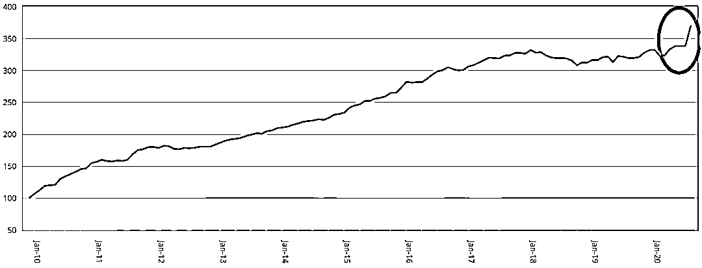
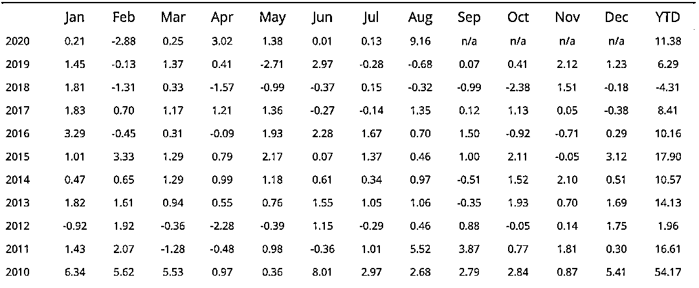

# Voleon Group：一家『纯』用机器学习策略的对冲基金

> 原文：[`mp.weixin.qq.com/s?__biz=MzAxNTc0Mjg0Mg==&mid=2653305164&idx=1&sn=97118ece092aa6b735af98b0b29d084e&chksm=802dfb59b75a724fca5c32159ffe553f2799d30f68cfafd243bd05a18c006146572cbb7e1a10&scene=27#wechat_redirect`](http://mp.weixin.qq.com/s?__biz=MzAxNTc0Mjg0Mg==&mid=2653305164&idx=1&sn=97118ece092aa6b735af98b0b29d084e&chksm=802dfb59b75a724fca5c32159ffe553f2799d30f68cfafd243bd05a18c006146572cbb7e1a10&scene=27#wechat_redirect)

**全网 TOP 量化自媒体**

**全球规模最大、表现最好、最成功的的人工智能对冲基金之一的 Voleon Group**最近受到市场冲击后，出现巨额了亏损，成为了今年众多陷入困境的 AI 驱动型基金管理公司的一员。

Voleon Group 由前 DE Shaw 交易员 Michael Kharitonov 和 Jon McAuliffe 创建，在 2019 年 AUM 为 51 亿美元，现在最新的**AUM 约为 60 亿美元**。不过今年的旗舰 Investors fund 亏失了约 9%，其最近推出的 Institutional Strategies 基金今年亏损了 1.5%。

西蒙斯老爷子的文艺复兴科技、David Harding 的元盛资本等知名量化基金今年也出现了亏损，原因是**算法难以应对极端的市场波动。**

**Voleon 它的不同寻常之处、它的声誉主要是因为其所有策略完全依靠人工智能、机器学习技术。**尽管许多量化基金公司在投资过程中会使用部分机器学习算法（有些可能辅助，有些可能还会有一些人工的参与），但很少有公司纯使用机器学习算法，其中统计套利策略就是 Voleon 应用的方面之一。

最开始 Voleon 面临的一个挑战是，需要利用每只股票的 tick 数据 ，对其进行为期 15 年的模拟。这涉及到大量的数据。他们需要几天甚至几周的时间。当时，整个 Voleon 大约有 10 到 12 个人，他们试图购买更多的算力，把 GPU 也加进来，但还是花了太长时间。McAuliffe 花了数月时间独自在办公室里，专注于错综复杂的细节。最终，他成功了！Voleon 在 2012 年 7 月推出了第二代平台系统，其在 2012 年和 2013 年分别获得了 34.9%和 46.3%的收益。

Jon McAuliffe

McAuliffe 说：**暴力方法不起作用，标准方法不起作用！**

Voleon 真是完全专注于机器学习：**它对系统买卖一只股票的原因完全不感兴趣，干就完了！**

伯克利已故统计学家 Leo Breiman 曾说过：**机器学习系统的预测性越强，人们就越难以理解它要做什么。**这一现象的根源在于，人类的思维生来就是为了理解大约 3 个维度的场景，而机器学习系统却能掌握数十个或数百个维度。它们的力量在于发现这些维度之间的联系，通常是非线性的。

McAuliffe 也表示到：这并不意味着我们不考虑正在发生的事情。Voleon 的研究人员有时会设计他们所谓的干扰算法来研究各种输入对预测系统的重要性。这种测试还可以帮助他们弄清楚，在某些情况下，它是否太过依赖历史数据而无法用于预测。在统计学上，这被称为过拟合。

同时，Voleon 的系统不仅在金融数据中寻找 Alpha，也在另类数据中寻找 Alpha。所以说**另类数据还是蛮有用的！**只是有些人不怎么会用罢了哈哈~

另类数据解读，可见公众号文章：

 

不过公众号觉得，Pure 机器学习策略还是有点难的，因为很多模型没有经济理论基础支撑。公众号认为且建立一个基于机器学习的对冲基金：**它的难度是预期的三倍，花费的时间是预期的三倍。**

但是机器学习无疑是这个对冲基金行业的一个焦点。AQR 也成立了一个部门来专门进行探索研究。尽管收益可能是**渐进式的，而非革命性的**，不过照目前情况来看，机器学习有可能成为量化投资领域下一个飞跃。

**AQR 在一份报告中详细说明了一些问题，请看：**

 

不过，Voleon 一直在加大研发力度，自今年 3 月以来已招聘了约 40 名员工。目前，该公司约有 200 名员工。

根据 Eurekahedge 的人工智能对冲基金指数最新数据显示，人工智能对冲基金今年平均上涨 14.5%。

AI 对冲基金指数

月度表现

不过，这在很大程度上是由于 8 月份基金表现异常强劲，上涨了 12.2%。

量化投资与机器学习微信公众号，是业内垂直于**Quant****、Fintech、AI、ML**等领域的**量化类主流自媒体。**公众号拥有来自**公募、私募、券商、期货、银行、保险、资管**等众多圈内**18W+**关注者。每日发布行业前沿研究成果和最新量化资讯。