# 今年的世界大学排名，有点水~

> 原文：[`mp.weixin.qq.com/s?__biz=MzAxNTc0Mjg0Mg==&mid=2653305080&idx=1&sn=e0127b43f94d6ba69893d1c251248ac8&chksm=802dfaedb75a73fb2d14d1a61b4f9d3f71c8c9e76a89396a53741d9198fa8e43c18ea40b79a8&scene=27#wechat_redirect`](http://mp.weixin.qq.com/s?__biz=MzAxNTc0Mjg0Mg==&mid=2653305080&idx=1&sn=e0127b43f94d6ba69893d1c251248ac8&chksm=802dfaedb75a73fb2d14d1a61b4f9d3f71c8c9e76a89396a53741d9198fa8e43c18ea40b79a8&scene=27#wechat_redirect)

**全网 TOP 量化自媒体**

QIML 公众号独家授权 

作者：高柏植

# 最近各种大学排名层出不穷，**在这些世界大学排名中，哪种排名的可信度相对较高？**这是近期大家很关注的一个问题。让我们**高柏植@知****乎**的精彩回答。

# 

申明：似乎有人把西北大学当成了国内的那个西北大学。不是的，这个西北大学（Northwestern University）是在美国伊利诺伊州的 Evanston。

每个排名侧重点不同，因而存在显著差异。当然，QS 这种能氪金的商业排名，可信度是更低的。那么**，怎样才能最全面、最客观、最合理的通过这些排名，找到每所大学的相对优势呢？**

考虑不同排名的侧重点，并针对所期望的指标做加权平均，可能是一个不错的办法。这里，为了得到不同指标下的世界 Top 100，我用 Python 在网上爬取了所能得到的最新的五个最具影响力的世界大学排名，即**Usnews 2020、THE 2020（泰晤士）、QS 2021、ARWU 2020（软科）、CWUR 2017（世界中心大学排名）**；以及一个 100%依据期刊论文、专利（来自 Scopus 数据库）等客观指标的学术排名，即 SCImago。对于后者，其排名指标如下图所示：

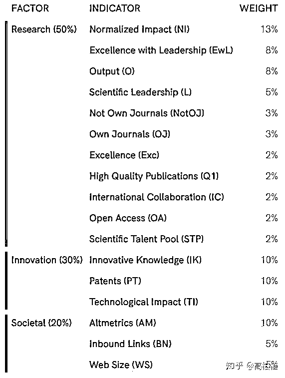

更细致的分数依据规范，可参考：

*https://www.scimagoir.com/methodology.php* 

**这里注明一下，Scopus 数据库是世界上最大最全的学术数据索引。这些被收录的期刊、专利等数据，在 SCI、SSCI、SCIE、Web of Science 等数据库外，还包含了各个国家的顶尖本土杂志，既有自然科学、工程学科等的研究论文，也有人文社科的文献。所以说，通过分析 Scopus 数据库数据的 SCImago 排名，相比于 ARWU，应该能更全面的反映一所大学的学术水平。**

现在，我们尝试一下通过这六个排名，对这些世界顶级大学做一个更客观地评价。

通过 Python 中非常好用的 BeautifulSoup 函数库，爬取各个榜单的前 120 所大学，并利用 Pandas 库的 DataFrame 函数，获取了六个榜单同时上榜（Top 120）六个、五个和四个的大学，也就是说，选取六个榜单至少有四个数据的大学。其中，横扫六榜的大学有 56 所，六中有五的大学有 80 所，最少能上四榜的大学有 101 所（可视为 Top 100），最少上一榜的大学有约 202 所，也就是 Top 120 有约 202 所大学。处理完各类指标后输出为 Excel，并做成图片如下。

**首先，我们先来看看横扫六榜、六榜有五、六榜有四的大学排名。这里需要说明一下，对于没有数据的情况（NaN），我们这里忽略掉该数据并依旧沿用同权平均的方法（比如，一组数据为 10，20，15，18，NaN，30，其数据为有效的五个数据，即 10，15，18，20，30，的平均值）。**

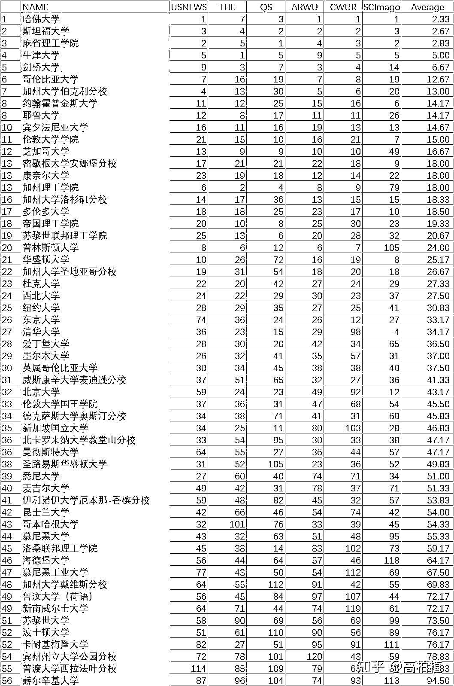

横扫六榜百二十强——普通平均排名

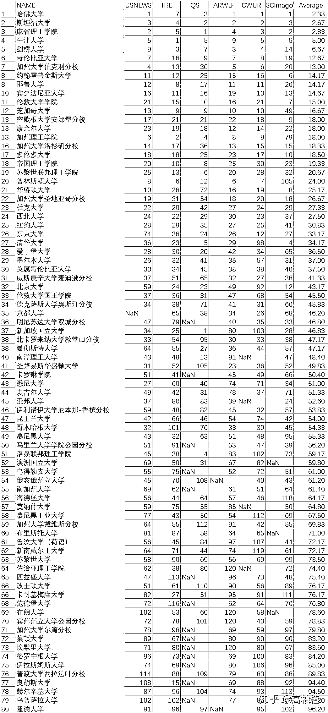

六榜有五百二十强——普通平均排名

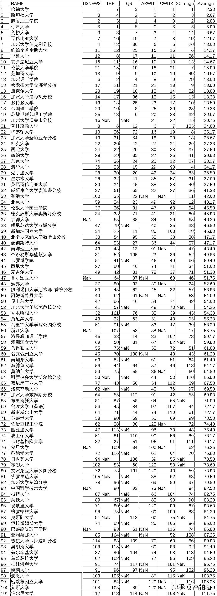

六榜有四百二十强——普通平均排名

注明，ARWU 在 100 名之后，为 101-150 的分段排名，没有明确的先后顺序，所以这里对应学校的数据，当做 120 处理。

**这里有两点是值得注意的**。第一，普林斯顿大学和加州理工学院在 SCImago 的排名中，与其他排名相比差别很大，这可能来自于其规模较小、学科不全的原因导致的，但具体的原因尚不清楚。从官网给出的评价来看，普林斯顿在 Innovation 的评分中仅占全体的前 14%、加州理工在该项中也仅占前 6%，显著拖累了整体评分。而 Innovation 评价中，Innovative Knowledge、Patents、Technological Impact 分别占据 10%的评分。我个人暂时看不出两所学校在这三个方面的弱势原因，如有大佬，请在评论区指点一二。更多的数据可以看他们的网站：University Rankings 2020。

对于第二点，我们可以看到，这样的排名方式对有 NaN 的大学是有较大优势的，相当于排除了一个超过 120 的数据，显然对“更具影响力”的横扫六榜的大学并不公平。**所以，我做了一些数据处理上的调整：考虑一所大学 NaN 外数据的均值为 X，若能排进普通平均排名的 Top 30 以内（如上图中的加州大学旧金山），每有一个 NaN，则对于该 X 的评分增加修正量 5，即其排名参考依据为 Y=X+5。对于分数段在 Top 31-45 的大学，修正量为 6；Top 45-60 的为 7；Top 61-75 的为 8；Top 76-90 的为 9；Top 90 以后的为 10。另，普林斯顿和加州理工同样依据 Top 30 以内的修正方式，而放弃对 SCImago 数据的参考。**  

上述的修正是有一定依据的：对于所选取的 Top 120，每所大学的排名期望为 60。每出现一个 NaN，则表明该数据必然大于 120，在考虑实际数据后，相比较于排除 NaN 的数据平均值 X 而言（参考期望 60），最终的参考依据 Y 的增量在 10 附近，即 Y~X+10。所以，即为了保证对 NaN 数量少的大学的公平性，也为了排除一些潜在的低排名偏见，这里的单个 NaN 最大修正值选取 10。但是，每个榜单中的大学排名数据期望为 60，不代表实际为 60，因此依据其他非 NaN 数据平均值，来推断该大学所在层次，并分层次修正 5-10 不等，如上所述。

这可能比较复杂，我以香港大学、加州大学旧金山为例：如上图所示，依据其非 NaN 数据平均值 X 排名，香港大学在第 33 位，因此一个 NaN 的修正量为 6，其最终排名依据为 Y=X+6。同样，加州大学旧金山 X 排名为 20，但是有两个 NaN，因此修正量为 5+5=10，其最终排名依据为 Y=X+10。

下图，即为考虑这样的修正后的大学排名：

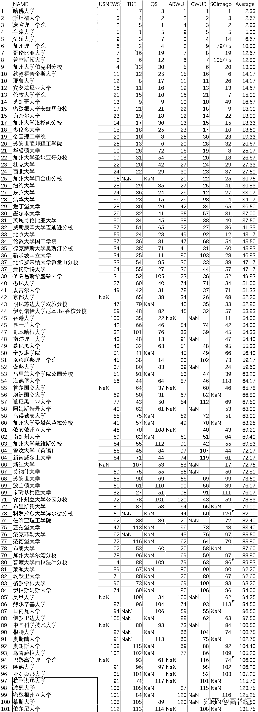

六榜有四百二十强——NaN 修正排名（同权平均） 

其实，通过上面的同权平均计算后，一些相对于其他数据方差很大的排名数据（对，我说的就是 QS），已经得到了极大的削弱。**相对于单个排名来说，上述的排名涵盖了全部六个榜单的指标，显然具有更强的参考价值。**

**通过对于横扫六榜和六榜有四排名的比较，我们也可以看到，NaN 数量最多且远远多于其他排名的是 QS（23 个）。也就是说，一部分上了四榜的顶级大学，是被 QS“歧视”的；而反过来说，QS 认可的一部分高校，其他五榜至少有三榜并不认可。这显然说明了 QS 排名与其他排名的迥然不同。其“不靠谱”的风评，看来不是空穴来风。当然了，我们也不能排除 QS 是“慧眼识珠”。**

**另外，其他五榜的 NaN 数量分别为：Usnews（6 个）、THE（7 个）、ARWU（9 个）、SCImago（10 个）、CWUR（11 个）。可见，其他五榜是比较相似的。所以，各排行榜的总体可靠性，应该大致类似于上面这样的排序。**当然了，这个数据并不能说在 NaN 少的排行榜中，大学间的相对排名，比 NaN 多的排行榜的排名更合理，所以，我这里指的是“总体可靠性”。

不管怎样，到这里，我们只能做上述这样的一个整体的定性描述。定量计算，比如计算各排行榜与平均排名的方差或标准差，是不合适的，也没有实际意义。因为，对于顶级大学，最合理的方式是区分层级，在不同层级内部，各大学实际上是轮转的，这就会在计算方差等统计学差异时，引入非常大特异性，因而数值不具有代表性。

然而，到这里还远远没有结束，接下来将是一些细化的指标排名，**包括去除偏见（去除最值）、学术水平、教育质量、学校声誉的排行。不同于原答案只处理无 NaN 的数据，为了更好的反映更多的各式各样的大学的总体水平，我这里将选择困难一些的办法，试图考虑全部六榜有四的 101 所大学（Top 100），进行上述指标的排名评价。这里，对于计算涉及到的 NaN 数据，依旧沿用上述的分层次修正方法，力图得到更加客观可靠的排序**。再举个例子明确一下，比如计算加州大学旧金山的去除偏见（去除最值）排名，这里只涉及到 21，22，25，NaN 四个数据，一个 NaN，因此取前三个数据的平均值并只做一次修正。

首先，是去掉偏见的普通平均排名，即，取**中间四位数据的平均值作为排名依据**（比如，对于一组 1，5，3，7，10，NaN 的排名数据，这里选择 3、5、7，10 的均值作为依据）。

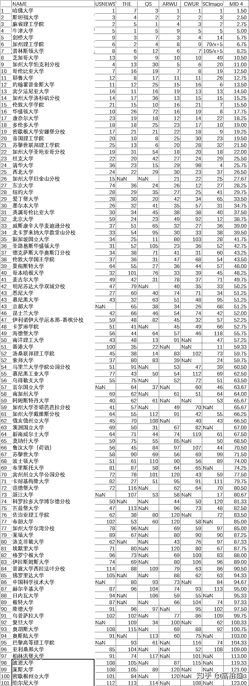

中间四值——NaN 修正排名（同权平均）

如上图所示，这样去除了一些潜在的偏见，比如 Usnews 认为的东京大学排 74，THE 认为的牛剑排前三，QS 认为的 UCB、UCLA、华盛顿大学排 30 开外，ARWU 认为的新加坡国立排 80，CWUR 认为的南洋理工排 140（NaN），或者是 SCImago 认为普林斯顿排 105。

之后，让我们来看一下，一个大学最为重要的，学术能力排名。通过不同排名给出的评分标准，我们可以看到不同排名的学术占比迥然不同：Usnews（60%）、THE（60%）、QS（0%）、ARWU（100%）、CWUR（40%）、SCImago（100%）。**因而，根据不同榜单的占比，进行加权计算，应该会帮助我们得到更合理的学术排名。需要说明的是，对于一些关键数据，比如 Usnews 的数据，有一些学校为 NaN，对于这些必要的数据为 NaN 的大学，这里只能抛弃对其数据的处理。因而，下面的排名中，将把关键数据存在 NaN 的大学排除在外。比如，对于考虑五个榜单的情况时，只有 NaN 在 QS 的大学，才会被考虑在内（加权平均的 NaN 修正，我尚没考虑出一个合适的修正方法）**。对于普林斯顿和加州理工，对于需要 SCImago 数据的排名，这里将之忽略并如上所述进行 Y=X+5 处理。

**另外，ARWU、CWUR、SCImago 排名具有一定的特殊性**。ARWU 考虑的指标，很大一部分为发表 Nature、Science 数量，以及诺奖、菲尔兹奖、图灵奖等获奖人员数量，因而过于极端。NS 数量的指标，对于有庞大医学院与附属医院、化学材料专业的机构是非常有利的，比如加州大学旧金山、哈佛大学、约翰霍普金斯大学等。而各类顶级奖项获奖人数，具有历史传统特性，同样是比较片面的，比如哥本哈根大学。这些，导致 ARWU 自己的大学评分变成了这样：第一和第二之间差了 25 分；第十之后的大学就达到了 51 分以下。就像高考分数 720 以上有 10000 个人一样，不具有差异性，因而没有足够的代表性。对于 CWUR，由于其知名度和影响力均比不上其他四个榜单，而它也专门列出了学术水平的单项排名，所以具有一定的特殊性，比如多伦多大学在其学术单项排名为 3，而综合排名为 17，具有一定的差异。

然而，由于一些榜单不提供此类单项排名，所以这里也不再考虑其单项排名。对于 SCImago，虽然其 100%依据客观的学术指标，参考范围非常广泛，也没有比较极端的评价标准，但是，其没有很大的知名度和认可度，而且对于普林斯顿和加州理工的评价也与目前的认知有些出入，因而其参考依据可能存在一些潜在的缺陷，而对其他高校的评价也可能出现一些类似的不合适的地方。

综上，由于 ARWU 和 SCImago 的特殊性，这里将 ARWU 的占比调整为 40%，SCImago 的占比调整为 60%，有如下排名。加权平均来自于**Usnews（30%）+THE（30%）+ARWU（20%）+CWUR（20%）+SCImago（30%）。**

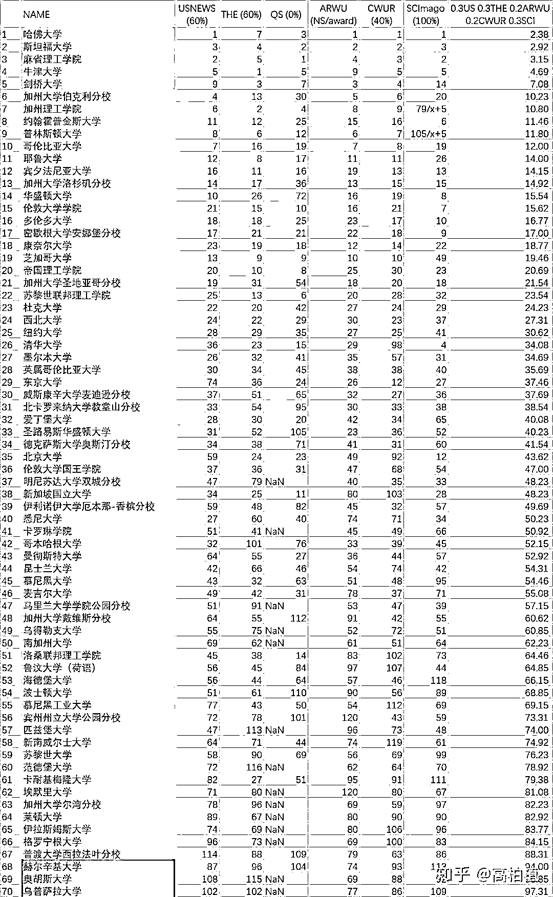

学术排名 1（五项）——加权平均排名

当然，很多人是对阿联酋的排名并不信任的。这里，单独对另外的四者做了加权平均，即，**Usnews（30%）+THE（30%）+ARWU（20%）+SCImago（30%）。**

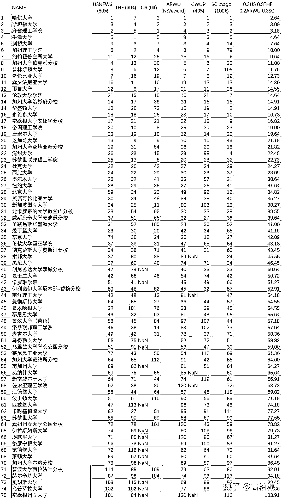

学术排名 2（四项）——加权平均排名

由于上面提到的关于 ARWU 指标的一些不合理性，这里同样有一个只有 Usnews、THE 和 SCImago 的加权平均排名，也就是**Usnews（30%）+THE（30%）+SCImago（30%）。**

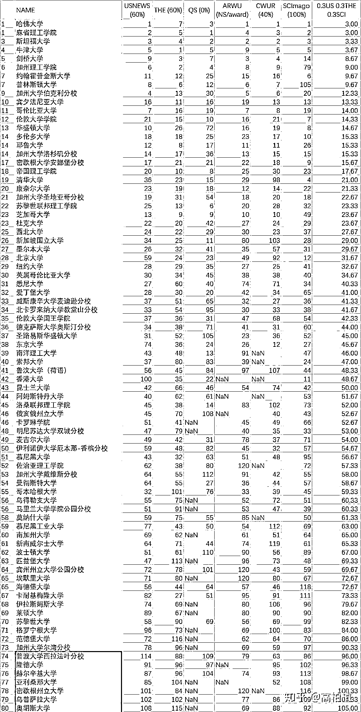

学术排名 3（三项）——加权平均排名

当然，SCImago 也有一些潜在的问题，这里还有只考虑 Usnews、THE 和 ARWU 的排名，也就是**Usnews（30%）+THE（30%）+ARWU（20%）。**

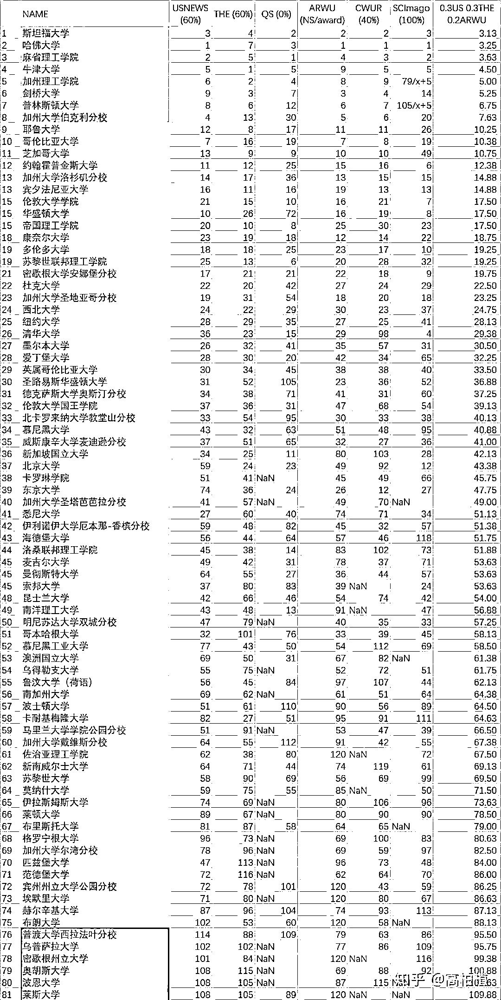

学术排名 4（三项）——加权平均排名

下面还有两个学术排名，分别考虑纯学术榜单的排名和综合榜单的排名。分别为**ARWU（40%）+SCImago（60%）和 Usnews（50%）+THE（50%）。**

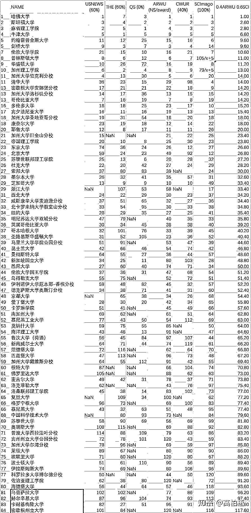

学术排名 5（两项）——加权平均排名

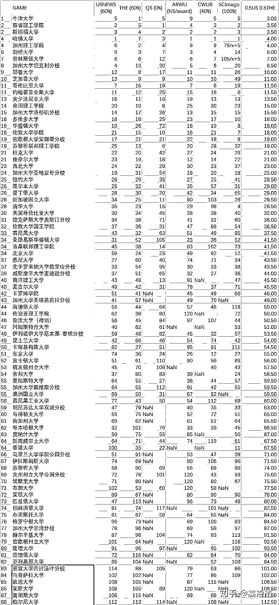学术排名 6（两项）——加权平均排名

由于不同排名，涉及到的关键数据不同，因而排名中的大学略有差异。上面的这几个学术排名，各位可以各取所需，参考自己认可的排名依据。

接下来，还有对教学质量，以及世界声誉的排行。首先，通过各个榜单对于教学质量指标的占比，可以得到，**Usnews（10%）、THE（40%）、QS（30%）、ARWU（0%）、CWUR（45%）、SCImago（0%）**。因而，这里依据这一比例做加权平均，作为指标得到教学质量排名。

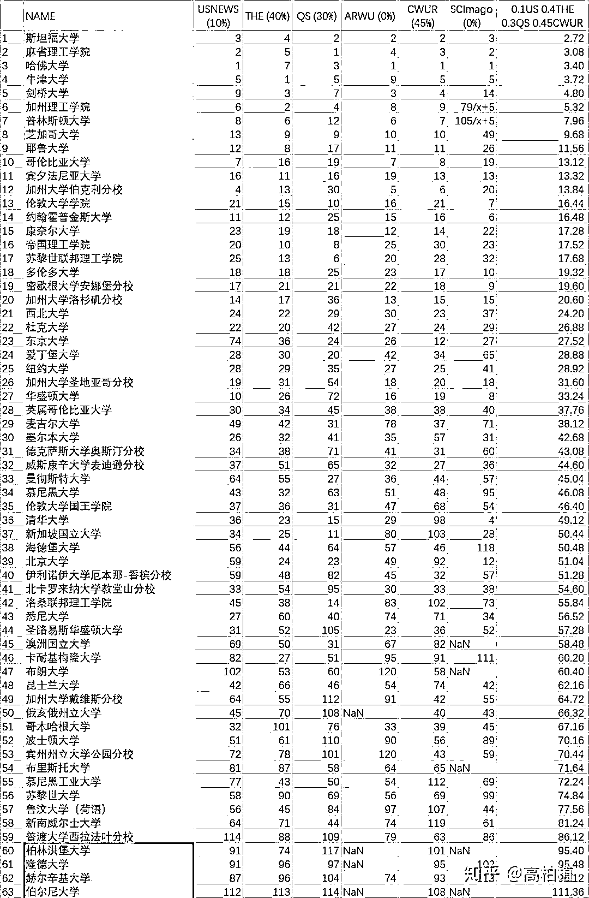教学质量排名——加权平均排名

对于大学的世界声誉，只有三个榜单参考了这一指标，即，**Usnews（30%）、QS（50%）、CWUR（20%）**。依据此，得到大学的声誉排名。

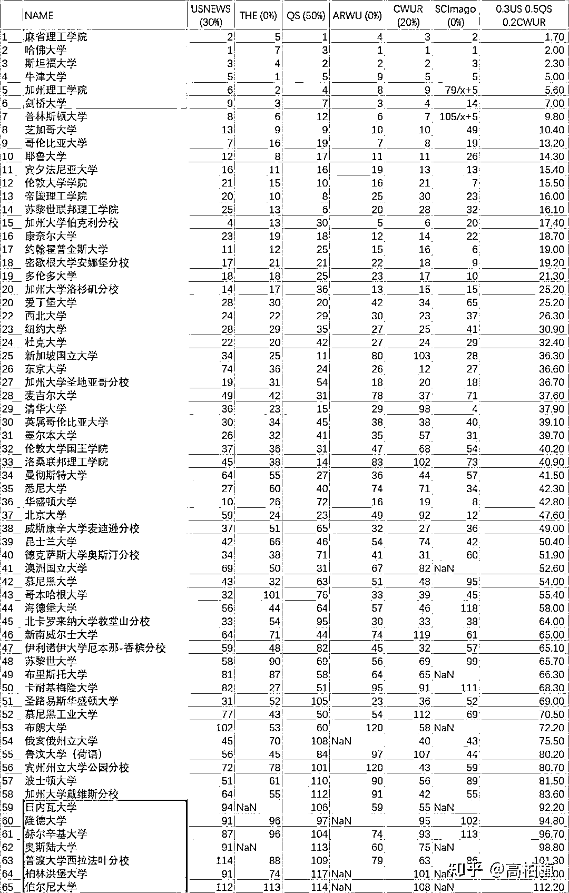世界声誉排名——加权平均排名

到这为止，科研实力、教育水平、声誉影响力的排行我们都看到了。相比于某一种单一排名，这应该是更准确、更合理的。

对上面的数据做一个总结。对于 top 25 来说，各学校的分层在各个指标下是基本不变的。top 25 以下会出现较大的变化。总体来说，可以分为几个层级，层内排名不分先后：

**Tier S（Top 5）：**

哈佛大学、斯坦福大学、麻省理工学院、牛津大学、剑桥大学

**Tier A+（Top 10）：**

加州大学伯克利、加州理工学院、普林斯顿大学、哥伦比亚大学、芝加哥大学、耶鲁大学、约翰霍普金斯大学

**Tier A（Top 20）：**

加州大学洛杉矶、密歇根大学安娜堡、多伦多大学、华盛顿大学（西雅图）、宾夕法尼亚大学、康奈尔大学、伦敦大学学院、帝国理工学院、苏黎世理工学院

**Tier B+（Top 25）：**

西北大学、杜克大学、加州大学圣地亚哥、纽约大学

**Tier B（Top 50）：**

东京大学、京都大学、新加坡国立大学、南洋理工大学、清华大学、北京大学、香港大学、英属哥伦比亚大学、麦吉尔大学、慕尼黑大学、洛桑联邦理工学院、苏黎世大学、哥本哈根大学、爱丁堡大学、伦敦大学国王学院、曼彻斯特大学、加州大学旧金山、德克萨斯大学奥斯汀、威斯康辛大学麦迪逊、伊利诺伊大学 UC、圣路易斯华盛顿大学、明尼苏达大学双城、北卡罗来纳大学教堂山、卡耐基梅隆大学、波士顿大学、布朗大学、加州大学戴维斯、墨尔本大学、悉尼大学、昆士兰大学

**Tier C+（Top 100）：**

加州大学 SB、马里兰大学帕克、科罗拉多大学博尔德、南加州大学、俄亥俄州立大学、宾州州立大学、密歇根州立大学、普渡大学、莱斯大学、加州大学尔湾、佐治亚理工学院、洛克菲勒大学、埃默里大学、佛罗里达大学、亚利桑那大学、海德堡大学、日内瓦大学、鲁汶大学、索邦大学、范德堡大学、匹兹堡大学、洪堡大学、波恩大学、莱顿大学、格罗宁根大学、奥斯陆大学、奥胡斯大学、隆德大学、乌德勒支大学、赫尔辛基大学、伊拉斯姆斯大学、新南威尔士大学、莫纳什大学、卡罗琳学院、伯尔尼大学、首尔国立大学、澳大利亚国立大学、慕尼黑工业大学、阿姆斯特丹大学、浙江大学、复旦大学、中国科学技术大学、布里斯托大学、根特大学、巴黎高等理工学院

接下来，我将做些有趣的分析，比如每所大学对于氪金的想法，当然，只是为了消遣，切勿当真。首先，有些大学受到资金、地理位置等的限制，或者喜欢本国排名，可能只喜欢氪一个榜单。这里，通过六个榜单最小值作为依据，进行排名。（这可以理解为，只要集中金钱氪大事，使劲氪一个排行榜，就能排得更高。）

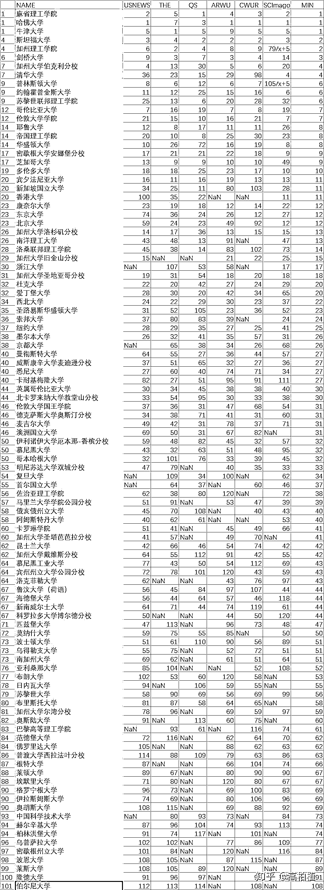死氪一家——最小值排名

接下来，让我们看看有钱的学校。有些学校是比较有钱的，愿意多氪几家，并且氪到国外排行榜上。这么说是因为，对于六个榜单，最多有一个国家发布两个榜单的情况，即，英国。因此，这里取六个排名的中位数。（这可以理解为，需要至少氪三到四个排行榜，大于英国的两个，因而，大学必须要氪到国外排行榜，才能获得更高排名。）

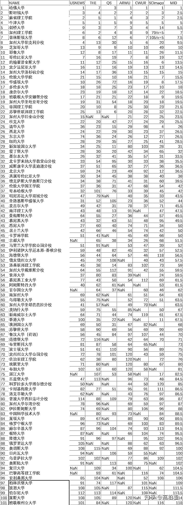氪到外国——中位数排名

当然，不差钱的大学也是不少的，往往，他们哪个排名都氪。因此，这时，不得不考虑六个排名数据的最大值。（这可以理解为，必须六个都氪，且氪得多，才能保证任意一个排行榜不拉低他的排名。）

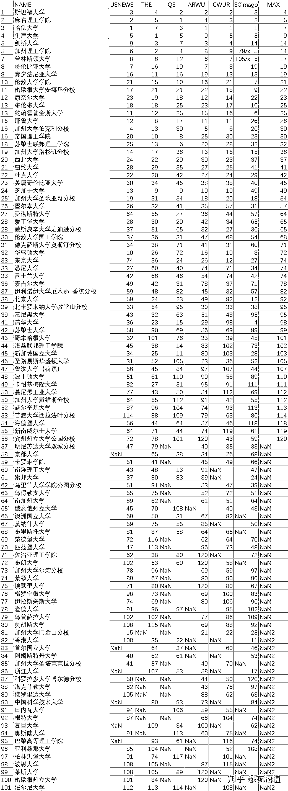每家都氪——最大值排名

以上三个，只是笑谈。

量化投资与机器学习微信公众号，是业内垂直于**Quant****、Fintech、AI、ML**等领域的**量化类主流自媒体。**公众号拥有来自**公募、私募、券商、期货、银行、保险、资管**等众多圈内**18W+**关注者。每日发布行业前沿研究成果和最新量化资讯。