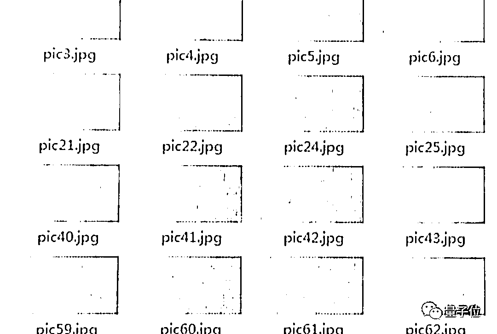

# 一个神经网络电饭煲卖 2 万，我的米不配！

> 原文：[`mp.weixin.qq.com/s?__biz=MzAxNTc0Mjg0Mg==&mid=2653305017&idx=1&sn=56cf7b6219c4a5ddf07c656fcd9cc002&chksm=802dfaacb75a73ba5f89746f3cce48f76b480dba913efcf4e3440a11acafeeb86adc31f60aaa&scene=27#wechat_redirect`](http://mp.weixin.qq.com/s?__biz=MzAxNTc0Mjg0Mg==&mid=2653305017&idx=1&sn=56cf7b6219c4a5ddf07c656fcd9cc002&chksm=802dfaacb75a73ba5f89746f3cce48f76b480dba913efcf4e3440a11acafeeb86adc31f60aaa&scene=27#wechat_redirect)

**全网 TOP 量化自媒体**

什么样的电饭煲，**折扣价**19999？

当然是**AI 电饭煲**！

CNN 神经网络加持，能**速算十万级大米信息**，不仅能自动识别米的品种，煮出一锅水米配比最智能的饭，还能把量米、洗米、加水、煮饭全程自动化。

或许，你已经不能叫它电饭煲。看看它的官方命名——

**COLMO BLANC 煮饭机器人**

这样一款产品，来自美的旗下高端品牌 COLMO，号称诞生于「欧洲之巅勃朗峰」，要为消费者带来「兼具至臻品质和**自主学习能力**的 AI 科技家电」。

（仿佛每一个字，都吞吐着金钱的芬芳，你细品，你细品）

炒概念？智商税？不不不，COLMO 还是相当有诚意的，买下这款电饭锅，就送**戴森吸尘器。**

另一款售价 69999 的**AI 冰箱**，还送**万元 Gucci 包**呢！

简直买到就是赚到。

***1***

**AI「黑科技」加持的天价电饭煲**

一个电饭煲，凭什么能卖 2 万？

用商家的话来说，就是「**黑科技，懂人心**」。

首先是在**大米**上，下足了功夫——识米技术。

用到了人工智能技术中，非常经典的卷积神经网络（CNN），结合 8mm 近焦显微透视 AI 摄像头，号称仅用 1 微秒，就能够计算**10 万级**大米的信息。

除了能够辨别 15 种市场常见大米的种类之外，还可以识别它的**胶稠度、直链淀粉、感官、水分等细节信息。**

（瞬间感觉每粒大米都有了鲜活的饭命）

第二大亮点，就是**全自动**。量米洗米都不用自己动手的那种。

例如全自动「螺杆精准量米」。

以 14m/s 的速度，全自动「风梭**进米**」。

用气泡水全自动**洗米**。

还能全自动精准调配**米和水的比例**。

当然，**火候**也是重中之重。

按照 COLMO 的说法，「一米一曲线」，每种米都应该拥有专属的烹饪曲线……

看到这里，再看看你家的电饭煲……是不是感觉吃个饭都变难了。

但别急，不仅是吃饭，COLMO 还会让你感觉**冰箱**都用不起——售价**69999 元**。

也是结合 AI 摄像头，还利用**深度学习算法**，10 微秒瞬间计算、识别食材，而且还号称**算法自进化**，越用越精准。

而售价如此的冰箱亮点就是——**定制膳食营养管理、远程管理食材。**

…..

在如此「黑科技」加持的电饭煲、电冰箱面前，是不是觉得自家的家用电器都弱爆了？

***2***

**天价家电背后的「黑科技」**

看完 COLMO 介绍的产品之后，不难发现，其所指的「黑科技」，无非就是用 CNN 来做**图像识别**。

CNN 我们都比较熟悉，是一类包含卷积计算，且具有深度结构的前馈神经网络。

因为 CNN 自身的设计特点，在图像识别之类任务中具有较大的优势，工作流程大致如下：

但与正常的人脸识别等不同，**大米识别**的难点在于，每一粒大米的**体积都很小**，而且也没有非常明显的**特征区别**。

这对大米识别技术来说，确实是一种考验。

但据公开报道，早在 2017 年，便已经有了「大米识别」相关的技术。

研究人员在**几十万张**大米图片上进行训练，最终实现了「识米」的目标，当时便已经能够识别 15 种类型的大米。

而且，目前市面上的一些智能电饭煲，也能对不同大米定制相应的烹煮方式。

***3***

**美的旗下的高端品牌**

所以，带来这些产品的 COLMO 是什么来头？

这是一个美的在 2018 年底推出的高端品牌，产品定位是「AI 科技家电」。

在 COLMO 上，美的寄托了其对于高端家电市场的野心。在发布 COLMO 的同时，美的创始人何享健为美的定下的奋斗目标是：年营收、公司市值双双超过 5000 亿。

在中国家电及消费电子博览会 AWE 2019 上，美的中央研究院院长徐成茂介绍，在 COLMO 产品制造过程中，全面引入了 AI 技术，以向用户交付高品质科技体验。

不仅是电饭煲、冰箱，其产品涉及各类家用电器，包括空调、洗衣机、热水器……

不同的是品类，相同的是定位：**高端、AI**这样的字眼频频出现在品牌的宣传之中。

甚至连生产线，都要强调「人机双轨」AI 定制。

***4***

**网友：我的米不配下锅**

所以，这样的高端 AI 家电有没有人买呢？

虽然月销是 0 吧，但是隔个 3、5 个月，还真有人买。

不信你看买家秀：

竟然还能外接电视……

正如即刻网友@大概是 Pro 所说：电饭煲 2000 + AI 标签 1000 + 机器人标签 2000 + 「精鉴自配」2000 + CNN 标签 5000 + 连米都不用淘了 4000 + IH 舞动烹饪——大米都活了 1000 + 信仰无价 10000，共计 2.7w，现在居然连 2w 都不要，太便宜了！

更何况售价也在 1、2 万的日本进口电饭煲们，还没有 CNN 识大米的技能呢。

只不过，还有网友说出了我的心声：我怕我的米不配下锅。

所以，小米考不考虑出个平民版，让 AI 走进一下年轻人的生活呢？（手动狗头）

最后，如果你还见过其他类似的「天价高科技家电」，欢迎在评论区留言~

量化投资与机器学习微信公众号，是业内垂直于**Quant****、Fintech、AI、ML**等领域的**量化类主流自媒体。**公众号拥有来自**公募、私募、券商、期货、银行、保险、资管**等众多圈内**18W+**关注者。每日发布行业前沿研究成果和最新量化资讯。