# 机器学习与情绪交易（附代码）

> 原文：[`mp.weixin.qq.com/s?__biz=MzAxNTc0Mjg0Mg==&mid=2653304994&idx=1&sn=f1006336c28c943e49c717918bfcde96&chksm=802dfab7b75a73a1b86b0c6e56d8721b55f577a11a6a99a0bb1a234365f82ec71f3c52a2fd0b&scene=27#wechat_redirect`](http://mp.weixin.qq.com/s?__biz=MzAxNTc0Mjg0Mg==&mid=2653304994&idx=1&sn=f1006336c28c943e49c717918bfcde96&chksm=802dfab7b75a73a1b86b0c6e56d8721b55f577a11a6a99a0bb1a234365f82ec71f3c52a2fd0b&scene=27#wechat_redirect)


**全网 TOP 量化自媒体**

作者：Steven       编译：方的馒头

***1***

**本文要点**

*   如何将多个分类机器学习模型构建为一个复合集成模型。  
*   使用时间序列拆分和随机交叉验证进行类型参数调整。
*   在评估模型的质量时，探索重要的分类指标，例如 F1 得分和准确性。
*   可以在多种策略中应用的投资组合性能和构建代码，将实际交易成本考虑在内。
*   如何使用单一热编码构建特征集。
*   发现是否可以通过基本的机器学习模型预测短期价格走势。

如果一个结合了不同情绪信号的机器学习模型可以创建一种有利可图的策略会是怎么样呢？ 

***2***

**文献综述**

随着社交媒体的出现，分析人员已使用社交媒体分析和自然语言处理来提取特定公司周围的情绪，像 Ravenpack 等公司在长期处于高积极情绪的公司和处于短期消极情绪的公司中发现了 Alpha。他们发现，多头/空头十分位数和底部十分位数投资组合在 2 至 3 天的时间内有 50 bps 至 100 bps 的收益。 

J.P. Morgan 最近的一篇基于 NLP 的 A 股交易策略发现 ChinaScope（数库）的新闻情绪因子在 A 股中表现强劲。[JPMorgan 最新报告解读：基于 NLP 的 A 股交易策略（附下载）](http://mp.weixin.qq.com/s?__biz=MzAxNTc0Mjg0Mg==&mid=2653303713&idx=1&sn=f6dfd1d473421430e54847644f51272c&chksm=802df1b4b75a78a2a01fd8ac58a608eb4d8ab44b723ecccc84a6b92de967adb9237280191961&scene=21#wechat_redirect)

Shlaefer 发现存在 1 到 12 个月的低估（股价在好消息传出后上涨，在坏消息传出后下跌）表明投资者处理新信息需要时间，但在 3-5 年内，投资者反应过度并为此一系列的正收益付出了太多，而忽略了公司基本面的均值回归性质。

Baker 和 Stein 发现，一段时间的高流动性和较小的买卖价差会导致较低的未来收益。由于非理性投资者倾向于使市场更具流动性，流动性指标提供了这些投资者相对存在或不存在的指标，从而提供了相对于基本面的价格水平。

Baker 和 Stein 假设，对投资者情绪最敏感的股票将是那些更年轻、规模更小、波动性更大、无利可图、无股息支付、陷入困境或具有极高增长潜力或具有类似特征的公司。而“类债券”股票将较少受到市场情绪的驱动。他们发现，对于那些年轻、高波动性、近乎财务困境且无利可图的小盘股，情绪可能是一个强有力的短期反向指标。具体而言，在这组公司中，当情绪比其历史平均水平低一个标准偏差时，它们的月平均收益为-0.34％，而当情绪比其历史平均水平高一个标准偏差时，月平均收益为则为 1.18％。

Borovoka 和 Dijkstra 在深层神经网络模型中根据各个指数公司周围的高频新闻情绪预测 EURO STOXX 50 价格走势时，实现了 60％的准确性。

Tetlock 发现，根据《华尔街日报》的“市场并购”专栏衡量，媒体情绪是几天来总体股市收益的确认指标，尤其是小型股票。此外，他发现市场悲观情绪异常高或低导致高交易量。

***3***

**数据与方法**

没有一项研究调查由总体投资者情绪驱动的特定行业影响，因此我们很好奇地探索了这一点。 

我们利用了 9 种 SPDR 部门 ETF（XLU，XLK，XLB，XLI，XLV，XLF，XLE，XLP，XLY）于 1998 年 12 月成立，提供了 Yahoo Finance 超过 21 年的每日 OHLC 和交易量数据。请注意，免费数据（例如 Yahoo Finance）并非总是最干净的价格数据，但我们将其保持原样，以便你可以以最低成本使用该代码，以防你想添加其他 ETF 或股票 tickers 来测试模型。

我们还利用了 Sharadar、圣路易斯联邦储备银行、杜克大学、芝加哥期权交易所、密歇根大学、经济政策不确定性和将 scikit-learn python 库中的多个分类机器学习模型组合成一个集合分类，我们希望与任何单个模型相比，多样化的模型在样本内的表现良好。

将数据集分为训练集、验证集和测试集：

1、训练/验证（样本内）——数据开始至 2013 年底，训练包括样本内 80％的数据，验证其余 20％的样本内数据。

2、测试（样本外）—— 2014 年 1 月– 2020 年 5 月。

***4***

**问题**

我们将尝试回答的问题： 

1、在什么时间段内，基于情绪的行业收益最可预测？由于 OHLC 和交易量数据较高，所以我们只能在第二天开盘时买入，而在 n 天后平仓。

2、在最终的集成模型中应使用哪些模型进行组合？

3、哪些超参数最适合预测样本数据？

4、结合最佳模型后，机器学习投资组合在扣除交易成本后是否会表现出色，因为这将是高周转策略？

5、该模型能否胜过被动的买入并持有策略？

***5***

**构建特征集**

以下内容构成了特征集，算法将从该特征集预测期望值，即证券在 n 天内具有正收益还是负收益。

1、市场成交量（占一天流通的总股份的百分比）2、上涨/下跌比率（总股数增加/股数减少）3、简单的移动平均线/价格在 2 到 22 个交易日内迭代 4、年化标准差在 2 至 22 个交易日内迭代 5.、VIX6.、萨赫姆法则（Sahm Rule）——它在实时预测衰退方面很有用 7、投资级别——高收益企业债券利差 8、政治不确定性指数 9、杜克首席财务官乐观指数 10、看跌/看涨比率 11.、所有投资者情绪指数 12、密歇根大学消费者情感指数 13、耶鲁/席勒投资者情绪指数

***6***

**一种热编码**

我们很好奇各个行业的 ETF 在同一特征集下是否表现不同，因此我们使用一种热编码为每个 ETF 创建列（如果使用，则为 1，否则为 0）。 

pandas 数据帧的最终特征和值如下所示，然后将其转换为 NumPy 数组。

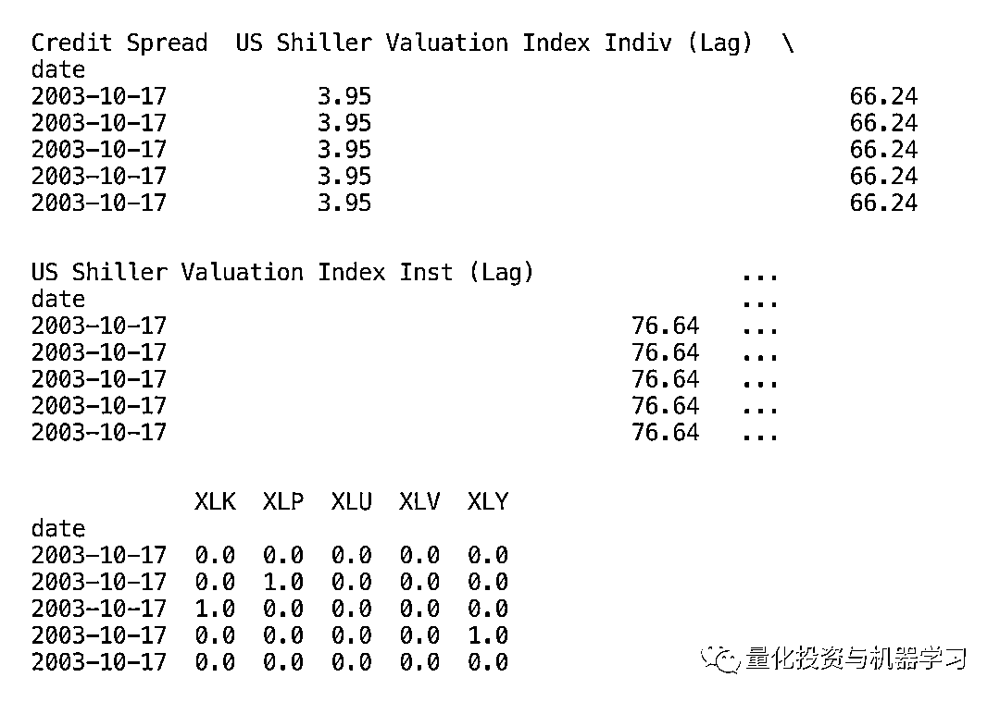

***7***

**创建训练、验证和测试集**

你可以轻松地创建训练和验证集，请注意需要设置 shuffle = False，以防止由于财务数据不是独立的而导致数据改组，而改组可能导致模型过拟合。我们想做的是将我们的样本数据（训练和验证）保存在一个 python 文件中，并将输出样本数据（测试）保存在一个单独的文件中，以防止任何欺骗和展望未来的诱惑。

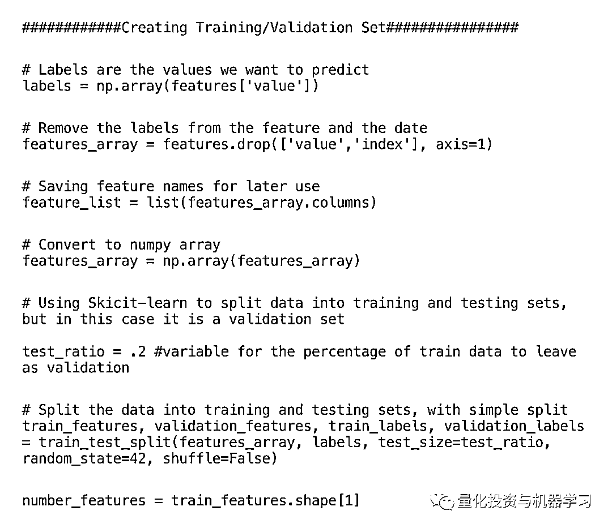

***8***

**组合和选择持仓日的模型**

使用以下分类器在 1-30 天的持仓期内进行准确性测试： 

*   AdaBoost
*   随机森林
*   梯度增强
*   高斯过程
*   K 最近的邻居
*   MLP 神经网络
*   支持向量机（SVC）

在逐步浏览分类气泡中的 scikit-learn 算法备忘单时，我们特别选择了以上这些。

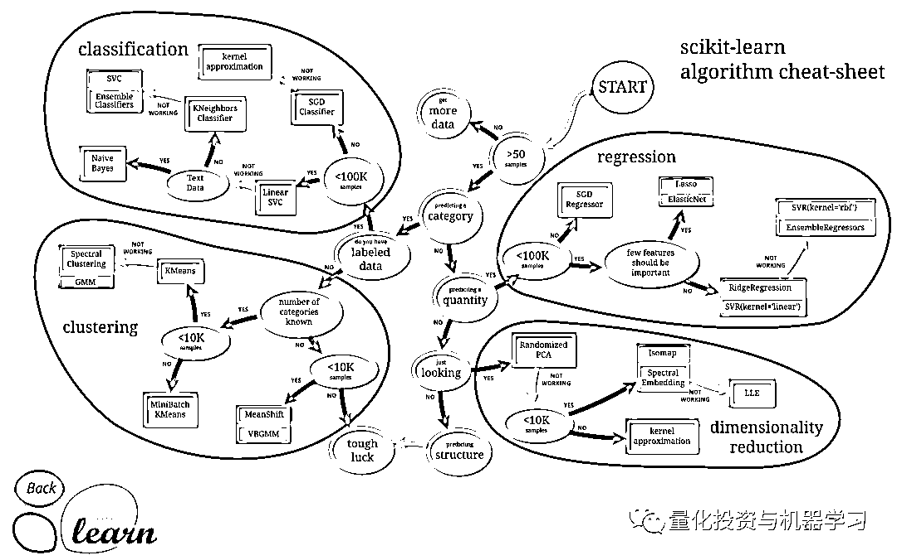

每个模型都是基于 F1 得分、准确性得分（正确预测的百分比）以及两者的平均值进行测试。我们选择消除 SVC 和 MLP 神经网络模型，因为它们的组合得分最低，分别为 0.516 和 0.521。接下来，我选择将重点放在 3 天的持有期上，由于算法能够很好地预测时间范围，并且假设模型是好的，那么有更多的交易机会将可以很好地服务于它，尽管该模型受交易成本的限制。下表使用条件格式来直观地显示高低分数，标准差使用红色的公式单独表示。我们想看到的是所有模型之间的高平均分数和低标准偏差，这向我们表明，特征集中有待提取的信号，并且算法能够可靠地访问它。

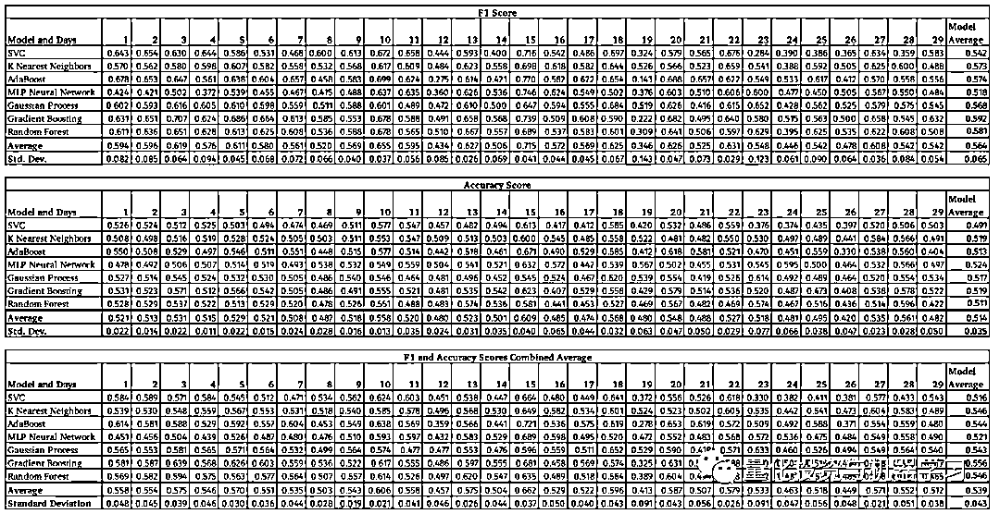

注：单元格用颜色编码，深绿色表示得分较高，最下面的行表示模型的标准偏差，以区分模型之间的稳定性，深红色表示较低的标准偏差。

***9***

**超参数调整和交叉验证**

我们将在 sci-kit 学习库中使用时间序列拆分和随机交叉验证搜索功能进行超参数调整。时间序列拆分（也称为前行方法）是为时间序列数据设计的，因为它通常不是独立的且分布均匀。 

然而，正如 De Prado 在《Advances in Machine Learning》中提出的那样，挑战在于即使部分数据是在整体数据中的一小部分进行训练的，交叉验证功能也会对所有分数进行加权。为了解决这个问题，我们决定根据总使用次数的分数权衡交叉验证得分（即交叉验证为 5 次时，最后一次测试的得分为 5 /（5 + 4 + 3 + 2））。

De Prado 提出的另一个问题是，需要在交叉验证方法中清除训练/验证分离的段边缘附近的数据，以最大程度地减少测试和训练组之间相互泄漏的数据。我们试图利用他的 purgedKfoldCV 函数，但无法做到，由于每个时间点都有多个数据点的事实，以及我们同时关注 9 个行业 ETF 的事实。

F1 得分是主要指标，由精确度和召回率的调和平均值组成，在交叉验证期间，它将通过该平均值来测试模型的精确性。

使用“随机 CV 搜索”函数，我们将提供一系列参数供你随机选择，然后分离最佳评分组合，然后在验证集上使用。具有最高（且希望不相关的）预测能力的算法将在多数投票系统中组合以创建最终的预测系统。

以下是我们从 Will Koehrsen 的一篇文章中摘录并适应我们的目的的随机森林算法的随机搜索参数示例。

```py
#### Create 5 K Fold Split Time Series ####
number_of_splits = 5
tscv = TimeSeriesSplit(n_splits=number_of_splits)

#####Randomized CV for Random Forest using Timseries split #######

# Number of trees in random forest
n_estimators = [int(x) for x in np.linspace(start = 200, stop = 2000, num = 10)]
# Number of features to consider at every split
max_features = ['auto', 'sqrt']
# Maximum number of levels in tree
max_depth = [int(x) for x in np.linspace(10, 110, num = 11)]
max_depth.append(None)
# Minimum number of samples required to split a node
min_samples_split = [2, 5, 10]
# Minimum number of samples required at each leaf node
min_samples_leaf = [1, 2, 4]
# Method of selecting samples for training each tree
bootstrap = [True, False]
# Create the random grid
random_grid = {'n_estimators': n_estimators,
                'max_features': max_features,
                'max_depth': max_depth,
                'min_samples_split': min_samples_split,
                'min_samples_leaf': min_samples_leaf,
                'bootstrap': bootstrap}
print(random_grid)
# Use the random grid to search for best hyperparameters
# First create the base model to tune
rf = RandomForestClassifier(n_jobs=-1)
# Random search of parameters, using time series split, 
# search across 100 different combinations
rf_random = RandomizedSearchCV(estimator = rf, param_distributions = random_grid, n_iter = 100, cv = tscv, verbose=2, random_state=42, \
                                    scoring='f1')
# Fit the random search model
search_rf = rf_random.fit(train_features, train_labels)
search_rf.best_params_
search_rf.cv_results_
search_rf.best_score_
search_rf.best_estimator_
search_rf.scorer_ 
```

一些随机搜索花费了一段时间，例如在我们的 Mac 上（16GB 内存和 2.9GHz 双核英特尔酷睿 i5）在 77 分钟的“随机森林”和在 144 分钟的“梯度增强”。大家可以尝试使用基于直方图的梯度升压分类树，该树被设计为在大型特征集上更快。

***10***

**特征重要性和模型多样化**

使用“随机森林”和“梯度增强”，大家可以看到每个特征的相对重要性（以百分比表示）。

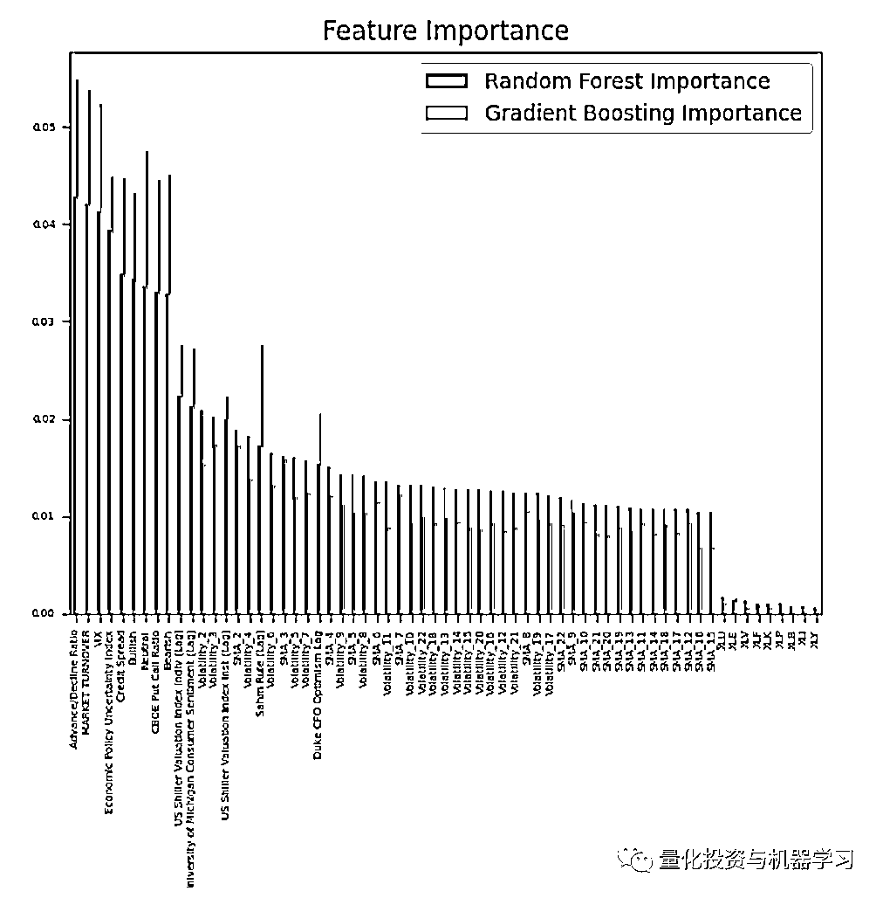

**观察：**

1、在最右侧，我们看到这些模型在 ETF 是否为特定行业 ETF 中几乎没有用处。

2、毫无疑问，在 3 日收益率中具有最高预测的波动率特征是 2 日和 3 日的波动率。

3、整体市场动态（例如上涨/下跌和市场成交量）对于预测未来 3 日的收益最有用。

五个模型的组合确实提供了多元化，如下面的相关矩阵所示，这很有意义，因为它们使用了不同的数学算法来基于特征集进行分类。

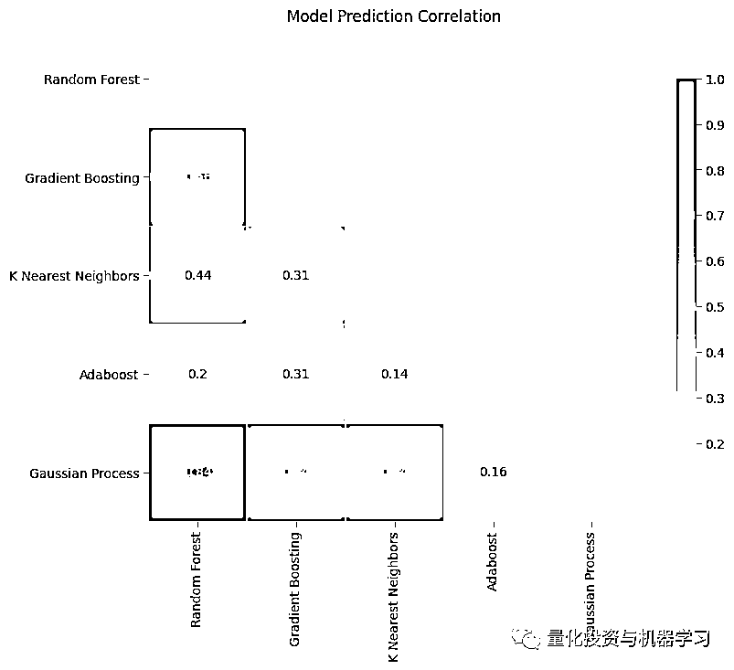

***11***

**投资组合实现**

结合所有 5 个模型的预测后，我们创建了一个多数投票系统。接下来，我们在训练和验证数据集上运行该策略，并与同等权重的投资策略进行比较。

设置实现投资组合所需的变量：

```py
#########  Portfolio Construction  ########
Predictions_DF = features.iloc[:,(-len(tickers)-1):]
#Using the same in sample dates here and for equal weight benchmark
f_date = datetime.datetime.strptime(In_Sample_Start, '%Y-%m-%d')
l_date = datetime.datetime.strptime(In_Sample_End,  '%Y-%m-%d')
delta = l_date - f_date
#Choose the number of periods (days in range / the forecasted return days)
period_delta = np.floor(delta.days/(Number_days_to_hold))
period_delta = int(period_delta)
first_period = In_Sample_Start #using f_date
returns_df_portfolio = pd.DataFrame()
row_length = Predictions_DF.shape[0]
Portfolio_Turnover = pd.DataFrame() 
```

创建一个遍历数据并执行交易的 for 循环：

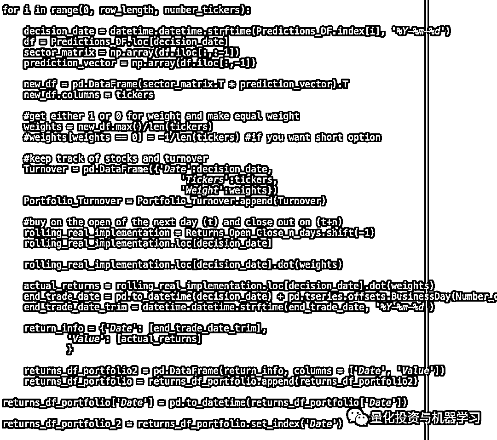

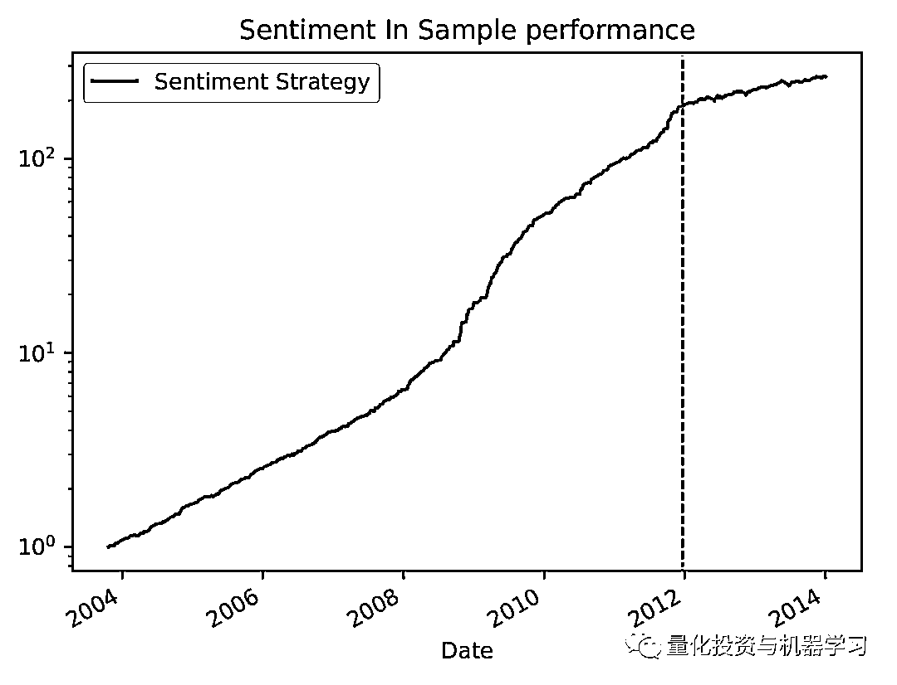

注意：y 轴是对数刻度，红线表示验证集的开始

如你所见，示例中的与预期的验证集相比过度拟合，因此，我们解析了图表以说明不同之处。

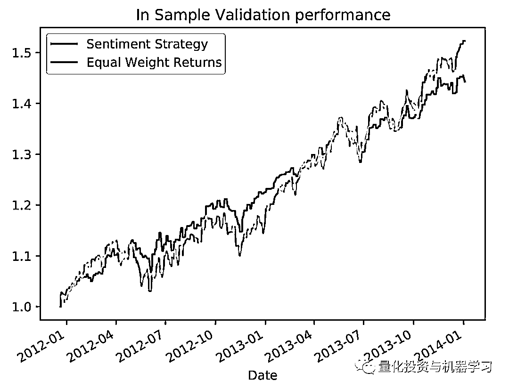

该策略具有更高的风险调整后的收益，这由更高的夏普比率表示，但在其他方面并没有实质性的改善。

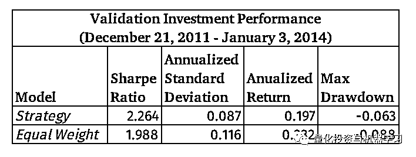

***12***

****测试数据****

下面是有关模型分类的统计数据，最后一行显示了如果我们假设市场将永远上涨（这类似于始终进行充分投资），结果将是什么。

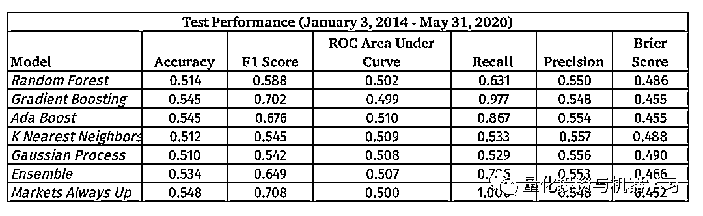

注：每列中的最佳分数以红色突出显示

“市场总是上涨”的买入并持有取向的是普遍赢家。

从下面的混淆矩阵中可以看出，集合模型在预测未来收益何时为正（右下）方面比预测何时收益为负（左上）做得更好。

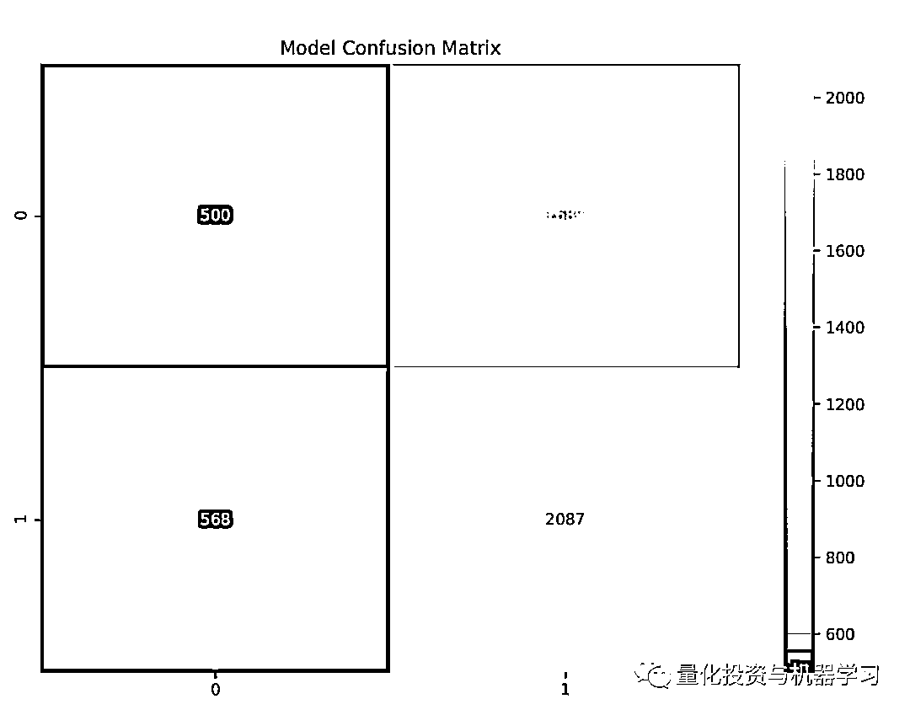

以下是使用测试数据（2014 年 1 月至 2020 年 5 月）的策略实际效果的图表。

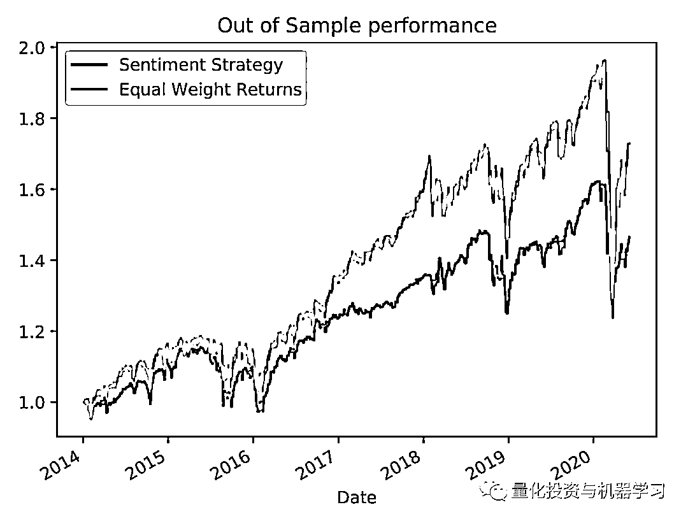

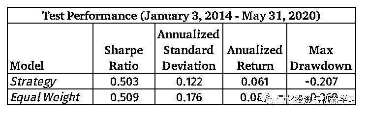

该模型执行了 1074 次单向交易，并假设有 1 美元的交易佣金和 15bps 的市场影响和下滑成本，实际成本将使 1000 万美元投资组合的总业绩减去 17.9％和 1,074 美元，导致年化收益为 1.3％，远低于不切实际的年化收益 6.1％。

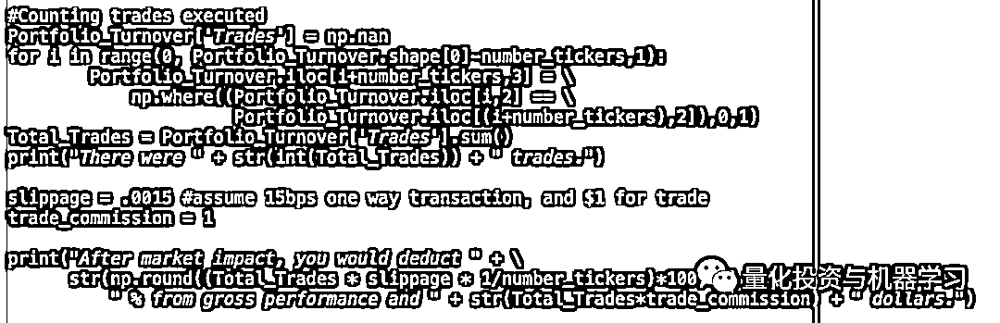

***13***

**总结**

**1、集合模型在预测上涨天数方面做得很好，但是在高交易成本之后，它并没有带来任何出色的风险调整后性能。**

2、以 53.4％的精确度为证据，该模型的确比随机概率做得更好，但是市场有 54.8％的时间上涨，因此，如果你有一个简单的论题“市场将会上涨”，那么你会有更高准确性得分。

3、机器学习模型能从市场内部特征（例如市场交易额）中提取一些信号，但是最终，它并没有创建优于天真的“总是被投资”模型的预测模型。

4、基于前面提到的其他相关研究，我们希望机器学习模型能够从特定于股票的社交媒体分析、小盘股和微型股中提取出更有意义的信号，并通过深度神经网络提高整体精确性。

量化投资与机器学习微信公众号，是业内垂直于**Quant****、Fintech、AI、ML**等领域的**量化类主流自媒体。**公众号拥有来自**公募、私募、券商、期货、银行、保险、资管**等众多圈内**18W+**关注者。每日发布行业前沿研究成果和最新量化资讯。