# 同济版《线性代数》引发激烈争议！

> 原文：[`mp.weixin.qq.com/s?__biz=MzAxNTc0Mjg0Mg==&mid=2653304959&idx=1&sn=86481bf31d4a24febd82096a61fb1261&chksm=802dfa6ab75a737c03cc59ba518efc760d2785a5276a5f7c932c2ffe8ae148664b636bcd0cfe&scene=27#wechat_redirect`](http://mp.weixin.qq.com/s?__biz=MzAxNTc0Mjg0Mg==&mid=2653304959&idx=1&sn=86481bf31d4a24febd82096a61fb1261&chksm=802dfa6ab75a737c03cc59ba518efc760d2785a5276a5f7c932c2ffe8ae148664b636bcd0cfe&scene=27#wechat_redirect)

**全网 TOP 量化自媒体**

来自：机器之心

你的线性代数，过了没？ 

不论是结构力学还是人脸识别，理工类型的科研，深究之后就会发现到处都是线性代数的身影。这样一门课程，要是在大一的时候学不好，可是会要命的。在国内上过大学的理科同学应该都见过《线性代数》（同济版），就算没有学过，也是听过它的大名。作为一名过来人，只能说，晦涩难懂，章节混杂... 即使不少 985、211 走过高考独木桥的学生，每到期末考试，也要默默祈祷不要挂科。现在想起一些内容：相似矩阵、线性变换、特征值、特征向量…… 真是一个头两个大。

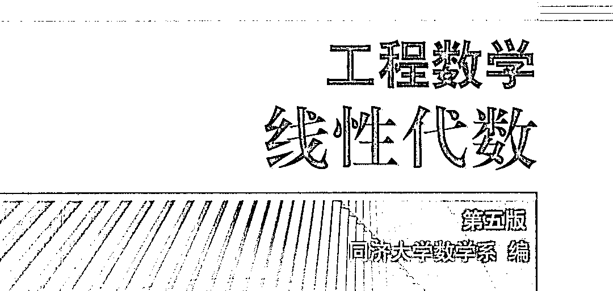

作为一本大学教材，让学习者如此后怕，是该考虑一下教材问题了。如今已经毕业多年，没想到最近在知乎上看到一篇文章《《线性代数》（同济版）——教科书中的耻辱柱》，点赞量快突破五千。对于这篇文章，大家有时间可以读一下，看看是不是同意作者的观点。 线性代数真的很重要，这是很多工程技术人员走上工作岗位的最大感受。好多算法都用到线性代数的知识，就比如现在非常热门的深度学习，它的底层实现方式用到好多线性代数方面的知识。如果底层基础打不好，不明白其中的原理，算法实现方式真的很难理解，更不可能去创新了。好的教材才能起到事半功倍的效果。目前这本教材已更新了好几版，每次更新的内容看起来也是无关紧要，如果有下次版本更新，还是希望制定教材的老师们听取一下广大学生的建议。同济版《线性代数》何以引发众怒？一直以来，同济版《线性代数》都是一本颇有争议的教材，它在知乎上的风评基本都是这个画风：

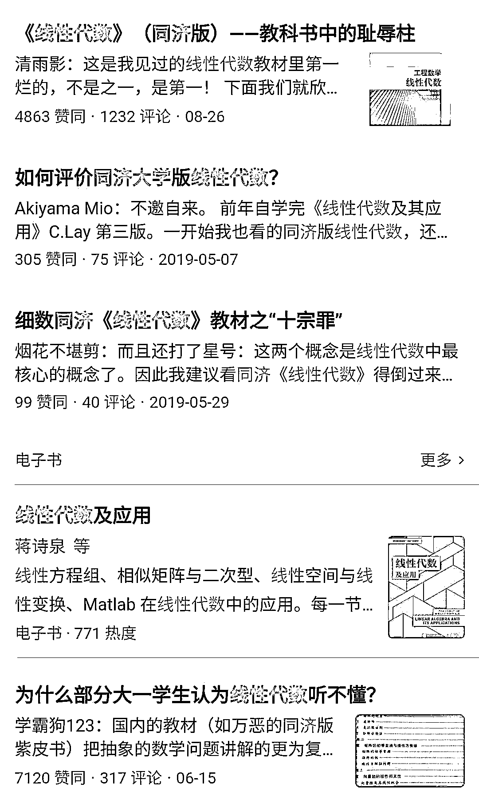

很多同学吐槽这本教材结构不合理、内容抽象（甚至让抽象的东西变得更抽象），整本学下来很难有什么收获，还可能会丧失对于数学学习的兴趣。
以下是对于这些观点的简单总结：结构编排不合理 很多发帖的同学都指出，同济版《线性代数》最大的问题就是「结构混乱」，第一章就从「行列式」开始讲。对于没有学过线性代数基本概念的大一同学来讲，这种毫无铺垫的引入方式让很多同学无法接受。

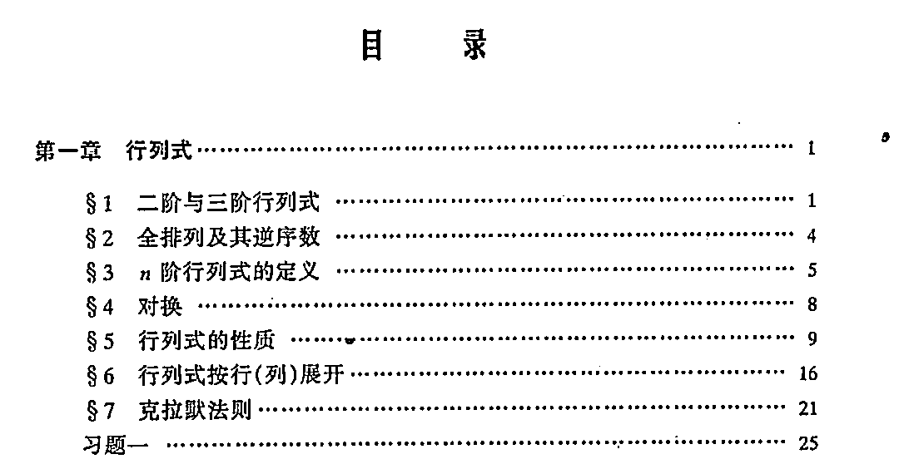

「兄弟，我们是线性代数课，你不先介绍一下什么叫线性，什么叫代数吗？起手就是 n 阶行列式的定义，实力劝退。」——知乎用户 @清雨影

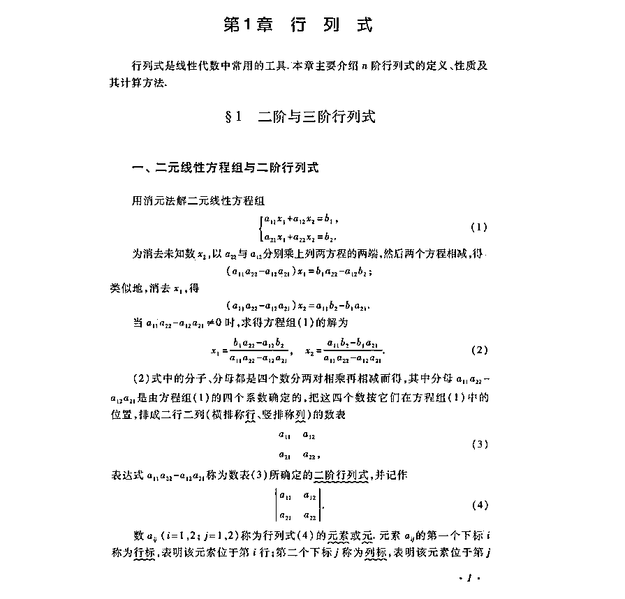

当然，指出这个问题同学不在少数。在其他关于线性代数的帖子中，我们也发现了关于该书「行列式」编排的吐槽。一位名叫 @李佳繁的知乎用户发帖表示：「行列式的定义给的很早难道不会让你感到很突兀和很没有必要么？！而且行列式是线性代数中几乎最为重要的概念之一，一上来就只是用数学语言给他了一个规定，在学线性代数的初期，能体会到什么？」

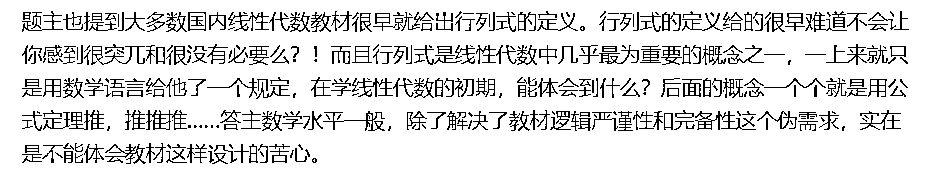

还有同学指出，这个问题并不是同济版《线性代数》所特有的，而是国内线代教材的通病。 

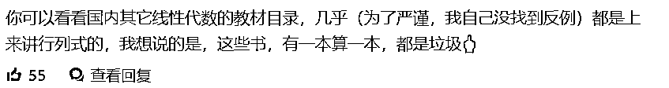

在第一章讲完行列式之后，该书随后介绍了矩阵及其运算、矩阵的初等变换与线性方程组、向量组的线性相关性、相似矩阵及二次型、线性空间与线性变换几个章节。

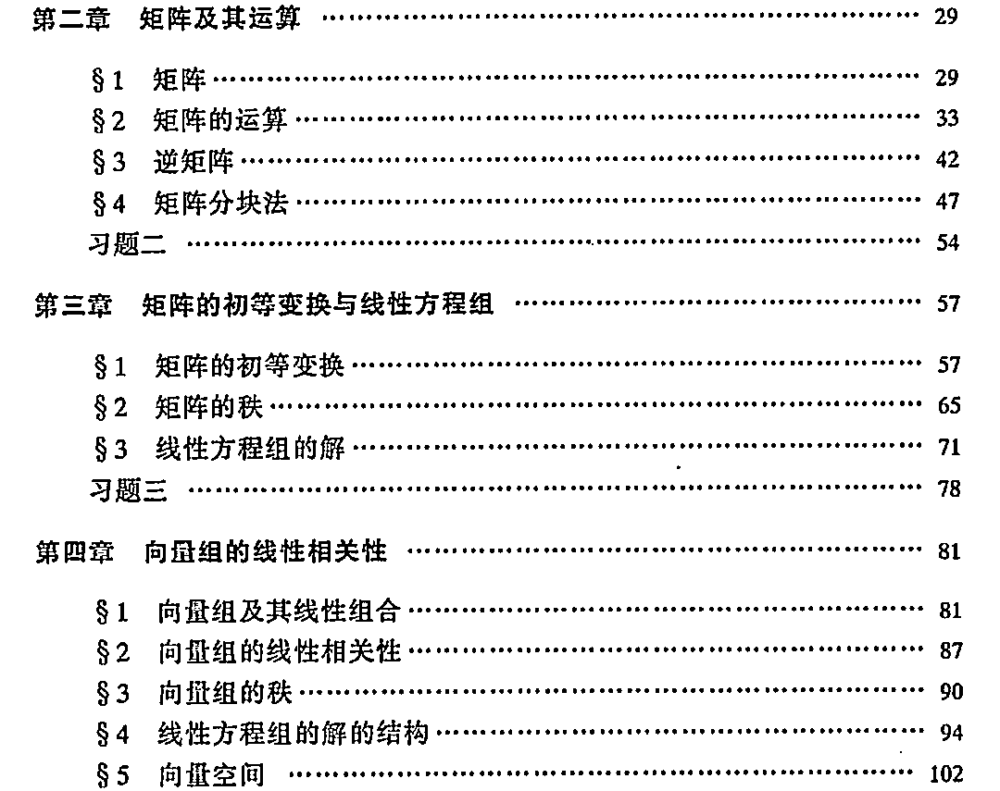

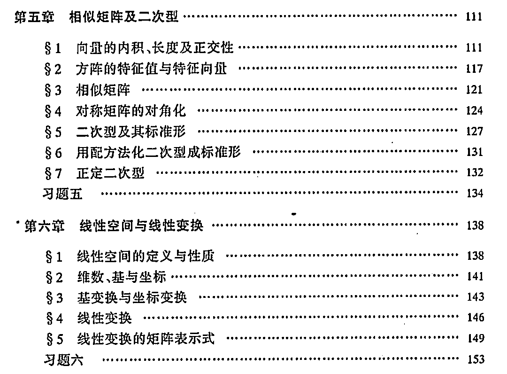

除了行列式出现在第一章，其余的编排不合理之处还包括：1\. 逆序数出现过早；2\. 先讲矩阵再讲向量；3\. 线性空间放到后面作为选学；……总之，这本书的编排顺序让很多同学摸不着头脑，学完之后也没有留下深刻的印象，甚至从此失去了对于线代学习的兴趣。长得抽象，教材内容也抽象 除了结构编排的问题之外，「内容抽象」也是这本教材被吐槽的最多的点。线性代数本身就是一门比较抽象的学科，因此，教材或教师理应通过各种方法帮助学生理解书中的抽象概念，比如运用图解的形式。但很多同学反映，书中的图解着实少得可怜，甚至「翻遍了全书，只有三个向量图解」（引自知乎用户 @Akiyama Mio）。还有同学指出，很多概念的引入也是莫名其妙，没有具体的例子作为支撑，所以很多同学学完之后都不知道自己学的东西有什么用。这本《线性代数》教材真的一无是处吗？有人持相反意见。这部分人认为，每本教材其实都有一定的适用人群，而且看书不一定要遵循书本的编排规律。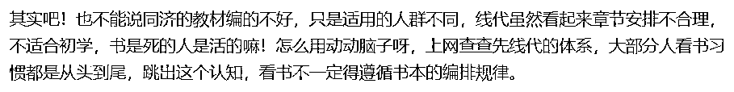还有老师在评论区给出了这本书的原因：节省课时，能够满足考研需要。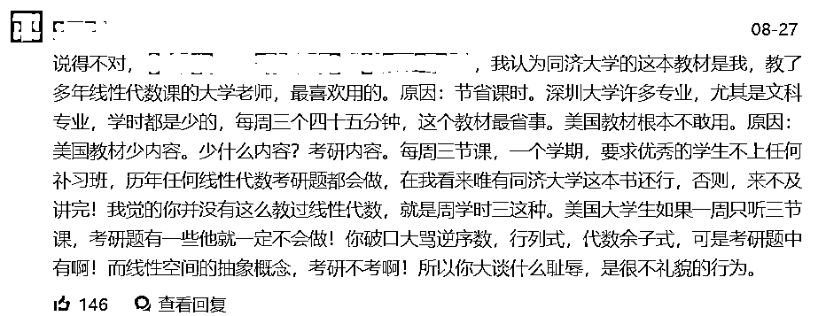想打下坚实数学基础，清华学生是这样学的所以，既然线性代数这样学效率有点低，我们应该用什么姿势学习呢？其实人们一直都在思考这个问题。去年，清华大学将「线性代数」科目的课本改成英文教材就引发了人们的热议。据介绍，该校改用了麻省理工学院（MIT）数学系教授 Gilbert Strang 的《Introduction to Linear Algebra》，效果怎样或许一时无法量化，但看起来蛮受欢迎的。

在 B 站上，Strang 老爷子总共 27 个多小时的「线性代数 MIT 18.06」课程也已达到了 73 万的播放量（其中一个资源的数据），可以说是 B 站最火的英文《线性代数》课程了。当然这门课程在国外也是 MIT 最热门的课程之一。根据 OCW 官网统计的数据，自 2002 年第一次发布以来，该课程的总访问量已经超过 1000 万。为什么他的教材、课程那么受欢迎？从人们的评论中，我们可以总结出几个关键词：1\. 实用、难度适中。知乎上有个帖子专门讨论 Gilbert Strang 的线性代数教材《Introduction to Linear Algebra》。有人表示，「Strang 的教材更加面向实际应用，难度适中，比较注重从实际问题中培养数学直觉，比较适合工程学科学生使用。」这点相对于国内一些教材区别很大。我们通常接触到的课本一般是先给出定义，然后是定理和证明方法，很容易让非数学专业的学生失去兴趣。而 Strang 教授的教材则是「先告诉你一些有意思的数学事实，之后告诉你我们怎么解决那些问题之中较为简单的（有一部分方法甚至是依靠尝试和数学直觉），再和你一起探究这么解决为什么对，是否存在理论基础，留一些习题让你自己去试试它真的是对的，最后再做其他的深入探究，并提炼为定理。」（引自知乎用户 @李佳繁）2\. 化抽象为具体。对于数学基础不好的人来说，「线性代数」真的是一门非常抽象的课程。但从大家对 Strang 教授《线性代数》教材的评价来看，比较一致的观感是「不是很抽象」，甚至可以 「和高中对接」。Strang 教授对线性代数的讲解过程中会插入很多例子，能让学生结合例子理解一些抽象的概念，对非数学专业的学生非常友好。有同学表示，「感觉很多概念不再是死记硬背了」。此外，整个课程的逻辑也是循循善诱式的，它「不是上来告诉你这样做是对的，而是一步步引导你让你理解就应该是这样子。」

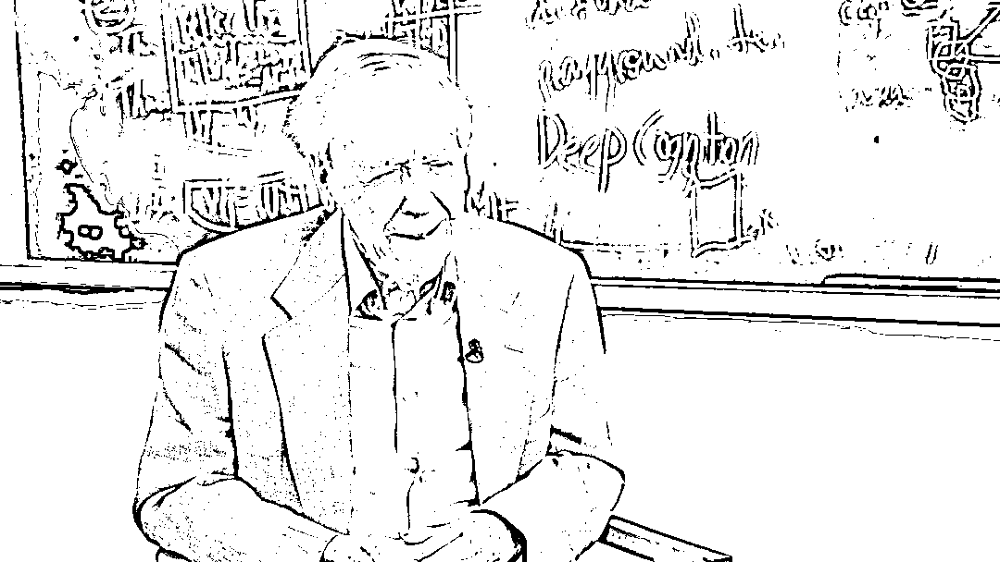

Strang 教授 1934 年生于芝加哥，在加州大学洛杉矶分校取得博士学位，从 1962 年起就开始担任麻省理工学院的数学系教授，一辈子都在教书育人、笔耕不辍。去年初，他还出版了一本新书《Linear Algebra and Learning from Data》。今年在新冠疫情期间，全球大多数地区的学生都无法前去教室上课，已年满 85 岁的 Strang 教授又把自己的线性代数课程视频[更新了一版](https://mp.weixin.qq.com/s?__biz=MzA3MzI4MjgzMw==&mid=2650786615&idx=2&sn=be424a09d306ad3051135bd724e53e82&scene=21#wechat_redirect)。如果对于英文教学不太感冒，有人表示蓝以中的《高等代数简明教程》、丘维声的《简明线性代数》也是不错的选择。如果你在自己学习线性代数时有些迷惑，根据课程视频整理自己的思路可能是效率最高的选择。*参考链接：**https://zhuanlan.zhihu.com/p/199665495?utm_source**https://www.zhihu.com/question/265908739?utm_source*量化投资与机器学习微信公众号，是业内垂直于**Quant****、Fintech、AI、ML**等领域的**量化类主流自媒体。**公众号拥有来自**公募、私募、券商、期货、银行、保险、资管**等众多圈内**18W+**关注者。每日发布行业前沿研究成果和最新量化资讯。