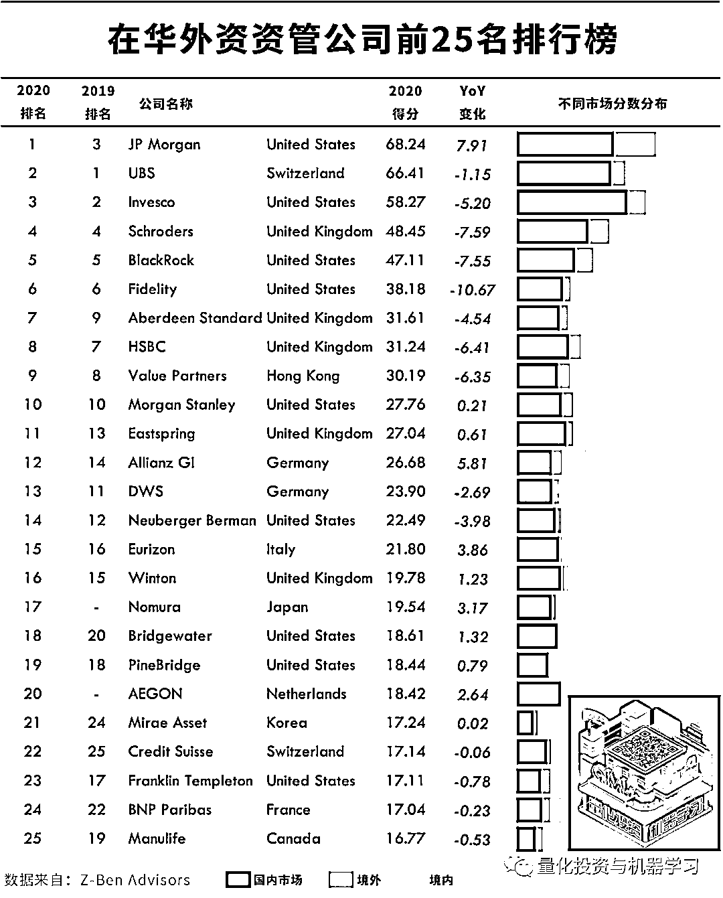
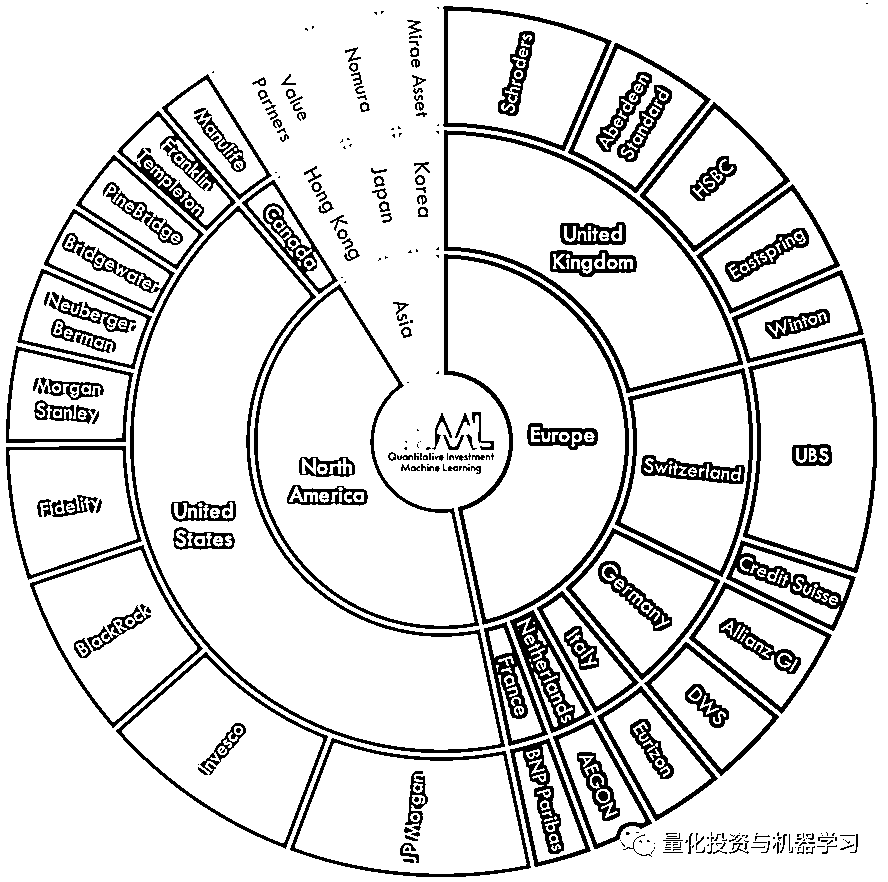

# 国内首家外资公募诞生！资管巨头贝莱德全资持有，注册资本 3 个亿

> 原文：[`mp.weixin.qq.com/s?__biz=MzAxNTc0Mjg0Mg==&mid=2653304950&idx=1&sn=a69fb5a49c306da69ccbac2ae6a0db38&chksm=802dfa63b75a737558de7af36bfc73b39b0a1dda04aae24b3ce9a369b187614610194b06a97d&scene=27#wechat_redirect`](http://mp.weixin.qq.com/s?__biz=MzAxNTc0Mjg0Mg==&mid=2653304950&idx=1&sn=a69fb5a49c306da69ccbac2ae6a0db38&chksm=802dfa63b75a737558de7af36bfc73b39b0a1dda04aae24b3ce9a369b187614610194b06a97d&scene=27#wechat_redirect)

**全网 TOP 量化自媒体**

根据最新证监会披露公告显示，贝莱德基金管理有限公司（以下简称贝莱德基金）核准成立。注册资本为 3 亿元人民币，张弛任法定代表人兼总经理。据媒体报道，**这是证监会批复的首个外资公募牌照。**

**全文如下：**

贝莱德金融管理公司：

你公司报送的《关于发起设立贝莱德基金管理有限公司的申请报告》《关于贝莱德基金管理有限公司开展私募资产管理业务的申请报告》及相关文件收悉。根据《公司法》《证券投资基金法》《证券投资基金管理公司管理办法》（证监会令第 84 号）、《证券投资基金行业高级管理人员任职管理办法》（证监会令第 23 号）、《证券期货经营机构私募资产管理业务管理办法》（证监会令第 151 号）等有关规定，经审核，现批复如下：

一、核准设立贝莱德基金管理有限公司（以下简称贝莱德基金），对公司章程草案无异议，公司注册地为上海市，**公司经营范围为公开募集证券投资基金管理、基金销售、私募资产管理和中国证监会许可的其他业务。**

二、核准贝莱德基金注册资本为 3 亿元人民币，核准股权结构为：

三、对张弛（公民身份号码：320103××××××××0010）任法定代表人兼总经理、陈剑（公民身份号码：362329××××××××0355）任督察长无异议。**张弛、陈剑应当自核准之日起 30 日内辞去在其他经营性机构所兼任的职务，并在辞任后 10 日内报告我会。**

四、你公司应当按照《公司法》《证券投资基金法》《证券投资基金管理公司管理办法》等法律法规和有关规定的要求，**自批复之日起 6 个月内完成贝莱德基金组建工作，足额缴付出资，选举董事、监事，聘任高级管理人员。**

五、贝莱德基金应当在取得工商行政管理机关颁发的营业执照后，到我会领取经营证券期货业务许可证。**贝莱德基金在取得经营证券期货业务许可证前，不得以该名称对外开展业务；自取得经营证券期货业务许可证之日起 6 个月内，应当发行公募基金产品。**

六、贝莱德基金应当按照诚实信用原则认真履行职责，与股东之间建立有效的风险隔离制度，严格自律，规范运作，防范利益输送，加强公平交易管理，切实保护基金份额持有人的利益。

七、贝莱德基金应当严格落实《网络安全法》等相关规定，加强对基金业务数据及投资者个人信息跨境流动的合规管理，切实保护投资者合法权益，保障重要信息系统及网络安全稳定运行。

---

今年 4 月 1 日，贝莱德和路博迈同时上报了公募基金牌照的申请。

贝莱德用于提交申请的主体为贝莱德金融管理公司（BlackRock Financial Management）

路博迈用于提交申请的主体为（Neuberger Berman Investment Advisers LLC）

不过相较于路博迈，贝莱德的动作更为迅速，4 月 9 日就已经收到了补正通知，7 月 31 日递交了补正材料之后，设立申请在当天就获得了证监会受理。而路博迈则仍处于收到补正通知的状态。

在贝莱德和路博迈之后，富达基金也于 5 月 19 日递交了公募基金申请，与路博迈一样，富达基金也处于收到补正通知的状态。

**这也意味着中国公募基金行业将迎来全球机构同台竞技时代。**

贝莱德是全球最大的资产管理集团，截至 2019 年 12 月 31 日，贝莱德在全球管理的总资产达 7.43 万亿美元，涵括股票、固定收益投资、现金管理、替代性投资、不动产及咨询策略。公司除了庞大的资管管理规模、齐全的 ETF 产品线外，其开放的风险管理系统阿拉丁系统也在资管行业从业者享有盛名。 

根据贝莱德董事长兼首席执行官 Larry Fink 在致股东信中的阐述，再次重申中国将是贝莱德最大的机遇之一。

“如果考虑到 10 年的投资，那么 ETF、另类资产和加大技术投入是贝莱德的战略重点。**但是如果要看得更远，贝莱德必须考虑高速增长市场，中国便是高速增长市场中最显著的代表。”**

根据贝莱德投资研究所首席亚太投资策略 Ben Powell 在彭博最新的分享表示：**中国将继续成为增长引擎！**

根据泽奔咨询发布了第五份《2020 China Rankings》报告，显示，瑞银（UBS）和景顺（Invesco）在均下滑一位，分别位列第二和第三，而施罗德（Schroders）、贝莱德（BlackRock）和富达（Fidelity）则保住了 2018 年的排名，分别位列第四、第五和第六。

根据 Morgan Stanley 和 Oliver Wyman 的估计，**中国是全球第三大资产管理市场，仅次于美国和英国，管理资产规模为 5.3 万亿美元**。预计到 2023 年，这一规模将增至 9 万亿美元，在未来 10 年为西方基金管理公司提供全球最大的单一增长机会。

总部位于伦敦的对冲基金管理公司 Man Group 和 First State Investments 跌出前 25 名，分别被野村证券和 Aegon 取代，分别排在第 17 位和第 20 位。其它值得注意的变动包括：桥水基金上升两位，至 18 位，而总部位于伦敦的 Winton 下降一位，至 16 位。

我们还可以看到，**前 25 名的地域分布中美国公司占据了前 5 名中的 3 席。尽管如此，欧洲公司在前 25 名中所占份额最大，为 47%。**

量化投资与机器学习微信公众号，是业内垂直于**Quant****、Fintech、AI、ML**等领域的**量化类主流自媒体。**公众号拥有来自**公募、私募、券商、期货、银行、保险、资管**等众多圈内**18W+**关注者。每日发布行业前沿研究成果和最新量化资讯。