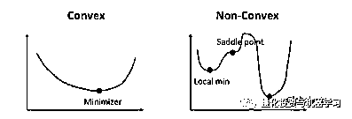
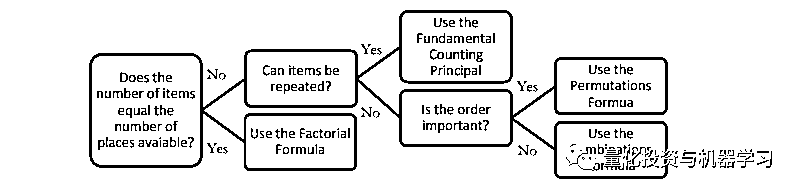
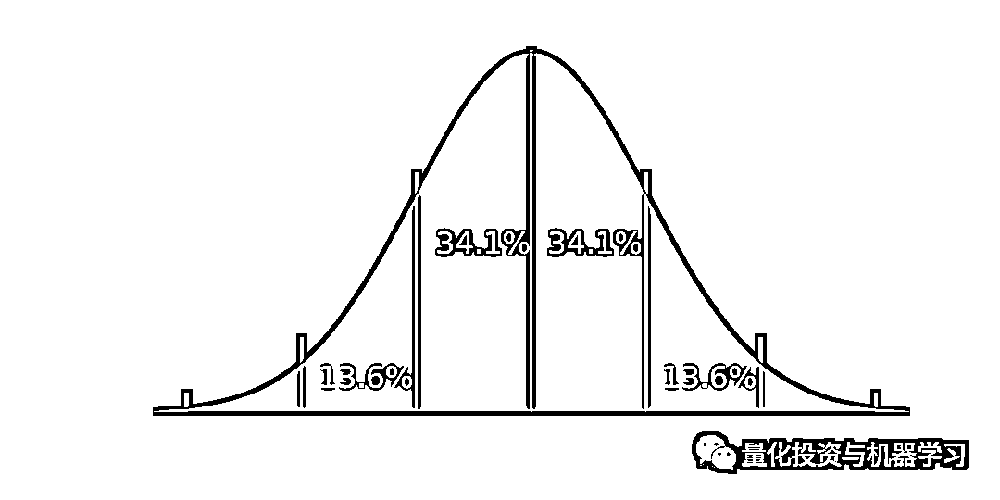

# 收藏！来自大厂的 100+数据科学面试 Q&A！

> 原文：[`mp.weixin.qq.com/s?__biz=MzAxNTc0Mjg0Mg==&mid=2653304902&idx=1&sn=eda2e375c6210dc157951516f6633173&chksm=802dfa53b75a7345a81912d42b6d0caa90db41d883dab110112e41ba3064525e9ab46d6bca2a&scene=27#wechat_redirect`](http://mp.weixin.qq.com/s?__biz=MzAxNTc0Mjg0Mg==&mid=2653304902&idx=1&sn=eda2e375c6210dc157951516f6633173&chksm=802dfa53b75a7345a81912d42b6d0caa90db41d883dab110112e41ba3064525e9ab46d6bca2a&scene=27#wechat_redirect)


**全网 TOP 量化自媒体**

作者：Terence       编译：方的馒头

**这篇文章很长...**

但是不要被长度吓到了，我们已经将其分为四个部分（机器学习、统计信息、SQL、其他），以便你可以逐步了解它。

你可以使用这些问题来磨练知识并找出差距，然后填补这些空白。

我们希望你会发现这很有帮助，并祝你在数据科学的努力中好运！

***1*** 

**机器学习基础**

**问 1：在应用机器学习算法之前，数据争论和数据清理有哪些步骤？**

当数据争论和数据清理时可以采取许多步骤。下面列出了一些最常见的步骤：

**数据剖析：**几乎每个人都从理解他们的数据集开始。更具体地说，你可以使用.shape 查看数据集的形状，并使用.describe（）查看数字变量的描述。

**数据可视化：**有时，使用直方图、箱形图和散点图可视化数据很有用，以更好地理解变量之间的关系并识别潜在的异常值。

**语法错误：**这包括确保没有空格，确保字母大小写一致以及检查拼写错误。你可以使用.unique（）或条形图检查拼写错误。

**标准化或规范化：**根据你使用的数据集和决定使用的机器学习方法，对数据进行标准化或标准化可能会很有用，这样不同比例的不同变量不会对模型的性能产生负面影响。

**处理空值：**有多种处理空值的方法，包括完全删除带有空值的行，将空值替换为均值/中位数/众数，将空值替换为新的类别（例如未知）、预测值，或使用可以处理空值的机器学习模型。在这里阅读更多。

**其他事情包括：**删除不相关的数据，删除重复项和类型转换。

**问 2：如何处理不平衡的二元分类？**

有多种方法可以处理不平衡的二元分类（假设你要识别少数类）：

首先，你想重新考虑用于评估模型的**指标**。模型的准确性可能不是最好的指标，因为我将用一个例子来说明原因。假设有 99 次银行提款不是欺诈行为，而 1 次提款是欺诈行为。如果你的模型仅将每个实例归类为“非欺诈性”，则其准确性为 99％！因此，你可能要考虑使用精确度和召回率等指标。

改善不平衡二元分类的另一种方法是增加对少数群体**分类错误的成本**。通过增加这种惩罚，模型应该更准确地对少数群体进行分类。

最后，你可以通过对少数类进行**过度采样**或对多数类进行**欠采样**来改善类的平衡。你可以在这里读更多关于它的内容。

**问 3：箱线图和直方图有什么区别？**


箱线图和直方图是用于显示数据分布的可视化效果，但它们以不同的方式传达信息。 

直方图是显示数值变量的频率的条形图，并用于估计给定变量的概率分布。它使你可以快速了解分布的形状、变化和潜在的离群值。

箱线图传达数据分布的不同方面。虽然你无法通过箱形图看到分布的形状，但可以收集其他信息，例如四分位数、范围和离群值。当你想同时比较多个图表时，箱线图特别有用，因为它们比直方图占用更少的空间。


**问 4：请描述不同的正则化方法，例如 L1 和 L2 正则化？**

L1 和 L2 正则化都是用于减少训练数据过拟合的方法。最小二乘法可最小化残差平方和，这可能会导致低偏差但高方差。

L2 正则化（也称为岭回归）可最小化残差平方和**加上λ乘以斜率平方**。这个附加术语称为“**岭回归惩罚**”。这会增加模型的偏差，使训练数据的拟合度变差，但也会降低方差。

如果采用岭回归惩罚并将其替换为斜率的**绝对**值，则将获得套索回归或 L1 正则化。

L2 没有那么强大，但具有稳定的解决方案，并且始终是一个解决方案。L1 更强大，但解决方案不稳定，可能有多个解决方案。

StatQuest 在这里有关于套索和岭回归的精彩视频。

**问 5：神经网络基础知识**

**神经网络**是受人脑启发的多层模型。像我们大脑中的神经元一样，上方的圆圈代表一个节点。蓝色圆圈代表**输入层**，黑色圆圈代表**隐藏层**，绿色圆圈代表**输出层**。隐藏层中的每个节点代表输入所经历的函数，最终导致绿色圆圈中的输出。这些函数的正式术语称为**sigmoid 激活函数**。

**问 6：什么是交叉验证？**

交叉验证本质上是一种用于评估模型在新的独立数据集上的性能的技术。交叉验证的最简单示例是将数据分为两组：训练数据和测试数据，其中使用训练数据构建模型，使用测试数据测试模型。

**问 7：如何定义/选择指标？**

没有一种“放之四海而皆准”的指标。选择用于评估机器学习模型的度量标准取决于多种因素：

*   它是回归还是分类任务？

*   业务目标是什么？例如：精确度与召回率

*   目标变量的分布是什么？

可以使用许多指标，包括调整后的 r 平方、MAE、MSE、精确度、召回率、准确度、f1 得分等等。

**问 8：请解释什么是精确度和召回率**

**召回率**试图回答“正确识别出实际阳性的比例是多少？”


**精确度**试图回答“阳性识别的实际比例是多少？”


**问 9：请解释什么是假阳性和假阴性。为什么****彼此之间很重要？举例说明假阳性比假阴性更重要，假阴性比假阳性更重要，以及当这两种类型的错误同等重要时**

**假阳性**是指在实际不存在的情况下对它的错误识别。

**假阴性**是指在实际存在的情况下对它的错误识别。

筛查癌症是假阴性比假阳性更重要的一个例子。更糟糕的是，当一个人患了癌症时却说他没有患癌症，而不是说某人患有癌症，后来又意识到他没有癌症。

这是一个主观论点，但从心理学的角度来看，假阳性可能比假阴性更糟。例如，由于人们通常不期望中奖，因此，赢得彩票的假阳性可能比假阴性结果更糟。

**问 10：监督学习和无监督学习有什么区别？给出具体的例子**

**监督学习**涉及学习基于示例输入输出对[1]将输入映射到输出的函数 men。

例如，如果我们有一个包含年龄（输入）和身高（输出）两个变量的数据集，我们可以实现一个监督学习模型，以根据一个人的年龄预测其身高。


与监督学习不同，**无监督学习**用于得出推论并从输入数据中找到模式，而无需参考标记的结果。无监督学习的常见用法是通过购买行为来对客户进行分组以找到目标市场。

**问 11：假设你需要使用多元回归来生成一个预测模型。解释你打算如何验证****此模型**

有两种主要方法可以做到这一点：

**A）调整后的 R 平方**

R 平方是一种度量，它告诉你因变量的方差比例在多大程度上由自变量的方差解释。用简单的话来说，当系数估计趋势时，R 平方代表最佳拟合线周围的散布。

但是，每增加一个独立变量到一个模型中总是会增加 R 平方值，因此，具有多个自变量的模型似乎更适合，即使并非如此。这是调整后的 R²出现的作用。调整后的 R²补偿每个额外的自变量，并且该值仅当每个给定变量使模型的改善超出概率范围时才增加。这很重要，因为我们正在创建一个多元回归模型。

**B）交叉验证**

对大多数人来说，一种通用的方法是交叉验证，即将数据分为两组：训练和测试数据。有关更多信息，请参见第一个问题的答案。

**问 12：NLP 代表什么？**

NLP 代表**自然语言处理**。它是人工智能的一个分支，赋予机器阅读和理解人类语言的能力。

**问 13：什么时候使用随机森林 Vs 支持向量机（ SVM），为什么？**

与支持向量机相比，随机森林是更好的模型选择有以下几个原因：

*   随机森林允许你可以确定特征的重要性。SVM 无法做到这一点。

*   随机森林比支持向量机更快，更容易构建。

*   对于多类别分类问题，支持向量机需要“一对多”的方法，这种方法的可扩展性较低，并且占用的内存更多。

**问 14：为什么降维很重要？**

降维是减少数据集中特征数量的过程。

这一点很重要，主要是在你要减少模型中的方差（过度拟合）的情况下。

降维的四个优点：

*1.减少所需时间和存储空间*

*2.消除多重共线性改善了机器学习模型参数的解释*

*3.当数据缩小到非常低的维度（例如 2D 或 3D）时，可视化数据更容易*

*4.避免了维度的诅咒*

**问 15：什么是主成分分析（PCA）？解释使用 PCA 来解决的问题。**

从最简单的意义上讲，PCA 涉及将更高维度的数据（例如 3 维）投影到更小的空间（例如 2 维）。这样会导致数据维度较低（2 维而不是 3 维），同时将所有原始变量保留在模型中。

PCA 通常用于压缩目的，以减少所需的内存并加快算法的速度，还用于可视化目的，从而使汇总数据更加容易。

**问 16：为什么朴素贝叶斯这么糟糕？将如何改进使用朴素贝叶斯的垃圾邮件检测算法？**

朴素贝叶斯的一个主要缺点是它有一个很强的假设，即特征被假设为彼此不相关，而通常情况并非如此。

改进使用朴素贝叶斯算法的一种方法是对特征进行去相关以使假设成立。

**问 17：线性模型有哪些缺点？**

线性模型有几个缺点：

*   线性模型具有一些在应用中可能不正确的强假设，它假设为线性关系、多元正态性、无或少有多重共线性、无自相关和均方差

*   线性模型不能用于离散或二进制结果。

*   你不能改变线性模型的模型灵活性。

**问 18：你认为 50 颗小型决策树比一颗大型决策树好吗？为什么？**

提出此问题的另一种方式是：“随机森林比决策树更好的模型吗？”答案是肯定的，因为随机森林是一种集成方法，它需要许多弱决策树才能培养出强大的学习者。随机森林更准确、更健壮，并且更不太容易过度拟合。

**问 19：为什么均方误差是衡量模型性能的一个不好的指标？你会建议什么呢？**

均方误差（MSE）对较大的误差具有较高的权重，因此，MSE 往往过分强调较大的偏差。一个更强大的替代方法是 MAE（平均绝对偏差）。

**问 20：线性回归需要哪些假设？如果其中一些假设被违反怎么办？**

假设如下：

1、用于拟合模型的样本数据可**代表总体**

2、X 与 Y 的平均值之间的关系是**线性的**

3、对于任何 X 值（**均方差**），残差的方差都相同

4、观察彼此**独立**

5、对于任何 X 值，Y 均是**正态分布**。

极端违反这些假设将使结果变得多余。略微违反这些假设将导致估计值更大的偏差或方差。

**问 21：什么是共线性？如何处理？如何消除多重共线性？**

在多元回归方程中，当一个自变量与另一个自变量高度相关时，存在多重共线性。这可能是有问题的，因为它破坏了自变量的统计意义。

你可以使用方差膨胀因子（VIF）来确定自变量之间是否存在多重共线性——一个标准基准是，如果 VIF 大于 5，则存在多重共线性。

**问 22：如何检查回归模型是否与数据吻合？**

你可以使用几个指标：

**R 平方/调整后的 R 平方：**相对拟合度。先前的答案对此进行了解释

**F1 分数：**评估所有假设回归系数均等于零的原假设和至少一个不等于零的替代假设。

**RMSE：**绝对拟合度。

**问 23：什么是决策树？**


**决策树**是一种流行的模型，用于运筹学、战略规划和机器学习。上方的每个正方形称为一个**节点**，并且你拥有的节点越多，（通常）决策树越准确。做出决策的决策树的最后节点称为树的叶子。决策树直观且易于构建，但在准确性方面却有所欠缺。

**问 24：什么是随机森林？为什么好呢？**

随机森林是一种基于决策树集成学习技术。随机森林涉及使用原始数据的自举数据集创建多个决策树，并在决策树的每个步骤中随机选择一个变量子集。然后，模型选择每个决策树的所有预测的模式。通过依赖“多数获胜”模型，它降低了单颗树出错的风险。


例如，如果我们创建一个决策树，第三个决策树，它将预测 0。但是，如果我们依赖所有 4 个决策树的模式，则预测值为 1。这就是随机森林的力量。

随机森林还提供了其他一些好处，包括强大的性能，可以对非线性边界进行建模，不需要交叉验证以及赋予特征重要性。

**问 25：什么是内核？解释内核技巧**

核（kernel）是一种在某些（可能是非常高维的）特征空间中计算两个向量𝐱x 和𝐲y 的点积的方法，这就是为什么内核函数有时被称为“广义点积”的原因[2]

内核技巧是一种使用线性分类器通过将线性不可分离的数据转换为较高维度的线性可分离数据来解决非线性问题的方法。


**问 26：在拟合 SVM 之前进行降维是否有好处？为什么或者为什么不？**

当特征数量大于观测值的数量时，执行降维通常会改善 SVM。

**问 27：什么是过度拟合？**

过度拟合是一种模型与数据拟合得太好的误差，导致模型具有高方差和低偏差。因此，即使过拟合模型在训练数据上具有很高的精确性，也将不准确地预测新的数据点。

**问 28：什么叫 boosting？**

Boosting 是一种通过减少模型的偏差和方差来改进模型的集成方法，最终将弱学习者转化为强学习者。总体思路是训练一个弱学习者，并通过从先前的学习者那里学习来依次迭代和改进模型。你可以在此处了解更多信息。

***2***

**统计、概率和数学**

**问 1：**物品**在位置 A 处的概率为 0.6，在位置 B 处的概率为 0.8。在亚马逊网站上找到该物品的概率是多少？**

我们需要对此问题做出一些假设，然后才能回答它。**假设在亚马逊上有两个可能购买特定商品的地方，并且在位置 A 找到它的概率为 0.6，而在位置 B 找到它的概率为 0.8。在亚马逊上找到物品的概率可以解释为：**

我们可以把上面的改写为 P（A）= 0.6 和 P（B）= 0.8。此外，我们假设这些事件是独立的事件，这意味着一个事件的概率不受另一个事件的影响。然后，我们可以使用公式...

P（A 或 B）= P（A）+ P（B）-P（A 和 B）

P（A 或 B）= 0.6 + 0.8-（0.6 * 0.8）

P（A 或 B）= 0.92

**问 2：你从 100 枚硬币中随机抽取一枚硬币——1 枚不公平硬币（正面对正面），99 枚公平硬币（正面对反面）****并将其滚动 10 次。如果结果是 10 个正面，那么硬币不公平的概率是多少？**


这可以使用贝叶斯定理来回答。贝叶斯定理的扩展方程如下：

假设捡到不公平硬币的概率表示为 P（A），而连续翻转 10 个正面的概率表示为 P（B）。那么 P（B | A）等于 1，P（B |¬ A）等于 0.510，而 P（¬A）等于 0.99。

如果填写方程，则 P（A | B）= 0.9118 或 91.18％。

**问 3：凸成本函数和非凸成本函数之间的区别？当成本函数是非凸时，它意味着什么？**



**凸函数**是指在图形上任意两点之间绘制的线位于图上或图形上方的函数。它有一个最小值。

**非凸函数**是指在在图形上任意两点之间绘制的线可能与图形上其他点相交的函数。它的特征是“波浪形”。

当成本函数为非凸函数时，这意味着该函数可能会找到局部极小值而不是全局极小值，这从优化的角度来看，这在机器学习模型中通常是不希望的。

**问 4：理解概率基本原理**

为此，我们将研究此处列出的八种概率规则以及四种不同的计数方法：

**概率八法则**

*   规则 1：对于任何事件 A，**0≤P（A）≤1**；*换句话说，事件发生的概率范围可以从 0 到 1。*

*   规则 2：所有可能结果的概率总和始终等于 1。

*   规则 3：**P（非 A）＝ 1-P（A）**；*该规则解释了事件的概率及其补余事件之间的关系。补**余事件是指所有不包含在 A 中的可能结果。*

*   规则 4：如果 A 和 B 是不相交的事件（互斥），则**P（A 或 B）= P（A）+ P（B）**;*这被称**为不相交事件的加法规则。*

*   规则 5：**P（A 或 B）＝ P（A）+ P（B）-P（A 和 B）**；*这被称为一般加法规则。*

*   规则 6：如果 A 和 B 是两个独立的事件，则**P（A 和 B）= P（A）* P（B）**；*这被称为独立事件的乘法规则。*

*   规则 7：事件 B 在给定事件 A 下的条件概率为**P（B | A）= P（A 和 B）/ P（A）**

*   规则 8：对于任意两个事件 A 和 B，**P（A 和 B）= P（A）* P（B | A）**；*这被称为一般乘法规则。*

**计数方法**



**阶乘公式：n！= n x（n -1）x（n_2）x…x 2 x 1**

当项目数等于可用位置数时使用。

*例如：找到 5 个人可以坐在 5 个空座位上的方式总数。*

*= 5 x 4 x 3 x 2 x 1 = 120*

**基本计数原理（乘法）**

当允许重复且填充空位的方法的数量不受先前填充影响时，应使用此方法。

*例如：有 3 种早餐、4 种午餐和 5 种甜点。组合总数= 5 x 4 x 3 = 60*

**排列：P（n，r）= n！/（nr）！**

当不允许替换且项目等级的顺序很重要时，使用此方法。

*例如：一个代码按特定顺序有 4 位数字，且数字范围为 0 到 9。如果一位数字只能使用一次，则有多少种排列方式？*

*P（n，r）= 10！/（10–4）！=（10x9x8x7x6x5x4x3x2x1）/（6x5x4x3x2x1）= 5040*

**组合公式：C（n，r）=（n！）/ [（nr）！r！]**

当不允许替换并且项目的排序顺序无关紧要时，使用此方法。

*例如：要赢得彩票，你必须以 1 至 52 的任意顺序选择 5 个正确的数字。可能的组合数量是多少？*

*C（n，r）= 52！/（52–5）！5！= 2,598,960*

**问 5：请描述马尔可夫链？**

极好地提供了马尔可夫链的一个很好的定义（在这里）：

“马尔可夫链是一个数学系统，根据一定的概率规则，会经历从一种状态到另一种状态的转变。马尔可夫链的定义特征是，无论过程如何到达其当前状态，可能的未来状态都是固定的。换句话说，转换为任何特定状态的概率仅取决于当前状态和所经过的时间。”

马尔可夫链背后的实际数学需要线性代数和矩阵的知识。

**问 6：一个盒子有 12 张红牌和 12 张黑牌。另一个盒子有 24 张红牌和 24 张黑牌。你想从两个盒子中随机抽取两张牌，一次一张。哪个盒子更有可能获得相同颜色的牌？为什么？**

具有 24 张红牌和 24 张黑牌的盒子更有可能获得两张相同颜色的牌。让我们逐步完成每个步骤。

假设你从每副牌中抽出的第一张牌是红色 A。

这意味着在有 12 张红色和 12 张黑色的这副牌中，现在有 11 张红色和 12 张黑色。因此，你再抽到红色的几率等于 11 /（11 + 12）或 11/23。

在有 24 张红色和 24 张黑色的这副牌中，将会有 23 张红色和 24 张黑色。

因此，你再抽到红色的几率等于 23 /（23 + 24）或 23/47。

由于 23/47> 11/23，所以第二副牌拥有更多张牌时，获得相同两张牌的概率更高。

**问 7：你在赌场里，有两个骰子可以玩。每次掷出 5，你将赢得 10 美元。如果你一直玩到赢才停止，你的预期支出是多少？**


*   假设你每次玩游戏的费用为 5 美元。

*   有两个骰子的 36 种可能组合。

*   在这 36 种组合中，有 4 种组合导致掷出 5（请参见蓝色）。这意味着掷出 5 的概率是 4/36 或 1/9。

*   1/9 的胜算意味着你将输掉 8 次，从理论上讲，一次获胜。

*   因此，你的预期支出等于$ 10.00 * 1-$ 5.00 * 9 =-$ 35.00。

**问 8：如何判断给定硬币是否有偏差？**

这不是一个恶作剧问题。答案很简单，就是进行假设检验：

1、原假设是硬币没有偏差，翻转的概率应该等于 50％（p = 0.5）。另一种假设是硬币有偏差，p！= 0.5。

2、掷硬币 500 次。

3、计算 Z 分数（如果样本小于 30，则将计算 t 统计量）。

4、与 alpha 比较（双尾检验，所以 0.05 / 2 = 0.025）。

5、如果 p 值> alpha，则不会拒绝原假设，并且硬币不会有偏见。

如果 p 值<alpha，则拒绝原假设，并且对硬币有偏差。

**问 9：让不公平的硬币公平**  

由于抛硬币是二元结果，因此可以通过两次抛硬币来使不公平的硬币公平。如果将其翻转两次，则可以押注两个结果：正面跟着反面或反面跟着正面。

**P（正面）* P（反面）= P（反面）* P（正面）**

这是有道理的，因为每次掷硬币都是**独立事件**。这意味着，如果你得到正面→正面或反面→反面，则需要重新投掷硬币。

**问 10：你即将要乘飞机去伦敦，想知道是否需要带把伞。你随机打电话给三个朋友，问他们每个人是否在下雨。你的朋友说实话的概率是 2/3，而他们撒谎对你开玩笑的概率是 1/3。如果他们三个都说正在下雨，那么伦敦实际上下雨的概率是多少？**

你可以说这个问题与贝叶斯理论有关，因为最后一个陈述基本上遵循以下结构：“假设 B 为真，那么 A 成立的概率是多少？”因此，我们需要知道某一天伦敦下雨的概率。我们假设是 25％。

P（A）=下雨的概率= 25％

P（B）=3 个朋友都说下雨的概率

P（A | B）考虑到他们说正在下雨的下雨概率

P（B | A）考虑到下雨的 3 个朋友都说下雨的概率=（2/3）³= 8/27

*步骤 1：求解 P（B）*

P（A | B）= P（B | A）* P（A）/ P（B），可改写为

P（B）= P（B | A）* P（A）+ P（B |不是 A）* P（不是 A）

P（B）=（2/3）³* 0.25 +（1/3）³* 0.75 = 0.25 * 8/27 + 0.75 * 1/27

*步骤 2：求解 P（A | B）*

P（A | B）= 0.25 *（8/27）/（0.25 * 8/27 + 0.75 * 1/27）

P（A | B）= 8 /（8 + 3）= 8/11

因此，如果三个朋友都说正在下雨，那么实际就在下雨的概率是 8/11。

**问 11：给你 40 张带有四种不同颜色的牌——10 张绿牌、10 张红牌、10 张蓝牌和 10 张黄牌。每种颜色的牌从 1 到 10 编号。随机选择两张牌。找出被挑选的牌不是相同编号和相同颜色的概率。**

由于这些事件不是独立的，因此我们可以使用以下规则：

P（A 和 B）= P（A）* P（B | A），也等于

P（非 A 且非 B）= P（非 A）* P（非 B |非 A）

例如：

P（非 4 且非黄色）= P（非 4）* P（非黄色|非 4）

P（非 4 且非黄色）=（36/39）*（27/36）

P（非 4 且非黄色）= 0.692

因此，选择的牌号不同且颜色相同的概率为 69.2％。

**问 12：你如何评估见解的统计显著性？**

你可以进行假设检验以确定统计显着性。首先，你要陈述原假设和替代假设。其次，你要计算 p 值，即假设原假设为真的情况下获得测试观察结果的概率。最后，你将设置显著性水平（alpha），如果 p 值小于 alpha，则将拒绝原假设，换句话说，结果在统计上是显著的。

**问 13：解释什么是长尾分布，并提供三个有关长尾现象的示例。为什么它们在分类和回归问题中很重要？**


**长尾分布**是一种有尾巴的重尾分布，其尾部逐渐渐进性下降。

3 个实际示例包括幂律、帕累托原则（通常称为 80–20 规则）和产品销售（即最畅销产品与其他产品的对比）。

重要的是要注意分类和回归问题中的长尾分布，因为最不经常出现的值构成了人口的大部分。这最终会改变你处理离群值的方式，并且在假定数据为正态分布的前提下，还与某些机器学习技术发生冲突。

**问 14：什么是中心极限定理？解释一下。它为什么如此重要？**


“如何统计”提供了 CLT 的最佳定义，即：

“中心极限定理指出，无论总体分布的形状如何，样本均值的抽样分布都会随着样本规模的增大而接近正态分布。” [1]

中心极限定理很重要，因为它用于假设检验和计算置信区间。

**问 15：什么是统计功效？**

“统计功效”是指二元假设的功效，即替代假设为真，则检验拒绝原假设的概率。[2]


**问 16：解释选择偏差（关于数据集，而不是变量选择）。它为什么如此重要？诸如丢失数据处理之类的数据管理程序如何使情况变得更糟？**

**选择偏差**是指以无法实现适当随机化的方式选择个人、群体或数据进行分析的现象，最终导致样本无法代表总体。

理解和识别选择偏差很重要，因为它可能会严重歪曲结果并提供有关特定人群的错误见解。

选择偏差的类型包括：

*   **抽样偏差：**由非随机抽样引起的有偏差的样本

*   **时间间隔：**选择支持预期结论的特定时间范围。

*   例如：在圣诞节前后进行销售分析。

*   **暴露：**包括临床易感性偏差，原发性偏差、适应症偏差。

*   **数据：**包括采集、压制证据和不完全证据的谬误。

*   **损耗：**损耗偏差类似于存活偏差，在这种情况下，只有那些在长期过程中“存活”下来的才被纳入分析，或者是失败偏差，在这种情况下，那些“失败”才被纳入分析

*   **观察者的选择：**与人择原理有关，即哲学上的考虑是，我们收集的有关宇宙的任何数据都是经过过滤的：为了使其可被观测到，它必须与观测它的有意识和有知觉的生命相兼容。[3]

处理丢失的数据会使选择偏差更糟糕，因为不同的方法以不同的方式影响数据。例如，如果你用数据的平均值替换空值，则在你就增加了偏差，因为你假设数据并不像实际可能的那样分散。

**问 17：提供一个简单的示例，说明实验设计如何帮助回答有关行为的问题。实验数据与观测数据对比如何？**

**观测数据**来自观测研究，即当你观测某些变量并试图确定是否存在相关性时。

**实验数据**来自实验研究，即当你控制某些变量并将其保持恒定以确定是否存在因果关系时。

实验设计的一个示例如下：将一组分成两部分。对照组正常生活。测试组被告知持续 30 天每晚喝一杯葡萄酒。然后可以进行研究，看看葡萄酒如何影响睡眠。

**问 18：缺失数据的均值插补是否可以接受？为什么或者为什么不？**

**均值插补**是用数据均值替换数据集中的空值。

均值插补通常是不好的做法，因为它没有考虑特征相关性。例如，假设我们有一个显示年龄和健康得分的表，并且假设一个八十岁的老人缺少健身分数。如果我们取 15 到 80 岁这一年龄段之间的平均健康分数，那么八十岁的老人看起来会比他实际应该有的高得多的健康分数。

其次，均值插补减少了数据的方差，并增加了我们数据的偏差。由于方差较小，导致模型精度较低，置信区间较窄。

**问 19：什么是离群值？解释如何筛选离群值，以及在数据集中发现离群值时将如何处理？另外，请解释什么是内部值，以及如何筛选它们，以及在数据集中发现内部值时将如何处理？**

**离群值**是与其他观测值有显著差异的数据点。

根据离群原因，从机器学习的角度来看，它们可能是不好的，因为它们可能会降低模型的准确性。如果离群值是由于测量误差引起的，则将其从数据集中移除非常重要。有几种方法可以识别离群值：

**z 分数/标准差：**如果我们知道数据集中 99.7％的数据位于三个标准差之内，那么我们可以计算一个标准差的大小，将其乘以 3，并确定超出此范围的数据点。同样，我们可以计算给定点的 z 分数，如果它等于+/- 3，则为离群值。

注意：使用此方法时需要考虑一些意外情况；数据必须是正态分布的，不适用于小型数据集，并且存在太多离群值可能会使 z 得分下降。



**四分位间距（IQR）：**IQR 是用于构建箱线图的概念，也可以用于识别离群值。IQR 等于第三个四分位数和第一个四分位数之间的差值。然后，如果该点小于 Q1-1.5 * IRQ 或大于 Q3 + 1.5 * IQR，则可以确定该点是否为离群值。这大约是 2.698 个标准偏差。


其他方法包括数据库扫描聚类（DBScan clustering）、隔离林（Isolation Forests）和稳健随机砍伐林（Robust Random Cut Forsets）。

**内部值**是位于数据集其余部分中的数据观测值，是异常或错误的。由于它位于数据集中，因此通常比离群值更难识别，并且需要外部数据来识别它们。如果你确定任何内部值，则只需将它们从数据集中移除即可。

**问 20：如何处理丢失的数据？你推荐哪种插补技术？**

有几种处理丢失数据的方法：

**·    **删除缺少数据的行

**·    **均值/中位数/众数

**·    **分配唯一值

**·    **预测缺失值

**·    **使用支持缺失值的算法，例如随机森林

最好的方法是删除缺失数据的行，因为这样可以确保不添加或删除任何偏差或方差，并最终形成一个健壮且准确的模型。但是，仅当有大量数据开始且缺失值的百分比较低时，才建议这样做。

**问 21：你拥有有关呼叫中心通话时长的数据。为如何编写代码和分析这些数据指定一个计划。解释一个合理的场景，说明这些持续时长的分布情况。如何以图形方式测试，你的期望是否得到证实？**

首先，我们将进行 EDA——探索性数据分析，以清理、探索和理解我们的数据。请在此处查看我们有关 EDA 的文章。作为 EDA 的一部分，我们可以编写一个调用通话持续时长的直方图以查看潜在分布。

我们的猜测是通话时长将遵循对数正态分布（请参见下文）。我们认为它出现正偏的原因是，由于通话不能为负秒，因此下限限于 0。但是，从高端来看，相对较长的通话很可能只占一小部分。


你可以使用 QQ 图来确认通话时长是否遵循对数正态分布。请参阅此处以了解有关 QQ 图的更多信息。

**问 22：解释管理数据集和从实验研究中收集的数据集之间可能存在的差异。管理数据可能遇到什么问题？实验方法如何帮助缓解这些问题？它们带来什么问题？**

管理数据集通常是政府或其他组织出于非统计原因使用的数据集。

管理数据集通常比实验研究更大且更具成本效益。假设与管理数据集相关联的组织处于活动状态且运行正常，它们也会定期更新。同时，管理数据集可能无法捕获一个人所有需要的数据，并且可能也未采用所需的格式。它还容易出现质量问题和条目丢失。

**问 23：你正在为每个月上传的用户内容编写一份报告，并注意到 10 月份的上传量激增。特别是图片上传数量激增。你认为这是什么原因造成这种情况的，你将如何检验呢？**

导致照片上传数量激增的潜在原因有很多：

1、一项新功能可能已在 10 月实现，该功能涉及上传照片并获得了用户的极大关注。例如，提供创建相册功能的功能。

2、同样，以前上传照片的过程可能不直观，在 10 月份有所改善。

3、可能有一种病毒式的社交媒体运动，涉及上传持续到整个 10 月的照片。例如。Movember，但更具可扩展性。

4、出现高峰的原因可能是人们在万圣节张贴自己奇装异服的照片。

检验方法取决于峰值的原因，但你将进行假设检验以确定推断出的原因是否是实际原因。

**问 24：举例说明不具有高斯分布或对数正态的数据。**

任何类型的分类数据都不会具有高斯分布或对数正态分布。

指数分布——例如汽车电池持续使用的时间或直到地震发生的时间。

**问 25：什么是根本原因分析？如何识别原因与相关性？举个例子**

**根本原因分析：**一种解决问题的方法，用于识别问题的根本原因[5]

**相关性**衡量两个变量之间的关系，范围从-1 到 1。

**因果关系**是指第一个事件似乎导致了第二个事件。因果关系实质上着眼于直接关系，而相关性可以着眼于直接和间接关系。

例如：在加拿大，较高的犯罪率与较高的冰淇淋的销量相关联，也就是说是正相关的。但是，这并不意味着一个导致另一个，相反，而是因为当室外变暖时，两者都会更多地发生。

你可以使用假设检验或 A / B 检验来检验因果关系。

**问 26：举一个例子，中位数比平均值更好**

当有许多离群值使数据出现正偏或负偏时。

**问 27：给定两个公平的骰子，获得总分为 4 的概率是多少？总分为 8 的概率呢？**

投掷 4（1 + 3、3 + 1、2 + 2）有 4 种组合：

P（投掷一个 4）= 3/36 = 1/12

投掷 8（2 + 6、6 + 2、3 + 5、5 + 3、4 + 4）的组合：

P（投掷一个 8）= 5/36

**问 28：什么是大数定律？**

大数定律是这样一种理论，即随着试验次数的增加，结果的平均值将越来越接近预期值。

例如，将公平硬币的正面翻转 100,000 次应该比 100 次更接近。

**问 29：如何计算所需的样本量？**


你可以使用误差范围（ME）公式确定所需的样本量。

**·    **t / z =用于计算置信区间的 t / z 分数

**·    **ME =期望的误差范围

**·    **S =样本标准偏差

**问 30：采样时，你会有什么偏差？**

潜在的偏见包括：

**·   **** 抽样偏差：**由非随机抽样引起的偏差样本

**·   **** 覆盖偏差下：**抽样观测值太少

**·   **** 生存偏差：**忽略没有通过某种形式的选择过程的观测错误。

**问 31：你如何控制偏差？**

你可以做很多事情来控制偏差并使偏差最小化。两项常见的事情包括：**随机化**（随机分配参与者）和**随机抽样**，即在抽样中每个成员被选择的概率相等。

**问 32：什么是混杂变量？**

混杂变量或混杂因素是既影响因变量又影响自变量的变量，它导致一种虚假关联，这是一种两个或多个变量相关但没有因果关系的数学关系。

**问 33：什么是 A / B 检验？**

A / B 检验是假设检验和双样本假设检验的一种形式，用于比较单个变量的两个版本，即控件变量和变异变量。它通常用于改善和优化用户体验和营销。

**问 34：如何通过仅知道性别身高来证明男性平均比女性高？**

你可以使用假设检验来证明男性平均身高高于女性。

原假设假设男性和女性的平均身高相同，而替代假设假设男性的平均身高大于女性的平均身高。

然后，你将随机收集一个男性和女性身高的样本，并使用 t 检验来确定是否拒绝该原假设。

**问 35：医院的感染率高于每 100 人/日 1 次感染的风险被认为很高。在过去的 1787 人/日里，一家医院有 10 次感染处于危险之中。给出医院是否低于标准的**正确单侧检验的 p 值**。**

由于我们着眼于给定时间范围内发生的事件数（感染数），因此这是一个泊松分布问题。


原假设（H0）：每人每日 1 次感染

替代假设（H1）：每人每日感染次数> 1

k（实际）= 10 次感染

**λ（理论）=（1/100）* 1787**

**使用 Excel 中的.poisson（）或 R 中的 ppois 计算得出的 p = 0.032372 或 3.2372％**

**由于 p 值<alpha（假设显著性水平为 5％），我们拒绝原假设，并得出医院低于标准的结论。**

****问 36：你掷出一枚有偏差硬币（p（正面）= 0.8）五次。获得三次或更多次正面的概率是多少？****

**使用一般二项式概率公式来回答以下问题：**

****

**p = 0.8**

**n = 5**

**k = 3,4,5**

**P（3 次或更多次正面）= P（3 次正面）+ P（4 次正面）+ P（5 次正面）= 0.94 或 94％**

****问 37：一个随机变量 X 是正常的，平均值为 1020，标准差为 50。计算 P（X> 1200）****

**使用 Excel…**

**p = 1-norm.dist（1200，1020，50，true）**

**p = 0.000159**

****问 38：考虑到出现在公交车站的人数是 Poisson，平均为 2.5 / h。在四个小时内最多三个人出现的概率是多少？****

**x = 3**

**平均值= 2.5 * 4 = 10**

**使用 Excel…**

**p = poisson.dist（3,10，true）**

****p = 0.010336****

****问 39：HIV 检测的灵敏度为 99.7％，特异性为 98.5％。患病率为 0.1％的受试者获得阳性测试结果。测试的精确度是多少（即他是 HIV 阳性的概率）？****

****

**精确度=正预测值（Positive Predictive Value）= PV**

**PV =（0.001 * 0.997）/ [（0.001 * 0.997）+（（1-0.001）*（1-0.985））]**

**PV = 0.0624 或 6.24％**

****问 40：你正在竞选公职，民意测验人员对数百人进行了投票****。他们中有 60 人声称将投票支持你。你能放松一下吗？****

****·    **假设只有你和另一个对手。**

****·    **另外，假设我们需要 95％的置信区间。这为我们提供了 1.96 的 z 分数。**

****

**p-hat= 60/100 = 0.6**

**z * = 1.96**

**n = 100**

**这使我们的置信区间为[50.4，69.6]。因此，在置信区间为 95％的情况下，如果你可以接受最糟糕的平局情况，那么你可以放松。否则，你不能放松，直到你得到 100 分中的 61 分才能说可以放松。**

****问 41：盖革计数器（Geiger Counter）在 5 分钟内记录了 100 次放射性衰变。找出每小时衰减次数的大约 95％间隔。****

****·    **由于这是一个泊松分布问题，因此均值= lambda =方差，这也意味着标准偏差=均值的平方根**

****·    **95％的置信区间表示 z 分数为 1.96**

****·    **一个标准偏差= 10**

**因此，置信区间= 100 +/- 19.6 = [964.8，1435.2]**

****问 42：苏格兰的凶杀率从去年的 115 降至去年的 99****。这个报道的变化是否真的值得关注？****

****·    **由于这是一个泊松分布问题，因此均值= lambda =方差，这也意味着标准偏差=均值的平方根**

****·    **95％的置信区间表示 z 分数为 1.96**

****·    **一个标准差= sqrt（115）= 10.724**

**因此，置信区间= 115 +/- 21.45 = [93.55，136.45]。由于 99 在此置信区间内，因此我们可以假定此变化不是很值得注意。**

****问 43：考虑两个双亲异性恋家庭的流感流行情况，假设父母中至少有一方患上该病的概率为 17％。父亲患上流感的概率为 12％，而父亲和母亲都患此病的概率为 6％。母亲感染流感的概率是多少？****

**在概率中使用通用加法规则：**

**P（母亲或父亲）= P（母亲）+ P（父亲）- P（母亲和父亲）**

**P（母亲）= P（母亲或父亲）+ P（母亲和父亲）- P（父亲）**

**P（母亲）= 0.17 + 0.06-0.12**

**P（母亲）= 0.11**

****问 44：假设 35-44 岁男性的舒张压（DBP）正态分布的平均值为 80（mm Hg），标准差为 10。一个 35-44 岁随机年龄的男性的 DBP 低于 70 的概率是多少？****

**由于 70 是低于平均值的一个标准差，因此取一个标准差左侧的高斯分布的区域。**

**= 2.3 + 13.6 = 15.9％**

****问 45：在感兴趣的人群中，有 9 名男性样本产生的平均大脑体积为 1,100cc，标准差为 30cc。在此新人群中，学生平均脑容量的 95％置信区间 T 是多少？****

****

**给定 95％的置信度并且自由度等于 8，则 t 分数= 2.306**

**置信区间= 1100 +/- 2.306 *（30/3）**

**置信区间= [1076.94，1123.06]**

****问 46：六周内有 9 位受试者服用了减肥药。体重的平均差异（随访基线）为-2 磅。要使 95％置信区间**T**的上限达到 0，权重差异的标准差应该是多少？****

**上限=平均值+ t 分数*（标准差/sqrt（样本大小））**

**0 = -2 + 2.306 *（s / 3）**

**2 = 2.306 * s / 3**

**s = 2.601903**

**因此，对于 95％置信区间 T 的上限，标准差必须至少约为 2.60，才能达到 0。**

****问 47：在一项对急诊室等待时间的研究中，研究人员考虑了新的标准分诊系统。为了测试系统，管理员选择了 20 个晚上并随机分配了要在 10 个晚上使用的新分诊系统，并在剩余的 10 个晚上分配了标准系统，他们计算了每晚看病的平均等待时间（MWT）。新系统的平均 MWT 为 3 小时，方差为 0.60，而旧系统的平均 MWT 为 5 小时，方差为 0.68。考虑与新系统相关的平均 MWT 的差值的 95％置信区间估计，假设方差恒定。间隔是多少？以此顺序减去（新系统-旧系统）。****

****

**置信区间=均值+/- t 分数*标准差** 

**均值=新均值-旧均值= 3-5 = -2**

**给定 df = 18（20–2）和 95％的置信区间，t 分数= 2.101**

****

**标准差= sqrt（（0.⁶²* 9 +0.⁶⁸²* 9）/（10 + 10–2））* sqrt（1/10 + 1/10）**

**标准差= 0.352**

**置信区间= [-2.75，-1.25]**

****问 48：为了进一步测试医院分诊系统，管理员选择了 200 个晚上，并随机分配了一个新的分诊系统，该系统将在 100 个晚上使用，而标准系统则在剩余的 100 个晚上使用。他们计算了每晚看病的平均等待时间（MWT），新系统的平均 MWT 为 4 小时，标准差为 0.5 小时，而旧系统的平均 MWT 为 6 小时，标准差为 2 小时。考虑与新疗法相关的平均 MWT 降低的假设。相对于该假设，具有不等方差的 95％独立组置信区间意味着什么？（由于每个组的观测值太多，因此请使用 Z 分位数而不是 T。）****

**假设我们按此顺序减去（新系统-旧系统）：**

****

**两个独立样本的置信区间公式**

**均值=新均值-旧均值= 4–6 = -2**

**z 分数= 1.96，95％的置信区间**

****

**标准差= sqrt（（0.⁵²* 99 +²²* 99）/（100 + 100–2））* sqrt（1/100 + 1/100）**

**标准差= 0.205061**

**下限= -2-1.96 * 0.205061 = -2.40192**

**上限= -2 + 1.96 * 0.205061 = -1.59808**

**置信区间= [-2.40192，-1.59808]**

*****3*****

****SQL 实践问题****

****问题 1：第二高的薪水****

**编写一个 SQL 查询以从 Employee 表中获取第二高的薪水。例如，鉴于下面的 Employee 表，查询应返回 200 作为第二高的薪水。如果没有第二高的薪水，则查询应返回 null。**

```py
`+----+--------+
| Id | Salary |
+----+--------+
| 1  |  100   |
| 2  |  200   |
| 3  |  300   |
+----+--------+` 
```

****解决方案 A：使用 IFNULL，OFFSET****

****·   **** IFNULL（expression，alt）：**如果为 null，则 ifnull（）返回指定值，否则返回预期值。如果没有第二高的薪水，我们就用这个返回 null。**

****·    ****OFFSET：**offset 与 ORDER BY 子句一起使用可忽略指定的前 n 行。这将很有用，因为你希望获得第二行（第二高的薪水）**

```py
`SELECT
IFNULL(
(SELECT DISTINCT Salary
FROM Employee
ORDER BY Salary DESC
LIMIT 1 OFFSET 1
), null) as SecondHighestSalary
FROM Employee
LIMIT 1`
```

****解决方案 B：使用 MAX（）****

**此查询表示选择的最高薪水不等于最高薪水，这等于选择第二高的薪水！**

```py
`SELECT MAX(salary) AS SecondHighestSalary
FROM Employee
WHERE salary != (SELECT MAX(salary) FROM Employee)` 
```

****问题 2：电子邮件重复****

***编写一个 SQL 查询以在名为 Person 的表中查找所有重复的电子邮件。***

```py
`+----+---------+
| Id |  Email  |
+----+---------+
| 1 | a@b.com  |
| 2 | c@d.com  |
| 3 | a@b.com  |
+----+---------+` 
```

****解决方案 A：子查询中的 COUNT（）**** 

**首先，创建一个子查询以显示每封电子邮件的频率计数。然后在计数大于 1 的情况下过滤子查询。**

```py
`SELECT Email
FROM (
SELECT Email, count(Email) AS count
FROM Person
GROUP BY Email
) as email_count
WHERE count > 1` 
```

****解决方案 B：HAVING 子句****

**HAVING 是一个子句，它允许你将 WHERE 语句与聚合（GROUP BY）结合使用。**

```py
`SELECT Email
FROM Person
GROUP BY Email
HAVING count(Email) > 1` 
```

****问题 3：温度上升****

**给定一个 Weather 表，编写一个 SQL 查询以查找与其之前（昨天）日期相比温度更高的所有日期的 ID。**

```py
`+---------+------------------+------------------+
| Id(INT) | RecordDate(DATE) | Temperature(INT) |
+---------+------------------+------------------+
|   1     |   2015-01-01     |        10        |
|   2     |   2015-01-02     |        25        |
|   3     |   2015-01-03     |        20        |
|   4     |   2015-01-04     |        30       |
+---------+------------------+------------------+` 
```

****解决方案：DATEDIFF（）****

****·   **** DATEDIFF**计算两个日期之间的差，并用于确保我们将今天的温度与昨天的温度进行比较。**

**用简单的英语来说，查询是说，选择给定日期的温度高于昨天的温度的 ID。**

```py
`SELECT DISTINCT a.Id
FROM Weather a, Weather b
WHERE a.Temperature > b.Temperature
AND DATEDIFF(a.Recorddate, b.Recorddate) = 1` 
```

****问题 4：部门最高薪水****

***Employee 表包含所有员工。每个员工都有一个身份证 ID、一份薪水，并且还有一个部门 ID 列。***

```py
`+----+-------+--------+--------------+
| Id | Name | Salary | DepartmentId |
+----+-------+--------+--------------+
| 1  |  Joe |  70000 |       1      |
| 2  |  Jim |  90000 |       1      |
| 3  | Henry|  80000 |       2      |
| 4  |  Sam |  60000 |       2      |
| 5  |  Max |  90000 |       1      |
+----+-------+--------+--------------+` 
```

***Department 表包含公司的所有部门。***

```py
`+----+----------+
| Id |    Name  |
+----+----------+
| 1  |     IT   |
| 2  |   Sales  |
+----+----------+` 
```

***编写一个 SQL 查询以查找每个部门中薪水最高的员工。对于上述表，你的 SQL 查询应返回以下行（行的顺序无关紧要）。***

```py
`+------------+----------+--------+
| Department | Employee | Salary |
+------------+----------+--------+
|     IT     |   Max   |  90000  |
|     IT     |   Jim   |  90000  |
|   Sales    |  Henry  |  80000  |
+------------+----------+--------+` 
```

****解决方案：IN 子句****

****·   **IN 子句允许你在 WHERE 语句中使用多个 OR 子句。例如，WHERE country ='Canada' or country ='USA'与 WHERE country IN（'Canada'，'USA'）相同。**

****·    **这种情况下，我们要过滤 Department 表以仅显示每个部门的最高薪水（即 DepartmentId）。然后，我们可以将两个表连接在一起，其中 DepartmentId 和 Salary 在已过滤的 Department 表中。**

```py
`SELECT
Department.name AS 'Department',
Employee.name AS 'Employee',
Salary
FROM Employee
INNER JOIN Department ON Employee.DepartmentId = Department.Id
WHERE (DepartmentId , Salary)
IN
( SELECT
DepartmentId, MAX(Salary)
FROM
Employee
GROUP BY DepartmentId
)` 
```

****问题 5：交换座位****

***玛丽是一所中学的老师，她有一张桌子 seat，用于存储学生的姓名和相应的座位 id。**i****d**列是连续的增量。玛丽想为相邻的学生换座位。***

***你可以编写一个 SQL 查询来输出玛丽的结果吗？***

```py
`+---------+---------+
|   id    | student |
+---------+---------+
|   1     |  Abbot  |
|   2     |  Doris  |
|   3     |  Emerson|
|   4     |  Green  |
|   5     |  Jeames |
+---------+---------+` 
```

***对于样本输入，输出为：***

```py
`+---------+---------+
|   id    | student |
+---------+---------+
|   1     | Doris   |
|   2     | Abbot   |
|   3     | Green   |
|   4     | Emerson |
|   5     | Jeames  |
+---------+---------+` 
```

*****注意：*****

***如果学生人数为奇数，则无需更改最后一个人的座位。***

****解决方案：CASE WHEN****

****·    **可以将 CASE WHEN THEN 语句视为编码中的 IF 语句。**

****·    **第一个 WHEN 语句检查行数是否为奇数，如果行数为奇数，请确保 ID 号不变。**

****·    **第二个 WHEN 语句为每个 id 加 1（例如 1,3,5 变为 2,4,6）**

****·    **同样，第三个 WHEN 语句对每个 id 减去 1（2,4,6 变为 1,3,5）**

```py
`SELECT
CASE
WHEN((SELECT MAX(id) FROM seat)%2 = 1) AND id = (SELECT
MAX(id) FROM seat) THEN id
WHEN id%2 = 1 THEN id + 1
ELSE id - 1
END AS id, student
FROM seat
ORDER BY id`
```

*****4*****

****其他****

****问 1：如果有 8 个同等重量的弹珠和 1 个稍微重一点的弹珠（总共 9 个弹珠），则需要多少重量才能确定哪个弹珠最重？****

****

**将需要两次称量（请参见上面的 A 和 B 部分）：**

**1、你将九个弹珠分成三组，每组三个，然后称重其中两组的重量。如果天平保持平衡（选项 1），则说明稍微重一点弹珠位于第三组中。否则，你将选择重量较重的组（选项 2）。**

**2、然后，你将执行相同的步骤，但是你会有三组一个弹珠，而不是三组三个弹珠。**

****问 2：主要会员费的变化将如何影响市场？****

***我们不能百分之百确定该问题的答案，但我们会尽我们所能！***

**让我们以主要会员费增加的情况为例——涉及两个方面，即买方和卖方。**

**对于购买者而言，增加主要会员费的影响最终取决于购买者需求的价格弹性。如果价格弹性高，那么给定的价格上涨将导致需求大幅度下降，反之亦然。继续购买会员费的买家可能是亚马逊最忠诚、最活跃的客户——他们也可能会更加重视优质产品。**

**卖家将受到冲击，因为现在购买亚马逊购物一揽子产品的成本更高。也就是说，有些产品会受到更大的冲击，而其他产品可能不会受到影响。亚马逊最忠实的客户购买的高端产品可能不会像电子产品那样受到太大影响。**

****问 3：如果 iOS 上 70％的 Facebook 用户使用 Instagram，但 Android 上只有 35%的 Facebook 用户使用 Instagram，你将如何调查这种差异？****

**有很多可能导致这种差异的变量，我们将检查一下：**

****·    **iOS 和 Android 用户的受众特征可能会有很大差异。例如，据 Hootsuite 称，有 43％的女性使用 Instagram，而男性只有 31％。如果 iOS 的女性用户比例明显高于 Android 的女性用户，则可以解释这种差异（或至少是其中的一部分）。年龄、种族，民族、地理位置等也可以这样说。**

****·    **行为因素也会对差异产生影响。如果 iOS 用户比 Android 用户更频繁地使用手机，那么与那些花更少时间在手机上的人相比，他们更可能沉迷于 Instagram 和其他应用程序。**

****·    **要考虑的另一个可能因素是 Google Play 和 App Store 有何不同。例如，如果 Android 用户有更多的应用程序（和社交媒体应用程序）可供选择，则可能导致更大的用户稀释度。**

****·    **最后，与 iOS 用户相比，用户体验上的任何差异都可能阻止 Android 用户使用 Instagram。如果该应用程序对于 Android 用户来说比 iOS 用户更有问题，那么他们就不太可能在该应用程序上活跃。**

****问 4：赞/用户和在平台上花费的时间正在增加，但用户总数正在减少。它的根本原因是什么？****

**通常，你可能想询问面试官以获取更多信息，但是假设这是他/她愿意提供的唯一信息。**

**关注每个用户的赞，这有两个原因可以解释为什么这个数字会上。第一个原因是，随着时间的流逝，用户的参与度通常会平均增加。这是有道理的，因为随着时间的流逝，活跃用户更可能是忠实用户，因为使用平台已成为一种习惯做法。每个用户的赞增加的另一个原因是，分母（用户总数）正在减少。假设停止使用该平台的用户是不活跃的用户，即参与度低且赞数低于平均水平的用户，那么这将增加每个用户的平均赞数。**

**上面的解释也适用于在平台上花费的时间。随着时间的推移，活跃用户变得越来越活跃，而使用率很少的用户变得不活跃。总体而言，参与度的提高远远超过了很少参与的用户。**

**更进一步说，“参与度低的用户”很可能是 Facebook 能够检测到的机器人。但是随着时间的推移，Facebook 已经能够开发出识别和移除机器人的算法。如果以前有大量的机器人，则这可能是这种现象的根本原因。**

****问 5：Facebook 看到赞数逐年同比增长 10％，为什么会这样呢？****

**给定年份的总点赞次数是用户总数和每个用户的平均点赞次数（我们将其称为参与度）的函数。**

**用户总数增加的一些潜在原因如下：由于国际扩张而获得的用户以及年龄较小的年龄组随着年龄的增长而注册 Facebook。**

**参与度提高的一些潜在原因是越来越忠诚的用户对应用程序的使用增加，新功能和新特性以及改善的用户体验。**

****问 6：如果我们正在测试产品 X，你会考虑采用哪些指标来判断它是否成功？****

**决定一个产品成功的指标取决于商业模式以及企业通过产品实现的目标。《精益分析》一书提出了一个很好的框架，可以用来确定在给定场景中要使用的指标：**

****

****问 7：如果某项目经理说他们想使 Newsfeed 中的广告数量翻一番，你如何确定这是一个好主意？****

**你可以通过将用户分为两组来执行 A / B 测试：具有正常广告数量的对照组和具有两倍广告数量的测试组。然后，你将选择度量标准来定义什么是“好主意”。例如，我们可以说原假设是广告数量翻一番会减少在 Facebook 上花费的时间，另一种假设是广告数量翻一番不会对在 Facebook 上花费的时间产生任何影响。但是，你可以选择其他指标，例如活跃用户数或客户流失率。然后，你将进行检验并确定检验的统计显著性，以拒绝或不拒绝原假设。**

****问 8：什么是提升力、KPI、稳健性、模型拟合、实验设计、80/20 规则？****

****提升力：**提升力是一种针对随机选择目标模型的目标模型性能的衡量指标；换句话说，l 提升力告诉你，模型在预测事物方面比没有模型时要好得多。**

****KPI：**代表关键绩效指标，该指标是可衡量的指标，用于确定公司实现其业务目标的程度。例如错误率。**

****稳健性：**通常，稳健性是指系统处理可变性并保持有效性的能力。**

****模型拟合：**指模型对一组观测值的拟合程度。**

****实验设计：**也称为 DOE，它是旨在描述和解释在假设能够反映变量的条件下信息变化的任何任务的设计。[4]本质上，一项实验旨在基于一个或多个输入（自变量）的变化来预测结果。**

****80/20 规则：**也称为帕累托原理；指出 80％的影响来自 20％的原因。例如 80％的销售额来自 20％的客户。**

****问 9：定义质量保证、六个 sigma****。****

****质量保证：**旨在通过最大限度地减少错误和缺陷来保持所期望的质量水平的一项活动或一系列活动。**

****六个 sigma：**一种特定类型的质量保证方法，由一套用于流程改进的技术和工具组成。6 个 sigma 流程是其中所有结果的 99.99966％没有缺陷的流程。**

****参考****

**[1] Central Limit Theorem, Definition and Examples in Easy Steps, Statistics How To**

**[2] Power, Statistics, Wikipedia**

**[3] Anthropic principle, Wikipedia**

**[4] Design of experiments, Wikipedia**

**[5] Root cause analysis, Wikipedia**

**量化投资与机器学习微信公众号，是业内垂直于**Quant、Fintech、AI、ML**等领域的**量化类主流自媒体。**公众号拥有来自**公募、私募、券商、期货、银行、保险**等众多圈内**18W+**关注者。每日发布行业前沿研究成果和最新量化资讯。**