# 八、月彭博亿万富翁对冲基金榜单出炉！老爷子又是第一

> 原文：[`mp.weixin.qq.com/s?__biz=MzAxNTc0Mjg0Mg==&mid=2653304855&idx=1&sn=97e8d4299862d341e21cce445a08661b&chksm=802dfa02b75a731481d51e1648867dece87fd87fe7ac60d98620de2a115b3cf10d3088a35adc&scene=27#wechat_redirect`](http://mp.weixin.qq.com/s?__biz=MzAxNTc0Mjg0Mg==&mid=2653304855&idx=1&sn=97e8d4299862d341e21cce445a08661b&chksm=802dfa02b75a731481d51e1648867dece87fd87fe7ac60d98620de2a115b3cf10d3088a35adc&scene=27#wechat_redirect)

**全网 TOP 量化自媒体**

量化投资与机器学习编辑部

***1***

**2020 年 8 月对冲基金榜单**

在彭博亿万富翁指数榜（共 500 位）2020 年 8 月（截止 8 月 21 日）的排名中，让我们先来看看关于**金融-对冲基金**行业的排名：

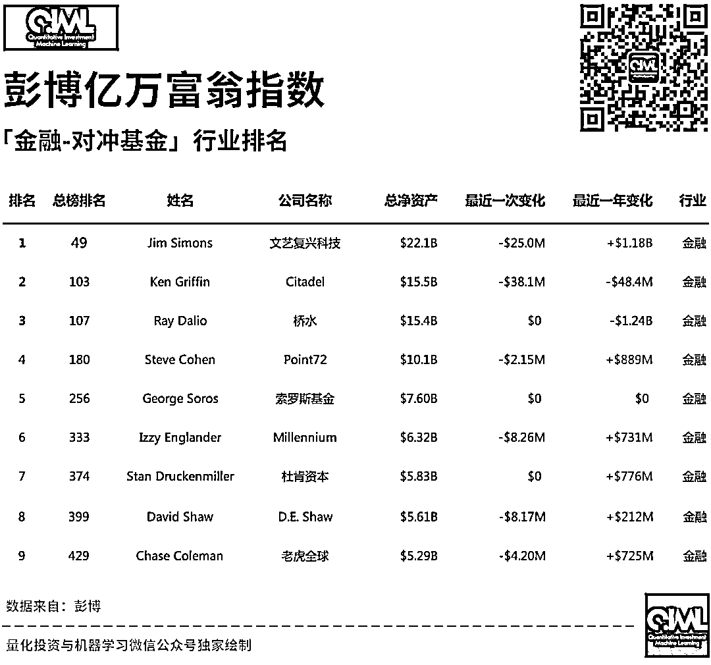

前三赢家

其中，西蒙斯老爷子的文艺复兴科技，目前**AUM 约为 1600 亿美元**（实际数字为：165968863264，更新至 2020-03-30）。

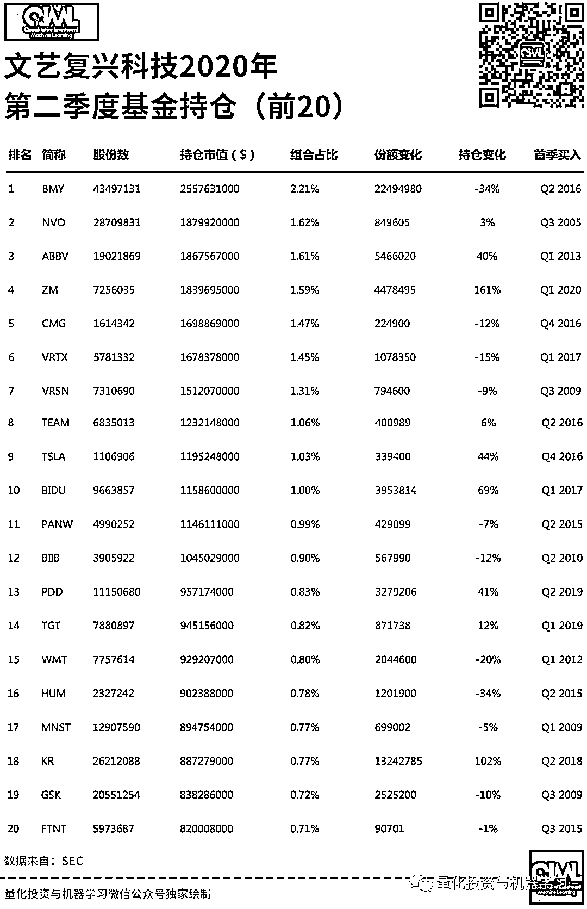

我们看到文艺复兴科技的前十重仓股中，排第一的为**BMY**（时美施贵宝公司—Bristol-Myers Squibb Company）。BMY 是一家以科研为基础的全球性的从事医药保健及个人护理产品的多元化企业，其主要业务涵盖医药产品、日用消费品、营养品及医疗器械。

****BMY**在所有提交 13F 的机构中有******2049******家持有，其中包括****335****家对冲基金。**

其中增持股票 TOP5 和减持股票 TOP5 如下：

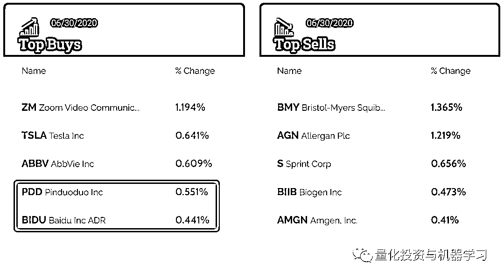

中概股**拼多多**和**百度**荣登买入股票 TOP5！看来大佬们还是看好中国的电商和互联网行业。

Zoom 成为增持股票第一名，看来对于疫情后面的云会议、云办公他们比较看好。

根据历史持仓统计，持仓 TOP10 的变化如下： 

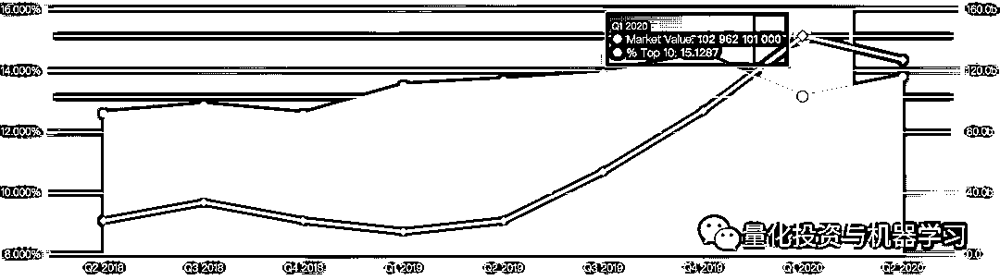

根据最新持仓统计：

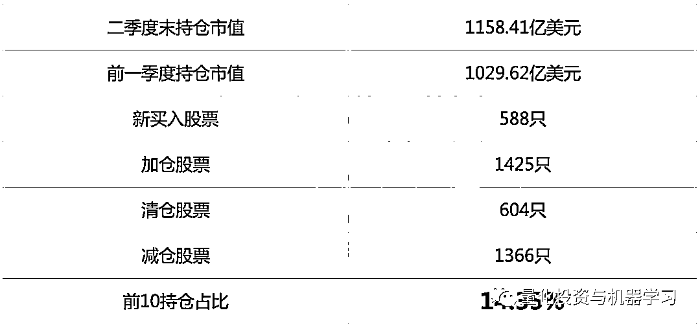

历史持仓行业分布：

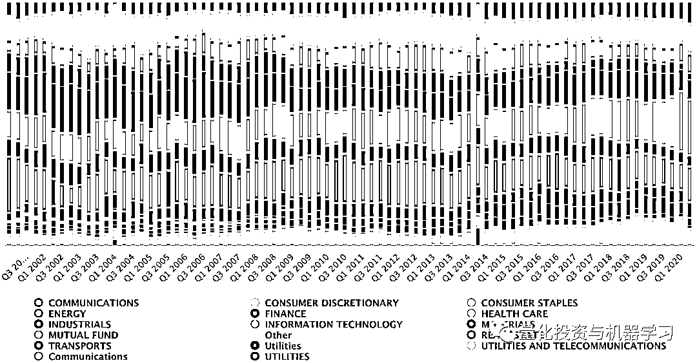

位于芝加哥的 Citadel Advisors，**目前 AUM 为 1246 亿美元**（实际数字为：234679962503，更新至 2020-05-28）。

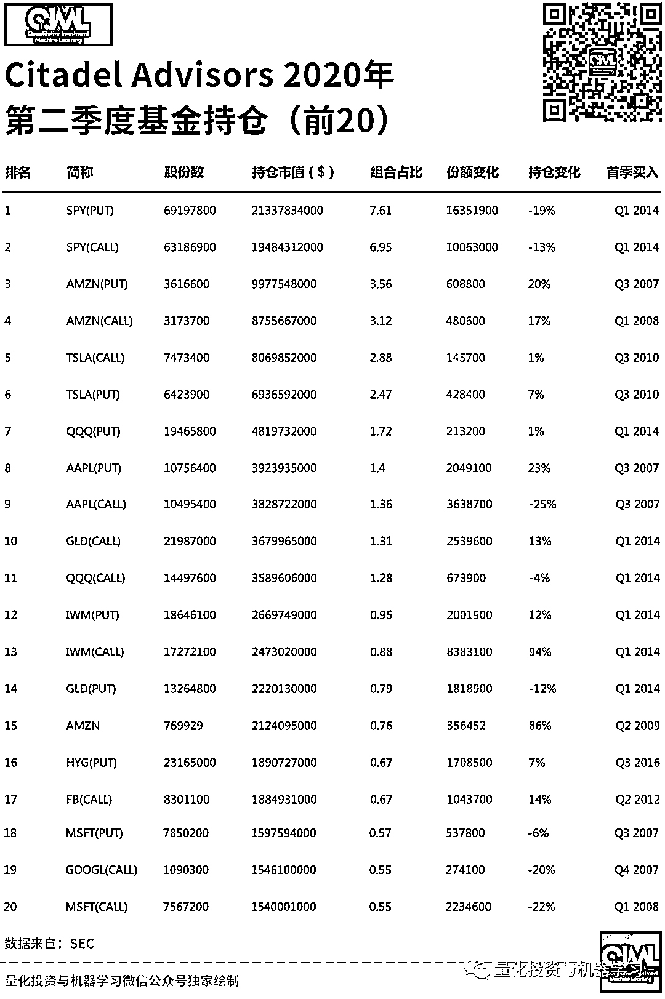

最大的持股是 SPDR 标普 500 指数 ETF 信托，持 69197800 股。

其中增持股票 TOP5 和减持股票 TOP5 如下：

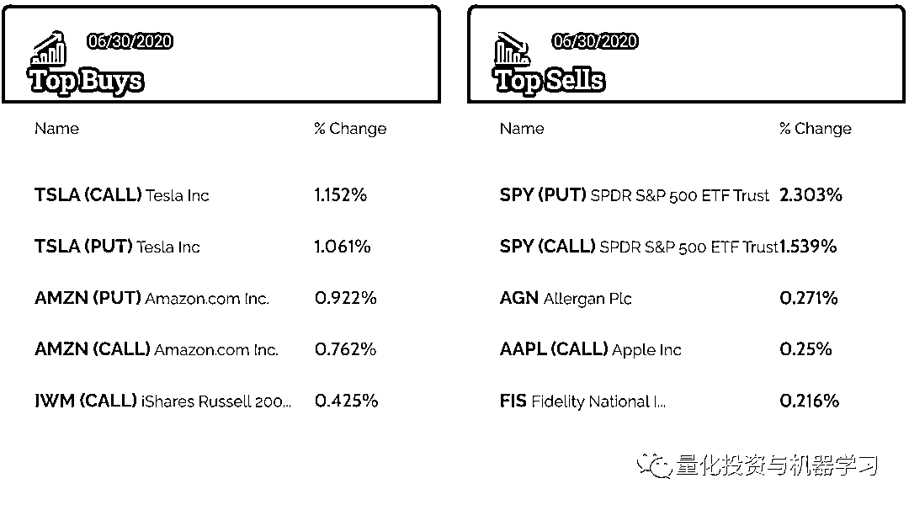

根据最新持仓统计：

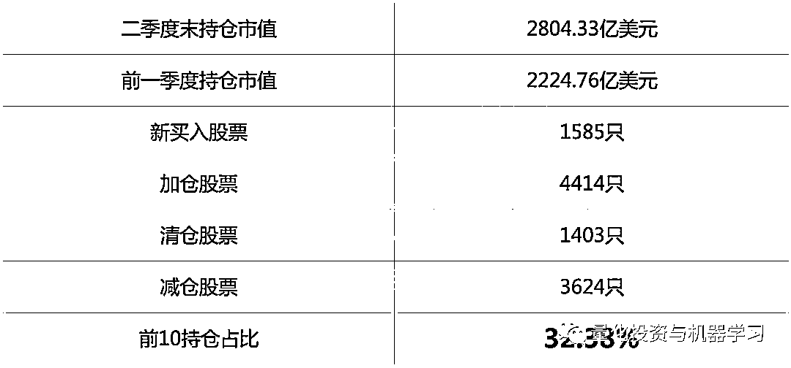

根据历史持仓统计，持仓 TOP10 的变化如下：

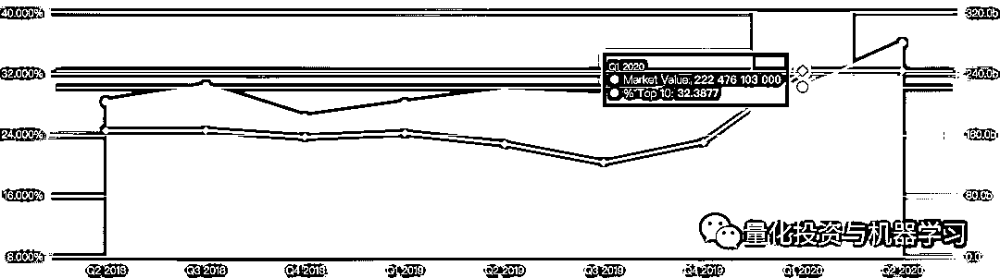

历史持仓行业分布：

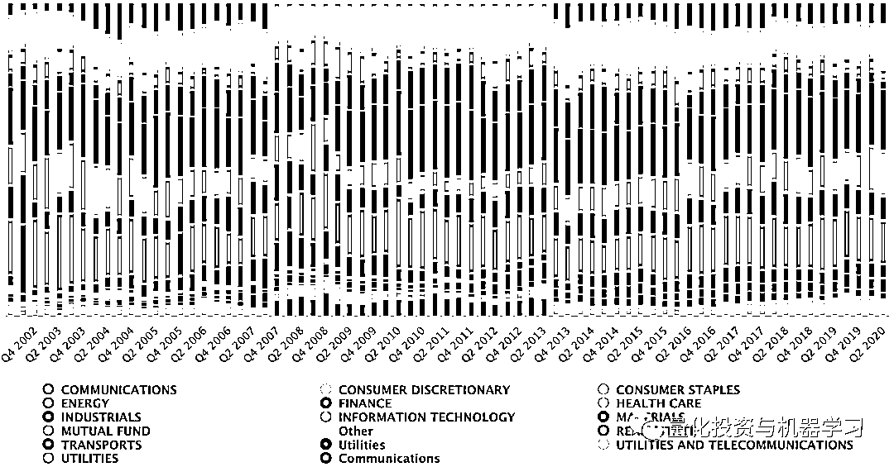

根据桥水提交的报告显示：**阿里巴巴跻身桥水基金美股第六大重仓股达 244%**，加仓后市值为**2.05 亿美元**。桥水还大幅加仓了两只中国 ETF，安硕中国大盘 ETF（排名 7）和安硕 MSCI 中国指数 ETF（排名 8），两者的加仓幅度分别为 717%、486%。

同时，桥水前五大卖出股分别是：美国国债 20+年 ETF-iShares(TLT.US)、巴西 ETF-iShares MSCI(EWZ.US)、美国高收益债 ETF-iShares(HYG.US)、美国投资级公司债-iShares(LQD.US)和新兴市场 ETF-Vanguard(VWO.US)

一直以来，桥水基金前十大重仓股由 ETF 占据，这次罕见地将个股调至前十大重仓。

我们看到，在基金组合前十中，有一只跟踪新兴市场指数的 ETF、一只跟踪发达国家市场指数的 ETF、两只跟踪中国指数的 ETF 和一只跟踪欧洲、亚洲、澳洲、远东地区市场指数的 ETF。可见桥水对中国市场的重视！

中概股中，桥水增持京东(JD.US)，增持幅度 250%；网易 NTES.US)，增持幅度 251%；拼多多(PDD.US)，增持幅度 432%；百度(BIDU.US)，增持幅度 251%；好未来(TAL.US)，增持幅度 309%；新东方(EDU.US)，增持幅度 276%；中通快递(ZTO.US)，增持幅度 894%；百胜中国(YUMC.US)，增持幅度 252%；携程(TCOM.US)，增持幅度 349%；蔚来(NIO.US)，增持幅度 1028%。另外，桥水还建仓百世集团(BEST.US)和虎牙(HUYA.US)。

根据最新持仓统计：

历史持仓行业分布：

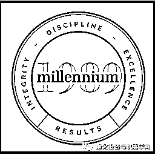

总部位于纽约的千禧年资管（Millennium），**目前 AUM 为 2767 亿美元**（实际数字为：276757327000，更新至 2020-03-30）。

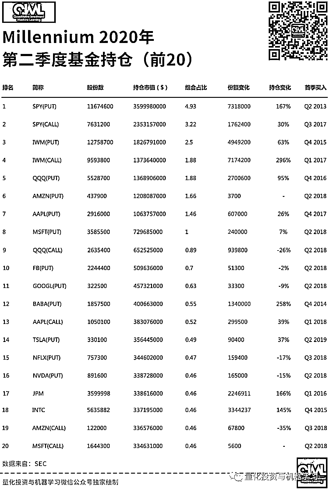

最大的持股是 SPDR 标普 500 指数 ETF，持股 11674600 股。**中国概股阿里巴巴也增持不少。**

其中增持股票 TOP5 和减持股票 TOP5 如下：

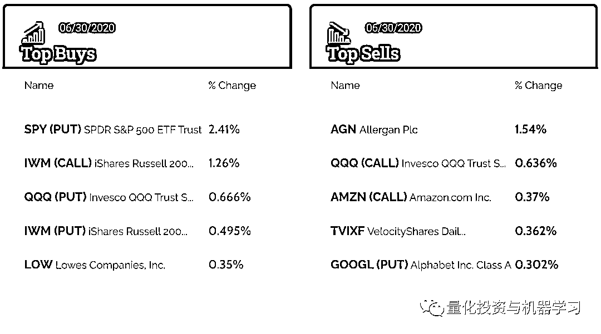

根据最新持仓统计：

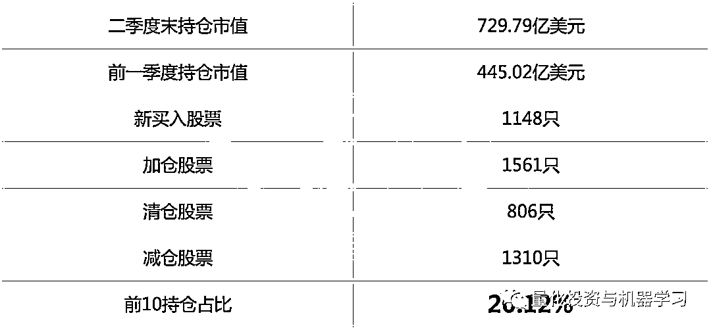

根据历史持仓统计，持仓 TOP10 的变化如下：

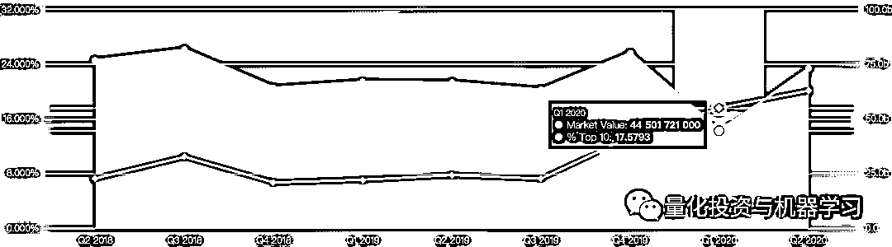

历史持仓行业分布：

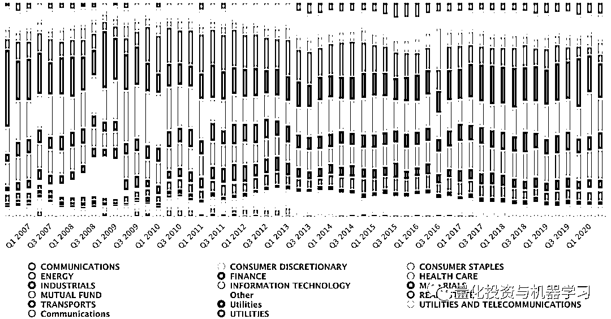

量化投资与机器学习微信公众号，是业内垂直于**Quant、Fintech、AI、ML**等领域的**量化类主流自媒体。**公众号拥有来自**公募、私募、券商、期货、银行、保险**等众多圈内**18W+**关注者。每日发布行业前沿研究成果和最新量化资讯。