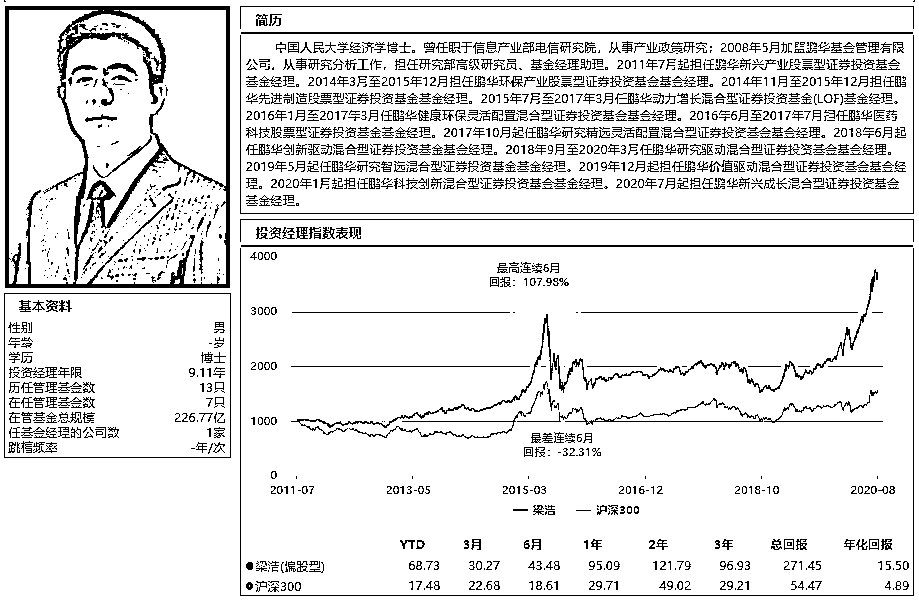
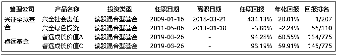

# 最强公募基金 25 人名单出炉！

> 原文：[`mp.weixin.qq.com/s?__biz=MzAxNTc0Mjg0Mg==&mid=2653304789&idx=1&sn=f7440ff0c65f80281f397596702d6bfa&chksm=802df5c0b75a7cd6db14f48afd754459bf74d2df775a70194a95b3c7c07aeb281064c46b5036&scene=27#wechat_redirect`](http://mp.weixin.qq.com/s?__biz=MzAxNTc0Mjg0Mg==&mid=2653304789&idx=1&sn=f7440ff0c65f80281f397596702d6bfa&chksm=802df5c0b75a7cd6db14f48afd754459bf74d2df775a70194a95b3c7c07aeb281064c46b5036&scene=27#wechat_redirect)

**全网 TOP 量化自媒体**

今天这篇文章非常有实战价值，帮助你寻找中国最强的基金经理！

无论对于银行、券商的客户经理，还是投资公募基金的一般投资者，或者公募基金从业者，这份名单都是高价值的，建议收藏。

文末，还有我们关于构建基金组合的建议，可参考。

***1*** 

**引言**

今年是公募基金发行大年，到目前为止，2020 年内新基金发行已超 1.8 万亿，其中约 1.1 万亿是权益类基金。

数据来源：Wind，截至 2020.8.19

规模在今年突飞猛进，至今为止，中国公募管理规模超百亿的基金经理已经上百人，爆款基金不断出现，甚至出现一天认购 1371 亿的基金产品。

但同时，我们也要意识到：在今年这批受吹捧的明星基金经理，多少是靠短期业绩、多少是凭借风口，多少靠上任的功劳，有多少只是一时爆款，有多少是盛名之下、其实难副，一旦打开封闭期，就风光不再？

过去两年科技、消费、医药大涨，使得相关基金经理业绩飙升，但这中间，又有多少人，只是风口上的猪呢？

时来天地皆同力，运去英雄不自由。

风口上的猪，毕竟只是猪，一旦风口过去，摔下去，只怕会更惨。

怎样找到有真实水平的明星基金经理，就是今天这篇文章的目的。

***2***

**几个基本标准：**

1、管理规模在**100 亿**以上，有一定市场影响力。

2、长期投研经验，**三年以上业绩，10 年以上优先。**

3、尽量选择在该公司**工作 3 年以上**的，更有稳定性。

4、要买**有水平、有操守**的基金经理，投资组合见人品。

5、**有成熟投资观和方法论，重仓股无暴雷。**

投资可能短期业绩不佳，但如果 2、3 年业绩还是不行，只能是水平问题。选 5 年、3 年、2 年、1 年四个时间维度，排名都在前三分之一的基金，年化收益尽量在 15%以上。

几个条件一卡，在严格标准下，选出了 25 个基金经理。

他们，是我个人现阶段认为最强的中国公募基金经理，都是权益类，不涉及固收，如有遗漏部分，在所难免，请理解。

这份名单，是高价值的，免费分享给大家，共同提高。

***3***

**最强 25 人**

按基金公司二季度规模大小排名顺序，每家公司不超过两名基金经理，如下：

**1、易方达：张坤，****管理规模：522 亿。****风格：消费成长**

简介：你可以说张坤拿的茅五泸都是大路货，但那只是后视镜效应，茅台经历过多次负面冲击，多少人能拿茅台那么久，那么坚定？

**张坤坚持好赛道集中持股，不择时。**

易方达中小盘，自 2012 年任职回报 540%，已是传奇。

**2、广发基金：刘格菘，管理规模 821 亿。风格：科技成长**

简介：2019 年的公募冠军基金经理，风格进取，集中持股，激进型选手，主要选科技、医药的龙头股。

**刘格菘的风格，或许是波动比较大的，这也是他的争议之处。**

但是，以结果论英雄，单从 821 亿的规模来看，他一个人的管理规模就可以顶得上一家公司，可以排名到非货币全部公募基金公司的第 35 名。

**3、广发基金：傅友兴，管理规模 386 亿。风格：稳健成长**

简介：傅友兴的风格，和同公司的刘格菘，截然相反。再看好的公司，他也不会集中重仓。 

傅友兴选股很好，善于资产配置、深度研究公司、坚持长期投资，但是他不将资源全部用来进攻，而是防守强于进攻。 

这样的风格，**牛市时跟上市场、熊市跌幅小于市场**，注重确定性、少犯错、极其稳健、冷静，长期下来，有望获得中长期可持续的超额收益。

**4、华夏基金：蔡向阳，管理规模 325 亿。风格：价值成长**

简介：蔡向阳目前管理的基金中，名气最大的当属华夏回报 A，这只基金的历史有多辉煌，自不必多说。成立 17 年来，累计收益 1536%，复合年化收益率 17.91%，在同类基金中位居第一。

蔡向阳的投资特点是**“坚持价值投资，精选龙头个股”**。稳健操作，严控回撤。投资上主要是“自下而上”精选个股，基本上锁定为消费、医药行业的龙头股。

**5、南方基金：茅炜，管理规模 740 亿。风格：均衡成长**

简介：今年发行规模最大的基金，就是茅炜发行的南方成长先锋，规模 321 亿。

**茅炜在投资上，风格不局限在单一行业，成长、周期、价值都有覆盖，关注指标 ROE，一个是 ROE 能够增长，另一个是 ROE 能保持稳定，这些往往都是行业中优秀的公司，这两点也都能在财报中进行跟踪和拆解。**

**6、汇添富基金：胡昕炜，管理规模 545 亿。风格：消费成长**

简介：胡昕炜是汇添富基金一手培养出来的明星基金经理，胡昕炜以消费出道，但能力圈不仅在消费，近年来，投资领域增加了医药的权重，并且在中游制造、周期、TMT、金融地产等“泛消费”相关板块均有过一定的配置。

**胡昕炜重视 ROE 指标，看重有狼性文化的企业，他会选择优秀公司，长期投资、价值投资，找时代的强者。**

**7、汇添富基金：劳杰男，管理规模 342 亿。风格：价值均衡**

介绍：和其他基金经理不同，劳杰男会把防范风险放在第一位。

如果用一个词来形容劳杰男，我认为是“复利”——他不追求短期的爆发力，而追求积胜，追求时间带来的持续稳定复合收益**。他管理的汇添富价值精选混合，自 2009 年成立以来累计回报 718.03%，遥遥领先同期业绩基准，可谓长跑之王。**

**8、富国基金：朱少醒，管理规模 142 亿。风格：成长均衡**

介绍：朱少醒非常低调，近年来他鲜少在外界抛头露面。

**朱少醒在基金界从业 20 年，自 2005 年起，管理一只基金富国天惠已长达 15 年，任职回报 23 倍，年化回报高达 24.14%，可谓痴心长情剑。**

以今天朱少醒的江湖地位，发一只 300 亿的爆款基金轻而易举，但他依然克制，不为所动，有且只有一只基金，择一公司而白首，择一基而终老，在这个喧嚣的时代，可谓一股清流。

用一句话形容，**喜欢是放肆，但爱是克制，朱少醒做自己喜欢的事，不被外界挟裹。**

**9、富国基金：李元博，管理规模 316 亿 。风格：科技成长**

介绍：李元博是一位进攻性很强的科技股选手。

他的代表作是富国创新科技，2016 年成立以来回报 144.50%，年化回报 23.86%，同类排名居前。

**李元博的风格，是明显的成长股风格，偏好配置中小市值、流动性强、高成长的股票。**

**李元博的风格类似威廉欧奈尔，趋势投资，做基本面的右侧，注意进攻性。**

这个理念其实是超额收益的来源，超额收益有两个来源，一个是市场会对差的东西过分的悲观，这是找到拐点有超收益的来源。

另外，对于好的东西市场是预估不足的，这是所谓趋势的力量。

**10、工银瑞信：袁芳，管理规模 230 亿。风格：消费均衡**

介绍：袁芳的经历很励志，**从工银基层一步步做到基金经理，很适合当作女性奋斗精神素材。**

袁芳管理产品具有显著的均衡风格特征，在多数时间段内名次长期靠前。 

袁芳所管理的工银文体产业、工银新生代消费、工银科技创新 3 年等三只基金成立以来年化回报均位于同类前 11%，且区间年化波动率显著低于同类平均，以较低的风险为投资者获得了领先的回报。

**11、嘉实基金：归凯，管理规模 298 亿。风格：价值成长**

介绍：根据海通证券排名数据，截至 2020 年 6 月末，归凯管理的嘉实泰和近五年业绩排名偏股混合型基金业绩第 3、嘉实新兴产业基金排名主动股票型基金近五年业绩第 1、嘉实增长基金排名近两年业绩第 1，长期业绩突出。

归凯换手率较低，赚业绩成长的钱，较少参与风格或主题轮动。

**归凯将自己定位为"成长风格的价值投资者"，他看重长期有成长想象力的好生意和好公司，希望能够投资到有未来的伟大公司。**

**12、鹏华基金：王宗合，管理规模 436 亿。风格:消费成长**

介绍：王宗合在今年创造了公募一天认购 1371 亿的历史纪录，他的风格，是深度研究的价值投资。

**王宗合的投资集中在消费、医药等龙头公司，从特点来看，长期投资、价值投资、集中投资、换手率低，这几个特点看，指向的都是深度研究后的长期持有。**

同时，王宗合也在不断破圈，和时代同行、和优秀公司同行，提高自己的认知能力。

**13、鹏华基金：梁浩，管理规模 226 亿。风格：小盘成长。**

介绍：和王宗合厚重的风格不同，梁浩的风格是剑走轻灵，集中在一些新兴行业的小盘成长股，业绩也是很突出的。

梁浩的代表作是鹏华新兴产业，2011 年任职以来，9 年任职回报 415.88%，年化回报 19.74%。

**梁浩善于选择一些冷门的成长公司，等待其发展壮大，眼光精准、角度独特。**

**14、交银施罗德基金：王崇，管理规模 196 亿。风格：成长均衡**

介绍：王崇是交银三剑客之一，他的代表作是交银新成长，自 2014 年任职以来，6 年总回报 346.16%，年化回报 29.24%。

王崇的投资策略核心是自上而下控制系统风险，自下而上从中观和微观层面选择高景气成长行业/公司来投资。

**王崇认为，投资的核心是控制风险，当我们能够控制好组合的回撤风险，在别人跌的时候能少跌一些，在别人涨的时候能多涨一些，那长期来看可观的收益就是水到渠成的事情。**

王崇的基金是你可以放心重仓的，不会暴涨暴跌，短期排名或许不冒尖，但拉长时间看就非常惊艳。

**15、中欧基金：葛兰，管理规模 250 亿。风格：医药成长**

介绍：葛兰是我个人比较偏好的基金经理，也受到市场欢迎，她在周一发的新基金，在行情相对平淡的情况下，一天获得 550 亿认购，可见市场认可度。

**葛兰可谓是基金经理中的“科学家”，美国西北大学生物医学博士，是少有的基金经理中，真正懂医药的人。 **

葛兰用科研精神做投资，在医药研究中多次挖掘出独门金股，掌管的基金业绩都是同类型中的佼佼者。

她的代表作中欧医疗健康，自 2016 年以来任职回报 220.32%，年化回报 34.88%。

**葛兰的风格，有女中豪杰之风，那就是集中持有自己看好的公司，不惧高估值，而基金的业绩回报也证明了她的眼光，说她是“医药女神”并不为过。**

**16、中欧基金：周应波，管理规模 267 亿。风格：中盘成长**

介绍：**周应波是成长股风格，但他投资的关注度比较宽泛，看重的是成长本质，而非其外在形态。**

周应波认为，管理层的成长是最重要的。

周应波是风险厌恶型的，GARP 风格，他买的成长股，平均的 PB 只比传统价值股稍微高一点点。而且一旦估值到了某个位置，他还是会选择卖出的。

周应波是中盘成长风格，能涨抗跌，适合多种市场形态。

**17、银华基金：李晓星，管理规模 196 亿。风格：科技+消费，成长风格**

介绍：李晓星是我偏好的一位基金经理，**他的风格是买左侧、卖左侧，不得贪胜，放弃短期排名，专心追求投资的确定性、追求胜率和长期回报。**

李晓星的代表作是银华中小盘，2015 年成立以来，5 年总回报 178.55%，年化回报 22.14%。

李晓星的风格，短期不显山露水，但长期来看，胜出的概率很大。“按照我们的投资框架，最后一部分钱通常是不赚的。长期坚持这样的投资方法有助于避免犯大错，给投资者更加安心的收益。”

**18、兴证全球基金：董承非，管理规模 469 亿。风格：价值成长**

介绍：这里吐槽一下兴证全球基金，太喜欢改名了，兴业基金、兴业全球、兴全基金、兴证全球，对普通人可真是傻傻分不清楚。

写它的时候老觉得要写错名字，吐血。

董承非 2003 年开始进入兴证全球基金工作，一呆就是 17 年，他的代表作兴全趋势投资，2013 年任职以来回报 298.65%，年化回报 22.50%。

董承非长期管理百亿以上资金，难度比较大，他将自己定位为策略型投资选手，自下而上选股，构建组合时会加入一些自上而下的配置，综合各种策略构建均衡投资组合。

**个股选择上，董承非对投资标的可控性、确定性要求高，大部分仓位配置相对有安全边际的公司，聚焦低估值个股。同时通过小仓位试错扩展投资能力。重仓股持有周期基本在一年以上，展现出长期投资的特点。**

**19、兴证全球基金：谢治宇，管理规模 307 亿。风格：稳健成长**

介绍：谢治宇是我比较认可的一位基金经理。

谢治宇的代表作兴全合润，2013 年成立以来任职回报 566.29%，年化回报 28.52%，远超业绩基准。

谢治宇组合构建均衡、行业分散、回撤小，风格稳健，多次获得金牛奖。

**更值得一提的是选股精准，兴全合润的重仓股，长期来看回报优秀，这个推荐大家重点关注。**

**20、国泰基金：程洲，管理规模 152 亿。风格：价值成长**

介绍：程洲做投研有 20 年，其管理基金的年限也超过了 12 年。国泰基金程洲的代表作是国泰聚信价值优势，2013 年成立以来，任职回报为 387.24%，年化回报 26.77%。

**程洲是 A 股市场上极稀缺的逆向价值策略投资者，买到过许多股票的大底部。**

程洲的选股标准主要有三个。首先，选择行业龙头，基本上都是前三的公司。其次，他关注自由现金流这个指标，希望找到能持续产生正向自由现金流的公司。这样至少能帮我规避掉一些财务造假的公司。第三、他喜欢买相对低估的公司。

**21、华泰柏瑞基金：张慧，管理规模 127 亿。风格：稳健成长**

介绍：张慧的代表作是华泰柏瑞创新升级，2014 年成立以来任职回报 352.75%，年化回报 27.12%。

张慧的特点是成长股风格，却又控制回撤，长期收益好。

**张慧的方法论是“有管理的选股体系”——从中观视角出发，自下而上选取景气度向上和景气持续的行业中，寻找具有业绩动量的优秀公司，并对标的不断跟踪迭代。**

以此形成收益来源稳定的投资方法，不依赖单一市场风格，而是在大部分市场环境中都能赚钱。

同时，他会通过量化工具的运用进行风险进行识别和管理，并适当地对组合做逆向平衡，让组合波动率和收益率更好地匹配，以实现超额收益的稳定和持续。

**22、融通基金邹曦，管理规模 143 亿。风格：周期成长**

介绍：融通基金邹曦，具有 19 年基金从业经验，投资年限 12.71 年。

邹曦的代表作是融通行业景气，从融通行业景气的持仓来看，邹曦有仓位高、行业集中、换手率低的交易特点。融通行业景气 2012 年成立以来任职回报 275.15%，年化回报 17.65%。

**邹曦是市场上极少数，基于中观的产业趋势进行投资的基金经理。**

邹曦认为，产业趋势代表长变量，一旦产业趋势向上，就能抵消周期的波动，甚至在周期向上的时候获得戴维斯双击。

邹曦的原则是，无结构不投资，如果看不到结构性的产业趋势就不会轻易介入。

**23、泓德基金邬传雁，管理规模 213 亿。风格：成长均衡**

介绍：邬传雁的管理规模 213 亿，而他在的泓德基金，二季度的非货币规模是 612 亿，一人占了 1/3，在公司的重要性可想而知。

邬传雁的代表作是泓德远见回报，2015 年成立以来任职回报 162.69%，年化回报 21.35%。

**邬传雁是保险背景，行业分散、持股集中，换手率低，属于精选个股、长期投资，陪伴公司成长的基金经理。**

**24、睿远基金傅鹏博，管理规模 176 亿。风格：成长价值**

介绍：傅鹏博是基金业老将，证券从业经验 28 年，基金管理经验 11 年。

傅鹏博的代表作是以前的兴全社会责任，9 年任职回报 434.13%，年化 20.01%，同类回报排名第一。

而他管理睿远成长价值以来，任职回报 94.18%，表现也是不错的。

**傅鹏博的风格，还是和兴证全球比较像，行业分散、注重选股，集中度较高。**

傅鹏博曾表示在进行股票配置时，会将基金的股票组合分成三个部分：

首先是 40%左右的核心股票，挑选那些具有稳定增长能力的、可以通过时间来创造价值的股票；

其次安排 20%左右的仓位为阶段性低估股票；

剩余的仓位配置一些政策引导或市场引导型股票。

**25、信达澳银冯明远，管理规模 191 亿。风格：科技小盘**

介绍：截至 6 月末，信达澳银的非货币管理规模为 247.13 亿元，而冯明远一人的规模，就达到了 191.75 亿元。

**可以说，冯明远以一己之力，撑起了信达澳银这家中小基金公司的权益规模。**

冯明远偏好小盘成长股，但又持仓极度分散，前十大重仓股比例仅为 22.08%，股票池中共有 200 多只个股，任何一只个股的涨跌对基金影响都很小。

冯明远身上还有一个标签，就是完全的自下而上选股。

他表示，“在选股上，我最看重的是公司的综合素质，所以我会花比较多的精力和时间进行长期跟踪，各方面素质都比较理想的公司个股会进入到选股池。”

冯明远靠业绩说话，他管理的信达澳银新能源，2016 年成立以来任职回报 237.34%，年化回报 37.30%，他是三年期公募业绩冠军。 

不禁想起一句话：“鲜衣怒马少年时。”

***4***

**高质量基金组合构建**

介绍了 25 名中国最强的公募基金经理后，最后讲一下对于个人投资者来说，如何构建高质量的基金组合。

我这里不说大道理，从实战角度，以资金规模划分，有几个选择：

**第一、30 万以下资金，建议只选一个基金，没必要分散**

对于 60 岁以下的投资者，个人建议偏成长风格，这里可以考虑朱少醒的富国天惠，追求年化 20%收益率，可以长期持有。

对于 60 岁以上的投资者，个人建议偏保守风格，可以考虑广发傅友兴的广发稳健增长，或汇添富劳杰男的汇添富价值精选，追求年化 15%的收益率，可以长期持有。

**第二、50 万以下资金，建议选两个基金做组合。**

这里推荐朱少醒的富国天惠和谢治宇的兴全合润，比较均衡成长。

**第三、100 万以下资金，建议选三个基金做组合。**

这里推荐朱少醒的富国天惠、谢治宇的兴全合润、周应波的中欧时代先锋，都是攻守兼备，行业均衡的产品。

**第四、100 万以上资金，建议选 10 个基金做组合。**

这里推荐如下：

1、汇添富消费行业

2、鹏华消费优选

3、汇添富价值精选

4、富国创新科技

5、工银瑞信文体产业

6、交银新成长

7、银华中小盘

8、华泰柏瑞创新升级

9、融通行业景气

10、中欧医疗健康

**这样一个组合，把成长、价值、均衡等主要风格，消费、医药、科技、周期、蓝筹等主要赛道都覆盖，行业均衡，兼职长期、中期、短期，而且都是各基金经理的代表作。**

可以说是群星荟萃、风格各异，非常优秀了。 

最后总结，自 1998 年开始，中国公募走过 22 年，到今天，我国境内共有基金管理公司 149 家，公募基金资产净值合计 16.9 万亿元。

所谓：江山代有才人出，各领风骚数百年。

在新一代的基金经理里，可以看到，有不少优秀的选手正在脱颖而出，就我个人的判断，这批新生代，有的实力远超已离开公募业的所谓“公募一哥”。

纸上得来终觉浅，绝知此事要躬行。

祝愿大家能够在基金投资方面有所收获、共同寻找财富自由之路。

免责声明：基金研究、分析不构成投资咨询或顾问服务，不构成投资建议，本账号发布的言论仅代表个人观点，不作为买卖的依据。基金投资有风险，基金的过往业绩不预示其未来表现。敬请认真阅读相关法律文件和风险揭示声明，基于自身的风险承受能力进行理性投资，自行承担投资基金的风险。

量化投资与机器学习微信公众号，是业内垂直于**Quant、Fintech、AI、ML**等领域的**量化类主流自媒体。**公众号拥有来自**公募、私募、券商、期货、银行、保险、资管**等众多圈内**18W+**关注者。每日发布行业前沿研究成果和最新量化资讯。