# 最新！全球顶级对冲基金持仓公布，文艺复兴规模超 1600 亿美元

> 原文：[`mp.weixin.qq.com/s?__biz=MzAxNTc0Mjg0Mg==&mid=2653304618&idx=1&sn=627dbb96aa4ecb97017e9a2bbdcbbad9&chksm=802df53fb75a7c2913d3208e58fe5011d81a9b22de32a416d755ad24f2201b69900ece4eae73&scene=27#wechat_redirect`](http://mp.weixin.qq.com/s?__biz=MzAxNTc0Mjg0Mg==&mid=2653304618&idx=1&sn=627dbb96aa4ecb97017e9a2bbdcbbad9&chksm=802df53fb75a7c2913d3208e58fe5011d81a9b22de32a416d755ad24f2201b69900ece4eae73&scene=27#wechat_redirect)

**全网 TOP 量化自媒体**

量化投资与机器学习编辑部**前言**

公众号根据全球各地对冲基金公司向美国证监会（SEC）提交了其 13F 报告。对其持仓做了全面的分析。所有数据都是根据最新编写。希望大家有所收获！

**什么是 13F？**

13F（也叫 SEC 13F)，是一份季度报告，由机构投资经理提交给美国证监会（SEC，U.S. Securities and Exchange Commission）。SEC 规定：**股票资产超过 1 亿美元的机构，都需要在每个季度结束的 45 天内向 SEC 提交该季度末的股票持仓报告**。它的内容包括该基金的一些基本信息，以及所持成分股的信息，例如持有股数，成分股所占头寸等等。

13F 报告样例

**13F 文件有两个需要注意的点**：一是只要求基金披露他们的多头头寸，而很多基金都会出于风险管理的目的，同时持有同一公司的多头和空头头寸，因此 13F 文件并不能保证提供了完整的机构投资信息除此之外，有的基金也会向 SEC 申请隐瞒一部分的持股情况，以保护自己的持仓信息。例如，机构即使是在看跌的情况下仍然持有该公司的股票，但同时有持有该公司的看跌期权的情况也很正常（机构在投资某公司时同时使用了股票和期权的情况很常见）。

以下机构包括：**文艺复兴科技、贝莱德、桥水、Two Sigma、Man Group、Millennium、Citadel、Lone Pine、AQR、Viking、TIGER、Egerton Capital**等。

**文艺复兴科技**

西蒙斯老爷子的文艺复兴科技，目前**AUM 约为 1600 亿美元**（实际数字为：165968863264，更新至 2020-03-30）。

我们看到文艺复兴科技的前十重仓股中，排第一的为**BMY**（时美施贵宝公司—Bristol-Myers Squibb Company）。BMY 是一家以科研为基础的全球性的从事医药保健及个人护理产品的多元化企业，其主要业务涵盖医药产品、日用消费品、营养品及医疗器械。

****BMY**在所有提交 13F 的机构中有******2049******家持有，其中包括****335****家对冲基金。**

其中增持股票 TOP5 和减持股票 TOP5 如下：

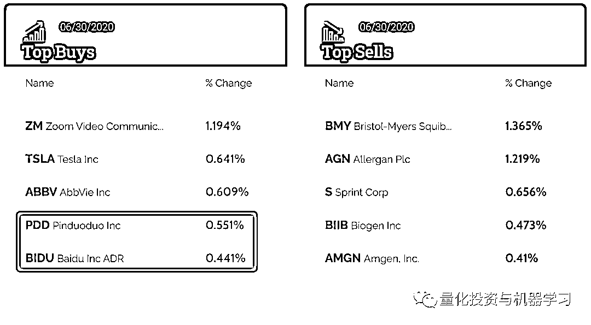

中概股**拼多多**和**百度**荣登买入股票 TOP5！看来大佬们还是看好中国的电商和互联网行业。

Zoom 成为增持股票第一名，看来对于疫情后面的云会议、云办公他们比较看好。

根据历史持仓统计，持仓 TOP10 的变化如下： 

根据最新持仓统计：

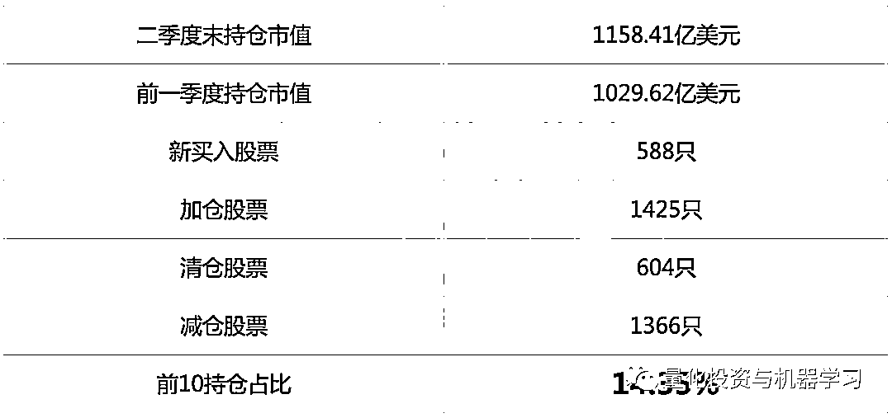

历史持仓行业分布：

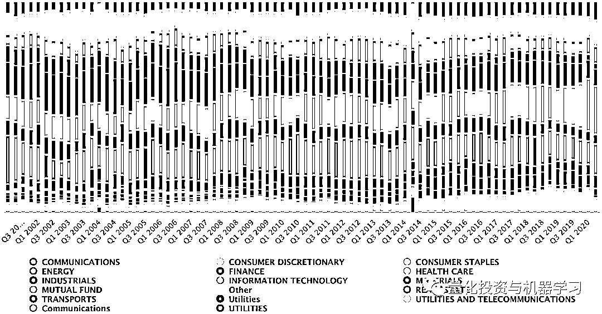

有关文艺复兴的更多推文：

往期推荐

 [文艺复兴进军比特币！币圈割韭菜？](http://mp.weixin.qq.com/s?__biz=MzAxNTc0Mjg0Mg==&mid=2653298031&idx=1&sn=55fdcd261278e8aebbb2183bb9fe8e74&chksm=802ddf7ab75a566cc8c156eb3a9f0eb6687b5e3d4faaeeee395ce9dae43132f6d06bd46a5183&scene=21#wechat_redirect)  [西蒙斯终放手！子承父业，文艺复兴该何去何从？](http://mp.weixin.qq.com/s?__biz=MzAxNTc0Mjg0Mg==&mid=2653296607&idx=1&sn=0e23be0ef03e48d53f102c724101d1e7&chksm=802dd5cab75a5cdcbae6bd3fa2491505a386a7bafd7c74b064e3ceb9ee406114c4d189c330ae&scene=21#wechat_redirect)  [文艺复兴：西蒙斯的另一面！](http://mp.weixin.qq.com/s?__biz=MzAxNTc0Mjg0Mg==&mid=2653296499&idx=1&sn=cee54028e5d93e1375a315a530ef264f&chksm=802dd566b75a5c70659051d01a40d6a223ccf5ea30f134fa805c26d2f7c5d78f87f4afae53f8&scene=21#wechat_redirect)  [2019 西蒙斯访谈二：数学，一生所爱！](http://mp.weixin.qq.com/s?__biz=MzAxNTc0Mjg0Mg==&mid=2653295879&idx=1&sn=682b0863d90682b69b4fc700f31e0c99&chksm=802dd712b75a5e043b3c1d550ca0e256898a870d4906895f7562272928055ca1e02bdbb85f39&scene=21#wechat_redirect)  [西蒙斯新书：『超级脱水』读书笔记！](http://mp.weixin.qq.com/s?__biz=MzAxNTc0Mjg0Mg==&mid=2653295295&idx=1&sn=a85a396e206d94def8940c08e5097f0b&chksm=802dd0aab75a59bc035e0d16b5821842845cf31344a9063b98e46ff31045943d06134a4810e1&scene=21#wechat_redirect)  [手慢无！了解文艺复兴的新书有电子版啦！](http://mp.weixin.qq.com/s?__biz=MzAxNTc0Mjg0Mg==&mid=2653295256&idx=1&sn=10f417ac4cfb27238e4a4ed13dce24d1&chksm=802dd08db75a599bc013b11341a4873cad6b6c25ff750c6835b3828fa646919aee515cca236e&scene=21#wechat_redirect)  [想去文艺复兴？看看西蒙斯给你发多少钱！](http://mp.weixin.qq.com/s?__biz=MzAxNTc0Mjg0Mg==&mid=2653295088&idx=1&sn=866988471ef6e19cc4375f35f16906fb&chksm=802dd3e5b75a5af3e23ff993be3ca976d4b883182fc576145cb9525fefe783545ab2f7c8aaa9&scene=21#wechat_redirect) 

[2019 最新西蒙斯访谈：量化策略、职业与交易](http://mp.weixin.qq.com/s?__biz=MzAxNTc0Mjg0Mg==&mid=2653293316&idx=1&sn=1828e486f53b70a21c04b94b020ed5c6&chksm=802dc911b75a4007c02d27551ebdfe712dfc60f8dfb6caf2aa9b6244d5f494741a8923413d6a&scene=21#wechat_redirect)

**Two Sigma **

位于纽约的 Two Sigma Investments，由 John Overdeck 和 David Siegel 管理。**目前 Two Sigma 的 AUM 约为 661 亿**（实际数字为：66143308977，更新至 2020-03-30）。

我们看到 Two Sigma 的前十重仓股中，排第一的为**AMZN**（Amazon—亚马逊）。是美国最大的一家网络电子商务公司，位于华盛顿州的西雅图。是网络上最早开始经营电子商务的公司之一，亚马逊成立于 1995 年，一开始只经营网络的书籍销售业务，现在则扩及了范围相当广的其他产品，已成为全球商品品种最多的网上零售商和全球第二大互联网企业，

****AMZN**在所有提交 13F 的机构中有******3079******家持有，其中包括****608****家对冲基金。**

其中增持股票 TOP5 和减持股票 TOP5 如下：

根据历史持仓统计，持仓 TOP10 的变化如下：

根据最新持仓统计：

历史持仓行业分布：

**Man Gropu PLC**

英仕曼（Man Gropu）是具世界领导地位的另类投资管理公司，也是世界最大的证券市场公开上市的对冲基金运营商之一，英仕曼集团（Man Group plc）历史距今有 227 年的时间，是英国最大的 100 家上市公司之一，属富时 100 指数成分股（FTSE100）。

我们看到 MAN 的前十重仓股中，排第一的为**MSFT**（微软）。

******MSFT****在所有提交 13F 的机构中有******3335******家持有，其中包括****634****家对冲基金。**

其中增持股票 TOP5 和减持股票 TOP5 如下：

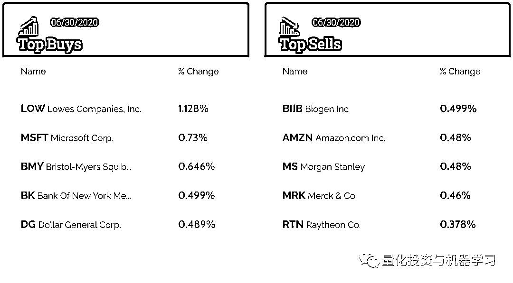

根据最新持仓统计：

根据历史持仓统计，持仓 TOP10 的变化如下：

历史持仓行业分布：

**Millennium**

总部位于纽约的千禧年资管（Millennium），**目前 AUM 为 2767 亿美元**（实际数字为：276757327000，更新至 2020-03-30）。

最大的持股是 SPDR 标普 500 指数 ETF，持股 11674600 股。**中概股阿里巴巴也增持不少。**

其中增持股票 TOP5 和减持股票 TOP5 如下：

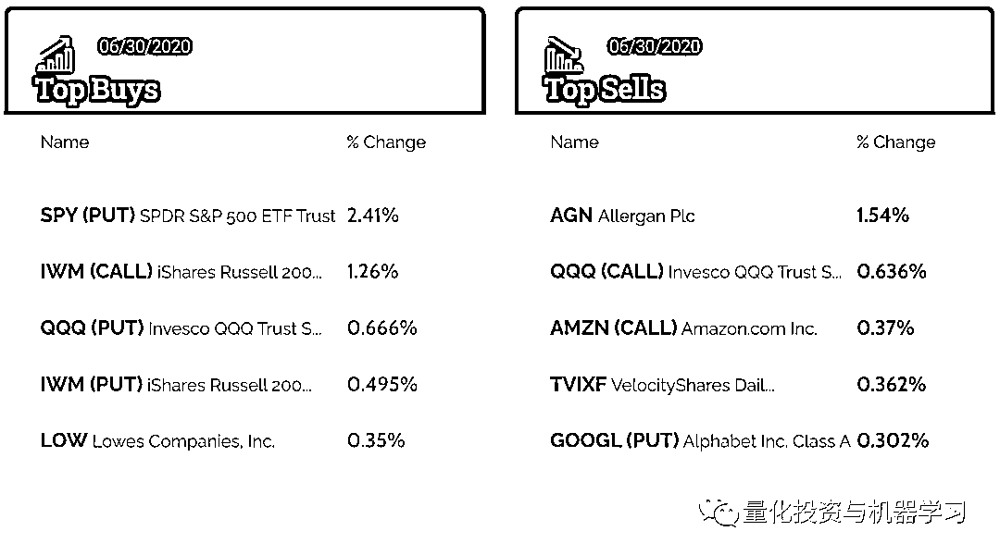

根据最新持仓统计：

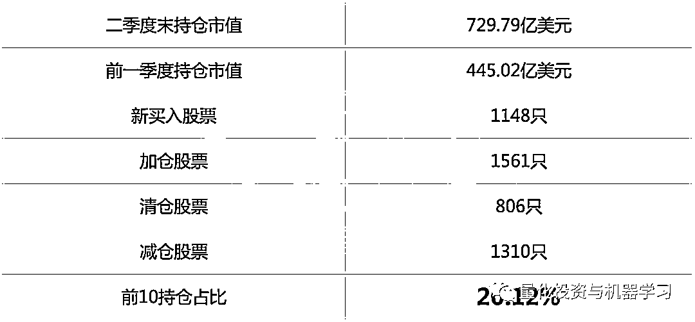

根据历史持仓统计，持仓 TOP10 的变化如下：

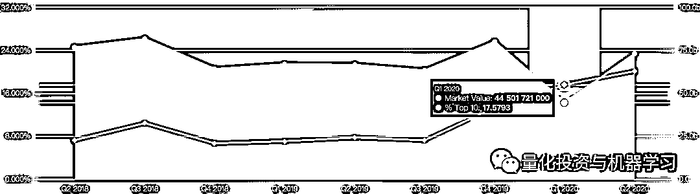

历史持仓行业分布：

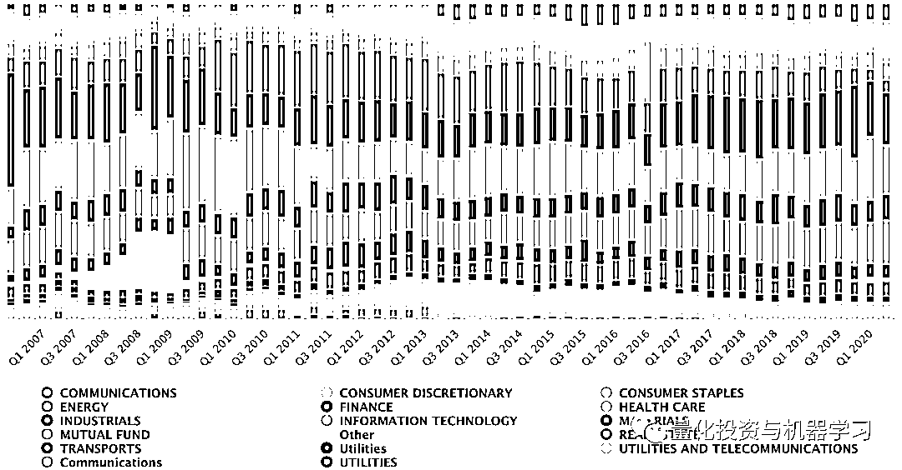

**Citadel**

位于芝加哥的 Citadel Advisors，**目前 AUM 为 1246 亿美元**（实际数字为：234679962503，更新至 2020-05-28）。

最大的持股是 SPDR 标普 500 指数 ETF 信托，持 69197800 股。

其中增持股票 TOP5 和减持股票 TOP5 如下：

根据最新持仓统计：

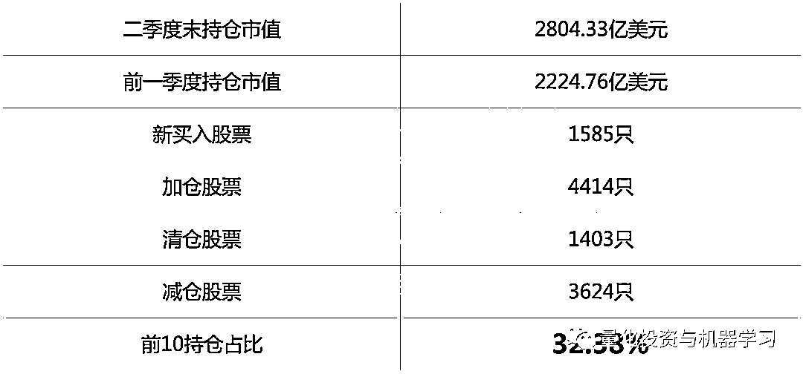

根据历史持仓统计，持仓 TOP10 的变化如下：

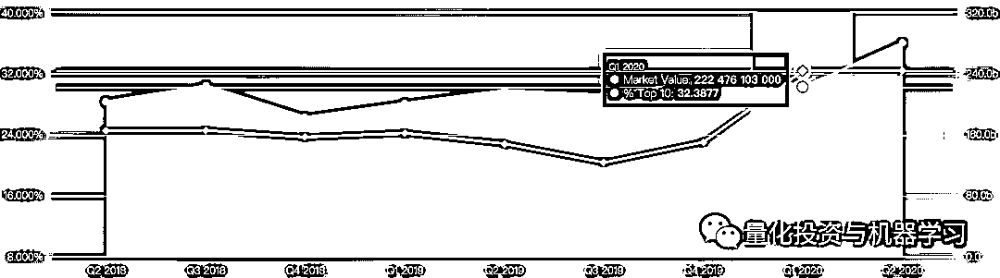

历史持仓行业分布：

**Lone Pine**

总部位于格林威治的孤松资本（Lone Pine）始建于 1997 年，由 Steve Mandel 创建。孤松资本是一家私人拥有的对冲基金，在世界各地的公共股权市场进行投资。

**孤松资本最大的持股是中概股：阿里巴巴。**

其中增持股票 TOP5 和减持股票 TOP5 如下：

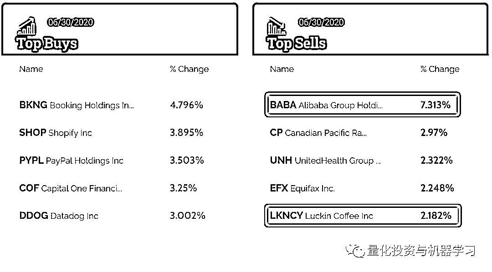

根据最新持仓统计：

根据历史持仓统计，持仓 TOP10 的变化如下：

历史持仓行业分布：

**AQR**

AQR**目前 AUM 约为 2489 亿美元**（实际数字为：248897091720，更新至 2020-05-28）。

由于 ARQ 第二季度还未公布，目前最新数据为第一季度：

历史持仓行业分布：

**贝莱德**

总部位于纽约的贝莱德。**其持股最多的是微软公司**，持 521841633 股。

其中增持股票 TOP5 和减持股票 TOP5 如下：

根据最新持仓统计：

根据历史持仓统计，持仓 TOP10 的变化如下：

历史持仓行业分布：

**桥水**

根据桥水提交的报告显示：**阿里巴巴跻身桥水基金美股第六大重仓股达 244%**，加仓后市值为**2.05 亿美元**。桥水还大幅加仓了两只中国 ETF，安硕中国大盘 ETF（排名 7）和安硕 MSCI 中国指数 ETF（排名 8），两者的加仓幅度分别为 717%、486%。

同时，桥水前五大卖出股分别是：美国国债 20+年 ETF-iShares(TLT.US)、巴西 ETF-iShares MSCI(EWZ.US)、美国高收益债 ETF-iShares(HYG.US)、美国投资级公司债-iShares(LQD.US)和新兴市场 ETF-Vanguard(VWO.US)

一直以来，桥水基金前十大重仓股由 ETF 占据，这次罕见地将个股调至前十大重仓。

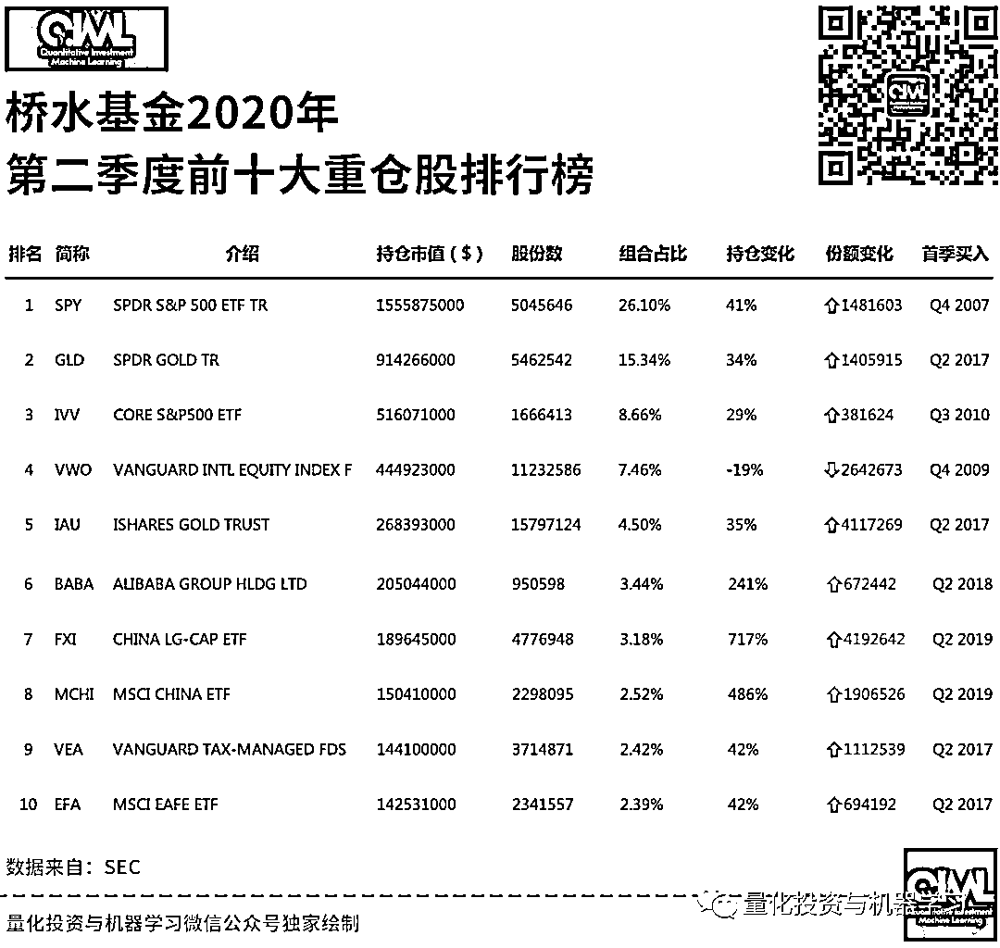

我们看到，在基金组合前十中，有一只跟踪新兴市场指数的 ETF、一只跟踪发达国家市场指数的 ETF、两只跟踪中国指数的 ETF 和一只跟踪欧洲、亚洲、澳洲、远东地区市场指数的 ETF。可见桥水对中国市场的重视！

中概股中，桥水增持京东(JD.US)，增持幅度 250%；网易 NTES.US)，增持幅度 251%；拼多多(PDD.US)，增持幅度 432%；百度(BIDU.US)，增持幅度 251%；好未来(TAL.US)，增持幅度 309%；新东方(EDU.US)，增持幅度 276%；中通快递(ZTO.US)，增持幅度 894%；百胜中国(YUMC.US)，增持幅度 252%；携程(TCOM.US)，增持幅度 349%；蔚来(NIO.US)，增持幅度 1028%。另外，桥水还建仓百世集团(BEST.US)和虎牙(HUYA.US)。

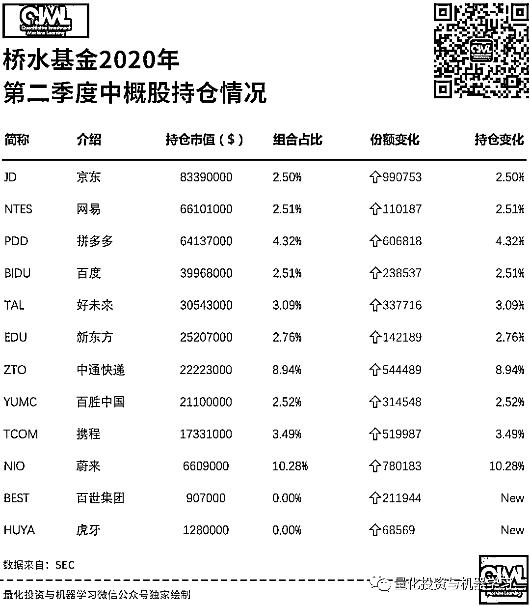

根据最新持仓统计：

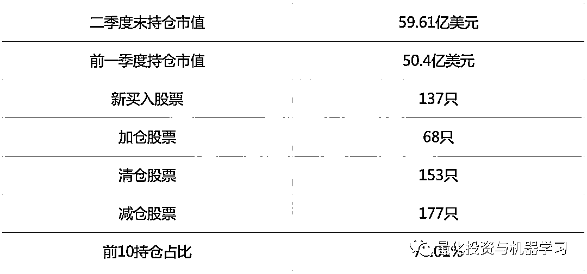

历史持仓行业分布：

**Tiger Management**

老虎基金（Tiger Management）总部设在纽约，由 Julian Robertson 管理。**老虎目前的 AUM 约为 28527546 美元**（更新至 2017-03-30）。

其中增持股票 TOP5 和减持股票 TOP5 如下：

根据最新持仓统计：

根据历史持仓统计，持仓 TOP10 的变化如下：

历史持仓行业分布：

**Viking Global Investors**

维京全球投资（Viking Global Investors）位于康涅狄格州格林威治。

其中增持股票 TOP5 和减持股票 TOP5 如下：

根据最新持仓统计：

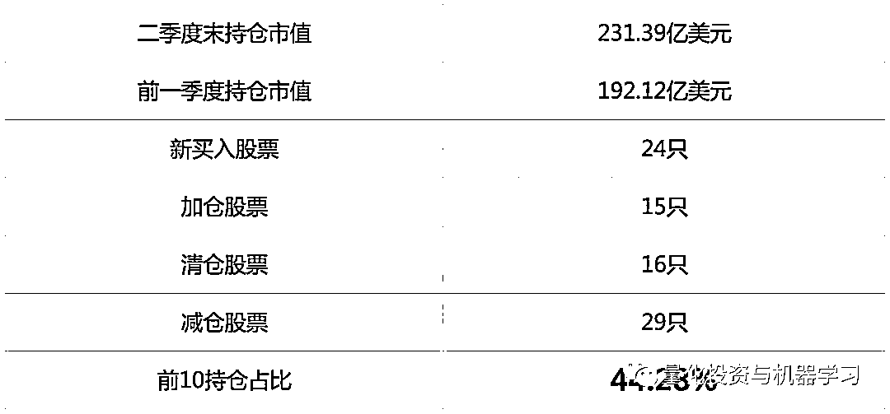

根据历史持仓统计，持仓 TOP10 的变化如下：

历史持仓行业分布：

量化投资与机器学习微信公众号，是业内垂直于**Quant、MFE、Fintech、AI、ML**等领域的**量化类主流自媒体。**公众号拥有来自**公募、私募、券商、期货、银行、保险资管、海外**等众多圈内**18W+**关注者。每日发布行业前沿研究成果和最新量化资讯。