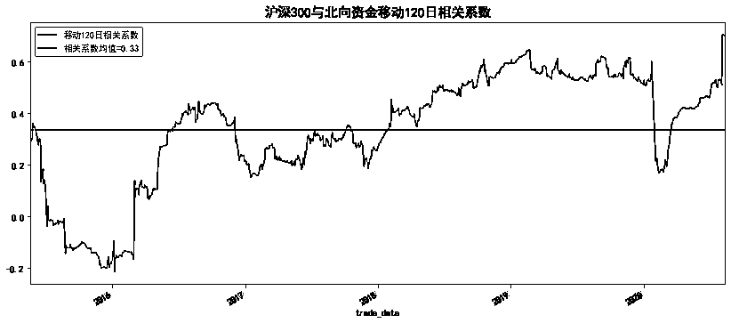

# 北向资金能预示大盘涨跌？（附代码）

> 原文：[`mp.weixin.qq.com/s?__biz=MzAxNTc0Mjg0Mg==&mid=2653304078&idx=1&sn=9c53b215971755407778fbfcea831c2b&chksm=802df71bb75a7e0dc93f0536fe04679e8590da2b357f36588241f372ea5aa7d9553712e251ee&scene=27#wechat_redirect`](http://mp.weixin.qq.com/s?__biz=MzAxNTc0Mjg0Mg==&mid=2653304078&idx=1&sn=9c53b215971755407778fbfcea831c2b&chksm=802df71bb75a7e0dc93f0536fe04679e8590da2b357f36588241f372ea5aa7d9553712e251ee&scene=27#wechat_redirect)


**全网 TOP 量化自媒体**

***1***

**引言**

中国证监会于 2014 年和 2016 年分别批准了沪港通和深港通，建立了大陆和香港股市的互联互通机制，市场通常把沪股通和深股通的合计流入资金称为北向资金。换句话说，北上资金就是指从香港流入大陆股市的资金，而内地流入香港股市的资金则被称为南下资金。市场广 泛认为北向资金是“聪明钱”，会对市场的短期走势有一定的指示作用，因此本文对该指标进行统计分析，并借鉴华泰金工研量化资产配置 7 月月报《北向资金走向预示市场短期或震荡》关于北上资金的择时思路，构建基于北向资金的股市择时策略，并进行历史回测。结果表明，北向资金对于判断沪深 300 指数涨跌具有较好的预示作用。

***2***

**数据获取**

本文所使用的指数数据和北上资金数据均来自 tushare.pro。如果由于积分受限，可在公众号后台回复“**北上资金**”获取相应 csv 格式数据。 

```py
`import pandas as pd
import numpy as np
import matplotlib.pyplot as plt
%matplotlib inline
from pylab import mpl
mpl.rcParams['font.sans-serif']=['SimHei']
mpl.rcParams['axes.unicode_minus']=False` 
```


公众号后台回复【**北上资金****】**

# 由于 tushare 对北上资金数据的单次提取有限制（300 条/次），需要通过获取两个时间周期内的交易日历，分次提取数据。

```py
import tushare as ts
token='输入你的 token'
pro=ts.pro_api(token)
#获取交易日历
def get_cal_date(start,end):
    cal_date=pro.trade_cal(exchange='', start_date=start, end_date=end)
    cal_date=cal_date[cal_date.is_open==1]
    dates=cal_date.cal_date.values
    return dates 
```

# 定义北向资金数据获取函数。

```py
#获取北向资金数据
def get_north_money(start,end):
    #获取交易日历
    dates=get_cal_date(start,end)
    #tushare 限制流量，每次只能获取 300 条记录
    df=pro.moneyflow_hsgt(start_date=start, end_date=end)
    #拆分时间进行拼接，再删除重复项
    for i in range(0,len(dates)-300,300):
        d0=pro.moneyflow_hsgt(start_date=dates[i], end_date=dates[i+300])
        df=pd.concat([d0,df])
        #删除重复项
        df=df.drop_duplicates()
        df.index=pd.to_datetime(df.trade_date)
        df=df.sort_index()
    return df 
```

# 定义指数数据获取函数。

```py
#获取指数数据
def get_index_data(code,start,end):
    index_df = pro.index_daily(ts_code=code, start_date=start,end_date=end)
    index_df.index=pd.to_datetime(index_df.trade_date)
    index_df=index_df.sort_index()
    return index_df 
```

# 获取常用的几个指数 2014-2020 期间收盘价数据。

```py
#获取指数数据
#常用大盘指数
indexs={'上证综指': '000001.SH','深证成指': '399001.SZ','沪深 300': '000300.SH',
       '创业板指': '399006.SZ','上证 50': '000016.SH','中证 500': '000905.SH',
       '中小板指': '399005.SZ','上证 180': '000010.SH'}
start='20141117'
end='20200812'
index_data=pd.DataFrame()
for name,code in indexs.items():
    index_data[name]=get_index_data(code,start,end)['close']
#index_data.tail() 
```

***3***

**探索性分析**

理论上而言，股市的上涨离不开资金的推动，而市场的活跃又会反过来吸引更多资金加入博弈。近年来，北上资金受到市场的关注越来越大，被看作是短期市场风向标，与市场指数存在一定的正向关系。当然理论在现实中不一定成立，所以在利用北上资金构建择时策略前，有必要先对指数和北上资金的关系进行探索性分析。

```py
#累计收益
(index_data/index_data.iloc[0]).plot(figsize=(14,6))
plt.title('A 股指数累积收益率\n 2014-2020',size=15)
plt.show() 
```


陆股通覆盖大部分宽基指数成分股，即北向资金可投资的股票池覆盖了上证 50、沪深 300、中证 500 的绝大多数指数成分股，下面对各大指数的收益率和北上资金进行相关性分析。

```py
#将价格数据转为收益率
all_ret=index_data/index_data.shift(1)-1
north_data=get_north_money(start,end)
#north_data=pd.read_csv('north_data',index_col=0,header=0)
all_data=all_ret.join(north_data['north_money'],how='inner')
all_data.rename(columns={'north_money':'北向资金'},inplace=True)
all_data.dropna(inplace=True)
all_data.corr() 
```


上图显示，2014 年至 2020 年 8 月整个交易期间内，北上资金与各大指数收益率均存在一定的正相关，但相关系数较低，分布在 0.23-0.29 之间。由于北上资金相对整个 A 股市场来说，体量还是比较小的，因此该指标的指示作用可能体现在短期内。下面使用 120 日的滚动窗口考察下北上资金与指数的相关性。

```py
all_data.rolling(120).corr().tail(9) 
```


数据显示，北上资金与各大指数的滚动窗口 120 日相关系数均大于 0.5，其中沪深 300 与北上资金相关系数最高（0.7），可见中短期内，北上资金的大小对指数收益率具有一定的指示作用。下面以沪深 300 指数为例，对二者的散点图进行回归线拟合。图形再次支持了北上资金与沪深 300 指数的正相关性。

```py
import seaborn as sns
plt.figure(figsize=(10, 6))
sns.regplot(x=list(all_data["北向资金"][-120:]),y=list(all_data["沪深 300"][-120:]))
plt.title('沪深 300 与北向资金拟合回归线',size=15)
plt.xlabel('北向资金',size=12)
plt.ylabel('沪深 300 收益率',size=12)
plt.show() 
```


再来观察一下沪深 300 日收益率与北上资金的波动情况，二者具有一定的同步性。

```py
#沪深 300 指数收益率与北向资金
final_data=all_data[['沪深 300','北向资金']].dropna()
final_data.plot(secondary_y='北向资金',figsize=(12,6))
plt.title('沪深 300 日收益率 VS 北向资金',size=15)
plt.show() 
```


```py
#获取北向资金与沪深 300 收益率的滚动窗口相关系数
def cal_rol_cor(data,period=30):
    cors=data.rolling(period).corr()
    cors=cors.dropna().iloc[1::2,0]
    cors=cors.reset_index()
    cors=cors.set_index('trade_date')
    return cors['沪深 300'] 
```

最后从纵向角度考察沪深 300 收益率与北上资金的相关性。数据显示，2014 年至 2020 年 8 月期间，二者相关系数均值为 0.33，最大值为 0.7。图形显示，二者的相关性近年来逐渐走高。

```py
cor=cal_rol_cor(final_data,period=120)
cor.describe()
count:1236  mean:0.335
std：0.219  min：-0.215
25%：0.219  50%：0.379
75%：0.525  max：0.706
cor.plot(figsize=(14,6),label='移动 120 日相关系数')
plt.title('沪深 300 与北向资金移动 120 日相关系数',size=15)
plt.axhline(cor.mean(), c='r',label='相关系数均值=0.33')
plt.legend(loc=2)
plt.show() 
```

  

***4***

**策略实例**

从上面的探索性分析发现，北上资金与各大指数中短期内存在一定的正相关性，下面参考华泰金工研报的思路，基于北向资金变动数据构建布林带择时策略，并对择时模型进行回测分析。

策略思路如下：

**1、当该日北向资金流入规模 > 过去 252 个交易日的北向资金均值 + 1.5 倍标准差， 则全仓买入沪深 300；**

**2、当该日北向资金流入规模 < 过去 252 个交易日的北向资金均值 - 1.5 倍标准差， 则清仓卖出沪深 300；**

**3、以第二天开盘价买入（研报是以收盘价来计量）。**

定义策略函数：

```py
`def North_Strategy(data,window,stdev_n,cost):
    '''输入参数：
    data:包含北向资金和指数价格数据
    window:移动窗口
    stdev_n:几倍标准差
    cost:手续费
    '''
    # 中轨
    df=data.copy().dropna()
    df['mid'] = df['北向资金'].rolling(window).mean()
    stdev = df['北向资金'].rolling(window).std()
    # 上下轨
    df['upper'] = df['mid'] + stdev_n * stdev
    df['lower'] = df['mid'] - stdev_n * stdev
    df['ret']=df.close/df.close.shift(1)-1
    df.dropna(inplace=True)

    #设计买卖信号
    #当日北向资金突破上轨线发出买入信号设置为 1
    df.loc[df['北向资金']>df.upper, 'signal'] = 1
    #当日北向资金跌破下轨线发出卖出信号设置为 0
    df.loc[df['北向资金']<df.lower, 'signal'] = 0
    df['position']=df['signal'].shift(1)
    df['position'].fillna(method='ffill',inplace=True)
    df['position'].fillna(0,inplace=True)
    #根据交易信号和仓位计算策略的每日收益率
    df.loc[df.index[0], 'capital_ret'] = 0
    #今天开盘新买入的 position 在今天的涨幅(扣除手续费)
    df.loc[df['position'] > df['position'].shift(1), 'capital_ret'] = \
                         (df.close/ df.open-1) * (1- cost) 
    #卖出同理
    df.loc[df['position'] < df['position'].shift(1), 'capital_ret'] = \
                   (df.open / df.close.shift(1)-1) * (1-cost) 
    # 当仓位不变时,当天的 capital 是当天的 change * position
    df.loc[df['position'] == df['position'].shift(1), 'capital_ret'] = \
                        df['ret'] * df['position']
    #计算标的、策略、指数的累计收益率
    df['策略净值']=(df.capital_ret+1.0).cumprod()
    df['指数净值']=(df.ret+1.0).cumprod()
    return df` 
```

首先以沪深 300 指数进行回测，滚动窗口默认 250 日，手续费默认为 0。回测结果显示，基于北上资金的择时策略表现较好，年化收益率 17.8%，高于基准的 5.3%，最大回撤 17%低于基准 32%，夏普比率为 2.2。

```py
`main(code='000300.SH')
回测标的：沪深 300 指数
回测期间：20151208—20200812
策略年胜率为：80.0%
策略月胜率为：64.58%
策略周胜率为：60.98%
总收益率：  策略：106.36%，沪深 300：26.03%
年化收益率：策略：17.81%, 沪深 300：5.37%
最大回撤：  策略：17.28%, 沪深 300：32.46%
策略 Alpha： 0.15, Beta：0.46，夏普比率：2.2` 
```


考虑到北上资金 2016 年后才开始备受关注，而且前文的探索性分析也显示相关性是 2016 年后逐年攀高，因此将回测起始时间改为 2016 年，交易手续费设置为 1%（有点高）。结果显示，这一期间（实际上是 2017 年至今）的择时策略表现更佳，年化收益率达到 24%。

```py
`main(code='000300.SH',start='20161117',cost=0.01)
回测标的：沪深 300 指数
回测期间：20171205—20200812
策略年胜率为：50.0%
策略月胜率为：65.52%
策略周胜率为：61.86%
总收益率：  策略：72.01%，沪深 300：15.65%
年化收益率：策略：23.93%, 沪深 300：5.92%
最大回撤：  策略：17.29%, 沪深 300：32.46%
策略 Alpha： 0.21, Beta：0.45，夏普比率：2.1` 
```


最后以创业板为标的进行历史回测，结果显示，策略效益整体优于基准，与沪深 300 指数相比，除了年化收益率外，其最大回撤和夏普比率相对差些。

```py
`main(code='399006.SZ')
回测标的：创业板指指数
回测期间：20151208—20200812
策略年胜率为：80.0%
策略月胜率为：54.17%
策略周胜率为：54.88%
总收益率：  策略：133.88%，沪深 300：-3.75%
年化收益率：策略：21.19%, 沪深 300：-0.86%
最大回撤：  策略：37.17%, 沪深 300：57.57%
策略 Alpha： 0.22, Beta：0.5，夏普比率：1.92` 
```


***5***

**结语**

本文对各大指数与北上资金的相关性进行了探索性分析，并借鉴华泰金工研报关于利用北上资金来构建择时策略的思路，对沪深 300 和创业板指数进行了历史回测。回测结果表明，北上资金的流动规模具有一定的实战指示意义，短期内可用于对对大盘的走向进行研判，同时可用于对指数进行择时，指导股指期货交易。本文最后的历史回测与研报原文并未完全吻合，但策略表现上大同小异，可能与回测环境的配置有关，感兴趣的读者可试试采用回测框架（如 backtrader）或量化平台进行更严谨的回测。本文的分析仅供学习参考，不构成任何投资建议！

参考资料：华泰证券《北向资金走向预示市场短期或震荡》

量化投资与机器学习微信公众号，是业内垂直于**Quant、MFE、Fintech、AI、ML**等领域的**量化类主流自媒体。**公众号拥有来自**公募、私募、券商、期货、银行、保险资管、海外**等众多圈内**18W+**关注者。每日发布行业前沿研究成果和最新量化资讯。