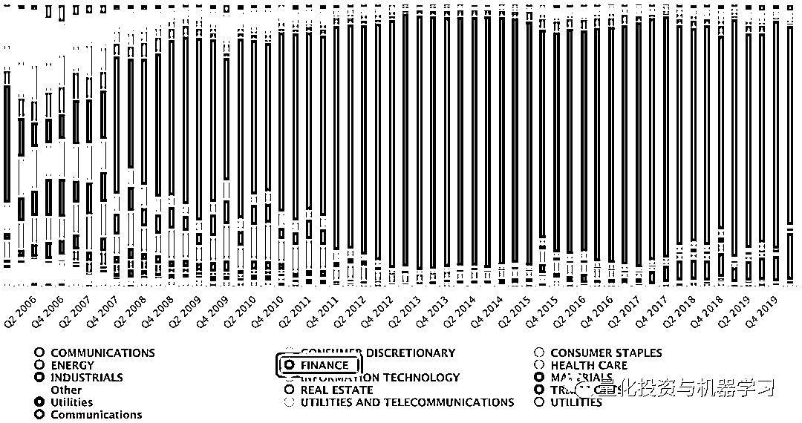

# 最新！桥水基金大手笔加仓中国（附持仓表）

> 原文：[`mp.weixin.qq.com/s?__biz=MzAxNTc0Mjg0Mg==&mid=2653303978&idx=1&sn=2f9f2150c05868c9498ece18ec89024d&chksm=802df6bfb75a7fa9f9225af16241728c99e820a05f21b85db9d0bedcfc16cc0eb0cddbce2ade&scene=27#wechat_redirect`](http://mp.weixin.qq.com/s?__biz=MzAxNTc0Mjg0Mg==&mid=2653303978&idx=1&sn=2f9f2150c05868c9498ece18ec89024d&chksm=802df6bfb75a7fa9f9225af16241728c99e820a05f21b85db9d0bedcfc16cc0eb0cddbce2ade&scene=27#wechat_redirect)

**全网 TOP 量化自媒体**

最新消息！

桥水基金（Bridgewater Associates）于 8 月 12 日下午 15 点 20 分，向美国证监会（SEC）提交了其 13F 报告。

文件来自：SEC

**什么是 13F？**

13F（也叫 SEC 13F)，是一份季度报告，由机构投资经理提交给美国证监会（SEC，U.S. Securities and Exchange Commission）。SEC 规定：**股票资产超过 1 亿美元的机构，都需要在每个季度结束的 45 天内向 SEC 提交该季度末的股票持仓报告**。它的内容包括该基金的一些基本信息，以及所持成分股的信息，例如持有股数，成分股所占头寸等等。下面是桥水的目前最新持有的所有股票：

桥水最新 13F 报告

**13F 文件有两个需要注意的点**：一是只要求基金披露他们的多头头寸，而很多基金都会出于风险管理的目的，同时持有同一公司的多头和空头头寸，因此 13F 文件并不能保证提供了完整的机构投资信息除此之外，有的基金也会向 SEC 申请隐瞒一部分的持股情况，以保护自己的持仓信息。例如，机构即使是在看跌的情况下仍然持有该公司的股票，但同时有持有该公司的看跌期权的情况也很正常（机构在投资某公司时同时使用了股票和期权的情况很常见）。

根据桥水提交的报告显示：**阿里巴巴跻身桥水基金美股第六大重仓股达 244%**，加仓后市值为**2.05 亿美元**。桥水还大幅加仓了两只中国 ETF，安硕中国大盘 ETF（排名 7）和安硕 MSCI 中国指数 ETF（排名 8），两者的加仓幅度分别为 717%、486%。

同时，桥水前五大卖出股分别是：美国国债 20+年 ETF-iShares(TLT.US)、巴西 ETF-iShares MSCI(EWZ.US)、美国高收益债 ETF-iShares(HYG.US)、美国投资级公司债-iShares(LQD.US)和新兴市场 ETF-Vanguard(VWO.US)

一直以来，桥水基金前十大重仓股由 ETF 占据，这次罕见地将个股调至前十大重仓。

我们看到，在基金组合前十中，有一只跟踪新兴市场指数的 ETF、一只跟踪发达国家市场指数的 ETF、两只跟踪中国指数的 ETF 和一只跟踪欧洲、亚洲、澳洲、远东地区市场指数的 ETF。可见桥水对中国市场的重视！

阿里巴巴股票

中概股中，桥水增持京东(JD.US)，增持幅度 250%；网易 NTES.US)，增持幅度 251%；拼多多(PDD.US)，增持幅度 432%；百度(BIDU.US)，增持幅度 251%；好未来(TAL.US)，增持幅度 309%；新东方(EDU.US)，增持幅度 276%；中通快递(ZTO.US)，增持幅度 894%；百胜中国(YUMC.US)，增持幅度 252%；携程(TCOM.US)，增持幅度 349%；蔚来(NIO.US)，增持幅度 1028%。另外，桥水还建仓百世集团(BEST.US)和虎牙(HUYA.US)。

最后，我们根据最新报告做了一个简单的统计：

通过桥水历史的持仓我们可以看到，有关金融行业的占比最重：

再来看看历史持仓的其他统计情况：

看来桥水布局中国的操作越来越多。之前，达里奥在 linkedin 的一篇文章《The Big Cycles Over The Last 500 years》提到：

自 1984 年我开始访问中国以来，中国人口的受教育程度显著提高，人均实际收入增加了 24 倍，中国已成为世界上最大的贸易国（超过美国在世界贸易中的份额）、技术领先的竞争对手、拥有世界上最大规模的外汇储备且比第 2 名大一倍、新兴世界最大的放贷者/投资者、第二大军事强国以及美国的地缘政治对手。并且，**中国实力的增长速度远远快于美国和其他“发达国家”**。与此同时，**由于先进的信息/数据管理和人工智能补充人类智力，我们正处于一个伟大的发明时期，美国和中国领先。**

根据国际货币基金组织（IMF）和世界银行（World Bank）的数据，中国在全球贸易中的份额从 2003 年 SARS 期间的 5%升至 2018 年的 11%。此外，中国在 MSCI 新兴市场指数中的权重也从 2003 年的约 7.9%升至 2019 年底的逾 34%。这也让越来越多的投资者意识到，有必要通过单独的中国基金来布局中国。

桥水就是最好的例子！

量化投资与机器学习微信公众号，是业内垂直于**Quant、MFE、Fintech、AI、ML**等领域的**量化类主流自媒体。**公众号拥有来自**公募、私募、券商、期货、银行、保险资管、海外**等众多圈内**18W+**关注者。每日发布行业前沿研究成果和最新量化资讯。