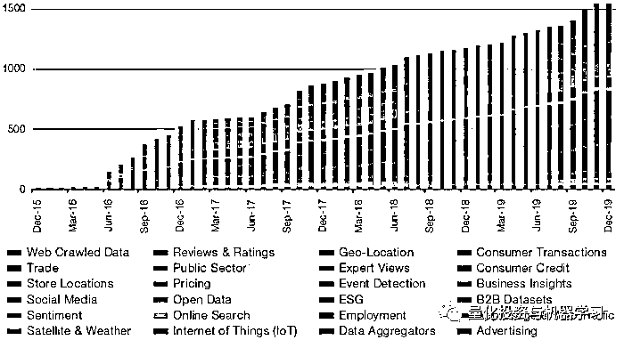
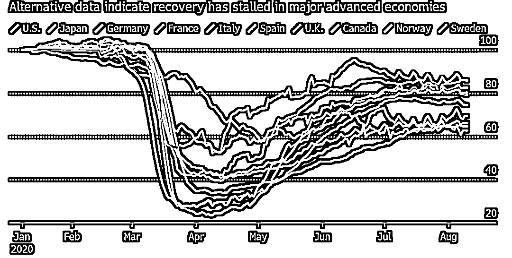
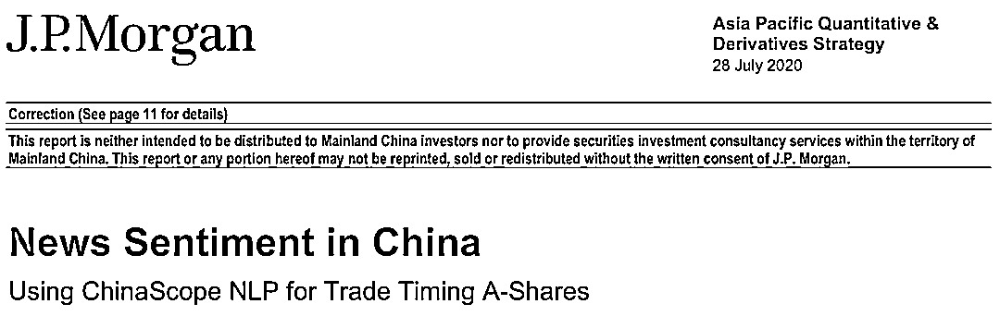
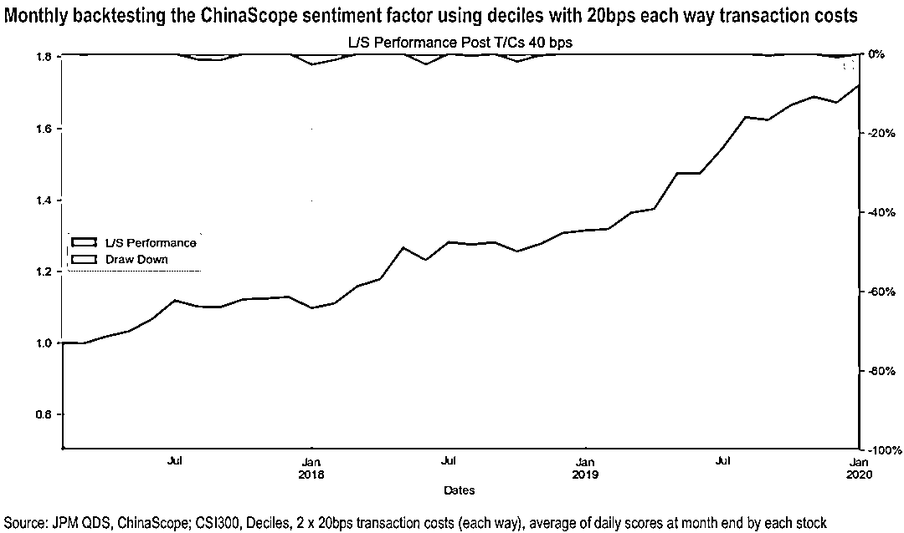
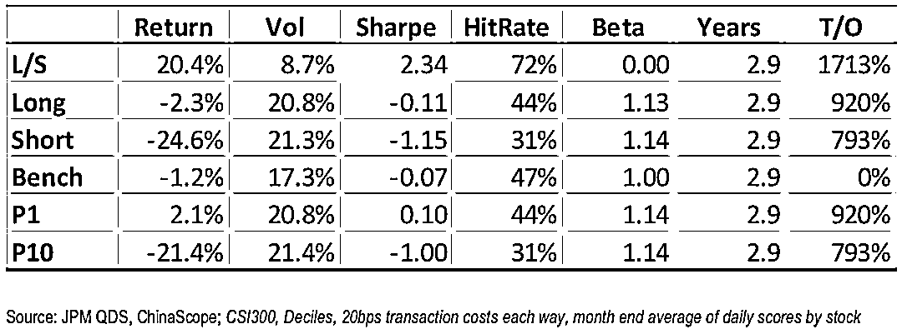
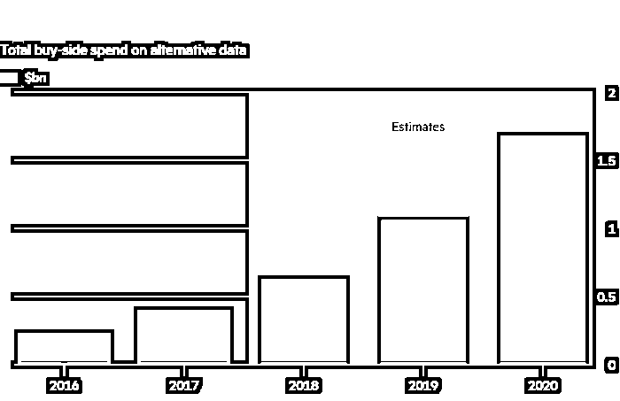

# 不会用不代表不好用！

> 原文：[`mp.weixin.qq.com/s?__biz=MzAxNTc0Mjg0Mg==&mid=2653303953&idx=1&sn=b7d7faf6bcc6aec3dd3992fe3e0dce0d&chksm=802df684b75a7f92f49355000338f73aa443a7030549f74e9aef5d3ce1741c203b41cb6cb1fa&scene=27#wechat_redirect`](http://mp.weixin.qq.com/s?__biz=MzAxNTc0Mjg0Mg==&mid=2653303953&idx=1&sn=b7d7faf6bcc6aec3dd3992fe3e0dce0d&chksm=802df684b75a7f92f49355000338f73aa443a7030549f74e9aef5d3ce1741c203b41cb6cb1fa&scene=27#wechat_redirect)

**全网 TOP 量化自媒体**  

管理着 1040 亿美元的对冲基金 Man Group 的数据科学主管 Hinesh Kalian 表示：“在过去 6 个月，我们对**另类数据**的需求飙升，越来越多的另类数据提供商接洽我们，我们的投资团队对这些数据集的兴趣也在增加！”

是的。根据公众号了解，另类数据在国外对冲基金市场已经运用的十分成熟。但是在国内，有几种情况：

*   **不会用**

*   **用的不好** 

*   **压根不知道**

绝大多数人还是不会用！

原因有很多，比如：

1、很多另类数据都是基于海外市场，基于 A 股本土的并不多。国内比如：

*   ChinaScope（数库：产业链、SmarTag 等）

*   Wind（万得：ESG、卫星等） 

*   Datayes（通联：线上、线下销售数据等）

2、即使把数据给到我们，对于原始数据的有限认识给我们带来了一定的风险。

3、另类数据提供商的数量虽然呈指数级增长，但其提供的数据质量却参差不齐。

Eagle Alpha

4、截至 2019 年底，不到一半的数据集具有超过 7 年的历史记录，尽管 3 至 5 年历史的盘中数据可能足以进行回测。根据经验，要使回测检验夏普比率在 95%的置信水平上具有统计学意义，年化值需要为 2/√(年)。也就是说：根据 7 年的数据，夏普年化比率为 0.76，而只有两年的历史数据，夏普比率的年率则要高得多，达到 1.41。

5、随着人们对数据兴趣的增加，数据通常会被提供给各种行业。因此，我们必须注意到拥挤效应和预测能力下降（Alpha 衰变）的可能性。

···

那怎么办？ 

**公众号要多做投资者教育******

还有，对于一些金融资管来说，另类数据不一定要用于量化投资：

**债券资管**：使用新闻负面事件来识别叠加舆情，然后进行打分对发债企业的风险预警。

**商业银****行**：使用另类数据进行精准获客、资金流向管理。

···

在埃森哲担任全球资本市场主管的 Michael Spellacy 表示：今年以来，**对冲基金通过比较中国社交媒体帖子和中国政府声明等方法获利**，以衡量病毒的影响程度，同时收集中国集装箱船运动的数据进行监控。在这场特殊的危机中，**这些数据变得非常有价值！**

前几天 J.P. Morgan 出了一篇《基于 NLP 的 A 股交易策略》，就是基于 A 股的新闻数据来做的：

获取报告点击这里：[***点击下载***](https://mp.weixin.qq.com/s?__biz=MzAxNTc0Mjg0Mg==&mid=2653303713&idx=1&sn=f6dfd1d473421430e54847644f51272c&scene=21#wechat_redirect)

看看这测试结果： 

看看这夏普：

根据 Alternativedata 网站的数据，基金经理每年在这类数据上的总支出就超过 17 亿美元，高于三年前的 4 亿美元。类似的一家厂商 Neudata 表示，目前有近 1500 家另类数据提供商，在 3 月、4 月和 5 月，处理客户查询的工作量是平时的四倍左右。

**有时，数据来源是传统的，但分析方法是全新的**。今年 6 月，瑞士投资公司 Unigestion 开始利用新闻情绪（各大媒体的文章和分析师的评论）信号，让他们发现此信号对他们的投资组合模型在疫情爆期间有很大的改善。Unigestion 的首席执行官 Fiona Frick 表示：“另类数据让我们能够更快地退出市场，也让我们能够更快地重返股市。”

公众号认为：总体来说，**未来几年另类数****据在中国量化机构的广泛应用将是必然的，早用早享受！**

量化投资与机器学习微信公众号，是业内垂直于**Quant、MFE、Fintech、AI、ML**等领域的**量化类主流自媒体。**公众号拥有来自**公募、私募、券商、期货、银行、保险资管、海外**等众多圈内**18W+**关注者。每日发布行业前沿研究成果和最新量化资讯。