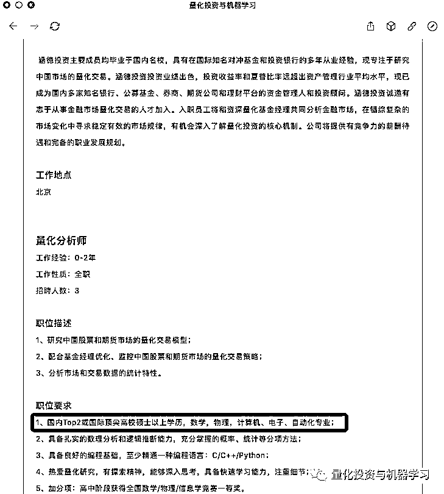

# 想当 Quant？呵呵~

> 原文：[`mp.weixin.qq.com/s?__biz=MzAxNTc0Mjg0Mg==&mid=2653303897&idx=1&sn=43a9e922e6f2344f60c697a945d57a6f&chksm=802df64cb75a7f5a5a98bff83825e1167dab0f58812854f01c148a49a47da39d61b03348902a&scene=27#wechat_redirect`](http://mp.weixin.qq.com/s?__biz=MzAxNTc0Mjg0Mg==&mid=2653303897&idx=1&sn=43a9e922e6f2344f60c697a945d57a6f&chksm=802df64cb75a7f5a5a98bff83825e1167dab0f58812854f01c148a49a47da39d61b03348902a&scene=27#wechat_redirect)

**全网 TOP 量化自媒体**

量化投资与机器学习微信公众号出品
作者：1+1=6**目录**

*   QIML 的话 

*   Quant 资料

*   QuantNet 排名榜看点

*   QuantNet 排名前五学校大盘点

*   Quant 薪资

*   RiskNetMFE 薪资排名

*   硕士是门槛

*   Quant 就业前景

*   ## Baruch 量化职业发展报告

*   国内主要 Quant 岗 

*   跨专业入行 Quant

*   总结

**QIML 的话**

最近，很多人问我们关于量化求职这件事。公众号觉得有必要把之前的一些总结再给大家看看。QuantNet 如期公布了 2020 全美最佳金融工程（MFE）专业的排名。大家可曾知道，Quantnet 的 MFE 专业排名堪称：

**全美 MFE 的『权威鄙视链』**

我们通常把**金融工程硕士****简称 MFE**。不同学校对这个专业设置不一样，有的叫**Financial Mathematics**、**Quantitative/Mathematical Finance**等，这些专业本质上都算是一类。

MFE 学制很短，一般是 1-2 年，大部分学校不提供奖学金(一小部分例外)。开设 MFE 的学校不是太多，而且申请人又很多，所以竞争非常激烈。

**美国院校金融工程常见专业：**

*   Financial Engineering 金融工程

*   Financial Mathematics /Mathematical Finance 金融数学

*   Computational Finance 计算机金融

*   Quantitative Finance 量化金融

*   Quantitative Finance and Risk Management 量化金融和风险管理

**典型的职位：**

*   Research Analyst 研究分析师

*   Risk Quant Analyst 风险分析师

*   Pricing and Analytics Analyst 定价分析师

*   Investment Banking (Strategy)Analyst 投资分析师（策略分析师）

*   Sales, Trading & Quantitative Analysis 销售/量化分析师

*   Quant Strategist 股市策略专家

*   Risk Management Analyst 风险分析师

*   Business Analyst；Market Risk Analyst 商业分析师/市场风险分析师

*   Fixed Income Analyst 固定收益分析员

*   Valuation and Risk Control Associate 估值和风险控制指导

*   Market Risk Group Associate 市场分析顾问

*   Global Financial Risk Management Analyst 金融风险管理分析员

*   Quantitative Risk Analyst 风险量化分析员

**常规所属学院**

根据课程侧重点和学院风格的差异，美国金融工程专业一般会设置在**工学院，商学院，数学学院。**

*   **工学院**偏向招收工程专业学生，重视编程能力，会开设 optimization , programming 等课程。典型的有 Columbia MSFE，Stanford MSFM，NYU MSFE 等；

*   **商学院**偏向招收金融专业学生，围绕金融方面学习，会开设 Stochastic Methods of Mathmatical Finance 等课程。典型的譬如 WUSTL MSF，UCB MFE，UCLA MFE 等；

*   **数学学院**偏向招收数学专业的学生，课程围绕数学、统计展开，会开设 Stochastic Processes 等课程，学术性较强。典型的包括 Columbia MAMF，Chicago MSFM，JHU MSFM 等。

*图片来自：QIML 独家制作

但即便如此，学校提供的金工硕士课程也分优劣，学校开设该课程不代表课程教育好，所以要申请的话，还得看看学校的教育水平如何。金融工程哪家强，我们看这个排名就够了，赶紧一睹为快吧！

**Quant 资料**[Quant 必读：关于因子投资的 12 本必读书！](https://mp.weixin.qq.com/s?__biz=MzAxNTc0Mjg0Mg==&mid=2653293818&idx=1&sn=445a0603c89e3411900c9d01bd0f67b8&scene=21#wechat_redirect)
[Quant 必备：最全量化投资书籍](https://mp.weixin.qq.com/s?__biz=MzAxNTc0Mjg0Mg==&mid=2653291789&idx=1&sn=e31778d1b9372bc7aa6e57b82a69ec6e&scene=21#wechat_redirect)
[Quant 必看：关于求职分享（附真实试题）](https://mp.weixin.qq.com/s?__biz=MzAxNTc0Mjg0Mg==&mid=2653291844&idx=1&sn=3fd8b57d32a0ebd43b17fa68ae954471&scene=21#wechat_redirect)**QuantNet 排名榜看点**

2019 年 11 月至 12 月，QuantNet 在**入学**、**就业**和**职业服务信息**方面，对 38 个金融工程，数学金融，量化金融硕士课程进行了调查。其中 38 个项目中有 33 个提供了数据，25 个基于以下加权运算法进行了排名计算。

排名依据（Methodology）包括：

*   **同行评估分数（20%）**

*   每个项目都要求将 2020 年 QuantNet MFE 项目排名中的 38 个项目从 1(边缘)到 5(例外)进行评分。

*   **就业情况（55％）**

*   毕业就业率（10％）：英国《金融时报》最新一届毕业生的就业率。

*   **毕业后三个月就业率（15％）**：英国《金融时报》最新一届毕业生毕业 3 个月后的就业率。

*   **平均起薪和奖金（20％）**：英国《金融时报》最新一届毕业生的平均起薪和奖金。

*   雇主调查分数（10％）：对雇主进行了调查，以确定 2020 年排行榜中哪些项目的毕业生在过去两年内曾接受过面试或受聘。

*   **学生选择性（25％）**

*   **GRE 分数（15％）**：该项目最近新一届学生的平均 ETS GRE 分数。

*   本科 GPA（7.5％）：该项目最近新一届学生的平均绩点。

*   录取率（2.5％）：英国《金融时报》统计的申请者被录取的比例。

我们看到**就业情况（55％）**占了大头，报名其平均起薪和签约奖金（20％）、毕业后三个月就业率（15％）占比最多，同时在 GRE 分数（15％）上，也是要求较高。从这几个数据我们可以看出，**QuantNet 的排名主要看就业**，GRE 高说明学校对学生的要求也高，生源高也就也为着整体表现好。也侧面反映了大家以后选择去哪所高校在就业方面可能更好点！

注：NR*=not ranked，没有提供就业数据和薪资情况的项目被列为 NR。

**点击看高清大图**

*图片来自：量化投资与机器学习独家制作

与 2019 年相比：

**1、第一第二名强依然是普林斯顿和 Baruch 强势占位；****2、卡耐基梅隆和哥大（金工）排名上升至前三；****3、加州伯克利排名下滑，由第二变成第五；****4、NYU Tandon 赶超 MIT，排在第九；****5、JHU 连升 4 位进入 Top20。**

在 QuantNet 的排名上统计就业率的分别有两组数字：

*   一组是毕业就业率

*   一组是毕业后三个月就业率

根据排名显示，约翰霍普金斯 Mathematics of Finance 的毕业就业率为 13%，毕业后三个月就业率为 100%，也可能是因为该校 MFE 专业科研压力大，边找工作边上课是一个很大的挑战。而毕业后 3 个月，就业率 100%，也恰恰正是了 MFE 的高含金量。

也有人表示，3 个月，大概率意味着不少从该校毕业的硕士回国求职了……

的确，有些硕士项目时间短，对于留学生来说既要适应新学校、新国家，又要应付学业要求，还要走 Recruiting，难免不知所措。因此大家在读研之前，就要提早做好求职准备,否则毕业时再找工作只会面临更加严峻的现实。

我们顺便看看 2019TFE 的排名：

*图片来自：TFE 官网

MFE 主要是用计算机来实现数学模型，从而解决金融相关的问题。所以，MFE 不同于 MBA 和 MSP，它主要是培养金融界的技术工作者，也称作金融工程师：**Quant**。

Quant 的职位主要集中在投资银行、对冲基金、商业银行和金融机构。负责的主要工作根据职位也有很大区别，比较有代表性的包括**Pricing、Model Validation、Research、Develop and Risk Management**，分别负责衍生品定价模型的建立和应用、模型验证、模型研究、程序开发和风险管理。

好了，我们再看看**国内外 Quant 的发展情况！**

**Quant 薪资**

我们以**『量化研究员』**为关键词进行分析（薪酬只是税前基本工资、不包含每家机构分红、年终奖和有的没的）：

**平均工资：¥ 19270/月**

取自近 1 年 215 份样本，该数据仅供参考

*图片来自：职友集

**平均工资：¥ 15270/月**

取自近 1 年 406 份样本，该数据仅供参考

*图片来自：职友集

**平均工资：¥ 19140/月**

取自近 1 年 227 份样本，该数据仅供参考

*图片来自：职友集

为了更权威，也顺带做个比较，我们看看海外对待量化研究员岗位的薪酬是如何的？

这里必须要把 PayScale 搬出来。PayScale 最大的不同之处在于其所有的报告都是基于调查的原始数据，而不是由对地域，经济条件等因素进行“估算”所得出的。PayScale 绝不会对不同来源的数据进行混合使用，报告中出现的任何数据都是 PayScale 的工作人员认真收集，过滤，分析得到的。每一份提交到 PayScale 的档案都要经过一道道严格的过滤系统，这套过滤系统包含了 32 重检验条款，在最大限度上保证了档案信息的真实性和可靠性。在检验过程中，所有重复出现的档案都会被过滤掉，那些比较反常的档案也会被单独提取出来，由 PayScale 专家进行验证分析。最终，所有检验合格的档案会被添加到 PayScale 的数据库当中。PayScale 薪酬调查报告反映了工作地点，教育背景，职称水平，企业性质以及其他因素对个人薪酬的综合影响程度。

**Quantitative Researcher**平均一年：**$110987**

*图片来自：PayScale

**工作年限与薪资**

*图片来自：PayScale

**Hedge Fund Manager**平均一年：**$103042**

*图片来自：PayScale

*图片来自：PayScale

看看其他平台的：

*图片来自：indeed

针对到具体机构：

**▍文艺复兴**

*图片来自：量化投资与机器学习独家制作

数据表明，文艺复兴是很多对冲基金中薪酬最高的机构之一。然而，值得注意的是，**工资并不是大多数人为西蒙斯工作的原因。****真正的吸引力是他们向 Medallion 基金投资的机会**，该基金只对员工开放，自 1988 年成立以来，**每年的回报率约为****40%****。**

****▍**桥水**

*图片来自：量化投资与机器学习独家制作

这份表格上，高薪职位显然是 mission manager，年薪 18.5 万美元。目前还不清楚这指的是什么，但人们猜测这与戴利奥的原则有关，相对较高的薪酬反映出这一更广泛的使命对基金会有多么重要。

**▍Citadel**

*图片来自：量化投资与机器学习独家制作

H1B 签证数据显示，Citadel 向其**交易主管**支付了**50 万美元**的薪酬。今年 6 月，一名**大宗商品主管**的薪资为**50 万美元**，而一名**量化交易主管**的薪资为**37.5 万美元**。 

**资历较浅的量化研究人员的薪酬从 14.5 万美元到 22 万美元不等**。**电子交易分析师和助理的薪酬为 10.5 万美元或 15 万美元**。

值得注意的是，**H1B 数字不包括奖金**，如果你是一明投资交易人员并能产生 Alpha 收益，那么，上面的数字是相当可观的。在许多情况下，基本工资只占总薪酬的一小部分。

**▍千禧年**

千禧年对冲基金在全球范围内被分为 200 个独立运营团队，每个团队的**收益与其自身业绩成正比**。 而千禧年的薪酬结构更加细化：**如果你的团队的策略做得好，你就会得到奖励，即使该基金其他团队都出现了亏损。** 

这对你的工资和奖金意味着什么？千禧年没有在全球公布薪酬，但该基金的两家英国实体：Millennium Capital Management ltd.（英国控股公司，包括所有行政和投资人员）和 Millennium Capital Partners LLP（主要由投资人员组成）刚刚公布了截至 2018 年 12 月 31 日的年度薪酬信息。

Millennium Capital Partners 的薪酬最高。2018 年，12 名合伙人的平均利润分配为 130 万英镑（高于前一年的 110 万英镑），**收入最高的合伙人获得 650 万英镑**（低于前一年的 700 万英镑）。

除了 12 名合伙人，Millennium Capital Partners 在 2018 年聘用了**127 名专业投资人员**，向他们支付了总计 6900 万英镑的薪资，**平均每人 54.3 万英镑**。

如果加上行政人员，平均薪酬就会下降。Millennium Capital Management 在英国的 279 名员工（142 名专业人士和 137 名管理人员）2018 年的平均薪资为 9200 万英镑，**平均每人 33****万英镑**。

去年，千禧年旗下两家英国公司的营业额都增长了 19%左右，达到 2.26 亿英镑。然而，每个注册实体的成本几乎成比例增加，结果是利润基本停滞不前。

**▍其他**

下面列出的一些对冲基金是大型雇主。例如，Winton Capital Management 有 375 名员工。BlueBay 有 317 名。Aspect Capital 拥有 142 家公司等等。

除非你是合伙人，否则对冲基金对雇主的吸引力可能会比以前小。在伦敦的高盛（Goldman Sachs）， 2018 年的平均薪资为 31.4 万英镑，高于下表中的大多数对冲基金。一旦你加入了对冲基金，就很难再离开了。

*图片来自：量化投资与机器学习独家制作

**RiskNet2020 全球 MFE 排名**RiskNet 发布了 2020 全球金融工程硕士项目排名。相比其他榜单，此次 RiskNet 还统计了各个学校的**录取率、就业率和薪资**。可以说，非常明白学生们的需求了。具体榜单如下：

*图片来源：网络

据了解 RiskNet 这份榜单则根据毕业后 6 个月的薪资和平均就业率进行了一定调整。可以说对大学生来讲，更具有参考性。

美国开设金融工程专业的学校大部分只有一轮截止日期，截止日期早的一般在 12 月或者 1 月份，商学院下面开设的金融工程一般有 3-4 轮截止日期：最早一批大约在 10 月份。**建议大家最好在****10 月份****之前拿到理想的标化成绩后递交申请。**

**硕士是门槛**

从公众号这几年对行业的观察来看，大专学历首先 pass，如果非要给个标准，那么**硕士是一个进门槛**。公众号在这里**不讨论学历是否决定能力**，大多数机构就是这么要求的，只有进了门，再说其他的。

在公众号的招聘专栏里，无论券商、私募、公募岗位要求一栏明确写着：

顺便打个小广告：量化投资与机器学习目前开设了**量化岗位直推**专栏。我们已**与近百家国内外知名公募、私募、券商、期货、金融科技公司等**机构建立了十分密切的合作关系，我们为其发布招聘信息，为合作机构寻找量化人才。

**券商金工**

*图片来自：量化投资与机器学习招聘专栏

**量化私募**

*图片来自：量化投资与机器学习招聘专栏

**公募基金**

*图片来自：量化投资与机器学习招聘专栏

****Quant 就业前景****

我们拿到了巴鲁克学院（Bernard M.Baruch College，CUNY）2018—2019MFE 就业分析报告：

下面这张表，左边是毕业生去往的公司，右边是对应的职位。像全球顶尖的量化对冲基金公司 AQR，各大顶尖金融机构 UBS、美林、巴克莱、德意志、JPMorgan、Morgan Stanley 等。

*图片来自：CUNY

再从这张图我们来看：

*图片来自：CUNY

从事行业前三的是：**投资银行、对冲基金公司、资产管理公司**

*图片来自：CUNY

工作职能前三的是：**Quant、交易、风险\数据科学**

还有毕业来上海的小伙伴。看来上海在国内金融地位杠杠的！

*图片来自：CUNY

看看人家第一年拿的工资：

*图片来自：CUNY

**国内主要岗位**

除了薪资可观，Quant 的求职面也非常广，根据前面 CUNY 的报告所诉，涵盖其投行、对冲基金、资管、咨询、金融科技五大金融精尖行业，囊括了定量研究师、风控师、数据科学家、咨询交易员等多种岗位。具体例如：

 **• ****商业银行**（例如：汇丰银行、招商银行）

**• 投资银行**（例如：高盛、UBS）

**• 对冲基金**（例如：Citadel、九坤）

**• 会计师事务所**（例如：PWC、EY）

**• 软件公司**（例如：Wind、DataYes）

主流分为：

**▍买方：****公募**

**特点：**朝九晚五，人际关系处理好，当甲方爸爸的感觉真好！

**工作：**做好研究，大多以股票为主，少数投资债券或者货币市场。手握数亿资金，与上市公司董秘、高管运筹帷幄。

**要求：****本科忽略！****最基本是硕士，PhD 也是挤破头，985&211，有些只招清北复交**，很正常。名校海龟也很吃香。其他的要求我们在下文介绍。

**评价：**从业情况，盈利能力、抗风险能力、稳定性等。还有管理基金的业绩综合排名、业绩排名稳定性等。

**未来：**研究员、基金经理助理、基金经理、某部门 MD 等出了本事以外。越想往上就得耗啊！

****▍**卖方：****券商金融工程团队\研究所**

**特点：**朝九晚不知道，**一年坐的飞机可环绕地球 N 圈，真的很辛苦。**

**工作：****写研报、写研报、写研报**（你能想到的各种模型各种方法），**各种路演**（可能一份报告已经倒背如流，买方会根据卖方的表现来派点给卖），**寻创新**（多因子已经写烂啦哈哈~），保持与机构的密切沟通。

**要求：****本科确实很难啊！**基本硕士起，有些甚至要求 985，211 都不要。同等水平可能海龟会优先考虑。其他的要求我们在下文介绍。

**评价：**研报热度啊！新财富啊！不知道以后还有不。等~

**未来：**成为首席或者高级研究员，跳槽去买方、私募等。

****▍**风云之地：****私募**

**特点：**看的是结果，各种投资思路、投资标的都有涉及。

**要求：**有来自券商、基金或者自民间的投资高手。所以学历相对不是特别严格。

**评价：****研究要和收益挂钩**。站在研究的角度，总有人愿意为高屋建瓴的所谓前瞻性和理论买单，私募却行不通。你可以基于你优漂亮的净值曲线去包装，但反着来不行！这样你作为研究员就没有了价值，最终沦为发产品时宣传三折页上打酱油的角色，熊市或震荡市时裁员降薪的首选。

**未来：**继续留用 or 成为大佬 or 走人。

****▍**金融科技公司**

**特点：**服务产品，写相关研究报告，搞培训等。

**要求：**很典型的例子，现在国内很多量化平台都会招聘有一帮人为平台社区写各种研报复现、论文复现、策略复现等等。再者就是针对某一量化产品做深度开发研究。还有一些专门做量化课程培训。

**评价：**研报热度（主要为平台流量）、产品的功能好坏、培训口碑等。

**未来：**卖方、买方、私募或者自己干都有可能。

还有一类分法是这样，国内的量化工程师一般分两个方向：

**▍量化策略工程师**

做金融相关的量化策略编写、模型定价、风险控制等，数学和统计要求比较高。

**▍量化 IT 工程师**

开发和测试量化交易系统软件，实现策略代码实盘运行，跟程序员几乎无异。工作岗位集中在券商和期货公司的金工组或者 IT 部，商业银行的金工组，公募和私募基金公司，量化交易平台互联网公司以及软件公司。

还有一类属于交易员：

**▍自营交易员**（用公司的资金做交易的人）。

▍机构，买方，**基金经理**（用别人的钱做交易，做出决定或设计系统，不一定负责执行交易）。

▍**机****构，卖方**（例如投资银行的期权交易者，使用银行资本但不是主要的风险承担者）。

▍自筹资金的**独立交易员**（交易自有资金的人）。

从 NYU 的官网上还看见，2016-2019 毕业的中国留学生回国后拿到了**阿里、华为、中金、中国银行、工商银行、建设银行、中国资产管理公司、太平洋保险**等国内名企。

*图片来源：NYU Career Resources and Employment Stats（部分）**跨专业入行 Quant**

最近几年，很多跨专业的朋友（计算机、生物、物理、通信等专业）也想在量化的领域展示一下自己的抱负。还是劝各位：**量化有风险，入坑需谨慎。**

*图片来源：量化投资与机器学习公众号制作

**像计算机、物理等专业有自身的优势，但同时也有先天的不足！**

曾有一位华尔街量化大佬表示：“如果你没有计算金融、物理、工程或者统计等等偏 Quant 的硕士或者博士学位 ，几乎是不可能在顶级 Quant Trading 公司找到工作。”

一般来说，**物理背景比经管出身的数学、计算机能力强，在逻辑思维、数据分析上具有一定优势**。因为资产价格的变动和物理学家研究的物体运动是有相似之处的，所以善于建模,而且相对缺钱的物理学家就多多转战华尔街了。不少 buy side 的顶尖 Quant Team 至今只招理工 PhD。

其实很多 Quant 人，都是来自数学、物理等背景，所以他们看到这样的背景会觉得很亲切。面试官喜欢数学和物理背景的人，也是因为 Quantitative Skill 大多非常扎实。

**还有，想转行做 Quant，不能只靠 MFE！**

虽然来自 Top MFE 项目的毕业生基本可以保证一份投行的工作。当然，也仅限于凤毛麟角的几个大学（如卡内基梅隆、哥大、普林斯顿）。这些项目要**么声誉够好，要么学校资源、Career Service 够好，要么校友给力**。这些项目的毕业生无论在北美还是回国，发展都很好。 

小编为大家提供一位资深 Quant 大牛的说法：

**我当年 2005~2006 年找工作的时候，那个时候没有特别多的 MFE 的那些 program，****现在大家去瞧瞧，美国哪个学校没有 MFE 啊，而且现在越来越多中国年轻人为了短平快的找工作，都自费去读那些专业****。其实我们行内的都了解，读那些的基础不是特别好，开始可能就业比较容易，因为工作职位多，竞争也少，可是这些年积累下来，再加上那么多的 MFE 毕业生，华尔街上的工作形势又那么差，所以很多 MFE 找不到好工作也是正常。****不过比较 Solid 的 PhD 还是很容易在街上找到工作的。**

一位在顶级投行做了 5 年 Quant 的大牛说：

**“我曾经也是 MFE 的学生，但是学校的课程远远不够，在过去 5 年的工作中，我更加证明了我的观点，****那就是不遗余力的自学！****在这里我给大家介绍一些我的方法，如果你已经下定决定在投行做 Quant，请你尽早开始这样准备。”** 

**1\. Absorb (almost) all publicly available information**

你需要深入了解这三个方向:

*   Finance/Trading

*   Math (especially statistics) 

*   Programmin

**没有你不需要的知识，只是有先后之分，广泛涉猎绝对没错。除此之外，你需要拥有许多技能才能进入投行的视线。**

**在编程语言方面：**

今年最火的要属 Python 了，原因大家都知道。但是不能代表其他语言都不用了，**一些公募还在用 SAS，包括 R、MATLAB 等照用不误。**

*图片来源：网络

**数据接口：**

除了编程，作为 Quant，最避不开的就是和各种主流数据库和 API 接口打交道；如果因为某些原因而无法使用完善的 API 接口，从数据库里调用数据也是很花功夫的。

**其它软技能：**

你必须有很强的好奇心和持续的兴趣，深入挖掘新想法和新技术，从而为不断出现的复杂问题寻求可能的解决方案。比如很火的 AI 与机器学习。

现在，很多量化机构将人工智能和机器学习与量化策略相结合。国内的一些顶尖私募，比如：九坤、幻方、朱雀等都在使用 AI 量化策略，从各大公司的招聘公告上也可以看出这点。

*图片来源：网络

海外的大型对冲基金公司更是如此：

*   **Aidyia（香港**）：运用先进的人工智能技术，识别金融市场模式和预测价格走势。

*   **Binatix（美国）**：是最早使用机器学习算法来发现在投资中具有优势模式的公司之一。

*   **Kimerick Technologies（美国）**：机器学习和人工神经网络驱动预测交易的公司。

*   **Pit.ai（英国）**：一个机器学习驱动的对冲基金等等······

*图片来源：网络 

**2\. Test and apply your knowledge**

**不停的尝试！**在应用和犯错中巩固你的知识。理解你要做的事情是什么，从而知道你做的每一步哪些有用，哪些没有用。

**3\. Meet and partner with others**

1+1=3。 **一定要找到自己的学习伙伴，或者找一位 mentor，在讨论和交流中发现自己思想上的局限**。一定不要羞于向别人展示你的成果，因为他人眼中的你，才是客观的。这有这样你才能不断进步。

**4\. Get a job at a trading firm**

**尽量多的去实践，**盲目的学知识也没有用，很多技能都是在工作中掌握的。

网络有一段话说的挺好，分享给各位读者：大家可能觉得搞量化的人就是整天和大量数据打交道，用一行行代码写出复杂的模型，然后没完没了地 Run，在回测和优化中挣扎，沉浸在数学和统计海洋里的一群人。实际上，这只是表面现象。虽然每个搞量化的人必须会写代码，也必须具备扎实的数学功底，在开发策略的过程中，的确需要分析大量数据，不断做回测和优化，但是，**这一切的背后是强大的金融思维和对金融市场的深刻理解****在支撑的**。换句话说，**如果你没有经济、金融的完整知识体系和工作经验，或者没有正确的、科学的思维方式，无论数学多么地好，也很可能在做无用功**；**即便编程多么在行，也只能沦为码农一枚（没有歧视程序员的意思哦）**。反过来说，如果你具备科学的思维和逻辑，并发现了经济、金融的某些规律，想做 Quant 就不难了。接下来，你只需花点时间学习编程工具，好好利用数据和代码为你实现自己的想法。

对于 Quant 这个词，人们或多或少存在一些误解或偏见。Quant 是 Quantitative 的简写形式，成为了一个名词，专指量化工作者。Quantitative 是形容词，后面跟 Strategist，意为“量化策略师”；跟 Researcher，是“量化研究员”的意思；跟 Trader，是“量化交易员”的意思；还可以跟 Finance，意为“数量金融学”。

**多数人把“Quant”理解成和交易相关的量化交易员和策略开发者，这属于狭义的定义。其实，金融领域的量化的涵义是很宽泛的。从前中后台来看，量化可分为前台的量化交易、中台的量化研究和后台的量化风控。量化交易主要指算法交易，也就是交易员利用程序化交易平台，输入交易指令的相关算法，形成交易策略。量化研究除了量化策略的开发，还包括运用量化的方法研究经济、金融相关课题，比如宏观经济建模。就算只是量化策略研究，也分基本面量化和技术面量化。**

**从某种程度讲，不懂基本面的量化研究员是不合格的。**量化风控是指用量化的指标对风险进行识别、监测和控制的过程，如果能够搭建一套成体系的量化风控平台，对交易监控、交易分析、绩效归因等整体环节都能起到积极的作用。

**Baruch 量化职业发展报告**

本报告涵盖了对 BaruchMFE 学院 2012-2014 届毕业生的职业发展调查结果，这些学生毕业后**已经工作了 4-6 年，所有有很好的参考价值**。而且，在这 59 名全日制毕业生中，所有人都接受了调查，其中 52 人给出了调查表。

在这 52 名毕业生中，有 50 人继续在金融服务业工作。其中 94%的人在美国工作，90%的人在纽约地区。在中国的有 2%，在北京。

**岗位分布**

48%的毕业在银行工作，38%从事买方工作（对冲基金、资管等），其余从事金融技术或咨询工作。

41%的毕业生专注于宏观/跨资产领域，24%和 29%涉及固收和股票。

**工作性质**

**超过****50%****的毕业生每天进行****编程、数据分****析和建模****。**量化人不会编程真是没得玩！

报告显示，**编程****占到了他们日常工作的 ****50%**

编程在日常工作中占比

**C++、Python、R、SQL 和 VBA 是最常用的编程语言**，每种语言的使用率都超过 25%。**Python ****是最受欢迎的**，**使用****率为 ****80%**，其次是 SQL，使用率为 52%。

当然除了 Baruch，还有其他院校也是可以的：

**全球顶尖的宽客硕士学位课程**

**排名前五名学校大盘点**

美国开设金融工程专业的学校大部分只有一轮截止日期，截止日期早的一般在 12 月或者 1 月份，商学院下面开设的金融工程一般有 3-4 轮截止日期：最早一批大约在 10 月份。**建议大家最好在****10 月份之****前拿到理想的标化成绩后递交申请。**

**▍普林斯顿大学：金融硕士**

*图片来自：网络

普林斯顿的项目名为 Master in Finance，实际上也是 Financial Engineering，其开设在 Bendheim Center for Finance 学院之下，该专业提供一年制和两年制两种毕业方式，大部分学生都是两年毕业，两年制的学生必须在第一年的暑假完成一次实习内容。

Bendheim Center for Finance 官网

普林斯顿大学课程项目主管 ren Carmona 强调，**该课程规模小、重点突出、师生之间的一对一互动，我们对学生给予个别关注**，这在许多其它课程中是找不到的。这是其成功的核心驱动力。它的招生人数比大多数同行都要少，只有 25 人，它的**录取率只有****5%****！**

该课程的结果是，**毕业生的平均****就业率达到 100%** ，**六个月后的平均收入为****16 万美元**，这两个数字在同行中都是最高的。

Carmona 认为，与历史上更倾向于理论化的欧洲硕士课程相比，**美国商学院更注重职业教育，这可能会让它们在满足雇主需求方面占据优势。 **他表示，欧洲仍在培养 Q Quant 为主。

那么什么是**Q Quant**呢：

**Q 代表在风险中性测得 (risk-neutral measure) 下的 Quant，他们重模型轻数据，主要研究金融工程、衍生品定价、估值调整 (CVA) 等一切以模型为大的领域。**

Q Quant 非常理论化和数学化，但该行业现在需要的是更多的 P Quant。 那么什么是**P Quant**呢：

**P 代表在真实测度 (physical measure) 下的 quant，他们重数据轻模型，主要研究量化投资、机器学习等一切以数据为大的领域。**

总结来说：

**P Quant：****寻找 Alpha，其任务是“模拟未来“。**

**Q Quant：****主要做衍生品定价，其任务是“推断当前”。**

所以排名第一不是吹的！

**▍纽约城市大学巴鲁克学院：金融工程**

*图片来自：网络

巴鲁克学院（Bernard M.Baruch College，CUNY）是一所以商科著名的位于美国纽约市曼哈顿的公立大学。其金融工程硕士项目，被誉为美国顶尖金工项目之一，在 2020 年 QuantNet 金融工程排名中位列第二。巴鲁克学院 MFE 注重培养学生定量金融方面的技能，且该校就业资源强大，每年进入摩根士丹利、摩根大通、花旗等企业的毕业生很多。

给大家看一组数据**最新 CUNY 2019 年秋季入学统计数据：**

**506 名申请人，44 名录取，****8%****的录取率！**

*   录取申请人：

*   平均 GPA：3.75

*   平均 GRE：169.5

*   口语：158

*   就业公司：巴克莱，法国巴黎银行，Citadel，EY，高盛，JP 摩根，摩根士丹利，Point72，普华永道，Tower 等，都是顶尖投行和对冲基金公司！想不去都难

**▍卡耐基梅隆大学：计算金融**

*图片来自：网络

**卡内基梅隆大学的此项目是金融工程项目里面比较顶尖的，是大多数学习金工的学生的 dream school。**

卡耐基梅隆大学的 Master of Science in Computational Finance (MSCF) 在 2019QuantNet 排名中位列第 4，今年上升 1 位，位列第 3。计算金融硕士是业界首屈一指的金融项目，也是华尔街最推崇的量化金融项目之一，**MSCF 由 CMU 泰珀商学院、数学系、统计&数据科学系、海因兹信息系统和公共政策学院共同开设，为期 16 个月。这****种独特的合作使 MSCF 能够提供一个统计，计算机科学，数学和金融的紧密结合的专业**。想想就心动！

CMU MSCF 项目有匹兹堡和纽约两个校区，除了位置，纽约和匹兹堡项目之间没有差别。匹兹堡校区的优点是有很好的学术环境，而纽约校区的优势是它靠近全球金融机构，以及可以和很多在这些机构工作的同学进行 networking。 

CMU MSCF 这个项目**特别注重学生的数理和计算机背景**，项目网申里面必须提供申请者的计算机和数学方面上过的课程的详细信息（精确到具体课程的名字，得分，甚至授课知识内容清单）。同时，其面试更加偏向行为面试，且一般拿到面试的同学绝大部分都会拿到最终的录取。

**申请条件**

*   建议 GPA 3.7+。

*   TOEFL 100+、IELTS 7.5+。

*   同时接受 GRE 和 GMAT 成绩，但更偏向 GRE，没有最低分数要求。

*   需要 WES 成绩单认证。

*   要求学生有数学，统计，计算机编程背景（有 C 或 C++编程语言工作经验）。

*   对计量金融领域有极大兴趣。

**课程设置**

**MSCF 把三个学期的课程分成六个、七个星期的“迷你”学期。****课程的重点是量化金融职业道路：****在交易，金融建模，量化投资组合管理，风险管理和数据科学。**

MSCF 的课程融合了传统的讲座，个人和小组项目以及 PPT。所有 MSCF 课程都是针对学生的职业发展路线开发的。

8 月初，学位课程开始前四周，“MSCF 准备”课程提供数学，概率和编程的准备课程。此外，学生将参加金融市场讲座，财务会计基础和衍生工具会计，并了解量化金融各种职业道路。与职业顾问合作，修改简历，学习面试技巧，享受职业培训，开始进行德意志银行交易大赛的培训。

在第一年的秋季和春季，学生将学习股权和债券组合管理的传统金融理论，衍生交易所依赖的随机演算模型，计算价格和风险度量的蒙特卡罗模拟方法，统计方法包括回归、时间序列、财务数据科学。C ++，R 和 Python 贯穿整个课程。

展示课程将帮助学生将想法传达给同行。参加德意志银行商赛（有现金奖励）。金融工程课程要求在团队工作中解决问题并销售解决方案。

接着在夏季参加实习。在暑期实习后，就要选择必修课程和选修课程。选修课程可以选择一个领域进行深入学习：金融计算，资产管理，算法交易和风险管理。

看看人家学的啥：

*图片来自：MSCF 官网

给大家看一组数据**最新 CMU MSCF 2019 年秋季入学统计数据：**

*   全日制学生总数：98 人（纽约校区 50 人；匹兹堡校区 48）

*   录取率：20%

*   平均 GMAT：746

*   平均 Quant GRE：169

*   平均 Verbal GRE：159

*   平均 GPA：3.79

根据其 2019 年度就业报告显示：

**在投行、对冲基金、资管公司，有将近 27%的学生做了 Quant。**

*图片来自：CMU209 就业报告

*图片来自：CMU209 就业报告

在薪资方面，其**平均基本工资都有 10W 美元，奖金平均有 2 万美元**，吊打国内很多公司！

*图片来自：CMU209 就业报告

再看看毕业生去的机构。啥也不说了：

*图片来自：CMU209 就业报告

*图片来自：CMU209 就业报告

**▍哥伦比亚大学：金融工程**

*图片来自：网络

哥伦比亚大学的金融工程专业在 2019 QuantNet 排名中位列第 4，今年上升 1 位，与 CMU 并列第 3。地处纽约曼哈顿，又是常青藤盟校，占尽天时地利人和！

哥伦比亚大学金融工程项目（MSFE）隶属于哥大工程学院下的 Industrial Engineering and Operations Research（IEOR 系），**虽然金融工程是在工程学院下，但是就业方向跟商学院的金融工程是一样的。项目课程提供全面的工程方法和量化方法的培训**。为那些以后志在证券、银行和金融管理和咨询公司工作或者在综合制造和服务公司的财政部门或金融部门做定量分析工作的人设置。

课程设置方面迎合了金融工程专业知识覆盖面全的特性，除了能够接触工程学院的课程外，还能选修其他院系的课程，比如文理学院、商学院、法学院、国际关系学院等等。

**申请条件**

*   GPA3.0+。

*   TOEFL 99+ /IELTS 6.5+。

*   不要 GMAT，要 GRE。

*   IEOR 研究生课程寻找与工程、数学、计算机科学、统计学、经济学、金融学或其他类似领域背景的申请者。学生申请此专业须具有一定概率学，微积分，线性代数的数学知识。所以，对于数理背景要求很高。

*   提供五个方向的分支课程：

*   Computation & Programming 

*   Finance & Economics 

*   Derivatives 

*   Asset Management 

*   Computational Finance & Trading Systems 

再说说他们另外一个项目：**Mathematics of Finance**

这是哥伦比亚大学的第二个项目，简称 MAFN，设在数学系下。MAFN 项目仅在秋季招生，国际生通常只能选择全日制形式就读，从学制来说，全日制学生一般可以用 1 年时间完成学业。当然，该项目也招非全日制的学生，非全日制的学生最长可在 4 年之内完成学业。

MAFN 课程偏重数学理论一些，而不像 MSFE 比较重视金融实践。整体质量（包括培养目标、课程设置、师资力量等）比工学院的那个 MSFE 要逊色一些。也是 1 年的没有奖学金。申请的人比 MSFE 偏少一些。

**申请条件**

*   GPA3.0+/4.0。

*   TOEFL 100+，IELTS 7.5+。

*   同时接受 GRE 和 GMAT 成绩，但更偏向 GRE，建议 GRE320+。

*   偏爱有定量领域学术背景的学生，如数学、统计学、物理学、经济学、计算机科学或者工程学。

*   因为大部分学生有金融方面的实习或者工作经验，所以建议有至少一段高含金量实习

*   先修课：没有必修要求的先修课。建议的先修课：微积分，线性代数，基本微分方程，概率论，统计，高等微积分与数学分析。同时推荐有以下课程：基础概率论基础教程，统计理论概论，数学分析原理。

*   秋季必修课：

*   Introduction to the Mathematics of Finance 

*   Statistical Inference / Time-Series Modeling

*   Stochastic Processes – Applications 

*   春季必修课：

*   Stochastic Methods in Finance 

*   Numerical Methods in Finance 

*   Practitioners’ Seminar 

**▍加州大学伯克利分校：金融工程**

*图片来自：网络

Berkeley 的 MFE 设在 Haas 商学院里，今年的排位下降了 3 名，位列第 5，时长 1 年，春季（3 月）入学。期望申请者有扎实的金融，经济，统计，数学，计算机和工程的相关定量背景，前提课程要求较多，需要在申请时已完成或计划入学前完成。

**该项目非常重视工作经验，部分学生有 3 年以上工作经验，应届学生通常表现为学术能力比较强大，通常都是数学，经济，统计的相关量化背景。**

*图片来自：Berkeley Haas 官网

**Berkeley 的 MFE 是全美最顶级的金融工程项目之一**，课程紧密，应用性和实践性极强，学生会被要求参与 Morgan Stanley 应用金融项目和为期 10~12 周的实习项目。

从 2018 年的就业报告可以看出 Berkeley 的 MFE 学生在**资管和投行（68%）**有**37%的人从事量化工作。**

*图片来自：Berkeley Haas 官网

高含金量的教学，让 Berkeley 的 MFE 学生找工作易如反掌，例如：

**总结**

Early Start 说：

**数学编程好=Top MFE 项目=华尔街、中环写字楼=房票人赢**

相信很多和我背景相似甚至更偏理工科的从业人员和我有着相似的经历：申请时对这一职业并未有着客观的了解。不过也确实没有资源：有几个身边有前辈在这个行业里做过呢？我们又不是犹太裔叫 Goldman。quant 发展于美国 08 年之前，12/13 年那时对行业的了解仅限于各种带有夸张色彩的文章及小说，不断洗脑重复着以下两点：

**1、Quant 是很牛的，只有数学最厉害的那批人才能做 。**

**2、Quant 是金融的未来。只要模型做得好，就能跑赢市场，大佬就会求着给钱（当然大部分人连第一步都做不到）。**

这鸡汤熬得不论是有意还是无意，终究是误导了一些追随者。08 年前出书写文章还算有诚意，之后还炒冷饭就显得居心叵测，难免有刷智商费的嫌疑。这个世界搞金融就是搞金融。当然，MFE 目前还是外国人尤其是中国人进入这个世界的入场券，但它的本质永远都是金钱的过手、流通，无论是做市挣 spread 还是买方赌方向，都必须要触碰到钱、融入到商业行为中才行。如果把做最好的模型写最好的代码当作目标的话，终究不会进入核心层面。除非你能把模型当作商品卖给其他人。

**金融从业者做得优秀的话上限仍然很高。这是一个英雄不问出处的行业，虽然不能像 10 年前那样让人一夜暴富，但仍旧比许多传统行业易出成绩**。这里又要说印度人，做了几年就出去开 fund，卖模型风生水起的不少，先不说他们能力如何，但是折腾的方向是值得参考和借鉴的。

希望对小朋友和从业人员有所帮助，不当之处也可权当一笑。

量化投资与机器学习微信公众号，是业内垂直于**Quant、MFE、Fintech、AI、ML**等领域的**量化类主流自媒体。**公众号拥有来自**公募、私募、券商、期货、银行、保险资管、海外**等众多圈内**18W+**关注者。每日发布行业前沿研究成果和最新量化资讯。