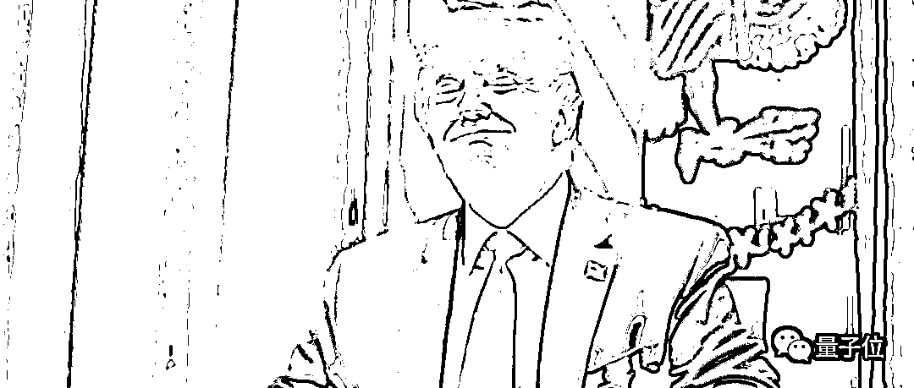
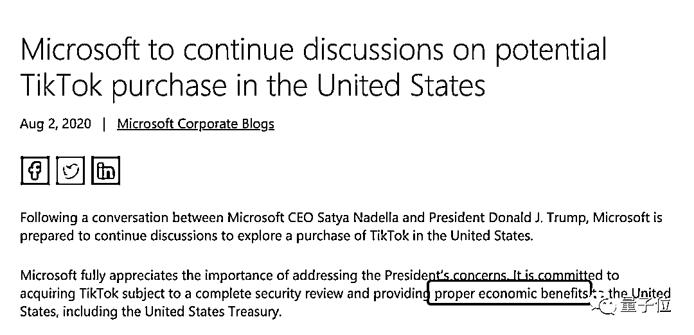

# TikTok 美国贡献度曝光：一年发工资至少 18 亿！

> 原文：[`mp.weixin.qq.com/s?__biz=MzAxNTc0Mjg0Mg==&mid=2653303884&idx=1&sn=c793fbf9abbc552da909ff731e3b41f9&chksm=802df659b75a7f4f2b0ed077404481c55af964ccc6609dcf18cdf6e5c3d8d9b8a781312f998f&scene=27#wechat_redirect`](http://mp.weixin.qq.com/s?__biz=MzAxNTc0Mjg0Mg==&mid=2653303884&idx=1&sn=c793fbf9abbc552da909ff731e3b41f9&chksm=802df659b75a7f4f2b0ed077404481c55af964ccc6609dcf18cdf6e5c3d8d9b8a781312f998f&scene=27#wechat_redirect)

**全网 TOP 量化自媒体**

##### 鱼羊 杨净 发自 凹非寺
量子位 报道 | 公众号 QbitAI

***1***

**TikTok 这一劫，美国媒体也觉得冤**

因为作为一家高速成长的公司，光就业、薪资和纳税上，字节跳动就在 TikTok 美国投入了不少钱。  

不信你看这组招聘薪资数据：

产品与工程岗位，基本年薪**63 万-196 万**人民币，不含股票期权。

数据科学与研究岗位，基本年薪**87 万-209 万**人民币，不含股票期权。

商业化岗位，基本年薪**35 万-176 万**人民币，不含股票期权。

相比国内，着实不低了。相比硅谷工程师，考虑到 TikTok 的高速成长性，也非常可观了吧。

美媒 CNBC 就说，随着 TikTok 全球下载量超过 20 亿次，在美国的全职员工人数就从年初的不足 500 人增长了近 2 倍，达到将近 1400 人。

甚至在威胁渡劫中，TikTok 及其母公司字节跳动，仍在继续推进此前的计划——声称在未来三年内在美国再增加**10000 个**工作岗位。

然并*。

就业岗位、资金注入、纳税贡献……种种投入换来的依然是川普政府的一通乱拳，连硅谷华人工程师都说，目睹了一场抢劫。

并且再次上演“谈判艺术”——又是强制出售，又是彻底封禁，然后反复变换口风之后……

川普甚至更加直白地公开表示：收购可以，但美国政府要参与分成。

只是要真算账，与 TikTok 计划带来的经济贡献相比，“分成”或许只是小利。

***2***

**TikTok 美国研发岗：年薪可达 200 万**

外媒 Business Insider 今日援引美国劳工部的工资数据称，TikTok 及其母公司字节跳动，在美国的许多雇员都拿到了 6 位数美元的年薪。

由于美国外国劳工认证办公室会公开披露各大公司外籍员工的收入数据，为了反映出 TikTok 和字节跳动支付给美国员工的工资水平，Business Insider 统计了 2019 年 10 月至 2020 年 6 月期间提交并认证的约 240 份外国劳工认证申请。

结果显示，产品和工程岗，TikTok 和字节跳动为持有绿卡和 H1-B 签证的雇员提供了每年 89900 美元（约合 63 万人民币）到 28 万美元（约合 196 万人民币）的基本薪资。

但这还不包含股票期权等其他形式的薪酬。毕竟作为明星创业公司，更值钱的是手中的股票和期权。

这还不是全部。

数据科学和研发岗的基本薪资更高，达每年 12.5 万美元（约合 87 万人民币）到 30 万美元（约合 209 万人民币）。

商业化岗位方面，基本薪资为每年 5.1 万美元（约合 35 万人民币）到 25.2 万美元（约合 176 万人民币）。

总体而言，TikTok 和字节跳动为在美外籍员工提供的基本年薪在 49920 美元-30 万美元之间，换算成人民币是 35 万-209 万之间。

中位数标准来看，TikTok 的基本薪资中位数大约为 17.5 万美元（约合 122 万人民币）/年，字节跳动的基本薪资中位数为 16 万美元（约合 111 万人民币）/年。

如此数据，可以侧面反映出 TikTok 和字节跳动在美国人力成本的单位投入。

而且企业评价网站 Glassdoor 的数据，也佐证了 TikTok 美国岗位薪资待遇不菲。

比如客户经理年薪可达 9 万美元（约合 63 万人民币）。产品经理年薪可达 15.8 万-17.1 万美元（约合 110 万-119 万人民币）。  

按照中位数计算，在目前的美国雇员规模下，TikTok 一年在薪资方面就至少要投入近 18 亿人民币。

据腾讯科技报道，有许多华人工程师认为谷歌、Facebook 等大厂逐渐变得缺乏干劲和活力。“TikTok 如果真的能做好，会吸引一大波在硅谷的国人过去。”

可见 TikTok 在硅谷的吸引力。 

并且，随着与 Facebook 等社交平台的竞争加剧，TikTok 在美国的人员规模也在持续扩张。

养着这样一支规模成倍增长且薪资不菲的团队，足以看出 TikTok 在美国投入之巨。

这还不算团队连带产生的经济效益，比如纳税、上下游供需。

但即便如此，TikTok 现在面对的，依然是川普政府的“赶尽杀绝”、“吃干抹净”：

强制卖身，只给 45 天协商期。

甚至，川普最新喊话：收购交易要给美国政府分钱，“因为是我们让这笔交易成为可能。”

***3***

**川普：收购时记得给政府打钱**

不仅要赶尽杀绝，走之前记得还要交钱。

在上周五，川普还表态不支持 TikTok 被微软收购。

只是一个周末之后，更像是川普商业力作——《谈判的艺术》的再次演练：

在谈判中虚张声势、施压，甚至成交前忽然毁约——最后成功实现还价。

于是最新消息，川普现在又允许收购谈判了。

当然，这其中也放出了一个新的**必要条件**：

在出售时能够将**大部分交易款**项分给美国政府。直白来说就是要分大头。

而这件事情早也在推进当中。

从昨天微软公开发布的博文中，就可以看出一些细枝末节。微软与字节之间的收购协议将在「通过安全审查」、**「为美国政府提供适当经济利益」**的前提之下进行。

一直以来，川普就在有意强调基本经济概念，比如谁支付关税之类，但是这次突然横插两个公司之间的收购交易，并试图从中薅大部分羊毛，这显然是不现实的。

据 Techcrunch 报道，川普给出了这么一个原因：

**因为有我们，这个交易才可能发生。**

不管价格多少，也不管交易双方是谁，除非我们给他们，他们在美国本土将没有任何交易的权利。

他还是「生动」的列举了一个例子。

就好像是房东和房客之间的关系，没有租约，租户什么都没有，所以他们要上交一些所谓的「钥匙钱」。

据《华尔街日报》报道称，川普从收购中抽成此举在美国历史上缺乏先例，甚至涉嫌违法违规。

里士满大学法学教授 Carl Tobias 表示，**不仅不合法，还不道德。**

如此赤裸裸，美国网友也看不下去了。

***4***

**网友：敲诈？**

对此，就有网友表示，听起来像是在敲诈。

还有网友已经是一脸黑人问号：

> 为啥美国政府要从字节跳动和微软之间进行的私人交易里头拿钱？疯了吧。

不过对于这种事，也有网友已经司空见惯了。

> 这不过是川普上千篇语无伦次的言论之一，不知道的还以为是一个 6 岁小孩在那里絮叨。

另外，也有美国媒体分析，为啥川普会忽然对 TikTok 动刀，毕竟在今年 6 月底之前，TikTok 这个早已流行的应用，就从来没在网瘾老年的推特上出现过。

《华尔街日报》报道说，原因可能与“TikTok 搅了川普精选集会”有关，被懂王报私仇了。

今年 6 月 20 日，川普原计划有一场上万人的竞选集会，而严格报名申请的就有一百万人——可把川普激动坏了。

但一顿预热和高调宣传之后，搭建的能容纳 2 万多人的会场，最后只来了寥寥千人……

后来 CNN 揭秘说，之所以造成这种“毁灭性”反差，是因为有人在 TikTok 组织了一个活动，让全球各地网友都去注册抢夺川普竞选集会的门票，造成集会前万人空巷的热闹局面。

但实际上，这些出于恶作剧也好、反对川普也好的 TikTok 用户，压根不会去现场，于是场面最后就变得非常尴尬，简直伤碎了热爱粉丝前振臂高呼吹牛喊口号的懂王的心。

这是第二天川普回到白宫时被拍的照片：

其后 7 月 6 日，川普政府首次放话：出于安全原因，正在考虑封禁 TikTok。

参考链接：
https://www.businessinsider.com/tiktok-bytedance-us-salary-levels-show-pay-product-engineer-jobs-2020-7
https://www.cnbc.com/2020/08/03/zoom-to-halt-direct-sales-of-services-to-users-in-china.html
https://techcrunch.com/2020/08/03/trump-calls-tiktok-a-hot-brand-demands-a-chunk-of-its-sale-price/
https://www.wsj.com/articles/trump-says-u-s-should-get-slice-of-tiktok-sale-price-11596479818
https://www.wired.com/story/what-tech-companies-pay-employees-2019/
微博@褚明宇老师的问答，有更精彩完整的描述：https://weibo.com/ttwenda/p/show?id=2310684533737126756521#_0

量化投资与机器学习微信公众号，是业内垂直于**Quant、MFE、Fintech、AI、ML**等领域的**量化类主流自媒体。**公众号拥有来自**公募、私募、券商、期货、银行、保险资管、海外**等众多圈内**18W+**关注者。每日发布行业前沿研究成果和最新量化资讯。

**点赞♥ ****+ ****在看**★****