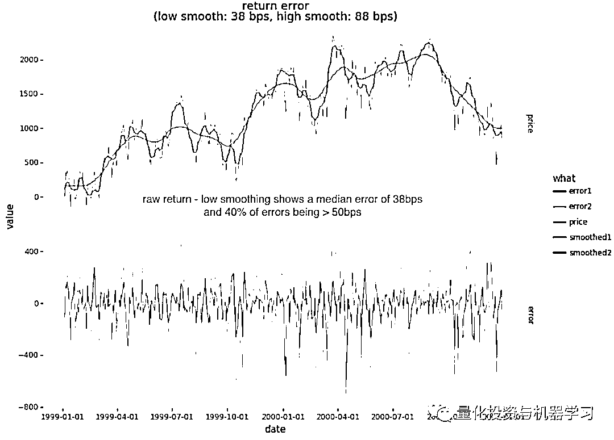
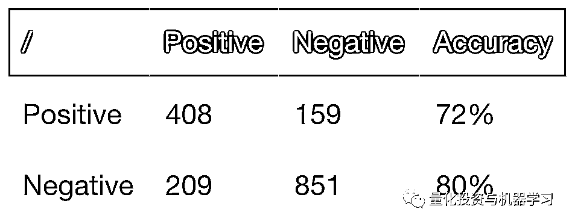
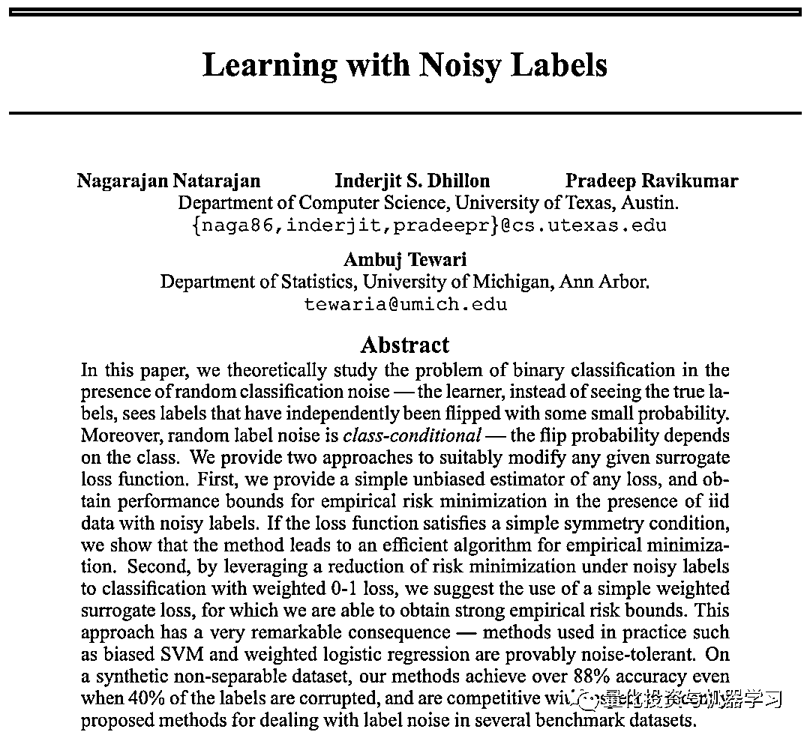
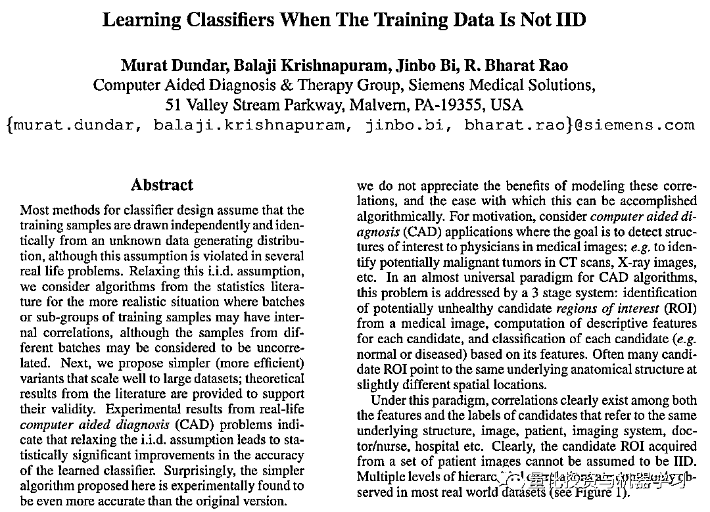
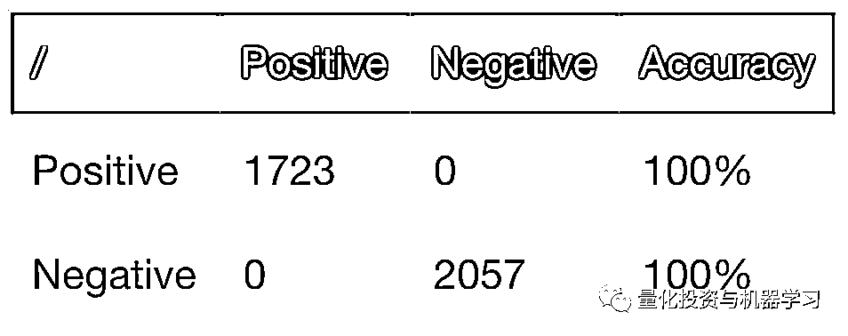
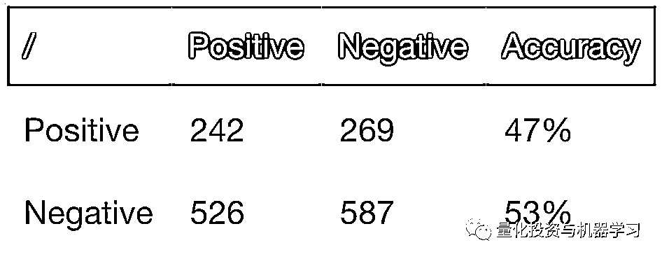
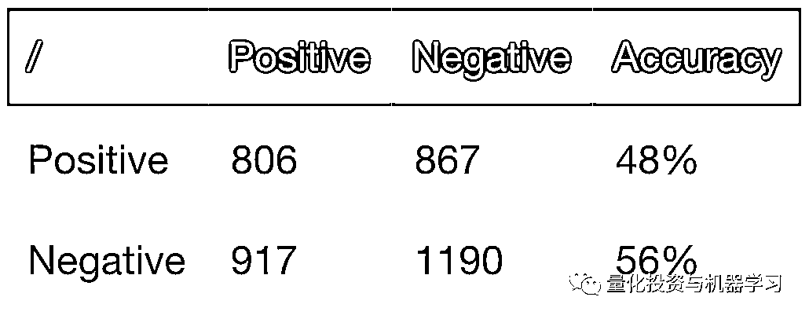
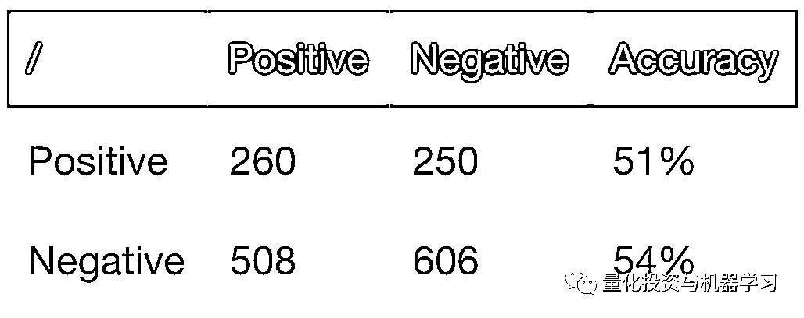

# 为什么机器学习应用交易那么难（中）

> 原文：[`mp.weixin.qq.com/s?__biz=MzAxNTc0Mjg0Mg==&mid=2653303861&idx=1&sn=0d99d9e122688735b82bb734c48cdfed&chksm=802df620b75a7f365fa2f3b283c704076342a9384670d4bfc6cbfd62eb739123b9df8fbe2904&scene=27#wechat_redirect`](http://mp.weixin.qq.com/s?__biz=MzAxNTc0Mjg0Mg==&mid=2653303861&idx=1&sn=0d99d9e122688735b82bb734c48cdfed&chksm=802df620b75a7f365fa2f3b283c704076342a9384670d4bfc6cbfd62eb739123b9df8fbe2904&scene=27#wechat_redirect)


**全网 TOP 量化自媒体**

上一期我们分享了《为什么机器学习应用交易那么难（上）》，点击下方阅读原文：

 

此系列也引起大家得激烈讨论，大家也一直期待后续的文章。今天《为什么机器学习应用交易那么难（中）》要来啦！赶快阅读吧！

***1***

**标签噪音以及我们可以采取的措施**

在上一篇文章的基础上，我们想讨论低信噪比的影响及其影响：

*   标签/错误标签

*   特征不支持的模式

这是如何体现的，以及我们将采取哪些措施来改善其所带来的问题。

***2***

**引言**

金融时间序列似乎具有非常低的信噪比，其中方差（噪声频率的幂）可能高于整体信号的幂。有许多不同的方法可以量化金融时间序列的信噪比，但这里不再赘述。

价格不确定性是一个有限信息的函数。如果我们知道或可以推断出每个市场参与者的个人决策和信息状态，我们就可以确定每个参与者的下一步行动。这仍然不足以预测未来的远期价格，除非我们还可以对影响市场参与者的外来信息的未来状态进行建模。尽管我们知道并参与了有限的市场参与者建模（例如，做市商对交易员（客户）或特定客户的行为进行建模），但未来的事件预测将需要一个能够预测我们生态系统的超人类人工智能。考虑到我们缺乏了解或预测此粒度级别的能力，出于我们的目的，我们必须假定存在：

*   基础价格方向

*   由于对价格发现的不同观点（或由于有目的的混淆）给价格方向上造成了很大的噪音

*   冲击与机制更迭

***3***

**标签噪音问题**

机器学习模型占主导地位（即有标签的分类器或回归器）。这些模型采用以下形式：

其中我们在训练函数 f(X)以最小化损失函数和复杂度折衷，例如：

<embed style="vertical-align: -2.697ex;width: 29.712ex;height: auto;max-width: 300% !important;" src="https://mmbiz.qlogo.cn/mmbiz_svg/a18XcQ1EBBiac5beoTHDXQics7qgicYDRzPzASIYHeMhCH3XfD0eCdX4Z67zo66JsNhMzp3BrCbsplGykDz5ibNOyYjldfm1R9fm/0?wx_fmt=svg" data-type="svg+xml">

其中是损失函数，是复杂性损失。有许多不同的优化公式。我们推荐这篇有关损失函数的文章，作为通常部署的损失函数类型的概述。至于优化，根据 ML 算法和结构可能看起来完全不同。例如，决策树模型与 SVM 和损失函数方法中的深度学习完全不同。

如果我们的标签（在训练中提供的标签）具有较高的误差，则我们已将模型偏向该误差。我们标签中 50％的错误率肯定会导致模型像随机模型一样好。具有 50％的标签错误率并不是破坏 ML 模型的必要条件。更低的标签错误率就足够了：

*   交易机会通常是少数标签：

*   在二进制分类的情况下，输入的+1 可能是所有标签的 1/3 或 1/4。

*   模型中可能会更加强调某些特征/标签对：

*   例如，由于特定特征向量的方差较高。

*   特征有其自身的噪音，导致 OOS 模型性能下降。

***4***

**标签噪音：挖掘**

让我们了解一下在我们先前的示例中，相对于平滑的远期收益预测，日收益中出现的误差。回想一下，我们的标签基于大于或等于 50bps 的 5 日收益率。为了简化分析，让我们考虑相对于平滑的前向累积收益（以 bps 为单位）的每日收益中的噪声。

```py
prices = pd.Series(bars["Adj Close"].values.flatten())
cumr = np.log(prices / prices.iloc[0]) * 1e4

def smooth (y: pd.Series, bandwidth: float):
    x = np.arange(0, cumr.shape[0])
    return pd.Series(lowess(y.values.flatten(), x, frac=bandwidth)[:,1].flatten())

smoothr1 = smooth(cumr, 0.002)
smoothr2 = smooth(cumr, 0.01)
error1 = cumr - smoothr1
error2 = cumr - smoothr2

stat1 = np.abs(error1).median()
stat2 = np.abs(error2).median() 
```



低平滑（smoothing1）是相当轻的平滑，其近似周期与 5 日收益方向一致。请注意，中值误差为 38bps，其中 39％的误差超过 50bps（而其余 61％的错误低于 50bps）。如此之高的错误率将使任何基于收益标签的模型脱轨。

***5***

**特征噪声：挖掘**

可以想象，基于价格的特征也会显示出类似的噪音。让我们作弊一下，看看如果我们平滑用于因子和标签的价格，去掉标签和特征的杂音，会发生什么。请注意，这不会产生有效的策略，因为上面使用的平滑是全局的，因此具有前瞻偏差。但是，如果我们进行降噪，则 OOS 结果的差异应该很明显。

```py
smoothr1 = smooth(cumr, 0.001)
smoothr2 = smooth(cumr, 0.002)
smoothr3 = smooth(cumr, 0.005)

# 创建特征
df = pd.DataFrame({
    "rsi.1": talib.RSI(smoothr1, timeperiod=14),
    "rsi.2": talib.RSI(smoothr2, timeperiod=14),
    "rsi.3": talib.RSI(smoothr3, timeperiod=14),
    ...
})

# 创建 { 0, 1 } 标签,日收益>=20bps
df["rfwd"] = df["roc1.1"].shift(-1)
df["label"] = (df.rfwd >= 0.20) * 1.0
...

icut = int(df.shape[0] * 0.70)
training = df.iloc[:icut].dropna()
testing = df.iloc[icut:].dropna()

clf = RandomForestClassifier(n_estimators=500, random_state=1, n_jobs=-1)
model = clf.fit (training[features], training.label)

pred_train = model.predict(training[features])
pred_test = model.predict(testing[features]) 
```

在这种情况下，我们现在获得的 OOS 精度为 72％，而不是先前模型中的 47％。如果不是因为平滑方面的前瞻偏差，这将导致一个非常有利可图的策略。



***6***

**回避问题**

如果不解决噪音问题，就有办法避免“标签问题”，例如：

*   无监督学习（无标签目标）：

*   例如 HMM，KNN 等例子。

*   回归：

*   这是准标记的，因为它映射到（有噪音的）结果，但不像分类那样具有量化的结果。

*   EA（遗传算法和遗传程序）：

*   人们解决问题是为了一个目标而不是使用分类。

当然，使用这些方法中的任何一种都意味着你以一种非常不同的方式重新定义了一个问题。**在很多情况下，分类才是最有意义的**，而上述内容并不是特别适用。

***7***

**部分解决方法**

人们很少在诸如 sklearn 这样的库中看到类条件噪音损失函数的直接支持，在文献中对噪音标签的研究也很有限：

下载地址：

https://papers.nips.cc/paper/5073-learning-with-noisy-labels.pdf



相关论文中讨论的损耗方法是：**假设标签上的噪音分布一致**。然而，我们应该期望我们的标签噪音会随市场波动而随时间变化（条件噪音分布会随时间变化）。

可以采取一些启发式方法：

*   最明显的是，通过预平滑去噪：

*   给定标签和特征中都存在噪音（在没有前瞻偏差的情况下，去除特征噪音通常无法去除），因此预平滑处理只能解决标签噪音而非特征噪音。

*   使用允许加权的分类算法，根据预期的标签噪音对样本加权：

*   这限制了我们可以使用的机器学习算法，也意味着我们的模型无法很好地预测较高波动性的情况。

一种更有趣的启发式方法（我们已经成功使用过）试图通过使用两阶段分类方法来同时规避特征和标签噪音：

*   使用在原始标签上训练的模型来生成新标签：

*   这些标签中的某些百分比将是我们给定的标签，而某些百分比将被重新标记为替代类。

*   保留 TP、TN 和 FN，但是重新映射 FP→0。

*   在训练集中进行 N 次折叠，直到重新标记整个训练集。

*   根据生成/修改的标签训练新模型：

*   我们发现这可以提高精度，消除了使用原始标签无法获得 TP 的阻抗。

**样本代码（使用 RF 对标签进行重新采样）：**

```py
def relabeled(X: pd.DataFrame, y: pd.Series, nfold = 10):
    w = X.shape[0]
    cuts = np.arange(0,w+1,w/nfold, dtype=int)
    cuts[-1] = w

    newlabels = np.zeros(w)
    for i in range(0,cuts.shape[0]-1):
        xtesting = X.iloc[cuts[i]:cuts[i+1]]
        ytesting = y.iloc[cuts[i]:cuts[i+1]]

        xtraining = pd.concat([X.iloc[:cuts[i]], X.iloc[cuts[i+1]:]])
        ytraining = pd.concat([y.iloc[:cuts[i]], y.iloc[cuts[i+1]:]])

        clf = RandomForestClassifier (n_estimators=500, random_state=1, n_jobs=-1, class_weight='balanced')
        model = clf.fit (xtraining, ytraining)
        ynew = clf.predict(xtesting)

        TP = (ynew == 1) & (ytesting == 1)
        FP = (ynew == 1) & (ytesting == 0)
        FN = (ynew == 0) & (ytesting == 1)
        TN = (ynew == 0) & (ytesting == 0)

        precision = TP.sum() / (TP.sum() + FP.sum()) * 100.0
        print ("[%d/%d] precision: %1.1f%%" % (i+1, cuts.shape[0]-1, precision))

        ynew[FP] = 0.0
        newlabels[cuts[i]:cuts[i+1]] = ynew

    return newlabels 
```

我们对这个问题的处理仍然很不满意。我们认为最佳解决方案将在于创建机器学习算法，该算法明确允许用户在整个数据集中参数化特征和标记噪音。

接下来，我们将尝试解决缺乏特征向量独立性的问题。

***8***

**非独立样本的问题**

金融学中的许多机器学习模型都处理时间序列数据，其中训练中使用的样本可能在时间上接近，彼此之间并不相互独立。金融中很少有不使用 lookback 期的特征，例如：

*   几乎所有技术指标

*   基于分布的信号

*   基于分解的信号

*   传统信号处理

*   波动性：滚动 stdev，garch，瞬时 vol 等

*   霍克斯估计方差或买卖不平衡的过程

*   机制模型

*   …

这些特征中使用的 lookback 期允许时间 t 处的某个特征相对于最后 k 个特征（其中 k 是一个特征的回溯窗口大小）重叠（而不是 i.i.d）。序列中将来的 t .. t + k 特征也有重叠。通常，如果给定特征的回溯长度为 k（例如，k 个周期 MA），则样本将与 k 个先前样本和 k 个将来样本（或 2k 个）样本共享信息。

一些最佳的监督机器学习方法在训练过程中采用采样，例如：

*   深度学习模型

*   随机森林

*   遗传算法

*   …

当样本缺乏样本间独立性时（即在时间上不是 i.i.d），机器学习模型通常能够利用引入的前瞻偏差，使模型在训练中过拟合。参考如下：

下载地址：*http://people.ee.duke.edu/~lcarin/IJCAI07-121.pdf*



在我们之前的随机森林示例中，我们在训练过程中获得了完美精确性。这主要是由于样本之间缺乏独立性，该模型从样本之间重叠的 ROC 窗口导致的前瞻偏差中学习。这种过拟合导致样本外（OOS）性能不佳。

将同样的方法应用于深度学习模型（例如 LSTM）将获得类似的结果，并具有非常高的样本内性能和较差的 OOS 性能。

随机森林确实允许一些约束条件，**这些约束条件可以通过以下方法减少非独立样本的影响：**

*   **减少用于拟合森林中每棵树的样本数量：**

*   如果每棵树的随机样本数（经替换）从 N（样本总数）减少到 M <N，则给定样本与同一棵树中的另一个样本重叠的概率从近 100％减小到更小的重叠概率。

*   **降低每棵树的复杂性（例如，树的深度）：**

*   这只会减少可利用前瞻偏差的规则数量。

这些只是部分回避了问题。更好的解决方案是彻底消除独立性问题。

***9***

**随机森林的一种解决方案**

在应用监督学习时，我们倾向于使用贝叶斯模型和随机森林，因为它们通常比深度学习或替代方法更适合我们的特征集。在适应非独立性方面，我们修改了 scikit-learn 的随机森林分类器和随机森林回归器算法来解决此问题。

变化如下：**调整了随机森林分类器和回归器，以允许用户定义采样函数。这种能力使用户计算非 i.i.d 相对于彼此之间的样本，从而确保每棵树都包含独立的样本。**

回想一下，我们先前的模型在训练中具有完美的精确性（过拟合的一个明显迹象）：



并以 47％的精确度得出样本外的结果（亏损交易多于获利交易）：



通过引入避免重叠样本的采样：

```py
def select_stride(random, nrows, samples, skip=20):
    offset = random.randint(0,skip)
    raw = pd.Series(random.randint(0,nrows/skip,samples))
    indices = raw.apply(lambda x: min(x+offset, nrows-1))
    return indices

clf = RandomForestClassifier(
    n_estimators=500, random_state=1, n_jobs=-1,
    sampling_function=select_stride)

model = clf.fit (training[features], training.label)
pred_train = model.predict(training[features])
pred_test = model.predict(testing[features]) 
```

我们得到以下混淆矩阵。对于样本内：



以及样本外 51％的精确度：



我们在《[为什么机器学习应用交易那么难（上）](http://mp.weixin.qq.com/s?__biz=MzAxNTc0Mjg0Mg==&mid=2653303594&idx=1&sn=933d1c648024c54a9b16cfa89a4c461c&chksm=802df13fb75a7829c0c10fb17e5d64033366ec26a2a8ff8c3834c65590249641823b73d144b1&scene=21#wechat_redirect)》示例中的特征集和标签并不出色，因此没想到可行的策略。也就是说，通过消除采样重叠，我们可以：

*   简化训练模型的过拟合（如上所示，精确度<100％）。

*   改善样本外性能。

***10***

**总结**

**1、样本在时间上的非独立性可能会大大降低机器学习模型，导致偏差和过拟合。**

**2、需修改训练算法以消除非独立样本的影响。**

量化投资与机器学习微信公众号，是业内垂直于**Quant、MFE、Fintech、AI、ML**等领域的**量化类主流自媒体。**公众号拥有来自**公募、私募、券商、期货、银行、保险资管、海外**等众多圈内**18W+**关注者。每日发布行业前沿研究成果和最新量化资讯。

**点赞♥ ****+ ****在看**★****