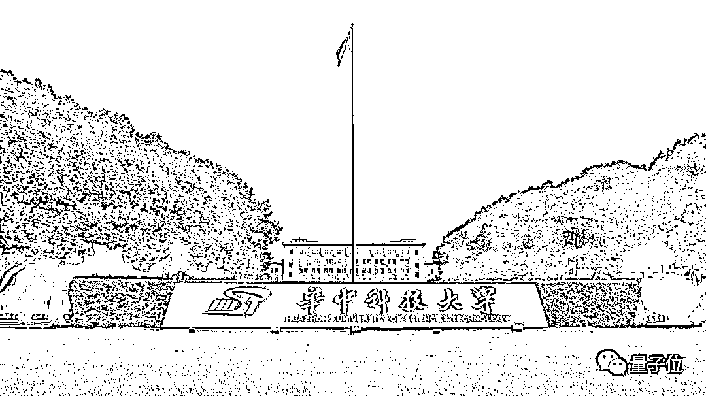
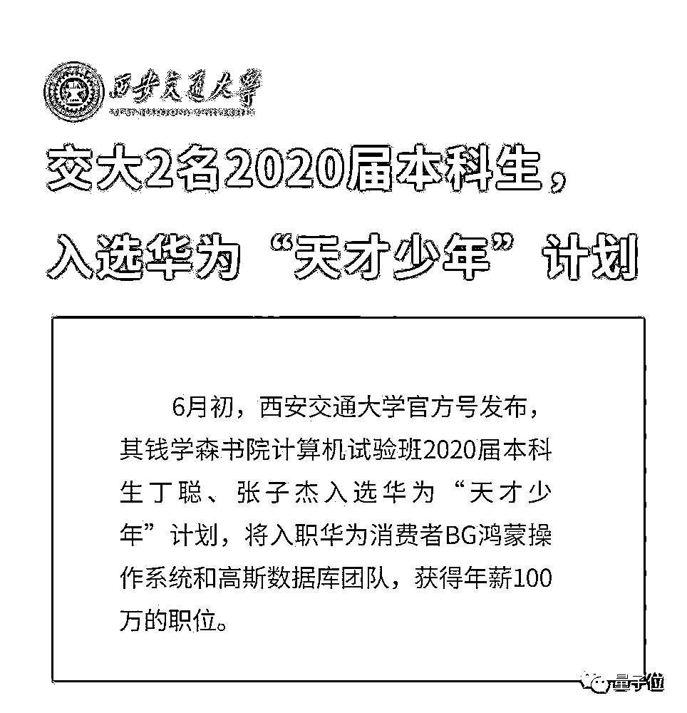
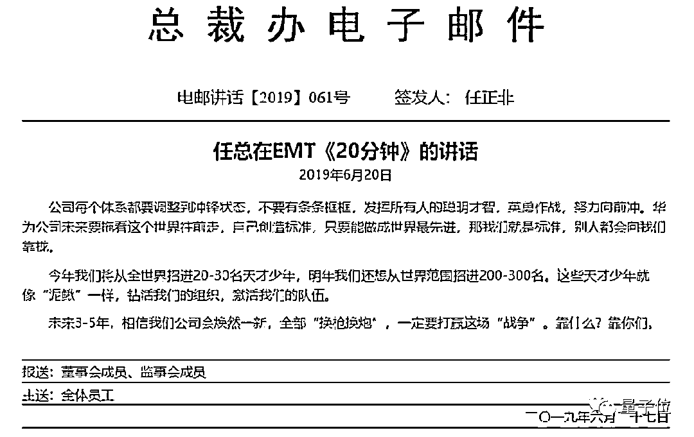

# 华为「天才少年」校招薪资曝光：博士 201 万，本科 100 万！

> 原文：[`mp.weixin.qq.com/s?__biz=MzAxNTc0Mjg0Mg==&mid=2653303776&idx=1&sn=b643d05d9e25431390cb6a1b30e34156&chksm=802df1f5b75a78e301161c2c4834b9112b74f4c727b3f02cebf09c3abb3f56b9a589903b2ca1&scene=27#wechat_redirect`](http://mp.weixin.qq.com/s?__biz=MzAxNTc0Mjg0Mg==&mid=2653303776&idx=1&sn=b643d05d9e25431390cb6a1b30e34156&chksm=802df1f5b75a78e301161c2c4834b9112b74f4c727b3f02cebf09c3abb3f56b9a589903b2ca1&scene=27#wechat_redirect)

量化投资与机器学习微信公众号，是业内垂直于**Quant、Fintech、AI、ML**等领域的**量化类主流自媒体。**公众号拥有来自**公募、私募、券商、期货、投行、保险**等众多圈内**18W+**关注者。每日发布行业前沿研究成果和最新量化资讯。

##### 金磊 发自 凹非寺
量子位 报道 | 公众号 QbitAI

西交大本科毕业年薪 100 万，华科博士毕业年薪 201 万。

开出如此天价年薪的正是**华为**。

果然，那个扬言从全世界招募顶尖人才的**「天才少年」计划**，薪资也是顶级的。

去年 6 月，任正非透露了这个项目并提出年薪八位数。

现在，时隔一年，第二批「天才少年」入选者也曝光了。

***1***

**华科三位「天才少年」脱颖而出**

## 从去年 12 月至今，单是华中科技大学，便有三位「天才少年」入围这项计划。 

华科官方，也对外确认了这一消息。

他们分别叫**左鹏飞、张霁和姚婷。**

###### △左鹏飞

左鹏飞拿到的是华为「天才少年」计划的薪资最高档（182-201 万人民币/年）。

他是湖北随州人，华科计算机科学与技术专业 2014 级直博研究生，他主要的研究领域是内存系统和架构、存储系统和系统安全。

他在读博的 5 年时间里，几乎每天都是 8:30 进入实验室，直到 9 点甚至 10 点才回寝室，堪称是用「自律诠释坚持」。

也正是如此的坚持，才让他在读博期间，以第一作者的身份发表了 10 余篇高水平论文。

其中，发表在 OSDI’2018 和 MICRO’2018 上的论文，分别成为了华科历史上首篇计算机操作系统、计算机体系结构顶级会议论文，实现了华科在这些领域中的**零突破**。

用左鹏飞自己的话就是：

**一个高水平的博士毕业生，需要是一个领域里首屈一指的专家，所有人提到这个领域都会想到你的名字。**

而在临近毕业之际，华为并不是唯一一家向左鹏飞抛出橄榄枝的企业。

实际上，他投的腾讯、阿里和深信服都向他发放了 offer，其中还不乏开出税后收入高出华为 40%的企业。

但左鹏飞最终还是选择了华为云的存储预研部门：

**去华为不是因为薪资高，而是综合考虑的结果，华为提供了方向更契合的岗位，也能让自己保持与学术界的接触。**

###### △张霁

张霁也入围了华为「天才少年」计划，薪资也是最高档。

他是咸宁通山人，今年在华科获得博士学位。目前的工作之一是在阿姆斯特丹大学 INDE Lab 进行博士后研究工，主要研究方向是 AI for System。

张霁在博士期间，以第一作者身份，在 ATC、DAC、ICPP、SIGMOD 等会议和期刊上发表了多篇研究。

但张霁本人对自己的定位是**努力型选手**，拿到华为这份这份 offer，也是经过了 7 轮严苛选拔。

和左鹏飞相似的是，张霁也是手握多家顶级企业的 offer，甚至有一家企业给出的年薪高达 360 万元。

对此，张霁认为：

**希望在华为最艰难的时候为其做出一点贡献，能够和一群志同道合的人做有意义的事。**

如今，拿到了他人梦寐以求的 offer，比起喜悦，张霁感受到的是肩上的重担和责任，更多的是去思考今后该如何做好工作，不负众望。

###### △姚婷

姚婷也是华科入围华为「天才少年」计划的人才之一。

她是湖南益阳人，计算机系统结构专业直博五年级。研究方向为新型存储介质（NVM，SMR），数据库和键值存储系统。

读博期间，在 CCF A 类会议 FAST、ATC，CCF B 类会议 IPDPS、MSST，CCF A 期刊 TPDS、TOS 等以第一作者发表论文。

与左鹏飞和张霁相比，姚婷的特点是始终在各个小环境做到优秀，再随着环境的改变提升自己。

从本科的历程中便能体味一二：参加辩论队、中英文演讲；担任外联部副部长、辅修第二专业英语对外翻译、支教；参加全国大学生数学建模大赛、全国大学生物联网大赛等等……

在读博期间，也是敢于挑战自己的短板，抓住各种研究课题、论文写作、参加学术会议、出国学习交流的机会。

可以说，是无时无刻不在给自己充电了。

巧合的是，任正非以和华为许多知名高管都是出身华中科技大学，例如孟晚舟、郭平等等。

坊间还有传言称，华为早期的员工中有 30%来自于华中科技大学的毕业生，堪称华为公司人才的摇篮。

时间回到 1978 年，任正非拿着 2 万元创业时，早期研发人才较少，也很难吸引到最顶尖人才。

后来，华为陆续在华科打开局面，比如郑宝用、李一男等，都来自华科。

在此之后，华为研发出了自己的通讯设备，才开始飞速发展。

据 2017 年华为员工毕业高校的统计，华为十几万的员工中，排在第一位的是武汉理工大学，占比 2.3%，有 2.1%员工毕业于华科，居第二位。

相比之下，清华、北大等老牌名校出身的员工，在华为的占比并不是很大。

而在华为在被美国针对之际，华中科技大学也是挺身而出，签署战略合作协议：

**双方通过战略合作，继续在人才培养、科学研究、成果转化等方面发挥各自的优势，为双方更好的发展创造新局面。**

不过近几年，随着华为发展更上一层楼，品牌效应扩大，全国乃至全世界最优秀的人才，华为都具备了极强的竞争力。

***2***

**新晋本科百万年薪「天才少年」**

## 除了华科的「天才少年」之外，2 位来自**西安交通大学**的本科毕业生也入围了该项目。 

他们是来自钱学森书院计算机试验班 2020 届本科生**丁聪和张子杰**。

据西安交通大学官方公布信息，丁聪和张子杰将入职**华为消费者 BG 鸿蒙操作系统和高斯数据库团队。**

而从对应的年薪来看，属于「天才少年」计划中**89.6-100.8 万人民币/年**档。

丁聪和张子杰都是从小痴迷于编程，在校期间，也都是 ACM 队的骨干成员。

其中，丁聪前后两次挺进 ACM-ICPC，并在第 43 届国际大学生程序设计竞赛中与早稻田大学、普林斯顿大学、哥伦比亚大学并列全球 41 名，刷新交大在该大赛中的历史最好成绩。

出身少年班的张子杰，同样也在国际大学生程序设计竞赛亚洲区赛、中国大学生计算机程序设计竞赛中，分别夺得金奖、银奖等好成绩。

而此次以本科毕业生身份入围华为「天才少年」计划，并拿下百万高薪，也正是对他们强硬实力的再次认可。

***3***

**华为的「天才少年」，今年要达 200-300 人**

## 「天才少年」是任正非于去年 6 月发起的用**顶级薪酬招揽顶尖人才**项目，他曾在 EMT（经营管理团队）内部讲话中提及：

## **今年（2019 年）将从全世界招进 20-30 名天才少年，明年我们还想从世界范围招进 200-300 名。这些天才少年就像「泥鳅」一样，钻活我们的组织，激活我们的队伍。**

任正非还表示：

> 公司每个体系都要调整到冲锋状态，不要有条条框框，发挥所有人的聪明才智，英勇作战，努力向前冲。
> 
> 华为公司未来要拖着这个世界向前走，自己创造标准，只要能做成世界最先进，那我们就是标准，别人都会向我们靠拢。

同时还曝出了对八位 2019 届顶尖学生实行年薪制的方案：

1、钟钊：博士。

年薪制方案：182-201 万人民币/年

2、秦通：博士。

年薪制方案：182-201 万人民币/年

3、李屹：博士。

年薪制方案：140.5-156.5 万人民币/年

4、管高扬：博士。

年薪制方案：140.5-156.5 万人民币/年

5、贾许亚：博士。

年薪制方案：89.6-100.8 万人民币/年

6、王承珂：博士。

年薪制方案：89.6-100.8 万人民币/年

7、林晗：博士。

年薪制方案：89.6-100.8 万人民币/年

8、何睿：博士。

年薪制方案：89.6-100.8 万人民币/年

而在更早之前，任正非在接受央视采访时，也表达了他的一些**「人才观」**：

> 二战之后，德国和日本工业基础都被摧毁了。当时有一个著名的口号「什么都没有了，只要人还在，就可以重整雄风」，没多少年德国就振兴了，所有房子都修复得跟过去一样，日本的经济也快速恢复。
> 
> 这得益于他们的人才、得益于他们的教育、得益于他们的基础，这点是最主要的。所有一切失去了，不能失去的是人，人的素质、人的技能、人的信心很重要。

从中也不难看出，华为对于人才的求贤若渴。

当然，许多网友在看到「天才少年」们如此丰厚的年薪后，表示酸了：

> 这个年龄我在玩……
> 
> 羡慕啊，天赋碾压。

但爱迪生曾说过，「天才是百分之一的天赋，加上百分之九十九的汗水」。

也正如「华中科技大学研究生」官方发文中所述：

> 拿到华为「天才少年」offer 的那一刻，他们无一例外地并没有太多惊讶。
> 
> **无数个平凡的日子才造就了今日的不平凡**，一切不过是水到渠成的事情。
> 
> 而他们的价值也远非简单能用金钱衡量，**那些熠熠闪光的可贵品质，本身就已是无价之宝。**