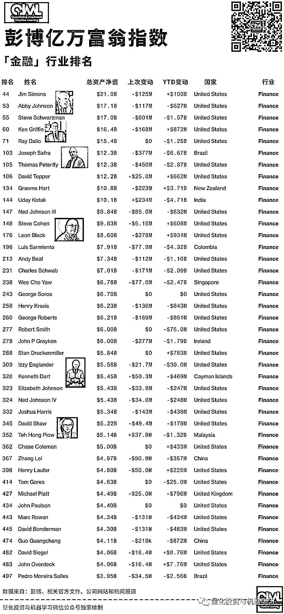

# 活下去！

> 原文：[`mp.weixin.qq.com/s?__biz=MzAxNTc0Mjg0Mg==&mid=2653303763&idx=1&sn=020348e4b9a8c79103362e27937168b4&chksm=802df1c6b75a78d03d523d9b8795c9fbe5d638d6016ef0a9b8d1e1107ecdd33f8bf83a928050&scene=27#wechat_redirect`](http://mp.weixin.qq.com/s?__biz=MzAxNTc0Mjg0Mg==&mid=2653303763&idx=1&sn=020348e4b9a8c79103362e27937168b4&chksm=802df1c6b75a78d03d523d9b8795c9fbe5d638d6016ef0a9b8d1e1107ecdd33f8bf83a928050&scene=27#wechat_redirect)

量化投资与机器学习微信公众号，是业内垂直于**Quant、Fintech、AI、ML**等领域的**量化类主流自媒体。**公众号拥有来自**公募、私募、券商、期货、投行、保险**等众多圈内**18W+**关注者。每日发布行业前沿研究成果和最新量化资讯。

Nishant Kumar、Demetrios Pogkas、

Hema Parmar、1+1=6

在新冠肺炎席卷全球市场之前，对冲基金的管理费已经在削减。而现在，他们正处于极度衰退之中。

管理费伦敦增长最快的对冲基金之一，正通过同意放弃业绩费，直到收益达到设定门槛再进行收取，以吸引新的投资者。在香港，一位基金老板愿意承担所有损失，有点让我们不敢相信。

随着新冠肺炎行引发资金赎回，几乎所有对冲基金都在竭尽全力去吸引新的资金。现在全球很多基金经理都已经清楚地意识到，如果他们想扩大规模，则需要颠覆几十年来一直采用的**2+20 模式**。对于一些规模较小的公司，他们的目标不是增长，而是生存！

**何为 2+20?**

2+20（two and twenty）的 2 指基金管理人每年度收取基金规模 2%的管理费（management fee），20 则代表基金管理人提取基金收益的 20%作为绩效收益（carried interest）/业绩报酬（performance fee）。

收费最低的公司市场份额增长最快，截止 2020 年 6 月底：

*图片来自：Eurekahedge

总部位于纽约的 Dynamic Beta Investments 创始人 Andrew Beer 表示：“对冲基金行业到处都是规模永远达不到要求的小型基金”。

上世纪 90 年代，在乔治•索罗斯（George Soros）和塞思•克拉曼（Seth klarman）等知名经理人的推动下，对冲基金获得了出色的收益率。对于大多数公司而言，甚至对于没有什么背景的初创公司经理来说，每年 2％的管理费和 20％的利润分成已成常态。其中一个卖点是，对冲基金可以灵活地执行其他基金经理无法执行的策略，甚至在市场波动中获利。

亿万富翁杰夫·塔尔宾斯（Jeff Talpins）的元素资本管理公司（Element Capital Management）去年将管理费上调至 40％。D.E.Shaw 已将其最大的对冲基金的佣金比例上调至 30％，并将年费提高到 3%。但是他们现在是少数。

**即使是最大的对冲基金，高额管理费也不再是常态！**

**管理 fees**

数据来自：Preqin、彭博

**收益 fees**

数据来自：Preqin、彭博

但是，包括达里奥的桥水和其他一些公司，从今年 3 月份开始，已经经历了有史以来最糟糕的几个月。

根据 EVestment 的数据显示，**截止 2020 年上半年，客户已从对冲基金中撤出了超过 550 亿美元的资金，这是至少十年来最大的数额**。第一季度有数百家公司倒闭，这是四年多来最快的速度。新产品的发行量也跌至历史低点。

在这种背景下，一些经理人表示，他们准备完全免收固定费用，同时还提供其他福利。允许客户访问其研究成果等等。

总部位于香港的 Infini Capital Management 的首席执行官 Tony Chin 表示，将提供 100%的损失保险，即所谓的全损保险。作为交换，它将收取所产生利润的一半。 

太多这样的机构了···

随着收益的增长，数千亿美元的资产流入了对冲基金行业。呈现出爆炸性的增长：

数据截止 2020 年至 3 月，来自：HFR

2008 年金融危机后。随着各国央行向市场注入大量 cheap money，收益率大幅下降，颠覆了资产类别和经济数据之间的传统关系。随着市场进入历史上最长的牛市，波动性逐渐减弱，许多基金经理难以从做空股票中获利。**过去十年，对冲基金创造的股票年收益率不到三分之一。**

**2020 年上半年，对冲基金亏损 3.4%**，略高于包括股息在内的标普 500 指数的跌幅，这一表现令人失望。

自金融危机以来，对冲基金的收益一直落后于标普 500。数据统计截至 6 月 30 日。

**自 2008 年以来**

图片来自：彭博 

**自 2000 年以来**

图片来自：彭博 

在金融危机之前，2+20 的概念是如此根深蒂固，以至于很少有人真正掌握对冲基金的费用。即使收益率开始下降，对冲基金也能够从其巨额资产产生的管理费中赚取大量资金。但这削弱了他们的主要前提：客户的高成本是因为其投资表现优于其他。

2014 年，美国最大的养老基金完全退出了对冲基金，这高度象征着该行业的衰落。就巴菲特也加入了这场争论，他指责高收费基金经理以牺牲客户利益为代价牟取暴利！

为对冲基金提供资金的 Musst Investments 创始人 Saleem Siddiqi 表示：“一些对冲基金已经变得像大型油轮一样，以蜗牛般的速度在苏伊士运河航行”。“较低的资产水平将减少对管理费的依赖，并有可能让管理者重新关注业绩。"

业内最具影响力的顾问之一 Albourne Partners 提议彻底改革对冲基金的薪酬结构，**使基金经理的利益与投资者的利益更加一致**。在 Albourne 所谓的**“1 或 30”**模式下，在业绩较好的一年中，基金经理将获得 30%的收益且不收取年费。在糟糕的一年中，他们仍然可以收取 1％的管理费，即将从次年业绩支出中扣除。自 Albourne 于 2016 年首次提出该模式以来，该模型逐渐获得了广泛的认可。

Albourne 为 280 多家客户提供咨询服务，这些客户已将 5500 亿美元以上的资产配置给另类资产，这家公司称 77 家基金已采用这种收费结构。Albourne 的合伙人 Jonathan Koerner 表示，在最近对 391 只基金的调查中，有 63％的基金经理愿意实施这这个模式。

根据 LCH Investments 统计，**对冲基金整体上已经赚取了近 1.3 万亿美元的利润**。但在一个拥有**8000 多只基金**的行业中，**前 20 名经理几乎占了这些利润的一半**。

根据 Aurum 的数据显示，今年 3 月，管理逾 50 亿美元资产的对冲基金亏损 6.2%。这在一定程度上超过了 AUM 在 20 亿至 50 亿美元、10 亿至 20 亿美元、5 亿至 10 亿美元或不超过 5 亿美元的基金表现。这意味着，在截至 4 月底，**AUM 最大的对冲基金是 5 个类别中唯一赚钱的。**

*图片来自：HFR

我们来看一份 LCH 近期发布的投资报告：在 2019 年，**有 20 位表现优秀的对冲基金经理获得了 593 亿美元的收益，实现了至少 10 年来的最佳年度收益。**

TCI 基金经理 Christopher Hohn 的 TIC 获得 84 亿美元的惊人收益，位居榜首。Lone Pine 的基金经理 Steve Mandel 以 73 亿美元的收益位居第二，文艺复兴科技的西蒙斯位居第三。这项年度调查的重点是那些自成立以来总体利润最高的基金经理，而规模最大、历史最悠久的对冲基金往往在这一排名中表现最好。 

**如需获取****高清原图****，****后台回复****【前 20】**

在对冲基金 2019 年吸收赚的**1780 亿**美元资金中，**表现最好的 20 家基金约占三分之一**。自成立之日起，所有对冲基金共为客户赚取了 1.28 万亿美元，其中的 44%，约 5580 亿美元来自前 20 名。

如今，那些仍然赚钱的经理人大多是坐拥数十亿美元资产且每年净资产增加数亿美元的老员工。即使去年桥水的旗舰基金亏损，其创始人达里奥的净资产也增加了 4.8 亿美元。根据彭博亿万富翁指数，他的身家估计为 154 亿美元。

根据彭博最新的数据显示，**去年有五家对冲基金经理为自己赚了超过 10 亿美元。**

数据来自：LCH、彭博

注：图表包括自 2019 年基金成立以来产生最大累计净收益（扣除费用后）的基金经理。乔治·索罗斯（George Soros）的净收益数据截至 2017 年末。截至 7 月 24 日的净资产数据。

对于规模较小的基金经理和新的对冲基金而言，这是尤其困难的！

对冲基金的关闭数量比最近几年创建的数量要多：

数据来源：HFR

注：2020 年至 3 月的数据。Moore Capital 的创始人 Louis Bacon 用三支主要基金将外部投资者的钱返还给投资者，并退出了交易。Maniyar Capital Advisors 从 Tudor Investment Corp.剥离出来

此外，还有像 Martin Taylor 这样的资深人士，他们去年退休后，创立了总部位于伦敦的 Crake Asset Management。这位经理从 1995 年至 2015 年为投资者创造了 6,400％的累计收益，他不仅依靠自己过去的表现来吸引投资者。他只收取了传统费用的一小部分：上半年募集资金的管理费为 0.5％，绩效费为 10％，其余的则需要支付 1％的管理费和 12.5％的业绩费。在 2019 年为欧洲最大的对冲基金初创公司筹集了 16 亿美元资金之后，Taylor 进一步降低了费用。然后，他将基金关闭了两年，不再接受新资本。

Caron Bastianpillai 说：“Martin 意识到行业已经发生了变化。”他将资金分配给 Notz Stucki＆Cie 的对冲基金，并投资了 Martin 的新公司。

综上，「马太效应」愈加显著，**活下去或许是最好的办法！**