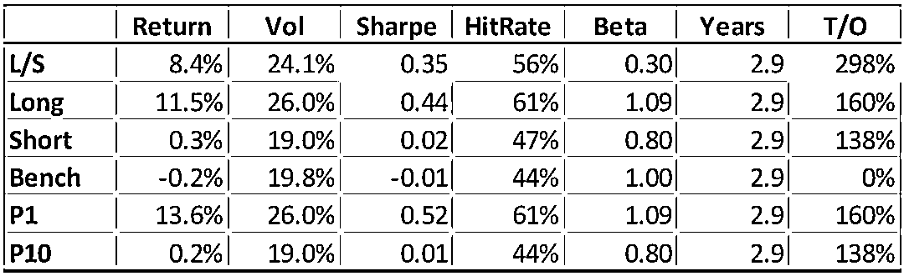

# JPMorgan 最新报告解读：基于 NLP 的 A 股交易策略（附下载）

> 原文：[`mp.weixin.qq.com/s?__biz=MzAxNTc0Mjg0Mg==&mid=2653303713&idx=1&sn=f6dfd1d473421430e54847644f51272c&chksm=802df1b4b75a78a2a01fd8ac58a608eb4d8ab44b723ecccc84a6b92de967adb9237280191961&scene=27#wechat_redirect`](http://mp.weixin.qq.com/s?__biz=MzAxNTc0Mjg0Mg==&mid=2653303713&idx=1&sn=f6dfd1d473421430e54847644f51272c&chksm=802df1b4b75a78a2a01fd8ac58a608eb4d8ab44b723ecccc84a6b92de967adb9237280191961&scene=27#wechat_redirect)

量化投资与机器学习微信公众号，是业内垂直于**Quant、Fintech、AI、ML**等领域的**量化类主流自媒体。**公众号拥有来自**公募、私募、券商、期货、投行、保险**等众多圈内**18W+**关注者。每日发布行业前沿研究成果和最新量化资讯。

作者：编辑部 | Allen、1+1=6

公众号决定从 2020 年 7 月开始，**每周一**将推出一期有关全球**对冲基金、量化投研、金融机器学习、**机构招聘****等方面的周刊。为大家带来**最****新、最前沿**的**投研、资讯**内容，希望各位读者能够喜欢。

***1***

**前言**

今天，公众号刚刚通过 ChinaScope（数库）拿到了 J.P. Morgan（摩根大通）关于中国 A 股市场的量化研究报告：  

**获取完整报告，见文末**

也是难得，很少看到有国外投行量化部门专门写有关 A 股情绪方面的研究。接下来小编就为大家做一个全面的解读分享，**文末**是这篇报告**最重要的结论**。

***2*** 

**另类数据在中国**

在量化交易中，如何获取适当的数据用于开发和测试交易策略，往往是投资者面临的难题随着技术的发展，获取大数据的成本不断降低，但历史价格等传统数据已完全无法满足投资者需求，可挖掘 Alpha 已基本消失。因此尝试从**另类数据**（Alternative Data）中提**取交易信号逐步成为业界主流趋****势**。

在海外市场，量化投资领域对另类数据的应用在过去两三年内已实现阶段性发展，**另类数据如资讯情绪，产业链及供应链数据等已被广泛纳入量化策略。**

未来几年， 公众号认为：**另类数据在中国量化机构的广泛应用将是必然的。**今天的这篇报告就是一个很好的见证。J.P. Morgan 的这篇研究报告采用 ChinaScope（数库）的 SmarTag 新闻分析数据，所以**对**于******A 股投资者来说，是一个很好的参考**。

***3***

**正文详细解读**

首先，作者介绍了他们在 NLP 方面的一些研究历程，从 2017 年的***《NLP for Sentiment Detection》***开始，J.P.Morgan 使用了**5 年，总计超过 25 万份的报告**，搭建了其自己的情绪分类库。使用分析师对其报告的评级（OW、N 和 UW），为其提供了超过 75000 个标记样本，以学习报告中好情绪和坏情绪之间的差异。然后，他们再使用训练好的分类器来阅读基于英文的股票新闻，并使用情绪评分进行交易。这大概就是他们前几年所做的事情。 

但 J.P.Morgan 忽略了一个很重要的市场，那就是中国 A 股市场。原因是：在很大程度上，他们关注的更多是英语类新闻。虽然使用机器学习进行中文分类可以使用类似之前的训练方法，但这**需要大量的中文新闻流**。由此，ChinaScope（数库）脱颖而出，让 J.P.Morgan 的研究员们开始大展身手，这才有了今天的这份研究报告***《News Sentiment in China》***

**为何 J.P.Morgan 会选择 ChinaScope（数库）？**我们通过调查和咨询发现如下：

ChinaScope（数库）通过自主研发的资讯采集平台抓取了覆盖中国大陆主流财经媒体及主要行业网站，总计**3200+**的新闻版面，每日新增新闻量约**25000 条**。

他们对于每一篇抓取到的新闻均做了以下处理：

1、**提取基本信息：**包括新闻的标题、时间、来源、智能摘要

2、**智能标签识别：**识别新闻中存在的法人及自然人实体、SAM 产品、行业、事件及概念。除标签识别外，算法还能给出这篇新闻与这些标签的相关程度。

3、**情绪判定：**对于整篇新闻及新闻中涉及的主体均做情绪判定。情绪一共分为三个类型，包括正面、负面及中性。算法会给出这个主体在三类情绪的概率分布，取概率最大的情绪类型作为该主体的情绪。例如，某篇新闻中提及股票 A，算法给出 A 的情绪概率为 30%中性、10%负面及 60%正面。那么在这篇新闻中，股票 A 的情绪就为正面。

如下图所示：

再和交易日进行匹配：

**数库情绪因子**

ChinaScope（数库）抓取的信息源新闻更新频率（按照新闻站点抓取相邻两篇新闻更新时间差计算），集中分布在半个小时以内。新闻更新峰值主要集中在股市开盘及收盘前后。

由于日度信号可以有多种方式转换为月度因子，在 J.P.Morgan 的测试中，**他们对每个月每个股票的日度情绪计算平均值。这样使得新闻情绪因子在沪深 300 的覆盖度上大幅提升。虽然有些股票之间的关注度不同，但我们只是计算的股票月度的平均情绪，并没有考虑关注度（即热度）。**具体方法详见报告。

由于新闻情绪因子的高换手率，所以 J.P. Morgan 还结合情绪因子与其他低换手的因子模型，综合进行回测。比如将 ChinaScope 情绪与 P/B 一起测试，夏普从之前的 0.49 上升到 1.03。具体方法详见报告。

作者还对择时与截面上的因子组合策略进行了研究比较，发现：**一些量化信号有非常强劲的表现，但由于交易成本高，根本无法盈利**。它们的特点往往是在市场周期中获得强劲的收益，但换手率高，信号衰减快。试图将这些“烧钱”的因子纳入较慢的复合模型，虽然会提高收益，但代价就是增加交易成本，这种交换往往是不值得的！

基于上面的思路，在下面的图表中，我们看到内圈的股票是基于 BP 因子筛选出来比较便宜的股票，然后在后续的调仓期再基于情绪因子，买入情绪最好的股票（绿色），对于未买入的股票（红色）保持跟踪，等待情绪好转再买入，这样至少我们可以在一开始避免情绪不好的股票。

***4***

**报告中最重要的结论**

ChinaScope（数库）的新闻情绪因子在 A 股中表现强劲，产生了很好的交易信号，这与 J.P. Morgan 从英语新闻测试中观察到的情绪信号表现以及量化策略表现基本一致。

在报告中，J.P. Morgan 还做了以下一系列的回测：

Book/Market RAW factor in 

the CSI300 (20bps t-costs each way)

Book/Market and ChinaScope Sentiment Z-Score COMPOSITE (50:50) 

with 20bps each way t- costs

Book/Market TRADE TIMED with ChinaScope Sentiment

with 20bps each way t-costs

**很明显，择时的回测结果比截面上的因子组合效果来的更好，因为这样我们能更好区分 BP 因子与情绪因子的衰减。**

***6*** 

**如何下载报告** 

因为一些要求，此报告只提供给机构投资者。大家 **点击阅读原文****，**就可以申请下载了（**页面底部：研究报告栏目**），一般都会通过审核的，操作很简单。另外，据公众号了解到，J.P. Morgan 会在接下来的日子里联合 ChinaScope（数库）定期的发布有关 A 股的量化研究报告，大家敬请期待！**击阅读原文，查看完整报告！**